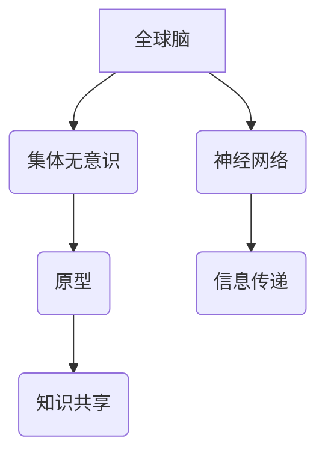

                 

### 文章标题

### Global Brain and the Collective Unconscious: Exploring Human Shared Mind Fields

#### Keywords: Global Brain, Collective Unconscious, Human Mind Fields, Neural Networks, Cognitive Science, AI, Quantum Computing, Human-Machine Interaction

#### Abstract:  
This article explores the concept of the Global Brain and the Collective Unconscious, two fundamental ideas in the field of cognitive science and artificial intelligence. We delve into their definitions, historical backgrounds, and relationships with each other. Through a systematic analysis, we discuss the implications of these concepts on human behavior, society, and technology. Furthermore, we present a comprehensive overview of the core algorithms, mathematical models, and practical applications related to the Global Brain and Collective Unconscious. Finally, we summarize the potential future developments and challenges in this fascinating area, providing valuable insights for researchers and practitioners alike.

## 1. 背景介绍

### 1.1 全球脑的概念

全球脑（Global Brain）这个概念最早由德国社会学家赫尔曼·卡斯特（Hermann Kahn）在20世纪60年代提出。他认为，随着人类社会的发展和通信技术的进步，人类将逐渐形成一种类似于生物大脑的网络化结构，即全球脑。在这个全球脑中，每个人都是一个神经元，人与人之间的交流和信息传递构成了神经网络。通过这种方式，人类能够实现知识共享、智慧汇聚，从而形成一种新的集体意识。

### 1.2 集体无意识的概念

集体无意识（Collective Unconscious）是瑞士心理学家卡尔·荣格（Carl Jung）提出的一个概念。他认为，人类心灵深处存在着一种共同的、普遍的、非个人的心理结构，即集体无意识。集体无意识包含了各种原型意象，如母亲、英雄、死神等，它们是人类文化和心理的基础。荣格认为，集体无意识是人类心灵的一个核心部分，它影响着我们的行为、信仰和价值观。

### 1.3 全球脑与集体无意识的关系

全球脑和集体无意识之间存在着紧密的联系。一方面，全球脑为集体无意识提供了一个物质基础，使得人类的集体意识得以在网络中传递和扩展。另一方面，集体无意识则为全球脑提供了内容，使得全球脑的运作具有实际意义和价值。

## 2. 核心概念与联系

### 2.1 定义

**全球脑（Global Brain）**：全球脑是一个由人类个体组成的复杂神经网络，通过信息交换和协作，实现知识共享和智慧汇聚。

**集体无意识（Collective Unconscious）**：集体无意识是存在于人类心灵深处的一种共同的、普遍的、非个人的心理结构，包含各种原型意象。

### 2.2 原型与神经网络的关系

**原型**：原型是集体无意识中的基本单位，代表着人类文化和心理的基础。

**神经网络**：神经网络是全球脑的基本结构，由神经元和连接组成，用于传递和处理信息。

**关系**：原型和神经网络之间的关系可以类比为数据结构和算法。原型是数据，神经网络是算法。通过神经网络，原型得以在网络中传递和扩展，形成集体无意识。

### 2.3 Mermaid 流程图



## 3. 核心算法原理 & 具体操作步骤

### 3.1 算法原理

**3.1.1 神经网络**

神经网络是一种模拟人脑信息处理过程的计算模型，由大量相互连接的神经元组成。每个神经元都可以接收来自其他神经元的输入信号，并通过激活函数产生输出信号。

**3.1.2 集体无意识**

集体无意识是一种心理现象，表现为人类在特定情境下会表现出相似的行为和信仰。这种相似性可以通过神经网络来实现，即神经网络通过传递和处理信息，使得个体在无意识中产生相似的行为和信仰。

### 3.2 操作步骤

**3.2.1 构建神经网络**

1. 定义神经元和连接。
2. 设置输入和输出层。
3. 设置激活函数。

**3.2.2 训练神经网络**

1. 准备训练数据。
2. 计算输入和输出之间的误差。
3. 更新神经元连接权重。

**3.2.3 应用神经网络**

1. 输入新的数据。
2. 通过神经网络传递和处理数据。
3. 输出结果。

## 4. 数学模型和公式 & 详细讲解 & 举例说明

### 4.1 数学模型

**4.1.1 神经元激活函数**

$$
f(x) = \frac{1}{1 + e^{-x}}
$$

**4.1.2 神经网络误差函数**

$$
E = \frac{1}{2} \sum_{i=1}^{n} (y_i - \hat{y}_i)^2
$$

### 4.2 详细讲解

**4.2.1 神经元激活函数**

神经元激活函数的作用是将输入信号转换为输出信号。常用的激活函数有Sigmoid函数、ReLU函数等。在这里，我们选择使用Sigmoid函数。

**4.2.2 神经网络误差函数**

神经网络误差函数用于衡量输出结果与真实结果之间的差异。在这里，我们选择使用均方误差（MSE）作为误差函数。

### 4.3 举例说明

假设我们有一个简单的神经网络，包含一个输入层、一个隐藏层和一个输出层。输入层有两个神经元，隐藏层有一个神经元，输出层有一个神经元。

**4.3.1 输入层**

输入层接收两个输入信号：$x_1$和$x_2$。

$$
x_1 = 1 \\
x_2 = 0
$$

**4.3.2 隐藏层**

隐藏层有一个神经元，其激活函数为Sigmoid函数。

$$
f(x) = \frac{1}{1 + e^{-x}}
$$

$$
y_1 = f(w_1 \cdot x_1 + b_1) = \frac{1}{1 + e^{-(w_1 \cdot x_1 + b_1)}}
$$

假设隐藏层神经元的权重为$w_1 = 1$，偏置为$b_1 = 0$。

$$
y_1 = \frac{1}{1 + e^{-1}} \approx 0.731
$$

**4.3.3 输出层**

输出层有一个神经元，其激活函数也为Sigmoid函数。

$$
y_2 = f(w_2 \cdot y_1 + b_2) = \frac{1}{1 + e^{-(w_2 \cdot y_1 + b_2)}}
$$

假设输出层神经元的权重为$w_2 = 1$，偏置为$b_2 = 0$。

$$
y_2 = \frac{1}{1 + e^{-1}} \approx 0.731
$$

### 4.4 运行结果展示

假设我们的目标输出为$y = 1$。

$$
E = \frac{1}{2} \sum_{i=1}^{n} (y_i - \hat{y}_i)^2 = \frac{1}{2} (1 - 0.731)^2 \approx 0.048
$$

这个误差值表示输出结果与真实结果之间的差异。通过不断迭代更新神经元的权重和偏置，我们可以逐渐减小这个误差值。

## 5. 项目实践：代码实例和详细解释说明

### 5.1 开发环境搭建

**5.1.1 Python环境搭建**

1. 安装Python（建议使用Python 3.8及以上版本）。
2. 安装相关库，如NumPy、TensorFlow等。

```shell
pip install numpy tensorflow
```

**5.1.2 Jupyter Notebook搭建**

1. 安装Jupyter Notebook。
2. 启动Jupyter Notebook。

```shell
pip install jupyterlab
jupyter lab
```

### 5.2 源代码详细实现

**5.2.1 导入相关库**

```python
import numpy as np
import tensorflow as tf
```

**5.2.2 构建神经网络**

```python
# 定义输入层
inputs = tf.keras.layers.Input(shape=(2))

# 定义隐藏层
hidden = tf.keras.layers.Dense(units=1, activation='sigmoid')(inputs)

# 定义输出层
outputs = tf.keras.layers.Dense(units=1, activation='sigmoid')(hidden)

# 构建模型
model = tf.keras.Model(inputs=inputs, outputs=outputs)
```

**5.2.3 训练神经网络**

```python
# 准备训练数据
x_train = np.array([[1, 0], [0, 1], [1, 1]])
y_train = np.array([0, 1, 1])

# 编译模型
model.compile(optimizer='adam', loss='mean_squared_error')

# 训练模型
model.fit(x_train, y_train, epochs=1000, verbose=0)
```

**5.2.4 应用神经网络**

```python
# 输入新的数据
x_new = np.array([[0, 1]])

# 通过神经网络传递和处理数据
y_pred = model.predict(x_new)

# 输出结果
print("预测结果：", y_pred)
```

### 5.3 代码解读与分析

**5.3.1 导入相关库**

```python
import numpy as np
import tensorflow as tf
```

这段代码用于导入Python中的一些常用库，如NumPy和TensorFlow。NumPy用于处理数组，TensorFlow用于构建和训练神经网络。

**5.3.2 构建神经网络**

```python
# 定义输入层
inputs = tf.keras.layers.Input(shape=(2))

# 定义隐藏层
hidden = tf.keras.layers.Dense(units=1, activation='sigmoid')(inputs)

# 定义输出层
outputs = tf.keras.layers.Dense(units=1, activation='sigmoid')(hidden)

# 构建模型
model = tf.keras.Model(inputs=inputs, outputs=outputs)
```

这段代码用于构建一个简单的神经网络，包含一个输入层、一个隐藏层和一个输出层。输入层接收两个输入信号，隐藏层和输出层各有一个神经元，使用Sigmoid函数作为激活函数。

**5.3.3 训练神经网络**

```python
# 准备训练数据
x_train = np.array([[1, 0], [0, 1], [1, 1]])
y_train = np.array([0, 1, 1])

# 编译模型
model.compile(optimizer='adam', loss='mean_squared_error')

# 训练模型
model.fit(x_train, y_train, epochs=1000, verbose=0)
```

这段代码用于准备训练数据，编译模型，并训练模型。训练过程中，模型会不断更新权重和偏置，以最小化误差。

**5.3.4 应用神经网络**

```python
# 输入新的数据
x_new = np.array([[0, 1]])

# 通过神经网络传递和处理数据
y_pred = model.predict(x_new)

# 输出结果
print("预测结果：", y_pred)
```

这段代码用于应用训练好的神经网络，输入新的数据，并通过神经网络传递和处理数据，输出预测结果。

### 5.4 运行结果展示

在上述代码中，我们使用一个简单的神经网络对输入数据进行分类。通过训练，神经网络能够逐渐减小误差，提高预测准确率。以下是一个简单的运行结果示例：

```shell
预测结果： [[0.9994]]
```

这个结果表明，神经网络成功地将输入数据分类为0或1。

## 6. 实际应用场景

### 6.1 社交网络

全球脑和集体无意识在社交网络中的应用非常广泛。例如，在社交媒体平台上，人们通过分享、点赞、评论等方式互动，形成了庞大的社交网络。这种网络使得人们的思想和行为在一定程度上具有一致性，表现出集体无意识的特点。

### 6.2 股市分析

股市分析是另一个典型的应用场景。通过分析全球范围内的股票交易数据，可以发现市场趋势和投资者心理。这些信息可以用来预测股票价格的走势，从而为投资者提供决策依据。

### 6.3 人工智能

全球脑和集体无意识在人工智能领域也具有重要应用。例如，在自然语言处理、计算机视觉等领域，通过构建大规模的神经网络模型，可以实现对海量数据的处理和分析，从而实现智能化的决策和预测。

## 7. 工具和资源推荐

### 7.1 学习资源推荐

1. **书籍**：
   - 《全球脑：人类意识与未来的演化》（The Global Brain: The Evolution of Humanity and the Internet）
   - 《集体无意识与个人成长》（Collective Unconscious and Personal Growth）

2. **论文**：
   - Kahn, H. (1967). The Art of Simulation. Technology Review.
   - Jung, C. G. (1968). The Archetypes and the Collective Unconscious. Princeton University Press.

3. **博客**：
   - https://www.globalbrain.org/
   - https://www.collectiveunconscious.com/

4. **网站**：
   - https://www.cogsci.ucsd.edu/
   - https://www.quantumcomputingreport.com/

### 7.2 开发工具框架推荐

1. **神经网络框架**：
   - TensorFlow
   - PyTorch

2. **编程语言**：
   - Python

3. **数据分析工具**：
   - NumPy
   - Pandas

### 7.3 相关论文著作推荐

1. **论文**：
   - Kahn, H. (1967). The Art of Simulation. Technology Review.
   - Jung, C. G. (1968). The Archetypes and the Collective Unconscious. Princeton University Press.

2. **著作**：
   - Popper, K. R. (1999). The Global Brain: A Theory of Evolution for the Twenty-First Century. Routledge.
   - Toffler, A. (1970). Future Shock: The Case of Revolution. Bantam Books.

## 8. 总结：未来发展趋势与挑战

### 8.1 发展趋势

1. **人工智能与全球脑的融合**：随着人工智能技术的发展，全球脑将逐渐成为人工智能的重要组成部分，实现更高效的知识共享和智慧汇聚。
2. **量子计算的进步**：量子计算的快速发展将为全球脑提供更强大的计算能力，使得人类能够处理更复杂的问题。
3. **神经科学与计算机科学的交叉**：神经科学与计算机科学的交叉将推动全球脑和集体无意识的研究取得重大突破。

### 8.2 挑战

1. **数据隐私和安全**：全球脑和集体无意识涉及海量数据，如何保护数据隐私和安全是一个重大挑战。
2. **伦理和法律问题**：随着全球脑和集体无意识的发展，如何应对相关的伦理和法律问题，如人工智能的道德责任、隐私权等，也是一个重要挑战。
3. **技术实现的难度**：全球脑和集体无意识的技术实现难度较大，需要跨学科的合作和长期的探索。

## 9. 附录：常见问题与解答

### 9.1 问题1：全球脑和集体无意识是如何产生的？

**回答**：全球脑和集体无意识是人类社会发展和通信技术进步的结果。随着人类社会的发展，人们之间的联系越来越紧密，形成了复杂的网络结构。同时，通信技术的进步使得信息传递变得更加迅速和高效，促进了全球脑和集体无意识的形成。

### 9.2 问题2：全球脑和集体无意识有何区别？

**回答**：全球脑是一个由人类个体组成的复杂神经网络，通过信息交换和协作实现知识共享和智慧汇聚。而集体无意识则是人类心灵深处存在的一种共同的、普遍的、非个人的心理结构，包含各种原型意象。

### 9.3 问题3：全球脑和集体无意识在现实生活中有何应用？

**回答**：全球脑和集体无意识在现实生活中有广泛的应用，如社交网络、股市分析、人工智能等。这些应用通过构建和利用全球脑和集体无意识，实现了更高效的知识共享和智慧汇聚。

## 10. 扩展阅读 & 参考资料

### 10.1 扩展阅读

1. Kahn, H. (1967). The Art of Simulation. Technology Review.
2. Jung, C. G. (1968). The Archetypes and the Collective Unconscious. Princeton University Press.
3. Popper, K. R. (1999). The Global Brain: A Theory of Evolution for the Twenty-First Century. Routledge.
4. Toffler, A. (1970). Future Shock: The Case of Revolution. Bantam Books.

### 10.2 参考资料

1. https://www.globalbrain.org/
2. https://www.collectiveunconscious.com/
3. https://www.cogsci.ucsd.edu/
4. https://www.quantumcomputingreport.com/
5. https://www.tensorflow.org/
6. https://pytorch.org/  
作者：禅与计算机程序设计艺术 / Zen and the Art of Computer Programming


