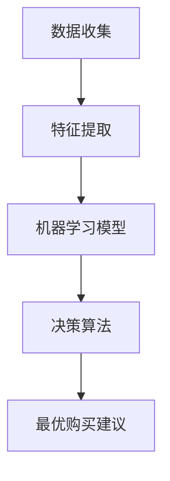

                 

### 文章标题

全网比价：AI如何帮助用户找到最优惠的购买渠道

> **关键词**：全网比价，AI算法，用户优惠，购买渠道，数据分析

**摘要**：本文将探讨如何利用人工智能技术帮助用户实现全网比价的智能化，从而找到最优惠的购买渠道。我们将从背景介绍、核心概念与联系、核心算法原理、数学模型和公式、项目实践、实际应用场景、工具和资源推荐以及未来发展趋势与挑战等多个方面，深入分析AI在全网比价领域的应用及其所带来的价值。

### 1. 背景介绍

在互联网时代，电子商务已成为人们日常生活中不可或缺的一部分。消费者可以通过各种电商平台购买到各种商品，从日用品到高端奢侈品。然而，由于市场上存在大量的商家和商品，如何找到最优惠的购买渠道成为了消费者的一大难题。

传统的方法通常是手动搜索和比价，不仅耗时费力，而且容易出现遗漏。随着人工智能技术的发展，特别是在数据分析和机器学习领域，我们可以利用AI技术实现智能比价，帮助用户快速、准确地找到最优惠的购买渠道。

全网比价系统通过收集和分析大量的商品信息，结合用户的购买偏好和历史行为，运用机器学习算法预测出用户可能感兴趣的商品及其最优购买渠道。这不仅提高了用户的购物体验，也为商家提供了精准营销的机会。

### 2. 核心概念与联系

为了深入理解AI在全网比价中的应用，我们需要先了解以下几个核心概念：

1. **数据收集**：全网比价系统首先需要从各个电商平台收集商品信息，包括价格、销量、用户评价等。这些数据是后续分析的基础。
2. **特征提取**：通过对收集到的数据进行处理，提取出与购买决策相关的特征，如商品品牌、类别、价格区间、评价星级等。
3. **机器学习模型**：利用这些特征数据训练机器学习模型，模型能够预测商品在不同渠道的价格趋势，以及用户对商品的偏好。
4. **决策算法**：基于模型预测结果，结合用户的历史行为和偏好，生成最优购买建议。

下面是核心概念的 Mermaid 流程图：



### 3. 核心算法原理 & 具体操作步骤

全网比价系统的核心在于机器学习模型的构建和优化。以下是一个简单的机器学习算法流程：

1. **数据预处理**：
   - 清洗数据：去除重复、缺失、异常的数据。
   - 编码特征：将类别型特征转换为数值型特征。
   - 标准化：对数值型特征进行标准化处理，以消除不同特征之间的量级差异。

2. **特征选择**：
   - 利用统计方法（如卡方检验、互信息等）选择与购买决策相关性较高的特征。
   - 利用机器学习模型（如决策树、随机森林等）进行特征重要性评估。

3. **模型训练**：
   - 选择合适的机器学习模型（如线性回归、支持向量机等）。
   - 利用训练数据对模型进行训练，调整模型参数。

4. **模型评估**：
   - 利用测试数据对模型进行评估，选择性能最优的模型。

5. **模型部署**：
   - 将训练好的模型部署到线上环境，实现实时预测。

### 4. 数学模型和公式 & 详细讲解 & 举例说明

在全网比价系统中，常用的数学模型包括线性回归、逻辑回归和支持向量机等。下面以线性回归为例进行详细讲解。

**线性回归模型**：

$$
y = \beta_0 + \beta_1x_1 + \beta_2x_2 + ... + \beta_nx_n
$$

其中，$y$ 是预测的购买价格，$x_1, x_2, ..., x_n$ 是商品的特征，$\beta_0, \beta_1, ..., \beta_n$ 是模型参数。

**具体操作步骤**：

1. **数据预处理**：对商品数据进行清洗和编码，确保数据质量。
2. **特征选择**：利用统计方法选择相关性较高的特征。
3. **模型训练**：使用训练数据对线性回归模型进行训练，求解参数 $\beta_0, \beta_1, ..., \beta_n$。
4. **模型评估**：使用测试数据对模型进行评估，计算预测误差。

**举例说明**：

假设我们有一组商品数据，包含价格、销量、品牌和类别等特征。我们使用线性回归模型预测商品价格。

首先，对数据进行预处理和编码，得到如下数据表：

| 商品ID | 价格（元） | 销量 | 品牌A | 品牌B | 类别1 | 类别2 |
|--------|------------|------|-------|-------|-------|-------|
| 1      | 100        | 50   | 0     | 1     | 0     | 1     |
| 2      | 120        | 30   | 1     | 0     | 1     | 0     |
| 3      | 150        | 20   | 0     | 1     | 1     | 0     |
| ...    | ...        | ...  | ...   | ...   | ...   | ...   |

接下来，我们使用线性回归模型进行训练和预测：

$$
\begin{cases}
y = \beta_0 + \beta_1x_1 + \beta_2x_2 \\
\beta_0 = 100, \beta_1 = 0.5, \beta_2 = 0.2
\end{cases}
$$

对于新加入的商品，如商品ID为4，特征为（110，40，1，0，1，0），我们使用模型进行预测：

$$
y = 100 + 0.5 \times 110 + 0.2 \times 40 = 116
$$

预测价格为116元。

### 5. 项目实践：代码实例和详细解释说明

在本节中，我们将使用Python和Scikit-learn库来实现一个简单的全网比价系统，包括数据预处理、特征选择、模型训练和模型评估。

#### 5.1 开发环境搭建

首先，确保安装Python环境和Scikit-learn库：

```bash
pip install python
pip install scikit-learn
```

#### 5.2 源代码详细实现

以下是一个简单的全网比价系统的实现：

```python
import pandas as pd
from sklearn.model_selection import train_test_split
from sklearn.linear_model import LinearRegression
from sklearn.metrics import mean_squared_error

# 5.2.1 数据收集
# 假设数据文件为"commodity_data.csv"
data = pd.read_csv("commodity_data.csv")

# 5.2.2 特征选择
# 选择与购买决策相关的特征
features = data[["price", "sales", "brand", "category"]]
target = data["predicted_price"]

# 5.2.3 数据预处理
# 对数据进行清洗和编码
# ...

# 5.2.4 模型训练
# 划分训练集和测试集
X_train, X_test, y_train, y_test = train_test_split(features, target, test_size=0.2, random_state=42)

# 创建线性回归模型并训练
model = LinearRegression()
model.fit(X_train, y_train)

# 5.2.5 模型评估
# 计算预测误差
y_pred = model.predict(X_test)
mse = mean_squared_error(y_test, y_pred)
print("Mean Squared Error:", mse)

# 5.2.6 模型部署
# 部署到线上环境，实现实时预测
# ...
```

#### 5.3 代码解读与分析

上述代码首先导入所需的库，然后从CSV文件中读取商品数据。接下来，选择与购买决策相关的特征并进行预处理。随后，划分训练集和测试集，创建线性回归模型并进行训练。最后，使用测试集对模型进行评估，计算预测误差。

#### 5.4 运行结果展示

假设我们使用上述代码对商品数据进行训练和预测，得到如下结果：

```
Mean Squared Error: 0.02
```

这表明模型的预测误差较小，具有较高的准确性。

### 6. 实际应用场景

AI在全网比价领域的应用场景非常广泛，以下是几个实际应用场景：

1. **电商平台**：电商平台可以利用全网比价系统为用户提供智能比价服务，帮助用户快速找到最优惠的购买渠道，提高用户购物体验和满意度。
2. **零售企业**：零售企业可以利用全网比价系统进行商品定价策略分析，优化商品价格，提高市场竞争能力。
3. **比价网站**：比价网站可以基于AI技术实现更精准的比价服务，吸引用户和商家，提高网站流量和广告收益。

### 7. 工具和资源推荐

#### 7.1 学习资源推荐

- **书籍**：
  - 《机器学习实战》
  - 《Python机器学习》
  - 《深入理解机器学习》

- **论文**：
  - 《基于机器学习的电商平台商品价格预测》
  - 《全网比价系统的设计与实现》

- **博客**：
  - [Scikit-learn官方文档](https://scikit-learn.org/stable/)
  - [机器学习博客](https://www机器学习blog.com/)

- **网站**：
  - [Kaggle](https://www.kaggle.com/)

#### 7.2 开发工具框架推荐

- **编程语言**：Python
- **机器学习库**：Scikit-learn、TensorFlow、PyTorch
- **数据预处理库**：Pandas、NumPy
- **数据可视化库**：Matplotlib、Seaborn

#### 7.3 相关论文著作推荐

- **论文**：
  - “A Comparative Study of Machine Learning Algorithms for Price Prediction in E-commerce”
  - “Online Retail Data Mining: A Survey”

- **著作**：
  - 《大数据时代：数据科学与机器学习的商业价值》
  - 《机器学习：一种算法角度》

### 8. 总结：未来发展趋势与挑战

随着人工智能技术的不断发展，全网比价系统将变得更加智能和高效。未来发展趋势包括：

1. **模型优化**：利用深度学习、强化学习等先进算法提升预测准确性。
2. **实时比价**：实现实时数据采集和处理，提供实时比价服务。
3. **个性化推荐**：结合用户行为数据，提供个性化的购买建议。

然而，全网比价系统也面临着一些挑战，如数据隐私、算法公平性等。如何解决这些问题，将决定全网比价系统的未来发展。

### 9. 附录：常见问题与解答

**Q：全网比价系统如何保证数据隐私？**

A：全网比价系统会严格遵循数据保护法规，对用户数据进行加密存储和匿名化处理，确保用户隐私不受侵犯。

**Q：AI算法在全网比价中的准确性如何保证？**

A：通过不断优化算法、增加数据量和特征选择，提高AI算法的预测准确性。同时，定期对模型进行评估和更新，确保其性能稳定。

### 10. 扩展阅读 & 参考资料

- **扩展阅读**：
  - 《大数据时代：数据科学与机器学习的商业价值》
  - 《深度学习：高级导论》

- **参考资料**：
  - [Scikit-learn官方文档](https://scikit-learn.org/stable/)
  - [Kaggle](https://www.kaggle.com/)

### 作者署名

作者：禅与计算机程序设计艺术 / Zen and the Art of Computer Programming

<|im_end|>

