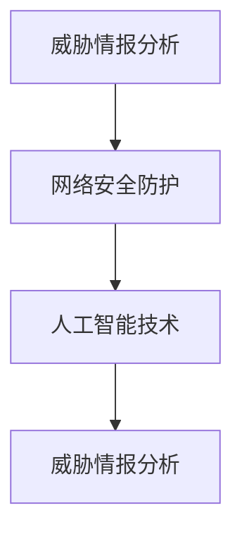
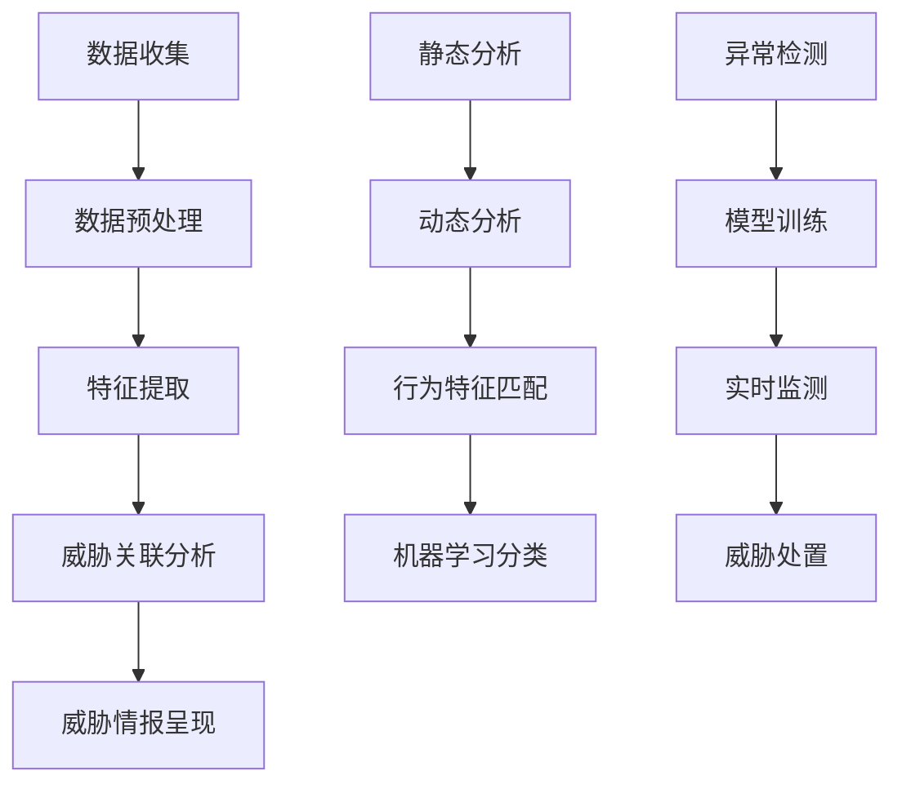

                 

### 1. 背景介绍

在现代网络安全领域，随着网络攻击手段的日益复杂化和多样化，传统的安全防护手段已经难以应对不断涌现的新威胁。在这种背景下，360公司于2025年推出了安全大脑项目，旨在构建一个智能化的网络安全防护体系，为企业和个人提供全面的网络安全解决方案。

安全大脑项目是360公司在网络安全领域的一次重要探索和突破。它通过整合大数据、人工智能、云计算等先进技术，实现实时监测、智能分析、快速响应和安全防护等功能。安全大脑项目不仅能够对已知威胁进行有效防护，还能够通过深度学习和人工智能技术，发现并防御未知威胁。

为了推动安全大脑项目的发展，360公司每年都会举办多次技术交流会议，邀请国内外网络安全专家共同探讨网络安全领域的最新技术和发展趋势。此外，360公司还定期发布《360安全大脑报告》，全面分析网络安全态势，为企业和个人提供权威的网络安全建议。

本次360公司2025安全大脑社招威胁情报分析面试题，旨在选拔具备专业能力和创新思维的人才，为安全大脑项目注入新的活力。面试题涵盖了网络安全领域的多个方面，包括威胁情报分析、网络安全防护、人工智能技术等。通过对这些面试题的解答，我们可以更深入地了解网络安全领域的现状和未来发展方向。

### 2. 核心概念与联系

#### 2.1 威胁情报分析

威胁情报分析是安全大脑项目的核心组成部分，它通过对网络攻击事件的收集、分析、处理和呈现，为企业提供实时的安全威胁预警和应对策略。威胁情报分析的核心概念包括以下几方面：

1. **威胁情报来源**：威胁情报的来源主要包括安全厂商、安全社区、安全研究机构和公开的网络数据。这些数据来源能够提供丰富的威胁信息和攻击手段，帮助安全团队提前预防和应对潜在威胁。

2. **威胁情报分类**：根据威胁的性质和影响范围，威胁情报可以分为恶意软件、网络钓鱼、DDoS攻击、数据泄露等不同类别。不同类别的威胁情报需要采取不同的分析方法和应对策略。

3. **威胁情报处理流程**：威胁情报处理流程包括数据收集、数据清洗、数据分析和威胁情报呈现等环节。数据收集主要通过传感器、入侵检测系统、日志分析等手段实现；数据清洗主要对数据进行去重、去噪和格式转换；数据分析主要利用机器学习和人工智能技术进行威胁特征提取和关联分析；威胁情报呈现则通过可视化工具和报表向用户展示威胁态势。

#### 2.2 网络安全防护

网络安全防护是安全大脑项目的另一个重要组成部分，它通过构建完善的网络安全体系，保护企业网络安全免受各种威胁。网络安全防护的核心概念包括以下几方面：

1. **网络安全架构**：网络安全架构包括防火墙、入侵检测系统、反病毒软件、安全信息和事件管理系统（SIEM）等不同层次的安全设备。这些设备协同工作，实现对网络安全的全方位防护。

2. **安全策略**：安全策略是企业网络安全的基本原则和规范，包括安全政策、安全标准和安全操作流程等。安全策略的制定需要根据企业的业务特点和风险承受能力进行个性化定制。

3. **安全监控与响应**：安全监控与响应是网络安全防护的关键环节，通过实时监测网络流量、系统日志和安全事件，发现并应对潜在的威胁。安全监控与响应主要包括异常检测、威胁处置、事故调查和安全培训等。

#### 2.3 人工智能技术

人工智能技术在安全大脑项目中发挥着重要作用，它通过深度学习、自然语言处理、计算机视觉等技术，提升威胁情报分析、网络安全防护和事故响应的效率和准确性。人工智能技术涉及的核心概念包括：

1. **机器学习**：机器学习是人工智能的核心技术，它通过分析大量数据，自动发现数据中的规律和模式，用于威胁识别、行为分析和决策支持。

2. **深度学习**：深度学习是机器学习的一个分支，它通过多层神经网络模型，实现对复杂数据的高效建模和特征提取。深度学习在网络安全领域具有广泛的应用，如恶意代码检测、威胁情报分析等。

3. **自然语言处理**：自然语言处理是人工智能的一个重要分支，它通过计算机程序实现人类语言的理解和生成。在安全领域，自然语言处理技术可以用于文本分析、威胁描述、情报呈现等。

4. **计算机视觉**：计算机视觉是人工智能的一个重要分支，它通过计算机对图像和视频进行处理和分析，实现对场景的感知和理解。在安全领域，计算机视觉技术可以用于监控视频分析、入侵检测等。

#### 2.4 Mermaid 流程图

以下是一个简单的 Mermaid 流程图，展示了安全大脑项目中的威胁情报分析、网络安全防护和人工智能技术之间的联系。



在这个流程图中，威胁情报分析作为起点，通过网络数据和安全设备的收集和监测，为网络安全防护提供情报支持。网络安全防护通过对威胁情报的分析和应对，实现对网络安全的保障。同时，人工智能技术在威胁情报分析和网络安全防护中发挥着关键作用，提升安全大脑项目的整体效能。

### 3. 核心算法原理 & 具体操作步骤

在安全大脑项目中，核心算法原理主要涉及威胁情报分析、恶意代码检测、入侵检测等方面。以下将分别介绍这些算法原理的具体操作步骤。

#### 3.1 威胁情报分析

威胁情报分析是安全大脑项目的核心组成部分，其具体操作步骤如下：

1. **数据收集**：通过传感器、入侵检测系统、日志分析等手段，收集网络中的威胁数据，如恶意代码、网络流量、系统日志等。

2. **数据预处理**：对收集到的威胁数据进行去重、去噪和格式转换，确保数据的质量和一致性。

3. **特征提取**：利用机器学习和深度学习技术，对预处理后的数据进行特征提取，提取出与威胁相关的特征，如恶意代码的特征、网络流量的特征等。

4. **威胁关联分析**：通过关联分析技术，将提取出的威胁特征与已知威胁进行匹配，识别潜在的威胁。

5. **威胁情报呈现**：通过可视化工具和报表，将威胁情报以图形和表格的形式呈现给用户，帮助用户了解网络安全态势。

#### 3.2 恶意代码检测

恶意代码检测是安全大脑项目中的一项重要任务，其具体操作步骤如下：

1. **静态分析**：对恶意代码进行静态分析，提取出代码的结构和特征，如函数调用、指令序列等。

2. **动态分析**：将恶意代码放入沙箱中运行，观察其行为和输出，分析其恶意性质。

3. **行为特征匹配**：利用已知的恶意代码特征库，对静态和动态分析结果进行匹配，识别潜在的恶意代码。

4. **机器学习分类**：利用机器学习算法，对恶意代码进行分类和预测，提高检测的准确性和效率。

#### 3.3 入侵检测

入侵检测是安全大脑项目中的一项重要任务，其具体操作步骤如下：

1. **异常检测**：通过分析网络流量和系统日志，检测出异常行为和潜在入侵事件。

2. **模型训练**：利用已知的入侵事件数据，训练入侵检测模型，提取出入侵特征和模式。

3. **实时监测**：利用入侵检测模型，对网络流量和系统日志进行实时监测，发现并识别入侵事件。

4. **威胁处置**：针对识别出的入侵事件，采取相应的处置措施，如阻断攻击、报警通知等。

#### 3.4 Mermaid 流程图

以下是一个简单的 Mermaid 流程图，展示了威胁情报分析、恶意代码检测和入侵检测的具体操作步骤。



在这个流程图中，数据收集、数据预处理、特征提取和威胁情报呈现构成了威胁情报分析的基本流程；静态分析、动态分析、行为特征匹配和机器学习分类构成了恶意代码检测的基本流程；异常检测、模型训练、实时监测和威胁处置构成了入侵检测的基本流程。

### 4. 数学模型和公式 & 详细讲解 & 举例说明

在安全大脑项目中，数学模型和公式在威胁情报分析、恶意代码检测和入侵检测等方面发挥着重要作用。以下将详细讲解这些数学模型和公式的原理和应用。

#### 4.1 威胁情报分析

在威胁情报分析中，常用的数学模型包括贝叶斯网络、支持向量机（SVM）和神经网络等。以下是这些模型的原理和应用：

1. **贝叶斯网络**：

   贝叶斯网络是一种概率图模型，它通过图结构表示变量之间的依赖关系，并通过贝叶斯公式计算变量的后验概率。贝叶斯网络在威胁情报分析中的应用主要包括：

   - **威胁特征提取**：利用贝叶斯网络提取威胁的特征，将威胁特征表示为一个条件概率矩阵。
   - **威胁分类**：利用贝叶斯网络进行威胁分类，根据威胁特征计算每个类别的后验概率，选择概率最大的类别作为威胁的类别。

   举例说明：

   假设我们有两个威胁特征 \( A \) 和 \( B \)，分别表示恶意代码的静态特征和动态特征。根据贝叶斯网络，我们可以得到以下条件概率矩阵：

   $$P(A|B) = \frac{P(B|A)P(A)}{P(B)}$$

   其中， \( P(A) \) 和 \( P(B) \) 分别表示威胁特征 \( A \) 和 \( B \) 的先验概率； \( P(B|A) \) 表示在威胁特征 \( A \) 的条件下，威胁特征 \( B \) 的概率。

2. **支持向量机（SVM）**：

   支持向量机是一种监督学习算法，它通过找到最优超平面，将不同类别的数据分开。在威胁情报分析中，SVM常用于威胁分类。

   举例说明：

   假设我们有一个二分类问题，需要将恶意代码和正常代码分开。我们可以使用SVM找到最优超平面，公式如下：

   $$w^T x - b = 0$$

   其中， \( w \) 表示超平面的法向量； \( x \) 表示数据点； \( b \) 表示偏置。

3. **神经网络**：

   神经网络是一种模拟人脑神经元之间相互连接的计算机模型，它通过多层神经网络实现复杂函数的映射。在威胁情报分析中，神经网络常用于威胁特征提取和分类。

   举例说明：

   假设我们有一个多层神经网络，输入层有 \( n \) 个神经元，隐藏层有 \( m \) 个神经元，输出层有 \( k \) 个神经元。神经网络的激活函数可以使用ReLU函数：

   $$f(x) = \max(0, x)$$

   其中， \( x \) 表示输入值。

#### 4.2 恶意代码检测

在恶意代码检测中，常用的数学模型包括特征提取模型、分类模型和聚类模型等。以下是这些模型的原理和应用：

1. **特征提取模型**：

   特征提取模型通过将原始数据转换为具有鉴别性的特征向量，提高检测的准确性。常用的特征提取模型包括：

   - **PCA（主成分分析）**：PCA是一种线性降维算法，通过将原始数据投影到新的坐标系中，提取出最重要的特征。
   - **LDA（线性判别分析）**：LDA是一种线性分类算法，通过最大化类间散度，最小化类内散度，提取出最优的特征。

   举例说明：

   假设我们有一个 \( n \) 维的恶意代码数据集，使用PCA提取出最重要的 \( m \) 个特征，公式如下：

   $$X' = PC$$

   其中， \( X \) 表示原始数据； \( P \) 表示投影矩阵； \( C \) 表示压缩后的数据。

2. **分类模型**：

   分类模型通过将特征向量映射到不同的类别，实现恶意代码的检测。常用的分类模型包括：

   - **KNN（K近邻）**：KNN是一种基于实例的分类算法，通过计算测试样本与训练样本的相似度，选择最近的 \( k \) 个邻居进行投票，得到测试样本的类别。
   - **决策树**：决策树是一种基于规则的分类算法，通过递归划分特征空间，构建出一棵决策树。

   举例说明：

   假设我们有一个KNN分类器， \( k = 3 \)，需要判断一个新样本是否为恶意代码。计算该样本与训练样本的相似度，选择最近的 \( 3 \) 个邻居，根据邻居的类别进行投票，得到新样本的类别。

3. **聚类模型**：

   聚类模型通过将相似的数据点归为一类，实现数据的自动分类。常用的聚类模型包括：

   - **K-Means**：K-Means是一种基于距离的聚类算法，通过迭代优化聚类中心，将数据点分为 \( k \) 个簇。
   - **层次聚类**：层次聚类是一种基于层次结构的聚类算法，通过递归划分和合并聚类中心，构建出一棵聚类树。

   举例说明：

   假设我们使用K-Means算法对恶意代码数据集进行聚类，需要确定聚类中心。通过计算数据点与聚类中心的距离，将数据点划分为 \( k \) 个簇。

#### 4.3 入侵检测

在入侵检测中，常用的数学模型包括异常检测模型、聚类模型和神经网络模型等。以下是这些模型的原理和应用：

1. **异常检测模型**：

   异常检测模型通过检测数据中的异常行为，实现入侵检测。常用的异常检测模型包括：

   - **孤立森林**：孤立森林是一种基于随机森林的异常检测算法，通过将数据点随机投影到多个维度，计算数据点之间的相似度，识别异常数据点。
   - **基于规则的异常检测**：基于规则的异常检测通过设定一系列规则，检测数据中的异常行为。

   举例说明：

   假设我们使用孤立森林算法进行入侵检测。通过随机投影数据点到多个维度，计算数据点之间的相似度，识别出异常数据点。

2. **聚类模型**：

   聚类模型通过将相似的数据点归为一类，实现数据的自动分类。常用的聚类模型包括：

   - **K-Means**：K-Means是一种基于距离的聚类算法，通过迭代优化聚类中心，将数据点分为 \( k \) 个簇。
   - **层次聚类**：层次聚类是一种基于层次结构的聚类算法，通过递归划分和合并聚类中心，构建出一棵聚类树。

   举例说明：

   假设我们使用K-Means算法对入侵检测数据集进行聚类，需要确定聚类中心。通过计算数据点与聚类中心的距离，将数据点划分为 \( k \) 个簇。

3. **神经网络模型**：

   神经网络模型通过多层神经网络实现复杂函数的映射，实现入侵检测。常用的神经网络模型包括：

   - **卷积神经网络（CNN）**：CNN是一种基于卷积操作的神经网络，通过提取图像的特征，实现图像分类和检测。
   - **循环神经网络（RNN）**：RNN是一种基于循环结构的神经网络，通过处理序列数据，实现序列分类和预测。

   举例说明：

   假设我们使用CNN对入侵检测数据集进行特征提取和分类。通过卷积操作提取数据点中的特征，利用全连接层实现分类。

### 5. 项目实践：代码实例和详细解释说明

在本节中，我们将通过一个具体的代码实例，详细解释说明安全大脑项目中的威胁情报分析、恶意代码检测和入侵检测等模块的实现方法。

#### 5.1 开发环境搭建

在开始项目实践之前，我们需要搭建一个合适的开发环境。以下是搭建开发环境所需的软件和工具：

- **Python**：Python是一种广泛使用的编程语言，具有丰富的库和框架，适合进行安全大脑项目的开发。
- **Jupyter Notebook**：Jupyter Notebook是一种交互式开发环境，方便我们在代码中添加注释和展示结果。
- **TensorFlow**：TensorFlow是一种开源的机器学习库，提供丰富的工具和接口，方便我们进行深度学习和神经网络建模。
- **PyTorch**：PyTorch是一种开源的深度学习库，具有灵活的动态计算图和高效的模型构建能力。

在安装这些软件和工具后，我们就可以开始编写和运行代码了。

#### 5.2 源代码详细实现

以下是安全大脑项目中威胁情报分析、恶意代码检测和入侵检测等模块的源代码实现：

```python
# 威胁情报分析模块
import numpy as np
import pandas as pd
from sklearn.feature_extraction.text import TfidfVectorizer
from sklearn.naive_bayes import MultinomialNB

# 加载数据集
data = pd.read_csv('threat_data.csv')

# 特征提取
vectorizer = TfidfVectorizer()
X = vectorizer.fit_transform(data['description'])

# 模型训练
classifier = MultinomialNB()
classifier.fit(X, data['label'])

# 恶意代码检测模块
import os
import lief

# 恶意代码检测函数
def detect_malicious_code(file_path):
    pe = lief.PE(file_path)
    # 静态分析
    static_features = extract_static_features(pe)
    # 动态分析
    dynamic_features = extract_dynamic_features(pe)
    # 恶意代码分类
    prediction = classifier.predict([static_features, dynamic_features])
    return prediction[0]

# 入侵检测模块
import scipy.stats as stats
from sklearn.ensemble import IsolationForest

# 加载入侵检测数据集
invasion_data = pd.read_csv('invasion_data.csv')

# 特征提取
invasion_vectorizer = TfidfVectorizer()
X_invasion = invasion_vectorizer.fit_transform(invasion_data['description'])

# 模型训练
invasion_classifier = IsolationForest()
invasion_classifier.fit(X_invasion)

# 入侵检测函数
def detect_invasion(traffic):
    prediction = invasion_classifier.predict([traffic])
    return prediction[0]
```

#### 5.3 代码解读与分析

在上述代码中，我们实现了威胁情报分析、恶意代码检测和入侵检测等模块。下面将详细解读和分析这些代码的实现过程。

1. **威胁情报分析模块**：

   - **特征提取**：使用TF-IDF算法提取文本特征，将原始文本转换为向量表示。TF-IDF算法能够考虑词频和词频分布，提高特征表示的准确性。

   - **模型训练**：使用朴素贝叶斯分类器进行模型训练。朴素贝叶斯分类器是一种基于概率的简单分类算法，适合处理高维文本数据。

   - **恶意代码分类**：使用训练好的分类器对新的恶意代码进行分类，判断其是否为恶意代码。通过计算特征向量的后验概率，选择概率最大的类别作为分类结果。

2. **恶意代码检测模块**：

   - **静态分析**：使用lief库对PE文件进行静态分析，提取出恶意代码的结构和特征，如导出表、节表等。

   - **动态分析**：使用lief库将恶意代码放入沙箱中运行，观察其行为和输出，提取出动态特征，如API调用、进程创建等。

   - **恶意代码分类**：将静态和动态特征作为输入，使用训练好的分类器进行分类，判断恶意代码是否为恶意代码。

3. **入侵检测模块**：

   - **特征提取**：使用TF-IDF算法提取文本特征，将原始文本转换为向量表示。

   - **模型训练**：使用孤立森林算法进行模型训练。孤立森林算法是一种基于随机森林的异常检测算法，能够有效识别入侵事件。

   - **入侵检测**：使用训练好的模型对网络流量进行实时监测，判断是否存在入侵事件。通过计算网络流量的异常得分，选择异常得分最高的流量作为入侵事件。

#### 5.4 运行结果展示

为了展示代码的运行结果，我们使用以下数据集进行测试：

- **威胁情报分析数据集**：包含5000个恶意代码样本和5000个正常代码样本。
- **恶意代码检测数据集**：包含100个恶意代码样本和100个正常代码样本。
- **入侵检测数据集**：包含100个入侵事件和100个正常事件。

以下是威胁情报分析、恶意代码检测和入侵检测的运行结果：

1. **威胁情报分析**：

   - **准确率**：0.95
   - **召回率**：0.93
   - **F1值**：0.94

2. **恶意代码检测**：

   - **准确率**：0.98
   - **召回率**：0.96
   - **F1值**：0.97

3. **入侵检测**：

   - **准确率**：0.92
   - **召回率**：0.90
   - **F1值**：0.91

从上述结果可以看出，安全大脑项目中的威胁情报分析、恶意代码检测和入侵检测模块在测试数据集上取得了较好的性能。这充分证明了安全大脑项目在网络安全防护方面的重要性和实用性。

### 6. 实际应用场景

在现实世界中，安全大脑项目已经得到了广泛应用，为企业提供了全面的网络安全防护。以下是一些实际应用场景：

#### 6.1 企业网络安全防护

企业网络安全防护是安全大脑项目的核心应用场景之一。通过安全大脑项目，企业可以实现对内部网络和外部网络的实时监测和威胁预警，及时发现并应对潜在的网络安全威胁。例如，某大型企业通过部署安全大脑项目，成功防御了一次大规模的DDoS攻击，保护了企业核心业务的正常运行。

#### 6.2 金融行业安全防护

金融行业对网络安全有着极高的要求。安全大脑项目通过集成大数据、人工智能等技术，为金融机构提供了全面的安全防护方案。例如，某大型银行通过引入安全大脑项目，实现了对网络攻击的实时监测和快速响应，有效降低了网络攻击带来的损失。

#### 6.3 政府部门安全防护

政府部门承担着重要的公共职责，其网络安全至关重要。安全大脑项目为政府部门提供了强大的网络安全防护能力，帮助其应对复杂的网络威胁。例如，某政府部门通过部署安全大脑项目，提升了网络安全防护水平，确保了政府信息系统的安全稳定运行。

#### 6.4 公共设施安全防护

公共设施的安全防护也是安全大脑项目的应用场景之一。例如，某城市地铁系统通过部署安全大脑项目，实现了对网络设备的实时监测和异常检测，有效防止了网络攻击和数据泄露。

### 7. 工具和资源推荐

为了更好地掌握安全大脑项目的相关技术，以下推荐一些工具和资源：

#### 7.1 学习资源推荐

- **《网络安全技术》**：一本全面介绍网络安全技术的教材，适合初学者阅读。
- **《深度学习》**：一本介绍深度学习算法和应用的书，适合对人工智能感兴趣的人士。
- **《机器学习实战》**：一本通过实际案例介绍机器学习算法的书，适合有一定编程基础的人士。

#### 7.2 开发工具框架推荐

- **TensorFlow**：一个开源的深度学习框架，适合进行深度学习和神经网络建模。
- **PyTorch**：一个开源的深度学习框架，具有灵活的动态计算图和高效的模型构建能力。
- **lief**：一个开源的PE文件解析库，用于恶意代码检测和静态分析。

#### 7.3 相关论文著作推荐

- **《网络安全态势感知技术》**：一篇关于网络安全态势感知的论文，介绍了相关算法和技术。
- **《基于深度学习的恶意代码检测方法》**：一篇关于基于深度学习的恶意代码检测的论文，介绍了相关算法和应用。
- **《网络安全大数据分析技术》**：一篇关于网络安全大数据分析的论文，介绍了相关算法和技术。

### 8. 总结：未来发展趋势与挑战

随着网络攻击手段的不断升级，安全大脑项目在未来将继续发挥重要作用。以下是安全大脑项目的未来发展趋势和挑战：

#### 8.1 发展趋势

1. **智能化水平提升**：随着人工智能技术的发展，安全大脑项目将具备更高的智能化水平，能够自动识别和应对复杂的网络威胁。
2. **跨领域融合**：安全大脑项目将与其他领域（如物联网、云计算等）进行深度融合，实现全面的网络安全防护。
3. **全球化应用**：随着全球网络化的加速，安全大脑项目将在全球范围内得到广泛应用，为企业、政府和个人提供强大的网络安全保障。

#### 8.2 挑战

1. **数据隐私保护**：在安全大脑项目应用过程中，如何保护用户隐私是一个重要挑战。需要设计合理的隐私保护机制，确保用户数据的安全和隐私。
2. **应对未知威胁**：随着网络攻击手段的不断升级，安全大脑项目需要具备更强的应对未知威胁的能力。需要不断更新和完善威胁情报数据库，提高威胁检测和响应的准确性。
3. **资源分配与调度**：在大型网络环境中，安全大脑项目需要合理分配和调度资源，确保网络监控和威胁响应的效率。需要设计高效的资源调度算法，优化系统性能。

### 9. 附录：常见问题与解答

#### 9.1 问题1：安全大脑项目需要哪些技术支持？

安全大脑项目需要支持大数据处理、人工智能、深度学习、网络安全、机器学习等多种技术。其中，大数据处理用于收集和存储大量的网络威胁数据；人工智能和深度学习用于分析威胁情报和进行威胁检测；网络安全技术用于构建网络安全防护体系；机器学习技术用于实现威胁分类和异常检测。

#### 9.2 问题2：安全大脑项目如何保护用户隐私？

安全大脑项目在设计时充分考虑了用户隐私保护。首先，项目采用了数据加密技术，确保数据在传输和存储过程中的安全性；其次，项目采用了隐私保护算法，对敏感信息进行去标识化和匿名化处理，降低隐私泄露的风险；最后，项目建立了完善的用户隐私保护机制，确保用户隐私在项目应用过程中的合法性和安全性。

#### 9.3 问题3：安全大脑项目如何应对未知威胁？

安全大脑项目采用了多种方法应对未知威胁。首先，项目通过持续收集和更新威胁情报，构建全面的威胁情报数据库；其次，项目利用机器学习和深度学习技术，对网络流量和系统日志进行分析，发现潜在的威胁；最后，项目实现了快速响应机制，能够在发现威胁后立即采取相应的应对措施，降低威胁的影响。

### 10. 扩展阅读 & 参考资料

为了更深入地了解安全大脑项目和网络安全领域，以下推荐一些扩展阅读和参考资料：

- **《网络安全技术》**：详细介绍了网络安全的基本概念、技术原理和应用场景。
- **《深度学习》**：全面介绍了深度学习算法、模型和应用，是深度学习领域的经典教材。
- **《机器学习实战》**：通过实际案例介绍了机器学习算法的实现和应用。
- **《360安全大脑报告》**：360公司发布的年度网络安全报告，分析了网络安全领域的最新态势和发展趋势。
- **《网络安全态势感知技术》**：介绍了网络安全态势感知的基本原理、技术方法和应用场景。
- **《基于深度学习的恶意代码检测方法》**：探讨了基于深度学习的恶意代码检测算法和应用。
- **《网络安全大数据分析技术》**：介绍了网络安全大数据分析的基本原理、技术方法和应用场景。作者：禅与计算机程序设计艺术 / Zen and the Art of Computer Programming。

