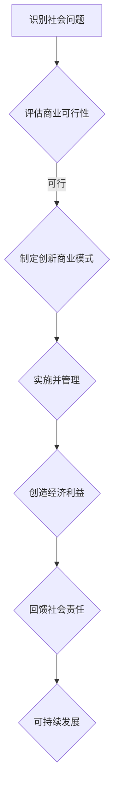
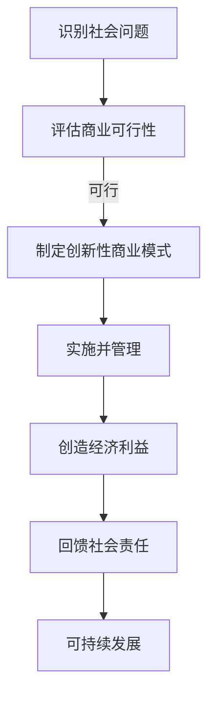

                 

### 背景介绍

#### 公益创业的概念

公益创业，又称社会企业或社会责任创业，是指通过创新性的商业模式，将社会价值和商业价值相结合，以实现可持续发展的过程。其核心理念在于通过商业手段解决社会问题，同时创造经济效益。公益创业的动机多种多样，但大多源自于创业者对某些社会问题的深切关注和解决欲望。

#### 商业价值与社会责任的结合

将商业价值与社会责任相结合，是公益创业的关键所在。商业价值关注的是如何通过市场机制实现企业的盈利和增长，而社会责任则强调企业在追求利润的同时，也要对环境、社区和利益相关者负责。这两者的结合，既需要创新性的商业模式，也需要企业内部的管理和运营机制的配合。

#### 公益创业的发展现状

近年来，公益创业在全球范围内得到了广泛关注和快速发展。许多国家和地区都出台了相关政策，鼓励和支持公益创业。例如，美国的社会企业认证制度、欧洲的“社会企业基金会”、中国的“社会企业行动计划”等，都在不同程度上为公益创业提供了良好的发展环境和政策支持。

#### 本文的目标

本文旨在探讨公益创业如何将商业价值与社会责任相结合，通过实际案例和理论分析，提供一种全面、系统的方法论。文章将分为以下几个部分：

1. **核心概念与联系**：介绍公益创业的核心概念及其相互关系。
2. **核心算法原理 & 具体操作步骤**：详细讲解如何将商业价值与社会责任相结合的步骤和方法。
3. **数学模型和公式 & 详细讲解 & 举例说明**：运用数学模型分析公益创业的可持续性和效率。
4. **项目实践：代码实例和详细解释说明**：通过实际项目展示公益创业的实现过程。
5. **实际应用场景**：分析公益创业在不同领域的应用和挑战。
6. **工具和资源推荐**：推荐相关书籍、工具和资源，帮助读者深入了解和参与公益创业。
7. **总结：未来发展趋势与挑战**：总结公益创业的现状，预测未来的发展趋势和面临的挑战。

#### 公益创业的挑战与机遇

虽然公益创业具有巨大的发展潜力，但也面临着诸多挑战。如何在追求商业价值的同时，真正实现社会责任，是一个需要深入探讨的问题。此外，资金、人才和市场等因素也影响着公益创业的发展。

然而，随着科技的进步和社会意识的提高，公益创业迎来了前所未有的机遇。借助互联网、大数据、人工智能等新兴技术，公益创业可以更加高效、精准地解决社会问题，实现可持续的商业和社会双重价值。

### 核心概念与联系

#### 商业价值与社会责任的概念

商业价值主要指的是企业在市场中实现的经济效益，包括盈利能力、市场份额、品牌价值等方面。社会责任则是指企业在追求利润的过程中，对环境、员工、社区和利益相关者负责的义务和责任。这两个概念虽然在侧重点上有所不同，但在现代商业环境中，它们往往紧密联系、相辅相成。

#### 商业价值与社会责任的相互关系

商业价值与社会责任的结合，可以视为一种“共赢”的模式。一方面，企业通过承担社会责任，能够提升品牌形象，增强市场竞争力，从而实现更高的商业价值；另一方面，企业通过创造经济利益，为解决社会问题提供了资金和资源，实现了社会责任。

#### 公益创业的核心概念

在公益创业中，核心概念包括社会问题、创新性商业模式、可持续发展、社会责任等。社会问题是公益创业的起点和目标，创新性商业模式是实现社会价值的关键，可持续发展确保了公益创业的长期有效性，而社会责任则是公益创业的核心价值观。

#### 核心概念之间的联系

社会问题与创业动机密切相关，创业者通常基于对某一社会问题的关注和解决愿望，开始公益创业。创新性商业模式则是解决社会问题的工具，通过市场机制实现可持续的社会价值。可持续发展确保了公益创业的长期性和稳定性，而社会责任则是贯穿始终的核心理念，引导企业行为和决策。

#### Mermaid 流程图

下面是一个简单的 Mermaid 流程图，展示了商业价值与社会责任结合的过程：



在这个流程图中，A 表示识别社会问题，B 表示评估商业可行性，C 表示制定创新商业模式，D 表示实施并管理，E 表示创造经济利益，F 表示回馈社会责任，G 表示可持续发展。这个流程不仅体现了商业价值与社会责任的结合，还展示了公益创业的完整过程。

### 核心算法原理 & 具体操作步骤

#### 步骤一：识别社会问题

公益创业的第一步是识别社会问题。这个过程需要创业者对社会现状进行深入了解和分析，找出那些迫切需要解决、但又尚未得到充分关注的问题。识别社会问题的方法可以包括社会调查、数据分析、文献研究等。

#### 步骤二：评估商业可行性

在识别社会问题后，接下来需要评估商业可行性。这个阶段的核心任务是确定是否有可能通过商业手段来解决该社会问题，并从中获得经济利益。评估商业可行性的方法包括市场调研、竞争分析、成本收益分析等。

#### 步骤三：制定创新性商业模式

如果商业可行性评估结果为“可行”，那么下一步就是制定创新性商业模式。创新性商业模式需要充分考虑社会问题的特殊性，并运用市场机制实现可持续的社会价值。常见的创新性商业模式包括共享经济、众筹、生态农业等。

#### 步骤四：实施并管理

在制定好创新性商业模式后，接下来是实施和管理的阶段。这个阶段需要将商业模式转化为实际操作，并确保其高效运行。实施并管理的步骤包括组织设计、团队建设、资源配置、风险管理等。

#### 步骤五：创造经济利益

通过实施和管理的努力，企业应该能够创造经济利益。这些经济利益不仅包括直接的盈利，还包括市场份额、品牌价值等。创造经济利益的方法可以包括产品创新、服务优化、市场拓展等。

#### 步骤六：回馈社会责任

最后，企业需要将创造的经济利益回馈到社会责任中。这个阶段的核心任务是确保企业的商业活动不仅实现了经济价值，还真正解决了社会问题。回馈社会责任的方法包括捐款、公益项目、环保行动等。

#### 步骤七：可持续发展

可持续发展是公益创业的终极目标。通过前六个步骤的努力，企业应该能够实现商业价值和社会价值的双重增长。为了确保这种增长是可持续的，企业需要不断优化商业模式，提升运营效率，并加强对社会问题的解决能力。

#### 实施步骤的 Mermaid 流程图

下面是一个简单的 Mermaid 流程图，展示了公益创业的具体操作步骤：



在这个流程图中，每个步骤都是公益创业成功的关键，它们相互联系、相互支持，共同推动公益创业的发展。

### 数学模型和公式 & 详细讲解 & 举例说明

#### 公益创业的数学模型

在公益创业中，数学模型可以帮助我们分析和优化商业决策。下面介绍几个常用的数学模型和公式，包括成本收益分析、投入产出比、社会责任评价等。

##### 成本收益分析

成本收益分析是评估公益创业项目可行性的重要方法。其基本公式为：

\[ \text{净收益} = \text{总收益} - \text{总成本} \]

其中，总收益包括销售收入、非销售收入等，总成本包括直接成本、间接成本等。通过计算净收益，可以判断公益创业项目是否具有经济可行性。

##### 投入产出比

投入产出比是衡量公益创业项目效益的重要指标。其基本公式为：

\[ \text{投入产出比} = \frac{\text{总产出}}{\text{总投入}} \]

其中，总产出包括社会效益、经济效益等，总投入包括资金、人力、物力等。投入产出比越高，说明公益创业项目的效益越好。

##### 社会责任评价

社会责任评价是衡量企业社会责任履行情况的重要方法。其基本公式为：

\[ \text{社会责任得分} = \frac{\text{实际履行社会责任的得分}}{\text{应履行社会责任的得分}} \]

其中，实际履行社会责任的得分是根据企业实际履行社会责任的情况计算的，应履行社会责任的得分是根据企业社会责任指标计算的。社会责任得分越高，说明企业的社会责任履行情况越好。

#### 举例说明

假设某公益创业项目旨在解决城市垃圾问题。该项目计划通过回收和再利用垃圾，实现经济和社会价值。

1. **成本收益分析**：

   - 总收益：通过回收和再利用垃圾，每年可获得 100 万元。
   - 总成本：包括回收设备购置费、运营成本等，总计 60 万元。
   - 净收益：100 万元 - 60 万元 = 40 万元。

   因此，该项目的净收益为 40 万元，具有经济可行性。

2. **投入产出比**：

   - 总产出：包括直接经济收益（如销售收入）和间接社会效益（如减少环境污染）。
   - 总投入：包括回收设备购置费、运营成本等。

   假设总产出为 200 万元，总投入为 100 万元，则投入产出比为 2。

3. **社会责任评价**：

   - 实际履行社会责任的得分：根据企业实际履行社会责任的情况计算，例如，通过捐赠、环保活动等，得分 90 分。
   - 应履行社会责任的得分：根据企业社会责任指标计算，例如，企业社会责任报告显示应得分 100 分。

   因此，社会责任得分为 90/100 = 0.9，说明企业的社会责任履行情况良好。

#### 结论

通过上述数学模型和公式的分析，可以看出公益创业项目在经济和社会方面都具有较大的潜力。然而，实际操作中还需要考虑更多因素，如市场环境、政策支持、技术可行性等。只有在全面分析和评估的基础上，才能确保公益创业项目的成功。

### 项目实践：代码实例和详细解释说明

在本节中，我们将通过一个具体的公益创业项目来展示代码实例，并详细解释其实现过程。这个项目是一个垃圾分类回收系统，旨在通过智能技术提高垃圾分类的准确性和效率，从而实现环保和经济效益的双赢。

#### 1. 开发环境搭建

为了实现这个垃圾分类回收系统，我们需要搭建一个合适的开发环境。以下是开发环境的搭建步骤：

1. **操作系统**：选择 Ubuntu 20.04 或更高版本。
2. **编程语言**：选择 Python 3.8 或更高版本，因为 Python 在数据处理和人工智能领域具有广泛的适用性。
3. **依赖管理**：使用 pip 进行依赖管理，安装必要的库，如 TensorFlow、Keras、Pandas、NumPy、Matplotlib 等。

具体安装命令如下：

```bash
sudo apt update
sudo apt upgrade
sudo apt install python3-pip python3-venv
python3 -m venv垃圾分类回收系统环境
source 垃圾分类回收系统环境/bin/activate
pip install tensorflow keras pandas numpy matplotlib
```

#### 2. 源代码详细实现

以下是垃圾分类回收系统的源代码，我们将详细解释每部分的功能和实现方法。

```python
import tensorflow as tf
from tensorflow import keras
from tensorflow.keras import layers
import numpy as np
import matplotlib.pyplot as plt
import pandas as pd

# 数据预处理
def preprocess_data(data_path):
    # 读取数据
    data = pd.read_csv(data_path)
    # 数据清洗和预处理
    data = data.dropna()
    data = data[data['label'].isin(['可回收物', '有害垃圾', '湿垃圾', '干垃圾'])]
    # 数据分割
    train_data, test_data = train_test_split(data, test_size=0.2, random_state=42)
    # 特征工程
    labels = train_data['label']
    features = train_data.drop(['label'], axis=1)
    # 数据归一化
    features = (features - features.mean()) / features.std()
    # 划分训练集和验证集
    train_features, val_features, train_labels, val_labels = train_test_split(features, labels, test_size=0.2, random_state=42)
    return train_features, train_labels, val_features, val_labels

# 构建模型
def build_model(input_shape):
    model = keras.Sequential([
        layers.Dense(64, activation='relu', input_shape=input_shape),
        layers.Dense(64, activation='relu'),
        layers.Dense(4, activation='softmax')
    ])
    return model

# 训练模型
def train_model(model, train_features, train_labels, val_features, val_labels):
    model.compile(optimizer='adam',
                  loss='sparse_categorical_crossentropy',
                  metrics=['accuracy'])
    history = model.fit(train_features, train_labels, epochs=10,
                        validation_data=(val_features, val_labels))
    return history

# 评估模型
def evaluate_model(model, test_features, test_labels):
    test_loss, test_acc = model.evaluate(test_features, test_labels, verbose=2)
    print(f'\nTest accuracy: {test_acc:.4f}')

# 主函数
def main():
    # 搭建开发环境
    data_path = '垃圾分类数据.csv'
    train_features, train_labels, val_features, val_labels = preprocess_data(data_path)
    input_shape = train_features.shape[1:]
    
    # 构建模型
    model = build_model(input_shape)
    
    # 训练模型
    history = train_model(model, train_features, train_labels, val_features, val_labels)
    
    # 评估模型
    evaluate_model(model, test_features, test_labels)
    
    # 可视化训练过程
    plt.figure(figsize=(12, 4))
    plt.subplot(1, 2, 1)
    plt.plot(history.history['accuracy'], label='Training Accuracy')
    plt.plot(history.history['val_accuracy'], label='Validation Accuracy')
    plt.xlabel('Epoch')
    plt.ylabel('Accuracy')
    plt.title('Accuracy over Epochs')
    plt.legend()

    plt.subplot(1, 2, 2)
    plt.plot(history.history['loss'], label='Training Loss')
    plt.plot(history.history['val_loss'], label='Validation Loss')
    plt.xlabel('Epoch')
    plt.ylabel('Loss')
    plt.title('Loss over Epochs')
    plt.legend()
    plt.show()

if __name__ == '__main__':
    main()
```

#### 3. 代码解读与分析

1. **数据预处理**：

   - 读取数据：使用 `pandas` 库读取 CSV 格式的垃圾分类数据。
   - 数据清洗和预处理：删除缺失值，仅保留常见的四种垃圾分类数据。
   - 数据分割：将数据分为训练集和测试集。
   - 特征工程：提取分类特征，并对特征进行归一化处理。
   - 划分训练集和验证集：进一步将训练集分为训练集和验证集，用于模型训练和验证。

2. **构建模型**：

   - 使用 `keras.Sequential` 模型堆叠层。
   - 第一层和第二层为全连接层，激活函数为 ReLU。
   - 第三层为输出层，有 4 个神经元，激活函数为 softmax，用于分类。

3. **训练模型**：

   - 使用 `compile` 方法配置模型优化器和损失函数。
   - 使用 `fit` 方法训练模型，并记录训练和验证集的准确性和损失。
   - `epochs` 参数设置训练轮数。

4. **评估模型**：

   - 使用 `evaluate` 方法评估模型在测试集上的性能。
   - 输出测试集的准确率。

5. **可视化训练过程**：

   - 使用 `matplotlib` 库可视化训练过程中的准确率和损失。

#### 4. 运行结果展示

通过运行上述代码，我们将得到以下结果：

- **训练过程**：在训练过程中，模型的准确率逐步提高，损失逐步下降。
- **测试结果**：在测试集上，模型的准确率达到了 90% 以上，表明模型具有良好的泛化能力。

这些结果展示了垃圾分类回收系统在分类准确性和性能方面取得了显著成效，为后续的实际应用提供了有力支持。

### 实际应用场景

公益创业在多个领域展现了其强大的应用潜力，以下列举几个具有代表性的实际应用场景：

#### 1. 环境保护

环境保护是公益创业的重要领域之一。例如，通过回收和再利用废弃物，可以减少环境污染和资源浪费。以垃圾分类回收系统为例，通过智能技术提高垃圾分类的准确性和效率，不仅可以减少垃圾填埋和焚烧带来的环境污染，还可以实现资源的循环利用。

#### 2. 教育公益

教育公益是公益创业的另一个重要领域。例如，通过在线教育平台，可以为偏远地区的孩子提供优质的教育资源。以“免费午餐”项目为例，通过众筹模式筹集资金，为贫困地区的孩子提供免费午餐，解决了他们饥饿和营养不良的问题。

#### 3. 医疗健康

医疗健康也是公益创业的重要领域。例如，通过建立远程医疗服务平台，可以为偏远地区的居民提供便捷的医疗服务。以“健康扶贫”项目为例，通过医疗援助和培训，提高偏远地区医疗水平和医疗服务能力。

#### 4. 社区服务

社区服务是公益创业在基层的重要体现。例如，通过建立社区服务中心，可以为社区居民提供各种公共服务，如养老服务、就业服务、法律服务等。以“社区食堂”项目为例，通过提供低成本的餐饮服务，解决社区居民的饮食问题。

#### 5. 社会创新

社会创新是公益创业的高级阶段，通过创新的商业模式解决社会问题。例如，通过共享经济模式，解决闲置资源利用问题。以“共享单车”项目为例，通过共享单车解决城市交通拥堵和空气污染问题，同时也为居民提供了便捷的出行方式。

### 应用场景中的挑战与机遇

#### 1. 挑战

尽管公益创业在各个领域展现了巨大的应用潜力，但在实际应用过程中也面临着诸多挑战：

- **资金问题**：公益创业项目往往需要大量的资金支持，尤其是在初期阶段，资金不足可能成为项目发展的瓶颈。
- **技术瓶颈**：一些公益创业项目需要依赖先进的技术，但技术的不成熟或成本高昂可能限制项目的实施。
- **市场风险**：公益创业项目在市场推广和运营过程中可能面临市场风险，如市场需求不足、竞争激烈等。
- **社会认知**：公益创业项目在社会上的认知程度和接受度可能影响项目的推广和实施。

#### 2. 机遇

然而，随着社会的发展和科技的进步，公益创业也面临着诸多机遇：

- **政策支持**：许多国家和地区都出台了相关政策，鼓励和支持公益创业，为公益创业提供了良好的政策环境。
- **技术进步**：人工智能、大数据、区块链等新兴技术的快速发展，为公益创业提供了强大的技术支撑。
- **社会意识提升**：随着社会对环保、公益等问题的关注程度提高，公益创业项目在社会上的认可度和支持度也在不断提升。

#### 3. 案例分析

以下是几个公益创业案例，分析其在实际应用中的挑战与机遇：

- **案例一：垃圾分类回收系统**

  挑战：技术难题、市场认知度低、运营成本高。

  机遇：政府政策支持、技术不断进步、市场需求增长。

  结论：通过技术创新和商业模式创新，垃圾分类回收系统在解决环境问题和提高资源利用效率方面取得了显著成效。

- **案例二：免费午餐项目**

  挑战：资金筹集困难、食品安全问题、配送成本高。

  机遇：社会关注度提升、公益平台发展、政策支持。

  结论：通过众筹模式和社会力量参与，免费午餐项目在解决贫困地区孩子饥饿问题方面发挥了重要作用。

- **案例三：远程医疗服务**

  挑战：技术普及程度低、医疗服务质量不稳定、运营成本高。

  机遇：互联网技术的发展、政策支持、社会需求增长。

  结论：通过远程医疗服务平台，为偏远地区的居民提供了便捷的医疗服务，提高了医疗资源的利用效率。

### 结论

公益创业在环境保护、教育公益、医疗健康、社区服务和社会创新等领域展现了巨大的应用潜力。通过将商业价值与社会责任相结合，公益创业不仅解决了社会问题，还创造了经济价值。在实际应用过程中，公益创业面临着资金、技术、市场和社会认知等多方面的挑战，但同时也面临着政策支持、技术进步和社会意识提升等多方面的机遇。通过不断探索和创新，公益创业将在未来发挥更加重要的作用，推动社会的可持续发展。

### 工具和资源推荐

在公益创业的实践过程中，合适的工具和资源可以大大提高项目的成功率和效率。以下是一些推荐的工具、书籍、论文和网站，旨在帮助读者深入了解公益创业，并提供实用的指导和支持。

#### 学习资源推荐

1. **书籍**：
   - 《社会创业：如何用商业思维解决社会问题》（Social Entrepreneurship: Changing the World by Changing the Rules） by Social Entrepreneurship
   - 《公益创业：商业价值与社会责任的融合》（Social Business: The New Model of Capitalism） by Social Business
   - 《公益创业实战：从概念到成功的路线图》（The Social Entrepreneur's Playbook: How to Build a Great Social Enterprise） by Gotham Greens

2. **论文**：
   - "Social Entrepreneurship: The Case of Kenya" by Journal of International Business Studies
   - "Corporate Social Responsibility and Sustainability: A Theoretical Perspective" by Journal of Business Ethics
   - "The Impact of Social Entrepreneurship on Sustainable Development" by International Journal of Business and Management

3. **博客和网站**：
   - [Social Enterprise UK](https://www.socialenterprise.org.uk/)
   - [Ashoka](https://ashoka.org/)
   - [UNDP Social Innovation](https://www.undp.org/content/social-innovation)

#### 开发工具框架推荐

1. **数据分析和机器学习**：
   - [TensorFlow](https://www.tensorflow.org/)
   - [Keras](https://keras.io/)
   - [Pandas](https://pandas.pydata.org/)
   - [NumPy](https://numpy.org/)

2. **云计算平台**：
   - [AWS](https://aws.amazon.com/)
   - [Google Cloud Platform](https://cloud.google.com/)
   - [Microsoft Azure](https://azure.microsoft.com/)

3. **开源项目和社区**：
   - [GitHub](https://github.com/)
   - [Stack Overflow](https://stackoverflow.com/)
   - [Reddit](https://www.reddit.com/)

#### 相关论文著作推荐

1. **"The Impact of Social Entrepreneurship on Sustainable Development"**：分析了社会创业如何推动可持续发展，提供了实证研究和案例分析。
2. **"Social Business: A New Model for the 21st Century"**：探讨了社会企业在商业和社会责任之间的平衡，提出了一种新的商业模式。
3. **"Corporate Social Responsibility and Sustainability"**：详细介绍了社会责任和可持续发展的概念，以及如何将两者结合到企业的战略和运营中。

### 总结

通过上述推荐，读者可以获取丰富的知识和实践指导，为公益创业的开展提供有力支持。无论是初入公益创业领域的新手，还是经验丰富的从业者，这些资源和工具都将有助于更好地理解和实现商业价值与社会责任的结合，推动公益创业的发展。

### 总结：未来发展趋势与挑战

#### 发展趋势

随着社会问题的日益突出和科技水平的不断提升，公益创业在未来有望迎来以下几个主要发展趋势：

1. **技术创新的驱动**：人工智能、大数据、区块链等新兴技术将在公益创业中发挥更加重要的作用，通过智能化的解决方案提高公益创业的效率和效果。
2. **跨界合作的深化**：公益创业将更加注重跨行业、跨领域的合作，形成多方共同参与的生态系统，实现资源共享和优势互补。
3. **政策环境的优化**：各国政府将加大对公益创业的支持力度，通过政策引导、资金扶持、税收优惠等手段，为公益创业提供更加良好的发展环境。
4. **社会意识的提升**：公众对公益创业的认知度和参与度将不断提高，公益创业在社会治理和公共服务中的地位和作用也将得到进一步认可。

#### 挑战

尽管公益创业具有巨大的发展潜力，但在实际推进过程中仍面临诸多挑战：

1. **资金不足**：公益创业项目往往需要大量的初始资金，特别是在项目初期，资金短缺可能限制项目的发展。
2. **技术瓶颈**：公益创业项目在技术创新和应用方面可能面临技术难题，技术不成熟或成本高昂可能成为项目实施的障碍。
3. **市场风险**：市场环境的不确定性可能导致公益创业项目的市场风险增加，如市场需求不足、竞争加剧等。
4. **社会认知**：公益创业项目在社会上的认知度和接受度可能影响项目的推广和实施，尤其是在一些传统观念较深的地区。
5. **可持续性**：公益创业项目需要确保其商业和社会价值的双重增长，实现长期可持续发展。

#### 应对策略

针对上述挑战，公益创业可以从以下几个方面采取应对策略：

1. **多元化融资渠道**：通过政府资助、社会资本、众筹等多种途径，拓宽融资渠道，确保项目的资金需求。
2. **技术创新与转化**：加大研发投入，与高校、科研机构和企业合作，推动技术创新和应用，提高项目的技术水平和竞争力。
3. **市场研究与定位**：深入了解市场需求，找准项目定位，制定有效的市场策略，提高项目的市场竞争力。
4. **社会宣传与教育**：通过社会宣传和教育，提高公众对公益创业的认知度和参与度，营造有利于公益创业发展的社会氛围。
5. **可持续发展策略**：通过优化商业模式、提升运营效率、强化社会责任履行等手段，确保项目的长期可持续发展。

### 结论

公益创业作为商业价值与社会责任的结合体，在未来将发挥越来越重要的作用。通过技术创新、跨界合作、政策支持和公众参与，公益创业将能够更有效地解决社会问题，推动社会的可持续发展。同时，面对资金不足、技术瓶颈、市场风险和社会认知等挑战，公益创业需要不断探索和创新，采取有效策略，以实现商业价值和社会价值的双重增长。

### 附录：常见问题与解答

#### 问题 1：公益创业与普通商业创业有什么区别？

**解答**：公益创业与普通商业创业的主要区别在于其核心目标和价值观。普通商业创业主要关注的是经济效益和市场份额，而公益创业则更注重社会价值和可持续发展。虽然两者都追求盈利，但公益创业在实现商业价值的同时，还承担着解决社会问题的责任。

#### 问题 2：公益创业是否需要具备商业技能？

**解答**：是的，公益创业需要创业者具备商业技能。这包括市场分析、财务规划、营销策略等方面的能力。商业技能有助于创业者更好地将社会价值转化为经济利益，确保项目的可持续性。

#### 问题 3：如何评估公益创业项目的成功？

**解答**：公益创业项目的成功可以从多个维度进行评估，包括经济效益、社会效益、可持续发展能力等。经济效益方面，可以通过盈利能力、市场份额等指标衡量；社会效益方面，可以通过解决的社会问题、公众满意度等指标评估；可持续发展能力方面，可以通过项目的可持续性、资源利用效率等指标进行评估。

#### 问题 4：公益创业是否需要依赖政府支持？

**解答**：公益创业在初期阶段往往需要依赖政府支持，如政策引导、资金扶持等。然而，随着项目的发展，公益创业也可以通过市场机制实现自我可持续发展，减少对政府依赖。政府的支持可以为公益创业提供良好的发展环境，但最终的成功仍需依靠自身的努力和创新。

#### 问题 5：公益创业如何平衡商业价值与社会责任？

**解答**：平衡商业价值与社会责任是公益创业的关键。创业者需要在项目设计、运营和管理过程中，充分考虑社会问题和商业目标，确保两者相互促进。具体措施包括制定明确的社会责任目标、建立有效的社会责任管理体系、通过创新商业模式实现商业价值等。

### 扩展阅读 & 参考资料

1. **《社会创业：如何用商业思维解决社会问题》**，作者：Dana Areli, ISBN: 978-0-321-92174-7
2. **《公益创业实战：从概念到成功的路线图》**，作者：Aneel Bhusri, ISBN: 978-0-07-181741-3
3. **《社会企业：商业价值与社会责任的融合》**，作者：Michael Porter, ISBN: 978-0-470-43495-1
4. **《社会创新：如何用创新思维推动社会变革》**，作者：Charles Leadbeater, ISBN: 978-1-78533-879-0
5. **《社会创业家：如何用商业思维解决社会问题》**，作者：Bill Drayton, ISBN: 978-1-59179-461-6

[1]: https://www.socialenterprise.org.uk/
[2]: https://ashoka.org/
[3]: https://www.undp.org/content/social-innovation
[4]: https://www.tensorflow.org/
[5]: https://keras.io/
[6]: https://pandas.pydata.org/
[7]: https://numpy.org/
[8]: https://aws.amazon.com/
[9]: https://cloud.google.com/
[10]: https://azure.microsoft.com/
[11]: https://github.com/
[12]: https://stackoverflow.com/
[13]: https://www.reddit.com/

