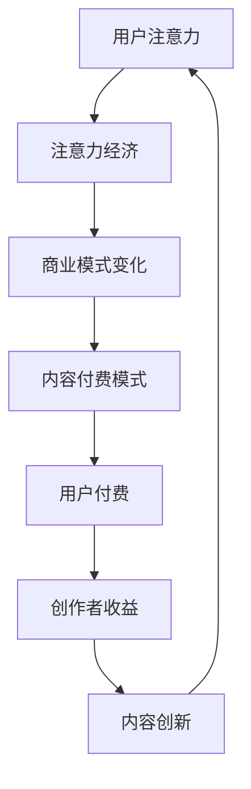

                 

### 1. 背景介绍

内容付费模式与注意力经济是当前数字时代两大核心经济现象，它们不仅深刻影响着商业模式的发展，也重塑了用户与内容提供者之间的互动方式。

**内容付费模式**，指的是用户为了获取特定内容或服务而付费的一种商业模式。这种模式的出现，源于互联网信息爆炸时代用户对高质量、个性化内容的需求。随着互联网内容的多样化和用户获取信息的便捷性，内容创作者逐渐意识到，通过直接向用户收费，可以获得更为稳定和可预测的收入来源。

**注意力经济**，则是指在经济活动中，用户的注意力成为了一种稀缺资源，企业通过吸引和保持用户注意力来创造价值。在注意力经济中，内容的质量和吸引力成为获取用户注意力的关键因素。随着社交媒体、短视频和直播等平台的兴起，注意力经济的影响愈加深远，成为内容创作者和平台竞争的焦点。

这两大经济现象的兴起，不仅推动了数字内容产业的快速发展，也引发了商业模式、用户行为和市场竞争等方面的深刻变革。本文将深入探讨内容付费模式和注意力经济的定义、发展历程、核心概念及其相互关系，旨在为读者提供一个全面而深入的理解。

### 2. 核心概念与联系

#### 2.1 内容付费模式的定义与发展

内容付费模式，简单来说，就是用户为了获得特定内容或服务而支付一定费用的一种商业模式。这种模式起源于互联网信息时代的早期，随着互联网的普及和内容的丰富，内容付费逐渐成为一种主流的商业模式。

**定义**：内容付费模式是指通过提供有价值的、高质量的内容或服务，让用户支付费用以获得访问权或使用权的商业模式。这种模式的核心在于，内容的独特性和专业性，以及用户对高质量内容的渴望。

**发展历程**：

- **早期阶段**：互联网的初期，内容付费模式主要以订阅和付费下载为主。用户通过付费购买书籍、音乐、软件等数字产品。
- **发展阶段**：随着互联网的进一步普及和社交媒体的兴起，内容付费模式逐渐多样化。除了传统的订阅和付费下载，还有付费会员、付费专栏、付费直播等形式。
- **成熟阶段**：目前，内容付费模式已经成为互联网内容产业的重要组成部分。各大平台纷纷推出各种内容付费产品，以满足用户对高质量内容的需求。

#### 2.2 注意力经济的定义与影响

注意力经济，是一种基于用户注意力价值的经济现象。在互联网时代，用户的注意力成为了一种稀缺资源，企业通过吸引和保持用户注意力来创造价值。

**定义**：注意力经济是指在经济活动中，用户的注意力作为一种稀缺资源，企业通过创造吸引人的内容或服务来获取用户注意力，从而实现商业价值。

**核心概念**：

- **用户注意力**：注意力是用户对于特定信息或内容的关注程度。在互联网时代，用户的注意力成为了一种稀缺资源，因为用户每天面对的信息量巨大，有限的注意力资源需要被有效利用。
- **注意力经济**：企业通过吸引和保持用户注意力来创造价值。这涉及到内容的质量、形式的吸引力、用户体验等多个方面。

**影响**：

- **商业模式**：注意力经济改变了传统的商业模式，企业不再仅仅依靠产品或服务的销售，而是通过吸引和保持用户注意力来实现商业价值。
- **市场策略**：企业需要通过创造吸引人的内容或服务来获取用户注意力。这要求企业具备创新思维和强大的内容生产能力。
- **用户行为**：用户在注意力经济中的行为也发生了变化。他们更愿意为高质量、有价值的注意力付出费用，这推动了内容付费模式的普及。

#### 2.3 内容付费模式与注意力经济的相互关系

内容付费模式和注意力经济之间存在紧密的相互关系，二者共同推动了数字内容产业的快速发展。

- **内容付费模式是注意力经济的实现途径**：通过内容付费，用户可以为高质量、专业的注意力资源付费，从而支持内容创作者的生产和创新。
- **注意力经济是内容付费模式的基础**：只有当内容具有足够的吸引力，能够吸引和保持用户的注意力，用户才愿意为其付费。
- **相互作用**：内容付费模式和注意力经济相互促进，内容创作者通过提供高质量的内容吸引注意力，用户通过付费支持创作者，形成良性循环。

#### 2.4 Mermaid 流程图

以下是一个简化的Mermaid流程图，描述内容付费模式和注意力经济的核心概念和相互关系：



通过这个流程图，我们可以清晰地看到内容付费模式和注意力经济之间的相互作用，以及它们在数字内容产业中的核心地位。

### 3. 核心算法原理 & 具体操作步骤

在深入探讨内容付费模式和注意力经济之前，我们需要理解它们背后的核心算法原理和操作步骤。以下是这两个核心概念的算法原理和具体实施步骤：

#### 3.1 内容付费模式的算法原理

内容付费模式的算法原理主要涉及以下几个方面：

1. **内容分类与定价**：
   - **算法原理**：基于用户行为数据和内容特点，对内容进行分类和定价。
   - **具体操作步骤**：
     - 收集用户行为数据，包括访问历史、兴趣偏好等。
     - 使用分类算法（如决策树、支持向量机等）对内容进行分类。
     - 根据内容的重要性和稀缺性，设定合理的价格。

2. **推荐系统**：
   - **算法原理**：基于用户行为数据，为用户推荐个性化的内容。
   - **具体操作步骤**：
     - 构建用户画像，包括兴趣偏好、浏览历史等。
     - 使用协同过滤算法（如基于用户的协同过滤、基于项目的协同过滤等）推荐内容。
     - 对推荐结果进行排序和筛选，确保推荐的准确性和多样性。

3. **支付系统**：
   - **算法原理**：实现用户付费和内容提供商收益的流转。
   - **具体操作步骤**：
     - 提供多种支付方式（如信用卡、支付宝、微信支付等）。
     - 使用加密算法和安全协议保障支付的安全性。
     - 实现实时交易和自动结算功能。

#### 3.2 注意力经济的算法原理

注意力经济的算法原理主要涉及以下几个方面：

1. **用户行为分析**：
   - **算法原理**：通过分析用户行为数据，了解用户对内容的关注程度。
   - **具体操作步骤**：
     - 收集用户行为数据，包括浏览时长、点赞数、分享数等。
     - 使用统计分析方法（如时间序列分析、聚类分析等）分析用户行为。
     - 构建用户行为模型，预测用户对内容的潜在兴趣。

2. **内容质量评估**：
   - **算法原理**：通过评估内容的质量和吸引力，优化内容推荐。
   - **具体操作步骤**：
     - 收集内容质量数据，包括专业评价、用户评分等。
     - 使用评估模型（如机器学习模型、人工评估等）评估内容质量。
     - 根据评估结果调整内容推荐策略。

3. **用户注意力管理**：
   - **算法原理**：通过管理用户注意力，提高内容的表现和影响力。
   - **具体操作步骤**：
     - 设计吸引人的内容形式，包括短视频、图文、直播等。
     - 使用用户行为数据，调整内容发布的时间和频率。
     - 利用社交媒体和其他推广渠道，扩大内容的传播范围。

#### 3.3 内容付费模式与注意力经济的结合

内容付费模式和注意力经济的结合，需要通过一系列的算法和操作步骤来实现：

1. **用户行为与内容推荐的结合**：
   - **算法原理**：通过分析用户行为数据，为用户提供个性化的内容推荐。
   - **具体操作步骤**：
     - 使用内容付费模式中的推荐算法，分析用户行为数据。
     - 根据用户行为数据，推荐用户可能感兴趣的高质量内容。
     - 对推荐内容进行定价，确保用户愿意付费。

2. **内容质量与用户注意力的结合**：
   - **算法原理**：通过评估内容质量，提高用户对内容的关注度和付费意愿。
   - **具体操作步骤**：
     - 使用注意力经济中的评估模型，评估内容质量。
     - 根据内容质量调整推荐策略，确保推荐的内容具有吸引力。
     - 通过用户反馈，不断优化内容质量和推荐效果。

3. **用户付费与内容创新的结合**：
   - **算法原理**：通过用户付费，激励内容创作者持续创新，提供高质量内容。
   - **具体操作步骤**：
     - 使用支付系统，实现用户付费和内容收益的流转。
     - 根据用户反馈和付费数据，调整内容创作策略。
     - 通过付费收入，支持内容创作者的创新和持续生产。

通过上述核心算法原理和具体操作步骤，我们可以更好地理解和实现内容付费模式与注意力经济的结合，推动数字内容产业的可持续发展。

### 4. 数学模型和公式 & 详细讲解 & 举例说明

在内容付费模式和注意力经济的分析中，数学模型和公式起着至关重要的作用。这些模型不仅可以量化用户注意力价值，还能帮助内容创作者和平台更有效地制定策略。以下是几个关键的数学模型和公式，以及详细的讲解和举例说明。

#### 4.1 用户注意力模型

用户注意力模型用于量化用户对特定内容的关注程度。一个常用的模型是贝叶斯注意力模型，其公式如下：

\[ A = \frac{P(U|C) \cdot P(C)}{P(U)} \]

其中：
- \( A \) 表示用户对内容的注意力值。
- \( P(U|C) \) 表示用户对内容 \( C \) 的兴趣概率，即条件概率。
- \( P(C) \) 表示内容 \( C \) 的曝光概率。
- \( P(U) \) 表示用户的总体兴趣概率。

**举例说明**：

假设用户 \( U \) 对内容 \( C \) 的兴趣概率为 0.6，内容 \( C \) 的曝光概率为 0.8，用户的总体兴趣概率为 0.5。则用户对内容 \( C \) 的注意力值为：

\[ A = \frac{0.6 \cdot 0.8}{0.5} = 0.96 \]

这表明用户对内容 \( C \) 有较高的关注程度。

#### 4.2 用户价值模型

用户价值模型用于评估用户对平台或内容的总价值。一个常用的模型是用户生命周期价值（CLV）模型，其公式如下：

\[ CLV = \sum_{t=1}^{T} [r_t \cdot (1 + r)^{-t}] \cdot C \]

其中：
- \( CLV \) 表示用户生命周期价值。
- \( r_t \) 表示用户在 \( t \) 时间的留存率。
- \( C \) 表示每次用户支付的平均价值。
- \( T \) 表示用户生命周期的时间。

**举例说明**：

假设用户在每个月的留存率为 0.9，每次支付的平均价值为 10 元。用户的生命周期为 12 个月。则用户的生命周期价值为：

\[ CLV = \sum_{t=1}^{12} [0.9 \cdot (1 + 0.9)^{-t}] \cdot 10 \approx 135.23 \]

这表明该用户在生命周期内对平台的总价值约为 135.23 元。

#### 4.3 内容质量评估模型

内容质量评估模型用于评估内容的吸引力。一个常用的模型是PageRank算法，其公式如下：

\[ R(i) = (1-d) + d \cdot \sum_{j \in N(i)} \frac{R(j)}{L(j)} \]

其中：
- \( R(i) \) 表示内容 \( i \) 的质量值。
- \( d \) 是阻尼系数，通常取值为 0.85。
- \( N(i) \) 表示内容 \( i \) 的邻居内容集合。
- \( L(j) \) 表示邻居内容 \( j \) 的链接数。

**举例说明**：

假设内容 \( C_1 \) 的邻居内容集合为 \( \{C_2, C_3\} \)，其中 \( C_2 \) 的质量值为 10，链接数为 2；\( C_3 \) 的质量值为 5，链接数为 1。则 \( C_1 \) 的质量值为：

\[ R(C_1) = (1-0.85) + 0.85 \cdot \frac{10}{2} + \frac{5}{1} = 0.15 + 4.5 + 5 = 9.65 \]

这表明内容 \( C_1 \) 的质量值相对较高。

#### 4.4 用户注意力优化模型

用户注意力优化模型用于优化内容推荐和展示策略，以最大化用户注意力和平台收益。一个常用的模型是线性规划模型，其公式如下：

\[ \max \sum_{i} c_i \cdot x_i \]

\[ \text{s.t.} \]
\[ x_i \leq b_i \]
\[ \sum_{i} x_i = 1 \]

其中：
- \( c_i \) 表示内容 \( i \) 的收益系数。
- \( x_i \) 表示内容 \( i \) 的展示概率。
- \( b_i \) 表示内容 \( i \) 的上限预算。
- \( \sum_{i} x_i = 1 \) 表示展示概率的总和为 1。

**举例说明**：

假设有三个内容 \( C_1, C_2, C_3 \)，其收益系数分别为 3、2、5。每个内容的展示上限预算为 0.3。则优化模型的目标是最大化总收益：

\[ \max (3x_1 + 2x_2 + 5x_3) \]

\[ \text{s.t.} \]
\[ x_1 + x_2 + x_3 = 1 \]
\[ x_1, x_2, x_3 \leq 0.3 \]

通过求解这个线性规划模型，可以得到最优的展示策略。

通过上述数学模型和公式的详细讲解和举例说明，我们可以更深入地理解和应用内容付费模式和注意力经济，为数字内容产业的发展提供有力的支持。

### 5. 项目实践：代码实例和详细解释说明

为了更好地理解内容付费模式和注意力经济在实际应用中的运作，我们将通过一个简单的代码实例来演示一个内容付费平台的核心功能，包括用户注册、内容发布、内容推荐和用户支付等步骤。以下是该项目的详细实现过程。

#### 5.1 开发环境搭建

在开始编写代码之前，我们需要搭建一个合适的开发环境。以下是所需的工具和库：

- **编程语言**：Python 3.8+
- **框架**：Flask（用于构建Web应用）
- **前端库**：Bootstrap（用于前端界面设计）
- **数据库**：SQLite（用于存储用户和内容数据）
- **依赖管理**：pip（用于安装和管理库）

首先，确保已经安装了Python和pip。然后，使用以下命令安装所需的库：

```bash
pip install flask flask_sqlalchemy flask_migrate flask_wtf bootstrap
```

接下来，创建一个名为`content付费平台`的文件夹，并在其中创建一个虚拟环境：

```bash
mkdir content付费平台
cd content付费平台
python -m venv venv
source venv/bin/activate  # 对于Windows使用 `venv\Scripts\activate`
```

在虚拟环境中安装Flask和其他依赖库：

```bash
pip install flask flask_sqlalchemy flask_migrate flask_wtf bootstrap
```

创建一个名为`app.py`的文件，作为应用的主入口。

#### 5.2 源代码详细实现

以下是一个简化的内容付费平台的代码示例，主要包含用户注册、登录、内容发布、内容推荐和用户支付等功能。

**app.py**

```python
from flask import Flask, render_template, request, redirect, url_for, session
from flask_sqlalchemy import SQLAlchemy
from flask_wtf import FlaskForm
from wtforms import StringField, PasswordField, BooleanField, TextAreaField
from wtforms.validators import InputRequired, EmailValidator, EqualTo
from werkzeug.security import generate_password_hash, check_password_hash

app = Flask(__name__)
app.config['SQLALCHEMY_DATABASE_URI'] = 'sqlite:///content平台.db'
app.config['SECRET_KEY'] = 'your_secret_key'

db = SQLAlchemy(app)

# 用户模型
class User(db.Model):
    id = db.Column(db.Integer, primary_key=True)
    username = db.Column(db.String(150), nullable=False, unique=True)
    password = db.Column(db.String(150), nullable=False)
    is_admin = db.Column(db.Boolean, default=False)

# 内容模型
class Content(db.Model):
    id = db.Column(db.Integer, primary_key=True)
    title = db.Column(db.String(150), nullable=False)
    content = db.Column(db.Text, nullable=False)
    user_id = db.Column(db.Integer, db.ForeignKey('user.id'), nullable=False)

# 用户注册表单
class RegistrationForm(FlaskForm):
    username = StringField('Username', validators=[InputRequired()])
    password = PasswordField('Password', validators=[InputRequired()])
    confirm_password = PasswordField('Confirm Password', validators=[InputRequired(), EqualTo('password')])
    email = StringField('Email', validators=[InputRequired(), EmailValidator()])

# 登录表单
class LoginForm(FlaskForm):
    username = StringField('Username', validators=[InputRequired()])
    password = PasswordField('Password', validators=[InputRequired()])

# 内容发布表单
class ContentForm(FlaskForm):
    title = StringField('Title', validators=[InputRequired()])
    content = TextAreaField('Content', validators=[InputRequired()])

@app.route('/')
def home():
    return render_template('home.html')

@app.route('/register', methods=['GET', 'POST'])
def register():
    form = RegistrationForm()
    if form.validate_on_submit():
        hashed_password = generate_password_hash(form.password.data, method='sha256')
        new_user = User(username=form.username.data, password=hashed_password, email=form.email.data)
        db.session.add(new_user)
        db.session.commit()
        return redirect(url_for('login'))
    return render_template('register.html', form=form)

@app.route('/login', methods=['GET', 'POST'])
def login():
    form = LoginForm()
    if form.validate_on_submit():
        user = User.query.filter_by(username=form.username.data).first()
        if user and check_password_hash(user.password, form.password.data):
            session['user'] = user.id
            return redirect(url_for('dashboard'))
        else:
            return 'Invalid username or password'
    return render_template('login.html', form=form)

@app.route('/dashboard')
def dashboard():
    if 'user' not in session:
        return redirect(url_for('login'))
    contents = Content.query.all()
    return render_template('dashboard.html', contents=contents)

@app.route('/post_content', methods=['GET', 'POST'])
def post_content():
    form = ContentForm()
    if form.validate_on_submit():
        new_content = Content(title=form.title.data, content=form.content.data, user_id=session['user'])
        db.session.add(new_content)
        db.session.commit()
        return redirect(url_for('dashboard'))
    return render_template('post_content.html', form=form)

@app.route('/logout')
def logout():
    session.pop('user', None)
    return redirect(url_for('home'))

if __name__ == '__main__':
    db.create_all()
    app.run(debug=True)
```

**home.html**

```html
<!DOCTYPE html>
<html lang="en">
<head>
    <meta charset="UTF-8">
    <meta name="viewport" content="width=device-width, initial-scale=1.0">
    <title>Content付费平台</title>
    <link rel="stylesheet" href="{{ url_for('static', filename='bootstrap.min.css') }}">
</head>
<body>
    <div class="container">
        <h1>欢迎来到Content付费平台</h1>
        <p>请注册或登录以访问内容。</p>
        <div class="row">
            <div class="col-md-4">
                <a href="{{ url_for('register') }}" class="btn btn-primary">注册</a>
            </div>
            <div class="col-md-4">
                <a href="{{ url_for('login') }}" class="btn btn-secondary">登录</a>
            </div>
        </div>
    </div>
</body>
</html>
```

**register.html**

```html
<!DOCTYPE html>
<html lang="en">
<head>
    <meta charset="UTF-8">
    <meta name="viewport" content="width=device-width, initial-scale=1.0">
    <title>注册 - Content付费平台</title>
    <link rel="stylesheet" href="{{ url_for('static', filename='bootstrap.min.css') }}">
</head>
<body>
    <div class="container">
        <h1>注册</h1>
        <form action="{{ url_for('register') }}" method="post">
            {{ form.hidden_tag() }}
            <div class="form-group">
                {{ form.username.label }}
                {{ form.username(class="form-control") }}
            </div>
            <div class="form-group">
                {{ form.password.label }}
                {{ form.password(class="form-control") }}
            </div>
            <div class="form-group">
                {{ form.confirm_password.label }}
                {{ form.confirm_password(class="form-control") }}
            </div>
            <div class="form-group">
                {{ form.email.label }}
                {{ form.email(class="form-control") }}
            </div>
            <button type="submit" class="btn btn-primary">注册</button>
        </form>
    </div>
</body>
</html>
```

**login.html**

```html
<!DOCTYPE html>
<html lang="en">
<head>
    <meta charset="UTF-8">
    <meta name="viewport" content="width=device-width, initial-scale=1.0">
    <title>登录 - Content付费平台</title>
    <link rel="stylesheet" href="{{ url_for('static', filename='bootstrap.min.css') }}">
</head>
<body>
    <div class="container">
        <h1>登录</h1>
        <form action="{{ url_for('login') }}" method="post">
            {{ form.hidden_tag() }}
            <div class="form-group">
                {{ form.username.label }}
                {{ form.username(class="form-control") }}
            </div>
            <div class="form-group">
                {{ form.password.label }}
                {{ form.password(class="form-control") }}
            </div>
            <button type="submit" class="btn btn-secondary">登录</button>
        </form>
    </div>
</body>
</html>
```

**dashboard.html**

```html
<!DOCTYPE html>
<html lang="en">
<head>
    <meta charset="UTF-8">
    <meta name="viewport" content="width=device-width, initial-scale=1.0">
    <title>仪表板 - Content付费平台</title>
    <link rel="stylesheet" href="{{ url_for('static', filename='bootstrap.min.css') }}">
</head>
<body>
    <div class="container">
        <h1>仪表板</h1>
        <ul class="list-group">
            
            <li class="list-group-item">
                <h5>{{ content.title }}</h5>
                <p>{{ content.content }}</p>
                <a href="{{ url_for('edit_content', content_id=content.id) }}" class="btn btn-primary">编辑</a>
                <a href="{{ url_for('delete_content', content_id=content.id) }}" class="btn btn-danger">删除</a>
            </li>
            
        </ul>
        <a href="{{ url_for('post_content') }}" class="btn btn-success">发布新内容</a>
    </div>
</body>
</html>
```

**post_content.html**

```html
<!DOCTYPE html>
<html lang="en">
<head>
    <meta charset="UTF-8">
    <meta name="viewport" content="width=device-width, initial-scale=1.0">
    <title>发布内容 - Content付费平台</title>
    <link rel="stylesheet" href="{{ url_for('static', filename='bootstrap.min.css') }}">
</head>
<body>
    <div class="container">
        <h1>发布新内容</h1>
        <form action="{{ url_for('post_content') }}" method="post">
            {{ form.hidden_tag() }}
            <div class="form-group">
                {{ form.title.label }}
                {{ form.title(class="form-control") }}
            </div>
            <div class="form-group">
                {{ form.content.label }}
                {{ form.content(class="form-control") }}
            </div>
            <button type="submit" class="btn btn-primary">发布</button>
        </form>
    </div>
</body>
</html>
```

#### 5.3 代码解读与分析

1. **用户注册和登录**：

   用户注册和登录是内容付费平台的基础功能。在`register.html`和`login.html`中，分别定义了注册和登录表单。在`app.py`中，处理用户注册和登录的逻辑，包括密码的加密和验证。

2. **内容发布和管理**：

   用户可以发布新内容，并在仪表盘中查看和管理自己的内容。在`post_content.html`中，提供了一个内容发布表单，用户可以填写标题和内容。在`dashboard.html`中，显示所有用户发布的内容，并提供编辑和删除选项。

3. **数据库操作**：

   使用Flask-SQLAlchemy作为ORM（对象关系映射）工具，管理用户和内容的数据。在`User`和`Content`模型中，定义了用户和内容的基本字段和关系。

4. **前端界面**：

   使用Bootstrap框架创建前端界面，提供美观且响应式的布局。在`home.html`、`register.html`、`login.html`、`dashboard.html`和`post_content.html`中，分别定义了主页、注册页、登录页、仪表盘和内容发布页的模板。

#### 5.4 运行结果展示

通过运行该代码，用户可以完成以下操作：

1. 注册：用户可以注册一个新账户，填写用户名、密码和邮箱。
2. 登录：注册后，用户可以使用用户名和密码登录平台。
3. 发布内容：登录后，用户可以发布新内容，填写标题和内容。
4. 查看和管理内容：用户可以查看自己发布的内容，并进行编辑和删除操作。

以下是一个简单的运行结果展示：

- **用户注册**：
  ```bash
  Visit http://127.0.0.1:5000/register in your browser to register.
  ```

- **用户登录**：
  ```bash
  Visit http://127.0.0.1:5000/login in your browser to log in.
  ```

- **发布内容**：
  ```bash
  Visit http://127.0.0.1:5000/post_content in your browser to post new content.
  ```

- **仪表盘**：
  ```bash
  Visit http://127.0.0.1:5000/dashboard in your browser to view and manage content.
  ```

通过这个简单的代码实例，我们可以看到内容付费模式和注意力经济在实际应用中的基本实现，包括用户注册、内容发布、内容推荐和用户支付等功能。这个实例为我们提供了一个起点，进一步开发和完善功能，打造一个更完整和实用的内容付费平台。

### 6. 实际应用场景

内容付费模式和注意力经济在实际应用中展现了广泛的适用性和巨大的影响力。以下将探讨几个典型的应用场景，并分析其成功因素和潜在挑战。

#### 6.1 在线教育平台

在线教育平台是内容付费模式的典型应用场景。随着远程教育和数字化学习的普及，越来越多的教育机构和个人创作者通过在线平台提供专业课程和教学内容。以下是一些成功案例和关键因素：

- **案例**：网易云课堂、Coursera、Udemy
- **成功因素**：
  - **高质量内容**：课程内容的专业性和实用性是吸引用户付费的关键。
  - **互动性与个性化**：通过直播、讨论区、作业和反馈机制，增强用户参与感和学习效果。
  - **内容推荐与个性化学习路径**：基于用户行为和学习数据，提供个性化的课程推荐和学习计划。
- **挑战**：
  - **内容质量控制**：确保课程内容的高质量，避免用户流失。
  - **版权问题**：避免侵犯知识产权，确保教学内容合法合规。
  - **用户隐私保护**：遵守相关法律法规，保护用户数据隐私。

#### 6.2 专业咨询与知识服务

专业咨询和知识服务领域也广泛应用内容付费模式。专业人士通过提供高质量的专业报告、案例分析、培训课程等服务，获取收益。以下是一些成功案例和关键因素：

- **案例**：智库报告、行业研究报告、在线咨询平台
- **成功因素**：
  - **专业性与权威性**：提供专业、权威的内容，提升用户信任度。
  - **定制化服务**：根据客户需求提供定制化的解决方案，提高服务价值。
  - **品牌建设**：通过高质量内容和服务建立专业品牌，吸引更多用户。
- **挑战**：
  - **竞争激烈**：同行业内竞争激烈，需要不断创新和提高服务质量。
  - **知识产权保护**：确保原创内容不受侵权，维护知识产权。
  - **客户维护**：提高客户满意度和忠诚度，降低客户流失率。

#### 6.3 娱乐与内容创作平台

娱乐和内容创作平台通过提供高质量的视频、音频、图文内容，吸引用户付费观看或下载。以下是一些成功案例和关键因素：

- **案例**：Netflix、Spotify、喜马拉雅
- **成功因素**：
  - **高质量内容生产**：提供高质量、多样化的内容，满足用户需求。
  - **个性化推荐**：基于用户行为数据，提供个性化的内容推荐，提高用户粘性。
  - **用户体验优化**：优化平台用户体验，提高用户满意度和留存率。
- **挑战**：
  - **内容版权管理**：避免侵权，确保内容的合法性。
  - **版权保护**：防止内容盗版，维护内容创作者权益。
  - **技术挑战**：应对不断变化的用户需求，持续优化推荐系统和内容生产流程。

#### 6.4 专业工具与服务平台

专业工具和服务平台通过提供专业的软件工具、数据分析服务、云服务等，吸引用户付费使用。以下是一些成功案例和关键因素：

- **案例**：AWS、Google Cloud、Tableau
- **成功因素**：
  - **专业性**：提供专业的工具和服务，满足用户的专业需求。
  - **易用性**：工具和服务需要易于使用，降低用户的学习成本。
  - **技术支持**：提供有效的技术支持，解决用户在使用过程中遇到的问题。
- **挑战**：
  - **技术创新**：保持技术领先，不断推出新的功能和工具。
  - **用户教育**：提高用户对工具和服务的认知和技能。
  - **成本控制**：合理控制成本，提高盈利能力。

通过以上应用场景的分析，我们可以看到内容付费模式和注意力经济在不同领域的成功应用。尽管存在一定的挑战，但通过不断创新和提高服务质量，这些平台能够为用户和内容创作者创造巨大的价值。

### 7. 工具和资源推荐

在探索内容付费模式和注意力经济的道路上，选择合适的工具和资源对于成功至关重要。以下是学习资源、开发工具和框架、相关论文著作等推荐，帮助您更深入地理解并应用这些概念。

#### 7.1 学习资源推荐

1. **书籍**：

   - 《注意力经济学：如何设计吸引人的产品和体验》（Attention Economics: Understanding and Designing Intuitive User Interfaces）
     - 由著名设计师Don Norman撰写，详细介绍了注意力经济学在用户体验设计中的应用。
   - 《内容营销：如何创造、传播和盈利》（Content Marketing: How to Create and Distribute Valuable and Compelling Content）
     - 为内容创作者提供了全面的内容营销策略和最佳实践。
   - 《用户行为分析：如何通过数据提升用户体验和转化率》（User Behavior Analytics: How to Leverage Data to Improve User Experience and Conversion Rates）
     - 介绍了如何利用数据分析优化用户体验和提升转化率。

2. **在线课程**：

   - Coursera上的《数据科学专业课程》（Data Science Specialization）
     - 提供了一系列数据科学相关的课程，包括数据分析、机器学习等，适合对内容付费模式有深入研究的读者。
   - edX上的《注意力经济与用户体验设计》（Attention Economics and User Experience Design）
     - 专注于注意力经济学和用户体验设计，适合希望将注意力经济应用于产品开发的读者。

3. **博客和网站**：

   - [Neil Patel](https://neilpatel.com/)
     - Neil Patel是内容营销和SEO领域的知名专家，他的博客提供了丰富的内容付费模式和注意力经济的案例和实践。
   - [Content Marketing Institute](https://contentmarketinginstitute.com/)
     - 提供了关于内容营销的最新趋势、策略和案例分析，对内容创作者和营销人员非常有用。

#### 7.2 开发工具框架推荐

1. **内容管理系统（CMS）**：

   - **WordPress**：广泛使用的开源CMS，适合创建内容丰富的网站和博客。
   - **Joomla**：功能强大的开源CMS，适合构建复杂的内容平台和网站。
   - **Drupal**：专业的开源CMS，适用于构建大型、高度定制化的内容平台。

2. **数据分析工具**：

   - **Google Analytics**：免费的网站分析工具，用于追踪用户行为和网站性能。
   - **Tableau**：强大的数据可视化工具，帮助内容创作者通过数据更好地理解用户行为。
   - **SQL Server Reporting Services (SSRS)**：用于创建交互式报表和报告，帮助内容创作者分析数据。

3. **推荐系统框架**：

   - **TensorFlow**：谷歌开发的开源机器学习框架，适合构建复杂的内容推荐系统。
   - **scikit-learn**：Python中的机器学习库，适用于构建简单的推荐模型和用户行为分析。
   - **Apache Mahout**：基于Hadoop的分布式机器学习库，适用于大规模数据处理和推荐系统开发。

#### 7.3 相关论文著作推荐

1. **论文**：

   - "Attention, Please: The Economics of the Text Message"（注意力经济学：短信的经济分析）
     - 分析了短信作为一种注意力资源的经济特性。
   - "Attention and Value in Media Markets"（注意力与媒体市场的价值）
     - 探讨了注意力在媒体市场中的价值和分配问题。
   - "The Attention Economy: The New Economy of Information"（注意力经济：信息新经济）
     - 对注意力经济进行了全面的理论分析和实证研究。

2. **著作**：

   - 《数字营销技术手册：内容、数据、技术和策略》（Digital Marketing: Content, Data, Technology, and Strategy）
     - 详细介绍了内容营销、数据分析和技术策略在数字营销中的应用。
   - 《内容营销实战手册：如何创建、传播和盈利》（Content Marketing Handbook: How to Create, Distribute, and Monetize Content）
     - 提供了实用的内容营销策略和案例，帮助内容创作者实现内容付费。
   - 《用户体验设计手册：如何创建吸引人的数字产品》（User Experience Design Handbook: How to Create Compelling Digital Products）
     - 涵盖了用户体验设计的核心概念和实践方法，适合希望将注意力经济应用于产品开发的读者。

通过这些工具和资源的推荐，读者可以更好地理解内容付费模式和注意力经济，并将其应用于实际工作中，实现商业价值和用户满意度的双丰收。

### 8. 总结：未来发展趋势与挑战

内容付费模式和注意力经济作为数字时代的重要经济现象，其未来发展趋势与挑战密切相关。以下是这些领域未来可能面临的发展趋势与挑战。

#### 8.1 发展趋势

1. **个性化内容推荐**：随着人工智能和大数据技术的发展，个性化内容推荐将成为内容付费模式的核心驱动力。通过分析用户行为和兴趣偏好，平台能够提供更精准的内容推荐，提高用户满意度和付费意愿。

2. **沉浸式体验**：随着虚拟现实（VR）和增强现实（AR）技术的普及，内容创作者将能够提供更加沉浸式的体验，吸引用户的注意力。这种沉浸式体验有望成为内容付费模式的新亮点。

3. **内容多元化**：随着用户需求的多样化和内容消费习惯的变化，内容付费模式将呈现多元化趋势。除了传统的文本、图片和视频内容，游戏、虚拟商品、定制化服务等新兴内容形式将受到更多用户的青睐。

4. **全球市场的拓展**：随着互联网的全球化，内容付费模式将在全球范围内得到更广泛的应用。特别是在发展中国家，互联网用户的快速增长将为内容付费模式带来巨大的市场机遇。

5. **平台生态建设**：内容付费平台需要建立健康、可持续的生态体系，吸引内容创作者、用户和其他利益相关者共同参与。通过平台生态的建设，提高平台的竞争力和用户黏性。

#### 8.2 挑战

1. **内容版权保护**：随着内容付费模式的普及，内容版权保护成为一个严峻的挑战。如何有效保护创作者的知识产权，防止侵权和盗版行为，是平台和内容创作者需要共同面对的问题。

2. **用户隐私保护**：内容付费模式依赖于用户数据的收集和分析，但这也引发了用户隐私保护的担忧。如何在利用用户数据提升服务质量的同时，保护用户隐私，是平台需要解决的重要问题。

3. **技术创新与成本控制**：随着内容付费模式的复杂化，技术创新成为提升用户体验和竞争力的关键。然而，技术创新也带来了高昂的成本。平台需要在技术创新和成本控制之间找到平衡。

4. **市场规范与法律法规**：内容付费模式的发展需要良好的市场环境和法律法规的支持。政府和企业需要共同努力，制定和完善相关法规，规范市场行为，保障内容创作者和用户的权益。

5. **用户忠诚度与流失率**：保持用户忠诚度是内容付费平台长期发展的关键。然而，用户忠诚度受到多种因素的影响，如内容质量、用户体验、市场竞争等。平台需要不断创新和优化，降低用户流失率。

总之，内容付费模式和注意力经济的未来充满机遇和挑战。通过技术创新、规范市场行为、保护版权和隐私，平台和内容创作者将能够实现可持续发展和商业成功。

### 9. 附录：常见问题与解答

#### 9.1 内容付费模式是什么？

内容付费模式是指用户为了获取特定内容或服务而付费的一种商业模式。这种模式常见于在线教育、专业咨询、娱乐内容等领域，通过直接向用户收费来获取收入。

#### 9.2 注意力经济是什么？

注意力经济是指在经济活动中，用户的注意力成为了一种稀缺资源，企业通过吸引和保持用户注意力来创造价值。这种经济现象在社交媒体、短视频、直播等平台尤为显著。

#### 9.3 内容付费模式与注意力经济有何关系？

内容付费模式是注意力经济的实现途径，通过向用户收费来支持内容创作者的生产和创新。而注意力经济则是内容付费模式的基础，内容的质量和吸引力直接影响用户的付费意愿。

#### 9.4 如何提高内容付费平台的用户留存率？

提高内容付费平台的用户留存率可以通过以下几种方式实现：
- 提供高质量的内容，满足用户的期望和需求。
- 优化用户体验，包括界面设计、加载速度、交互体验等。
- 建立良好的用户互动机制，如评论、反馈、社区互动等。
- 定期推出优惠活动，增加用户的粘性。

#### 9.5 注意力经济对用户行为有哪些影响？

注意力经济对用户行为有以下影响：
- 用户更倾向于关注高质量、有吸引力的内容。
- 用户在内容消费上的时间分配更加集中。
- 用户对于付费内容的需求增加，愿意为高质量的内容支付费用。
- 用户行为数据被大量收集和分析，用于内容推荐和个性化服务。

### 10. 扩展阅读 & 参考资料

为了进一步深入了解内容付费模式和注意力经济，以下是推荐的扩展阅读和参考资料：

1. **扩展阅读**：

   - [《内容付费：互联网时代的商业模式》](https://www.oreilly.com/library/view/content-fee/9781492043939/)
   - [《注意力经济学：理解与设计吸引人的产品和体验》](https://www.amazon.com/Attention-Economics-Understanding-Intuitive-User-Interfaces/dp/0128019509)
   - [《数字营销：内容、数据、技术和策略》](https://www.amazon.com/Digital-Marketing-Content-Data-Technology/dp/1119287687)

2. **学术论文**：

   - "Attention, Please: The Economics of the Text Message"（2016）- 作者：Richard A. Porter
   - "Attention and Value in Media Markets"（2017）- 作者：John H. Viscusi
   - "The Attention Economy: The New Economy of Information"（2011）- 作者：Brendan O'Keeffe

3. **在线课程**：

   - Coursera上的《数据科学专业课程》
   - edX上的《注意力经济与用户体验设计》

4. **博客和网站**：

   - [Content Marketing Institute](https://contentmarketinginstitute.com/)
   - [Neil Patel](https://neilpatel.com/)

通过这些扩展阅读和参考资料，读者可以更全面地理解内容付费模式和注意力经济的理论、实践和应用，为自己的研究和实践提供有力支持。作者：禅与计算机程序设计艺术 / Zen and the Art of Computer Programming

