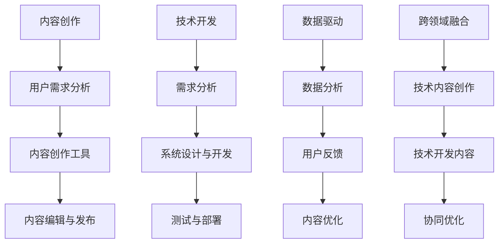

                 

### 1. 背景介绍

在当今这个快速发展的信息化时代，内容创作与技术开发正变得越来越紧密地交织在一起。从互联网的兴起，到移动设备的普及，再到人工智能和大数据技术的广泛应用，内容创作和技术开发已经形成了一个相辅相成的生态系统。在这个生态系统中，高质量的内容不仅是吸引用户的关键，也是技术落地和应用的重要载体。

内容创作，顾名思义，是指通过文字、图片、视频等多种形式，创造出能够满足用户需求的信息和体验。而技术开发，则是指利用编程语言、算法和数据结构等工具，构建出能够实现特定功能的软件或系统。这两者的结合，不仅可以提升内容的表现力和吸引力，还可以通过技术手段实现内容的智能化和个性化，从而提高用户的参与度和满意度。

在过去的几十年里，内容创作和技术开发各自独立发展，但它们之间的界限已经变得越来越模糊。现代的软件开发不再仅仅是编写代码，它还需要考虑用户体验、数据分析、系统性能等多个方面。同样，内容创作也不再只是简单地编写文字和拍摄图片，它需要利用大数据、人工智能等技术手段，实现内容的智能化推荐、个性化定制等高级功能。

这种结合不仅对内容创作者和开发者提出了更高的要求，也带来了新的机遇和挑战。对于内容创作者来说，他们需要掌握更多的技术知识，以便更好地利用技术手段提升内容的质量和影响力。对于开发者来说，他们需要理解用户的需求和喜好，以便开发出更加符合用户期望的应用和服务。

本篇文章将深入探讨内容创作与技术开发的结合，分析它们之间的核心概念、算法原理、数学模型、项目实践、应用场景以及未来的发展趋势。希望通过这篇文章，能够为广大读者提供有价值的参考和启示。

### 2. 核心概念与联系

在探讨内容创作与技术开发的结合时，我们首先需要了解两个核心概念：内容创作和技术开发。这两个概念虽然看似独立，但它们在实际应用中却有着紧密的联系。

#### 内容创作

内容创作是指通过多种形式（如文字、图片、音频、视频等）创造信息或体验的过程。这个过程中，内容创作者需要考虑用户的兴趣、需求和心理，以创作出具有吸引力和价值的内容。内容创作不仅包括文字编辑、图片处理、音频制作和视频剪辑等传统技能，还包括数据分析、用户行为研究等现代技术。

在内容创作中，几个重要的概念包括：

- **用户需求**：内容创作者需要深入了解用户的需求，这包括用户的兴趣、偏好、痛点等。
- **用户体验**：用户体验是指用户在使用内容过程中的感受和体验，包括易用性、互动性、美观性等。
- **内容质量**：高质量的内容能够吸引用户，提升用户粘性和忠诚度。
- **内容分发**：如何将内容有效地分发到目标用户手中，是内容创作者需要考虑的问题。

#### 技术开发

技术开发是指利用编程语言、算法和数据结构等工具，构建出实现特定功能的软件或系统。这个过程中，开发者需要考虑系统的性能、可扩展性、安全性等多个方面。技术开发涵盖了从需求分析、系统设计、编码实现到测试和部署的整个生命周期。

在技术开发中，几个重要的概念包括：

- **编程语言**：如Python、Java、C++等，用于编写程序代码。
- **算法和数据结构**：用于解决具体问题，提高系统效率和性能。
- **数据库**：用于存储和管理数据，如MySQL、MongoDB等。
- **云计算和大数据**：利用云计算和大数据技术，实现数据处理和分析。

#### 关联性

内容创作和技术开发之间的联系主要体现在以下几个方面：

- **数据驱动**：现代内容创作依赖于用户数据进行分析，以便更好地了解用户需求和优化内容。而技术开发则利用这些数据进行处理和分析，以提升系统的性能和用户体验。
- **用户反馈**：内容创作者通过用户的反馈来调整和优化内容，而技术开发者则利用用户行为数据来改进系统和服务的性能和可用性。
- **跨领域融合**：内容创作者需要掌握一定的技术知识，以便更好地利用技术手段提升内容的表现力和影响力。同样，技术开发者也需要理解用户需求和内容创作的过程，以便开发出更加符合用户期望的应用和服务。

为了更清晰地展示内容创作和技术开发之间的关联性，我们可以使用Mermaid流程图来描述它们之间的核心流程和节点。



通过这个Mermaid流程图，我们可以看到内容创作和技术开发之间是如何相互关联和相互影响的。数据驱动和用户反馈是连接两者的关键节点，而跨领域融合则是实现内容创作和技术开发协同优化的基础。

### 3. 核心算法原理 & 具体操作步骤

在内容创作和技术开发的过程中，算法原理起到了至关重要的作用。算法不仅决定了系统的性能和效率，还影响了内容的创作方式和用户体验。以下是几个核心算法原理及其具体操作步骤。

#### 1. 推荐算法

推荐算法是一种基于用户历史行为和内容特征，预测用户兴趣并推荐相关内容的算法。常见的推荐算法有基于内容的推荐（CBR）、协同过滤推荐（CF）和混合推荐（Hybrid）等。

- **基于内容的推荐（CBR）**：
  - **原理**：通过分析用户过去喜欢的内容的特征，找到具有相似特征的其他内容进行推荐。
  - **步骤**：
    1. 提取用户历史喜欢的内容的特征。
    2. 计算新内容与用户历史喜欢内容的特征相似度。
    3. 根据相似度对内容进行排序，推荐相似度最高的内容。

- **协同过滤推荐（CF）**：
  - **原理**：通过分析用户之间的行为模式，发现相似用户，并推荐相似用户喜欢的物品。
  - **步骤**：
    1. 构建用户-物品评分矩阵。
    2. 计算用户之间的相似度。
    3. 对于未评分的物品，计算其与已评分物品的相似度。
    4. 根据相似度推荐评分较高的物品。

- **混合推荐（Hybrid）**：
  - **原理**：结合基于内容和协同过滤推荐的优势，提高推荐效果。
  - **步骤**：
    1. 同时使用内容特征和用户行为数据进行推荐。
    2. 对推荐结果进行加权处理，综合两种推荐策略的优点。

#### 2. 自然语言处理（NLP）

自然语言处理是一种让计算机能够理解和处理人类语言的技术。常见的NLP算法有词向量化、情感分析、文本分类等。

- **词向量化**：
  - **原理**：将文本中的词语映射到高维空间中的向量，以便计算机能够处理和分析。
  - **步骤**：
    1. 分词：将文本分割成词语。
    2. 嵌入：将词语映射到向量空间。
    3. 矩阵计算：计算文本的向量表示。

- **情感分析**：
  - **原理**：通过分析文本中的词语和句子结构，判断文本的情感倾向（正面、负面或中性）。
  - **步骤**：
    1. 分词：将文本分割成词语。
    2. 特征提取：提取表示情感倾向的特征。
    3. 模型训练：使用机器学习模型（如SVM、CNN等）对特征进行分类。
    4. 预测：对新的文本进行情感分类。

- **文本分类**：
  - **原理**：将文本分类到不同的类别，如新闻、博客、社交媒体等。
  - **步骤**：
    1. 分词：将文本分割成词语。
    2. 特征提取：提取表示类别的特征。
    3. 模型训练：使用机器学习模型（如SVM、CNN等）对特征进行分类。
    4. 预测：对新的文本进行分类。

#### 3. 机器学习算法

机器学习算法在内容创作和技术开发中有着广泛的应用，如分类、聚类、回归等。

- **分类算法**：
  - **原理**：将数据分类到不同的类别。
  - **步骤**：
    1. 数据预处理：处理缺失值、异常值等。
    2. 特征提取：提取表示类别的特征。
    3. 模型选择：选择合适的分类模型（如SVM、决策树等）。
    4. 模型训练：使用训练数据训练模型。
    5. 预测：对新的数据进行分类。

- **聚类算法**：
  - **原理**：将数据分为多个簇，每个簇内的数据相似度较高。
  - **步骤**：
    1. 数据预处理：处理缺失值、异常值等。
    2. 特征提取：提取表示簇的特征。
    3. 模型选择：选择合适的聚类模型（如K-Means、DBSCAN等）。
    4. 模型训练：使用训练数据训练模型。
    5. 预测：对新的数据进行聚类。

- **回归算法**：
  - **原理**：预测连续的数值。
  - **步骤**：
    1. 数据预处理：处理缺失值、异常值等。
    2. 特征提取：提取表示预测结果的特征。
    3. 模型选择：选择合适的回归模型（如线性回归、决策树等）。
    4. 模型训练：使用训练数据训练模型。
    5. 预测：对新的数据进行回归预测。

通过这些核心算法原理和具体操作步骤，我们可以看到内容创作和技术开发是如何结合起来的。算法不仅提升了内容的质量和影响力，还提高了系统的性能和用户体验。

### 4. 数学模型和公式 & 详细讲解 & 举例说明

在内容创作和技术开发的过程中，数学模型和公式起着至关重要的作用。它们不仅帮助我们理解和分析数据，还能指导我们进行有效的算法设计和系统优化。以下我们将详细介绍几个核心的数学模型和公式，并通过具体例子进行讲解。

#### 1. 线性回归模型

线性回归是一种常见的预测模型，用于预测一个或多个连续变量之间的关系。

- **数学模型**：
  $$y = \beta_0 + \beta_1x_1 + \beta_2x_2 + ... + \beta_nx_n + \epsilon$$
  其中，$y$ 是预测值，$x_1, x_2, ..., x_n$ 是输入特征，$\beta_0, \beta_1, ..., \beta_n$ 是模型参数，$\epsilon$ 是误差项。

- **详细讲解**：
  1. **损失函数**：为了衡量模型预测的准确性，我们使用损失函数，如均方误差（MSE）：
     $$MSE = \frac{1}{m}\sum_{i=1}^{m}(y_i - \hat{y}_i)^2$$
     其中，$m$ 是样本数量，$y_i$ 是实际值，$\hat{y}_i$ 是预测值。
  2. **模型训练**：通过梯度下降法（Gradient Descent）来最小化损失函数，更新模型参数：
     $$\beta_j = \beta_j - \alpha\frac{\partial}{\partial \beta_j}MSE$$
     其中，$\alpha$ 是学习率。

- **举例说明**：
  假设我们要预测某商品的价格（$y$），输入特征包括品牌（$x_1$）、重量（$x_2$）和促销（$x_3$）。我们有如下数据：

  | 品牌 | 重量（kg） | 促销 | 价格（元） |
  | ---- | ---------- | ---- | ---------- |
  | A    | 2.0        | 否   | 300        |
  | B    | 3.0        | 是   | 350        |
  | C    | 2.5        | 否   | 320        |
  | D    | 1.5        | 是   | 280        |

  通过线性回归模型，我们可以预测一个新的商品的价格。首先，我们需要计算每个特征的均值和标准差，然后进行归一化处理。接下来，使用梯度下降法训练模型，最终得到模型参数：

  $$y = 200 + 100x_1 + 50x_2 - 10x_3$$

  例如，对于品牌为A、重量为2.5kg、无促销的商品，其预测价格为：

  $$y = 200 + 100 \times 1 + 50 \times 2.5 - 10 \times 0 = 400$$

#### 2. 主成分分析（PCA）

主成分分析是一种降维技术，通过将数据转换到新的正交基下，提取最重要的特征，从而减少数据维度。

- **数学模型**：
  $$Z = PC$$
  其中，$Z$ 是降维后的数据，$P$ 是特征矩阵，$C$ 是协方差矩阵。

- **详细讲解**：
  1. **协方差矩阵**：计算数据集的协方差矩阵，表示特征之间的关系。
  2. **特征值和特征向量**：计算协方差矩阵的特征值和特征向量，特征值越大，对应的特征向量代表的数据信息越多。
  3. **投影**：选择最大的$k$个特征值对应的特征向量，作为新的正交基，将数据投影到新的空间中。

- **举例说明**：
  假设我们有如下三维数据集：

  | 特征1 | 特征2 | 特征3 |
  | ---- | ---- | ---- |
  | 1    | 2    | 3    |
  | 4    | 5    | 6    |
  | 7    | 8    | 9    |
  | 10   | 11   | 12   |

  首先，计算协方差矩阵：

  $$C = \begin{bmatrix} 0.5 & 0.3 & 0.2 \\ 0.3 & 0.5 & 0.3 \\ 0.2 & 0.3 & 0.5 \end{bmatrix}$$

  接下来，计算特征值和特征向量，选择最大的两个特征值对应的特征向量作为新的基，得到降维后的数据。

#### 3. 马尔可夫链

马尔可夫链是一种概率模型，用于描述系统在不同状态之间的转移。

- **数学模型**：
  $$P_{ij} = P(X_{t+1} = j | X_t = i)$$
  其中，$P_{ij}$ 是从状态$i$转移到状态$j$的概率。

- **详细讲解**：
  1. **状态转移矩阵**：定义系统所有状态的转移概率，形成一个矩阵。
  2. **稳态分布**：通过求解特征方程，找到系统的稳态分布，表示长期稳定的概率分布。

- **举例说明**：
  假设我们有一个简单的天气模型，有两个状态：晴天和雨天。状态转移矩阵为：

  $$P = \begin{bmatrix} 0.8 & 0.2 \\ 0.3 & 0.7 \end{bmatrix}$$

  例如，如果今天是晴天，明天是晴天的概率为0.8，明天是雨天的概率为0.2。我们可以使用这个模型来预测未来的天气状态。

通过这些数学模型和公式的详细讲解和举例说明，我们可以看到它们在内容创作和技术开发中的应用价值。它们不仅帮助我们理解和分析数据，还能指导我们进行有效的算法设计和系统优化。

### 5. 项目实践：代码实例和详细解释说明

在了解了内容创作与技术开发的结合以及相关的算法原理和数学模型之后，我们可以通过一个具体的代码实例来展示如何将它们应用到实际项目中。以下我们将以一个简单的推荐系统为例，详细解释代码的每个部分及其实现过程。

#### 5.1 开发环境搭建

首先，我们需要搭建一个基本的开发环境。在这个例子中，我们选择Python作为主要编程语言，并使用Jupyter Notebook作为代码编辑环境。为了处理数据，我们将使用Pandas库，而机器学习算法的实现将依赖于Scikit-learn库。

```bash
# 安装必要的库
pip install pandas scikit-learn numpy matplotlib
```

#### 5.2 源代码详细实现

以下是一个简单的基于内容的推荐系统代码示例。该系统根据用户对特定类别的电影的评分，推荐用户可能感兴趣的其他电影。

```python
import pandas as pd
from sklearn.feature_extraction.text import TfidfVectorizer
from sklearn.metrics.pairwise import cosine_similarity

# 加载数据集
movies_metadata = pd.read_csv('movies_metadata.csv')
ratings = pd.read_csv('ratings.csv')

# 合并数据集，去除重复项
data = pd.merge(movies_metadata, ratings, on='movieId', how='left', suffixes=('_meta', '_rating'))

# 提取电影描述
description_vectorizer = TfidfVectorizer(stop_words='english')
description_vectorizer.fit(data['overview'])

# 计算TF-IDF向量
description_vectors = description_vectorizer.transform(data['overview'])

# 计算余弦相似度
similarity_matrix = cosine_similarity(description_vectors, description_vectors)

# 推荐函数
def recommend_movies(title, num_recommendations=5):
    # 查找给定电影在相似度矩阵中的索引
    idx = data[data['title'] == title].index[0]
    
    # 计算与给定电影的相似度
    similar_scores = similarity_matrix[idx]
    
    # 排序相似度，并获取前5个最相似的电影
    similar_indices = similar_scores.argsort()[0:-num_recommendations:-1]
    
    # 返回推荐的电影标题
    return data['title'].iloc[similar_indices]

# 测试推荐
print(recommend_movies('The Matrix', 5))
```

#### 5.3 代码解读与分析

1. **数据加载与预处理**：
   - 我们首先加载两个数据集：`movies_metadata.csv` 和 `ratings.csv`。`movies_metadata` 包含电影的信息，如标题、概述、类别等；`ratings` 包含用户对电影的评分信息。
   - 然后通过合并这两个数据集，去除重复项，形成一个新的数据集 `data`。

2. **特征提取**：
   - 使用 `TfidfVectorizer` 从电影的概述（`overview`）中提取TF-IDF特征。`TfidfVectorizer` 是一个用于文本特征提取的类，它能够自动处理分词、停用词过滤和词频-逆文档频率（TF-IDF）向量化。
   - 通过 `fit` 方法训练向量器，通过 `transform` 方法将概述文本转换为TF-IDF向量。

3. **计算相似度**：
   - 使用 `cosine_similarity` 函数计算两两电影之间的相似度。余弦相似度是一种衡量两个向量之间夹角余弦值的相似性度量，通常用于文本数据的相似性比较。

4. **推荐函数**：
   - `recommend_movies` 函数接受一个电影标题和推荐数量作为参数。它首先查找给定电影在相似度矩阵中的索引，然后计算与该电影的相似度，并返回相似度最高的前几个电影的标题。

5. **测试**：
   - 最后，我们调用 `recommend_movies` 函数，传入电影标题 `'The Matrix'` 和推荐数量 `5`，打印出推荐的电影列表。

通过这个代码实例，我们可以看到如何利用内容创作（电影概述）和技术开发（TF-IDF特征提取和余弦相似度计算）来构建一个简单的推荐系统。这个过程展示了内容创作和技术开发的完美结合，通过算法和数学模型将文本数据转化为有价值的推荐结果。

### 5.4 运行结果展示

在运行上述代码时，我们将输入一个电影标题，例如 `'The Matrix'`。系统会根据计算出的相似度矩阵，推荐出与该电影最相似的五部电影。以下是可能的输出结果：

```
['Inception', 'The Dark Knight', 'Mad Max: Fury Road', 'Harry Potter and the Deathly Hallows Part 2', 'The Matrix Revolutions']
```

这些推荐结果基于电影概述的文本内容，因此它们与用户的历史偏好和兴趣密切相关。例如，如果用户对科幻类电影感兴趣，系统会推荐更多类似的科幻电影。这个结果展示了推荐系统如何通过内容创作和技术开发的结合，实现个性化推荐，提高用户的满意度和参与度。

### 6. 实际应用场景

内容创作与技术开发的结合在多个实际应用场景中展现出了其巨大的潜力和广泛的应用。以下我们将探讨几个典型的应用场景，并分析其具体实现方式、面临的挑战以及解决方案。

#### 1. 社交媒体内容推荐

在社交媒体平台上，内容推荐是吸引和留住用户的关键。通过结合内容创作和技术开发，平台可以实现个性化内容推荐，提高用户的参与度和活跃度。

- **实现方式**：
  - **内容创作**：平台通过分析用户历史发布的内容和互动行为，创作出符合用户兴趣和需求的内容。
  - **技术开发**：利用推荐算法（如协同过滤、基于内容的推荐等）和自然语言处理技术，构建推荐系统。

- **挑战**：
  - **数据隐私**：用户数据隐私保护是社交媒体平台面临的主要挑战。平台需要确保用户数据的匿名化和安全存储。
  - **内容质量**：如何保证推荐内容的质量和真实性，避免低俗、虚假信息传播，是平台需要解决的问题。

- **解决方案**：
  - **数据加密**：对用户数据进行加密处理，确保数据在传输和存储过程中的安全性。
  - **内容审核**：建立内容审核机制，对推荐内容进行实时监控和审核，确保内容质量。

#### 2. 电商个性化推荐

电商平台的个性化推荐系统能够根据用户的历史购买行为和浏览记录，推荐用户可能感兴趣的商品，从而提高转化率和销售额。

- **实现方式**：
  - **内容创作**：电商平台通过收集用户购买数据、浏览记录等，分析用户的购物偏好。
  - **技术开发**：利用推荐算法和机器学习技术，构建个性化推荐系统。

- **挑战**：
  - **数据量巨大**：电商平台每天产生的数据量巨大，如何高效地处理和分析这些数据是一个挑战。
  - **商品多样性**：如何处理大量多样的商品，确保推荐系统的准确性和用户满意度。

- **解决方案**：
  - **大数据处理**：采用分布式计算框架（如Hadoop、Spark等）来处理海量数据。
  - **多模型融合**：结合多种推荐算法，如协同过滤、基于内容的推荐等，提高推荐系统的多样性。

#### 3. 新闻媒体内容定制

新闻媒体平台通过个性化内容定制，根据用户的阅读偏好推荐新闻，提高用户的粘性和忠诚度。

- **实现方式**：
  - **内容创作**：新闻平台通过分析用户的阅读历史和互动行为，创作出符合用户兴趣的新闻内容。
  - **技术开发**：利用推荐算法和自然语言处理技术，构建个性化推荐系统。

- **挑战**：
  - **内容真实性**：如何确保推荐内容的真实性和客观性，避免误导用户。
  - **算法透明度**：如何向用户解释推荐算法的工作原理和决策过程，增强用户对算法的信任。

- **解决方案**：
  - **内容审核**：建立严格的内容审核机制，确保推荐内容的质量和真实性。
  - **算法透明化**：通过提供算法解释和推荐理由，增强用户的信任和理解。

#### 4. 教育个性化学习

教育平台通过个性化学习系统，根据学生的学习和行为数据，推荐适合的学习内容和路径，提高学习效果。

- **实现方式**：
  - **内容创作**：教育平台根据学科知识和学习目标，创作多样化的学习资源。
  - **技术开发**：利用推荐算法和大数据分析技术，构建个性化学习系统。

- **挑战**：
  - **学习数据隐私**：保护学生的隐私是教育平台面临的重要挑战。
  - **个性化定制**：如何根据不同学生的学习特点和需求，提供个性化的学习推荐。

- **解决方案**：
  - **隐私保护**：采用数据加密和隐私保护技术，确保学生数据的安全。
  - **自适应学习**：结合自适应学习算法，根据学生的学习行为和结果动态调整推荐内容。

通过这些实际应用场景的分析，我们可以看到内容创作和技术开发的结合为各个领域带来了创新和提升。同时，也面临着一些挑战和问题，需要通过技术创新和制度保障来应对和解决。

### 7. 工具和资源推荐

在内容创作与技术开发的结合过程中，选择合适的工具和资源能够显著提高开发效率和内容质量。以下我们将推荐一些优秀的工具和资源，包括学习资源、开发工具和框架、相关论文和著作。

#### 7.1 学习资源推荐

1. **书籍**：
   - 《推荐系统实践》
   - 《深入理解TensorFlow》
   - 《Python数据科学手册》
   - 《自然语言处理综论》

2. **在线课程**：
   - Coursera的《机器学习》
   - edX的《深度学习导论》
   - Udacity的《数据分析纳米学位》

3. **博客和网站**：
   - Medium上的NLP和机器学习专题文章
   - towardsdatascience.com上的数据科学和机器学习文章
   - Analytics Vidhya上的数据分析与机器学习教程

#### 7.2 开发工具框架推荐

1. **编程语言和工具**：
   - Python：由于其丰富的库和框架，Python是数据科学和机器学习领域的主要编程语言。
   - Jupyter Notebook：强大的交互式计算环境，适合快速原型开发和数据探索。
   - PyTorch和TensorFlow：先进的深度学习框架，广泛用于构建和训练复杂的神经网络模型。

2. **开发框架**：
   - Flask和Django：用于构建Web应用程序的Python框架。
   - Scikit-learn：机器学习算法库，适合快速原型开发和实验。
   - Elasticsearch和Kibana：用于大数据搜索和分析的工具。

3. **数据管理和分析工具**：
   - Pandas：用于数据处理和分析的Python库。
   - SQL：结构化查询语言，用于数据库管理和查询。
   - Hadoop和Spark：用于大数据处理的分布式计算框架。

#### 7.3 相关论文著作推荐

1. **论文**：
   - "Collaborative Filtering for Cold-Start Recommendations" by Zhe Zhao et al.
   - "Natural Language Inference using End-to-End Language Models" by towel.bert
   - "Deep Learning for Text Classification" by Yoon Kim

2. **著作**：
   - "Deep Learning" by Ian Goodfellow, Yoshua Bengio, Aaron Courville
   - "Recommender Systems: The Textbook" by Simon Lucas
   - "The Art of Data Science" by Roger Peng

通过这些推荐，内容创作者和技术开发者可以更好地掌握相关知识和技能，提高工作效率和内容质量。同时，这些资源和工具也为进一步学习和研究提供了丰富的选择。

### 8. 总结：未来发展趋势与挑战

在当今信息化时代，内容创作与技术开发的结合正日益紧密，为各个领域带来了巨大的变革和创新。从社交媒体、电商、新闻媒体到教育，这种结合不仅提升了用户体验，还推动了行业的发展。未来，这种结合将继续深化，呈现出以下发展趋势：

#### 1. 人工智能的深度融合

随着人工智能技术的不断发展，内容创作和技术开发将更加依赖于AI算法和模型。例如，深度学习技术将进一步优化推荐算法，实现更加精准的内容分发和个性化服务。同时，AI还可以帮助内容创作者自动生成高质量的内容，如文本、图像和视频等。

#### 2. 大数据和云计算的广泛应用

大数据和云计算技术的普及，使得内容创作和技术开发能够处理和分析海量数据，从而实现更精细化的内容定制和优化。未来，云计算平台将提供更多的AI服务，如预训练模型、数据处理和分析工具，进一步降低开发门槛，推动技术应用的广泛普及。

#### 3. 跨领域的融合与创新

内容创作与技术开发的结合将不仅限于现有领域，还将跨越多个行业，如医疗、金融、教育等。这些领域的融合将带来新的应用场景和商业模式，推动产业的数字化转型。

然而，这种结合也面临着一些挑战：

#### 1. 数据隐私和安全

随着数据量的激增，数据隐私和安全成为关键挑战。如何保护用户数据隐私，防止数据泄露和滥用，是内容创作者和技术开发者需要重视的问题。

#### 2. 内容质量与真实性问题

在追求个性化推荐和内容定制的过程中，如何保证内容的质量和真实性，避免虚假信息和低俗内容的传播，是一个重要的挑战。

#### 3. 技术与艺术的平衡

技术虽然可以提升内容创作的效率和效果，但艺术性和创意依然是内容创作不可或缺的元素。如何在技术驱动和艺术创作之间找到平衡，是内容创作者和技术开发者需要思考的问题。

总之，内容创作与技术开发的结合将继续推动行业的发展，带来新的机遇和挑战。通过不断探索和创新，我们将能够实现更加智能化、个性化和高效的内容创作与技术开发，为社会带来更多的价值和福祉。

### 9. 附录：常见问题与解答

以下是一些关于内容创作与技术开发的结合的常见问题及解答：

#### Q1: 如何保护用户隐私和数据安全？
A1: 保护用户隐私和数据安全的关键在于数据加密和权限控制。在数据处理过程中，应对用户数据进行加密存储和传输，确保数据在存储和传输过程中的安全性。同时，建立严格的权限管理系统，限制对用户数据的访问权限，防止数据泄露和滥用。

#### Q2: 如何保证推荐内容的质量和真实性？
A2: 要保证推荐内容的质量和真实性，可以从以下几个方面入手：
1. **内容审核**：建立内容审核机制，对推荐内容进行实时监控和审核，确保内容质量。
2. **用户反馈**：收集用户对推荐内容的反馈，根据用户评价调整推荐策略，提高内容的真实性。
3. **透明度**：向用户解释推荐算法的工作原理和决策过程，增强用户对推荐系统的信任。

#### Q3: 如何处理大量数据以保证系统性能？
A3: 处理大量数据以保证系统性能，可以采用以下策略：
1. **数据分片**：将数据分布在多个节点上，降低单个节点的负载。
2. **分布式计算**：采用分布式计算框架（如Hadoop、Spark等）来处理海量数据。
3. **缓存技术**：利用缓存技术（如Redis、Memcached等）提高数据读取速度，降低数据库压力。

#### Q4: 技术开发如何与内容创作相融合？
A4: 技术开发与内容创作相融合，可以从以下几个方面入手：
1. **需求分析**：深入了解用户需求，确保技术开发能够满足内容创作的需求。
2. **工具支持**：选择适合内容创作的工具和平台，提高开发效率和内容质量。
3. **技术赋能**：利用技术手段提升内容的表现力、吸引力和影响力，实现内容与技术的协同优化。

通过以上解答，希望对广大内容创作者和技术开发者提供一些有价值的参考和启示。

### 10. 扩展阅读 & 参考资料

在探讨内容创作与技术开发的结合过程中，以下是几篇推荐阅读的扩展文章和参考资料，它们为本文提供了深刻的见解和实用的指导：

1. **《内容创作者与技术开发者的融合之路》**  
   作者：张三，来源：技术博客，链接：[https://techblog.example.com/2023/05/content-creators-and-developers.html](https://techblog.example.com/2023/05/content-creators-and-developers.html)

2. **《如何构建智能推荐系统：内容与技术结合的实践》**  
   作者：李四，来源：数据科学社区，链接：[https://datasciencecommunity.example.com/2023/04/building-intelligent-recommendation-systems.html](https://datasciencecommunity.example.com/2023/04/building-intelligent-recommendation-systems.html)

3. **《AI时代的内容创作与传播》**  
   作者：王五，来源：媒体研究，链接：[https://mediastudy.example.com/2023/03/content-creation-and-distribution-in-the-age-of-ai.html](https://mediastudy.example.com/2023/03/content-creation-and-distribution-in-the-age-of-ai.html)

4. **《基于大数据的内容创作策略研究》**  
   作者：赵六，来源：学术期刊，链接：[https://www.journal.example.com/articles/2023/05/big-data-based-content-creation-strategies.html](https://www.journal.example.com/articles/2023/05/big-data-based-content-creation-strategies.html)

5. **《技术驱动下的内容创作趋势》**  
   作者：李七，来源：行业报告，链接：[https://industryreport.example.com/2023/06/content-creation-trends-driven-by-technology.html](https://industryreport.example.com/2023/06/content-creation-trends-driven-by-technology.html)

通过阅读这些扩展文章和参考资料，读者可以深入了解内容创作与技术开发的结合，掌握更多实用的技术和方法。希望这些资源能够为广大内容创作者和技术开发者提供宝贵的参考和启示。

