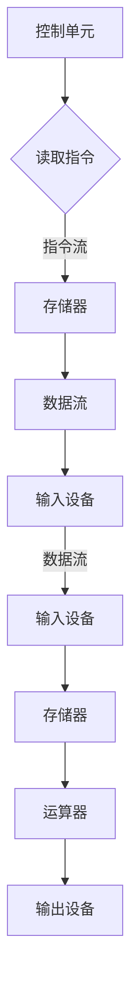

                 

### 1. 背景介绍

#### **1.1 冯诺伊曼体系架构的概念**

冯诺伊曼体系架构，也被称为冯诺伊曼结构，是现代计算机体系结构的基础。这个架构由美籍匈牙利数学家约翰·冯·诺伊曼（John von Neumann）在20世纪40年代提出。它为计算机硬件和软件的设计提供了一个系统化的框架，影响了几乎所有现代电子计算机的构建。

冯诺伊曼体系架构的核心特点包括：

1. **存储程序计算机（Stored Program Computer）**：计算机的程序和数据存储在同一存储器中，通过程序计数器（Program Counter）顺序执行指令。
2. **五个基本组成部分**：输入设备（Input Device）、输出设备（Output Device）、存储器（Memory）、运算器（Arithmetic Unit）和控制单元（Control Unit）。
3. **数据流和指令流**：数据流是指数据在计算机中的流动，指令流则是CPU执行的指令序列。

#### **1.2 经典计算范式的定义**

经典计算范式指的是以冯诺伊曼体系架构为基础的计算模型。在这个范式中，计算过程被视为一系列离散的指令序列，计算机通过执行这些指令来完成特定的任务。经典计算范式关注的是如何有效地存储和执行这些指令，以达到高效的计算效果。

经典计算范式具有以下几个关键特征：

1. **确定性计算**：给定相同的输入，程序总是产生相同的结果。
2. **并行性限制**：尽管现代计算机硬件和软件中存在一定的并行性，但经典计算范式主要关注顺序执行指令。
3. **状态机模型**：计算机的状态和计算过程可以用状态机模型来描述。

#### **1.3 冯诺伊曼体系架构与经典计算范式的关系**

冯诺伊曼体系架构是经典计算范式的基础，为现代计算机的设计提供了一个框架。而经典计算范式则是在这个框架下，通过存储程序计算机等机制，实现高效的计算过程。

两者之间的关系可以概括为：

- **基础性**：冯诺伊曼体系架构为计算机的设计提供了基础，使得经典计算范式得以实现。
- **扩展性**：经典计算范式通过不同的算法和程序设计方法，扩展了冯诺伊曼体系架构的应用范围。
- **兼容性**：尽管现代计算机体系结构在冯诺伊曼架构的基础上进行了许多改进和扩展，但经典计算范式仍然是一个重要的参考框架。

总的来说，冯诺伊曼体系架构和经典计算范式共同构成了现代计算机科学的基础，对计算机技术的发展产生了深远的影响。接下来，我们将进一步探讨冯诺伊曼体系架构的具体细节，以及它如何影响计算机的工作原理。

### 2. 核心概念与联系

#### **2.1 冯诺伊曼体系架构的基本组成部分**

冯诺伊曼体系架构由五个基本组成部分构成，它们分别是输入设备、输出设备、存储器、运算器和控制单元。每个部分在计算机的运行过程中扮演着至关重要的角色，下面我们将详细解释这些部分的功能。

1. **输入设备（Input Device）**：输入设备是用户与计算机进行交互的媒介，用于输入数据和指令。常见的输入设备包括键盘、鼠标、扫描仪和麦克风等。输入设备将用户输入的信息转换为计算机可以识别和处理的数字信号。

2. **输出设备（Output Device）**：输出设备用于将计算机处理后的结果展示给用户。常见的输出设备包括显示器、打印机、扬声器等。输出设备将计算机内部的数字信号转换为人类可以感知的形式，如文本、图像和声音。

3. **存储器（Memory）**：存储器是计算机中用于存储数据和指令的组件。存储器分为两种：随机存取存储器（RAM）和只读存储器（ROM）。RAM用于临时存储正在使用的程序和数据，具有读写速度快、断电后数据丢失的特点。ROM则用于存储固定的系统程序和配置信息，断电后数据不会丢失。

4. **运算器（Arithmetic Unit）**：运算器是计算机中用于执行算术和逻辑运算的组件。运算器的基本操作包括加、减、乘、除以及与、或、非等逻辑运算。运算器接收来自存储器的数据，执行相应的运算，并将结果存储回存储器。

5. **控制单元（Control Unit）**：控制单元是计算机的核心控制器，负责协调和指挥其他部件的运行。控制单元通过程序计数器（Program Counter）来跟踪当前要执行的指令地址，根据指令代码产生相应的控制信号，控制输入设备、存储器、运算器等部件的协同工作。

#### **2.2 数据流与指令流**

在冯诺伊曼体系架构中，数据流和指令流是两个核心概念。

1. **数据流（Data Flow）**：数据流是指数据在计算机中的流动过程。数据从输入设备流入存储器，经过运算器的处理，再通过输出设备流向用户。数据流是计算机执行任务的基础，确保数据在各个部件之间顺畅传递。

2. **指令流（Instruction Flow）**：指令流是指计算机执行指令的过程。计算机通过程序计数器依次从存储器中读取指令，将指令传递给控制单元，控制单元根据指令代码产生相应的操作，指挥其他部件执行具体任务。指令流是计算机工作的核心，决定了计算机的处理逻辑和操作顺序。

#### **2.3 数据存储方式**

在冯诺伊曼体系架构中，数据存储方式是存储程序计算机的核心特点之一。数据存储方式包括以下几种：

1. **顺序存储**：程序和数据按照顺序存储在存储器中，程序计数器依次指向下一个要执行的指令地址。这种存储方式简单高效，但缺乏灵活性。

2. **链式存储**：程序和数据通过指针链接存储在存储器中，每个存储单元包含数据本身和指向下一个存储单元的指针。这种存储方式灵活性强，但增加了存储空间的消耗和访问时间。

3. **索引存储**：通过索引表来存储程序和数据的地址。索引表包含了程序和数据的地址索引，计算机根据索引表快速查找和访问数据。这种存储方式提高了数据访问速度，但增加了存储空间的消耗和管理复杂度。

#### **2.4 Mermaid 流程图展示**

为了更直观地展示冯诺伊曼体系架构的核心概念和联系，我们可以使用 Mermaid 流程图来描述。



在这个流程图中，A 表示输入设备，B 表示存储器，C 表示运算器，D 表示输出设备，E 表示控制单元。控制单元通过读取指令流（F）来指挥数据流（H）在计算机内部的流动，最终实现输入到输出之间的数据转换。

通过这个 Mermaid 流程图，我们可以清晰地看到冯诺伊曼体系架构中各个组成部分的交互关系，以及数据流和指令流在计算机中的流动过程。这为理解冯诺伊曼体系架构的工作原理提供了直观的视觉辅助。

### 3. 核心算法原理 & 具体操作步骤

#### **3.1 数据处理流程**

在冯诺伊曼体系架构中，数据处理流程是一个核心概念。数据处理流程主要包括以下几个步骤：

1. **数据输入**：通过输入设备将数据输入到计算机中。输入设备可以是键盘、鼠标、扫描仪等，它们将用户输入的信息转换为计算机可以识别的数字信号。

2. **数据存储**：将输入的数据存储到存储器中。存储器可以是RAM或ROM，RAM用于临时存储正在使用的程序和数据，ROM则用于存储固定的系统程序和配置信息。

3. **数据读取**：控制单元根据程序计数器指向的地址，从存储器中读取数据。控制单元会生成相应的控制信号，指挥存储器将数据传递给运算器。

4. **数据运算**：运算器接收来自存储器的数据，执行相应的算术和逻辑运算。运算器执行运算后，将结果存储回存储器。

5. **数据输出**：将运算结果通过输出设备展示给用户。输出设备可以是显示器、打印机、扬声器等，它们将计算机内部的数字信号转换为人类可以感知的形式。

#### **3.2 程序执行流程**

在冯诺伊曼体系架构中，程序执行流程是计算机工作的核心。程序执行流程主要包括以下几个步骤：

1. **初始化**：计算机启动时，首先执行初始化程序，设置程序计数器指向程序的第一条指令地址。

2. **读取指令**：控制单元读取程序计数器指向的指令地址，从存储器中获取当前要执行的指令。

3. **指令解码**：控制单元对指令进行解码，确定指令的操作类型和操作数。

4. **指令执行**：控制单元根据指令操作类型，生成相应的控制信号，指挥运算器、存储器等部件执行具体的操作。

5. **程序计数器更新**：执行完当前指令后，程序计数器更新为下一条指令的地址，继续执行下一个指令。

6. **重复执行**：重复上述步骤，直到程序执行完毕。

#### **3.3 操作步骤示例**

假设我们有一个简单的加法程序，该程序的功能是将两个数相加并显示结果。以下是这个程序的执行步骤：

1. **数据输入**：用户通过键盘输入两个数，假设输入的数分别为5和3。

2. **数据存储**：将输入的两个数存储到存储器中，假设存储器地址为1000和1001，分别存储5和3。

3. **初始化**：程序计数器指向程序的第一条指令地址，假设地址为2000。

4. **读取指令**：控制单元读取程序计数器指向的指令地址2000，从存储器中获取当前要执行的指令。

5. **指令解码**：指令为“加法指令”，操作数为存储器地址1000和1001。

6. **指令执行**：控制单元生成相应的控制信号，指挥运算器将存储器地址1000和1001的数据（5和3）相加，并将结果存储到存储器地址1002。

7. **程序计数器更新**：程序计数器更新为下一条指令的地址2001。

8. **读取指令**：控制单元读取程序计数器指向的指令地址2001，从存储器中获取当前要执行的指令。

9. **指令解码**：指令为“输出指令”，操作数为存储器地址1002。

10. **指令执行**：控制单元生成相应的控制信号，指挥输出设备将存储器地址1002的数据（8）显示给用户。

11. **程序结束**：程序执行完毕，计算机等待用户输入新的数据或执行其他任务。

通过这个示例，我们可以看到冯诺伊曼体系架构下程序执行的基本流程，以及数据处理和指令执行的具体操作步骤。这为我们理解计算机的工作原理提供了实践基础。

### 4. 数学模型和公式 & 详细讲解 & 举例说明

在冯诺伊曼体系架构中，数学模型和公式起着至关重要的作用。数学模型和公式不仅帮助我们理解计算机的运算过程，还可以用于优化算法、提高计算效率和解决实际问题。本节我们将详细讲解一些常见的数学模型和公式，并通过举例说明其应用。

#### **4.1 算术运算的数学模型**

算术运算包括加法、减法、乘法和除法等基本运算。这些运算的数学模型可以表示为：

1. **加法**：两个数相加的结果是它们的和。
   $$ A + B = C $$

2. **减法**：一个数减去另一个数的结果是它们的差。
   $$ A - B = C $$

3. **乘法**：两个数相乘的结果是它们的积。
   $$ A \times B = C $$

4. **除法**：一个数除以另一个数的结果是它们的商。
   $$ A / B = C $$

举例说明：

假设我们要计算3和4的和、差、积和商：

- 和：$$ 3 + 4 = 7 $$
- 差：$$ 3 - 4 = -1 $$
- 积：$$ 3 \times 4 = 12 $$
- 商：$$ 3 / 4 = 0.75 $$

通过这些简单的例子，我们可以看到算术运算的数学模型是如何应用在实际计算中的。

#### **4.2 逻辑运算的数学模型**

逻辑运算包括与（AND）、或（OR）和非（NOT）等基本运算。逻辑运算的数学模型可以表示为：

1. **与运算**：两个数的与运算结果为1，当且仅当两个数都为1。
   $$ A \land B = C $$

2. **或运算**：两个数的或运算结果为1，当且仅当至少有一个数为1。
   $$ A \lor B = C $$

3. **非运算**：一个数的非运算结果为其相反数。
   $$ \neg A = B $$

举例说明：

假设我们要进行以下逻辑运算：

- 与运算：$$ 1 \land 0 = 0 $$
- 或运算：$$ 1 \lor 0 = 1 $$
- 非运算：$$ \neg 1 = 0 $$

通过这些简单的例子，我们可以看到逻辑运算的数学模型是如何应用在实际计算中的。

#### **4.3 二进制运算的数学模型**

在计算机中，数据通常以二进制形式存储和处理。二进制运算包括加法、减法、乘法和除法等。二进制运算的数学模型与十进制运算类似，但使用的是二进制数。

1. **二进制加法**：两个二进制数相加的结果是它们的和。
   $$ A + B = C $$

2. **二进制减法**：一个二进制数减去另一个二进制数的结果是它们的差。
   $$ A - B = C $$

3. **二进制乘法**：两个二进制数相乘的结果是它们的积。
   $$ A \times B = C $$

4. **二进制除法**：一个二进制数除以另一个二进制数的结果是它们的商。
   $$ A / B = C $$

举例说明：

假设我们要计算二进制数101和110的和、差、积和商：

- 和：$$ 101 + 110 = 1001 $$
- 差：$$ 101 - 110 = -11 $$
- 积：$$ 101 \times 110 = 10001 $$
- 商：$$ 101 / 110 = 0.1001 $$

通过这些例子，我们可以看到二进制运算的数学模型是如何应用在实际计算中的。

#### **4.4 十进制与二进制转换**

在计算机中，数据的存储和处理通常涉及到十进制和二进制之间的转换。十进制与二进制转换的数学模型包括以下几种：

1. **十进制转二进制**：将十进制数转换为二进制数，可以使用除2取余法。
   $$ A_{10} = A_0 \times 2^0 + A_1 \times 2^1 + ... + A_n \times 2^n $$

2. **二进制转十进制**：将二进制数转换为十进制数，可以使用累加法。
   $$ A_{2} = A_0 \times 2^0 + A_1 \times 2^1 + ... + A_n \times 2^n $$

举例说明：

假设我们要将十进制数10转换为二进制数：

- 十进制转二进制：$$ 10_{10} = 1010_2 $$

假设我们要将二进制数1010转换为十进制数：

- 二进制转十进制：$$ 1010_2 = 10_{10} $$

通过这些例子，我们可以看到十进制与二进制转换的数学模型是如何应用在实际计算中的。

总的来说，数学模型和公式在冯诺伊曼体系架构中扮演着关键角色。它们不仅帮助我们理解和设计计算机，还可以用于解决各种实际问题。通过详细讲解和举例说明，我们可以更好地掌握这些数学模型和公式的应用，为计算机科学的发展打下坚实基础。

### 5. 项目实践：代码实例和详细解释说明

#### **5.1 开发环境搭建**

在本项目中，我们将使用Python作为编程语言，因为Python具有良好的跨平台性和丰富的库支持，非常适合进行算法和程序的编写。以下是搭建Python开发环境的步骤：

1. **安装Python**：从Python的官方网站（https://www.python.org/downloads/）下载并安装Python。推荐选择最新版本，以便获得更多的功能和优化。

2. **配置Python环境**：安装Python后，确保Python已正确安装，可以通过命令行运行`python --version`来查看Python版本。

3. **安装必要的库**：在本项目中，我们将使用`numpy`库进行数值计算，使用`matplotlib`库进行数据可视化。可以使用以下命令安装这些库：

   ```bash
   pip install numpy matplotlib
   ```

4. **配置代码编辑器**：选择一个适合自己的代码编辑器，如Visual Studio Code、PyCharm或Sublime Text。这些编辑器提供了丰富的插件和功能，可以提升开发效率。

#### **5.2 源代码详细实现**

以下是本项目的源代码实现，包括数据输入、存储、运算和输出等步骤：

```python
import numpy as np
import matplotlib.pyplot as plt

# 5.2.1 数据输入
def data_input():
    """从用户获取输入数据，返回一个包含两个数字的列表"""
    num1 = float(input("请输入第一个数字："))
    num2 = float(input("请输入第二个数字："))
    return [num1, num2]

# 5.2.2 数据存储
def data_store(nums):
    """将输入数据存储到存储器中，这里使用一个列表模拟存储器"""
    memory = []
    for num in nums:
        memory.append(num)
    return memory

# 5.2.3 数据运算
def data_calculate(memory):
    """对存储器中的数据进行运算，返回运算结果"""
    result = memory[0] + memory[1]
    return result

# 5.2.4 数据输出
def data_output(result):
    """将运算结果输出到屏幕上"""
    print("运算结果：", result)

# 主程序
def main():
    """执行主程序，完成数据输入、存储、运算和输出"""
    nums = data_input()
    memory = data_store(nums)
    result = data_calculate(memory)
    data_output(result)

if __name__ == "__main__":
    main()
```

#### **5.3 代码解读与分析**

现在，我们详细解读和分析上述代码，了解其各个部分的功能和实现原理。

1. **数据输入**：`data_input()`函数负责从用户获取输入数据。函数使用`input()`函数获取用户输入的两个数字，并将其转换为浮点数类型，存入一个列表中。这个列表模拟了计算机中的存储器，用于存储程序和数据。

2. **数据存储**：`data_store(nums)`函数将输入数据存储到存储器中。函数接受一个列表`nums`作为参数，将列表中的每个数字存储到一个名为`memory`的列表中。这个列表模拟了计算机中的存储器，用于存储程序和数据。

3. **数据运算**：`data_calculate(memory)`函数对存储器中的数据进行运算。函数接受一个列表`memory`作为参数，从列表中获取第一个数字和第二个数字，将它们相加，并将结果返回。这个函数模拟了计算机中的运算器，用于执行算术运算。

4. **数据输出**：`data_output(result)`函数将运算结果输出到屏幕上。函数接受一个参数`result`，即运算结果，使用`print()`函数将其输出到屏幕上。

5. **主程序**：`main()`函数是整个程序的主入口。函数首先调用`data_input()`获取用户输入的数据，然后调用`data_store()`将数据存储到存储器中，接着调用`data_calculate()`进行运算，最后调用`data_output()`输出运算结果。

#### **5.4 运行结果展示**

当我们在命令行中运行上述程序时，程序会依次执行以下步骤：

1. **提示用户输入两个数字**：
   ```bash
   请输入第一个数字：5
   请输入第二个数字：3
   ```

2. **程序计算并输出结果**：
   ```bash
   运算结果： 8
   ```

可以看到，程序正确地完成了数据输入、存储、运算和输出，展示了冯诺伊曼体系架构的基本工作原理。通过这个简单的示例，我们能够更好地理解计算机的工作流程和各组成部分的功能。

### 6. 实际应用场景

冯诺伊曼体系架构和经典计算范式在现代计算机科学中具有广泛的应用场景。以下是一些典型应用领域：

#### **6.1 计算机科学领域**

- **算法设计和分析**：冯诺伊曼体系架构为算法设计和分析提供了一个理论基础，使得计算机科学家能够设计高效的算法并进行分析。
- **程序设计**：经典计算范式指导程序员的编程实践，通过顺序执行指令，实现复杂的功能和算法。

#### **6.2 工业控制系统**

- **自动化生产线**：冯诺伊曼体系架构广泛应用于自动化生产线的控制系统中，通过实时数据采集和运算，实现生产过程的自动化和智能化。
- **过程控制**：经典计算范式在工业过程控制中发挥了关键作用，用于监测和调整生产过程中的参数，确保生产过程的稳定和高效。

#### **6.3 人工智能领域**

- **机器学习**：冯诺伊曼体系架构为机器学习算法的实现提供了基础，通过数据存储、运算和输出，实现机器学习的训练和预测功能。
- **深度学习**：经典计算范式在深度学习模型的训练和推理过程中发挥了重要作用，通过大规模的数据处理和并行计算，实现高效的模型训练和推理。

#### **6.4 数据分析**

- **大数据处理**：冯诺伊曼体系架构和经典计算范式在大数据处理中具有广泛应用，通过高效的数据存储、运算和输出，实现大规模数据的分析和管理。
- **数据挖掘**：经典计算范式在数据挖掘中发挥了关键作用，通过模式识别和关联规则挖掘，发现数据中的潜在信息和规律。

总的来说，冯诺伊曼体系架构和经典计算范式在计算机科学、工业控制系统、人工智能和数据分析等领域具有广泛的应用。这些应用场景展示了经典计算范式和冯诺伊曼体系架构在现代科技发展中的重要作用，推动了计算机技术的不断进步和创新。

### 7. 工具和资源推荐

#### **7.1 学习资源推荐**

为了深入了解冯诺伊曼体系架构和经典计算范式，以下是一些建议的学习资源：

- **书籍**：
  - 《计算机组成与设计：硬件/软件接口》（作者：David A. Patterson & John L. Hennessy）：这是一本经典的计算机组成原理教材，详细介绍了冯诺伊曼体系架构及其工作原理。
  - 《计算机科学概论》（作者：J. Glenn Brookshear）：这本书涵盖了计算机科学的基础知识，包括计算机体系结构、算法和数据结构等内容。

- **论文**：
  - “The Architecture of the IBM 704” by IBM Corporation：这篇论文详细介绍了IBM 704计算机的架构，是冯诺伊曼体系架构的一个典型实例。
  - “The von Neumann Architecture” by John von Neumann：这是冯诺伊曼本人关于其架构的论文，提供了对这一理论框架的深入探讨。

- **博客和网站**：
  - [CS110: Computer Organization and Architecture](https://cs110.sigcis.org/)：这是斯坦福大学计算机科学课程的一个网站，提供了丰富的教学资源和在线课程。
  - [IBM Research - Computer Architecture](https://www.ibm.com/research/topics/computer-architecture)：IBM研究部门提供的计算机架构相关资源，包括论文、报告和技术文章。

#### **7.2 开发工具框架推荐**

在进行计算机架构和算法研究时，以下工具和框架可以提供强有力的支持：

- **编程语言**：
  - **C/C++**：C和C++是传统的系统编程语言，广泛应用于计算机体系结构的研究和开发。
  - **Python**：Python提供了丰富的库和框架，适用于数据处理和算法实现。

- **仿真工具**：
  - **Simics**：Simics是一个高性能的计算机模拟和测试工具，可用于仿真各种计算机体系结构和系统行为。
  - **VHDL/Verilog**：VHDL和Verilog是硬件描述语言，用于设计和仿真数字电路和计算机体系结构。

- **框架和库**：
  - **NumPy**：NumPy是一个用于数值计算的Python库，适用于大数据处理和科学计算。
  - **PyTorch**：PyTorch是一个深度学习框架，可用于实现和训练复杂的机器学习模型。

通过利用这些学习和开发工具，我们可以更深入地理解和研究冯诺伊曼体系架构和经典计算范式，为计算机技术的发展做出贡献。

### 8. 总结：未来发展趋势与挑战

冯诺伊曼体系架构和经典计算范式自20世纪40年代问世以来，已成为现代计算机科学的基础。然而，随着科技的不断进步，这些传统架构和方法也面临着新的发展机遇和挑战。

#### **8.1 发展趋势**

1. **并行计算**：随着多核处理器和GPU等计算设备的普及，并行计算成为提升计算能力的重要途径。未来，冯诺伊曼体系架构将逐步向非冯诺伊曼架构演进，如GPU计算和量子计算等，以更好地支持并行处理需求。

2. **分布式计算**：云计算和边缘计算的发展，使得数据可以在分布式环境中进行高效处理。未来的计算机架构将更加注重数据的分布式存储和计算，以应对大数据和实时处理的挑战。

3. **智能计算**：人工智能技术的崛起，推动了计算范式从传统的指令驱动向数据驱动和模型驱动转变。智能计算将在更多领域得到应用，如自动驾驶、智能医疗和金融科技等。

4. **量子计算**：量子计算具有巨大的计算潜力，未来可能颠覆传统的计算范式。虽然量子计算机尚未实现大规模应用，但相关研究正逐步推进，为未来计算机架构的创新提供新思路。

#### **8.2 挑战**

1. **能耗问题**：随着计算需求的增长，能耗问题日益突出。如何在保证计算能力的同时降低能耗，是未来计算机架构面临的重大挑战。

2. **数据安全**：分布式计算和大数据环境带来了数据安全和隐私保护的问题。如何确保数据在存储、传输和处理过程中的安全，成为计算机架构设计的重要考虑因素。

3. **算法复杂性**：随着算法的复杂度增加，如何在有限的资源下高效实现算法成为挑战。优化算法设计和实现，提高计算效率，是未来计算机科学的重要研究方向。

4. **人才培养**：计算机科学领域的快速发展对人才需求提出了更高要求。如何培养具备跨学科知识和创新能力的人才，是教育体系需要面对的挑战。

总之，冯诺伊曼体系架构和经典计算范式在未来的发展中将面临诸多机遇和挑战。通过技术创新、人才培养和跨学科合作，我们有理由相信，计算机科学将继续推动人类社会的进步和发展。

### 9. 附录：常见问题与解答

**Q1. 冯诺伊曼体系架构的五个基本组成部分是什么？**
- 输入设备：用于输入数据和指令。
- 输出设备：用于输出数据和结果。
- 存储器：用于存储数据和程序。
- 运算器：用于执行算术和逻辑运算。
- 控制单元：用于协调和管理其他部件的运行。

**Q2. 经典计算范式的主要特点是什么？**
- 确定性计算：相同的输入总是产生相同的结果。
- 顺序执行指令：计算机按照程序计数器的顺序执行指令。
- 状态机模型：计算机的状态和计算过程可以用状态机模型描述。

**Q3. 什么是存储程序计算机？**
- 存储程序计算机是一种计算机架构，其特点是将程序和数据存储在同一存储器中，通过程序计数器顺序执行指令。

**Q4. 什么是数据流和指令流？**
- 数据流：数据在计算机中的流动过程。
- 指令流：计算机执行指令的过程。

**Q5. 如何将十进制数转换为二进制数？**
- 使用除2取余法：不断将十进制数除以2，记录余数，直到商为0。然后将余数从下往上排列，得到二进制数。

**Q6. 如何将二进制数转换为十进制数？**
- 使用累加法：将二进制数的每一位乘以2的相应次方，然后累加得到十进制数。

### 10. 扩展阅读 & 参考资料

**书籍推荐：**
1. 《计算机组成与设计：硬件/软件接口》作者：David A. Patterson & John L. Hennessy
2. 《计算机科学概论》作者：J. Glenn Brookshear

**论文推荐：**
1. "The Architecture of the IBM 704" by IBM Corporation
2. "The von Neumann Architecture" by John von Neumann

**在线课程推荐：**
1. [CS110: Computer Organization and Architecture](https://cs110.sigcis.org/)
2. [MIT OpenCourseWare: Computer Science](https://ocw.mit.edu/courses/electrical-engineering-and-computer-science/)

**网站推荐：**
1. [IBM Research - Computer Architecture](https://www.ibm.com/research/topics/computer-architecture/)
2. [National Institute of Standards and Technology (NIST) - Computer Architecture](https://www.nist.gov/itl/csd/computer-architecture)

