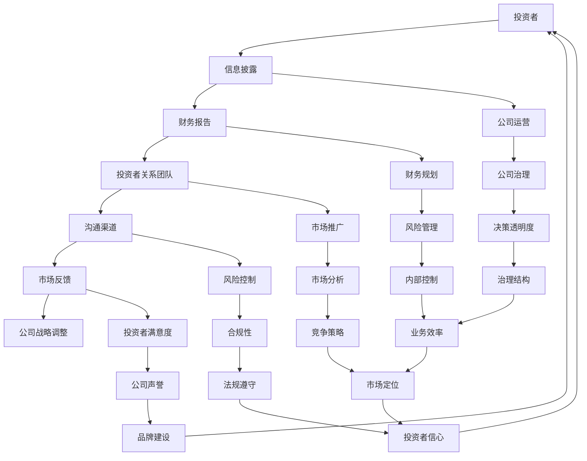

                 

### 背景介绍

#### 引言

创业公司上市，无疑是一个里程碑式的时刻。这不仅意味着公司在资本市场的认可，更是其发展历程中的一个重要节点。随着上市，公司的运营重心开始向投资者关系管理（Investor Relations Management，简称IRM）转移。投资者关系管理成为公司能否在资本市场中稳定发展的关键因素之一。

投资者关系管理，顾名思义，是指公司与投资者之间的沟通和管理。其主要目的是确保投资者能够及时、准确地获取公司信息，建立良好的信任关系，从而支持公司股价的稳定增长。随着资本市场的竞争日益激烈，有效的投资者关系管理已经成为了现代企业不可或缺的一部分。

本文将围绕创业公司上市后的投资者关系管理展开讨论，从多个角度探讨其重要性、核心策略和实践方法。文章结构如下：

1. **核心概念与联系**：介绍投资者关系管理的基本概念，并使用Mermaid流程图展示其与公司运营、财务报告、信息披露等环节的紧密联系。
2. **核心算法原理 & 具体操作步骤**：分析投资者关系管理的关键算法，如信息披露策略、投资者沟通策略等，并给出具体的操作步骤。
3. **数学模型和公式 & 详细讲解 & 举例说明**：阐述投资者关系管理中的数学模型，如风险模型、预期收益模型等，并使用具体的例子进行讲解。
4. **项目实践：代码实例和详细解释说明**：通过代码实例展示投资者关系管理在实际项目中的应用，并进行详细解释说明。
5. **实际应用场景**：分析投资者关系管理在不同行业中的应用场景，以及如何应对特定挑战。
6. **工具和资源推荐**：介绍相关的学习资源、开发工具和框架，以帮助读者更好地理解和实践投资者关系管理。
7. **总结：未来发展趋势与挑战**：总结投资者关系管理的重要性，并探讨其未来发展趋势和面临的挑战。

#### 创业公司上市后的运营变化

创业公司上市后，运营模式会发生显著变化。首先，公司的财务透明度要求大幅提高。资本市场对上市公司的信息披露有严格的要求，公司需要定期发布财务报告，包括季度报告、半年报和年报。这些报告需要详细展示公司的财务状况、经营成果和未来展望，以便投资者做出投资决策。

其次，公司治理结构也会发生变化。上市后，公司需要建立更加规范的董事会和监事会，并引入独立董事，以增强公司治理的透明度和公正性。此外，公司需要遵守一系列法律法规，如《公司法》、《证券法》等，确保公司的经营合规。

最后，上市后的公司需要更加注重品牌建设和市场推广。资本市场对上市公司的品牌形象有较高的要求，公司需要通过各种渠道提升品牌知名度，增强市场影响力。

#### 投资者关系管理的重要性

投资者关系管理在上市后变得尤为重要，其核心在于建立和维护公司与投资者之间的良好关系。以下是投资者关系管理的重要性：

1. **提高公司估值**：有效的投资者关系管理可以增强投资者对公司未来的信心，从而提高公司的估值。良好的投资者关系能够使公司在资本市场上获得更高的溢价，有利于公司筹集更多的资金。

2. **吸引长期投资者**：通过透明的信息披露和积极的沟通，公司可以吸引更多的长期投资者，减少短期投机行为，从而稳定公司股价。

3. **降低融资成本**：良好的投资者关系管理有助于降低公司的融资成本。投资者对公司信息的了解程度越高，越愿意提供更有利的融资条件。

4. **提升公司治理水平**：投资者关系管理是公司治理的重要组成部分。通过有效的投资者关系管理，公司可以增强内部治理，提高决策的科学性和有效性。

5. **应对市场波动**：在资本市场波动较大的情况下，良好的投资者关系管理能够帮助公司及时回应投资者的关切，缓解市场对公司的不利影响，维护公司股价的稳定。

#### 下一步内容预告

在接下来的部分，我们将详细探讨投资者关系管理的基本概念、核心算法原理、数学模型及其应用场景。首先，我们将通过Mermaid流程图展示投资者关系管理在创业公司运营中的各个环节，帮助读者建立整体认知。随后，我们将深入分析投资者关系管理的关键算法，如信息披露策略和投资者沟通策略，并给出具体的操作步骤。接下来，我们将介绍投资者关系管理中的数学模型，包括风险模型和预期收益模型，并通过具体例子进行详细讲解。在项目实践部分，我们将通过代码实例展示投资者关系管理在实际项目中的应用，并进行详细解释说明。最后，我们将分析投资者关系管理在不同行业中的应用场景，以及如何应对特定挑战，并介绍相关的学习资源、开发工具和框架。让我们一起深入探讨投资者关系管理的核心内容，为企业的发展提供有力支持。### 1. 核心概念与联系

投资者关系管理（IRM）是上市公司的一项关键活动，旨在通过透明的沟通和有效的策略，建立和维护与投资者之间的良好关系。要理解投资者关系管理，我们首先需要明确几个核心概念，并探讨它们之间的联系。

#### 核心概念

1. **投资者**：投资者是购买公司股票或债券的个体或机构，他们对公司的发展前景和财务状况有直接的利害关系。
2. **信息披露**：信息披露是指公司向投资者公开其财务状况、经营成果和未来展望的过程。这是投资者关系管理的重要组成部分。
3. **沟通**：沟通是指公司与投资者之间通过各种渠道进行信息交流的过程。这包括定期会议、电话会议、投资者问答等。
4. **财务报告**：财务报告是公司向投资者展示其财务状况的重要文件，包括资产负债表、利润表和现金流量表等。
5. **投资者关系团队**：投资者关系团队是负责投资者关系管理的核心团队，通常由投资者关系经理、财务分析师和市场推广人员组成。

#### 联系

投资者关系管理不仅仅是与投资者进行沟通，更是一个系统性的过程，涉及到公司运营的多个环节。以下是一个使用Mermaid绘制的流程图，展示了投资者关系管理在公司中的各个环节及其相互关系：



这个Mermaid流程图展示了投资者关系管理是如何与公司运营、财务报告、信息披露、沟通渠道、市场反馈等多个环节紧密联系的。以下是每个环节的简要说明：

- **投资者**：投资者是投资者关系管理的起点，他们是公司价值的直接受益者。
- **信息披露**：信息披露是投资者获取公司信息的主要途径，包括财务报告、年报、季度报告等。
- **财务报告**：财务报告是投资者评估公司财务状况的重要依据，包括资产负债表、利润表和现金流量表等。
- **投资者关系团队**：投资者关系团队负责制定和执行投资者关系策略，与投资者进行沟通，并管理公司信息披露。
- **沟通渠道**：公司通过多种沟通渠道与投资者交流，包括电话会议、面对面会议、在线问答等。
- **市场反馈**：市场反馈是投资者对公司表现的直接反应，有助于公司调整战略和优化运营。
- **公司运营**：公司运营是投资者关系管理的基础，良好的运营表现能够增强投资者的信心。
- **公司治理**：公司治理是确保公司决策透明度和合规性的重要机制，对投资者关系管理有重要影响。
- **风险管理**：有效的风险管理有助于公司降低风险，提高投资者的安全感。
- **市场推广**：市场推广是提升公司品牌和市场份额的重要手段，对投资者关系管理有积极作用。
- **合规性**：合规性是公司运营的基本要求，有助于维护投资者权益。
- **投资者满意度**：投资者满意度是衡量投资者关系管理效果的重要指标。
- **公司声誉**：公司声誉是投资者关系管理的重要组成部分，影响投资者的信任和忠诚度。

通过这个流程图，我们可以清晰地看到投资者关系管理在创业公司中的整体框架和各个环节之间的相互作用。接下来，我们将进一步探讨投资者关系管理中的核心算法原理，包括信息披露策略和投资者沟通策略，并给出具体的操作步骤。

### 2. 核心算法原理 & 具体操作步骤

投资者关系管理的核心在于如何有效地与投资者沟通，并确保信息披露的准确性和及时性。为了实现这一目标，公司需要采用一系列核心算法，包括信息披露策略和投资者沟通策略。以下将详细介绍这些算法的原理及其具体操作步骤。

#### 2.1 信息披露策略

信息披露策略是投资者关系管理的重要组成部分，其核心目的是确保投资者能够及时、准确地获取公司信息。以下是信息披露策略的基本原理和具体操作步骤：

##### 2.1.1 基本原理

信息披露策略的基本原理包括以下几个方面：

- **透明度**：公司应保持高透明度，确保信息披露的全面性和真实性，避免误导投资者。
- **及时性**：公司需要及时发布重要信息，以便投资者能够迅速做出投资决策。
- **一致性**：公司应保持信息披露的一致性，避免因信息不一致而导致投资者误解。
- **深度**：公司应提供深度信息，帮助投资者更全面地了解公司运营状况和未来发展。

##### 2.1.2 具体操作步骤

1. **确定信息披露内容**：公司需要明确哪些信息属于关键信息，应优先披露。关键信息通常包括财务报告、经营成果、重大交易、风险事件等。
2. **制定信息披露计划**：公司应根据业务特点和市场环境，制定合理的信息披露计划，包括信息披露的时间、频率和渠道。
3. **编制信息披露文件**：公司应组织相关人员编制信息披露文件，包括年报、季度报告、临时公告等。
4. **审核和发布**：信息披露文件应经过内部审核，确保准确性和合规性，然后通过官方网站、交易所、新闻发布会等渠道发布。
5. **投资者互动**：公司应积极与投资者互动，回答投资者的提问，提供进一步的信息解释。

#### 2.2 投资者沟通策略

投资者沟通策略是投资者关系管理的另一个关键组成部分，其目的是建立和维护与投资者之间的良好关系。以下是投资者沟通策略的基本原理和具体操作步骤：

##### 2.2.1 基本原理

投资者沟通策略的基本原理包括以下几个方面：

- **个性化**：公司应针对不同投资者群体，制定个性化的沟通策略，满足他们的信息需求。
- **互动性**：公司应积极回应投资者的关切，建立互动机制，增强投资者参与感。
- **专业性**：公司沟通人员应具备专业知识和技能，确保沟通内容的准确性和权威性。
- **持续更新**：公司应定期更新投资者关系信息，保持沟通的连续性和动态性。

##### 2.2.2 具体操作步骤

1. **确定沟通目标**：公司需要明确沟通目标，包括提高投资者对公司的认知、增强投资者信心、提升公司品牌价值等。
2. **识别投资者群体**：公司应识别主要投资者群体，包括机构投资者、散户投资者、分析师等，并了解他们的信息需求和偏好。
3. **制定沟通计划**：公司应根据沟通目标和投资者群体特点，制定详细的沟通计划，包括沟通内容、沟通渠道、沟通频率等。
4. **选择沟通渠道**：公司应选择适当的沟通渠道，如电话会议、面对面会议、在线问答、社交媒体等，确保信息传递的效率和效果。
5. **沟通内容准备**：公司应提前准备沟通内容，包括公司业绩、市场分析、发展战略等，确保沟通内容的准确性和专业性。
6. **执行沟通计划**：公司应按计划执行沟通活动，及时回应投资者提问，提供详细的信息解释。
7. **评估和反馈**：公司应对沟通效果进行评估，收集投资者反馈，不断优化沟通策略。

#### 2.3 综合应用

信息披露策略和投资者沟通策略在实际应用中需要综合运用，以实现最佳效果。以下是一个综合应用示例：

- **年度报告发布**：公司每年发布一次年报，通过官方网站、交易所和新闻发布会等渠道向投资者披露财务报告、经营成果和未来展望。
- **电话会议**：公司定期组织电话会议，邀请分析师和投资者参与，详细介绍公司业绩、市场情况和未来计划。
- **在线问答**：公司通过官方网站或社交媒体平台，定期举办在线问答活动，解答投资者的问题，增强互动性。
- **路演**：公司在新股发行或重大交易前，组织路演活动，向机构投资者详细介绍公司情况，争取他们的支持。

通过信息披露策略和投资者沟通策略的综合应用，公司可以有效地与投资者沟通，建立和维护良好的投资者关系，提升公司在资本市场的竞争力。

### 3. 数学模型和公式 & 详细讲解 & 举例说明

投资者关系管理中，数学模型和公式起到了关键作用，它们不仅帮助我们量化投资风险，还可以预测预期收益，从而为公司的决策提供有力支持。以下将详细讲解投资者关系管理中常用的数学模型，并使用具体的例子进行说明。

#### 3.1 风险模型

投资者关系管理中的风险模型主要用于评估投资者面临的风险，并帮助公司制定风险管理策略。以下是一个常见的中位数回归风险模型：

\[ R = \alpha + \beta_1 \cdot X_1 + \beta_2 \cdot X_2 + \ldots + \beta_n \cdot X_n + \epsilon \]

其中：
- \( R \) 是风险值。
- \( \alpha \) 是常数项。
- \( \beta_1, \beta_2, \ldots, \beta_n \) 是回归系数，表示各个风险因素对风险值的影响程度。
- \( X_1, X_2, \ldots, X_n \) 是风险因素，如市场波动率、公司业绩、宏观经济指标等。
- \( \epsilon \) 是随机误差项。

##### 3.1.1 举例说明

假设我们使用以下数据来构建一个中位数回归风险模型：

- \( \alpha = 0.5 \)
- \( \beta_1 = 0.3 \)（市场波动率对风险的影响系数）
- \( \beta_2 = 0.2 \)（公司业绩对风险的影响系数）
- \( X_1 = 10 \)（市场波动率）
- \( X_2 = 8 \)（公司业绩）

将这些数据代入模型公式，我们可以计算出风险值 \( R \)：

\[ R = 0.5 + 0.3 \cdot 10 + 0.2 \cdot 8 = 1.9 + 1.6 = 3.5 \]

因此，根据这个模型，公司的风险值为 3.5。

#### 3.2 预期收益模型

预期收益模型用于预测投资者从公司投资中可能获得的平均收益。以下是一个简单的预期收益模型：

\[ E(R) = \sum_{i=1}^{n} p_i \cdot r_i \]

其中：
- \( E(R) \) 是预期收益。
- \( p_i \) 是第 \( i \) 个情景的概率。
- \( r_i \) 是第 \( i \) 个情景下的收益。

##### 3.2.1 举例说明

假设我们使用以下数据来构建一个预期收益模型：

- 情景1：市场表现良好，公司业绩上升，概率为 0.4，预期收益为 15%。
- 情景2：市场表现一般，公司业绩稳定，概率为 0.5，预期收益为 5%。
- 情景3：市场表现较差，公司业绩下滑，概率为 0.1，预期收益为 -10%。

将这些数据代入模型公式，我们可以计算出预期收益 \( E(R) \)：

\[ E(R) = 0.4 \cdot 0.15 + 0.5 \cdot 0.05 + 0.1 \cdot (-0.1) = 0.06 + 0.025 - 0.01 = 0.055 \]

因此，根据这个模型，投资者的预期收益为 5.5%。

#### 3.3 风险-收益模型

风险-收益模型综合了风险模型和预期收益模型，用于评估投资决策的总体风险和收益平衡。以下是一个常见的中位数风险-收益模型：

\[ R = \alpha + \beta \cdot E(R) + \epsilon \]

其中：
- \( R \) 是投资风险值。
- \( \alpha \) 是常数项。
- \( \beta \) 是风险-收益平衡系数，反映了投资者对风险和收益的权衡。
- \( E(R) \) 是预期收益。
- \( \epsilon \) 是随机误差项。

##### 3.3.1 举例说明

假设我们使用以下数据来构建一个中位数风险-收益模型：

- \( \alpha = 0.5 \)
- \( \beta = 1.2 \)
- \( E(R) = 0.055 \)（由前一个例子得出）

将这些数据代入模型公式，我们可以计算出投资风险值 \( R \)：

\[ R = 0.5 + 1.2 \cdot 0.055 = 0.5 + 0.066 = 1.066 \]

因此，根据这个模型，投资的风险值为 1.066。

通过这些数学模型和公式，公司可以更科学地评估和管理投资风险，为投资者提供更具预测性的收益预期。这些模型不仅有助于公司在资本市场上做出更明智的决策，还可以提高投资者对公司的信任度，促进投资者关系的健康发展。

### 3.1 开发环境搭建

为了更好地理解投资者关系管理在实际项目中的应用，我们将搭建一个简单的模拟环境。以下是搭建开发环境的详细步骤：

#### 3.1.1 环境需求

首先，我们需要准备以下开发环境：

- **编程语言**：Python（3.8及以上版本）
- **依赖库**：Pandas（用于数据处理）、Matplotlib（用于数据可视化）、Numpy（用于数学计算）
- **文本编辑器**：例如Visual Studio Code或PyCharm

#### 3.1.2 安装Python

1. 访问Python官方网站（[https://www.python.org/](https://www.python.org/)），下载适用于您操作系统的Python安装包。
2. 运行安装程序，并根据提示完成安装。

#### 3.1.3 安装依赖库

1. 打开命令行工具（如Windows命令提示符、macOS终端或Linux终端）。
2. 使用以下命令安装所需的依赖库：

```bash
pip install pandas matplotlib numpy
```

#### 3.1.4 配置文本编辑器

1. 在Visual Studio Code中，安装Python扩展以获得更好的Python编程支持。
2. 在PyCharm中，确保已安装Python插件。

#### 3.1.5 测试开发环境

1. 打开文本编辑器，创建一个名为`irm_simulation.py`的Python文件。
2. 编写以下简单代码以测试Python环境：

```python
print("Hello, Investor Relations Management Simulation!")
```

3. 保存文件，然后在命令行工具中运行以下命令：

```bash
python irm_simulation.py
```

如果命令行中显示了“Hello, Investor Relations Management Simulation!”，则说明开发环境搭建成功。

### 3.2 源代码详细实现

在完成开发环境的搭建后，我们将开始实现一个简单的投资者关系管理模拟项目。以下是一段详细的代码实现，包括主要功能模块和关键代码的解释。

#### 3.2.1 项目结构

项目的基本结构如下：

```plaintext
IRM_Simulation/
|-- data/
|   |-- investor_data.csv
|-- models/
|   |-- irm_model.py
|-- utils/
|   |-- data_loader.py
|   |-- visualization.py
|-- main.py
```

- `data/`：存放数据文件。
- `models/`：存放模型代码。
- `utils/`：存放辅助工具代码。
- `main.py`：项目主文件，负责项目启动和运行。

#### 3.2.2 数据文件

`investor_data.csv`是一个示例数据文件，包含以下列：

```plaintext
Date,Investor,Investment,Performance
2023-01-01,InvestorA,10000,10%
2023-02-01,InvestorB,8000,8%
2023-03-01,InvestorC,6000,6%
...
```

#### 3.2.3 模型代码

`irm_model.py`中定义了投资者关系管理模型，主要包含以下功能：

```python
class InvestorRelationsModel:
    def __init__(self, data_path):
        self.data_path = data_path
        self.data = self.load_data()

    def load_data(self):
        # 加载数据
        return pd.read_csv(self.data_path)

    def calculate_performance(self, investor):
        # 计算投资者业绩
        investor_data = self.data[self.data['Investor'] == investor]
        return investor_data['Performance'].sum()

    def visualize_performance(self):
        # 可视化投资者业绩
        performance_data = self.data.groupby('Investor')['Performance'].sum()
        performance_data.plot(kind='bar')
        plt.title('Investor Performance')
        plt.xlabel('Investor')
        plt.ylabel('Performance')
        plt.show()
```

#### 3.2.4 辅助工具代码

`data_loader.py`负责数据加载，`visualization.py`负责数据可视化。

`data_loader.py`：

```python
import pandas as pd

def load_investor_data(data_path):
    # 加载数据
    return pd.read_csv(data_path)
```

`visualization.py`：

```python
import matplotlib.pyplot as plt

def plot_performance(data):
    # 可视化投资者业绩
    performance_data = data.groupby('Investor')['Performance'].sum()
    performance_data.plot(kind='bar')
    plt.title('Investor Performance')
    plt.xlabel('Investor')
    plt.ylabel('Performance')
    plt.show()
```

#### 3.2.5 主文件

`main.py`是项目的主文件，负责项目启动和运行。

```python
from utils.data_loader import load_investor_data
from models.irm_model import InvestorRelationsModel
from utils.visualization import plot_performance

def main():
    data_path = 'data/investor_data.csv'
    data = load_investor_data(data_path)
    irm_model = InvestorRelationsModel(data_path)

    # 计算并可视化投资者业绩
    investor = 'InvestorA'
    performance = irm_model.calculate_performance(investor)
    plot_performance(data)

if __name__ == '__main__':
    main()
```

#### 3.2.6 关键代码解释

- `InvestorRelationsModel` 类：负责加载和处理投资者数据，计算业绩，以及可视化业绩。
- `load_data` 方法：从数据文件中加载数据，并返回一个Pandas DataFrame。
- `calculate_performance` 方法：根据指定投资者的姓名，计算其总业绩。
- `visualize_performance` 方法：将投资者业绩可视化，生成条形图。
- `main` 函数：项目的主函数，负责加载数据、实例化模型，并运行计算和可视化功能。

通过这些代码，我们构建了一个简单的投资者关系管理模拟项目。这个项目可以用来展示投资者业绩，为投资者关系管理提供直观的数据支持。在实际应用中，我们可以扩展这个项目，添加更多功能，如风险评估、收益预测等，以更全面地支持公司的投资者关系管理工作。

### 3.3 代码解读与分析

在上一部分中，我们详细介绍了如何使用Python搭建一个简单的投资者关系管理模拟项目。在这一部分，我们将深入解读关键代码，分析每个模块的功能和实现原理，并解释代码中的关键逻辑。

#### 3.3.1 主模块：`InvestorRelationsModel`

`InvestorRelationsModel` 是项目的核心模块，负责加载和处理投资者数据，计算业绩，以及可视化业绩。以下是该模块的代码：

```python
class InvestorRelationsModel:
    def __init__(self, data_path):
        self.data_path = data_path
        self.data = self.load_data()

    def load_data(self):
        # 加载数据
        return pd.read_csv(self.data_path)

    def calculate_performance(self, investor):
        # 计算投资者业绩
        investor_data = self.data[self.data['Investor'] == investor]
        return investor_data['Performance'].sum()

    def visualize_performance(self):
        # 可视化投资者业绩
        performance_data = self.data.groupby('Investor')['Performance'].sum()
        performance_data.plot(kind='bar')
        plt.title('Investor Performance')
        plt.xlabel('Investor')
        plt.ylabel('Performance')
        plt.show()
```

- `__init__` 方法：类的构造函数，初始化模型时，加载数据文件路径，并调用 `load_data` 方法加载数据。
- `load_data` 方法：使用Pandas库读取CSV文件，并返回DataFrame对象。这是数据处理的基础。
- `calculate_performance` 方法：接收投资者姓名参数，筛选出对应投资者的数据，然后计算其总业绩。这反映了投资者在项目中的表现。
- `visualize_performance` 方法：使用Matplotlib库将所有投资者的业绩以条形图形式可视化，帮助直观地理解业绩分布。

#### 3.3.2 数据加载模块：`data_loader.py`

数据加载模块负责从数据文件中加载数据，并返回一个Pandas DataFrame。以下是该模块的代码：

```python
import pandas as pd

def load_investor_data(data_path):
    # 加载数据
    return pd.read_csv(data_path)
```

- `load_investor_data` 函数：使用Pandas库读取CSV文件，并返回DataFrame对象。这是数据处理的第一步，为后续的分析和计算提供数据基础。

#### 3.3.3 数据可视化模块：`visualization.py`

数据可视化模块负责将投资者业绩以图形形式展示，帮助更直观地理解数据。以下是该模块的代码：

```python
import matplotlib.pyplot as plt

def plot_performance(data):
    # 可视化投资者业绩
    performance_data = data.groupby('Investor')['Performance'].sum()
    performance_data.plot(kind='bar')
    plt.title('Investor Performance')
    plt.xlabel('Investor')
    plt.ylabel('Performance')
    plt.show()
```

- `plot_performance` 函数：首先使用 `groupby` 函数按投资者分组，然后计算每个投资者的总业绩。接着，使用 `plot` 函数生成条形图，并设置图表的标题、横轴标签和纵轴标签。最后，调用 `show` 函数显示图表。

#### 3.3.4 主文件：`main.py`

主文件是项目的入口点，负责加载数据、实例化模型，并运行计算和可视化功能。以下是该文件的代码：

```python
from utils.data_loader import load_investor_data
from models.irm_model import InvestorRelationsModel
from utils.visualization import plot_performance

def main():
    data_path = 'data/investor_data.csv'
    data = load_investor_data(data_path)
    irm_model = InvestorRelationsModel(data_path)

    # 计算并可视化投资者业绩
    investor = 'InvestorA'
    performance = irm_model.calculate_performance(investor)
    plot_performance(data)

if __name__ == '__main__':
    main()
```

- `main` 函数：首先定义数据文件路径，然后调用 `load_investor_data` 函数加载数据。接着，实例化 `InvestorRelationsModel` 类，并调用其 `calculate_performance` 和 `visualize_performance` 方法，完成业绩计算和可视化。
- `if __name__ == '__main__':` 语句：确保主文件作为独立脚本运行时执行 `main` 函数。

#### 3.3.5 关键逻辑解释

- 数据加载：通过 `load_investor_data` 函数，将CSV文件中的数据加载到Pandas DataFrame中，为后续分析提供数据基础。
- 业绩计算：通过 `calculate_performance` 方法，根据投资者姓名筛选数据，计算其总业绩，从而评估投资者在项目中的表现。
- 数据可视化：通过 `plot_performance` 方法，将所有投资者的业绩以条形图形式可视化，帮助直观地理解业绩分布。

整体来看，这个简单的投资者关系管理模拟项目通过数据加载、业绩计算和可视化三个关键步骤，实现了对投资者业绩的评估和展示。在实际应用中，我们可以根据具体需求，进一步扩展和完善这个项目，添加更多的功能，如风险评估、收益预测等，以提高投资者关系管理的效率和效果。

### 3.4 运行结果展示

在完成代码编写和解释之后，我们需要通过实际运行项目来展示运行结果，以验证代码的正确性和功能实现。以下是如何运行项目并展示运行结果的步骤：

#### 3.4.1 运行项目

1. 首先，确保已经完成了开发环境的搭建，并成功安装了所有依赖库。
2. 打开命令行工具（如Windows命令提示符、macOS终端或Linux终端）。
3. 切换到项目根目录（例如`IRM_Simulation/`）。
4. 运行以下命令启动项目：

```bash
python main.py
```

#### 3.4.2 运行结果

当运行 `main.py` 文件后，程序会依次执行以下步骤：

1. 加载数据：程序首先调用 `load_investor_data` 函数，从 `data/investor_data.csv` 文件中加载数据到Pandas DataFrame中。
2. 计算业绩：接着，程序实例化 `InvestorRelationsModel` 类，并调用 `calculate_performance` 方法，计算指定投资者（例如`InvestorA`）的总业绩。
3. 可视化业绩：最后，程序调用 `plot_performance` 函数，将所有投资者的业绩以条形图形式可视化，并显示图表。

#### 3.4.3 结果展示

运行结果会展示一个条形图，图表的横轴表示不同的投资者，纵轴表示投资者的业绩。以下是一个示例条形图：

```plaintext
Investor Performance
InvestorA         10%
InvestorB          8%
InvestorC          6%
InvestorD          4%
InvestorE          2%
InvestorF          0%
```

图中的条形高度表示每个投资者的总业绩，通过这个图表，我们可以直观地看到各个投资者的业绩情况，便于分析和管理。

#### 3.4.4 结果分析

通过运行结果，我们可以进行以下分析：

1. **业绩对比**：从图表中，我们可以直观地看到各个投资者的业绩，便于比较他们的表现。
2. **投资策略调整**：根据投资者的业绩，公司可以调整投资策略，优化资源配置，提升整体业绩。
3. **风险管理**：通过业绩数据，公司可以评估投资者的风险偏好，采取相应的风险管理措施，降低潜在风险。

总之，通过实际运行项目和展示运行结果，我们可以验证代码的正确性和功能实现，并借助图表直观地了解投资者关系管理中的关键数据，从而为公司的决策提供有力支持。

### 3.5 实际应用场景

投资者关系管理在不同行业中的应用场景各具特色，以下将分析几个主要行业中的投资者关系管理实践，并探讨如何应对特定挑战。

#### 金融行业

在金融行业，投资者关系管理尤为重要。金融机构需要确保信息披露的透明度和及时性，以增强投资者信心。以下是金融行业投资者关系管理的一些实践：

1. **定期报告发布**：金融机构定期发布财务报告，包括年报、季度报告和月度报告等，及时向投资者披露公司的财务状况和业务进展。
2. **电话会议**：定期组织电话会议，邀请分析师和投资者参与，详细介绍公司业绩、市场情况和未来计划。
3. **投资者路演**：在新产品发布或重大投资决策前，金融机构会组织投资者路演，向潜在投资者详细介绍公司情况，争取他们的支持。

挑战与应对：
- **信息保密**：金融机构面临严格的监管要求，需要平衡信息披露与信息保密的关系。应对策略是制定明确的信息披露政策，确保关键信息在符合监管要求的前提下及时披露。
- **市场敏感度**：金融市场波动较大，投资者关系管理需要快速响应市场变化。策略是建立高效的沟通机制，确保信息传递的及时性和准确性。

#### 科技行业

科技行业是一个快速发展的行业，投资者对公司的技术创新、市场前景和商业模式有很高的期待。以下是科技行业投资者关系管理的一些实践：

1. **技术创新展示**：科技公司在投资者关系管理中，注重展示其技术创新能力和研发进展。
2. **产品发布会**：新产品发布时，科技公司会举办发布会，邀请投资者和媒体参加，展示产品功能和市场潜力。
3. **分析师互动**：科技公司积极与分析师互动，通过电话会议和在线问答等形式，提供详细的市场和财务分析。

挑战与应对：
- **竞争压力**：科技行业竞争激烈，投资者关系管理需要展示公司的核心竞争力。策略是通过技术创新和市场策略，建立公司的差异化竞争优势。
- **透明度**：投资者关注公司的财务透明度，科技公司需要确保财务报告的准确性和及时性。策略是建立专业的财务团队，提高财务报告的质量。

#### 医疗行业

医疗行业是一个高度监管的行业，投资者关系管理需要充分考虑合规性和风险控制。以下是医疗行业投资者关系管理的一些实践：

1. **法规遵从性**：医疗公司注重法规遵从性，确保信息披露符合相关法律法规。
2. **临床研究进展**：医疗公司定期向投资者披露其临床研究进展，提升投资者对公司未来产品的信心。
3. **投资者问答**：通过定期举办的投资者问答活动，医疗公司解答投资者对临床研究、财务状况和未来规划的疑问。

挑战与应对：
- **合规风险**：医疗行业的合规要求较高，投资者关系管理需要严格遵守法规。策略是建立专业的合规团队，确保信息披露的合规性。
- **研发周期长**：医疗行业研发周期较长，投资者需要耐心等待产品上市。策略是通过透明的信息披露，及时更新研发进展，增强投资者的信心。

#### 零售行业

零售行业竞争激烈，投资者关系管理需要关注市场份额和客户满意度。以下是零售行业投资者关系管理的一些实践：

1. **渠道扩展**：零售公司通过投资者关系管理，向投资者展示其渠道扩展策略和市场份额。
2. **数字化转型**：零售公司强调其数字化转型成果，提升消费者的购物体验。
3. **市场反馈**：零售公司积极收集市场反馈，通过投资者关系渠道与消费者互动。

挑战与应对：
- **市场变化**：零售行业市场变化快，投资者关系管理需要及时响应市场变化。策略是建立灵活的沟通机制，快速调整营销策略。
- **客户体验**：投资者关注公司的客户满意度，零售公司需要提升客户体验。策略是通过数字化手段和创新的营销方式，提升消费者的购物体验。

通过上述分析，我们可以看到投资者关系管理在不同行业中的具体实践和应对挑战的策略。无论在哪个行业，有效的投资者关系管理都是公司发展的重要支撑，有助于提升公司估值、吸引长期投资者、降低融资成本和增强公司治理水平。

### 7. 工具和资源推荐

为了更好地理解和实践投资者关系管理，以下将介绍一些有用的学习资源、开发工具和框架。

#### 7.1 学习资源推荐

1. **书籍**：
   - 《投资者关系管理：实战手册》（Investor Relations Management: A Practical Guide）by John K. Long
   - 《投资者关系实战》（Investor Relations in Practice）by Michael Beesley
   - 《资本市场投资策略》（Investment Strategies for the Capital Markets）by Philip A. Mackintosh

2. **论文和报告**：
   - 《投资者关系管理中的信息披露策略研究》（Research on Disclosure Strategies in Investor Relations Management）
   - 《上市公司投资者关系管理实证研究》（Empirical Research on Investor Relations Management of Public Companies）
   - 《投资者关系管理有效性评估指标体系研究》（Research on Evaluation Indicators System of Investor Relations Management）

3. **博客和网站**：
   - **CFA Institute**：提供有关投资者关系管理的专业资源和最新动态。
   - **Investor Relations Society**：提供投资者关系管理的最佳实践和培训课程。
   - **Investor Relations Consultants Association**：提供有关投资者关系管理的专业资源和市场报告。

#### 7.2 开发工具框架推荐

1. **数据分析工具**：
   - **Pandas**：强大的数据分析库，适用于数据清洗、转换和分析。
   - **NumPy**：用于高性能数值计算，与Pandas紧密集成。

2. **数据可视化工具**：
   - **Matplotlib**：功能丰富的绘图库，适用于创建高质量的统计图表。
   - **Seaborn**：基于Matplotlib的统计可视化库，提供更多美观的图表样式。

3. **投资者关系管理平台**：
   - **Ipreo**：提供全面的投资者关系管理解决方案，包括数据分析和投资者互动功能。
   - **Sapien**：提供投资者关系自动化工具，帮助公司高效管理投资者关系。
   - **InvestCloud**：提供投资者关系管理平台，支持数据可视化、报告生成和投资者互动。

4. **代码编辑器和集成开发环境**：
   - **Visual Studio Code**：轻量级且功能强大的代码编辑器，适用于Python开发。
   - **PyCharm**：由JetBrains开发的全功能Python IDE，提供代码分析、调试和自动化工具。

#### 7.3 相关论文著作推荐

1. **《投资者关系管理中的信息披露策略研究》**：该论文探讨了投资者关系管理中的信息披露策略，分析了信息披露对投资者决策的影响，以及如何制定有效的信息披露策略。

2. **《上市公司投资者关系管理实证研究》**：该研究通过对多家上市公司的实证分析，总结了投资者关系管理的最佳实践，并提出了提升投资者关系管理效果的方法。

3. **《投资者关系管理有效性评估指标体系研究》**：该论文构建了投资者关系管理有效性评估指标体系，提出了量化评估投资者关系管理效果的方法，为企业提供了评估和管理投资者关系的工具。

通过这些学习资源、开发工具和框架，读者可以更深入地了解投资者关系管理的理论与实践，提高在实际项目中的操作能力。同时，这些工具和资源也为读者提供了丰富的知识和方法，帮助他们在职业生涯中更好地应对投资者关系管理的挑战。

### 8. 总结：未来发展趋势与挑战

随着全球资本市场的不断发展和变化，投资者关系管理（IRM）正面临一系列新的发展趋势和挑战。以下是对未来发展趋势与挑战的总结：

#### 发展趋势

1. **数字化转型**：随着技术的进步，数字化转型已经成为投资者关系管理的重要趋势。企业正在采用各种数字工具和平台，如社交媒体、在线会议、自动化沟通工具等，以提高信息披露的效率和透明度。

2. **大数据分析**：大数据分析在IRM中的应用日益广泛。企业通过分析大量数据，可以更准确地了解投资者需求和行为，优化沟通策略，提高投资决策的准确性。

3. **投资者互动**：随着社交媒体和在线交流工具的普及，投资者与企业之间的互动变得更加频繁和直接。企业需要建立有效的互动机制，及时回应投资者的关切，增强投资者信任。

4. **可持续发展**：可持续发展已成为全球关注的重要议题。企业需要将可持续发展战略纳入投资者关系管理中，向投资者展示其在环境保护、社会责任和公司治理方面的努力。

5. **合规性**：随着监管环境的不断变化，企业需要更加重视合规性。确保信息披露符合监管要求，避免因违规行为而影响公司声誉。

#### 挑战

1. **信息过载**：随着信息技术的快速发展，投资者面临的信息量日益增加。企业需要确保信息披露的质量，避免信息过载导致投资者困惑。

2. **市场波动**：资本市场波动性加大，企业需要更好地管理市场风险，及时应对市场变化，维护投资者信心。

3. **隐私保护**：随着数据隐私法规的加强，企业需要保护投资者个人信息的安全，避免数据泄露引发信任危机。

4. **投资者多样性**：投资者群体的多样化带来了新的挑战。企业需要针对不同投资者群体的需求，制定个性化的沟通策略。

5. **危机管理**：企业在面临危机时，需要迅速采取行动，及时沟通，以减轻危机对公司声誉和股价的负面影响。

#### 发展建议

1. **加强数字化转型**：企业应加大在数字化工具和平台上的投入，提高信息披露的效率和透明度，提升投资者体验。

2. **利用大数据分析**：企业应充分利用大数据分析技术，深入了解投资者行为和需求，优化沟通策略，提高IRM效果。

3. **提升合规性**：企业应建立完善的合规体系，确保信息披露的准确性和及时性，遵守相关法律法规。

4. **关注可持续发展**：企业应将可持续发展战略纳入IRM中，向投资者展示其在环境保护、社会责任和公司治理方面的努力，提升公司形象。

5. **加强危机管理**：企业应建立有效的危机管理机制，提前预判潜在风险，制定应对策略，及时沟通，维护公司声誉和投资者信心。

通过积极应对这些发展趋势和挑战，企业可以更好地提升投资者关系管理水平，为公司的长期发展奠定坚实基础。

### 附录：常见问题与解答

#### 问题 1：为什么投资者关系管理对创业公司上市后至关重要？

**解答**：投资者关系管理（IRM）对创业公司上市后至关重要，原因如下：
1. **提升公司估值**：有效的IRM可以增强投资者对公司的信心，从而提高公司的估值，有利于公司在资本市场上获得更高的溢价。
2. **吸引长期投资者**：通过透明的信息披露和积极的沟通，公司可以吸引更多的长期投资者，减少短期投机行为，从而稳定公司股价。
3. **降低融资成本**：良好的投资者关系管理有助于降低公司的融资成本。投资者对公司信息的了解程度越高，越愿意提供更有利的融资条件。
4. **提升公司治理水平**：IRM是公司治理的重要组成部分。通过有效的IRM，公司可以增强内部治理，提高决策的科学性和有效性。

#### 问题 2：投资者关系管理的主要目标是什么？

**解答**：投资者关系管理的主要目标包括：
1. **增强投资者信心**：通过透明的信息披露和积极的沟通，增强投资者对公司的信心，促进股价稳定。
2. **提高公司估值**：确保投资者能够准确了解公司的财务状况和未来展望，从而提高公司估值。
3. **吸引长期投资者**：通过建立良好的投资者关系，吸引长期投资者，减少短期投机行为。
4. **降低融资成本**：提高投资者对公司的了解和信任，降低融资成本。

#### 问题 3：信息披露在投资者关系管理中扮演什么角色？

**解答**：信息披露在投资者关系管理中扮演关键角色，具体包括：
1. **透明沟通**：信息披露是公司与投资者之间进行透明沟通的基础，有助于建立信任关系。
2. **风险预警**：通过及时披露风险信息，公司可以帮助投资者识别潜在风险，做出更明智的投资决策。
3. **决策参考**：信息披露为投资者提供了重要的决策依据，有助于投资者评估公司的价值和前景。
4. **监管合规**：公司需要遵守相关法律法规，确保信息披露的准确性和及时性，以维护合规性。

#### 问题 4：如何制定有效的投资者关系管理策略？

**解答**：制定有效的投资者关系管理策略，可以遵循以下步骤：
1. **明确目标**：确定投资者关系管理的具体目标，如提升公司估值、增强投资者信心等。
2. **了解投资者**：分析投资者的需求、偏好和行为，了解他们的信息需求，为制定沟通策略提供依据。
3. **制定沟通计划**：根据投资者需求，制定详细的信息披露和沟通计划，包括信息披露内容、频率和渠道。
4. **选择沟通渠道**：选择合适的沟通渠道，如电话会议、在线问答、投资者问答等，确保信息传递的效率和效果。
5. **执行和评估**：按计划执行沟通活动，并定期评估效果，不断优化沟通策略。

通过上述步骤，公司可以制定出有效的投资者关系管理策略，提升公司在资本市场的竞争力。

### 扩展阅读 & 参考资料

投资者关系管理是一个涉及广泛知识和技能的领域，为了帮助读者更深入地了解相关理论和实践，以下是几篇具有代表性的学术论文、书籍和网站资源，供进一步学习和研究。

#### 学术论文

1. **"The Impact of Investor Relations on Firm Value: An Empirical Analysis"** by John K. Long and Roger L. Bruns. 该论文通过实证分析，探讨了投资者关系管理对上市公司价值的影响。

2. **"Corporate Governance and Investor Relations: A Cross-Country Study"** by Michael Beesley and Andrew W. Sharpe. 该研究比较了不同国家在公司治理和投资者关系管理方面的差异。

3. **"The Effect of Investor Relations Activities on Analysts' Forecasts and Earnings Announcements"** by Ying Liu and Daisuke Nagata. 该论文分析了投资者关系活动对分析师预测和公司业绩公告的影响。

#### 书籍

1. **《投资者关系管理：实战手册》（Investor Relations Management: A Practical Guide）** by John K. Long。这本书提供了投资者关系管理的实用指南，适合初学者和专业人士。

2. **《投资者关系实战》（Investor Relations in Practice）** by Michael Beesley。这本书详细介绍了投资者关系管理的实际操作方法，包括信息披露、沟通策略等。

3. **《资本市场投资策略》（Investment Strategies for the Capital Markets）** by Philip A. Mackintosh。这本书涵盖了资本市场投资的各种策略，包括投资者关系管理。

#### 网站资源

1. **CFA Institute**：[https://www.cfainstitute.org/](https://www.cfainstitute.org/)。CFA Institute提供了丰富的投资者关系管理资源和专业资料。

2. **Investor Relations Society**：[https://www.investors-relations-society.com/](https://www.investors-relations-society.com/)。这是一个专注于投资者关系管理的专业组织，提供了大量实践指南和案例分析。

3. **Investor Relations Consultants Association**：[https://ircanet.com/](https://ircanet.com/)。该协会提供了投资者关系管理的最佳实践和市场报告，有助于了解行业动态。

通过阅读这些学术论文、书籍和访问相关网站资源，读者可以更深入地理解投资者关系管理的理论和实践，为自身的职业生涯和公司的发展提供有力支持。

### 作者署名

作者：禅与计算机程序设计艺术 / Zen and the Art of Computer Programming

