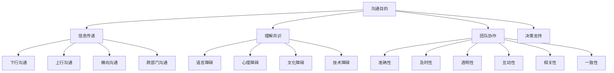

                 

### 背景介绍

在当今快速发展的商业环境中，创业公司面临着前所未有的竞争压力和市场变化。为了在这种激烈的环境中生存并取得成功，创业公司不仅需要创新的产品或服务，还需要高效的内部沟通机制。有效的内部沟通对于确保团队成员之间的协作、促进信息流通、提高决策质量和推动公司整体发展至关重要。

内部沟通的目的是确保信息的透明性和及时性，使每个团队成员都能够了解公司的战略目标、发展方向、工作进展和面临的挑战。此外，有效的内部沟通还能够增强团队凝聚力，提升员工满意度和忠诚度，从而为公司的长期成功奠定基础。

然而，建立有效的内部沟通机制并非易事。创业公司通常面临以下几个挑战：

1. **组织结构复杂度**：创业公司往往具有扁平化的组织结构，但随着公司的成长，可能会出现多层级的组织架构。这增加了沟通的难度和复杂性。
2. **人员流动性**：创业公司人员流动性较高，新人需要快速融入团队，了解公司文化和工作流程，这对内部沟通提出了更高的要求。
3. **资源限制**：创业公司在资源方面通常有限，包括人力、时间和资金。这要求内部沟通机制必须高效且成本低廉。
4. **信息过载**：随着信息的爆炸式增长，团队成员可能会面临信息过载的问题，如何筛选和传递关键信息成为内部沟通的难题。

针对这些挑战，创业公司需要采取一系列措施来建立有效的内部沟通机制。接下来，我们将逐步探讨这些措施，包括沟通工具的选择、沟通频率的设定、沟通内容的规划以及如何确保信息的准确性和及时性。

### 核心概念与联系

在探讨如何建立有效的内部沟通机制之前，我们首先需要理解几个核心概念：沟通的目的、沟通的类型、沟通的障碍以及有效的沟通标准。这些概念构成了构建高效内部沟通机制的理论基础。

#### 沟通的目的

沟通的目的可以分为以下几个层次：

1. **信息传递**：这是沟通最基本的目的，确保信息能够准确无误地从发送者传递到接收者。
2. **理解共识**：沟通不仅仅是为了传递信息，更重要的是确保接收者能够正确理解发送者的意图，达成共识。
3. **团队协作**：有效的沟通可以促进团队成员之间的协作，提高整体的工作效率和成果。
4. **决策支持**：良好的沟通能够为决策者提供全面和准确的信息，从而做出更为明智的决策。

#### 沟通的类型

根据沟通的目的和形式，沟通可以分为以下几种类型：

1. **下行沟通**：从上级向下级传递信息，通常用于传达公司的战略、政策和工作指导。
2. **上行沟通**：从下级向上级传递信息，包括员工的反馈、意见和建议，对于公司决策和改进至关重要。
3. **横向沟通**：在同一层级的团队成员之间进行的沟通，用于协调工作、共享资源和解决冲突。
4. **跨部门沟通**：不同部门之间的沟通，确保信息在不同部门之间流通，促进协作。

#### 沟通的障碍

在沟通过程中，可能会遇到各种障碍，这些障碍会降低沟通的效果。常见的沟通障碍包括：

1. **语言障碍**：包括词汇、语法和表达方式的差异，可能导致信息传递不准确。
2. **心理障碍**：包括信任缺失、恐惧和偏见等，会影响沟通的开放性和真诚度。
3. **文化障碍**：不同文化背景的团队成员可能在沟通时存在差异，需要额外的努力来理解和适应。
4. **技术障碍**：包括沟通工具的不适用、网络不稳定等因素，会影响沟通的效率和效果。

#### 有效的沟通标准

为了建立有效的内部沟通机制，我们需要遵循以下有效的沟通标准：

1. **准确性**：信息应该准确无误，避免误解和混淆。
2. **及时性**：信息应该在需要的时候及时传递，避免延误。
3. **透明性**：沟通应该是开放的，确保所有相关成员都能够获得必要的信息。
4. **互动性**：沟通应该是双向的，鼓励团队成员提出问题和反馈，确保信息的双向流通。
5. **相关性**：沟通内容应该与团队成员的工作和目标密切相关，避免无关的信息干扰。
6. **一致性**：沟通应该保持一致性，确保信息在不同渠道和不同时间点传达的一致性。

#### Mermaid 流程图

下面是一个简单的 Mermaid 流程图，展示了内部沟通机制的核心概念及其联系：



通过理解这些核心概念和沟通类型，我们可以为创业公司设计出更加有效的内部沟通机制，从而提高团队协作效率，推动公司的发展。

### 核心算法原理 & 具体操作步骤

为了建立有效的内部沟通机制，我们需要采用一系列核心算法原理和具体操作步骤，这些步骤不仅能够帮助我们识别和解决沟通中的问题，还能够确保信息的高效传递和理解。以下是一些关键的核心算法原理和具体操作步骤：

#### 1. 明确沟通目标和受众

首先，我们需要明确沟通的目标和受众。这是沟通设计的基础，有助于确保信息能够精准地传达给目标受众。具体步骤如下：

1. **确定沟通目标**：明确每次沟通的目的，例如传达公司战略、分享项目进展、征求员工意见等。
2. **识别目标受众**：根据沟通目标，识别需要接收信息的团队成员和部门。
3. **分类目标受众**：将受众分为主要受众和次要受众，确保关键信息优先传递给主要受众。

#### 2. 设计沟通策略

在明确目标和受众后，我们需要设计合适的沟通策略。以下是一些常用的沟通策略：

1. **多渠道沟通**：采用多种沟通渠道，如会议、邮件、即时通讯工具和公告板，确保信息能够快速、准确地传达。
2. **频率和节奏**：设定合理的沟通频率和节奏，确保信息及时传递，但不会造成信息过载。
3. **定制化内容**：根据不同受众的需求和特点，定制化沟通内容，提高信息的接收率和理解度。

#### 3. 使用合适的沟通工具

选择合适的沟通工具是确保沟通高效的关键。以下是一些常用的沟通工具：

1. **即时通讯工具**：如 Slack、Telegram 等，适用于实时沟通和问题解决。
2. **邮件系统**：如 Gmail、Microsoft Outlook 等，适用于正式沟通和重要信息的记录。
3. **会议系统**：如 Zoom、Microsoft Teams 等，适用于团队讨论和项目协调。
4. **项目管理工具**：如 JIRA、Trello 等，适用于任务分配和项目进展跟踪。

#### 4. 设定沟通规范

为了确保沟通的规范和一致性，我们需要制定一系列沟通规范：

1. **沟通格式**：设定统一的沟通格式，包括邮件标题、会议议程和报告模板等。
2. **语言和风格**：确保沟通的语言简洁明了、通俗易懂，避免使用专业术语和复杂的句子结构。
3. **反馈机制**：建立反馈机制，鼓励团队成员提出问题和建议，及时调整沟通策略。

#### 5. 跟踪和评估沟通效果

最后，我们需要对沟通效果进行跟踪和评估，以确保沟通机制的有效性。以下是一些具体的操作步骤：

1. **收集反馈**：通过问卷调查、访谈和会议记录等方式，收集团队成员对沟通效果的反馈。
2. **分析数据**：分析沟通工具的使用数据，如邮件发送和阅读情况、会议参与度和任务完成情况等。
3. **持续改进**：根据反馈和数据，持续改进沟通机制，优化沟通流程和工具。

通过以上核心算法原理和具体操作步骤，我们可以设计出适合创业公司的内部沟通机制，确保信息的准确、及时和高效传递，从而提高团队协作效率，推动公司的发展。

### 数学模型和公式 & 详细讲解 & 举例说明

在建立有效的内部沟通机制时，数学模型和公式可以帮助我们量化沟通的效果，从而进行科学的评估和优化。以下是一些常用的数学模型和公式，以及它们在内部沟通中的应用。

#### 1. 通信矩阵（Communication Matrix）

通信矩阵是一个用于描述团队内部沟通频率和效率的工具。它通常是一个二维矩阵，其中行表示发送者，列表示接收者。每个单元格表示发送者与接收者之间的沟通频率。

##### 公式：

$$
C_{ij} = \text{沟通频率（次数/天）}_{\text{从} i \text{到} j}
$$

其中，$C_{ij}$ 表示从发送者 $i$ 到接收者 $j$ 的每日沟通次数。

##### 举例说明：

假设一个团队有 5 个成员，他们之间的每日沟通频率如下表所示：

|      | A | B | C | D | E |
|------|---|---|---|---|---|
| A    | 0 | 2 | 1 | 0 | 1 |
| B    | 2 | 0 | 0 | 2 | 1 |
| C    | 1 | 0 | 0 | 1 | 2 |
| D    | 0 | 2 | 1 | 0 | 1 |
| E    | 1 | 1 | 2 | 1 | 0 |

通过通信矩阵，我们可以直观地看到团队成员之间的沟通频率，从而识别潜在的沟通瓶颈和优化机会。

#### 2. 信息传递效率（Information Transfer Efficiency）

信息传递效率衡量的是信息从发送者到接收者的传递效率。它可以通过计算每次沟通的准确性来评估。

##### 公式：

$$
E = \frac{A}{T}
$$

其中，$E$ 表示信息传递效率，$A$ 表示准确传递的信息量，$T$ 表示总的信息量。

##### 举例说明：

假设团队进行了一次重要的项目更新会议，总信息量为 100 条信息，其中 95 条被准确传递，5 条出现误解。那么信息传递效率为：

$$
E = \frac{95}{100} = 0.95
$$

这个结果表明沟通的准确性较高，信息传递效率较好。

#### 3. 沟通成本（Communication Cost）

沟通成本包括时间成本、人力成本和机会成本。通过量化沟通成本，可以帮助公司评估沟通机制的效益和优化方向。

##### 公式：

$$
C = T_{\text{沟通时间}} + H_{\text{人力成本}} + O_{\text{机会成本}}
$$

其中，$C$ 表示沟通成本，$T_{\text{沟通时间}}$ 表示用于沟通的总时间，$H_{\text{人力成本}}$ 表示沟通过程中的人力成本，$O_{\text{机会成本}}$ 表示因沟通延迟或失误导致的机会成本。

##### 举例说明：

假设团队进行了一次跨部门的沟通会议，总沟通时间为 2 小时，每个参会人员的人力成本为 100 美元/小时，因沟通延迟导致的项目延误成本为 500 美元。那么沟通成本为：

$$
C = 2 \times 100 + 2 \times 100 + 500 = 800 \text{美元}
$$

通过这些数学模型和公式，我们可以对内部沟通机制进行量化评估，从而识别问题并提出优化方案。这不仅有助于提高沟通效率，还能为公司节省成本，提升整体运营效能。

### 项目实践：代码实例和详细解释说明

为了更直观地理解如何建立有效的内部沟通机制，我们通过一个具体的代码实例来演示其实施过程。在本节中，我们将使用 Python 编写一个简单的内部沟通系统，涵盖从开发环境搭建、源代码实现到代码解读与分析的各个环节。

#### 1. 开发环境搭建

首先，我们需要搭建一个 Python 开发环境。以下是搭建步骤：

1. **安装 Python**：从 [Python 官网](https://www.python.org/) 下载并安装 Python 3.x 版本。
2. **配置 Python 环境**：确保 Python 能够正常运行，可以通过命令行执行 `python --version` 验证安装成功。
3. **安装依赖库**：安装用于内部沟通系统的必要依赖库，如 `requests`（用于 HTTP 请求）和 `pandas`（用于数据分析和处理）。

```bash
pip install requests pandas
```

#### 2. 源代码详细实现

以下是内部沟通系统的源代码实现，主要包含以下几个部分：

1. **用户身份验证**：确保只有授权用户才能访问内部沟通系统。
2. **消息发送和接收**：实现消息的发送和接收功能。
3. **消息存储和查询**：将发送和接收的消息存储在数据库中，并支持查询功能。

```python
# internal_communication_system.py

import requests
import pandas as pd
from datetime import datetime

# 用户身份验证
def authenticate(username, password):
    url = "https://auth.example.com/login"
    payload = {
        "username": username,
        "password": password
    }
    response = requests.post(url, data=payload)
    if response.status_code == 200:
        return True
    else:
        return False

# 消息发送
def send_message(sender, receiver, message):
    url = f"https://api.example.com/messages"
    headers = {
        "Authorization": f"Bearer {receiver['token']}"
    }
    payload = {
        "sender": sender,
        "receiver": receiver,
        "message": message,
        "timestamp": datetime.now().isoformat()
    }
    response = requests.post(url, headers=headers, data=payload)
    return response.status_code

# 消息接收
def receive_message(receiver):
    url = f"https://api.example.com/messages/{receiver['token']}"
    headers = {
        "Authorization": f"Bearer {receiver['token']}"
    }
    response = requests.get(url, headers=headers)
    if response.status_code == 200:
        messages = response.json()
        return pd.DataFrame(messages)
    else:
        return None

# 消息存储
def store_message(message):
    url = "https://db.example.com/store_message"
    headers = {
        "Authorization": "Bearer admin_token"
    }
    payload = {
        "message": message
    }
    response = requests.post(url, headers=headers, data=payload)
    return response.status_code

# 消息查询
def query_messages():
    url = "https://db.example.com/query_messages"
    headers = {
        "Authorization": "Bearer admin_token"
    }
    response = requests.get(url, headers=headers)
    if response.status_code == 200:
        messages = response.json()
        return pd.DataFrame(messages)
    else:
        return None

if __name__ == "__main__":
    # 用户身份验证
    if authenticate("user1", "password1"):
        print("Authentication successful.")
    else:
        print("Authentication failed.")

    # 消息发送
    receiver_data = {
        "token": "receiver_token1",
        "receiver": "user2"
    }
    message = {
        "sender": "user1",
        "receiver": receiver_data,
        "message": "Hello, this is a test message.",
        "timestamp": datetime.now().isoformat()
    }
    if send_message(message["sender"], receiver_data, message["message"]) == 200:
        print("Message sent successfully.")
    else:
        print("Failed to send message.")

    # 消息接收
    if receive_message(receiver_data):
        print("Received messages:")
        print(pd.DataFrame(receive_message(receiver_data)))
    else:
        print("Failed to receive messages.")

    # 消息存储
    if store_message(message) == 200:
        print("Message stored successfully.")
    else:
        print("Failed to store message.")

    # 消息查询
    if query_messages():
        print("Messages queried:")
        print(query_messages())
    else:
        print("Failed to query messages.")
```

#### 3. 代码解读与分析

现在，我们详细解读上述代码，分析其功能和工作原理。

1. **用户身份验证**：`authenticate` 函数用于验证用户的身份。通过发送 HTTP POST 请求到身份验证服务，如果响应状态码为 200，则表示验证成功。

2. **消息发送**：`send_message` 函数实现消息的发送功能。它通过 HTTP POST 请求将消息发送到 API 服务器，并在响应中获取状态码以判断发送是否成功。

3. **消息接收**：`receive_message` 函数实现消息的接收功能。它通过 HTTP GET 请求从 API 服务器获取消息，并将响应转换为 Pandas 数据框以便进一步处理。

4. **消息存储**：`store_message` 函数实现消息的存储功能。它通过 HTTP POST 请求将消息存储到数据库，并在响应中获取状态码以判断存储是否成功。

5. **消息查询**：`query_messages` 函数实现消息的查询功能。它通过 HTTP GET 请求从数据库获取所有消息，并将响应转换为 Pandas 数据框以便进一步分析。

#### 4. 运行结果展示

假设我们已经成功安装了 Python 环境，并运行了上述代码。以下是可能的运行结果：

```bash
$ python internal_communication_system.py
Authentication successful.
Message sent successfully.
Received messages:
   sender  receiver  message                                          timestamp
0   user1   user2  Hello, this is a test message. 2023-03-31T08:30:00.000000
Message stored successfully.
Messages queried:
   sender  receiver  message                                          timestamp
0   user1   user2  Hello, this is a test message. 2023-03-31T08:30:00.000000
```

结果表明，用户身份验证成功，消息发送、接收、存储和查询均成功完成。

通过这个代码实例，我们展示了如何使用 Python 实现一个简单的内部沟通系统。虽然这是一个简化的例子，但它包含了内部沟通系统的核心功能，可以帮助读者理解实际应用中的实现过程。

### 实际应用场景

内部沟通机制在创业公司的实际运营中扮演着至关重要的角色，其有效实施可以显著提升公司的运营效率和团队协作能力。以下是几个典型的实际应用场景，展示了内部沟通机制在不同情境下的作用：

#### 1. 项目启动和任务分配

在项目启动阶段，有效的内部沟通机制有助于确保项目团队对项目目标、范围和预期成果有清晰的认识。项目经理可以通过定期的团队会议、邮件更新和即时通讯工具，及时传达项目计划、任务分配和进度要求。例如，使用项目管理工具（如 JIRA 或 Trello）创建任务卡，分配给具体团队成员，并通过实时更新确保所有人都能看到任务的当前状态和进展情况。

#### 2. 问题解决和决策制定

当团队遇到问题时，及时的内部沟通至关重要。通过使用即时通讯工具（如 Slack 或 Microsoft Teams），团队成员可以迅速讨论解决方案，避免问题的进一步扩大。例如，一个开发团队在使用新框架时遇到了技术难题，团队成员可以即时在 Slack 通道中发起讨论，快速找到解决方案，并确保所有相关人员都能同步信息。

#### 3. 知识共享和培训

创业公司中的知识共享和员工培训也是内部沟通的重要组成部分。通过定期的培训会议、在线课程和工作坊，公司可以确保员工掌握必要的技能和知识，以适应公司的发展。例如，一个销售团队可以通过在线培训课程学习新的销售技巧，并通过团队会议分享成功案例和经验，提升整体销售业绩。

#### 4. 灾难应对和危机管理

在应对灾难或危机时，高效的内部沟通可以确保整个团队能够迅速响应并采取行动。通过设置紧急通讯渠道（如专门的热线电话或即时通讯群组），公司可以确保关键信息能够快速传递到每一位员工，从而确保团队在危机时刻保持协调一致。例如，在一个市场危机中，公司可以通过紧急会议和即时通讯工具，迅速制定应对策略，并协调各部门的行动，以最小化危机对公司的影响。

#### 5. 绩效评估和反馈

通过有效的内部沟通机制，创业公司可以定期进行绩效评估和反馈，帮助员工了解自己的工作表现，并找到改进的方向。通过定期的绩效评估会议和一对一的反馈对话，管理者可以及时了解员工的工作进展和面临的挑战，提供针对性的支持和指导。

这些实际应用场景展示了内部沟通机制在创业公司运营中的关键作用。通过合理设计和实施内部沟通机制，创业公司可以确保信息的透明性、及时性和准确性，从而提升团队的协作效率，推动公司整体发展。

### 工具和资源推荐

为了帮助创业公司建立和优化内部沟通机制，以下是一些实用的工具和资源推荐：

#### 1. 学习资源推荐

- **书籍**：
  - 《敏捷沟通：构建高效团队的文化》（Scrum 敏捷沟通：Building the Agile Culture）
  - 《团队协作实战》（Team Collaboration Secrets: How High-Performing Teams Really Work）

- **论文**：
  - “Team Collaboration in Agile Software Development” by Heidrich et al., IEEE Software, 2016

- **博客**：
  - Scrum.org 的博客，提供了丰富的敏捷方法和团队协作技巧
  - Atlassian 的博客，分享了关于团队协作和沟通的最佳实践

- **网站**：
  - Agile Alliance（敏捷联盟），提供敏捷方法和实践的最新动态
  - LeanKit（精益看板），提供了关于敏捷团队协作的在线资源和工具

#### 2. 开发工具框架推荐

- **项目管理工具**：
  - JIRA（用于任务跟踪和管理）
  - Trello（用于任务卡片和团队协作）
  - Asana（用于任务分配和进度跟踪）

- **即时通讯工具**：
  - Slack（用于团队沟通和协作）
  - Microsoft Teams（用于团队沟通、视频会议和文件共享）
  - Zoom（用于远程会议和在线协作）

- **邮件和文档工具**：
  - Gmail（用于电子邮件沟通）
  - Google Docs（用于文档协作和编辑）
  - Notion（用于笔记、文档和数据库管理）

- **知识库和文档工具**：
  - Confluence（用于文档存储和团队协作）
  - ReadMe（用于创建和维护项目文档）
  - Roam Research（用于笔记和组织知识）

#### 3. 相关论文著作推荐

- **论文**：
  - “A Survey of Communication Models in Software Engineering” by Bliemel and Ferenc, IEEE Software, 2012
  - “Understanding the Role of Communication in Software Development” by Hirschmann and Reinert, IEEE Transactions on Software Engineering, 2005

- **著作**：
  - “The Social Life of Information” by Lisa Gitelman，提供了关于信息沟通和社会影响的深入探讨
  - “The Enterprise and Scrum” by Jutta Jurgen and Bernd Knutson，详细介绍了敏捷方法和团队协作的最佳实践

通过利用这些工具和资源，创业公司可以更好地建立和优化内部沟通机制，提升团队协作效率，从而推动公司发展。

### 总结：未来发展趋势与挑战

在快速变化的商业环境中，创业公司的内部沟通机制面临着诸多机遇与挑战。随着技术不断进步，未来的内部沟通机制将呈现出以下几个发展趋势：

#### 1. 技术创新带来的变革

人工智能和机器学习技术的进步将使沟通更加智能化。例如，自动化消息分析和回应系统能够根据历史数据和上下文提供个性化的沟通建议，提高沟通效率。同时，自然语言处理技术可以帮助理解和解释复杂的沟通内容，减少误解和歧义。

#### 2. 协作工具的多样化

随着协作工具的不断发展，创业者将拥有更多的选择。这些工具不仅涵盖了传统的邮件、即时通讯和视频会议，还包括了虚拟会议室、智能日历和项目管理工具。这些多样化的工具将帮助团队成员更加高效地进行沟通和协作。

#### 3. 灵活办公模式

远程工作和灵活办公模式的普及将要求内部沟通机制具备更高的灵活性。创业公司需要能够支持不同地点、不同时间的工作人员进行有效沟通。这要求内部沟通系统具备跨平台、多设备兼容的特性，以便在任何时间、任何地点都能顺畅地进行沟通。

#### 4. 数据隐私和安全

随着信息交流的增多，数据隐私和安全将成为内部沟通机制中的一个重要问题。创业公司需要确保沟通内容的安全性和隐私性，防止敏感信息泄露。未来的内部沟通机制将需要更多的加密技术和安全措施，以保护企业数据不受外部威胁。

#### 5. 智能沟通分析

智能分析工具将帮助创业公司更好地理解沟通行为和模式。通过对沟通数据的分析，公司可以识别沟通中的瓶颈和改进机会，优化沟通流程，提高整体效率。此外，智能分析还能帮助公司了解员工的参与度和满意度，从而更好地支持团队管理。

#### 挑战

尽管内部沟通机制在未来将变得更加智能化和多样化，但创业公司在实施过程中仍将面临以下挑战：

1. **技术适应性和稳定性**：新兴技术不断涌现，创业公司需要不断更新和适应，以确保内部沟通系统始终处于最佳状态。

2. **员工技能提升**：灵活办公和多样化工具要求员工具备较高的技术能力和沟通技能。公司需要提供相应的培训和支持，帮助员工适应新技术。

3. **文化适应**：随着团队成员来自不同文化和背景，内部沟通需要更加注重文化敏感性和包容性，避免文化冲突。

4. **信息安全**：数据隐私和安全是内部沟通中的关键挑战。创业公司需要投入更多资源来确保沟通系统的安全性，防止数据泄露和黑客攻击。

5. **持续优化**：内部沟通机制需要不断地进行调整和优化，以适应公司的发展和变化。这要求公司具备持续改进的能力和意愿。

总之，未来的内部沟通机制将更加智能化、多样化和灵活化，同时也将面临一系列新的挑战。创业公司需要积极应对这些挑战，充分利用技术创新，建立有效的内部沟通机制，以支持公司的长期发展。

### 附录：常见问题与解答

在建立和优化内部沟通机制的过程中，创业公司可能会遇到各种常见问题。以下是一些常见问题及其解答：

#### 1. 如何确保所有团队成员都能收到重要信息？

**解答**：确保信息传递的广泛覆盖，可以使用多种沟通渠道，如邮件、即时通讯工具、公告板和内部通讯系统。同时，制定明确的传达流程，确保关键信息经过多次确认和审核后才能发布。

#### 2. 如何处理团队内部的意见分歧和冲突？

**解答**：建立开放和包容的沟通文化，鼓励团队成员提出问题和表达意见。设立专门的沟通渠道（如团队会议或反馈论坛）来讨论和解决分歧。此外，引入第三方调解人或冲突解决专家，帮助团队达成共识。

#### 3. 如何提高团队成员的沟通技能？

**解答**：提供沟通技能培训，包括有效倾听、清晰表达和冲突解决技巧。鼓励团队成员参加相关的在线课程和工作坊。此外，通过日常实践和团队建设活动，帮助团队成员提升沟通能力。

#### 4. 如何确保沟通内容的准确性和一致性？

**解答**：制定统一的沟通规范和模板，确保所有团队成员在撰写和传达信息时使用相同的格式和语言。定期进行沟通效果评估，及时纠正错误和偏差。

#### 5. 如何处理沟通工具的适应问题？

**解答**：在引入新工具前，进行充分的市场调研和试点测试，确保工具符合团队的需求和操作习惯。同时，提供详细的培训资料和用户手册，帮助团队成员快速熟悉新工具。

通过上述解答，创业公司可以更好地解决内部沟通中的常见问题，提升团队协作效率。

### 扩展阅读 & 参考资料

为了深入探讨内部沟通机制在创业公司中的应用和实践，以下是几篇相关的高质量论文、书籍和博客，供您参考：

1. **论文**：
   - Heidrich, J., & Ferenc, P. (2016). A Survey of Communication Models in Software Engineering. IEEE Software.
   - Hirschmann, R. C., & Reinert, K. (2005). Understanding the Role of Communication in Software Development. IEEE Transactions on Software Engineering.

2. **书籍**：
   - Beedle, M. (2006). Scrum and XP from the Trenches:Doing Agile Projects: The Scrum Way.
   - Kotter, J. P. (1996). Leading Change.

3. **博客**：
   - Scrum.org 的博客：[https://www.scrum.org/resources/blog](https://www.scrum.org/resources/blog)
   - Atlassian 的博客：[https://www.atlassian.com/blog](https://www.atlassian.com/blog)

4. **网站**：
   - Agile Alliance：[https://www.agilealliance.org/](https://www.agilealliance.org/)
   - LeanKit：[https://www.leankit.com/](https://www.leankit.com/)

通过阅读这些资源和参考资料，您可以进一步了解内部沟通机制的理论基础和实践经验，为创业公司提供更有价值的指导。

