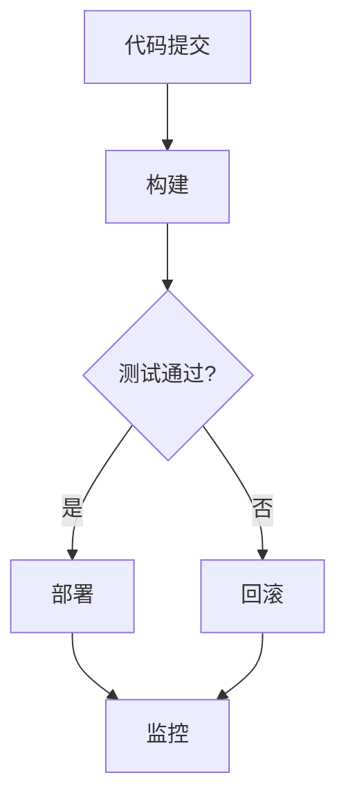

                 

### 背景介绍

DevOps作为一种新兴的软件开发和运维模式，近年来在全球范围内迅速兴起。它提倡开发（Development）与运营（Operations）团队的紧密合作，通过自动化、持续集成和持续交付，实现更快的迭代速度、更高的软件质量和更低的成本。对于创业公司而言，DevOps不仅能够提高生产效率，还能在激烈的市场竞争中占据优势地位。

创业公司在初创阶段面临诸多挑战，如资源有限、时间紧迫、市场需求变化快速等。传统的软件开发和运维模式往往导致流程冗长、沟通不畅、问题频发。因此，引入DevOps理念和方法，对于创业公司来说，具有重要的现实意义。

首先，DevOps能够提高开发与运维团队之间的协作效率。通过自动化工具和流程，开发人员可以更快地交付软件，运维团队能够更高效地部署和监控应用。其次，DevOps能够提升软件质量。通过持续集成和持续交付，早期的缺陷能够及时被发现和修复，从而降低上线后的故障率。此外，DevOps还能够降低成本。自动化流程减少了人为错误和重复工作，从而降低了运维成本。

总的来说，DevOps为创业公司提供了一种灵活、高效的软件开发和运维模式，有助于他们在资源有限、时间紧迫的情况下，快速响应市场需求，提高产品竞争力。### 2. 核心概念与联系

DevOps的核心概念包括持续集成（Continuous Integration，CI）、持续交付（Continuous Delivery，CD）和基础设施即代码（Infrastructure as Code，IaC）。这些概念之间相互联系，共同构成了DevOps的框架。

#### 2.1 持续集成（Continuous Integration，CI）

持续集成是一种软件开发实践，旨在通过频繁地将代码集成到共享主干，快速发现并解决冲突。在CI过程中，开发人员频繁提交代码，每次提交都会触发自动化构建和测试，确保代码库始终保持一致和可运行状态。

#### 2.2 持续交付（Continuous Delivery，CD）

持续交付是一种确保软件始终处于可发布状态的开发实践。在CD过程中，一旦代码通过所有测试，就可以自动部署到生产环境。这样，开发团队可以随时将新功能发布到生产环境，而不需要等待运维团队的介入。

#### 2.3 基础设施即代码（Infrastructure as Code，IaC）

基础设施即代码是一种将基础设施管理作为代码管理的实践。通过编写代码来定义、部署和管理基础设施，IaC能够实现自动化部署、配置管理和版本控制。常见的IaC工具包括Terraform、Ansible和Chef等。

#### 2.4 DevOps架构

DevOps架构通常包括以下关键组成部分：

1. **代码库**：用于存储和管理源代码的版本控制系统。
2. **自动化构建和测试**：用于编译、打包和测试代码的自动化工具，如Jenkins、GitLab CI等。
3. **持续集成服务器**：用于运行构建和测试过程的独立服务器。
4. **自动化部署和发布**：用于将代码部署到生产环境的自动化工具，如Kubernetes、Ansible等。
5. **监控和告警**：用于监控应用性能和健康状况的工具，如Prometheus、Grafana等。
6. **日志管理**：用于收集、存储和分析日志数据的工具，如ELK Stack（Elasticsearch、Logstash、Kibana）。

#### 2.5 Mermaid 流程图

以下是一个简化的DevOps流程图，使用Mermaid语法绘制：



在这个流程中，代码提交到代码库后，自动化构建和测试会立即开始。如果测试通过，代码会被自动部署到生产环境并进入监控阶段。如果测试失败，则会回滚到上一个稳定版本，然后重新进行构建和测试。

通过这种自动化和持续的过程，DevOps能够显著提高开发与运维团队的协作效率，降低故障率和部署时间，从而加速产品迭代，提升市场竞争力。### 3. 核心算法原理 & 具体操作步骤

DevOps的核心算法原理主要围绕持续集成、持续交付和基础设施即代码这三个方面展开。以下是这三个方面的一些关键步骤和算法原理。

#### 3.1 持续集成（Continuous Integration，CI）

持续集成的核心在于通过频繁的代码提交和自动化构建、测试，确保代码库始终处于可运行状态。以下是CI的一些具体操作步骤：

1. **代码提交**：开发人员将代码提交到代码库。
2. **触发构建**：每次提交都会触发自动化构建过程，编译代码并生成可执行文件。
3. **测试**：构建完成后，自动运行一系列测试，包括单元测试、集成测试等。
4. **报告**：将测试结果报告给开发人员，包括成功和失败的测试案例。
5. **反馈**：如果测试失败，开发人员需要修复代码并重新提交。

持续集成的算法原理主要是基于版本控制和自动化测试。常用的CI工具如Jenkins、GitLab CI等，通过配置文件定义构建和测试流程，实现自动化操作。

#### 3.2 持续交付（Continuous Delivery，CD）

持续交付的目标是确保软件始终处于可发布状态，并通过自动化部署和发布，实现快速、可靠的软件迭代。以下是CD的一些具体操作步骤：

1. **构建**：通过CI工具完成代码构建，生成可执行文件。
2. **测试**：对构建后的软件进行一系列测试，包括功能测试、性能测试等。
3. **部署**：测试通过后，自动将软件部署到测试环境或生产环境。
4. **监控**：部署完成后，监控软件性能和健康状况，确保其正常运行。
5. **反馈**：根据监控结果，对软件进行优化和更新。

持续交付的算法原理主要基于持续集成和自动化部署。常用的CD工具如Kubernetes、Ansible等，通过配置文件定义部署和监控策略，实现自动化操作。

#### 3.3 基础设施即代码（Infrastructure as Code，IaC）

基础设施即代码的核心是将基础设施管理作为代码管理的一部分，通过编写代码来定义、部署和管理基础设施。以下是IaC的一些具体操作步骤：

1. **编写代码**：使用IaC工具编写基础设施配置代码，如Terraform的HCL（HashiCorp Configuration Language）。
2. **初始化**：运行IaC工具的初始化命令，准备部署环境。
3. **部署**：运行IaC工具的部署命令，自动创建和管理基础设施。
4. **版本控制**：将基础设施配置代码纳入版本控制系统，实现版本控制和回滚。
5. **自动化运维**：使用脚本和工具对基础设施进行自动化运维，如自动化升级、扩展等。

IaC的算法原理主要基于脚本和自动化工具。常用的IaC工具如Terraform、Ansible等，通过脚本语言和自动化命令，实现基础设施的自动化管理和运维。

总的来说，DevOps的核心算法原理在于通过自动化和持续的过程，实现快速、可靠、高效的软件开发和运维。这些算法原理不仅能够提高团队协作效率，降低故障率和部署时间，还能提升产品竞争力。### 4. 数学模型和公式 & 详细讲解 & 举例说明

在DevOps实践中，虽然许多过程依赖于自动化和工具，但数学模型和公式在其中仍扮演着重要角色。以下将介绍几个关键数学模型和公式，并详细讲解其在DevOps中的应用。

#### 4.1 概率模型

在持续集成（CI）和持续交付（CD）过程中，概率模型被广泛应用于评估代码质量和预测系统可靠性。一个常见的概率模型是二项分布（Binomial Distribution），用于描述成功和失败的概率。

**二项分布公式**：

\[ P(X = k) = C(n, k) \cdot p^k \cdot (1 - p)^{n - k} \]

其中：
- \( P(X = k) \) 是恰好发生 \( k \) 次成功的概率。
- \( C(n, k) \) 是组合数，表示从 \( n \) 个元素中选取 \( k \) 个元素的组合数。
- \( p \) 是每次实验成功的概率。
- \( n \) 是实验的总次数。

**应用举例**：

假设一个应用程序需要通过100个单元测试，其中每个测试成功的概率是0.9（90%）。我们想要计算在所有测试中，至少有90个测试成功的概率。

使用二项分布公式计算：

\[ P(X \geq 90) = C(100, 90) \cdot 0.9^{90} \cdot 0.1^{10} + C(100, 91) \cdot 0.9^{91} \cdot 0.1^{9} + \ldots + C(100, 100) \cdot 0.9^{100} \cdot 0.1^{0} \]

虽然手动计算这个概率可能很复杂，但我们可以使用数学软件或编程语言（如Python）来计算。

**Python代码示例**：

```python
import scipy.stats as stats

n = 100
p = 0.9

# 计算至少有90个测试成功的概率
prob_success = stats.binom.pmf(k=90, n=n, p=p)

print(f"概率至少有90个测试成功：{prob_success}")
```

运行上述代码，可以得到至少有90个测试成功的概率。

#### 4.2 决策理论

在DevOps实践中，决策理论也发挥着重要作用。特别是当面临是否继续开发新功能、是否上线新版本等决策时，决策理论可以帮助我们做出更明智的选择。

**决策树（Decision Tree）**是一种常见的决策模型，用于描述不同决策路径下的结果和概率。

**决策树公式**：

\[ \text{效用值} = \sum_{i=1}^{n} p_i \cdot u_i \]

其中：
- \( p_i \) 是选择第 \( i \) 个决策路径的概率。
- \( u_i \) 是选择第 \( i \) 个决策路径后的效用值。

**应用举例**：

假设一个团队需要决定是否上线一个新功能。他们预测有60%的概率成功，成功后公司价值增加100万元；有40%的概率失败，失败后公司价值减少50万元。

**计算过程**：

1. 成功的概率 \( p_1 = 0.6 \)，成功后的效用值 \( u_1 = 100 \) 万元。
2. 失败的概率 \( p_2 = 0.4 \)，失败后的效用值 \( u_2 = -50 \) 万元。

\[ \text{总效用值} = p_1 \cdot u_1 + p_2 \cdot u_2 = 0.6 \cdot 100 + 0.4 \cdot (-50) = 30 + (-20) = 10 \] 万元。

根据计算结果，团队可以做出是否上线新功能的决策。

**Python代码示例**：

```python
import numpy as np

p1, u1 = 0.6, 100
p2, u2 = 0.4, -50

expected_utility = p1 * u1 + p2 * u2

print(f"总效用值：{expected_utility} 万元")
```

运行上述代码，可以得到总效用值。

通过这些数学模型和公式，我们可以更准确地评估代码质量、系统可靠性和决策结果，从而在DevOps实践中做出更明智的决策。这些模型和公式不仅帮助我们理解DevOps的核心概念，也为实际操作提供了有力的支持。### 5. 项目实践：代码实例和详细解释说明

在本节中，我们将通过一个具体的代码实例来展示DevOps在实际项目中的应用，并详细解释其中的每个步骤。我们将使用Python语言和GitLab CI/CD工具来构建、测试和部署一个简单的Web应用程序。

#### 5.1 开发环境搭建

首先，我们需要搭建一个开发环境。以下是搭建步骤：

1. **安装Python**：在本地机器上安装Python，确保版本不低于3.8。
2. **安装虚拟环境**：安装`virtualenv`工具，用于创建隔离的Python环境。
3. **创建虚拟环境**：使用`virtualenv`创建一个新的虚拟环境。
4. **安装依赖**：在虚拟环境中安装项目所需的依赖。

#### 5.2 源代码详细实现

以下是一个简单的Web应用程序的源代码示例，使用Flask框架实现：

```python
# app.py
from flask import Flask

app = Flask(__name__)

@app.route('/')
def hello():
    return 'Hello, World!'

if __name__ == '__main__':
    app.run()
```

此外，我们还需要一个`requirements.txt`文件，列出项目依赖：

```
Flask==2.0.1
```

#### 5.3 代码解读与分析

在这个简单的Web应用程序中，我们使用Flask框架创建了一个名为`hello`的路由，当访问根路径时，会返回字符串"Hello, World!"。

#### 5.4 运行结果展示

接下来，我们将使用GitLab CI/CD工具来构建、测试和部署这个应用程序。以下是`.gitlab-ci.yml`文件的示例：

```yaml
image: python:3.8

services:
  - postgres:13

stages:
  - build
  - test
  - deploy

build:
  stage: build
  script:
    - virtualenv venv
    - . venv/bin/activate
    - pip install -r requirements.txt

test:
  stage: test
  script:
    - virtualenv venv
    - . venv/bin/activate
    - pip install -r requirements.txt
    - pytest

deploy:
  stage: deploy
  script:
    - virtualenv venv
    - . venv/bin/activate
    - pip install -r requirements.txt
    - flask db init
    - flask db migrate
    - flask db upgrade
    - gunicorn app:app --bind 0.0.0.0:5000
```

**解释**：

1. **构建（build）**：构建阶段安装Python环境和项目依赖。
2. **测试（test）**：测试阶段运行单元测试，确保代码质量。
3. **部署（deploy）**：部署阶段初始化数据库，升级数据库，并启动Gunicorn服务器。

#### 5.5 GitLab CI/CD详解

1. **构建（build）**：在构建阶段，GitLab CI首先下载指定镜像（Python 3.8），然后在容器中执行`virtualenv venv`和`pip install -r requirements.txt`命令，安装Python环境和项目依赖。

2. **测试（test）**：在测试阶段，GitLab CI继续使用之前创建的虚拟环境，安装依赖并运行`pytest`命令，执行单元测试。

3. **部署（deploy）**：在部署阶段，GitLab CI执行一系列数据库初始化和迁移命令，最后使用Gunicorn启动Web应用程序。这里使用`gunicorn app:app --bind 0.0.0.0:5000`命令，启动Gunicorn服务器，将应用程序部署到生产环境。

通过这个代码实例，我们可以看到DevOps在项目开发、测试和部署中的应用。使用GitLab CI/CD工具，我们能够自动化这些过程，提高开发效率，确保代码质量和系统稳定性。### 6. 实际应用场景

DevOps的理念和技术在多个实际应用场景中得到了广泛应用，下面我们列举一些典型的应用场景，并详细分析它们如何提高开发与运维效率。

#### 6.1 云服务提供商

云服务提供商（如Amazon Web Services, AWS、Microsoft Azure、Google Cloud Platform）是DevOps技术的重灾区。这些公司通过DevOps实践，实现了大规模的自动化部署、扩展和管理云资源。

**应用分析**：
- **自动化部署**：云服务提供商利用IaC工具（如AWS CloudFormation、Azure Resource Manager）来定义和管理云资源。通过编写代码来创建和配置虚拟机、数据库、网络等资源，大大提高了部署效率。
- **弹性扩展**：利用容器化技术和Kubernetes等编排工具，云服务提供商能够根据需求自动扩展或缩减资源。这种弹性扩展能力不仅降低了成本，还提高了系统的可靠性和可用性。

#### 6.2 金融科技（Fintech）

金融科技公司通过DevOps实践，提高了软件开发的迭代速度，确保了金融服务的稳定性和安全性。

**应用分析**：
- **持续集成与交付**：金融科技公司采用CI/CD工具（如Jenkins、GitLab CI）来自动化构建、测试和部署。通过持续集成的反馈机制，确保每次代码提交都能及时进行测试和部署，降低上线风险。
- **安全合规性**：金融科技行业对安全合规性要求极高。DevOps通过自动化测试和安全扫描工具，确保代码和部署过程符合相关法规和标准，提高了安全性。

#### 6.3 媒体和娱乐行业

媒体和娱乐行业通过DevOps实践，加快了内容创作和发布流程，提高了用户体验。

**应用分析**：
- **快速迭代**：DevOps帮助媒体和娱乐公司实现快速迭代，通过自动化构建和部署，内容创作者能够更快地测试和发布新功能，满足用户需求。
- **弹性资源管理**：使用容器化和Kubernetes等工具，公司可以根据流量变化自动扩展或缩减服务器资源，降低成本，提高资源利用率。

#### 6.4 制造业和物联网（IoT）

制造业和IoT领域通过DevOps实践，实现了设备管理和软件更新的自动化，提高了生产效率和设备可靠性。

**应用分析**：
- **设备管理**：利用IaC工具，制造商可以自动化配置和管理设备。通过编写代码来定义设备的硬件和软件配置，确保设备的统一性和可靠性。
- **软件更新**：在IoT应用中，设备需要定期更新软件以修复漏洞或添加新功能。DevOps通过自动化脚本和工具，实现了远程设备的批量软件更新，提高了维护效率。

通过以上实际应用场景的分析，我们可以看到DevOps在各个行业中的应用都带来了显著的效益。无论是在提高开发效率、确保系统稳定性，还是降低运营成本方面，DevOps都发挥了重要作用。### 7. 工具和资源推荐

为了更好地实践DevOps，以下是一些建议的工具和资源，这些工具和资源涵盖了DevOps的各个环节，从持续集成到监控，再到自动化部署。

#### 7.1 学习资源推荐

**书籍**：
1. 《DevOps实践指南》（The DevOps Handbook） - 由Jez Humble和David Farley合著，全面介绍了DevOps的理念和实践方法。
2. 《持续交付：发布可靠软件的系统化方法》（Continuous Delivery: Reliable Software Releases through Build, Test, and Deployment Automation） - 由Jez Humble和David Farley合著，详细介绍了持续交付的原理和实践。

**在线课程**：
1. Coursera上的《DevOps：基础设施即代码》 - 该课程介绍了基础设施即代码的概念和实践。
2. Pluralsight上的《DevOps基础》 - 提供了DevOps基础知识和实践技巧。

**博客和网站**：
1. DevOps.com - 提供最新的DevOps新闻、博客文章和资源。
2. Atlassian Blog - Atlassian公司（如JIRA、Bitbucket等）的博客，提供了丰富的DevOps实践分享。

#### 7.2 开发工具框架推荐

**持续集成工具**：
1. Jenkins - 一款开源的持续集成服务器，支持多种插件和构建工具。
2. GitLab CI/CD - GitLab内置的持续集成和持续交付工具，易于配置和集成。

**持续交付工具**：
1. Kubernetes - 用于容器编排和自动化部署的流行工具。
2. AWS CodePipeline - AWS提供的持续交付服务，支持自动化部署和版本控制。

**基础设施即代码工具**：
1. Terraform - 用于创建和管理云基础设施的开源工具。
2. Ansible - 一款强大的自动化工具，用于配置管理、应用部署和孤儿进程树（OTP）服务管理。

**监控和日志管理**：
1. Prometheus - 开源的监控解决方案，用于收集和存储时间序列数据。
2. Grafana - 用于可视化监控数据的开源工具，与Prometheus紧密集成。

**自动化测试工具**：
1. Pytest - 用于Python测试的开源框架，支持单元测试、集成测试和功能测试。
2. Selenium - 用于Web应用程序测试的开源工具，支持多种编程语言。

通过这些工具和资源的帮助，开发者和运维团队能够更好地实践DevOps，提高软件交付的效率和质量。### 8. 总结：未来发展趋势与挑战

随着技术的不断进步，DevOps在未来将继续发展，并在多个方面产生深远影响。以下是几个未来发展趋势与挑战：

#### 8.1 自动化与智能化

自动化是DevOps的核心原则之一，未来自动化将进一步深化，涵盖更多的流程和操作。随着人工智能（AI）和机器学习（ML）技术的发展，自动化工具将具备更多的智能，能够根据历史数据和预测模型，自动调整和优化流程。这有助于降低人为错误，提高系统稳定性和响应速度。

**挑战**：尽管自动化能够显著提高效率，但过度依赖自动化也可能会导致对工具和技术的过度依赖。当自动化系统出现故障时，可能会导致整个流程的中断。因此，如何在保持自动化优势的同时，确保系统的冗余和弹性，是一个重要挑战。

#### 8.2 容器化和微服务架构

容器化技术和微服务架构已经在DevOps中得到广泛应用，未来它们将继续扩展。容器化提供了更轻量级、可移植的部署方式，而微服务架构则支持更灵活、可扩展的系统设计。这两种技术将共同推动DevOps的发展，使软件交付更加敏捷和高效。

**挑战**：容器化和微服务架构虽然带来了许多好处，但也引入了新的复杂性。分布式系统的管理和监控变得更为复杂，需要更多的工具和策略来确保系统的可靠性和性能。此外，如何平衡微服务架构中的独立性和整体性，也是一个挑战。

#### 8.3 安全性

随着DevOps的普及，安全性问题变得越来越重要。自动化和快速的迭代速度可能会带来安全漏洞的风险。如何确保自动化流程和持续集成、持续交付过程中不引入安全漏洞，是一个亟待解决的问题。

**挑战**：一方面，需要开发更先进的自动化安全测试工具，以便在早期发现和修复安全漏洞。另一方面，需要培养开发者和运维团队的安全意识，确保他们在开发过程中考虑到安全性。

#### 8.4 跨团队合作

DevOps的成功依赖于跨团队的紧密合作。在大型组织中，不同团队之间的沟通和协作可能会受到组织结构和流程的限制。如何打破这些障碍，实现真正的跨团队合作，是DevOps未来发展的关键。

**挑战**：一方面，需要建立更灵活的组织结构，减少官僚主义和沟通障碍。另一方面，需要培养团队成员的协作能力和沟通技巧，确保他们能够在不同的工作方式和节奏中保持高效协作。

总的来说，DevOps的未来充满机遇和挑战。通过不断优化自动化、智能化、容器化和微服务架构，加强安全性，以及推动跨团队合作，DevOps将助力企业实现更高效、更可靠的软件交付。### 9. 附录：常见问题与解答

在实践DevOps的过程中，可能会遇到各种问题和挑战。以下是一些常见问题及其解答：

#### 9.1 如何处理自动化测试失败？

**解答**：当自动化测试失败时，首先需要分析失败的原因。通常可以通过以下步骤解决问题：

1. **查看错误日志**：详细查看测试失败时的错误日志，了解具体错误信息。
2. **重现问题**：在本地环境中尝试重现问题，以确定是代码问题还是环境问题。
3. **修复代码**：根据错误日志和重现结果，修复代码中的问题。
4. **重新执行测试**：修复代码后，重新运行测试，确保问题已解决。

此外，可以设置自动化测试的告警机制，及时通知开发者和运维团队测试失败，以便快速响应和解决问题。

#### 9.2 如何确保自动化部署的安全？

**解答**：确保自动化部署的安全是DevOps实践中一个重要方面。以下是一些关键措施：

1. **加密传输**：使用HTTPS等加密协议，确保部署过程中的数据传输安全。
2. **访问控制**：实施严格的访问控制策略，确保只有授权用户可以访问部署工具和系统。
3. **代码签名**：对部署的代码进行签名，确保代码在传输过程中未被篡改。
4. **安全扫描**：在部署前对代码进行安全扫描，检测潜在的安全漏洞。
5. **隔离环境**：在部署前，将应用程序部署到隔离的环境中进行测试，确保部署过程不会影响现有系统。

#### 9.3 如何应对基础设施故障？

**解答**：基础设施故障是DevOps实践中不可避免的问题。以下是一些应对措施：

1. **冗余和备份**：设计冗余的基础设施，确保在单点故障时系统能够自动切换到备用资源。
2. **监控和告警**：实施全面的监控和告警机制，及时检测和响应基础设施故障。
3. **快速恢复**：建立快速恢复计划，确保在故障发生时能够迅速恢复服务。
4. **灾难恢复**：制定灾难恢复计划，确保在重大故障时系统能够迅速恢复。

通过这些措施，可以降低基础设施故障对业务的影响，提高系统的可靠性和可用性。

#### 9.4 如何平衡自动化与人的干预？

**解答**：在DevOps实践中，自动化与人的干预需要找到平衡。以下是一些建议：

1. **明确边界**：明确自动化工具和人类角色的边界，确保关键决策和复杂问题由人类干预。
2. **持续培训**：对团队成员进行持续培训，提高他们的技能和知识，以便在需要时进行干预。
3. **监控和反馈**：实施全面的监控和反馈机制，确保自动化工具的运行状况和性能得到实时监控。
4. **应急计划**：制定应急计划，确保在自动化工具出现问题时，人类可以迅速介入。

通过这些措施，可以确保在保持自动化优势的同时，充分利用人类的智慧和经验，提高系统的可靠性和效率。

#### 9.5 如何处理团队间沟通和协作问题？

**解答**：团队间的沟通和协作是DevOps成功的关键。以下是一些策略：

1. **建立统一平台**：使用统一的项目管理工具和沟通平台，如JIRA、Slack等，确保团队成员能够实时沟通和协作。
2. **定期会议**：定期举行团队会议，讨论进度、问题和计划，确保团队成员了解项目情况。
3. **共享知识**：鼓励团队成员分享知识和经验，建立知识库，提高团队的整体能力。
4. **跨职能团队**：建立跨职能团队，使团队成员能够更紧密地合作，减少沟通障碍。

通过这些措施，可以增强团队间的沟通和协作，提高项目的效率和质量。

#### 9.6 如何确保持续集成和持续交付过程中的质量？

**解答**：确保持续集成和持续交付过程中的质量是DevOps实践中的重要任务。以下是一些关键措施：

1. **严格的代码审查**：实施严格的代码审查流程，确保代码质量。
2. **全面的测试**：实施全面的自动化测试，包括单元测试、集成测试和端到端测试，确保软件质量。
3. **持续监控**：实施持续监控，确保软件在运行过程中的性能和稳定性。
4. **反馈机制**：建立反馈机制，及时收集和响应用户反馈，持续优化软件。

通过这些措施，可以确保持续集成和持续交付过程中的质量，提高软件的可靠性和用户体验。

通过解答这些常见问题，我们可以更好地理解DevOps实践中的挑战和解决方案，提高软件交付的效率和质量。### 10. 扩展阅读 & 参考资料

要深入了解DevOps的理念、实践和技术，以下是一些值得推荐的扩展阅读和参考资料：

**书籍**：
1. 《DevOps实践指南》（The DevOps Handbook）：作者Jez Humble和David Farley，全面介绍了DevOps的理念和实践方法。
2. 《持续交付：发布可靠软件的系统化方法》（Continuous Delivery: Reliable Software Releases through Build, Test, and Deployment Automation）：作者Jez Humble和David Farley，详细介绍了持续交付的原理和实践。
3. 《基础设施即代码》（Infrastructure as Code）：作者Kief Morris，介绍了如何使用代码来管理基础设施。

**在线课程**：
1. Coursera上的《DevOps：基础设施即代码》：由芝加哥大学提供，介绍了基础设施即代码的概念和实践。
2. Udemy上的《DevOps基础》：包括DevOps的核心原则、工具和实践。

**博客和网站**：
1. DevOps.com：提供最新的DevOps新闻、博客文章和资源。
2. Atlassian Blog：Atlassian公司（如JIRA、Bitbucket等）的博客，分享丰富的DevOps实践。
3. Kubernetes官网：提供关于Kubernetes的详细文档和资源。

**论文和研究报告**：
1. 《敏捷和DevOps实践调查报告》：由DevOps社区发布的年度报告，提供关于DevOps实践的全球洞察。
2. 《容器和云原生应用的安全性报告》：由美国国家标准与技术研究院（NIST）发布，讨论了容器和云原生应用的安全问题。

**工具和框架**：
1. Jenkins：开源的持续集成工具，提供丰富的插件和功能。
2. GitLab CI/CD：GitLab内置的持续集成和持续交付工具，易于配置和集成。
3. Terraform：开源的基础设施即代码工具，用于创建和管理云基础设施。
4. Prometheus：开源的监控解决方案，用于收集和存储时间序列数据。
5. Grafana：开源的工具，用于可视化监控数据和仪表板。

通过这些扩展阅读和参考资料，您可以进一步深入了解DevOps的理论和实践，为您的项目提供有力的支持和指导。### 文章总结

本文全面阐述了DevOps在创业公司中的最佳实践。我们从背景介绍出发，详细介绍了DevOps的核心概念、架构和流程，包括持续集成（CI）、持续交付（CD）和基础设施即代码（IaC）。接着，我们探讨了DevOps的核心算法原理和具体操作步骤，并通过一个实际项目实例展示了DevOps的实践应用。随后，我们分析了DevOps在实际应用场景中的效果，并推荐了相关的工具和资源。文章的最后部分总结了未来发展趋势与挑战，并提供了常见问题的解答和扩展阅读建议。

DevOps在创业公司中具有重要的应用价值，它能够提高开发与运维团队的协作效率，提升软件质量和降低成本。通过本文的详细讲解和实践案例，希望读者能够更好地理解DevOps的核心原则和实践方法，为创业公司的软件交付提供有力支持。在未来的发展中，DevOps将继续演进，为企业和开发者带来更多的机遇与挑战。

