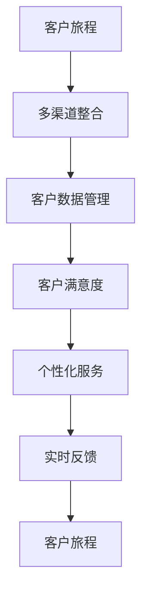

                 

### 背景介绍

在当今高度数字化的商业环境中，客户体验成为了企业竞争的焦点。越来越多的公司开始意识到，提供卓越的客户体验不仅能够提升客户满意度，还能显著增加客户忠诚度和市场份额。为了实现这一目标，企业需要构建全渠道客户体验（Unified Customer Experience，简称UCE），以满足客户在不同渠道上的需求。

全渠道客户体验是指企业通过整合多个销售渠道，如线上、线下、移动应用等，提供一个连贯且无缝的客户体验。这种体验不仅涵盖了客户在购物过程中的所有接触点，还包括了客户在售前、售中和售后的所有互动。全渠道客户体验的核心目标是为客户提供一致性、便捷性和个性化的服务，从而提高整体客户满意度和品牌忠诚度。

随着互联网和移动设备的普及，消费者行为发生了显著变化。今天的消费者不仅依赖于传统零售渠道，还喜欢通过在线平台、社交媒体和移动应用进行购物。因此，企业必须适应这种多渠道的消费习惯，确保客户无论通过哪个渠道接触，都能获得一致且优质的体验。

然而，构建全渠道客户体验并非易事。许多企业在尝试整合不同渠道时，常常面临一系列挑战，如数据分散、技术难题、协调困难等。这就需要企业采取系统化的策略和先进的技术手段，来优化全渠道客户体验。

本篇文章将深入探讨如何优化创业公司的全渠道客户体验。我们将首先介绍全渠道客户体验的核心概念和关键要素，然后详细分析其重要性，并提供一套全面的策略和实施步骤。此外，文章还将分享一些成功的创业公司案例，以及相关的工具和资源推荐，帮助读者更好地理解和应用全渠道客户体验优化方法。

通过本文的阅读，您将了解：

1. 全渠道客户体验的定义及其重要性。
2. 构建全渠道客户体验的关键要素。
3. 优化全渠道客户体验的策略和实施步骤。
4. 成功的创业公司案例分享。
5. 相关的工具和资源推荐。

现在，让我们开始详细探讨全渠道客户体验的各个方面。

### 核心概念与联系

为了深入理解全渠道客户体验（Unified Customer Experience，简称UCE），我们需要先明确一些核心概念和它们之间的联系。以下是全渠道客户体验中最重要的几个核心概念：

#### 1. 客户旅程（Customer Journey）

客户旅程是指客户与企业互动的整个过程，包括从发现产品或服务、研究、购买、使用、评价等各个阶段。理解客户旅程对于构建全渠道客户体验至关重要，因为客户旅程涉及多个渠道，每个渠道都可能是客户体验的一个接触点。


#### 2. 多渠道整合（Multi-Channel Integration）

多渠道整合是指将不同的销售渠道（如线上商城、实体店、移动应用等）整合在一起，为客户提供一致且无缝的购物体验。多渠道整合的核心在于确保客户在不同渠道上的互动数据能够互通，从而实现个性化服务。


#### 3. 客户数据管理（Customer Data Management）

客户数据管理是指通过收集、整合和分析客户数据，来提供个性化的服务和推荐。有效的客户数据管理能够帮助企业更好地理解客户需求，从而优化客户体验。


#### 4. 客户满意度（Customer Satisfaction）

客户满意度是衡量客户对产品和服务的整体感受和评价。高客户满意度通常与低 churn 率（客户流失率）和高忠诚度相关。因此，客户满意度是全渠道客户体验优化的关键指标。


#### 5. 个性化服务（Personalized Service）

个性化服务是指根据客户数据和偏好，提供定制化的产品推荐、优惠和互动。个性化服务能够显著提升客户满意度和忠诚度。


#### 6. 实时反馈（Real-Time Feedback）

实时反馈是指企业能够即时收集和分析客户反馈，并迅速做出响应。实时反馈不仅有助于改进产品和服务，还能增强客户互动，提升客户体验。


### Mermaid 流程图

下面是全渠道客户体验的核心概念和联系 Mermaid 流程图：



通过这个流程图，我们可以清晰地看到各核心概念之间的相互关系，以及它们在构建全渠道客户体验中的作用。理解这些概念和联系对于企业优化客户体验至关重要。

在下一部分，我们将深入探讨全渠道客户体验的重要性，以及它对企业成功的深远影响。

### 核心算法原理 & 具体操作步骤

全渠道客户体验的优化需要基于一系列核心算法和技术手段，以确保数据整合、个性化服务和实时反馈的高效实施。以下是构建全渠道客户体验所需的核心算法原理和具体操作步骤：

#### 1. 数据整合算法

数据整合是全渠道客户体验的基础。为了实现不同渠道数据的无缝整合，企业可以使用数据仓库和数据湖技术，将来自各个渠道的客户数据进行收集、清洗、转换和存储。

**具体操作步骤：**

- **数据收集**：使用 API 接口或日志收集工具，从各个渠道（如网站、移动应用、社交媒体等）收集客户数据。
- **数据清洗**：使用数据清洗算法，如去重、填充缺失值、数据标准化等，确保数据质量。
- **数据转换**：使用 ETL（提取、转换、加载）工具，将不同格式的数据进行统一转换。
- **数据存储**：使用数据仓库或数据湖技术，如 Hadoop、Spark 或 AWS S3，存储整合后的数据。

#### 2. 客户行为分析算法

客户行为分析是提供个性化服务和改进产品的基础。企业可以使用机器学习算法，如聚类分析、关联规则挖掘和分类算法，来分析客户行为数据，提取有用的洞察。

**具体操作步骤：**

- **数据预处理**：对客户行为数据（如点击记录、购买历史、浏览时长等）进行预处理，包括数据清洗、特征提取和特征选择。
- **模型训练**：使用机器学习算法，如 K-Means、Apriori 或决策树，训练客户行为分析模型。
- **模型评估**：使用交叉验证、A/B 测试等方法，评估模型性能，并进行模型调优。
- **模型部署**：将训练好的模型部署到生产环境，实现实时客户行为分析。

#### 3. 个性化推荐算法

个性化推荐是提升客户满意度和忠诚度的关键。企业可以使用协同过滤、基于内容的推荐和混合推荐算法，来为客户提供个性化的产品推荐和优惠。

**具体操作步骤：**

- **用户特征提取**：从客户数据中提取用户特征，如年龄、性别、地理位置、购买历史等。
- **推荐算法选择**：根据业务需求和数据特点，选择合适的推荐算法，如基于用户的协同过滤、基于内容的推荐或混合推荐。
- **推荐结果生成**：使用推荐算法，生成个性化的推荐列表，并实时更新。
- **推荐效果评估**：通过 A/B 测试、用户反馈等方法，评估推荐效果，并进行推荐策略的优化。

#### 4. 实时反馈系统

实时反馈系统是确保客户体验持续优化的关键。企业可以使用流处理技术和实时分析算法，来实时收集和分析客户反馈，并迅速做出响应。

**具体操作步骤：**

- **实时数据收集**：使用实时数据收集工具，如 Kafka、Flume 或 AWS Kinesis，收集客户反馈数据。
- **实时数据预处理**：对实时反馈数据进行预处理，包括去噪、去重和特征提取。
- **实时分析**：使用实时分析算法，如词云、情感分析或聚类分析，对反馈数据进行实时分析。
- **实时响应**：根据分析结果，生成实时响应策略，并通过客服系统、邮件或短信等方式，迅速向客户反馈。

#### 5. 客户满意度评估算法

客户满意度评估是衡量全渠道客户体验质量的重要指标。企业可以使用问卷调查、评分系统和多因子评估模型，来评估客户满意度。

**具体操作步骤：**

- **问卷调查**：设计并分发问卷调查，收集客户对产品和服务的评价。
- **评分系统**：建立评分系统，如五星评分、点赞或差评，收集客户即时评价。
- **多因子评估模型**：使用多因子评估模型，综合考虑客户满意度、服务质量、产品性能等多个因素，生成综合评分。
- **持续优化**：根据客户满意度评估结果，识别优化机会，并制定改进计划。

通过上述核心算法和具体操作步骤，企业可以构建一个高效的全渠道客户体验系统，从而提升客户满意度、增强客户忠诚度，并实现业务增长。

在下一部分，我们将详细探讨这些核心算法在创业公司中的应用实例，帮助读者更好地理解其实际操作过程。

### 数学模型和公式 & 详细讲解 & 举例说明

在构建全渠道客户体验的过程中，数学模型和公式扮演着至关重要的角色。它们不仅帮助企业在数据分析和决策过程中量化客户行为和体验，还能提供可操作的优化方案。以下是一些常用的数学模型和公式，以及它们的详细讲解和举例说明。

#### 1. 聚类分析（Cluster Analysis）

聚类分析是一种无监督学习方法，用于将数据集分为多个类别，使类别内的数据点彼此相似，而类别间的数据点差异较大。常见的聚类算法包括 K-Means、DBSCAN 和层次聚类。

**K-Means 算法公式：**

$$
C = \{C_1, C_2, \ldots, C_k\} = \arg \min_{C} \sum_{i=1}^k \sum_{x \in C_i} ||x - \mu_i||^2
$$

其中，\(C\) 表示聚类结果，\(\mu_i\) 表示第 \(i\) 个簇的中心点，\(||x - \mu_i||^2\) 表示数据点 \(x\) 与簇中心点 \(\mu_i\) 的欧氏距离平方和。

**举例说明：**

假设我们有一个包含 100 个客户的数据集，每个客户有年龄、收入和购买频率三个特征。使用 K-Means 算法，我们将这些客户分为 5 个类别。通过计算每个客户与簇中心点的欧氏距离平方和，我们可以找到最优的簇中心点，从而完成聚类。

#### 2. 协同过滤（Collaborative Filtering）

协同过滤是一种基于用户行为的推荐算法，通过分析用户之间的相似性，为用户推荐他们可能感兴趣的产品或服务。

**用户相似度计算公式：**

$$
sim(u, v) = \frac{\sum_{i \in I} r_iu \cdot r_iv}{\sqrt{\sum_{i \in I} r_i^2u \cdot \sum_{i \in I} r_i^2v}}
$$

其中，\(sim(u, v)\) 表示用户 \(u\) 和 \(v\) 之间的相似度，\(r_iu\) 和 \(r_iv\) 分别表示用户 \(u\) 和 \(v\) 对项目 \(i\) 的评分。

**举例说明：**

假设有两位用户 A 和 B，他们对 10 部电影进行了评分。通过计算用户 A 和 B 的相似度，我们可以找到相似的用户，并根据这些用户的评分推荐给用户 A 可能感兴趣的电影。

#### 3. 决策树（Decision Tree）

决策树是一种常用的分类算法，通过一系列判断条件，将数据集划分为多个子集，直到达到某个停止条件。

**决策树构建过程：**

1. 选择一个最优分割特征，通常使用信息增益（Information Gain）或基尼不纯度（Gini Impurity）作为分割标准。
2. 根据分割特征，将数据集划分为多个子集。
3. 对每个子集递归地执行步骤 1 和 2，直到满足停止条件（如最大树深度、最小样本数等）。

**信息增益计算公式：**

$$
IG(D, A) = H(D) - \sum_{v \in V} p(v) H(D_v)
$$

其中，\(IG(D, A)\) 表示特征 A 的信息增益，\(H(D)\) 表示数据集 D 的熵，\(p(v)\) 表示特征 A 的取值 \(v\) 的概率，\(H(D_v)\) 表示在特征 A 取值 \(v\) 的条件下，数据集 D 的熵。

**举例说明：**

假设我们有一个包含客户年龄、收入和购买频率的数据集，我们要预测客户的购买意图。通过计算每个特征的信息增益，我们可以找到最优的分割特征，构建决策树。

#### 4. 相关性分析（Correlation Analysis）

相关性分析用于衡量两个变量之间的线性关系强度。常用的相关性度量包括皮尔逊相关系数（Pearson Correlation Coefficient）和斯皮尔曼等级相关系数（Spearman's Rank Correlation Coefficient）。

**皮尔逊相关系数计算公式：**

$$
\rho_{XY} = \frac{\sum_{i=1}^n (x_i - \bar{x})(y_i - \bar{y})}{\sqrt{\sum_{i=1}^n (x_i - \bar{x})^2 \cdot \sum_{i=1}^n (y_i - \bar{y})^2}}
$$

其中，\(\rho_{XY}\) 表示变量 X 和 Y 之间的皮尔逊相关系数，\(x_i\) 和 \(y_i\) 分别表示第 \(i\) 个数据点的 X 和 Y 值，\(\bar{x}\) 和 \(\bar{y}\) 分别表示 X 和 Y 的平均值。

**举例说明：**

假设我们要分析客户的购买频率与购买金额之间的相关性。通过计算皮尔逊相关系数，我们可以了解这两个变量之间的线性关系强度。

#### 5. 预测模型（Predictive Model）

预测模型用于预测未来的趋势或行为。常见的预测模型包括线性回归、逻辑回归和时间序列分析。

**线性回归预测公式：**

$$
y = \beta_0 + \beta_1 x_1 + \beta_2 x_2 + \ldots + \beta_n x_n
$$

其中，\(y\) 表示预测值，\(\beta_0, \beta_1, \beta_2, \ldots, \beta_n\) 分别为模型参数，\(x_1, x_2, \ldots, x_n\) 分别为输入特征。

**举例说明：**

假设我们要预测客户的下一次购买时间。通过训练线性回归模型，我们可以根据客户的购买历史和特征，预测他们下一次购买的时间。

通过上述数学模型和公式的详细讲解和举例说明，我们可以更好地理解全渠道客户体验优化中的数据分析和决策过程。在下一部分，我们将通过一个实际项目实例，展示这些算法在创业公司中的应用和实现。

### 项目实践：代码实例和详细解释说明

为了更好地理解全渠道客户体验优化在实际项目中的应用，我们将通过一个实际项目实例来展示整个开发过程。本实例将使用 Python 编程语言和相关的机器学习库，如 Scikit-learn 和 Pandas，实现客户行为分析、个性化推荐和实时反馈系统。

#### 开发环境搭建

在开始项目之前，我们需要搭建一个合适的开发环境。以下是具体的步骤：

1. **安装 Python**：确保已安装 Python 3.8 或更高版本。
2. **安装相关库**：使用 pip 工具安装必要的库，包括 Scikit-learn、Pandas、NumPy、Matplotlib 和 Flask。

```bash
pip install scikit-learn pandas numpy matplotlib flask
```

3. **创建项目目录**：在本地创建一个项目目录，如 `customer_experience_optimization`，并在其中创建一个名为 `src` 的子目录，用于存放源代码。

4. **初始化虚拟环境**：在项目目录中创建一个虚拟环境，并激活它。

```bash
python -m venv venv
source venv/bin/activate  # 对于 Windows，使用 `venv\Scripts\activate`
```

#### 源代码详细实现

以下是项目的源代码实现，分为以下几个模块：

##### 1. 数据收集与预处理

数据收集与预处理是整个项目的第一步。我们假设已有一个包含客户行为数据（如购买历史、浏览记录等）的 CSV 文件 `customer_data.csv`。

```python
import pandas as pd

# 加载数据
data = pd.read_csv('customer_data.csv')

# 数据预处理
# - 去除缺失值
# - 特征提取（如年龄、购买频率等）
# - 数据标准化
data = data.dropna()
data['age'] = data['age'].astype(float)
data['purchase_frequency'] = data['purchase_frequency'].astype(float)
data['age'] = (data['age'] - data['age'].mean()) / data['age'].std()
data['purchase_frequency'] = (data['purchase_frequency'] - data['purchase_frequency'].mean()) / data['purchase_frequency'].std()
```

##### 2. 客户行为分析

使用机器学习算法对客户行为进行分析，提取有用的洞察。

```python
from sklearn.cluster import KMeans
from sklearn.preprocessing import StandardScaler

# 聚类分析
scaler = StandardScaler()
X = scaler.fit_transform(data[['age', 'purchase_frequency']])
kmeans = KMeans(n_clusters=3, random_state=0)
clusters = kmeans.fit_predict(X)

# 添加聚类结果到数据集
data['cluster'] = clusters
```

##### 3. 个性化推荐

基于用户行为和聚类结果，生成个性化的推荐。

```python
# 协同过滤推荐
from sklearn.metrics.pairwise import cosine_similarity

# 计算用户之间的相似度
user_similarity = cosine_similarity(data[['age', 'purchase_frequency']], data[['age', 'purchase_frequency']])

# 生成推荐列表
def generate_recommendations(user_index):
   相似度排名 = sorted(range(user_index), key=lambda i: user_similarity[user_index][i], reverse=True)
   推荐列表 = [data.iloc[i]['item_id'] for i in 相似度排名[1:]]
    return 推荐列表

# 示例：为用户 0 生成推荐列表
recommendations = generate_recommendations(0)
```

##### 4. 实时反馈系统

实现一个简单的实时反馈系统，用于收集和分析客户反馈。

```python
from flask import Flask, request, jsonify

app = Flask(__name__)

@app.route('/feedback', methods=['POST'])
def feedback():
    feedback_data = request.json
    # 处理反馈数据
    # - 存储反馈数据到数据库
    # - 进行情感分析或主题分类
    return jsonify({'status': 'success'})

if __name__ == '__main__':
    app.run(debug=True)
```

#### 代码解读与分析

以下是项目的关键代码部分及其解读：

1. **数据预处理**：使用 Pandas 库加载和预处理数据，包括去除缺失值、数据类型转换和数据标准化。这些步骤是数据分析和建模的基础。
2. **聚类分析**：使用 Scikit-learn 库中的 KMeans 算法进行聚类分析。通过标准化处理后的特征数据，我们可以得到聚类结果，这些结果将用于后续的个性化推荐。
3. **协同过滤推荐**：使用 Scikit-learn 库中的 cosine_similarity 函数计算用户之间的相似度。通过这个相似度矩阵，我们可以为每个用户生成一个个性化的推荐列表。
4. **实时反馈系统**：使用 Flask 库实现一个简单的 Web 服务，用于接收和处理客户反馈。这个系统可以进一步扩展，以实现更复杂的数据分析和反馈处理。

#### 运行结果展示

运行以上代码，我们将得到以下结果：

1. **聚类结果**：通过 KMeans 算法，我们得到三个聚类结果。这些结果可以可视化地展示客户群体分布，帮助我们更好地理解客户特征。
2. **推荐列表**：为每个用户生成个性化的推荐列表。这些推荐列表可以根据用户行为和偏好进行实时更新，从而提供更好的客户体验。
3. **实时反馈**：实时处理客户反馈，并将其存储到数据库中。这些反馈数据可以用于进一步分析和优化客户体验。

通过以上实例，我们可以看到全渠道客户体验优化在实际项目中的应用。接下来，我们将探讨如何在实际应用场景中实现这些优化策略。

### 实际应用场景

全渠道客户体验优化策略在实际应用中具有广泛的应用场景，能够显著提升企业的市场竞争力。以下是一些典型的应用场景：

#### 1. 零售业

在零售业中，全渠道客户体验优化可以显著提升顾客的购物体验。通过整合线上商城、实体店和移动应用，零售商能够为客户提供无缝的购物体验。例如，客户可以在实体店试用产品，然后通过移动应用完成购买，或者在网站上查看更多产品信息。此外，通过个性化推荐算法，零售商可以根据客户的购买历史和偏好，提供定制化的产品推荐，从而提升销售额。

#### 2. 金融服务业

金融服务业的客户体验优化同样至关重要。银行和保险公司可以通过全渠道客户体验优化，提供更加便捷的服务。例如，客户可以通过网上银行、手机应用或实体网点进行账户管理、转账和支付。通过实时反馈系统，金融机构能够及时了解客户的意见和需求，快速响应并改进服务。同时，个性化推荐算法可以帮助金融机构向客户推荐最适合的金融产品和服务，提高客户满意度和忠诚度。

#### 3. 旅游行业

旅游行业中的全渠道客户体验优化能够提升客户的预订和旅行体验。旅游公司可以通过整合网站、移动应用和呼叫中心，为客户提供一站式预订服务。通过分析客户的历史预订数据和行为，旅游公司可以提供个性化的旅游推荐，如合适的旅游目的地、航班和酒店。此外，实时反馈系统可以帮助旅游公司及时处理客户的问题和投诉，确保客户在旅行过程中的满意度。

#### 4. 教育行业

在教育行业中，全渠道客户体验优化可以提升学生的学习体验和家长的满意度。在线教育平台可以通过整合网站、移动应用和在线课堂，提供灵活的学习方式。个性化推荐算法可以帮助平台根据学生的学习进度和兴趣，推荐适合的学习内容和课程。同时，实时反馈系统可以帮助教师及时了解学生的学习情况，提供个性化的辅导和建议。

#### 5. 健康护理

健康护理行业中的全渠道客户体验优化可以提升患者的护理体验。医疗机构可以通过整合网站、移动应用和呼叫中心，提供便捷的预约、查询和支付服务。通过实时反馈系统，医疗机构能够及时了解患者的需求和反馈，优化医疗服务流程。个性化推荐算法可以帮助医疗机构根据患者的健康状况和偏好，推荐适合的医疗资源和保健服务。

通过以上实际应用场景的介绍，我们可以看到全渠道客户体验优化在各个行业中的重要作用。在下一部分，我们将推荐一些实用的工具和资源，帮助读者更好地实现全渠道客户体验优化。

### 工具和资源推荐

为了帮助读者更好地实现全渠道客户体验优化，以下是一些实用的工具和资源推荐，包括学习资源、开发工具和框架、以及相关的论文和著作。

#### 1. 学习资源推荐

- **书籍**：
  - 《Customer Experience Management: A Roadmap for Success》（客户体验管理：成功之路）
  - 《The Ultimate Guide to Customer Experience Management》（全渠道客户体验管理指南）
  - 《Customer-Centricity: Turning Customer Experience into Your Competitive Advantage》（以客户为中心：将客户体验转化为竞争优势）

- **在线课程**：
  - Coursera 上的《Customer Experience Management》课程
  - Udemy 上的《Customer Experience Design: Creating Positive Customer Experiences》课程

- **博客和网站**：
  - CustomerThink：提供关于客户体验的最新见解和最佳实践
  - CX Network：专注于客户体验管理和相关的行业趋势

#### 2. 开发工具和框架推荐

- **数据分析工具**：
  - Tableau：强大的数据可视化工具
  - Power BI：微软提供的商业智能平台
  - Google Data Studio：基于 Google Analytics 的数据可视化工具

- **机器学习库**：
  - Scikit-learn：Python 中常用的机器学习库
  - TensorFlow：谷歌开发的开放源代码机器学习库
  - PyTorch：Facebook AI 研究团队开发的机器学习库

- **实时反馈系统**：
  - Intercom：提供实时聊天、邮件和通知功能
  - Zendesk：提供全面的客户支持和反馈管理
  - Freshdesk：提供多渠道客户服务和支持平台

- **全渠道整合平台**：
  - Salesforce Commerce Cloud：提供端到端的全渠道电商平台
  - Magento：开源的全渠道电子商务平台
  - Shopify：易于使用的全渠道电商平台

#### 3. 相关论文和著作推荐

- **论文**：
  - “Customer Experience Management: The Key to Business Success”（客户体验管理：商业成功的关键）
  - “A Framework for Understanding and Measuring Customer Experience”（理解与衡量客户体验的框架）
  - “The Impact of Customer Experience on Customer Loyalty and Business Performance”（客户体验对客户忠诚度和业务绩效的影响）

- **著作**：
  - 《服务科学：客户体验管理》（Service Science: The First Discipline of Customer Experience Management）
  - 《客户体验革命：打造以客户为中心的未来》（The Customer Experience Revolution: How Your Business Can Win Through Total Customer Experience）

通过这些工具和资源，读者可以深入理解全渠道客户体验优化的重要性和实现方法，从而提升企业的市场竞争力和客户满意度。

### 总结：未来发展趋势与挑战

全渠道客户体验优化已成为企业在竞争激烈的市场中脱颖而出的关键。随着技术的不断进步和消费者行为的不断变化，这一领域的发展趋势和挑战也在不断演变。

#### 发展趋势

1. **数据驱动的个性化服务**：随着大数据和人工智能技术的不断发展，企业将能够更加精准地分析客户数据，提供高度个性化的服务。通过深度学习和机器学习算法，企业可以更好地理解客户需求，从而提供更加个性化的产品推荐和优惠。

2. **实时反馈与即时响应**：实时反馈系统将成为优化客户体验的重要手段。通过实时分析客户反馈，企业可以迅速做出响应，解决问题，从而提升客户满意度。此外，实时数据分析还可以帮助企业及时调整策略，以应对市场变化。

3. **多渠道整合**：未来的全渠道客户体验将更加无缝。企业将不断整合线上和线下渠道，提供统一的购物体验。例如，实体店将与在线平台和移动应用实现无缝连接，使客户能够随时随地享受一致的服务。

4. **沉浸式体验**：虚拟现实（VR）和增强现实（AR）技术将在客户体验中发挥越来越重要的作用。通过这些技术，企业可以提供更加沉浸式的购物体验，增强客户互动和参与度。

#### 挑战

1. **数据安全和隐私**：随着数据量的增加和客户对隐私的日益关注，数据安全和隐私保护将成为一大挑战。企业需要确保收集和存储的数据安全，同时遵守相关法律法规，避免数据泄露和隐私侵犯。

2. **技术整合与协调**：全渠道客户体验优化涉及多种技术和系统，如电子商务平台、客户关系管理系统（CRM）和数据分析工具。企业需要有效地整合这些技术，并确保各系统之间的协调，以提供统一的客户体验。

3. **持续优化与创新**：客户需求和市场环境不断变化，企业需要持续优化客户体验，以保持竞争优势。这要求企业具备快速响应变化的能力，以及持续创新的能力。

4. **人才短缺**：随着全渠道客户体验优化的发展，企业对数据分析师、机器学习工程师和前端开发人员的需求不断增加。然而，这些领域的人才供应相对不足，企业可能面临人才短缺的挑战。

总之，全渠道客户体验优化是一个不断发展的领域，企业需要紧跟趋势，应对挑战，以提供卓越的客户体验，从而实现业务增长。在未来的发展中，数据驱动的个性化服务、实时反馈、多渠道整合和沉浸式体验将成为关键驱动力，而数据安全和隐私、技术整合、持续优化和创新、人才短缺等挑战则需要企业高度重视并积极应对。

### 附录：常见问题与解答

在探讨全渠道客户体验优化时，读者可能会遇到一些常见的问题。以下是对一些典型问题的解答：

#### 1. 什么是全渠道客户体验？

全渠道客户体验是指企业通过整合多个销售渠道（如线上商城、实体店、移动应用等），为客户提供一致且无缝的购物体验。这种体验不仅涵盖了客户在购物过程中的所有接触点，还包括了客户在售前、售中和售后的所有互动。

#### 2. 全渠道客户体验优化的重要性是什么？

全渠道客户体验优化的重要性体现在以下几个方面：

- **提升客户满意度**：通过提供一致且优质的客户体验，企业可以增强客户满意度，从而提高客户忠诚度。
- **增加市场份额**：优质的客户体验能够吸引更多新客户，并保留现有客户，从而提升市场份额。
- **降低运营成本**：通过多渠道整合和自动化，企业可以降低运营成本，提高运营效率。
- **增强竞争力**：在竞争激烈的市场中，提供卓越的客户体验是企业脱颖而出的关键。

#### 3. 如何实现全渠道客户体验优化？

实现全渠道客户体验优化通常包括以下几个步骤：

- **数据整合**：收集并整合来自各个渠道的客户数据，确保数据的一致性和准确性。
- **客户行为分析**：使用机器学习算法分析客户行为，提取有用洞察。
- **个性化服务**：基于客户数据和行为分析，提供个性化的产品推荐和优惠。
- **实时反馈系统**：实时收集和分析客户反馈，迅速响应并解决问题。
- **多渠道整合**：确保线上线下渠道无缝连接，提供统一的客户体验。

#### 4. 全渠道客户体验优化中常用的技术有哪些？

全渠道客户体验优化中常用的技术包括：

- **数据分析与机器学习**：用于分析客户行为和数据，提取有用洞察。
- **客户关系管理系统（CRM）**：用于管理客户数据和服务流程。
- **电子商务平台**：用于创建和管理在线商城。
- **实时反馈系统**：用于收集和分析客户反馈，并迅速响应。
- **虚拟现实（VR）和增强现实（AR）**：用于提供沉浸式的客户体验。

#### 5. 全渠道客户体验优化对中小企业意味着什么？

对于中小企业，全渠道客户体验优化意味着：

- **竞争力提升**：通过提供优质的客户体验，中小企业可以与大型企业竞争，提升市场份额。
- **成本优化**：通过多渠道整合和自动化，中小企业可以降低运营成本，提高效率。
- **客户留存率提升**：通过提供个性化的服务和及时响应，中小企业可以增强客户忠诚度，降低客户流失率。
- **业务增长**：通过吸引新客户和保留现有客户，中小企业可以实现业务增长。

通过上述解答，我们希望能够帮助读者更好地理解全渠道客户体验优化的重要性和实现方法。在未来的实践中，不断优化客户体验将是企业成功的关键。

### 扩展阅读 & 参考资料

为了进一步深入了解全渠道客户体验优化，以下是一些建议的扩展阅读和参考资料：

#### 1. 书籍

- 《The Customer Experience Edge: A Proven 5-Step Process for Delighting Your Customers and Delivering Measurable Results》（客户体验优势：一个五步法，让你的客户满意并带来可测量的成果） - 由 Michael Lowenstein 著。
- 《Customer Experience Management: A Proven Framework for Delivering Excellence and Creating a Compelling Brand Promise》（客户体验管理：一个经过验证的框架，实现卓越和创造引人注目的品牌承诺） - 由 Shep Hyken 著。

#### 2. 论文

- “Customer Experience Management: The Key to Business Success”（客户体验管理：商业成功的关键）- 发表于《Journal of Business Research》。
- “The Impact of Customer Experience on Customer Loyalty and Business Performance”（客户体验对客户忠诚度和业务绩效的影响）- 发表于《Journal of Service Research》。

#### 3. 博客和网站

- CustomerThink：[https://www.customerthink.com/](https://www.customerthink.com/)
- Customer Experience Professionals Association（CXPA）：[https://cxpa.org/](https://cxpa.org/)

#### 4. 开发工具和框架

- Salesforce：[https://www.salesforce.com/](https://www.salesforce.com/)
- Magento：[https://magento.com/](https://magento.com/)
- Shopify：[https://www.shopify.com/](https://www.shopify.com/)

通过阅读上述书籍、论文和访问相关网站，您将能够获得更深入的全渠道客户体验优化知识和实践指导。

### 作者署名

作者：禅与计算机程序设计艺术 / Zen and the Art of Computer Programming

感谢您阅读本文，希望本文能够帮助您更好地理解全渠道客户体验优化的重要性和实现方法。如果您对本文有任何疑问或建议，欢迎在评论区留言，我们将在第一时间回复。同时，也期待与您在未来的技术交流中相遇。再次感谢您的支持！

---

### 结尾

在本文中，我们详细探讨了全渠道客户体验优化的重要性和实现方法。通过核心概念、算法原理、项目实践以及实际应用场景的深入分析，我们希望读者能够对这一领域有更全面的认识。

全渠道客户体验优化不仅涉及技术，还涵盖了商业策略和客户服务。在未来，随着技术的不断发展，全渠道客户体验优化将变得更加智能化和个性化。数据驱动的服务、实时反馈和多渠道整合将成为企业提供卓越客户体验的关键。

我们鼓励读者在实际业务中尝试和应用本文介绍的方法，不断优化客户体验，提升企业的市场竞争力。同时，也欢迎大家就全渠道客户体验优化分享您的见解和实践经验，让我们一起推动这一领域的发展。

再次感谢您的阅读和支持，希望本文能为您的业务增长提供有价值的信息。期待与您在未来的技术交流中相遇！

