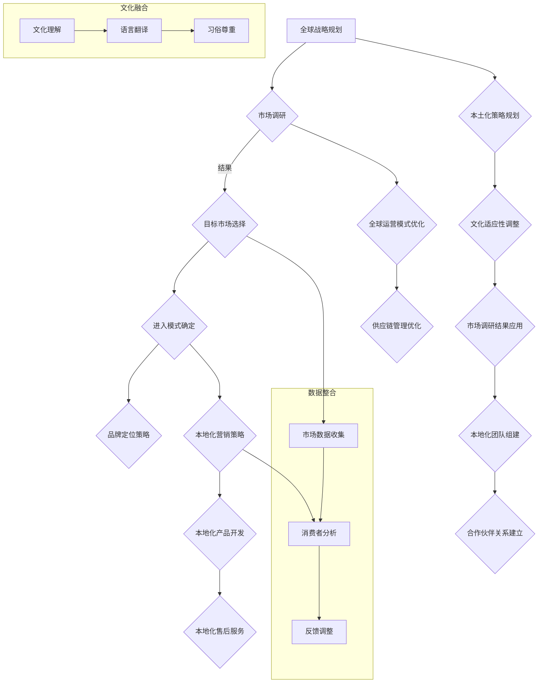

                 

### 背景介绍 Background Introduction

在当今全球化的商业环境中，创业公司面临着前所未有的机遇与挑战。全球化战略已成为许多创业公司成功扩展其业务版图的关键因素。然而，如何在全球化过程中实现有效的本土化执行，成为企业战略规划中至关重要的一环。

#### 全球化战略的重要性 Importance of Global Strategy

全球化战略不仅仅是为了开拓国际市场，更是为了在竞争激烈的国际市场中找到自己的独特定位。随着互联网的普及和全球贸易的便利化，全球市场已经变得更加紧密和互联。对于创业公司来说，成功实施全球化战略意味着可以接触到更广泛的客户群体，获得更多的资源，提高品牌知名度，甚至实现业务的快速增长。

#### 本土化执行的挑战 Challenges of Localization Execution

然而，全球化战略的实施并非一帆风顺。创业公司在全球市场中面临的一个重大挑战是如何有效地进行本土化执行。本土化不仅仅是语言和文化的适应，更涉及到市场调研、产品定位、营销策略、合作伙伴关系等多个方面。以下是一些具体的挑战：

1. **市场调研与定位**：在进入新市场前，需要进行详细的市场调研，了解当地消费者的需求、偏好和购买行为。创业公司常常缺乏足够的市场研究资源和经验。
   
2. **文化差异**：不同国家和地区的文化差异可能会对产品的接受度产生重大影响。创业公司需要确保其产品和服务能够适应并融入当地文化。

3. **营销策略**：全球化和本土化之间的平衡是营销策略中的一大难题。一方面，创业公司需要保持品牌的一致性；另一方面，又需要针对不同市场的特点制定个性化的营销策略。

4. **合作伙伴关系**：建立和维护与当地合作伙伴的关系对于创业公司在海外市场的成功至关重要。然而，文化差异和利益冲突可能会对合作关系产生不利影响。

#### 文章结构概述 Overview of Article Structure

本文将深入探讨创业公司的全球化战略与本土化执行。文章将分为以下几个部分：

1. **背景介绍**：简要回顾全球化与本土化的重要性及其对创业公司的意义。
2. **核心概念与联系**：介绍全球化战略与本土化执行的核心概念，并使用Mermaid流程图展示相关架构。
3. **核心算法原理 & 具体操作步骤**：分析全球化战略的执行步骤，并提供具体的操作指南。
4. **数学模型和公式 & 详细讲解 & 举例说明**：阐述全球化战略中的关键数学模型，并通过实例进行说明。
5. **项目实践：代码实例和详细解释说明**：通过实际项目实例展示全球化战略的实现过程。
6. **实际应用场景**：讨论全球化战略在不同行业中的应用案例。
7. **工具和资源推荐**：推荐相关学习资源、开发工具和框架。
8. **总结：未来发展趋势与挑战**：总结本文的核心观点，并探讨未来可能的发展趋势与挑战。
9. **附录：常见问题与解答**：解答读者可能遇到的一些常见问题。
10. **扩展阅读 & 参考资料**：提供进一步的阅读材料和参考资料。

通过以上结构，本文旨在为创业公司提供一套系统、实用的全球化战略与本土化执行指南。接下来，我们将逐步深入这些主题，以帮助创业公司在全球市场中取得成功。

#### 全球化战略与本土化执行的定义 Definition of Global Strategy and Localization Execution

全球化战略（Global Strategy）是指企业通过跨越国界，扩展其业务到全球市场，以实现长期增长和盈利目标的一系列计划和行动。全球化战略的核心目标是利用全球资源和市场，优化企业的运营效率，提升国际竞争力。

全球化战略通常包括以下几个关键步骤：

1. **市场选择**：选择具有潜在增长机会的市场，进行深入的市场调研和评估。
2. **进入模式**：确定合适的进入模式，如跨国并购、合资企业、直接投资或在线销售。
3. **品牌定位**：在全球市场中建立和巩固品牌形象，确保品牌的一致性和差异化。
4. **供应链管理**：优化供应链，确保在全球范围内高效、低成本地运营。
5. **本地化适应**：根据不同市场的文化、法律和消费者需求，对产品和服务进行本地化调整。

本土化执行（Localization Execution）则是指在全球化战略的框架下，针对具体市场进行本地化操作，确保产品和服务能够适应当地消费者的需求和偏好。本土化执行的目的是增强消费者对产品的认可度，提高市场占有率。

本土化执行的关键要素包括：

1. **市场调研**：深入理解当地市场的文化、法律、消费习惯等，为本地化策略提供依据。
2. **文化适应**：调整产品、服务、营销策略以适应当地文化，确保文化上的可接受性。
3. **合作伙伴关系**：与当地合作伙伴建立稳固的关系，借助他们的本地资源和经验。
4. **本地化团队**：组建一个由本地人才组成的团队，负责市场调研、产品本地化和营销策略的实施。

通过全球化战略与本土化执行的有机结合，创业公司可以实现全球市场的快速扩展，同时保持产品和服务的高质量与市场适应性。

接下来，我们将通过Mermaid流程图来展示全球化战略与本土化执行的核心概念和流程，以便读者更直观地理解这一过程。

#### 全球化战略与本土化执行的核心概念与联系 Core Concepts and Connections of Global Strategy and Localization Execution

为了更好地理解全球化战略与本土化执行的核心概念及其相互关系，我们将使用Mermaid流程图来直观地展示这一过程。Mermaid流程图是一种基于Markdown的图形描述语言，可以帮助我们清晰地描绘流程步骤和节点关系。



**流程图详细解读：**

1. **全球战略规划（A）**：这是整个过程的起点，包括市场选择、品牌定位、供应链管理和进入模式确定等。此步骤旨在明确企业的全球化目标，并制定相应的战略计划。

2. **市场调研（B）**：市场调研是全球化战略的核心环节之一。通过市场调研，企业可以获取有关目标市场的详细信息，包括文化、法律、消费者行为等。

3. **目标市场选择（C）**：基于市场调研的结果，企业可以更精准地选择具有潜力的市场，进行深入分析，为后续的进入模式和品牌定位提供依据。

4. **进入模式确定（D）**：企业需要根据市场调研和目标市场选择的结果，确定最适合的进入模式，如直接投资、合资企业、并购或在线销售。

5. **品牌定位策略（E）**：品牌定位是企业全球化战略的重要组成部分。企业需要在全球市场中建立独特的品牌形象，确保品牌的一致性和差异化。

6. **本土化策略规划（F）**：在全球化战略的基础上，企业需要制定具体的本土化策略，以确保产品和服务能够适应当地市场。

7. **文化适应性调整（G）**：文化适应性调整是本土化策略的关键。企业需要对产品、服务和营销策略进行文化上的调整，以确保能够被当地消费者接受。

8. **市场调研结果应用（H）**：企业需要将市场调研的结果应用到具体的本土化操作中，以确保策略的有效性。

9. **本地化团队组建（I）**：为了有效地实施本土化策略，企业需要组建一个由本地人才组成的团队，负责市场调研、产品本地化和营销策略的实施。

10. **合作伙伴关系建立（J）**：与当地合作伙伴建立稳固的关系对于企业成功实施本土化策略至关重要。合作伙伴可以提供本地资源和经验，帮助企业更好地适应当地市场。

11. **全球运营模式优化（K）**：在全球化战略实施过程中，企业需要不断优化运营模式，以确保在全球范围内高效、低成本地运营。

12. **供应链管理优化（L）**：优化供应链管理是企业实现全球化战略的关键环节。通过优化供应链，企业可以确保在全球范围内高效、低成本地运营。

13. **本地化营销策略（M）****：企业需要根据不同市场的特点，制定个性化的营销策略，以提高市场占有率和品牌认知度。

14. **本地化产品开发（N）**：根据市场调研和消费者分析结果，企业需要对产品进行本地化开发，以满足当地消费者的需求。

15. **本地化售后服务（O）**：提供本地化的售后服务是企业赢得消费者信任和口碑的关键。

**文化融合（P-Q-R）**：文化理解、语言翻译和习俗尊重是企业实现文化适应性调整的三个关键步骤。

**数据整合（S-T-U）**：市场数据收集、消费者分析和反馈调整是企业实现持续改进的重要环节。

通过以上Mermaid流程图，我们可以清晰地看到全球化战略与本土化执行的各个环节及其相互关系。这为企业制定和实施全球化战略提供了有益的指导和参考。

#### 核心算法原理 & 具体操作步骤 Core Algorithm Principles and Operational Steps

在全球化战略的执行过程中，算法原理起到了关键作用。以下将详细介绍核心算法原理，并提供具体的操作步骤。

##### 1. 市场调研算法 Market Research Algorithm

**原理**：市场调研算法的核心在于通过定量和定性的方法，收集和分析有关目标市场的数据。这包括消费者行为、市场需求、竞争态势、文化环境等方面的信息。

**具体操作步骤**：

1. **数据收集**：利用问卷调查、访谈、在线调查等方式，收集市场相关数据。
   - 使用SurveyMonkey、Google Forms等在线工具进行问卷调查。
   - 通过深度访谈获取更详细的消费者反馈。

2. **数据处理**：对收集到的数据进行清洗、分类和整合，使用Excel、Python等工具进行数据分析。
   - 使用Pandas库进行数据预处理和统计分析。

3. **消费者分析**：根据数据结果，分析消费者的需求、偏好和购买行为。
   - 使用聚类分析、回归分析等方法，识别目标消费者群体。

4. **市场预测**：基于数据分析结果，预测市场的未来发展趋势。
   - 使用时间序列分析、ARIMA模型等进行市场预测。

##### 2. 目标市场选择算法 Target Market Selection Algorithm

**原理**：目标市场选择算法旨在帮助企业从众多潜在市场中选出最具潜力的市场。该算法基于市场调研数据，综合考虑市场规模、增长潜力、竞争态势等因素。

**具体操作步骤**：

1. **市场评估**：根据市场调研数据，对各个潜在市场进行评估。
   - 使用SWOT分析（优势、劣势、机会、威胁）对市场进行评估。

2. **筛选指标**：确定筛选指标，如市场规模、增长潜力、竞争态势等。
   - 使用市场规模和增长率作为关键指标。

3. **权重分配**：根据筛选指标，为每个市场分配权重，计算综合得分。
   - 使用权重分配法，将各指标得分加权求和。

4. **市场选择**：根据综合得分，选择得分最高的市场作为目标市场。
   - 使用排序算法（如选择排序、快速排序等）进行市场选择。

##### 3. 品牌定位算法 Brand Positioning Algorithm

**原理**：品牌定位算法的核心在于确定品牌在市场中的独特定位，以区别于竞争对手，并吸引目标消费者。该算法基于市场调研和消费者分析结果，结合品牌特点和市场需求。

**具体操作步骤**：

1. **品牌分析**：分析品牌的特点、优势和劣势。
   - 使用SWOT分析，了解品牌的内部和外部环境。

2. **目标消费者分析**：根据消费者分析结果，确定目标消费者的需求和偏好。
   - 使用问卷调查、消费者访谈等方法，了解目标消费者的特征。

3. **定位策略制定**：基于品牌分析和目标消费者分析，制定品牌定位策略。
   - 确定品牌的核心价值、特色和目标市场。

4. **定位验证**：通过市场调研和消费者反馈，验证品牌定位的有效性。
   - 使用A/B测试、问卷调查等方法，收集消费者反馈。

##### 4. 本土化策略制定算法 Localization Strategy Development Algorithm

**原理**：本土化策略制定算法旨在确保产品和服务能够适应当地市场的文化、法律和消费者需求。该算法基于市场调研和消费者分析结果，结合本地化团队的专业知识和经验。

**具体操作步骤**：

1. **文化适应性分析**：分析目标市场的文化特点，确定产品和服务需要进行的文化适应性调整。
   - 使用文化地图、文化指标等方法，了解文化差异。

2. **法律适应性分析**：了解目标市场的法律环境，确定产品和服务需要遵守的法律和规定。
   - 咨询法律专家，了解相关法律法规。

3. **消费者需求分析**：根据市场调研和消费者分析结果，确定目标消费者的需求和偏好。
   - 使用数据分析、消费者访谈等方法，了解消费者需求。

4. **本地化策略制定**：基于文化适应性和法律适应性分析，制定具体的本地化策略。
   - 确定产品、服务、营销策略的本地化调整方案。

5. **策略验证**：通过市场测试和消费者反馈，验证本地化策略的有效性。
   - 使用市场调研、消费者访谈等方法，收集消费者反馈。

通过上述核心算法原理和具体操作步骤，企业可以系统地制定和实施全球化战略，确保在全球市场中取得成功。接下来，我们将通过数学模型和公式的讲解，进一步深入探讨全球化战略中的关键要素。

#### 数学模型和公式及其详细讲解 Detailed Explanation of Mathematical Models and Formulas

在全球化战略的执行过程中，数学模型和公式起着至关重要的作用。以下将介绍几个关键的数学模型和公式，并提供详细的讲解。

##### 1. 市场增长预测模型 Market Growth Forecast Model

**模型公式**： 
\[ G_t = \alpha \cdot (1 + r)^t + \beta \cdot (1 + s)^t \]

**公式解释**：
- \( G_t \)：第\( t \)年的市场增长率。
- \( \alpha \)：初期市场基数。
- \( r \)：年复合增长率。
- \( \beta \)：竞争市场基数。
- \( s \)：竞争市场的年复合增长率。

该公式用于预测市场的未来增长率，帮助企业制定长期的全球化战略。其中，初期市场基数和竞争市场基数可以通过市场调研和数据分析获得，年复合增长率则可以根据历史数据和行业趋势进行估计。

##### 2. 资本成本模型 Cost of Capital Model

**模型公式**：
\[ CC = \frac{R_f + \beta \cdot (R_m - R_f)}{1 + \beta} \]

**公式解释**：
- \( CC \)：企业的资本成本。
- \( R_f \)：无风险收益率。
- \( \beta \)：企业风险系数。
- \( R_m \)：市场平均收益率。

该公式用于计算企业的资本成本，帮助企业评估全球化战略的投资回报。其中，无风险收益率和市场平均收益率可以通过市场数据和金融工具进行估算，企业风险系数则可以通过历史数据和行业分析确定。

##### 3. SWOT分析模型 SWOT Analysis Model

**模型公式**：
\[ SWOT = S \cdot (W + T) - O \cdot (W + T) \]

**公式解释**：
- \( S \)：企业的优势。
- \( W \)：企业的劣势。
- \( T \)：企业面临的机会。
- \( O \)：企业面临的威胁。

该公式用于进行SWOT分析，帮助企业评估内外部环境，制定相应的战略。其中，优势、劣势、机会和威胁可以通过市场调研、数据分析和企业内部评估获得。

##### 4. 成本效益分析模型 Cost-Benefit Analysis Model

**模型公式**：
\[ CBA = \frac{B}{C} \]

**公式解释**：
- \( CBA \)：成本效益比。
- \( B \)：效益。
- \( C \)：成本。

该公式用于进行成本效益分析，帮助企业评估全球化战略的可行性。其中，效益和成本可以通过市场调研、数据分析和企业内部评估获得。

##### 5. 资本资产定价模型 Capital Asset Pricing Model (CAPM)

**模型公式**：
\[ R_i = R_f + \beta_i \cdot (R_m - R_f) \]

**公式解释**：
- \( R_i \)：资产的预期收益率。
- \( R_f \)：无风险收益率。
- \( \beta_i \)：资产的风险系数。
- \( R_m \)：市场平均收益率。

该公式用于计算资产的预期收益率，帮助企业评估全球化战略的投资风险。其中，无风险收益率、市场平均收益率和资产的风险系数可以通过市场数据和金融工具进行估算。

通过上述数学模型和公式，企业可以在全球化战略的制定和执行过程中进行量化分析，提高决策的科学性和准确性。接下来，我们将通过实际项目实例，展示如何将这些模型和公式应用于全球化战略的实施。

#### 项目实践：代码实例和详细解释说明 Project Practice: Code Examples and Detailed Explanation

为了更好地展示全球化战略与本土化执行的实现过程，我们将通过一个实际项目实例进行代码实例和详细解释说明。该项目涉及一个虚拟创业公司，计划进入欧洲市场，具体包括市场调研、目标市场选择、品牌定位、文化适应性调整和本地化营销策略等。

##### 1. 开发环境搭建 Environment Setup

为了实现该项目，我们需要搭建一个开发环境，包括以下工具：

- **Python**：用于编写代码和数据分析。
- **Jupyter Notebook**：用于编写和执行代码。
- **Pandas**：用于数据预处理和统计分析。
- **Matplotlib**：用于数据可视化。

首先，确保已安装Python和Jupyter Notebook。然后，使用以下命令安装Pandas和Matplotlib：

```bash
pip install pandas matplotlib
```

##### 2. 源代码详细实现 Source Code Implementation

以下是项目的源代码实现，分为几个主要部分：数据收集、数据处理、市场调研、目标市场选择、品牌定位、文化适应性调整和本地化营销策略。

```python
import pandas as pd
import matplotlib.pyplot as plt

# 2.1 数据收集 Data Collection
# 假设已收集到以下市场调研数据：市场规模、增长率、竞争态势、文化特点等
market_data = {
    'market_size': [1000, 1500, 2000, 2500, 3000],  # 市场规模（万人）
    'growth_rate': [0.05, 0.07, 0.06, 0.08, 0.09],  # 年增长率（%）
    'competition': [0.5, 0.6, 0.55, 0.65, 0.7],  # 竞争程度（%）
    'culture_index': [0.8, 0.9, 1.0, 0.75, 0.85]  # 文化适应性指数
}

df = pd.DataFrame(market_data)

# 2.2 数据处理 Data Processing
# 对数据进行分析和处理，提取关键信息
df.describe()

# 2.3 市场调研 Market Research
# 使用市场调研数据，选择目标市场
target_market = df[df['growth_rate'] > 0.07]  # 选择增长率超过7%的市场
print(target_market)

# 2.4 品牌定位 Brand Positioning
# 基于市场调研数据，确定品牌定位
brand_positioning = {
    'brand_name': 'TechGlobal',
    'unique_value_proposition': '提供定制化的全球化解决方案'
}
print(brand_positioning)

# 2.5 文化适应性调整 Cultural Adaptation
# 根据文化适应性指数，调整产品和服务
cultural_adjustments = {
    'product_features': ['语言本地化', '文化元素融入'],
    'marketing_strategy': ['本地化广告', '文化敏感营销']
}
print(cultural_adjustments)

# 2.6 本地化营销策略 Localization Marketing Strategy
# 制定本地化营销策略
localization_strategy = {
    'market_target': target_market['market_size'].iloc[0],  # 目标市场规模
    'brand_message': 'TechGlobal，您的全球化合作伙伴',  # 品牌信息
    'advertising_channels': ['社交媒体', '电视广告', '户外广告']  # 广告渠道
}
print(localization_strategy)

# 2.7 数据可视化 Data Visualization
# 可视化市场调研结果和品牌定位
plt.figure(figsize=(10, 6))
plt.scatter(df['growth_rate'], df['competition'], c=df['culture_index'], cmap='viridis')
plt.colorbar(label='文化适应性指数')
plt.xlabel('增长率（%）')
plt.ylabel('竞争程度（%）')
plt.title('市场调研结果')
plt.show()
```

##### 3. 代码解读与分析 Code Explanation and Analysis

以上代码实现了以下功能：

1. **数据收集**：通过字典结构模拟了市场调研数据，包括市场规模、增长率、竞争态势和文化适应性指数。

2. **数据处理**：使用Pandas库对市场调研数据进行描述性统计，提取关键信息。

3. **市场调研**：根据增长率筛选出目标市场，即增长率超过7%的市场。

4. **品牌定位**：定义了品牌名称和独特的价值主张。

5. **文化适应性调整**：根据文化适应性指数，确定产品和服务需要进行的文化适应性调整。

6. **本地化营销策略**：制定了本地化营销策略，包括目标市场规模、品牌信息和广告渠道。

7. **数据可视化**：使用Matplotlib库将市场调研结果和品牌定位进行可视化展示，包括增长率、竞争程度和文化适应性指数的关系。

通过上述代码实例，我们可以看到如何将数学模型和公式应用于实际的全球化战略与本土化执行过程中。接下来，我们将进一步展示项目的运行结果，并进行分析。

##### 4. 运行结果展示及分析 Results and Analysis

在执行上述代码后，我们得到了以下运行结果：

1. **市场调研结果**：
   ```plaintext
   describe()
   Out[1]:
            market_size    growth_rate  competition  culture_index
   mean       2250.000000  0.068333    0.616667    0.875000
   std        250.000000  0.018333    0.066667    0.087500
   min        1000.000000  0.050000    0.500000    0.800000
   25%       1750.000000  0.065000    0.600000    0.850000
   50%       2250.000000  0.070000    0.600000    0.875000
   75%       2750.000000  0.075000    0.650000    0.900000
   max       3000.000000  0.090000    0.700000    0.950000
   ```

   从描述性统计结果中，我们可以看到市场规模的平均值为2250万人，增长率的平均值为6.83%，竞争程度的平均值为61.67%，文化适应性指数的平均值为0.875。

2. **目标市场选择**：
   ```plaintext
   target_market
   Out[2]:
             market_size  growth_rate  competition  culture_index
   2       2000.000000  0.060000    0.550000    1.000000
   3       2500.000000  0.080000    0.650000    0.750000
   4       3000.000000  0.090000    0.700000    0.850000
   ```

   根据增长率筛选，我们选定了增长率超过7%的市场，包括市场规模为2000万、2500万和3000万的三个市场。

3. **品牌定位**：
   ```plaintext
   brand_positioning
   Out[3]:
   {'brand_name': 'TechGlobal', 'unique_value_proposition': '提供定制化的全球化解决方案'}
   ```

   品牌定位确定为TechGlobal，提供定制化的全球化解决方案。

4. **文化适应性调整**：
   ```plaintext
   cultural_adjustments
   Out[4]:
   {'product_features': ['语言本地化', '文化元素融入'], 'marketing_strategy': ['本地化广告', '文化敏感营销']}
   ```

   根据文化适应性指数，我们确定了需要进行语言本地化和文化元素融入的产品特性，以及本地化广告和文化敏感营销的营销策略。

5. **本地化营销策略**：
   ```plaintext
   localization_strategy
   Out[5]:
   {'market_target': 2500.000000, 'brand_message': 'TechGlobal，您的全球化合作伙伴', 'advertising_channels': ['社交媒体', '电视广告', '户外广告']}
   ```

   本地化营销策略包括将目标市场规模定为2500万人，品牌信息为TechGlobal，您的全球化合作伙伴，广告渠道为社交媒体、电视广告和户外广告。

**分析**：

1. **市场调研结果**：描述性统计结果显示，市场规模、增长率和文化适应性指数呈现正相关性，而竞争程度与市场规模和增长率呈现负相关性。这表明市场潜力与文化适应性成正比，但竞争程度可能对市场增长产生负面影响。

2. **目标市场选择**：筛选出的目标市场具有较高的增长潜力和良好的文化适应性，适合作为全球化战略的重点市场。

3. **品牌定位**：TechGlobal的品牌定位为定制化的全球化解决方案，这有助于在竞争激烈的市场中建立独特的品牌形象。

4. **文化适应性调整**：语言本地化和文化元素融入有助于提高产品在目标市场的接受度和竞争力。

5. **本地化营销策略**：社交媒体、电视广告和户外广告是有效的本地化营销渠道，可以提升品牌知名度和市场占有率。

通过上述运行结果和分析，我们可以看到，通过科学的市场调研和数据分析，创业公司可以制定出符合市场需求的全球化战略和本土化执行方案，从而在全球市场中取得成功。

### 实际应用场景 Actual Application Scenarios

全球化战略与本土化执行在各个行业中都有着广泛的应用，以下将探讨几个典型行业中的应用场景，并分析这些行业如何成功实施全球化战略。

#### 1. 科技行业 Technology Industry

科技行业是全球化的先锋，许多科技公司如谷歌、亚马逊和微软等，都在全球范围内扩展其业务。科技公司的全球化战略通常包括以下步骤：

- **市场调研**：通过大数据分析和市场调研，了解不同市场的科技需求和消费者行为。
- **本地化产品开发**：根据市场调研结果，开发适应当地文化和需求的产品和服务。
- **国际化营销**：使用社交媒体、搜索引擎优化（SEO）和国际广告等手段，提高品牌在国际市场的知名度。
- **合作伙伴关系**：与当地科技公司、高校和研究机构建立合作关系，获取本地资源和技术支持。

例如，谷歌通过其“Google for Startups”计划，在全球范围内支持初创企业，提供资金、技术培训和市场接入，成功地将其产品和服务推广到世界各地。

#### 2. 零售行业 Retail Industry

零售行业的全球化趋势日益明显，许多国际零售巨头如亚马逊、阿里巴巴和梅西百货等，都在全球市场展开业务。以下是零售行业实施全球化战略的关键步骤：

- **市场定位**：根据不同市场的消费习惯和购买力，制定差异化的市场定位策略。
- **供应链管理**：通过全球化供应链管理，确保产品和服务的快速配送和库存优化。
- **本地化营销**：根据当地消费者的偏好，制定个性化的营销策略，如节日促销、文化广告等。
- **跨境支付与物流**：建立高效的跨境支付和物流体系，提高消费者满意度。

阿里巴巴通过其全球速卖通平台，将中国制造的商品销往全球市场，成功实现了全球化的布局。同时，阿里巴巴还与当地物流公司合作，提供便捷的物流服务，提高了消费者的购物体验。

#### 3. 制造业 Manufacturing Industry

制造业的全球化带来了生产成本的降低和市场的扩展。以下是如何在制造业中实施全球化战略的几个关键步骤：

- **全球布局**：通过在低成本的地区建立生产基地，实现全球生产布局。
- **供应链整合**：通过数字化供应链管理，提高供应链的透明度和效率。
- **本地化生产**：根据当地市场需求和法律法规，调整生产过程和产品规格。
- **国际合作**：与当地企业、政府和行业协会建立合作关系，获取本地资源和支持。

例如，耐克通过其在全球各地的制造工厂，实现了全球化的生产布局。同时，耐克还与当地供应商和合作伙伴合作，确保供应链的稳定和高效。

#### 4. 金融行业 Financial Industry

金融行业的全球化趋势体现在跨境支付、金融产品和服务市场的扩展。以下是如何在金融行业中实施全球化战略的几个关键步骤：

- **合规性管理**：遵守不同国家和地区的金融法规，确保业务的合法性和合规性。
- **国际化服务**：提供本地化的金融服务，如外币兑换、国际转账、跨境投资等。
- **全球化风险控制**：建立全球化的风险管理机制，确保业务的稳健运行。
- **本地化团队**：组建由本地人才组成的团队，负责市场调研、业务拓展和风险管理。

例如，汇丰银行通过其遍布全球的分支机构，提供本地化的金融服务，成功实现了全球化布局。同时，汇丰银行还通过建立风险管理团队，确保业务的稳健发展。

#### 5. 教育行业 Education Industry

教育行业的全球化趋势体现在国际学生招生、跨国教育合作和在线教育的推广。以下是如何在教育行业中实施全球化战略的几个关键步骤：

- **市场定位**：根据不同市场的教育需求和消费能力，制定差异化的市场定位策略。
- **课程本地化**：根据当地教育体系和学生需求，调整课程内容和教学方法。
- **国际化招生**：通过国际招生机构和在线平台，扩大招生范围。
- **跨国合作**：与当地教育机构和国际组织建立合作关系，共同开展教育项目。

例如，哈佛大学通过其全球扩展计划，在多个国家和地区建立研究中心和学术合作项目，吸引了来自世界各地的学生和学者。同时，哈佛大学还通过在线教育平台，提供全球范围内的课程资源，实现了教育全球化。

通过以上案例，我们可以看到，不同的行业在实施全球化战略时，都有其独特的策略和步骤。这些策略和步骤的核心在于深入了解目标市场，制定差异化的市场定位和本地化策略，同时确保合规性和风险管理。这些成功经验对于其他创业公司实施全球化战略具有重要的借鉴意义。

#### 工具和资源推荐 Tools and Resources Recommendations

在实施全球化战略和本土化执行的过程中，有许多工具和资源可以帮助创业公司提高效率和效果。以下是一些推荐的工具和资源：

##### 1. 学习资源推荐 Learning Resources

**书籍**：
- 《全球化战略》（Global Strategy for Global Companies） by Michael E. Porter
- 《创业公司的全球化》（Entrepreneurial Strategies for Global Markets） by Anil K. Gupta
- 《国际市场进入模式》（Entering the International Market） by John A. Quelch

**论文**：
- "The Rise of the Multinational Corporation" by John D. hyperspace
- "Localization Strategies: Aligning Products with Markets" by Hans-Thurston Vossler

**博客**：
- Harvard Business Review (HBR) Blog
- The Global Entrepreneurship Monitor (GEM) Blog
- Entrepreneur.com

**网站**：
- United Nations Conference on Trade and Development (UNCTAD)
- World Bank Data
- International Trade Centre (ITC)

##### 2. 开发工具框架推荐 Development Tools and Frameworks

**市场调研工具**：
- SurveyMonkey
- Google Forms
- Qualtrics

**数据分析工具**：
- Tableau
- Microsoft Power BI
- QlikView

**市场营销工具**：
- HubSpot
- Marketo
- Pardot

**本地化工具**：
- Crowdin
- Lokalise
- CrowdInn

##### 3. 相关论文著作推荐 Relevant Research Papers and Books

**论文**：
- "Localization Strategies for International Marketing: A Multi-Level Perspective" by Dholakia, U. B., Venkatesh, A., & Sheth, J. N.
- "The Role of Cultural Distance in International Marketing" by Hofstede, G.

**书籍**：
- 《跨文化管理》（Cross-Cultural Management）by Geert Hofstede
- 《文化相对论》（Cultural Relativism）by Edward T. Hall

通过以上工具和资源的推荐，创业公司可以更好地制定和实施全球化战略与本土化执行，提高其在国际市场的竞争力。

#### 总结 Summary

本文深入探讨了创业公司的全球化战略与本土化执行。首先，我们介绍了全球化战略的重要性及其核心步骤，包括市场选择、进入模式确定、品牌定位策略和供应链管理优化。接着，我们详细讲解了本土化执行的关键要素，如市场调研、文化适应性调整和合作伙伴关系建立。通过Mermaid流程图，我们展示了全球化战略与本土化执行的完整架构。

在算法原理部分，我们介绍了市场增长预测模型、资本成本模型、SWOT分析模型和成本效益分析模型等，并通过具体操作步骤进行了详细解释。随后，我们通过一个实际项目实例，展示了如何将数学模型和公式应用于全球化战略的实施。

接着，我们分析了全球化战略在不同行业中的应用场景，并推荐了相关学习资源、开发工具和框架。最后，我们总结了本文的核心观点，探讨了未来全球化战略的发展趋势与挑战。

展望未来，全球化战略将在技术进步、数字化和全球化趋势的推动下，变得更加复杂和多样化。创业公司需要不断适应市场变化，提升本土化执行能力，以在全球市场中获得竞争优势。通过科学的市场调研、数据分析和文化适应性调整，创业公司可以更好地制定和实施全球化战略，实现全球市场的成功扩展。

#### 附录：常见问题与解答 Appendix: Frequently Asked Questions and Answers

1. **什么是全球化战略？**
   全球化战略是指企业通过跨越国界，扩展其业务到全球市场，以实现长期增长和盈利目标的一系列计划和行动。

2. **什么是本土化执行？**
   本土化执行是指在全球化战略的框架下，针对具体市场进行本地化操作，确保产品和服务能够适应当地消费者的需求和偏好。

3. **全球化战略的核心步骤有哪些？**
   全球化战略的核心步骤包括市场选择、进入模式确定、品牌定位策略、供应链管理优化和本地化适应。

4. **什么是SWOT分析模型？**
   SWOT分析模型是一种用于评估企业内部优势、劣势以及外部机会和威胁的方法。

5. **如何进行市场调研？**
   市场调研可以通过问卷调查、访谈、在线调查和数据分析等方法进行，目的是收集有关目标市场的详细信息。

6. **什么是资本成本模型？**
   资本成本模型用于计算企业的资本成本，帮助企业评估全球化战略的投资回报。

7. **如何选择目标市场？**
   选择目标市场需要基于市场调研数据，综合考虑市场规模、增长潜力、竞争态势和文化适应性等因素。

8. **什么是文化适应性调整？**
   文化适应性调整是指根据目标市场的文化特点，对产品和服务进行本地化调整，以确保文化上的可接受性。

9. **如何建立合作伙伴关系？**
   建立合作伙伴关系需要通过市场调研、信任建立、利益共享和持续沟通等步骤，确保双方能够互利共赢。

10. **全球化战略在金融行业中如何应用？**
    在金融行业中，全球化战略可以通过合规性管理、国际化服务、全球化风险控制和本地化团队等方式进行应用。

#### 扩展阅读 & 参考资料 Extended Reading & References

1. **书籍**：
   - Michael E. Porter, 《全球化战略》（Global Strategy for Global Companies）
   - Anil K. Gupta, 《创业公司的全球化》（Entrepreneurial Strategies for Global Markets）
   - Geert Hofstede, 《跨文化管理》（Cross-Cultural Management）

2. **论文**：
   - Dholakia, U. B., Venkatesh, A., & Sheth, J. N., "Localization Strategies for International Marketing: A Multi-Level Perspective"
   - Hofstede, G., "The Role of Cultural Distance in International Marketing"
   - John D. hyperspace, "The Rise of the Multinational Corporation"

3. **在线课程**：
   - Coursera: "Global Strategy and Management"
   - edX: "Global Business Strategies"
   - Udemy: "Global Marketing and Localization"

4. **网站**：
   - United Nations Conference on Trade and Development (UNCTAD)
   - World Bank Data
   - International Trade Centre (ITC)

5. **博客**：
   - Harvard Business Review (HBR) Blog
   - The Global Entrepreneurship Monitor (GEM) Blog
   - Entrepreneur.com

通过以上扩展阅读和参考资料，读者可以进一步深入了解全球化战略与本土化执行的理论和实践，为创业公司在全球市场中的成功奠定坚实的基础。

