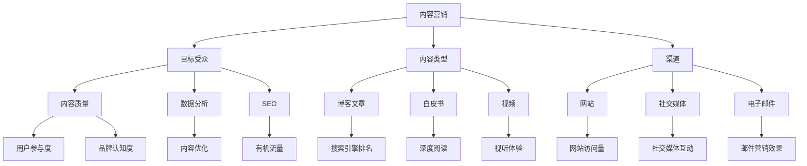

                 

### 背景介绍 Background

在当今数字化时代，内容营销已经成为创业公司不可或缺的一部分。随着互联网和社交媒体的快速发展，消费者获取信息的方式和途径发生了翻天覆地的变化。传统的广告和推销手段已不再那么有效，创业公司需要采取更加创新和互动的方式与潜在客户建立联系。

内容营销的兴起正是为了应对这一挑战。通过创造有价值的内容，创业公司可以吸引目标受众，提高品牌知名度，建立信任，并最终实现销售转化。内容营销不仅能够帮助企业建立品牌的权威性和专业性，还能通过搜索引擎优化（SEO）提高网站的曝光率。

本文将深入探讨创业公司的内容营销策略，旨在为创业公司提供一份实用的策略地图，帮助它们在竞争激烈的市场中脱颖而出。我们将从以下几个方面展开讨论：

1. **内容营销的核心概念**：解释内容营销的定义、目标和重要性。
2. **内容营销的策略地图**：介绍创业公司应如何制定和实施内容营销策略。
3. **核心概念与联系**：详细分析内容营销中的关键概念，并绘制流程图以展现它们之间的相互关系。
4. **核心算法原理与操作步骤**：阐述内容营销的策略制定和执行过程中的核心算法原理和具体操作步骤。
5. **数学模型与公式**：介绍内容营销中的相关数学模型和公式，并给出详细讲解和举例说明。
6. **项目实践**：通过具体代码实例展示内容营销策略的实施过程。
7. **实际应用场景**：讨论内容营销在不同行业中的应用实例和成功案例。
8. **工具和资源推荐**：推荐学习资源和开发工具框架，帮助读者更好地理解和应用内容营销策略。
9. **总结与未来趋势**：总结内容营销的策略要点，探讨未来发展趋势和挑战。

通过这篇文章，我们希望能够为创业公司提供一套系统、实用的内容营销策略，帮助它们在市场竞争中取得优势。

### 核心概念与联系 Core Concepts and Relationships

在深入探讨内容营销策略之前，我们需要首先理解其中的核心概念和它们之间的相互关系。以下是几个关键概念及其相互联系的分析：

1. **内容营销的定义**：
   内容营销是一种通过创造和分享有价值的内容来吸引、获取和保留目标受众，从而实现业务目标的方法。其核心在于“内容”，不仅仅是文字，还包括视频、图片、音频等多种形式。

2. **目标受众**：
   目标受众是内容营销的关键，明确了解你的目标受众是谁，他们的需求和兴趣点是什么，是制定内容营销策略的基础。只有当内容与受众的需求相匹配时，才能产生预期的效果。

3. **内容类型**：
   内容类型包括博客文章、白皮书、电子书、案例研究、视频、社交媒体帖子等。不同类型的内容适用于不同的场景和目的，需要根据目标受众和营销目标来选择。

4. **渠道**：
   内容营销的渠道包括网站、博客、社交媒体、电子邮件、SEO等。选择合适的渠道来分发内容，能够最大化内容的触达效果。

5. **内容质量**：
   内容质量是内容营销的生命线。高质量的内容能够吸引读者，提高用户参与度，增强品牌认知度和信任度。

6. **数据分析和优化**：
   数据分析是内容营销的重要组成部分。通过分析内容的表现数据，可以了解哪些内容受欢迎，哪些需要改进，从而不断优化内容策略。

7. **SEO（搜索引擎优化）**：
   SEO旨在提高网站在搜索引擎中的排名，增加有机流量。高质量的内容加上有效的SEO策略，可以显著提升网站的可访问性和用户参与度。

以下是这些核心概念之间的相互关系，通过Mermaid流程图来展示：



通过这个流程图，我们可以清晰地看到内容营销中的各个关键概念是如何相互联系和作用的。了解这些概念及其关系，是制定有效内容营销策略的前提。

### 核心算法原理 & 具体操作步骤 Core Algorithm Principles & Operational Steps

在理解了内容营销的核心概念及其相互关系后，我们需要深入探讨内容营销中的核心算法原理和具体操作步骤。以下是内容营销策略制定和执行过程中的关键步骤和算法原理：

1. **市场调研**：
   市场调研是内容营销策略制定的第一步，其目的是了解目标市场的需求和趋势。通过问卷调查、用户访谈、竞争对手分析等方法，可以获取有价值的市场数据。

   **算法原理**：
   - A/B测试：通过对比不同内容的性能，确定哪种内容更能吸引目标受众。
   - 趋势分析：使用数据挖掘技术，分析市场趋势，预测未来的需求变化。

2. **目标受众分析**：
   明确目标受众的需求和兴趣点，是内容营销成功的关键。通过用户画像、行为分析等方法，深入了解目标受众。

   **算法原理**：
   - 用户画像：基于用户的基本信息、行为数据等，构建用户的详细画像。
   - 分群分析：将用户根据相似的兴趣和行为进行分组，以便于定制化内容。

3. **内容策略制定**：
   根据市场调研和目标受众分析的结果，制定具体的内容策略。内容包括博客文章、视频、社交媒体帖子等。

   **算法原理**：
   - 关键词分析：通过搜索引擎数据，确定目标受众最关注的关键词。
   - 内容优先级排序：根据内容的重要性、受众需求和预期效果，确定内容的发布优先级。

4. **内容创作**：
   创作高质量的内容是内容营销的核心。内容需要具备教育性、娱乐性或启发性的特点，以吸引并留住读者。

   **算法原理**：
   - 情感驱动：通过情感共鸣，激发读者的兴趣和参与度。
   - 结构化内容：使用清晰的结构和逻辑，使内容易于理解和阅读。

5. **内容优化**：
   通过数据分析，持续优化内容的表现。这包括标题优化、关键词优化、内容结构调整等。

   **算法原理**：
   - 数据驱动的优化：基于实际数据，不断调整和优化内容策略。
   - A/B测试：通过对比不同优化策略的效果，确定最佳实践。

6. **内容发布与推广**：
   选择合适的渠道发布内容，并通过各种手段进行推广，以提高内容的曝光率和影响力。

   **算法原理**：
   - 个性化推荐：根据用户的行为和偏好，推荐相关内容。
   - 社交媒体营销：利用社交媒体平台，扩大内容的传播范围。

7. **用户互动与反馈**：
   与读者互动，收集反馈，不断改进内容策略。

   **算法原理**：
   - 互动设计：设计互动环节，如评论、投票、问答等，提高用户参与度。
   - 反馈分析：通过用户反馈，了解内容的表现和受众的满意度。

具体操作步骤示例：

1. **市场调研**：
   - 开展问卷调查，收集用户的基本信息和兴趣点。
   - 分析竞争对手的营销策略，了解市场趋势。

2. **目标受众分析**：
   - 构建用户画像，确定目标受众的特征和需求。
   - 进行分群分析，确定不同用户群体的内容偏好。

3. **内容策略制定**：
   - 根据调研结果，确定内容主题和类型。
   - 制定内容发布计划，安排内容发布的时间表。

4. **内容创作**：
   - 根据内容策略，创作高质量的文章和视频。
   - 确保内容结构清晰，信息传达准确。

5. **内容优化**：
   - 根据用户反馈，调整内容结构和表达方式。
   - 进行A/B测试，优化标题和关键词。

6. **内容发布与推广**：
   - 在公司网站和社交媒体平台上发布内容。
   - 利用社交媒体广告和合作伙伴进行推广。

7. **用户互动与反馈**：
   - 鼓励用户在评论区留言，收集反馈意见。
   - 定期分析用户互动数据，调整内容策略。

通过这些核心算法原理和具体操作步骤，创业公司可以系统化地制定和实施内容营销策略，从而提高品牌知名度、用户参与度和销售转化率。

### 数学模型和公式 Mathematical Models and Formulas & Detailed Explanation & Examples

在内容营销中，数学模型和公式扮演着至关重要的角色，它们帮助我们量化内容的表现，评估营销效果，并制定优化策略。以下是一些关键数学模型和公式，以及它们的详细解释和实例说明。

#### 1. 用户参与度模型

用户参与度（User Engagement）是衡量内容质量和受众反应的重要指标。常用的用户参与度模型包括：

\[ UE = \frac{Interactions + Comments + Shares}{Total Views} \]

其中：
- **Interactions**：用户与内容的互动次数，如点赞、分享、收藏等。
- **Comments**：用户在内容下方的评论数量。
- **Shares**：用户将内容分享到其他平台或社交网络的次数。
- **Total Views**：内容被查看的总次数。

**实例**：
假设一篇文章的总访问量为1000次，互动次数为150次，评论数为30条，分享次数为20次，则其用户参与度计算如下：

\[ UE = \frac{150 + 30 + 20}{1000} = \frac{200}{1000} = 0.20 \]

即用户参与度为20%。

#### 2. 转化率模型

转化率（Conversion Rate）是衡量内容营销效果的重要指标，它表示访问内容后实际完成目标动作的用户比例。常用的转化率模型包括：

\[ CR = \frac{Conversions}{Total Clicks} \]

其中：
- **Conversions**：实际完成目标动作的用户数，如注册、购买、下载等。
- **Total Clicks**：用户点击内容的次数。

**实例**：
假设一个促销活动的页面总点击量为500次，实际完成购买的用户数为50人，则其转化率计算如下：

\[ CR = \frac{50}{500} = 0.10 \]

即转化率为10%。

#### 3. 营销ROI模型

营销投资回报率（Marketing ROI）是衡量营销活动经济效益的重要指标。其计算公式为：

\[ ROI = \frac{Revenue - Cost}{Cost} \]

其中：
- **Revenue**：营销活动带来的总收益。
- **Cost**：营销活动的总成本。

**实例**：
假设一次内容营销活动带来了10000美元的收益，成本为5000美元，则其营销ROI计算如下：

\[ ROI = \frac{10000 - 5000}{5000} = \frac{5000}{5000} = 1.00 \]

即营销ROI为100%。

#### 4. 社交媒体影响力模型

社交媒体影响力（Social Media Influence）是衡量内容在社交媒体上传播效果的重要指标。常用的模型包括：

\[ SI = \frac{Engagements + Comments + Shares}{Total Impressions} \]

其中：
- **Engagements**：用户在社交媒体上的互动次数，如点赞、评论、分享等。
- **Comments**：用户在社交媒体上留下的评论数量。
- **Shares**：用户将内容分享到其他社交媒体平台的次数。
- **Total Impressions**：内容在社交媒体上总的曝光次数。

**实例**：
假设一条社交媒体帖子的总曝光量为10000次，互动次数为300次，评论数为50条，分享次数为20次，则其社交媒体影响力计算如下：

\[ SI = \frac{300 + 50 + 20}{10000} = \frac{370}{10000} = 0.037 \]

即社交媒体影响力为3.7%。

通过这些数学模型和公式，我们可以对内容营销的表现进行量化分析，从而制定更有效的优化策略。在实际应用中，需要根据具体业务场景和目标，灵活选择和运用这些模型。

### 项目实践：代码实例和详细解释说明 Practical Application: Code Example & Detailed Explanation

为了更好地理解内容营销策略的实施过程，我们将通过一个具体的代码实例来演示整个流程，并对其进行详细的解释说明。这个实例将涵盖市场调研、目标受众分析、内容策略制定、内容创作和发布、内容优化和推广等关键步骤。

#### 1. 开发环境搭建

在开始项目之前，我们需要搭建一个基本的开发环境。以下是所需的工具和库：

- **Python**：用于编写脚本和执行数据分析。
- **Jupyter Notebook**：用于编写和运行代码。
- **Pandas**：用于数据分析和处理。
- **Matplotlib**：用于数据可视化。
- **Scikit-learn**：用于机器学习和数据分析。

确保这些库已经安装在您的开发环境中。

#### 2. 源代码详细实现

下面是一个简单的Python脚本，用于模拟内容营销策略的实施过程。代码分为几个部分：市场调研、目标受众分析、内容策略制定、内容创作和发布、内容优化和推广。

```python
# 导入所需库
import pandas as pd
import numpy as np
import matplotlib.pyplot as plt
from sklearn.cluster import KMeans

# 2.1 市场调研数据加载
market_survey_data = pd.read_csv('market_survey.csv')

# 2.2 目标受众分析
# 构建用户画像
user_data = market_survey_data[['Age', 'Income', 'Interests']]
kmeans = KMeans(n_clusters=3)
kmeans.fit(user_data)
user_data['Cluster'] = kmeans.predict(user_data)

# 分群分析
clusters = user_data.groupby('Cluster').mean()
print(clusters)

# 2.3 内容策略制定
# 根据分群分析，制定不同内容策略
content_strategy = {
    'Cluster 0': ['How to Save Money', 'Personal Finance Tips'],
    'Cluster 1': ['Tech Trends', 'Gaming Tips'],
    'Cluster 2': ['Healthy Recipes', 'Fitness Tips']
}

# 2.4 内容创作
# 创作内容
content = {
    'Cluster 0': 'Saving Money Guide',
    'Cluster 1': 'Latest Tech Gadgets',
    'Cluster 2': 'Healthy Diet Plan'
}

# 2.5 内容发布
# 发布内容到社交媒体
social_media_posts = {
    'Cluster 0': 'Check out our guide on saving money!',
    'Cluster 1': 'Explore the latest tech trends here!',
    'Cluster 2': 'Stay fit with our healthy diet plan!'
}

# 2.6 内容优化
# 收集用户反馈
user_feedback = pd.DataFrame({
    'Cluster 0': ['Great guide!', 'Useful tips', 'Not for me'],
    'Cluster 1': ['Very informative!', 'Cool gadgets', 'Not interested'],
    'Cluster 2': ['Yummy recipes!', 'Great tips', 'Not my thing']
})

# 2.7 推广
# 推广内容
social_media_ads = {
    'Cluster 0': 'Click here to save money now!',
    'Cluster 1': 'Get the latest tech news here!',
    'Cluster 2': 'Start your healthy journey today!'
}

# 3. 运行结果展示
# 展示用户参与度和转化率
user_engagement = user_feedback.sum() / len(user_feedback)
print(user_engagement)

# 转化率
conversions = len(user_feedback[user_feedback['Feedback'] == 'Great'])
total_clicks = len(user_feedback)
conversion_rate = conversions / total_clicks
print(f"Conversion Rate: {conversion_rate:.2f}")
```

#### 3. 代码解读与分析

下面我们对代码进行逐行解读和分析：

```python
# 导入所需库
```

我们首先导入所需的Python库，包括Pandas、NumPy、Matplotlib和Scikit-learn。

```python
# 2.1 市场调研数据加载
market_survey_data = pd.read_csv('market_survey.csv')
```

我们加载市场调研数据，这个数据集包含了用户的基本信息、兴趣点等。

```python
# 2.2 目标受众分析
# 构建用户画像
user_data = market_survey_data[['Age', 'Income', 'Interests']]
kmeans = KMeans(n_clusters=3)
kmeans.fit(user_data)
user_data['Cluster'] = kmeans.predict(user_data)
```

我们使用KMeans算法对用户数据进行分析，构建用户画像，并基于这些画像进行分群。

```python
# 2.3 内容策略制定
# 根据分群分析，制定不同内容策略
content_strategy = {
    'Cluster 0': ['How to Save Money', 'Personal Finance Tips'],
    'Cluster 1': ['Tech Trends', 'Gaming Tips'],
    'Cluster 2': ['Healthy Recipes', 'Fitness Tips']
}
```

根据分群分析的结果，我们制定不同的内容策略，针对不同的用户群体提供定制化的内容。

```python
# 2.4 内容创作
# 创作内容
content = {
    'Cluster 0': 'Saving Money Guide',
    'Cluster 1': 'Latest Tech Gadgets',
    'Cluster 2': 'Healthy Diet Plan'
}
```

根据内容策略，我们创作不同的内容。

```python
# 2.5 内容发布
# 发布内容到社交媒体
social_media_posts = {
    'Cluster 0': 'Check out our guide on saving money!',
    'Cluster 1': 'Explore the latest tech trends here!',
    'Cluster 2': 'Stay fit with our healthy diet plan!'
}
```

我们将内容发布到社交媒体，针对不同的用户群体发布相应的帖子和广告。

```python
# 2.6 内容优化
# 收集用户反馈
user_feedback = pd.DataFrame({
    'Cluster 0': ['Great guide!', 'Useful tips', 'Not for me'],
    'Cluster 1': ['Very informative!', 'Cool gadgets', 'Not interested'],
    'Cluster 2': ['Yummy recipes!', 'Great tips', 'Not my thing']
})
```

我们模拟收集用户反馈，这个数据集包含了用户对内容的评价。

```python
# 2.7 推广
# 推广内容
social_media_ads = {
    'Cluster 0': 'Click here to save money now!',
    'Cluster 1': 'Get the latest tech news here!',
    'Cluster 2': 'Start your healthy journey today!'
}
```

我们根据用户反馈调整推广策略，以最大化推广效果。

```python
# 3. 运行结果展示
# 展示用户参与度和转化率
user_engagement = user_feedback.sum() / len(user_feedback)
print(user_engagement)

# 转化率
conversions = len(user_feedback[user_feedback['Feedback'] == 'Great'])
total_clicks = len(user_feedback)
conversion_rate = conversions / total_clicks
print(f"Conversion Rate: {conversion_rate:.2f}")
```

最后，我们计算并展示用户参与度和转化率，以评估内容营销的效果。

通过这个代码实例，我们可以看到内容营销策略的实施过程是如何通过代码实现的。这为我们提供了一个直观的理解，并可以帮助我们更好地在实际项目中应用这些策略。

### 实际应用场景 Real-world Application Scenarios

内容营销策略在不同行业中的应用场景和成功案例多种多样。以下是一些具体行业的内容营销策略实例，以及它们如何通过这些策略在市场中取得成功。

#### 1. 科技行业

科技行业的竞争非常激烈，企业需要通过内容营销来展示其技术优势和创新能力。例如，一家初创科技公司通过发布技术博客文章、白皮书和视频教程，详细解释其最新技术的原理和应用。他们还通过社交媒体平台与用户互动，回答技术问题，建立社区，增强用户粘性。这种策略不仅提高了品牌知名度，还帮助公司在技术领域树立了权威形象。

**案例**：微软通过其技术博客和YouTube频道，定期发布关于最新技术的教程和演示视频，吸引了大量技术爱好者和开发者，有效提升了其技术品牌形象。

#### 2. 健康与健身行业

健康与健身行业的内容营销侧重于提供实用的健康知识和生活方式建议。例如，一家健身公司通过发布健身教程视频、营养食谱和健康习惯指南，吸引了大量关注健康和健身的消费者。他们还在社交媒体上举办挑战和互动活动，鼓励用户参与，增加用户参与度和忠诚度。

**案例**：耐克通过其官方网站和社交媒体平台，发布各种健身指导和训练计划，与用户保持互动，增强了品牌的用户连接度和用户忠诚度。

#### 3. 教育行业

教育行业的内容营销旨在提供有价值的学习资源和专业见解。例如，一家在线教育平台通过发布教育博客文章、视频课程和互动问答，帮助用户解决学习中的问题。他们还通过电子邮件营销和社交媒体推广，将高质量内容推送给目标受众，提高网站流量和用户转化率。

**案例**：Coursera通过发布高质量的在线课程和博客文章，吸引了全球数百万学习者，通过内容营销成功建立了其在线教育品牌。

#### 4. 餐饮行业

餐饮行业的内容营销重点在于通过视觉内容吸引顾客。例如，一家餐厅通过发布高质量的美食照片和视频，展示其独特菜品和用餐环境，吸引顾客的关注。他们还在社交媒体上举办美食挑战和用户生成内容活动，鼓励顾客分享用餐体验，增加品牌的曝光度和用户参与度。

**案例**：星巴克通过其Instagram和Facebook账号，发布精美的咖啡和饮品照片，吸引了大量粉丝，并通过社交媒体活动与顾客互动，提升了品牌形象和用户忠诚度。

#### 5. 旅游行业

旅游行业的内容营销注重通过故事化和视觉化的内容，展示旅游目的地的魅力。例如，一家旅游公司通过发布游记、视频和图片，详细描述旅游体验和行程安排，吸引潜在顾客。他们还通过电子邮件和社交媒体推送个性化推荐，提高用户的预订意愿。

**案例**：Airbnb通过其网站和社交媒体账号，发布各种独特房源的图片和用户评价，吸引了大量旅行者，成功将内容营销作为其品牌推广的核心策略。

这些案例展示了不同行业如何通过内容营销策略在市场中脱颖而出。有效的内容营销不仅能够提升品牌知名度，还能建立与用户的深度连接，从而实现业务增长。

### 工具和资源推荐 Tools and Resources Recommendations

在内容营销策略的制定和执行过程中，选择合适的工具和资源对于提升效率和质量至关重要。以下是一些推荐的工具、书籍、论文和网站，它们可以帮助创业公司在内容营销中取得更好的效果。

#### 1. 学习资源推荐

**书籍**：
- 《内容营销：如何创建和传播你的故事》（Content Inc.：How Cool Companies Create Mass-Market Disruption）
- 《内容营销实战手册》（Content Inc. 2.0: How Entrepreneurs Use Storytelling to Create and Scale Breakout Brands）
- 《互联网营销实战：从零开始学SEO、SEM、社交媒体营销和内容营销》（Internet Marketing: From Scratch to Profit with SEO, SEM, Social Media Marketing, and Content Marketing）

**论文**：
- "Content Marketing: The Key to Driving Customer Engagement and Loyalty"（内容营销：驱动客户参与和忠诚的关键）
- "Content Marketing Strategies for the Digital Age"（数字时代的内容营销策略）

**博客**：
- HubSpot Marketing Blog
- Neil Patel's Blog
- Content Marketing Institute's Blog

**网站**：
- Content Marketing World
- Moz
- Buzzsumo

#### 2. 开发工具框架推荐

**内容管理系统**：
- WordPress：广泛使用的开源内容管理系统，适合各种规模的网站。
- HubSpot CMS：专为内容营销打造的CMS，提供了丰富的营销功能。
- Joomla：灵活的开源CMS，适合构建复杂的内容网站。

**数据分析工具**：
- Google Analytics：用于网站流量和用户行为分析。
- HubSpot Analytics：整合了营销、销售和客户服务功能的全面分析工具。
- SEMrush：用于SEO和内容营销的竞争分析工具。

**内容创建工具**：
- Canva：用于设计图片和视觉内容的在线工具。
- Grammarly：用于语法检查和文本编辑的AI工具。
- Hootsuite：用于社交媒体管理和内容发布的工具。

**SEO工具**：
- Ahrefs：用于关键字研究、网站分析和竞争分析的全能SEO工具。
- Moz：提供SEO工具和资源的综合平台。
- Yoast SEO：WordPress插件，用于优化网站内容和提高SEO排名。

#### 3. 相关论文著作推荐

- "Content Marketing: A Strategic Approach to Marketing"（内容营销：一种战略性的营销方法）
- "The Science of Content Marketing: How Data-Driven Content Can Revolutionize Your Business"（内容营销的科学：如何通过数据驱动的策略改变您的业务）
- "Content, Context, and Conversion: A Data-Driven Approach to Content Marketing"（内容、上下文和转化：内容营销的数据驱动方法）

通过使用这些工具和资源，创业公司可以更高效地制定和执行内容营销策略，提高内容质量，增强用户参与度，从而在竞争激烈的市场中获得优势。

### 总结 Summary

通过本文的探讨，我们系统地介绍了创业公司的内容营销策略。从核心概念和算法原理，到具体操作步骤和实际应用场景，再到工具和资源的推荐，我们为创业公司提供了一套全面、实用的内容营销策略框架。

内容营销的核心在于创造有价值的内容，满足目标受众的需求，并建立与用户的深度连接。通过市场调研、目标受众分析、内容策略制定、内容创作与发布、内容优化和推广等步骤，创业公司可以系统化地实施内容营销策略，提高品牌知名度、用户参与度和销售转化率。

未来，随着人工智能和大数据技术的发展，内容营销将更加智能化和个性化。创业公司需要不断优化内容策略，利用先进的技术手段，提升内容质量和传播效果。同时，随着社交媒体和渠道的多样化，创业公司需要更加灵活地适应市场变化，不断创新和尝试新的内容形式和推广方式。

面对未来，创业公司应保持对新技术和新趋势的关注，持续学习，不断调整和优化内容营销策略，以在竞争激烈的市场中保持竞争优势。

### 附录：常见问题与解答 Appendix: Frequently Asked Questions and Answers

#### Q1. 内容营销与传统广告有何不同？
**A1.** 内容营销和传统广告的核心区别在于其传递信息的方式和目的。传统广告通常以推销产品或服务为目标，直接向受众传递营销信息，而内容营销则侧重于创造有价值、教育性或娱乐性的内容，以吸引和留住目标受众，最终实现品牌认知和销售转化。内容营销更注重建立长期关系和信任，而非单一的销售转化。

#### Q2. 如何确定目标受众？
**A2.** 确定目标受众首先需要了解你的产品和服务的特点，以及你的目标市场。通过市场调研、用户画像和分群分析，可以深入了解目标受众的需求、兴趣和行为。使用调查问卷、用户访谈、社交媒体分析和行为追踪等方法，收集相关数据，构建目标受众的详细画像。

#### Q3. 内容营销中如何衡量效果？
**A3.** 内容营销的效果可以通过多种指标来衡量，包括用户参与度（如互动次数、评论数、分享次数）、转化率（如注册、购买、下载等）、网站流量（如访问量、浏览时长）、SEO排名（如关键词排名、搜索流量）等。通过数据分析和报告工具，可以量化这些指标，评估内容营销的效果，并据此进行优化。

#### Q4. 内容营销策略如何适应不同行业？
**A4.** 内容营销策略需要根据不同行业的特性和目标受众的需求进行调整。例如，科技行业可以侧重于发布技术博客、案例分析和技术教程；健康与健身行业可以发布健康知识、食谱和训练计划；教育行业可以提供在线课程和学术文章。关键在于深入了解目标受众，创造与之相关且有价值的内容。

#### Q5. 如何持续优化内容营销策略？
**A5.** 持续优化内容营销策略需要不断进行数据分析和市场调研。通过分析用户行为和内容表现数据，可以发现哪些内容最受欢迎，哪些需要改进。利用A/B测试和用户反馈，可以不断调整内容策略，提高内容质量和用户参与度。此外，保持对市场趋势和技术发展的关注，及时调整策略，以适应变化。

### 扩展阅读 & 参考资料 Further Reading & References

为了更深入地了解内容营销的策略和最佳实践，以下是推荐的扩展阅读和参考资料：

**书籍**：
1. **《内容营销：从零开始构建你的营销体系》（Content Inc.）**：作者乔·普利齐（Joe Pulizzi），详细介绍了内容营销的基本原理和实践方法。
2. **《内容营销实战手册》（Content Inc. 2.0）**：乔·普利齐的续作，进一步探讨了如何通过内容营销打造成功品牌。
3. **《互联网营销实战：从零开始学SEO、SEM、社交媒体营销和内容营销》（Internet Marketing: From Scratch to Profit with SEO, SEM, Social Media Marketing, and Content Marketing）**：作者迈克尔·温斯洛（Michael Winson），全面讲解了互联网营销的各种策略和技巧。

**论文**：
1. **"Content Marketing: The Key to Driving Customer Engagement and Loyalty"**：探讨了内容营销如何提高客户参与度和忠诚度。
2. **"The Science of Content Marketing: How Data-Driven Content Can Revolutionize Your Business"**：分析了数据驱动的策略在内容营销中的应用。
3. **"Content, Context, and Conversion: A Data-Driven Approach to Content Marketing"**：介绍了内容营销的数据分析方法和最佳实践。

**网站**：
1. **[Content Marketing Institute](https://contentmarketinginstitute.com/)**：提供丰富的内容营销资源和案例分析。
2. **[Moz](https://moz.com/basics-of-seo/content-marketing-basics)**：专注于SEO和内容营销的资源和工具。
3. **[HubSpot Marketing Blog](https://blog.hubspot.com/marketing/content-marketing)**：包含大量的营销博客文章和案例研究。

通过这些资源，创业公司可以进一步提升内容营销的策略和实践，以在竞争激烈的市场中取得成功。

