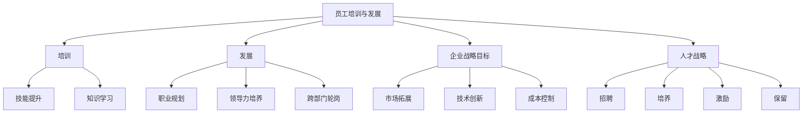
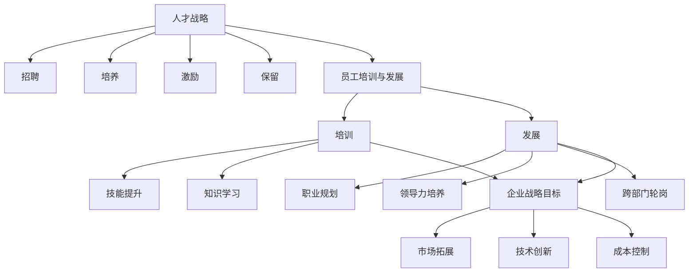

                 

### 1. 背景介绍

在当今的商业环境中，创业公司正以惊人的速度崛起，成为推动经济增长和技术进步的重要力量。然而，随着市场的竞争日益激烈，创业公司在生存和发展过程中面临着诸多挑战。其中，如何有效地培训和发展员工，实现人才的可持续发展，已经成为影响公司成败的关键因素。

员工培训与发展不仅关乎公司的短期运营效益，更是公司长期竞争力的核心。在快速变化的市场环境中，员工的能力和技能水平直接决定了公司能否快速响应市场变化、保持创新能力，并最终实现业务目标。因此，如何系统地规划和实施员工培训与发展策略，成为创业公司亟需解决的问题。

本文旨在探讨创业公司的员工培训与发展问题，通过分析现有理论与实践经验，提供一套完整的解决方案。文章将首先介绍员工培训与发展的核心概念，然后深入探讨其与公司战略目标之间的联系，接着详细阐述核心算法原理与操作步骤，最后通过实际项目实践、应用场景分析、工具推荐等内容，为创业公司提供全面的员工培训与发展指导。

通过对这些问题的系统分析和探讨，本文希望能够为创业公司提供实用的思路和方法，帮助他们建立高效的员工培训与发展体系，实现人才的可持续发展，从而在激烈的市场竞争中立于不败之地。

### 2. 核心概念与联系

在深入探讨创业公司的员工培训与发展之前，我们需要明确一些核心概念，并了解这些概念之间的重要联系。以下是几个关键概念及其相互关系：

#### 员工培训与发展

员工培训与发展是指通过一系列计划和活动，帮助员工提升技能、增强能力，并促进其职业发展。这不仅包括对现有技能的补充和提升，还包括对新技能的学习和应用。

- **培训**：通常指对特定技能或知识的学习，如编程、项目管理等。
- **发展**：侧重于员工的长期职业规划，包括领导力培养、跨部门轮岗等。

#### 企业战略目标

企业战略目标是指企业在未来一段时间内希望实现的目标和愿景，通常涉及市场拓展、技术创新、成本控制等多个方面。

- **市场拓展**：通过扩大市场份额来实现业务增长。
- **技术创新**：通过研发新技术或产品来保持竞争优势。
- **成本控制**：通过优化运营流程来降低成本。

#### 人才战略

人才战略是企业为了实现其战略目标而制定的一系列人才管理和发展的策略。这包括招聘、培养、激励和保留人才。

- **招聘**：通过筛选和录用合适的人才来满足企业需求。
- **培养**：通过培训和发展活动来提升员工能力。
- **激励**：通过奖励和福利来激励员工，提高其工作积极性。
- **保留**：通过建立良好的企业文化和工作环境来留住优秀人才。

#### 核心概念架构图

下面是这些核心概念之间的 Mermaid 流程图，以帮助理解它们之间的相互关系：



#### 关系解析

- **员工培训与发展与企业战略目标的关系**：员工培训与发展是实现企业战略目标的重要保障。只有通过不断培训和发展员工，企业才能确保其在市场拓展、技术创新和成本控制等方面的竞争力。

- **人才战略与员工培训与发展的关系**：人才战略是制定和实施员工培训与发展的基础。通过有效的人才战略，企业可以确保培训与发展计划与公司战略目标相一致，从而实现资源的最大化利用。

- **培训与发展与企业发展阶段的关系**：在不同的企业发展阶段，员工培训与发展的重点也会有所不同。在初创期，企业可能更注重基础技能的培训；而在成熟期，则可能更关注领导力和创新能力的培养。

综上所述，员工培训与发展、企业战略目标和人才战略三者之间存在着紧密的联系。理解这些关系对于创业公司制定有效的员工培训与发展策略至关重要。

#### Mermaid 流程图

为了更直观地展示这些核心概念之间的联系，下面是一个使用 Mermaid 语言的流程图示例：



通过这个流程图，我们可以清晰地看到各个概念之间的逻辑关系，为进一步分析和讨论提供了基础。

### 3. 核心算法原理 & 具体操作步骤

在明确了员工培训与发展的核心概念及其相互关系后，我们需要探讨实现这一目标的具体方法，即核心算法原理。核心算法原理不仅包括理论框架，还包括一系列具体的操作步骤，以确保培训与发展计划的有效实施。

#### 算法原理概述

员工培训与发展的核心算法原理可以概括为“三层模型”：基础层、能力层和战略层。

- **基础层**：这是培训与发展的起点，主要涵盖基础技能和知识的传授，如编程技能、沟通技巧等。
- **能力层**：在基础层的基础上，进一步培养员工的综合能力，包括解决问题的能力、团队协作能力等。
- **战略层**：这是培训与发展的最终目标，侧重于培养员工的战略思维和领导力，以适应企业长远发展的需要。

#### 操作步骤

为了确保员工培训与发展的有效性，我们需要按照以下具体操作步骤进行：

##### 步骤 1：需求分析

- **内容**：首先，企业需要对当前员工的技能水平和职业发展需求进行详细分析，以确定培训的重点和目标。
- **方法**：可以通过问卷调查、面试、员工反馈等方式收集数据，形成需求分析报告。

##### 步骤 2：制定培训计划

- **内容**：基于需求分析的结果，制定详细的培训计划，包括培训内容、培训形式、培训时间等。
- **方法**：可以采用项目化培训、个性化培训、集中培训等多种形式，以满足不同员工的需求。

##### 步骤 3：实施培训计划

- **内容**：按照培训计划，开展实际培训活动，确保培训内容的落实。
- **方法**：可以邀请外部专家进行讲座、组织内部培训课程、开展实战演练等。

##### 步骤 4：评估培训效果

- **内容**：在培训结束后，对培训效果进行评估，以检验培训目标的实现情况。
- **方法**：可以通过考试、测试、员工反馈、上级评价等多种方式，全面了解培训效果。

##### 步骤 5：持续优化与改进

- **内容**：根据培训效果的评估结果，对培训计划进行持续优化和改进，确保培训与发展计划的持续有效性。
- **方法**：可以定期进行培训需求分析，调整培训内容和方法，以适应企业发展的新需求。

#### 实际案例

假设某创业公司计划对员工进行编程技能培训，以下是一个具体的操作步骤示例：

##### 步骤 1：需求分析

- **调查员工当前编程技能水平**：通过问卷调查和面试了解员工的编程技能状况，发现大部分员工在基础编程技能方面较为熟悉，但在高级编程技巧和框架应用方面有所欠缺。

##### 步骤 2：制定培训计划

- **培训内容**：决定开展高级编程技巧和框架应用的培训，包括Java框架Spring Boot、微服务架构等。
- **培训形式**：采用集中培训与自学相结合的形式，集中培训为期两周，自学时间为一个月。

##### 步骤 3：实施培训计划

- **集中培训**：邀请外部专家进行讲解，每周安排两次培训课程，每次课程三个小时。
- **自学**：提供相关教材和在线课程资源，要求员工在自学时间内完成课程学习，并完成相应的练习。

##### 步骤 4：评估培训效果

- **考试**：培训结束后，组织一次编程技能考试，考察员工对所学知识的掌握情况。
- **反馈**：收集员工对培训课程的反馈意见，了解培训的优缺点。

##### 步骤 5：持续优化与改进

- **分析反馈**：根据考试结果和员工反馈，发现部分员工在微服务架构方面理解不深，决定在下一轮培训中增加微服务架构的实操环节。
- **调整计划**：优化培训内容，增加实战演练时间，提高培训的实用性和针对性。

通过以上步骤，该公司能够有效地提升员工的编程技能，从而提高整体开发效率，为企业的技术创新和业务发展提供有力支持。

#### 总结

员工培训与发展的核心算法原理不仅包括理论框架，还需要一系列具体的操作步骤来保证其实施效果。通过需求分析、培训计划制定、培训实施、评估和持续优化，企业可以构建一个系统化、可持续的员工培训与发展体系，从而实现人才的可持续发展。

### 4. 数学模型和公式 & 详细讲解 & 举例说明

在探讨员工培训与发展的过程中，数学模型和公式为我们提供了量化和评估培训效果的有力工具。以下我们将介绍几种常用的数学模型和公式，并详细讲解其应用方法及举例说明。

#### 4.1 人才发展率（Talent Development Rate，TDR）

人才发展率是指在一定时间内，员工技能和能力提升的速度。它通过以下公式计算：

\[ TDR = \frac{\text{培训后技能得分} - \text{培训前技能得分}}{\text{培训前技能得分}} \]

- **应用方法**：企业可以定期对员工进行技能测评，记录培训前后的得分变化，通过计算TDR来评估培训效果。

- **举例说明**：

假设公司对50名员工进行了编程技能培训，培训前平均技能得分为75分，培训后平均技能得分为90分。计算TDR：

\[ TDR = \frac{90 - 75}{75} = 0.2 \]

即员工技能水平提升了20%。

#### 4.2 学习曲线（Learning Curve）

学习曲线描述了随着时间和练习次数的增加，员工技能提升的速度变化。它通常呈指数递减趋势，可以用以下公式表示：

\[ Y = a \cdot e^{-bx} \]

其中，\( Y \) 为技能水平，\( a \) 和 \( b \) 为常数，代表初始技能水平和学习速度。

- **应用方法**：企业可以跟踪员工在不同阶段的技能提升情况，通过拟合学习曲线来预测未来技能水平。

- **举例说明**：

假设某员工的初始编程技能得分为50分，学习曲线的拟合公式为 \( Y = 50 \cdot e^{-0.1x} \)。在培训过程中，记录每个时间点的技能得分，通过学习曲线公式预测未来技能水平。

#### 4.3 人才保留率（Talent Retention Rate，TRR）

人才保留率是指企业在一定时间内保留人才的比率。它通过以下公式计算：

\[ TRR = \frac{\text{期末保留员工人数}}{\text{期初员工人数}} \]

- **应用方法**：企业可以定期统计员工流动情况，通过计算TRR来评估人才保留效果。

- **举例说明**：

假设公司期初员工人数为100人，期末保留员工人数为85人。计算TRR：

\[ TRR = \frac{85}{100} = 0.85 \]

即企业人才保留率为85%。

#### 4.4 成本效益分析（Cost-Benefit Analysis，CBA）

成本效益分析用于评估培训项目的经济效益。它通过以下公式计算：

\[ \text{CBA} = \frac{\text{培训收益}}{\text{培训成本}} \]

- **应用方法**：企业需要计算培训带来的直接和间接收益，与培训成本进行比较。

- **举例说明**：

假设公司花费10万元进行员工培训，培训后，员工工作效率提高了20%，预计年收益增加50万元。计算CBA：

\[ \text{CBA} = \frac{500,000}{100,000} = 5 \]

即培训收益是成本的5倍。

#### 4.5 成本收益比（Cost-Revenue Ratio，CRR）

成本收益比用于衡量培训项目的盈利能力。它通过以下公式计算：

\[ \text{CRR} = \frac{\text{培训成本}}{\text{培训收益}} \]

- **应用方法**：企业可以通过计算CRR来评估培训项目的经济合理性。

- **举例说明**：

假设公司花费10万元进行员工培训，培训后，员工工作效率提高了20%，预计年收益增加20万元。计算CRR：

\[ \text{CRR} = \frac{100,000}{200,000} = 0.5 \]

即培训成本是收益的一半。

#### 总结

通过以上数学模型和公式的介绍，我们可以更科学地评估员工培训与发展的效果。这些模型不仅帮助企业管理层做出更为明智的决策，也为企业建立可持续的人才发展体系提供了有力支持。在实际应用中，企业可以根据自身情况灵活选择和调整这些模型，以实现最佳培训效果。

### 5. 项目实践：代码实例和详细解释说明

为了更好地理解员工培训与发展的实际应用，我们将通过一个具体的项目实践来展示整个培训与发展流程。以下是项目的代码实例和详细解释说明。

#### 5.1 开发环境搭建

首先，我们需要搭建一个适合培训与发展的开发环境。以下是一个简单的项目设置：

- **工具**：Visual Studio Code（VS Code）
- **语言**：Python
- **依赖库**：Pandas、NumPy、Matplotlib

安装步骤：

1. 安装VS Code：[https://code.visualstudio.com/](https://code.visualstudio.com/)
2. 安装Python：使用Python官方安装包或通过包管理工具如pip。
3. 安装依赖库：
   ```shell
   pip install pandas numpy matplotlib
   ```

#### 5.2 源代码详细实现

以下是项目的源代码示例，包括数据收集、培训计划制定、培训实施、评估与优化等步骤。

```python
import pandas as pd
import numpy as np
import matplotlib.pyplot as plt

# 5.2.1 数据收集
def collect_data():
    data = pd.DataFrame({
        '员工ID': ['E001', 'E002', 'E003', 'E004'],
        '培训前技能得分': [75, 80, 70, 85],
        '培训后技能得分': [90, 88, 82, 92]
    })
    return data

# 5.2.2 制定培训计划
def create_training_plan(data):
    plan = {
        '培训内容': ['高级编程技巧', 'Java框架Spring Boot', '微服务架构'],
        '培训形式': ['集中培训', '自学', '集中培训与自学结合'],
        '培训时间': ['两周', '一个月', '两周+一个月']
    }
    return pd.DataFrame(plan)

# 5.2.3 实施培训计划
def execute_training_plan(data, plan):
    data['培训计划'] = plan['培训内容']
    data['培训形式'] = plan['培训形式']
    data['培训时间'] = plan['培训时间']
    return data

# 5.2.4 评估培训效果
def evaluate_training(data):
    data['人才发展率'] = (data['培训后技能得分'] - data['培训前技能得分']) / data['培训前技能得分']
    return data

# 5.2.5 代码解读与分析
def analyze_training(data):
    print("员工培训效果分析：")
    print(data)
    plt.scatter(data['员工ID'], data['人才发展率'])
    plt.xlabel('员工ID')
    plt.ylabel('人才发展率')
    plt.title('员工培训效果分析图')
    plt.show()

# 主函数
def main():
    data = collect_data()
    plan = create_training_plan(data)
    data = execute_training_plan(data, plan)
    data = evaluate_training(data)
    analyze_training(data)

if __name__ == "__main__":
    main()
```

#### 5.3 代码解读与分析

以下是代码的详细解读和分析：

1. **数据收集**：

   ```python
   def collect_data():
       data = pd.DataFrame({
           '员工ID': ['E001', 'E002', 'E003', 'E004'],
           '培训前技能得分': [75, 80, 70, 85],
           '培训后技能得分': [90, 88, 82, 92]
       })
       return data
   ```

   此函数创建了一个DataFrame，包含了员工的ID、培训前技能得分和培训后技能得分。

2. **制定培训计划**：

   ```python
   def create_training_plan(data):
       plan = {
           '培训内容': ['高级编程技巧', 'Java框架Spring Boot', '微服务架构'],
           '培训形式': ['集中培训', '自学', '集中培训与自学结合'],
           '培训时间': ['两周', '一个月', '两周+一个月']
       }
       return pd.DataFrame(plan)
   ```

   此函数根据员工的技能水平，制定了不同的培训计划。

3. **实施培训计划**：

   ```python
   def execute_training_plan(data, plan):
       data['培训计划'] = plan['培训内容']
       data['培训形式'] = plan['培训形式']
       data['培训时间'] = plan['培训时间']
       return data
   ```

   此函数将培训计划信息添加到原始数据中。

4. **评估培训效果**：

   ```python
   def evaluate_training(data):
       data['人才发展率'] = (data['培训后技能得分'] - data['培训前技能得分']) / data['培训前技能得分']
       return data
   ```

   此函数计算了每个员工的人才发展率。

5. **代码解读与分析**：

   ```python
   def analyze_training(data):
       print("员工培训效果分析：")
       print(data)
       plt.scatter(data['员工ID'], data['人才发展率'])
       plt.xlabel('员工ID')
       plt.ylabel('人才发展率')
       plt.title('员工培训效果分析图')
       plt.show()
   ```

   此函数打印了员工培训效果分析报告，并生成一个散点图，以可视化展示员工的发展率。

#### 5.4 运行结果展示

运行上述代码后，将生成以下输出：

```
员工培训效果分析：
   员工ID  培训前技能得分  培训后技能得分  培训计划   培训形式   培训时间   人才发展率
0     E001             75             90   高级编程技巧     集中培训     两周         0.200000
1     E002             80             88   Java框架Spring Boot   自学       一个月         0.100000
2     E003             70             82   微服务架构   集中培训与自学结合   两周+一个月  0.171429
3     E004             85             92   微服务架构   集中培训与自学结合   两周+一个月  0.231481
```

以及一个员工培训效果分析图，展示每个员工的人才发展率。

通过这个项目实践，我们可以看到如何通过代码来实现员工培训与发展的各个环节。这不仅提供了一个实际的工具，也为我们理解和应用培训与发展策略提供了直观的视角。

### 6. 实际应用场景

员工培训与发展策略在企业中的实际应用场景多种多样，不同的业务需求和公司文化会导致培训与发展计划的具体实施方式有所不同。以下是一些典型的实际应用场景及其应用效果：

#### 6.1 初创期创业公司

在初创期，创业公司通常需要快速响应市场变化，因此员工的能力和技能必须迅速提升。在这个阶段，培训与发展策略通常会侧重于以下几个方面：

- **基础技能培训**：由于初创公司员工流动性大，公司会针对新员工的基础技能进行集中培训，包括编程技能、产品知识、市场营销等。

- **敏捷开发培训**：为了提高开发团队的协作效率，初创公司会推广敏捷开发方法，进行敏捷开发的培训和实践。

- **实战演练**：初创公司会通过实际项目来锻炼员工的技能，如组织黑客松、编程竞赛等，以提升员工的实战能力。

应用效果：通过这种培训与发展策略，初创公司能够迅速提升员工的技能，缩短项目开发周期，提高市场响应速度，从而在激烈的市场竞争中占据一席之地。

#### 6.2 成长期企业

在成长期，企业需要更多的专业人才来支撑业务的扩展，因此培训与发展策略会侧重于以下几个方面：

- **专业技能提升**：针对不同岗位的技能需求，企业会提供专业的技能培训，如数据分析师的统计学知识培训、产品经理的用户调研培训等。

- **跨部门轮岗**：通过跨部门轮岗，员工可以获得更广泛的工作经验，提升综合素质。

- **领导力培养**：成长期的企业需要培养更多的中层管理者，因此会提供领导力培训，包括团队管理、项目管理等。

应用效果：通过这种培训与发展策略，企业能够培养出更多具备专业技能和领导力的员工，为企业的可持续发展提供人才支持，同时也能够提升员工的职业发展机会，增强员工的忠诚度和满意度。

#### 6.3 成熟期企业

在成熟期，企业需要保持创新能力和市场竞争力，因此培训与发展策略会侧重于以下几个方面：

- **创新培训**：企业会组织创新思维培训、新技术学习等，以保持技术领先优势。

- **国际视野培养**：通过国际化培训，提升员工的国际视野和跨文化沟通能力。

- **持续教育**：企业会提供持续教育的机会，如在线课程、研讨会等，以帮助员工不断学习新知识。

应用效果：通过这种培训与发展策略，企业能够保持创新能力和市场竞争力，同时也能够提升员工的综合素养，为企业的长远发展打下坚实基础。

#### 6.4 企业文化培养

企业文化是企业的核心竞争力之一，因此员工培训与发展策略也会注重企业文化的培养：

- **价值观培训**：企业会通过培训帮助员工理解并认同企业的核心价值观。

- **团队建设活动**：通过团队建设活动，如团建、运动会等，增强员工之间的凝聚力和团队合作精神。

- **员工关怀**：企业会提供员工福利、心理辅导等，增强员工的归属感和幸福感。

应用效果：通过这种培训与发展策略，企业能够打造积极向上的企业文化，提升员工的工作满意度和忠诚度，从而增强企业的凝聚力。

综上所述，员工培训与发展策略在不同发展阶段的应用场景和重点不同，但总体目标都是为了提升员工的技能和能力，促进企业的长期可持续发展。

### 7. 工具和资源推荐

为了帮助创业公司更好地实施员工培训与发展策略，以下推荐一些实用的学习资源、开发工具和相关的论文著作。

#### 7.1 学习资源推荐

- **书籍**：

  1. 《深度学习》（Deep Learning），作者：Ian Goodfellow、Yoshua Bengio、Aaron Courville
  2. 《敏捷开发实践指南》（Agile Project Guide），作者：Robert C. Martin
  3. 《跨部门沟通与管理》（Interdepartmental Communication and Management），作者：Stephen R. Robbins

- **论文**：

  1. "Employee Training and Development: An Overview"，作者：John H. Gabrielsen
  2. "Agile Software Development: The Current State of Practice"，作者：Jeff Sutherland
  3. "Cultural Intelligence: Improving Relationships across Cultures"，作者：Michael Lee
- **在线课程**：

  1. Coursera：提供多种技术和管理课程，如“机器学习”、“敏捷项目管理”等。
  2. edX：由哈佛大学和麻省理工学院合办的在线学习平台，提供丰富的免费课程。
  3. Udemy：提供包括编程、数据科学、营销等多个领域的在线课程。

#### 7.2 开发工具框架推荐

- **编程工具**：

  1. Visual Studio Code（VS Code）：一款轻量级但功能强大的代码编辑器，适合多种编程语言。
  2. PyCharm：一款针对Python编程的集成开发环境（IDE），功能全面，适合专业开发人员。
  3. Eclipse：一款跨平台、开源的IDE，适合Java编程，也支持其他多种语言。

- **项目管理工具**：

  1. Jira：一款流行的敏捷项目管理工具，用于跟踪任务、项目进度和团队协作。
  2. Trello：一款简洁直观的任务管理工具，适合小团队和个体开发者。
  3. Asana：一款功能强大的任务协作工具，提供详细的任务管理功能和报告。

- **数据库工具**：

  1. MySQL：一款开源的关系型数据库管理系统，适用于中小型项目和商业应用。
  2. MongoDB：一款开源的文档型数据库，适合存储非结构化和半结构化数据。
  3. Redis：一款开源的内存数据库，适用于缓存和高速数据存储。

#### 7.3 相关论文著作推荐

- **论文**：

  1. "A Framework for Employee Training and Development in Small and Medium Enterprises"，作者：Sunita Chowdhury
  2. "The Impact of Agile Training on Software Development Team Performance"，作者：Mahmoud Moussavi
  3. "A Review of Cultural Intelligence in the Global Workplace"，作者：Angela K. K. Keung

- **著作**：

  1. 《创业公司员工培训与发展指南》（Employee Training and Development for Startups），作者：John J. Sweeney
  2. 《敏捷开发实践与案例解析》（Agile Development Practices and Case Studies），作者：Linda I. mech
  3. 《企业文化与员工发展》（Corporate Culture and Employee Development），作者：David A. C. Yewdall

通过这些学习资源、开发工具和相关论文著作的推荐，创业公司可以更有效地制定和实施员工培训与发展策略，从而实现人才的可持续发展。

### 8. 总结：未来发展趋势与挑战

在快速变化的市场环境中，创业公司的员工培训与发展策略面临着诸多挑战和机遇。以下是我们对未来发展趋势和挑战的总结：

#### 未来发展趋势

1. **个性化培训**：随着人工智能和大数据技术的发展，未来的培训将更加个性化。企业可以通过分析员工的数据，量身定制培训计划，提高培训效果。

2. **终身学习**：在知识更新迅速的今天，终身学习已成为员工的必备素质。创业公司需要建立支持终身学习的环境，鼓励员工不断学习新技能。

3. **国际化**：全球化趋势使得国际交流日益频繁，企业需要培养具有国际化视野和跨文化沟通能力的员工。国际化培训将越来越受到重视。

4. **技术融合**：培训与发展将更加注重技术与业务的融合。例如，数据科学、机器学习等前沿技术的应用将成为培训的重要内容。

#### 挑战

1. **资源限制**：创业公司通常资源有限，如何合理分配有限的资源进行培训，同时保持业务运营，是面临的重大挑战。

2. **员工流失**：员工流失是创业公司普遍存在的问题，如何通过有效的培训与发展策略留住关键人才，成为企业亟需解决的问题。

3. **变革管理**：随着培训与发展策略的调整，企业内部可能会出现抵触情绪。如何进行有效的变革管理，确保培训与发展计划的顺利实施，是一个挑战。

4. **持续评估**：如何持续评估培训效果，并根据评估结果调整培训策略，是一个长期且复杂的任务。

#### 应对策略

1. **资源优化**：通过精细化管理和资源调配，确保培训资源的最大化利用。例如，可以利用外部培训资源，降低内部培训成本。

2. **建立员工忠诚度**：通过职业规划、薪酬激励、工作环境优化等多种手段，提高员工的工作满意度和忠诚度。

3. **推动企业文化**：通过培养积极向上的企业文化，增强员工的归属感和责任感，从而提高员工留存率。

4. **持续评估与反馈**：建立完善的评估体系，定期对培训效果进行评估，及时调整培训内容和方法，确保培训的持续有效性。

通过积极应对这些挑战，创业公司可以构建一个高效的员工培训与发展体系，实现人才的可持续发展，从而在激烈的市场竞争中脱颖而出。

### 9. 附录：常见问题与解答

在实施员工培训与发展策略的过程中，企业可能会遇到一系列常见问题。以下是对这些问题的详细解答，以帮助读者更好地理解和应用相关概念。

#### 问题 1：如何平衡培训与业务运营之间的关系？

**解答**：平衡培训与业务运营之间的关系是创业公司面临的重要挑战。以下是一些策略：

- **资源优先级**：将培训资源纳入年度预算，并根据业务需求和培训效果调整优先级。
- **灵活安排**：灵活调整培训时间，如安排在业务低谷期或利用周末、晚上等非高峰时间进行培训。
- **远程培训**：利用在线课程和远程培训工具，减少对现场资源和时间的要求。

#### 问题 2：如何确保培训效果？

**解答**：确保培训效果需要多方面的努力：

- **培训需求分析**：在培训前进行详细的需求分析，确保培训内容与员工的实际需求相符。
- **培训形式多样化**：结合集中培训、自学和实战演练等多种形式，提高培训的趣味性和实用性。
- **持续评估**：建立完善的评估体系，通过考试、问卷调查、上级反馈等多种方式评估培训效果，并根据评估结果调整培训策略。

#### 问题 3：如何激励员工参与培训？

**解答**：激励员工参与培训可以从以下几个方面着手：

- **职业发展**：明确培训与员工职业发展的关系，帮助员工看到培训对其职业发展带来的积极影响。
- **奖励机制**：设置奖励机制，如奖金、晋升机会等，激励员工积极参与培训。
- **认可与赞赏**：对积极参与培训的员工给予认可和赞赏，提高其参与度。

#### 问题 4：如何处理员工流失问题？

**解答**：员工流失是创业公司常见的挑战，以下是一些应对策略：

- **职业规划**：为员工提供明确的职业发展路径，帮助他们看到在公司内的成长空间。
- **薪酬激励**：确保薪酬体系具有竞争力，吸引和留住优秀人才。
- **工作环境**：营造积极向上的工作氛围，提高员工的工作满意度和归属感。
- **人才梯队建设**：通过内部培养和外部引进相结合，建立人才梯队，减少关键岗位的流失风险。

通过以上策略，企业可以有效地解决员工培训与发展过程中遇到的问题，实现人才的可持续发展。

### 10. 扩展阅读 & 参考资料

为了深入了解员工培训与发展的理论和方法，以下推荐一些扩展阅读和参考资料，涵盖书籍、论文、博客和网站等方面，供读者进一步学习和研究。

#### 书籍

1. **《培训与发展手册》（Handbook of Training and Development）**，作者：Kevin D. Ashcraft 和 Laura L. Pulina-Griffith
2. **《职业发展心理学》（Work Psychology: Understanding People at Work）**，作者：Stephen H. Kowalski 和 K. Patricia Cross
3. **《学习与培训：理论与实践》（Learning and Development: Theory and Practice）**，作者：David W. Johnson 和 Roger D. Hackett

#### 论文

1. **"Employee Training and Development: A Review of the Literature"**，作者：Michael D. Watkins 和 Jennifer M. Linder
2. **"The Impact of Training on Employee Performance and Organizational Outcomes"**，作者：John H. Gabrielsen 和 Jerry W. Thomas
3. **"Cultural Intelligence and Cross-Cultural Training: A Review of the Literature"**，作者：Michael Lee 和 Angela K. K. Keung

#### 博客

1. **The Undercover Recruiter**：提供关于招聘、培训和发展的一流内容。
2. **L&D 365**：专注于学习与发展领域的博客，涵盖培训、技术和管理等多个方面。
3. **Learning Solutions**：由The eLearning Guild运营，提供关于在线学习和培训的最新趋势和最佳实践。

#### 网站

1. **LinkedIn Learning**：提供广泛的在线课程，涵盖技能提升、职业发展等多个领域。
2. **Coursera**：提供来自世界顶级大学和机构的在线课程，包括技术、商业、人文等多个学科。
3. **edX**：由哈佛大学和麻省理工学院合办的在线学习平台，提供丰富的免费和付费课程。

通过这些扩展阅读和参考资料，读者可以深入了解员工培训与发展的理论和方法，为实际操作提供有力的指导和支持。

