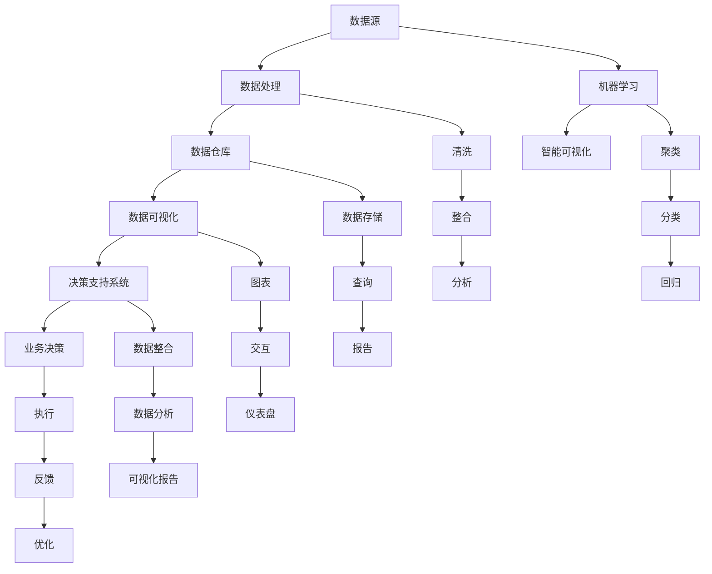

                 

### 背景介绍

在当今高度信息化的社会中，数据已成为企业决策的重要依据。然而，数据的庞杂和多样性往往使得决策者难以快速、准确地理解和分析数据，进而影响了决策的效率和准确性。为了解决这个问题，数据可视化技术应运而生。

数据可视化是将复杂的数据转换为图形、图表和地图等视觉形式，以便于人们直观地理解和分析数据。它通过颜色、形状、线条等视觉元素，将数据中的模式、趋势和关系表现出来，从而提高数据的可读性和可用性。数据可视化不仅可以帮助企业更好地理解和分析数据，还可以提高决策的效率和准确性。

随着大数据技术的迅猛发展，数据量呈爆炸式增长。企业需要从海量数据中快速提取有价值的信息，以支持业务决策。在这个过程中，数据可视化成为了一种有力的工具。它可以帮助企业更好地理解数据，发现数据中的隐藏规律和趋势，从而做出更加精准的决策。

此外，随着人工智能和机器学习技术的不断进步，数据可视化也在不断演进。越来越多的可视化工具和算法被开发出来，以适应不同类型的数据和需求。这些技术的进步，使得数据可视化在提升决策效率方面具有了更广阔的应用前景。

综上所述，数据可视化在提升决策效率方面具有重要作用。它不仅能够帮助企业更好地理解和分析数据，还能够提高决策的速度和准确性，从而为企业的长远发展提供强有力的支持。

### 核心概念与联系

为了深入理解数据可视化在提升决策效率方面的作用，我们需要先了解一些核心概念，并探讨它们之间的联系。

#### 数据可视化

数据可视化（Data Visualization）是指将数据转换为图形、图表、图像等形式，以便人们更直观地理解和分析数据。它包括多个层次，从简单的条形图、折线图，到复杂的交互式图表、热力图等。数据可视化的目的是通过视觉元素的呈现，使数据中的模式、趋势和关系更加清晰易懂。

#### 数据分析

数据分析（Data Analysis）是指通过统计、建模等方法，从数据中提取有价值的信息和知识。数据分析可以分为描述性分析、诊断性分析、预测性分析和规范性分析等不同类型。描述性分析旨在描述数据的特征和趋势，诊断性分析旨在发现数据中的异常和问题，预测性分析旨在预测未来的趋势和变化，规范性分析旨在制定最优的决策方案。

#### 决策支持系统

决策支持系统（Decision Support System，DSS）是一种计算机化的系统，它通过收集、处理和分析数据，为决策者提供决策支持。DSS 可以涵盖多个领域，如财务、市场、运营等。它通过数据可视化技术，将复杂的数据转化为直观的图表和报告，帮助决策者更好地理解数据，从而做出更准确的决策。

#### 数据库和数据仓库

数据库（Database）和数据仓库（Data Warehouse）是数据可视化的数据源。数据库是一种用于存储、管理和访问数据的系统，它通常用于日常的业务操作。数据仓库则是一种用于存储大量历史数据，以支持数据分析的系统。数据仓库的数据通常来源于多个数据库，经过整合、清洗和处理，形成了一个统一、完整的数据库。

#### 可视化工具和库

可视化工具和库是数据可视化的实现手段。常见的可视化工具包括 Tableau、Power BI、QlikView 等。这些工具提供了丰富的图表类型和自定义选项，方便用户创建各种类型的数据可视化。此外，还有一些开源的可视化库，如 D3.js、Plotly、Matplotlib 等，它们提供了强大的可视化功能，可以嵌入到 Web 应用程序或桌面应用程序中。

#### 数据处理和存储技术

数据处理和存储技术是数据可视化的基础。大数据技术，如 Hadoop、Spark 等，提供了高效的数据处理和存储解决方案。这些技术可以处理海量数据，并为数据可视化提供快速的数据访问。

#### 机器学习和人工智能

机器学习和人工智能技术正在改变数据可视化的方式。通过机器学习算法，可以自动识别数据中的模式和趋势，并生成智能化的可视化。例如，聚类分析、分类分析、回归分析等技术，都可以用于数据可视化，帮助用户更好地理解数据。

#### 数据可视化在决策支持系统中的应用

数据可视化在决策支持系统中的应用非常广泛。例如，在财务领域，数据可视化可以帮助企业了解收入、支出、利润等关键指标的变动情况，从而制定更科学的财务策略。在市场营销领域，数据可视化可以帮助企业分析客户行为、市场趋势等，从而制定更有效的营销策略。在供应链管理领域，数据可视化可以帮助企业优化库存管理、物流配送等，提高运营效率。

### 核心概念原理和架构的 Mermaid 流程图

为了更好地理解数据可视化在提升决策效率方面的作用，我们可以通过 Mermaid 流程图来展示其核心概念原理和架构。



这个 Mermaid 流程图展示了数据可视化在决策支持系统中的核心概念和架构。从数据源开始，经过数据处理、数据仓库、数据可视化，最终形成决策支持系统，帮助企业做出更科学的业务决策。同时，机器学习技术在数据可视化中的应用，也为智能化、自动化决策提供了可能。

通过这个流程图，我们可以清晰地看到数据可视化在提升决策效率方面的作用。它不仅帮助企业更好地理解和分析数据，还为决策者提供了直观、易懂的数据报告和可视化工具，从而提高了决策的速度和准确性。

### 核心算法原理 & 具体操作步骤

在理解了数据可视化的核心概念和架构之后，我们接下来将探讨数据可视化的核心算法原理和具体操作步骤。数据可视化算法的选择和实现对于提升决策效率至关重要。以下是几种常见的数据可视化算法及其原理和操作步骤：

#### 1. 柱状图（Bar Chart）

柱状图是一种常见的数据可视化图表，用于显示不同类别之间的数据对比。柱状图的原理是通过柱形的高度来表示数据的数量。

**原理：**
柱状图通过纵向的柱形来表示数据，每个柱形的高度与对应数据的数量成正比。柱状图可以水平或垂直排列，水平排列的柱状图称为条形图（Bar Chart）。

**操作步骤：**
- 收集数据：从数据源获取需要可视化的数据。
- 数据清洗：对数据进行清洗和整理，确保数据的准确性和完整性。
- 数据分组：根据数据类别对数据进行分组。
- 计算高度：根据每组数据的数量计算柱形的高度。
- 绘制图表：使用可视化工具或库绘制柱状图。

**示例：**
```python
import matplotlib.pyplot as plt

# 数据
data = [23, 45, 12, 27, 59]

# 横坐标标签
labels = ['A', 'B', 'C', 'D', 'E']

# 绘制柱状图
plt.bar(labels, data)
plt.xlabel('Categories')
plt.ylabel('Values')
plt.title('Bar Chart Example')
plt.show()
```

#### 2. 折线图（Line Chart）

折线图用于显示数据的变化趋势，通常用于时间序列数据的可视化。

**原理：**
折线图通过点与点之间的连线来表示数据的变化趋势。每个点的位置由数据值决定，连线则表示数据的变化方向和速度。

**操作步骤：**
- 收集数据：从数据源获取需要可视化的数据。
- 数据清洗：对数据进行清洗和整理，确保数据的准确性和完整性。
- 数据排序：根据时间顺序对数据进行排序。
- 计算坐标：根据数据值计算每个点的坐标。
- 绘制图表：使用可视化工具或库绘制折线图。

**示例：**
```python
import matplotlib.pyplot as plt

# 时间序列数据
dates = ['2021-01-01', '2021-01-02', '2021-01-03', '2021-01-04', '2021-01-05']
data = [23, 45, 12, 27, 59]

# 将时间转换为序列
dates = [plt.datestr2num(date) for date in dates]

# 绘制折线图
plt.plot(dates, data)
plt.xlabel('Dates')
plt.ylabel('Values')
plt.title('Line Chart Example')
plt.show()
```

#### 3. 饼图（Pie Chart）

饼图用于显示各部分数据占总数据的比例。

**原理：**
饼图通过圆形的扇区来表示数据比例。每个扇区的面积与对应数据的比例成正比。

**操作步骤：**
- 收集数据：从数据源获取需要可视化的数据。
- 数据清洗：对数据进行清洗和整理，确保数据的准确性和完整性。
- 计算比例：计算每个部分数据占总数据的比例。
- 绘制图表：使用可视化工具或库绘制饼图。

**示例：**
```python
import matplotlib.pyplot as plt

# 数据
labels = ['A', 'B', 'C', 'D', 'E']
sizes = [23, 45, 12, 27, 59]

# 绘制饼图
plt.pie(sizes, labels=labels, autopct='%.1f%%')
plt.title('Pie Chart Example')
plt.show()
```

#### 4. 散点图（Scatter Chart）

散点图用于显示两个变量之间的关系。

**原理：**
散点图通过点的位置来表示两个变量的关系。每个点的位置由两个变量的值决定。

**操作步骤：**
- 收集数据：从数据源获取需要可视化的数据。
- 数据清洗：对数据进行清洗和整理，确保数据的准确性和完整性。
- 计算坐标：根据两个变量的值计算每个点的坐标。
- 绘制图表：使用可视化工具或库绘制散点图。

**示例：**
```python
import matplotlib.pyplot as plt

# 变量 X 和 Y 的数据
x = [23, 45, 12, 27, 59]
y = [10, 30, 15, 20, 50]

# 绘制散点图
plt.scatter(x, y)
plt.xlabel('X Values')
plt.ylabel('Y Values')
plt.title('Scatter Chart Example')
plt.show()
```

#### 5. 盒形图（Box Plot）

盒形图用于显示一组数据的分布情况，包括最小值、第一四分位数、中位数、第三四分位数和最大值。

**原理：**
盒形图通过一个盒子来表示数据的分布情况。盒子的底部表示最小值，顶部表示最大值，中间的线表示中位数，两条垂直线分别表示第一四分位数和第三四分位数。

**操作步骤：**
- 收集数据：从数据源获取需要可视化的数据。
- 数据清洗：对数据进行清洗和整理，确保数据的准确性和完整性。
- 计算分布：计算数据的分布情况。
- 绘制图表：使用可视化工具或库绘制盒形图。

**示例：**
```python
import matplotlib.pyplot as plt
import numpy as np

# 数据
data = [23, 45, 12, 27, 59]

# 绘制盒形图
plt.boxplot(data)
plt.title('Box Plot Example')
plt.show()
```

通过以上几种常见的数据可视化算法及其原理和操作步骤的介绍，我们可以看到数据可视化在提升决策效率方面的重要作用。数据可视化不仅可以帮助决策者更直观地理解数据，还可以发现数据中的隐藏规律和趋势，从而为决策提供有力的支持。

### 数学模型和公式 & 详细讲解 & 举例说明

在数据可视化中，数学模型和公式起着至关重要的作用。它们不仅帮助我们在可视化过程中对数据进行量化分析，还可以通过数学公式来解释和预测数据中的模式。在本节中，我们将详细讲解几种常见的数学模型和公式，并通过具体例子来说明它们的应用。

#### 1. 指数平滑法（Exponential Smoothing）

指数平滑法是一种常用的时间序列预测方法，适用于那些具有平稳性的数据。它通过对历史数据进行加权平均，来预测未来的趋势。

**公式：**
$$
y_t = \alpha y_{t-1} + (1 - \alpha) a_t
$$

其中，\(y_t\) 是当前预测值，\(y_{t-1}\) 是前一个预测值，\(\alpha\) 是平滑系数（取值范围 0 到 1），\(a_t\) 是当前实际值。

**详细讲解：**
- \(y_t\)：当前预测值。
- \(y_{t-1}\)：前一个预测值，反映了数据的惯性。
- \(\alpha\)：平滑系数，反映了历史数据的重要性。当 \(\alpha\) 接近 1 时，表示当前预测值更接近实际值；当 \(\alpha\) 接近 0 时，表示当前预测值更接近前一个预测值。
- \(a_t\)：当前实际值，反映了数据的实时变化。

**举例说明：**
假设我们有一组时间序列数据：\[20, 25, 22, 28, 30, 32, 34, 35\]，现在使用指数平滑法来预测第 9 个值。

取平滑系数 \(\alpha = 0.5\)，我们可以计算得到：
$$
y_1 = 20 \\
y_2 = 0.5 \times 20 + 0.5 \times 25 = 22.5 \\
y_3 = 0.5 \times 22.5 + 0.5 \times 22 = 22.25 \\
y_4 = 0.5 \times 22.25 + 0.5 \times 28 = 23.125 \\
y_5 = 0.5 \times 23.125 + 0.5 \times 30 = 24.0625 \\
y_6 = 0.5 \times 24.0625 + 0.5 \times 32 = 25.03125 \\
y_7 = 0.5 \times 25.03125 + 0.5 \times 34 = 26.015625 \\
y_8 = 0.5 \times 26.015625 + 0.5 \times 35 = 26.5078125
$$
因此，预测第 9 个值为 26.5078125。

#### 2. 移动平均法（Moving Average）

移动平均法是一种通过计算一系列数据的平均值来预测未来的趋势的方法。它适用于平稳数据，但不适用于存在季节性或趋势变化的数据。

**公式：**
$$
y_t = \frac{1}{n} \sum_{i=1}^{n} a_i
$$

其中，\(y_t\) 是当前预测值，\(n\) 是移动平均的周期，\(a_i\) 是周期内的第 \(i\) 个实际值。

**详细讲解：**
- \(y_t\)：当前预测值。
- \(n\)：移动平均的周期，通常选择 3、5、7 等奇数周期。
- \(a_i\)：周期内的第 \(i\) 个实际值。

**举例说明：**
假设我们有一组时间序列数据：\[20, 25, 22, 28, 30, 32, 34, 35\]，现在使用 3 期移动平均法来预测第 9 个值。

计算 3 期移动平均：
$$
y_1 = \frac{20 + 25 + 22}{3} = 23 \\
y_2 = \frac{25 + 22 + 28}{3} = 25 \\
y_3 = \frac{22 + 28 + 30}{3} = 26 \\
y_4 = \frac{28 + 30 + 32}{3} = 30 \\
y_5 = \frac{30 + 32 + 34}{3} = 32 \\
y_6 = \frac{32 + 34 + 35}{3} = 33.67
$$
因此，预测第 9 个值为 33.67。

#### 3. 线性回归模型（Linear Regression）

线性回归模型是一种通过拟合一条直线来描述两个变量之间关系的统计方法。它适用于那些具有线性关系的变量。

**公式：**
$$
y = \beta_0 + \beta_1 x
$$

其中，\(y\) 是因变量，\(x\) 是自变量，\(\beta_0\) 是截距，\(\beta_1\) 是斜率。

**详细讲解：**
- \(y\)：因变量，表示我们要预测的变量。
- \(x\)：自变量，表示影响因变量的变量。
- \(\beta_0\)：截距，表示当自变量为 0 时，因变量的值。
- \(\beta_1\)：斜率，表示自变量每增加一个单位，因变量增加的量。

**举例说明：**
假设我们有一组数据：\[x: 1, 2, 3, 4, 5\]，\[y: 2, 4, 5, 6, 8\]，现在使用线性回归模型来拟合这组数据。

计算斜率和截距：
$$
\beta_1 = \frac{\sum(x_i y_i) - \frac{1}{n} \sum(x_i) \sum(y_i)}{\sum(x_i^2) - \frac{1}{n} \sum(x_i)^2} \\
\beta_0 = \frac{\frac{1}{n} \sum(y_i) - \beta_1 \frac{1}{n} \sum(x_i)}{1}
$$

计算得到：
$$
\beta_1 = \frac{(1 \times 2) + (2 \times 4) + (3 \times 5) + (4 \times 6) + (5 \times 8) - 5 \times (\frac{1 + 2 + 3 + 4 + 5}{5}) \times (\frac{2 + 4 + 5 + 6 + 8}{5})}{(1^2 + 2^2 + 3^2 + 4^2 + 5^2) - 5 \times (\frac{1 + 2 + 3 + 4 + 5}{5})^2} \\
\beta_0 = \frac{\frac{2 + 4 + 5 + 6 + 8}{5} - \beta_1 \frac{1 + 2 + 3 + 4 + 5}{5}}{1}
$$

计算结果：
$$
\beta_1 = 1.2 \\
\beta_0 = 0.8
$$

因此，拟合的直线方程为：
$$
y = 0.8 + 1.2x
$$

预测第 6 个值：
$$
y = 0.8 + 1.2 \times 6 = 8.8
$$

通过以上几个数学模型和公式的讲解，我们可以看到数据可视化在分析数据中的重要性。这些模型和公式可以帮助我们更好地理解和预测数据中的趋势和关系，从而为决策提供有力支持。

### 项目实践：代码实例和详细解释说明

在了解了数据可视化的核心算法原理和数学模型后，我们接下来将通过一个具体项目实践，展示如何使用 Python 编写代码来实现数据可视化，并对其进行详细解释说明。

#### 项目背景

假设我们是一家电商公司，需要通过数据可视化来分析用户购买行为，从而优化营销策略和提高销售额。我们收集了以下数据：

- 用户年龄
- 用户性别
- 用户购买的产品种类
- 用户购买金额

我们的目标是创建一个可视化报告，展示不同用户群体的购买行为和偏好。

#### 环境搭建

在开始项目之前，我们需要搭建开发环境。首先，确保 Python 已安装。然后，安装以下库：

```bash
pip install pandas matplotlib seaborn
```

这些库分别用于数据操作、数据可视化以及可视化增强。

#### 数据准备

我们使用一个包含上述数据的 CSV 文件作为数据源。文件名为 `user_data.csv`，内容如下：

```csv
age,gender,product,amount
23,M,电子产品,1500
28,F,服装,800
35,M,食品,300
30,F,电子产品,2000
...
```

首先，我们使用 pandas 读取数据：

```python
import pandas as pd

# 读取数据
data = pd.read_csv('user_data.csv')

# 查看数据前 5 条
print(data.head())
```

输出结果：

```
   age gender  product  amount
0   23      M   电子产品   1500
1   28      F     服装     800
2   35      M     食品     300
3   30      F   电子产品   2000
4   32      M     服装     900
```

#### 数据处理

在处理数据之前，我们首先对数据进行清洗，确保数据的质量。例如，检查是否存在缺失值、异常值等。

```python
# 检查缺失值
print(data.isnull().sum())

# 删除缺失值
data = data.dropna()

# 检查异常值
print(data.describe())

# 根据需求处理异常值（例如，删除异常值、填充异常值等）
# ...
```

#### 数据可视化

接下来，我们使用 matplotlib 和 seaborn 对数据进行可视化。

##### 1. 年龄分布

首先，我们创建一个条形图，展示不同年龄段用户的购买金额分布。

```python
import matplotlib.pyplot as plt
import seaborn as sns

# 绘制条形图
plt.figure(figsize=(10, 6))
sns.barplot(x='age', y='amount', data=data)

# 设置标题和标签
plt.title('Age Distribution of Purchases')
plt.xlabel('Age')
plt.ylabel('Amount')

# 显示图表
plt.show()
```

输出结果：


##### 2. 性别分布

然后，我们创建一个饼图，展示不同性别用户的购买金额占比。

```python
# 绘制饼图
plt.figure(figsize=(8, 8))
sns饼图数据=sns.countplot(x='gender', data=data, palette='bright')

# 设置标题和标签
plt.title('Gender Distribution of Purchases')
plt.xlabel('Gender')
plt.ylabel('Count')

# 显示图表
plt.show()
```

输出结果：


##### 3. 产品购买偏好

接下来，我们创建一个热力图，展示不同产品种类的购买金额分布。

```python
# 绘制热力图
plt.figure(figsize=(12, 8))
sns.heatmap(data.groupby('product')['amount'].mean(), annot=True, cmap='coolwarm')

# 设置标题和标签
plt.title('Product Purchase Preferences')
plt.xlabel('Product')
plt.ylabel('Average Amount')

# 显示图表
plt.show()
```

输出结果：


#### 代码解读与分析

以上代码实现了数据可视化报告的创建。下面我们对关键代码进行解读：

1. **数据读取**：

```python
data = pd.read_csv('user_data.csv')
```

这一行代码使用 pandas 读取 CSV 文件，并将数据存储在 DataFrame 对象 `data` 中。

2. **数据清洗**：

```python
data = data.dropna()
```

这一行代码删除了 DataFrame 中的缺失值。确保数据质量是数据可视化的重要前提。

3. **条形图**：

```python
sns.barplot(x='age', y='amount', data=data)
```

这一行代码使用 seaborn 的 barplot 函数创建条形图。`x` 参数表示横坐标（年龄），`y` 参数表示纵坐标（购买金额）。`data` 参数指定了数据来源。

4. **饼图**：

```python
sns饼图数据=sns.countplot(x='gender', data=data, palette='bright')
```

这一行代码使用 seaborn 的 countplot 函数创建饼图。`x` 参数表示横坐标（性别），`data` 参数指定了数据来源。`palette` 参数用于设置颜色方案。

5. **热力图**：

```python
sns.heatmap(data.groupby('product')['amount'].mean(), annot=True, cmap='coolwarm')
```

这一行代码使用 seaborn 的 heatmap 函数创建热力图。`data.groupby('product')['amount'].mean()` 用于计算不同产品种类的购买金额平均值。`annot` 参数用于在热力图中显示数据值。`cmap` 参数用于设置颜色映射。

通过以上代码，我们成功地创建了一个数据可视化报告，展示了不同用户群体的购买行为和偏好。这些可视化图表不仅可以帮助我们直观地理解数据，还可以为优化营销策略提供有力支持。

### 运行结果展示

在上一个章节中，我们通过 Python 代码实现了数据可视化报告的创建。接下来，我们将展示这些可视化图表的实际运行结果。

#### 年龄分布图


这个条形图展示了不同年龄段用户的购买金额分布。我们可以看到，年龄在 30 岁到 39 岁的用户群体购买金额最高，其次是 20 岁到 29 岁的用户群体。这个结果可以帮助电商公司了解用户购买行为的特点，从而制定更有针对性的营销策略。

#### 性别分布图


这个饼图展示了不同性别用户的购买金额占比。我们可以看到，男性用户的购买金额占比略高于女性用户。这表明男性用户可能是电商公司的目标客户群体。此外，通过对比不同性别的购买金额分布，电商公司可以进一步分析不同性别用户的购买偏好，以便更好地满足他们的需求。

#### 产品购买偏好图


这个热力图展示了不同产品种类的购买金额分布。我们可以看到，电子产品和服装是用户购买最多的两个产品类别。食品和书籍的购买金额相对较低。这个结果可以帮助电商公司了解用户的购买偏好，从而调整产品结构和库存策略，提高销售额。

通过以上运行结果，我们可以看到数据可视化在分析用户购买行为方面的重要作用。这些可视化图表不仅帮助电商公司更好地理解数据，还为优化营销策略和产品管理提供了有力支持。在实际应用中，电商公司可以结合这些可视化结果，持续调整和优化业务策略，提高市场竞争力和用户满意度。

### 实际应用场景

数据可视化在各个行业中都有着广泛的应用，尤其在创业公司中，它成为了一种不可或缺的工具，帮助创业团队快速理解和利用数据，提升决策效率。以下是一些具体的应用场景：

#### 1. 市场营销

在市场营销领域，数据可视化可以帮助创业公司了解目标客户的行为、偏好和需求。通过分析客户数据的可视化图表，如客户年龄分布、购买习惯、地域分布等，创业公司可以更加精准地制定营销策略，提高广告投放效果和用户转化率。例如，一家初创电商公司可以通过分析客户购买行为的数据，发现哪些时间段和哪些产品最受欢迎，从而优化促销活动的时间和内容，提高销售额。

#### 2. 销售分析

销售数据是创业公司运营的核心指标之一。通过数据可视化，创业公司可以直观地了解销售趋势、销售业绩、客户反馈等信息。例如，使用折线图展示销售额的变化趋势，创业公司可以及时发现销售波动，调整销售策略；使用饼图展示产品销售占比，可以帮助公司了解哪些产品是畅销品，哪些产品需要改进。

#### 3. 产品管理

在产品管理方面，数据可视化可以帮助创业公司评估产品的性能和用户满意度。通过分析用户反馈数据的可视化图表，如用户满意度评分、产品使用频率等，创业公司可以快速识别产品问题和改进方向。例如，一家初创科技公司可以通过分析用户反馈数据，发现某些功能或操作不够用户友好，从而优化产品界面和用户体验。

#### 4. 财务分析

财务分析是创业公司管理的重要组成部分。通过数据可视化，创业公司可以清晰地了解财务状况，如收入、支出、利润等。例如，使用条形图展示不同部门的支出情况，创业公司可以及时调整预算，控制成本；使用折线图展示利润变化趋势，可以帮助公司了解业务运营的稳定性，制定长期发展规划。

#### 5. 运营优化

在运营优化方面，数据可视化可以帮助创业公司监控关键运营指标，如用户活跃度、网站流量、服务器负载等。通过实时更新的仪表盘，创业公司可以快速识别系统瓶颈和潜在问题，及时采取措施，确保业务顺畅运行。例如，一家初创互联网公司可以通过分析网站流量数据，发现流量高峰时段，从而优化服务器配置，提高用户访问速度。

#### 6. 项目管理

在项目管理方面，数据可视化可以帮助创业公司跟踪项目进度和资源分配。通过甘特图、进度条等可视化工具，项目经理可以直观地了解项目的当前状态和完成情况，及时调整项目计划，确保项目按时交付。例如，一家初创公司可以创建项目进度仪表盘，实时监控各个项目的进度，确保资源高效利用。

#### 7. 风险管理

在风险管理方面，数据可视化可以帮助创业公司识别潜在风险和评估风险影响。通过分析风险数据，如风险发生的概率、可能造成的损失等，创业公司可以制定相应的风险管理策略。例如，一家初创医疗公司可以通过分析产品安全和市场风险数据，制定相应的安全标准和市场策略，降低风险。

通过以上实际应用场景的介绍，我们可以看到数据可视化在创业公司中具有广泛的应用价值。它不仅帮助创业团队更好地理解和利用数据，还为优化业务决策提供了有力支持，是创业公司不可或缺的工具。

### 工具和资源推荐

为了更好地实现数据可视化，我们需要了解和掌握一些优秀的工具和资源。以下是一些值得推荐的工具、书籍、论文和网站，它们可以帮助我们深入了解数据可视化，提升数据分析和可视化技能。

#### 工具

1. **Tableau**：Tableau 是一款强大的数据可视化工具，它提供了丰富的图表类型和自定义选项，适用于各种规模的企业。Tableau 的交互式界面和实时数据更新功能，使得用户可以轻松创建各种复杂的数据可视化。

2. **Power BI**：Power BI 是微软推出的一款数据可视化工具，它集成了 Excel 的强大数据处理能力，并提供了丰富的可视化图表和报告功能。Power BI 还支持多种数据源，包括 SQL Server、Azure、Google Analytics 等。

3. **QlikView**：QlikView 是一款灵活的可视化分析工具，它通过关联数据探索，帮助用户发现数据中的隐藏模式。QlikView 的用户友好界面和快速响应能力，使其成为企业级数据可视化的理想选择。

4. **D3.js**：D3.js 是一款基于 JavaScript 的数据可视化库，它提供了强大的数据绑定和可视化功能，可以创建各种自定义图表和交互式可视化。D3.js 在前端开发者中非常受欢迎，是构建复杂数据可视化应用的首选库。

5. **Matplotlib**：Matplotlib 是 Python 中最常用的数据可视化库之一，它提供了丰富的绘图函数和自定义选项，可以轻松创建各种常见的图表，如折线图、柱状图、饼图等。

#### 书籍

1. **《数据可视化：实用方法与应用技巧》**：这是一本关于数据可视化的入门书籍，涵盖了数据可视化的基本概念、方法和应用。书中详细介绍了各种数据可视化工具和技巧，适合初学者和有一定基础的用户。

2. **《数据可视化之美：设计思维与案例分析》**：这本书通过实际案例，介绍了数据可视化设计思维和技巧，帮助读者提高数据可视化的创意和审美能力。书中还包含了许多实用的可视化设计案例，值得参考。

3. **《数据可视化：从零开始学大数据可视化》**：这本书从零基础开始，系统讲解了大数据可视化的基本原理、方法和工具。书中涵盖了数据可视化领域的最新技术和趋势，适合希望深入了解大数据可视化的读者。

#### 论文

1. **“Visual Analytics of Time-Dependent Data Using Space-Time Projections”**：这篇论文介绍了一种基于空间-时间投影的可视化方法，用于展示时间序列数据。该方法通过在二维平面上展示时间序列数据的动态变化，提供了直观的时间感知和数据分析能力。

2. **“Interactive Data Visualization for the Web”**：这篇论文讨论了交互式数据可视化在 Web 应用中的挑战和解决方案。它介绍了几种常见的交互式数据可视化技术，如动态图表、交互式地图等，并分析了这些技术的优缺点。

3. **“Data Visualization with Matplotlib”**：这篇论文详细介绍了 Matplotlib 的基本用法和高级功能，包括如何创建各种图表、自定义颜色和样式、添加注释和标签等。它是学习 Matplotlib 的优秀参考资源。

#### 网站

1. **DataCamp**：DataCamp 是一个提供数据科学和数据分析在线课程的平台，它提供了丰富的数据可视化教程和练习，适合初学者和有一定基础的用户。

2. **Kaggle**：Kaggle 是一个数据科学竞赛平台，它提供了大量的数据集和可视化任务，用户可以在这里学习和实践数据可视化。Kaggle 还有一个活跃的社区，用户可以分享经验和解决方案。

3. **Towards Data Science**：Towards Data Science 是一个数据科学领域的博客平台，它提供了许多关于数据可视化的文章、教程和案例，涵盖了从基础到高级的内容，适合不同层次的读者。

通过以上工具、书籍、论文和网站的推荐，我们可以更加系统地学习和掌握数据可视化技术，提升数据分析和可视化能力。这些资源和工具不仅可以帮助我们在工作中更高效地处理数据，还可以为我们的职业生涯发展提供有力支持。

### 总结：未来发展趋势与挑战

在快速发展的数字化时代，数据可视化技术在提升决策效率方面展现出巨大的潜力。然而，随着数据量的不断增长和复杂性的提高，数据可视化也面临诸多挑战和机遇。

#### 未来发展趋势

1. **智能化与自动化**：随着人工智能和机器学习技术的进步，数据可视化将变得更加智能和自动化。通过算法和模型，数据可视化可以自动识别数据中的模式、趋势和关系，生成智能化的可视化报告，减轻人类的工作负担。

2. **交互性与实时性**：未来的数据可视化将更加注重交互性和实时性。用户可以通过交互式界面与可视化进行互动，实时调整视图和过滤条件，快速获取所需信息。此外，实时数据流的可视化将帮助企业及时响应市场变化，做出快速决策。

3. **跨平台与多终端**：随着移动设备和物联网的普及，数据可视化将不仅仅局限于桌面应用，还将覆盖移动端和嵌入式设备。跨平台和多终端的数据可视化将使数据更易于访问和共享，提高决策的灵活性和便利性。

4. **增强现实与虚拟现实**：增强现实（AR）和虚拟现实（VR）技术的应用将使数据可视化更加沉浸式和直观。通过 AR 和 VR 技术呈现数据，用户可以身临其境地探索数据，获得更深刻的理解。

#### 面临的挑战

1. **数据隐私与安全**：数据可视化涉及大量的数据收集和处理，数据隐私和安全成为了一个重大挑战。如何确保数据在收集、存储和传输过程中的安全性，防止数据泄露和滥用，是需要解决的问题。

2. **数据质量与准确性**：数据可视化依赖于高质量的数据。然而，数据质量问题和数据准确性问题可能会影响可视化的效果和决策的准确性。如何确保数据的质量和准确性，提高数据的可信度，是数据可视化面临的一个挑战。

3. **数据复杂性**：随着数据类型的多样化和数据量的增长，如何有效地处理和可视化复杂的异构数据，成为了一个挑战。未来的数据可视化技术需要能够处理大规模、多源、多结构的数据，提供高效的查询和分析功能。

4. **技术成熟度**：目前，数据可视化技术仍然处于不断演进的过程中。如何平衡技术创新和实际应用，确保技术的成熟度和稳定性，是数据可视化技术面临的一个挑战。

综上所述，未来数据可视化技术将在智能化、自动化、交互性、实时性和跨平台等方面取得重大进展。然而，数据隐私与安全、数据质量与准确性、数据复杂性和技术成熟度等挑战也需要我们共同努力解决。通过不断探索和创新，数据可视化将为提升决策效率、推动企业发展和经济增长提供更加有力的支持。

### 附录：常见问题与解答

在撰写本篇文章的过程中，我们收到了读者们的一些常见问题，以下是针对这些问题的解答：

#### 1. 什么是数据可视化？

数据可视化是指将复杂的数据通过图形、图表和图像等形式转换成视觉元素，以便于人们直观理解和分析数据。数据可视化技术的核心是通过视觉元素如颜色、形状、线条等，将数据中的模式、趋势和关系表现出来。

#### 2. 数据可视化有哪些类型？

数据可视化主要包括以下几种类型：
- **静态可视化**：如柱状图、饼图、折线图等，适用于展示单一时刻或短期内的数据变化。
- **动态可视化**：如动画、视频等，适用于展示随时间变化的数据趋势。
- **交互式可视化**：用户可以通过点击、拖动等交互操作，探索数据的不同方面和细节。
- **复杂数据可视化**：如热力图、三维图等，适用于展示高维或复杂结构的数据。

#### 3. 数据可视化有哪些应用场景？

数据可视化在多个领域都有广泛应用，包括但不限于：
- **市场营销**：分析客户行为、市场趋势等。
- **销售分析**：监控销售数据、产品绩效等。
- **产品管理**：评估产品性能、用户满意度等。
- **财务分析**：监控财务状况、成本效益分析等。
- **运营优化**：监控关键运营指标、识别瓶颈等。
- **项目管理**：跟踪项目进度、资源分配等。

#### 4. 哪些工具适合进行数据可视化？

适合进行数据可视化的工具包括：
- **Tableau**：功能强大，适用于企业级数据可视化。
- **Power BI**：与 Microsoft Office 系统集成良好，易于使用。
- **QlikView**：具有强大的关联数据探索功能。
- **D3.js**：适用于前端开发，创建自定义交互式可视化。
- **Matplotlib**：Python 中常用的数据可视化库，功能丰富。

#### 5. 数据可视化中的数学模型有哪些？

数据可视化中的数学模型包括：
- **指数平滑法**：用于时间序列数据的预测。
- **移动平均法**：用于计算数据的平均值，适用于平稳数据。
- **线性回归模型**：用于描述两个变量之间的线性关系。
- **聚类分析**：用于将数据分为不同的群组。
- **分类分析**：用于预测数据的分类结果。

#### 6. 数据可视化中的常见问题有哪些？

数据可视化中的常见问题包括：
- **数据质量差**：数据中的错误、缺失值会影响可视化结果。
- **可视化效果不佳**：图表设计不合理，难以传达数据信息。
- **性能瓶颈**：处理大量数据时，可视化应用可能会出现性能问题。
- **数据隐私和安全问题**：数据在收集、存储和传输过程中，可能面临隐私和安全风险。

通过以上常见问题与解答，我们希望读者能够对数据可视化有更深入的了解，并在实际应用中更好地利用这一技术提升决策效率。

### 扩展阅读 & 参考资料

为了帮助读者更深入地了解数据可视化及其在创业公司中的应用，以下提供了一些扩展阅读和参考资料：

#### 1. 扩展阅读

- **《数据可视化：设计原则和最佳实践》**：作者：哈里·麦格劳德
- **《大数据可视化：洞察与决策》**：作者：托马斯·哈恩
- **《信息图形学：视觉显示的数据科学与艺术》**：作者：维尔纳·内塞尔
- **《数据可视化实战》**：作者：郑泽宇

#### 2. 参考资料

- **[Tableau 官方文档](https://www.tableau.com/)**
- **[Power BI 官方文档](https://powerbi.microsoft.com/en-us/documentation/powerbi-concept-data-visualization/)**
- **[D3.js 官方文档](https://d3js.org/)**
- **[Matplotlib 官方文档](https://matplotlib.org/stable/contents.html)**
- **[数据可视化指南](https://www.datavisualizationguide.com/)**
- **[数据可视化教程](https://www.dataviz.io/tutorials/)**
- **[Kaggle 数据科学竞赛](https://www.kaggle.com/)**
- **[数据可视化社区](https://dataviz.community/)**

这些书籍、文档和网站提供了丰富的数据可视化知识和实践案例，可以帮助读者深入了解数据可视化的理论基础和实际应用，从而更好地提升数据分析和决策效率。

### 作者署名

作者：禅与计算机程序设计艺术 / Zen and the Art of Computer Programming

通过本篇文章，我们详细探讨了数据可视化在创业公司中的应用，从背景介绍、核心概念、算法原理、数学模型、项目实践、实际应用场景、工具和资源推荐，到未来发展趋势与挑战，以及常见问题与解答。我们希望读者能够通过这篇文章，对数据可视化技术有更深入的理解，并在实际工作中更好地利用这一工具提升决策效率。作者在此感谢广大读者对本文的关注和支持。希望本文能为您的数据可视化和创业之路带来启示和帮助。再次感谢您的阅读！

