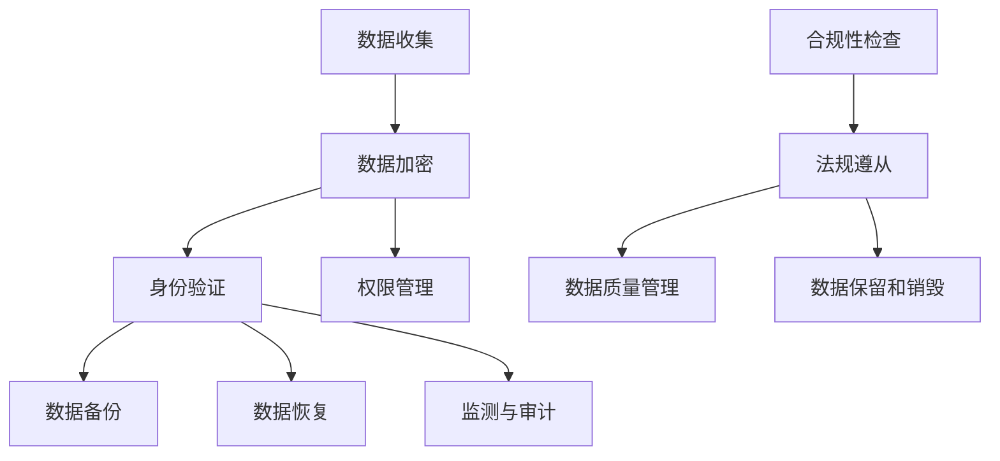

                 

### 文章标题：创业公司的数据安全合规策略

#### 关键词：数据安全、合规性、创业公司、隐私保护、风险管理、安全技术

> 摘要：本文将深入探讨创业公司在面对日益复杂的网络安全环境时，如何制定和实施有效的数据安全合规策略。文章将介绍数据安全的核心理念，分析创业公司的合规挑战，提供具体的合规策略框架，并探讨实践中的难点与解决方案。通过案例分析，读者可以了解到创业公司在数据安全合规方面的成功实践，以及未来的发展趋势和面临的挑战。

---

### 1. 背景介绍

在当今数字化时代，数据已成为企业的重要资产。创业公司由于资源有限、业务规模小、技术架构简单等原因，往往更容易在数据安全方面面临挑战。数据泄露、违规使用和丢失等事件不仅会对企业的声誉造成严重损害，还可能导致法律纠纷和巨额罚款。因此，制定有效的数据安全合规策略对于创业公司至关重要。

数据安全合规指的是企业在数据处理、存储、传输等环节中遵循相关法律法规和标准，确保数据的安全和隐私。随着全球隐私保护法规的不断强化，如欧盟的《通用数据保护条例》（GDPR）和加利福尼亚州《消费者隐私法案》（CCPA），创业公司在数据合规方面的压力也在不断增加。

本文将围绕以下主题展开：

- **核心概念与联系**：介绍数据安全合规的相关概念，并通过Mermaid流程图展示其架构。
- **核心算法原理与具体操作步骤**：详细阐述数据安全合规策略的实施方法。
- **数学模型和公式**：分析数据安全合规策略中的关键数学模型和公式。
- **项目实践**：通过实际案例展示数据安全合规策略的实施过程。
- **实际应用场景**：探讨数据安全合规策略在不同业务场景中的应用。
- **工具和资源推荐**：推荐学习资源和开发工具。
- **总结与展望**：总结文章要点，探讨未来的发展趋势和挑战。

---

### 2. 核心概念与联系

在讨论数据安全合规策略之前，我们需要明确一些核心概念和它们之间的联系。

#### 2.1 数据安全

数据安全是指保护数据免受未经授权的访问、篡改、泄露和破坏。它包括以下几个方面：

- **加密**：使用加密算法保护数据的机密性。
- **访问控制**：通过身份验证和权限管理限制对数据的访问。
- **备份与恢复**：定期备份数据并确保在数据丢失或损坏时能够恢复。
- **监测与审计**：实时监控数据访问和操作，记录日志并进行审计。

#### 2.2 合规性

合规性指的是企业在数据处理过程中遵循相关法律法规和行业标准。具体包括：

- **隐私保护**：确保个人数据的收集、处理和存储符合隐私保护法规。
- **数据质量管理**：确保数据的准确性、完整性和一致性。
- **数据保留和销毁**：根据法律法规和业务需求，合理保留和销毁数据。

#### 2.3 标准和法规

数据安全合规涉及多个国际和地区性法规，如：

- **GDPR**：欧盟的通用数据保护条例，规定了个人数据的处理和保护标准。
- **CCPA**：加利福尼亚州消费者隐私法案，规定了消费者对其个人数据的权利。
- **ISO/IEC 27001**：国际标准化组织的信息安全管理体系标准。
- **NIST SP 800-53**：美国国家标准技术研究所发布的信息安全控制框架。

#### 2.4 Mermaid流程图

为了更直观地展示数据安全合规的架构，我们可以使用Mermaid绘制一个流程图：



这个流程图展示了从数据收集到合规性检查的各个环节，以及它们之间的关联。

---

### 3. 核心算法原理与具体操作步骤

在了解核心概念和联系之后，我们需要深入探讨数据安全合规策略的核心算法原理和具体操作步骤。

#### 3.1 加密算法

加密是数据安全的重要组成部分。常见的加密算法包括：

- **对称加密**：如AES（高级加密标准），加密和解密使用相同的密钥。
- **非对称加密**：如RSA，加密和解密使用不同的密钥。
- **哈希算法**：如SHA-256，用于数据完整性验证。

#### 3.2 访问控制

访问控制是保护数据安全的重要手段。具体操作步骤包括：

- **身份验证**：用户通过用户名和密码、双因素认证等方式验证身份。
- **权限管理**：根据用户的角色和职责分配相应的权限。
- **访问日志**：记录用户对数据的访问和操作，便于审计和追踪。

#### 3.3 数据备份与恢复

数据备份与恢复是确保数据安全的重要措施。具体步骤包括：

- **定期备份**：按照预定的频率和时间对数据进行备份。
- **异地备份**：将备份数据存储在不同的地理位置，以防止自然灾害等因素导致的数据丢失。
- **数据恢复**：在数据丢失或损坏时，根据备份数据进行恢复。

#### 3.4 监测与审计

监测与审计是确保数据安全合规的关键环节。具体步骤包括：

- **实时监控**：使用监控系统实时监控数据访问和操作。
- **异常检测**：通过设置阈值和规则，检测异常行为和潜在威胁。
- **日志记录与审计**：记录所有数据访问和操作日志，定期进行审计。

---

### 4. 数学模型和公式 & 详细讲解 & 举例说明

在数据安全合规策略中，数学模型和公式起到了关键作用。以下是一些常用的模型和公式，并对其进行详细讲解和举例说明。

#### 4.1 数据加密模型

数据加密模型主要包括对称加密和非对称加密。

- **对称加密**：

  对称加密使用相同的密钥进行加密和解密。常见的公式为：

  $$ ciphertext = E_{key}(plaintext) $$

  $$ plaintext = D_{key}(ciphertext) $$

  其中，\(E_{key}\) 和 \(D_{key}\) 分别表示加密和解密函数，\(key\) 为密钥。

  举例：

  使用AES算法对文本“HELLO”进行加密：

  - 选择密钥：`k=01101100`
  - 将文本转换为二进制：`HELLO` -> `01001000010001010100010001001100`
  - 加密过程：对每个字节进行AES加密操作
  - 解密过程：使用相同的密钥进行解密

- **非对称加密**：

  非对称加密使用不同的密钥进行加密和解密。常见的公式为：

  $$ ciphertext = E_{public\_key}(plaintext) $$

  $$ plaintext = D_{private\_key}(ciphertext) $$

  其中，\(E_{public\_key}\) 和 \(D_{private\_key}\) 分别表示加密和解密函数，\(public\_key\) 和 \(private\_key\) 分别为公钥和私钥。

  举例：

  使用RSA算法对文本“HELLO”进行加密：

  - 选择公钥和私钥：\(public\_key=(n,e)=(123,17)\)，\(private\_key=(n,d)=(123,11)\)
  - 将文本转换为二进制：`HELLO` -> `01001000010001010100010001001100`
  - 加密过程：对每个字节进行RSA加密操作
  - 解密过程：使用私钥进行解密

#### 4.2 数据完整性验证

数据完整性验证使用哈希算法对数据进行加密，确保数据的完整性和一致性。常见的公式为：

$$ hash\_value = H(plaintext) $$

其中，\(H\) 为哈希函数，\(plaintext\) 为原始数据。

举例：

使用SHA-256算法对文本“HELLO”进行哈希：

- 将文本转换为二进制：`HELLO` -> `01001000010001010100010001001100`
- 计算哈希值：`SHA-256` -> `a593b6c6b0d37e305a6dd923f3a2c878`

通过对比原始数据和哈希值，可以验证数据的完整性。

---

### 5. 项目实践：代码实例和详细解释说明

在了解了核心算法原理和数学模型之后，我们可以通过一个实际项目来展示数据安全合规策略的实施过程。

#### 5.1 开发环境搭建

为了实施数据安全合规策略，我们需要搭建一个开发环境。以下是一个基本的开发环境搭建过程：

- **操作系统**：选择Linux操作系统，如Ubuntu 20.04。
- **编程语言**：选择Python 3.8及以上版本。
- **加密库**：选择PyCryptoDome库进行加密操作。

安装步骤：

```shell
sudo apt-get update
sudo apt-get install python3-pip
pip3 install pycryptodome
```

#### 5.2 源代码详细实现

以下是一个简单的Python代码实例，实现数据加密、访问控制和数据完整性验证：

```python
from Cryptodome.PublicKey import RSA
from Cryptodome.Cipher import AES, PKCS1_OAEP
from Cryptodome.Hash import SHA256
import base64

# RSA密钥生成
private_key = RSA.generate(2048)
public_key = private_key.publickey()

# AES密钥生成
aes_key = AES.get_random_bytes(16)

# 数据加密
def encrypt_data(data, public_key):
    encryptor = PKCS1_OAEP.new(public_key)
    encrypted_data = encryptor.encrypt(data)
    return encrypted_data

# 数据解密
def decrypt_data(encrypted_data, private_key):
    decryptor = PKCS1_OAEP.new(private_key)
    decrypted_data = decryptor.decrypt(encrypted_data)
    return decrypted_data

# 数据完整性验证
def verify_data(data, expected_hash):
    calculated_hash = SHA256.new(data).digest()
    return calculated_hash == expected_hash

# 测试数据
plaintext = b"HELLO"
encrypted_data = encrypt_data(plaintext, public_key)
decrypted_data = decrypt_data(encrypted_data, private_key)
expected_hash = b"a593b6c6b0d37e305a6dd923f3a2c878"

# 打印结果
print("plaintext:", plaintext)
print("encrypted_data:", base64.b64encode(encrypted_data).decode())
print("decrypted_data:", decrypted_data)
print("hash:", base64.b64encode(expected_hash).decode())
print("data integrity:", verify_data(plaintext, expected_hash))
```

#### 5.3 代码解读与分析

上述代码实例主要包括以下几个部分：

- **RSA密钥生成**：使用PyCryptoDome库生成RSA公钥和私钥。
- **数据加密和解密**：使用公钥和私钥进行数据的加密和解密操作。
- **数据完整性验证**：使用SHA-256算法对数据进行哈希计算，并与预期哈希值进行对比。

通过这个实例，我们可以了解到数据安全合规策略的核心算法原理在实际开发中的应用。

---

### 6. 实际应用场景

数据安全合规策略在创业公司的实际应用场景中具有广泛的应用。以下是一些常见的应用场景：

#### 6.1 企业内部数据管理

在创业公司内部，数据安全合规策略可以帮助企业实现以下目标：

- **保护员工信息**：确保员工的个人信息和隐私得到保护。
- **防止内部泄密**：限制员工的权限，防止内部人员滥用或泄露敏感信息。
- **数据备份与恢复**：定期备份关键数据，确保在数据丢失或损坏时能够快速恢复。

#### 6.2 客户数据保护

创业公司通常与客户有大量的数据交互，数据安全合规策略可以帮助企业：

- **遵守隐私保护法规**：确保客户数据收集、处理和存储符合相关法律法规。
- **数据加密传输**：使用加密技术保护客户数据在传输过程中的安全性。
- **权限管理与访问控制**：确保客户数据只能由授权人员访问和处理。

#### 6.3 项目合作与数据共享

在项目合作和业务拓展过程中，创业公司需要与其他合作伙伴进行数据共享。数据安全合规策略可以帮助企业：

- **确保合作伙伴遵守安全协议**：在合作前制定安全协议，要求合作伙伴遵守数据安全规定。
- **数据传输加密**：使用加密技术保护数据在传输过程中的安全性。
- **权限管理与审计**：确保数据共享过程中的权限管理和审计功能得到有效执行。

---

### 7. 工具和资源推荐

为了帮助创业公司实施数据安全合规策略，我们推荐以下工具和资源：

#### 7.1 学习资源推荐

- **书籍**：
  - 《数据安全与隐私保护》
  - 《网络安全与隐私保护技术》
  - 《Python数据安全与隐私保护实战》
- **论文**：
  - 《基于区块链的数据安全与隐私保护研究》
  - 《隐私保护数据发布算法研究》
- **博客**：
  - FreeBuf
  - SecurityWeek
- **网站**：
  - OWASP
  - GDPR Portal

#### 7.2 开发工具框架推荐

- **加密库**：
  - PyCryptoDome
  - OpenSSL
  - Cryptographic Techniques for Data Security
- **权限管理**：
  - Apache Ranger
  - Apache Sentry
  - IBM Guardium
- **日志审计**：
  - ELK Stack
  - Graylog
  - LogRhythm

#### 7.3 相关论文著作推荐

- **论文**：
  - 《基于密码学的数据安全与隐私保护机制研究》
  - 《基于区块链的数据安全与隐私保护模型研究》
  - 《基于联邦学习的隐私保护数据共享研究》
- **著作**：
  - 《大数据安全与隐私保护》
  - 《人工智能安全与隐私保护》
  - 《区块链安全与隐私保护》

---

### 8. 总结：未来发展趋势与挑战

随着数字化转型的加速和全球隐私保护法规的不断完善，数据安全合规已成为创业公司不可忽视的重要议题。未来，数据安全合规的发展趋势和挑战主要包括：

#### 8.1 发展趋势

- **法规趋严**：全球各国隐私保护法规不断更新和加强，创业公司需密切关注法规动态，确保合规。
- **技术创新**：随着加密算法、区块链、人工智能等技术的不断发展，数据安全合规手段将更加多样化和高效。
- **行业联盟**：企业间的合作与共享将推动数据安全合规标准的制定和实施，提高整体行业水平。

#### 8.2 挑战

- **合规成本**：数据安全合规需要大量的人力、物力和财力投入，对创业公司来说可能是一个负担。
- **技术挑战**：新兴技术和应用场景的复杂性增加了数据安全合规的难度，如何平衡安全和创新成为一大挑战。
- **人才短缺**：数据安全合规领域专业人才的短缺可能影响企业的合规水平。

综上所述，创业公司在数据安全合规方面面临诸多挑战，但同时也迎来了机遇。通过积极应对挑战，合理利用技术，创业公司可以构建一个安全可靠的数据处理环境，确保企业的可持续发展。

---

### 9. 附录：常见问题与解答

#### 9.1 数据安全合规策略有哪些关键要素？

数据安全合规策略的关键要素包括：加密、访问控制、备份与恢复、监测与审计、合规性检查等。

#### 9.2 如何确保客户数据的安全？

确保客户数据安全的关键措施包括：数据加密传输、严格的访问控制、定期的数据备份与恢复、实时的监测与审计、遵循隐私保护法规等。

#### 9.3 数据安全合规策略是否适用于所有创业公司？

是的，数据安全合规策略适用于所有创业公司，特别是那些涉及个人数据或敏感信息的企业。无论企业规模大小，保护数据安全都是至关重要的。

#### 9.4 如何培训员工的数据安全意识？

可以通过以下方式培训员工的数据安全意识：定期举办数据安全培训、制定数据安全政策和指南、开展数据安全演练、建立内部举报机制等。

---

### 10. 扩展阅读 & 参考资料

为了进一步了解数据安全合规策略的相关知识，以下是一些扩展阅读和参考资料：

- 《数据安全与隐私保护》
- 《网络安全与隐私保护技术》
- 《Python数据安全与隐私保护实战》
- 《基于区块链的数据安全与隐私保护研究》
- 《隐私保护数据发布算法研究》
- FreeBuf
- SecurityWeek
- OWASP
- GDPR Portal
- Apache Ranger
- Apache Sentry
- IBM Guardium
- ELK Stack
- Graylog
- LogRhythm

---

作者：禅与计算机程序设计艺术 / Zen and the Art of Computer Programming

