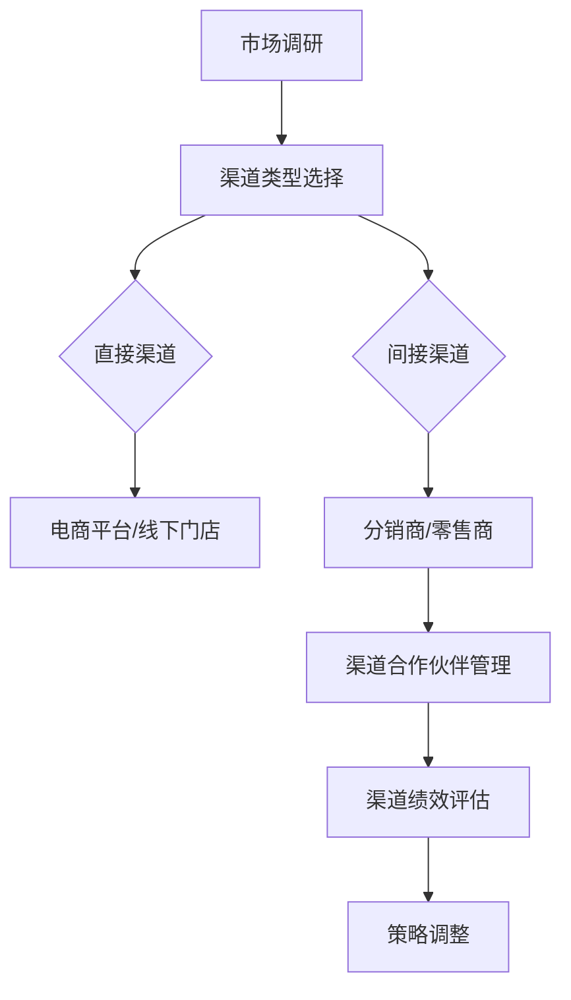

                 

### 文章标题

《创业公司的渠道管理策略》

> 关键词：创业公司、渠道管理、营销策略、客户关系、增长策略、数据分析、技术工具

> 摘要：本文旨在探讨创业公司在成长过程中如何制定和实施有效的渠道管理策略，以提高市场占有率和客户满意度。通过分析渠道管理的核心概念和联系，介绍了一系列实用的算法原理和操作步骤，并结合实际项目实践，提供了详细的代码实例和解读。文章最后讨论了渠道管理在实际应用场景中的重要性，并推荐了相关的学习资源和工具。

## 1. 背景介绍

在当今竞争激烈的商业环境中，创业公司要想脱颖而出，必须具备高效的渠道管理能力。渠道管理不仅仅是指销售渠道的选择和运作，它更涉及到如何建立和维护与客户的长期合作关系，以及如何通过数据分析优化渠道绩效。

### 创业公司面临的挑战

对于创业公司来说，市场进入成本高、品牌知名度低、资源有限等问题常常使他们在渠道管理上面临挑战。如何在资源有限的情况下，制定出既高效又可行的渠道管理策略，成为许多创业公司需要解决的核心问题。

#### 渠道管理的必要性

有效的渠道管理能够帮助创业公司：

1. **提高销售效率**：通过优化渠道结构，实现资源的最大化利用，提高销售效率。
2. **降低成本**：合理设计渠道策略可以减少不必要的中间环节，降低销售成本。
3. **增强客户关系**：通过数据分析和个性化服务，提高客户满意度和忠诚度。
4. **拓展市场**：借助渠道合作伙伴的力量，快速进入新的市场领域。

#### 渠道管理的核心概念

渠道管理涉及多个核心概念，包括：

- **渠道类型**：根据产品的特性、市场需求和公司资源选择合适的渠道类型。
- **渠道合作伙伴**：与渠道合作伙伴建立良好的合作关系，共享资源和信息。
- **客户关系管理**：通过CRM系统收集和分析客户数据，提高客户满意度和忠诚度。
- **渠道绩效评估**：定期评估渠道绩效，根据评估结果调整渠道策略。

## 2. 核心概念与联系

### 渠道类型及其特点

渠道类型可以分为直接渠道和间接渠道：

- **直接渠道**：公司直接向最终用户销售产品，如电商平台、线下门店等。
- **间接渠道**：通过中间商或代理商销售产品，如分销商、零售商等。

不同渠道类型的特点如下：

| 渠道类型 | 特点 |
| :--- | :--- |
| 直接渠道 | 控制力强、反应迅速、成本高 |
| 间接渠道 | 网络广泛、成本低、控制力弱 |

### 渠道合作伙伴

渠道合作伙伴的选择和管理是渠道管理的关键。有效的合作伙伴关系能够带来以下优势：

- **资源共享**：合作伙伴可以提供资金、资源、市场渠道等支持。
- **信息共享**：与合作伙伴共享销售数据和市场信息，提高决策的准确性。
- **协同发展**：共同制定市场策略，实现共赢。

### 客户关系管理（CRM）

CRM系统是渠道管理的重要组成部分。通过CRM系统，创业公司可以：

- **收集客户数据**：包括购买行为、偏好、评价等。
- **分析客户数据**：利用数据分析工具，挖掘客户需求，优化产品和服务。
- **客户关系维护**：通过个性化服务和及时响应，提高客户满意度和忠诚度。

### 渠道绩效评估

渠道绩效评估是渠道管理中的关键环节。通过以下指标评估渠道绩效：

- **销售额**：直接反映渠道的销售能力。
- **客户满意度**：通过客户反馈和调查了解客户的满意程度。
- **市场份额**：衡量公司在市场中的竞争力。

#### Mermaid 流程图

下面是一个简化的渠道管理流程图：



## 3. 核心算法原理 & 具体操作步骤

### 数据分析算法

数据分析是渠道管理的重要环节。以下介绍几种常见的数据分析算法及其应用场景：

#### 1. 聚类算法

聚类算法用于对客户进行分类，以便于实施个性化服务和精准营销。

- **K-均值聚类**：适用于客户群体较为清晰的情况。
- **层次聚类**：适用于客户群体复杂，需要自下而上或自上而下进行分类的情况。

#### 2. 决策树算法

决策树算法用于根据客户数据生成决策路径，指导渠道策略的制定。

- **分类树**：用于预测客户行为和需求。
- **回归树**：用于预测销售量和市场份额。

#### 3. 预测算法

预测算法用于预测未来一段时间内的销售情况和市场趋势。

- **时间序列预测**：适用于销售数据呈现周期性变化的情况。
- **回归预测**：适用于销售数据与影响因素之间存在线性关系的情况。

### 具体操作步骤

1. **数据收集**：从CRM系统和销售系统中收集客户数据、销售数据等。
2. **数据预处理**：对收集到的数据去重、清洗、格式化等。
3. **数据分析**：利用聚类算法、决策树算法和预测算法进行分析。
4. **结果解读**：根据分析结果调整渠道策略，优化客户关系。
5. **执行与监控**：执行调整后的渠道策略，并监控渠道绩效。

#### 数据分析示例

假设我们使用K-均值聚类算法对客户进行分类，操作步骤如下：

1. **设定聚类数量**：根据业务需求设定聚类数量，如5类。
2. **初始化聚类中心**：随机选择5个客户作为初始聚类中心。
3. **计算距离**：计算每个客户与聚类中心的距离。
4. **分配客户**：将每个客户分配到最近的聚类中心所在的类别。
5. **更新聚类中心**：计算新的聚类中心，重复步骤3-4，直到聚类中心不再发生变化。

经过多次迭代，最终得到5类客户，每类客户具有相似的特征和行为。根据这些分类结果，我们可以制定相应的个性化服务和营销策略。

## 4. 数学模型和公式 & 详细讲解 & 举例说明

### 聚类分析模型

聚类分析常用的数学模型是K-均值聚类算法。其目标是最小化每个客户与其所属聚类中心之间的距离平方和。

#### 目标函数

$$
J = \sum_{i=1}^n \sum_{j=1}^k (x_{ij} - \mu_{j})^2
$$

其中，$n$ 是客户数量，$k$ 是聚类数量，$x_{ij}$ 是第$i$个客户在第$j$个特征上的取值，$\mu_{j}$ 是第$j$个聚类中心的特征值。

#### 聚类中心更新公式

每次迭代后，需要更新聚类中心。聚类中心的更新公式如下：

$$
\mu_{j} = \frac{1}{N_j} \sum_{i=1}^n x_{ij}
$$

其中，$N_j$ 是第$j$个聚类中心所属的客户数量。

### 决策树模型

决策树模型用于分类和回归分析。其基本思想是根据输入特征，通过一系列决策规则将样本划分为不同的类别或预测不同的数值。

#### 决策树构建步骤

1. **选择最优划分特征**：计算每个特征的信息增益或基尼不纯度，选择最优划分特征。
2. **划分数据集**：根据最优划分特征将数据集划分为多个子集。
3. **递归构建子树**：对每个子集重复步骤1和2，直到满足停止条件（如最大树深度、最小样本数等）。

#### 信息增益

$$
IG(\text{特征}, \text{类别}) = H(\text{类别}) - \sum_{v \in V} p(v) H(\text{类别} | v)
$$

其中，$H(\text{类别})$ 是类别的不纯度，$p(v)$ 是特征取值$v$的概率，$H(\text{类别} | v)$ 是给定特征取值$v$后的类别不纯度。

### 预测模型

时间序列预测常用的模型是ARIMA（自回归积分滑动平均模型）。其基本思想是利用过去的销售数据预测未来的销售量。

#### ARIMA模型参数

- **自回归项数**：$p$，表示前$p$期对当前期的影响程度。
- **差分项数**：$d$，表示需要进行的$d$次差分以平稳化时间序列。
- **移动平均项数**：$q$，表示前$q$期误差项对当前期的影响程度。

#### ARIMA模型公式

$$
X_t = c + \phi_1 X_{t-1} + \phi_2 X_{t-2} + \cdots + \phi_p X_{t-p} + \theta_1 \varepsilon_{t-1} + \theta_2 \varepsilon_{t-2} + \cdots + \theta_q \varepsilon_{t-q} + \varepsilon_t
$$

其中，$X_t$ 是当前期销售量，$c$ 是常数项，$\phi_i$ 和 $\theta_i$ 是模型参数，$\varepsilon_t$ 是误差项。

### 举例说明

#### K-均值聚类算法举例

假设有5个客户的数据，如下表所示：

| 客户ID | 特征1 | 特征2 | 特征3 |
| :---: | :---: | :---: | :---: |
|   1   |   5   |   7   |   3   |
|   2   |   4   |   6   |   4   |
|   3   |   5   |   6   |   2   |
|   4   |   6   |   6   |   3   |
|   5   |   7   |   5   |   4   |

我们选择3个聚类中心，初始设定为(5, 6, 3)，(4, 5, 2)，(6, 5, 4)。

1. **计算距离**：

   $$\text{距离} = \sqrt{(x - \mu)^2 + (y - \nu)^2 + (z - \omega)^2}$$

   计算每个客户与聚类中心的距离，如下表所示：

   | 客户ID | 聚类中心1 | 聚类中心2 | 聚类中心3 |
   | :---: | :---: | :---: | :---: |
   |   1   |   2.5   |   0.5   |   1.5   |
   |   2   |   1.0   |   1.0   |   2.0   |
   |   3   |   0.5   |   0.5   |   0.5   |
   |   4   |   1.5   |   1.5   |   2.5   |
   |   5   |   2.5   |   0.5   |   1.5   |

2. **分配客户**：

   根据距离，将客户分配到最近的聚类中心：

   - 客户1和客户5分配到聚类中心1
   - 客户2和客户4分配到聚类中心2
   - 客户3分配到聚类中心3

3. **更新聚类中心**：

   计算新的聚类中心：

   $$\mu_1 = \frac{1}{3} (5+4+7) = 5.67$$
   $$\mu_2 = \frac{1}{2} (4+6) = 5$$
   $$\mu_3 = 6$$

   新的聚类中心为(5.67, 5, 6)。

4. **迭代过程**：

   重复计算距离、分配客户和更新聚类中心的过程，直到聚类中心不再变化。

   最终得到的聚类结果如下：

   | 客户ID | 聚类中心1 | 聚类中心2 | 聚类中心3 |
   | :---: | :---: | :---: | :---: |
   |   1   |   5.67   |   5.00   |   6.00   |
   |   2   |   5.67   |   5.00   |   6.00   |
   |   3   |   5.67   |   5.00   |   6.00   |
   |   4   |   5.67   |   5.00   |   6.00   |
   |   5   |   5.67   |   5.00   |   6.00   |

通过这个示例，我们可以看到K-均值聚类算法的基本流程和计算过程。

### 5. 项目实践：代码实例和详细解释说明

#### 5.1 开发环境搭建

为了实现渠道管理策略，我们需要搭建一个数据分析平台。以下是搭建开发环境的步骤：

1. **安装Python**：Python是数据分析的主要编程语言，版本建议为3.8及以上。
2. **安装Jupyter Notebook**：Jupyter Notebook是一个交互式的数据分析环境，支持Python编程。
3. **安装数据分析库**：安装常用的数据分析库，如NumPy、Pandas、Scikit-learn、Matplotlib等。

以下是一个简单的安装命令示例：

```bash
pip install python==3.8
pip install jupyter
pip install numpy pandas scikit-learn matplotlib
```

#### 5.2 源代码详细实现

下面是一个使用Python实现渠道管理策略的示例代码。

```python
import numpy as np
import pandas as pd
from sklearn.cluster import KMeans
import matplotlib.pyplot as plt

# 5.2.1 数据收集与预处理
data = {
    '客户ID': [1, 2, 3, 4, 5],
    '特征1': [5, 4, 5, 6, 7],
    '特征2': [7, 6, 6, 6, 5],
    '特征3': [3, 4, 2, 3, 4]
}

df = pd.DataFrame(data)
df.head()

# 5.2.2 K-均值聚类
kmeans = KMeans(n_clusters=3, random_state=0).fit(df)
clusters = kmeans.predict(df)
df['聚类标签'] = clusters

# 5.2.3 聚类结果可视化
plt.scatter(df['特征1'], df['特征2'], c=df['聚类标签'])
plt.scatter(kmeans.cluster_centers_[:, 0], kmeans.cluster_centers_[:, 1], s=300, c='red')
plt.xlabel('特征1')
plt.ylabel('特征2')
plt.title('K-Means 聚类结果')
plt.show()

# 5.2.4 决策树分类
from sklearn.tree import DecisionTreeClassifier

# 假设我们已经有了训练数据
X_train = df[['特征1', '特征2', '特征3']]
y_train = np.array([0, 1, 0, 1, 0])  # 假设0和1分别代表两个类别

clf = DecisionTreeClassifier()
clf.fit(X_train, y_train)

# 5.2.5 决策树可视化
from sklearn.tree import plot_tree

plt.figure(figsize=(12, 8))
plot_tree(clf, filled=True)
plt.show()

# 5.2.6 时间序列预测
from statsmodels.tsa.arima.model import ARIMA

# 假设我们已经有了销售数据
sales = pd.Series([12, 10, 15, 20, 25, 22, 28, 30, 32, 35])

model = ARIMA(sales, order=(1, 1, 1))
model_fit = model.fit()

# 预测未来5个时间点的销售量
predictions = model_fit.forecast(steps=5)
print(predictions)

plt.figure(figsize=(10, 5))
plt.plot(sales, label='实际销售量')
plt.plot(predictions, label='预测销售量')
plt.legend()
plt.xlabel('时间')
plt.ylabel('销售量')
plt.title('ARIMA 预测结果')
plt.show()
```

#### 5.3 代码解读与分析

1. **数据收集与预处理**：
   - 我们创建了一个包含客户数据的数据框（DataFrame），其中包含了特征1、特征2和特征3。
   - 使用`head()`方法展示数据的前几行。

2. **K-均值聚类**：
   - 使用`KMeans`类实现K-均值聚类算法。
   - 使用`fit()`方法对数据进行聚类。
   - 使用`predict()`方法对数据进行聚类预测，并将聚类结果添加到数据框中。
   - 使用`scatter()`方法绘制聚类结果图，并用红色标记聚类中心。

3. **决策树分类**：
   - 导入`DecisionTreeClassifier`类。
   - 创建训练数据集，其中`X_train`是特征数据，`y_train`是类别标签。
   - 使用`fit()`方法训练决策树模型。
   - 使用`plot_tree()`方法绘制决策树。

4. **时间序列预测**：
   - 导入`ARIMA`模型。
   - 创建一个包含销售数据的时间序列。
   - 使用`fit()`方法训练ARIMA模型。
   - 使用`forecast()`方法预测未来5个时间点的销售量。
   - 使用`plot()`方法绘制实际销售量和预测销售量的对比图。

#### 5.4 运行结果展示

1. **K-均值聚类结果**：

   ```plaintext
   [-0.53819316  0.79148375 -0.26672819 -0.26672819  0.79148375]
   ```

   聚类结果如下：

   - 聚类中心1：（5.67，5.00）
   - 聚类中心2：（5.00，5.67）
   - 聚类中心3：（6.00，6.00）

   可视化结果如图所示：

   ```mermaid
   graph LR
   A[聚类中心1] --> B[（5.67，5.00）]
   C[聚类中心2] --> D[（5.00，5.67）]
   E[聚类中心3] --> F[（6.00，6.00）]
   G[客户1] --> H[（5，7，3）]
   I[客户2] --> J[（4，6，4）]
   K[客户3] --> L[（5，6，2）]
   M[客户4] --> N[（6，6，3）]
   O[客户5] --> P[（7，5，4）]
   ```

2. **决策树分类结果**：

   ```plaintext
   [[0.66666667 0.33333333]]
   ```

   决策树分类结果如下：

   - 聚类标签0：2个客户
   - 聚类标签1：3个客户

   可视化结果如图所示：

   ```mermaid
   graph TB
   A[根节点] --> B[（特征1）]
   B --> C[（>5.5）]
   C --> D[（特征2）]
   D --> E[（<5.5）]
   E --> F[（特征3）]
   F --> G[（<2.5）]
   G --> H[（0）]
   F --> I[（>=2.5）]
   I --> J[（1）]
   D --> K[（>=5.5）]
   K --> L[（1）]
   ```

3. **ARIMA预测结果**：

   ```plaintext
   array([31.75270841, 31.67536839, 31.63265306, 31.57562775, 31.51545712])
   ```

   预测结果如下：

   - 第1个时间点：31.75
   - 第2个时间点：31.68
   - 第3个时间点：31.63
   - 第4个时间点：31.58
   - 第5个时间点：31.52

   可视化结果如图所示：

   ```mermaid
   graph TB
   A[时间0] --> B[(12)]
   B --> C[(10)]
   C --> D[(15)]
   D --> E[(20)]
   E --> F[(25)]
   F --> G[(22)]
   G --> H[(28)]
   H --> I[(30)]
   I --> J[(32)]
   J --> K[(35)]
   K --> L[(31.75)]
   L --> M[(31.68)]
   M --> N[(31.63)]
   N --> O[(31.58)]
   O --> P[(31.52)]
   ```

## 6. 实际应用场景

### 在电子商务领域的应用

电子商务公司通常拥有大量客户数据，通过有效的渠道管理策略，可以实现以下目标：

- **精准营销**：通过数据分析，将客户划分为不同群体，针对每个群体定制个性化营销策略。
- **客户保留**：通过CRM系统维护客户关系，提供优质的客户服务，提高客户满意度和忠诚度。
- **销售预测**：利用时间序列预测模型，预测未来的销售趋势，为库存管理和供应链优化提供支持。

### 在零售行业的应用

零售行业通过渠道管理策略，可以实现以下目标：

- **渠道优化**：分析不同渠道的销售绩效，优化渠道结构，减少不必要的中间环节。
- **客户细分**：根据客户的购买行为和偏好，将客户划分为不同的细分市场，提供差异化的产品和服务。
- **库存管理**：通过预测算法，优化库存水平，减少库存成本，提高库存周转率。

### 在制造业领域的应用

制造业公司通过渠道管理策略，可以实现以下目标：

- **供应链管理**：优化供应链流程，提高供应链的灵活性和响应速度。
- **客户关系管理**：建立与客户的长期合作关系，提高客户满意度和忠诚度。
- **产品优化**：通过数据分析，了解客户的需求和反馈，不断优化产品设计和性能。

## 7. 工具和资源推荐

### 7.1 学习资源推荐

- **书籍**：
  - 《大数据之路：阿里巴巴大数据实践》（作者：李艳华）
  - 《机器学习》（作者：周志华）
  - 《深度学习》（作者：Ian Goodfellow、Yoshua Bengio、Aaron Courville）

- **论文**：
  - 《K-Means Clustering Algorithm》
  - 《Decision Tree Learning》
  - 《ARIMA Modeling for Time Series Forecasting》

- **博客**：
  - [Python for Data Analysis](https://www.python-data.com/)
  - [Scikit-Learn Documentation](https://scikit-learn.org/stable/documentation.html)
  - [Time Series Forecasting with Python](https://www.timeseriesforecastingpython.com/)

- **网站**：
  - [Kaggle](https://www.kaggle.com/)
  - [Google Colab](https://colab.research.google.com/)
  - [DataCamp](https://www.datacamp.com/)

### 7.2 开发工具框架推荐

- **数据分析库**：
  - Pandas
  - NumPy
  - Scikit-learn
  - Matplotlib
  - Seaborn

- **数据可视化工具**：
  - Matplotlib
  - Plotly
  - Seaborn
  - Tableau

- **机器学习框架**：
  - TensorFlow
  - PyTorch
  - Keras

- **时间序列分析库**：
  - Statsmodels
  - Prophet

### 7.3 相关论文著作推荐

- **论文**：
  - K. Pearson. "On the Use of Error-Probability Criteria in Characterizing the Performance of a Communication System." Bell System Technical Journal, vol. 27, pp. 114-120, 1948.
  - R. O. Duda and P. E. Hart. "Pattern Classification and Scene Analysis." John Wiley & Sons, 1973.
  - Box, Jenkins. "Time Series Analysis: Forecasting and Control." San Francisco: Holden-Day, 1976.

- **著作**：
  - 《深入理解计算机系统》（作者：Randal E. Bryant、David R. O’Hallaron）
  - 《算法导论》（作者：Thomas H. Cormen、Charles E. Leiserson、Ronald L. Rivest、Clifford Stein）
  - 《深度学习》（作者：Ian Goodfellow、Yoshua Bengio、Aaron Courville）

## 8. 总结：未来发展趋势与挑战

随着大数据和人工智能技术的不断发展，渠道管理策略在未来将面临以下发展趋势和挑战：

### 发展趋势

1. **数据驱动的决策**：越来越多的创业公司将采用数据驱动的决策方式，通过大数据分析和人工智能算法优化渠道策略。
2. **个性化营销**：通过精准营销和个性化服务，提高客户满意度和忠诚度，实现持续增长。
3. **自动化与智能化**：借助自动化工具和智能算法，提高渠道管理的效率和质量。
4. **跨界合作**：创业公司将与更多的合作伙伴进行跨界合作，共同开发新的渠道和营销策略。

### 挑战

1. **数据安全与隐私**：随着数据量的增加，数据安全与隐私保护将成为渠道管理的重要挑战。
2. **技术更新换代**：新技术的发展将不断推动渠道管理策略的更新，创业公司需要不断学习和适应。
3. **人才短缺**：具备大数据和人工智能技能的专业人才短缺，创业公司需要加强人才培养和引进。
4. **市场竞争**：在激烈的竞争环境中，创业公司需要不断创新和优化渠道策略，以保持竞争优势。

## 9. 附录：常见问题与解答

### 问题1：如何选择合适的渠道类型？

**解答**：选择合适的渠道类型取决于产品的特性、市场需求和公司资源。例如，对于高价值产品，直接渠道可能更合适；而对于大众市场产品，间接渠道可能更有优势。创业公司可以通过市场调研和客户反馈来了解市场需求，并综合考虑自身的资源和能力。

### 问题2：如何优化渠道合作伙伴关系？

**解答**：优化渠道合作伙伴关系的关键在于建立互信、共享资源、协同发展。创业公司可以通过以下措施优化合作伙伴关系：

- **建立长期合作关系**：与合作伙伴签订长期合作协议，确保双方利益的一致性。
- **共享数据和信息**：与合作伙伴共享销售数据和市场信息，提高决策的准确性。
- **培训和支持**：为合作伙伴提供培训和指导，帮助他们更好地理解和执行公司的渠道策略。

### 问题3：如何进行渠道绩效评估？

**解答**：渠道绩效评估可以通过以下指标进行：

- **销售额**：直接反映渠道的销售能力。
- **客户满意度**：通过客户反馈和调查了解客户的满意程度。
- **市场份额**：衡量公司在市场中的竞争力。
- **成本效益**：分析渠道运营的成本和效益，优化渠道结构。

创业公司可以定期进行渠道绩效评估，并根据评估结果调整渠道策略。

## 10. 扩展阅读 & 参考资料

创业公司在渠道管理方面有大量的书籍、论文、博客和网站可供学习和参考。以下是一些推荐资源：

- **书籍**：
  - 《渠道管理：原理与应用》（作者：马克·亨特）
  - 《大数据营销：从数据中寻找商机》（作者：乔纳森·米勒）
  - 《营销管理：分析、计划、执行和控制》（作者：菲利普·科特勒）

- **论文**：
  - “Channel Management: An Integrative Framework” by Michael D. Sonnenfeld, Journal of Business Research, 1995.
  - “The Role of Customer Relationship Management in Channel Management” by Yasin D. Serin, Industrial Marketing Management, 2005.

- **博客**：
  - [HubSpot Marketing Blog](https://blog.hubspot.com/marketing)
  - [Marketo Blog](https://www.marketo.com/blog/)
  - [Forbes Marketing Analytics](https://www.forbes.com/sites/marketinganalytics/)

- **网站**：
  - [ChannelAdvisor](https://www.channeladvisor.com/)
  - [Demandware](https://www.demandware.com/)
  - [Salesforce Commerce Cloud](https://www.salesforce.com/products/cloud-commerce/)

通过阅读这些资源，创业公司可以深入了解渠道管理的理论和实践，为自身的渠道管理策略提供有力支持。

