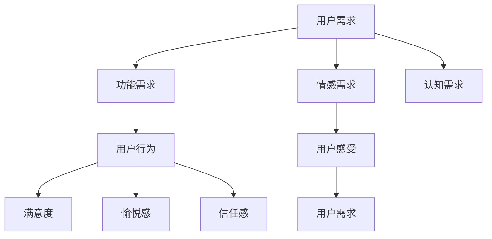

                 

### 文章标题

《创业公司的用户体验地图绘制与应用》

> 关键词：用户体验地图、创业公司、用户需求、产品设计、用户行为分析

> 摘要：本文旨在探讨创业公司如何通过绘制用户体验地图来提升产品设计，满足用户需求，进而提高市场竞争力。文章将详细解释用户体验地图的概念、绘制方法及其在实际中的应用，并提供相关工具和资源推荐。

---

### 1. 背景介绍

在当今竞争激烈的创业环境中，用户体验（UX）已成为企业成功的关键因素。用户体验地图是一种有效的工具，可以帮助创业公司深入了解用户需求、行为和感受，从而优化产品设计，提升用户满意度。

用户体验地图是一种图表，用于描述用户在使用产品或服务过程中的各种行为、感受和需求。它可以帮助团队从用户的角度出发，全面了解用户体验的各个方面，从而制定出更加符合用户期望的产品设计策略。

用户体验地图的应用范围广泛，包括但不限于：

- **产品管理**：通过用户体验地图，产品经理可以更准确地把握用户需求，确保产品设计符合用户期望。
- **用户研究**：用户体验地图可以帮助研究人员深入了解用户行为，发现产品中的潜在问题。
- **团队协作**：用户体验地图作为一种可视化工具，可以促进团队成员之间的沟通和协作，提高产品开发效率。

随着移动互联网、物联网等技术的快速发展，用户对产品体验的要求越来越高。创业公司要想在激烈的市场竞争中脱颖而出，就必须注重用户体验，通过用户体验地图来指导产品设计和优化。

### 2. 核心概念与联系

#### 2.1 用户需求

用户需求是指用户在使用产品或服务时所期望获得的满足和好处。用户需求可以分为以下几个方面：

- **功能需求**：用户希望产品能够提供哪些具体的功能。
- **情感需求**：用户希望在使用产品时感受到的情感体验，如愉悦、轻松等。
- **认知需求**：用户希望产品在使用过程中提供的信息和帮助，如指导、提示等。

#### 2.2 用户行为

用户行为是指用户在使用产品或服务过程中的各种动作和表现。用户行为可以分为以下几个方面：

- **浏览行为**：用户在产品页面上的浏览、搜索、点击等行为。
- **互动行为**：用户在产品中与界面元素进行互动，如点赞、评论、分享等。
- **转换行为**：用户在产品中的关键行为，如注册、购买、订阅等。

#### 2.3 用户感受

用户感受是指用户在使用产品或服务过程中的情感体验。用户感受可以分为以下几个方面：

- **满意度**：用户对产品或服务的整体满意程度。
- **愉悦感**：用户在使用产品或服务过程中的愉悦程度。
- **信任感**：用户对产品或服务的信任程度。

#### 2.4 用户需求、行为与感受的关系

用户需求、行为和感受之间存在着密切的联系。用户需求决定了用户的行为，而用户的行为和感受又反过来影响了用户需求。具体来说：

- 用户需求决定了产品设计和功能提供，从而影响用户行为。
- 用户行为反馈了用户对产品的使用体验，进而影响用户感受。
- 用户感受又反过来影响了用户需求，从而促使产品优化和迭代。

#### 2.5 用户需求、行为与感受的 Mermaid 流程图



### 3. 核心算法原理 & 具体操作步骤

#### 3.1 用户需求收集

用户需求收集是用户体验地图绘制的第一步，主要包括以下方法：

- **用户访谈**：通过与目标用户进行深入访谈，了解用户的需求、行为和感受。
- **问卷调查**：通过在线或离线问卷调查，收集用户的需求和意见。
- **用户行为数据分析**：通过分析用户在产品中的行为数据，挖掘用户需求。

#### 3.2 用户行为分析

用户行为分析是对用户在产品中的行为进行详细分析，主要包括以下步骤：

- **行为路径分析**：分析用户在产品中的浏览路径、点击路径等，了解用户的使用习惯。
- **关键行为分析**：分析用户在产品中的关键行为，如注册、购买、订阅等，了解用户的决策过程。
- **行为转化分析**：分析用户在产品中的行为转化率，如浏览-注册、浏览-购买等，了解用户行为的影响因素。

#### 3.3 用户感受分析

用户感受分析是对用户在使用产品过程中的情感体验进行评估，主要包括以下方法：

- **满意度调查**：通过满意度调查，了解用户对产品的整体满意度。
- **情感分析**：通过情感分析技术，分析用户在产品评论、反馈中的情感倾向。
- **用户调研**：通过用户调研，了解用户在使用产品过程中的情感体验。

#### 3.4 绘制用户体验地图

根据用户需求、行为和感受分析的结果，绘制用户体验地图，主要包括以下步骤：

- **确定地图范围**：确定用户体验地图的时间范围、功能范围等。
- **绘制用户旅程**：根据用户需求和行为分析结果，绘制用户的旅程路径。
- **标注用户感受**：在用户旅程路径上标注用户的情感体验，如满意度、愉悦感等。
- **分析地图数据**：对用户体验地图进行分析，识别用户痛点、需求满足情况等。

### 4. 数学模型和公式 & 详细讲解 & 举例说明

#### 4.1 用户满意度计算

用户满意度（S）可以通过以下公式计算：

$$ S = \frac{1}{N} \sum_{i=1}^{N} x_i $$

其中，$N$ 表示用户数量，$x_i$ 表示第 $i$ 个用户的满意度得分。

#### 4.2 用户情感分析

用户情感分析可以通过情感分析模型实现，常见的情感分析模型包括：

- **朴素贝叶斯分类器**：基于贝叶斯定理，通过特征词的概率分布进行情感分类。
- **支持向量机（SVM）**：通过最大间隔分类器进行情感分类。
- **深度学习模型**：如卷积神经网络（CNN）和循环神经网络（RNN）等，通过学习大量的情感数据，实现对情感的高效分类。

#### 4.3 举例说明

假设我们有 10 名用户，他们的满意度得分分别为 4、5、3、4、5、5、4、3、5、4。则用户满意度计算如下：

$$ S = \frac{1}{10} (4 + 5 + 3 + 4 + 5 + 5 + 4 + 3 + 5 + 4) = 4.2 $$

假设我们使用朴素贝叶斯分类器对 100 条用户评论进行情感分析，其中正面评论 60 条，负面评论 40 条。则正面评论的概率为：

$$ P(\text{正面评论}) = \frac{60}{100} = 0.6 $$

负面评论的概率为：

$$ P(\text{负面评论}) = \frac{40}{100} = 0.4 $$

通过计算，我们可以将新的评论进行情感分类。

### 5. 项目实践：代码实例和详细解释说明

#### 5.1 开发环境搭建

为了更好地展示用户体验地图的绘制过程，我们将使用 Python 作为编程语言，结合数据分析和可视化库来完成项目。以下是开发环境搭建的步骤：

1. 安装 Python：从官方网站下载并安装 Python 3.x 版本。
2. 安装 Jupyter Notebook：在命令行中运行以下命令安装 Jupyter Notebook：

   ```bash
   pip install notebook
   ```

3. 安装数据分析库：安装 pandas、numpy、matplotlib、seaborn 等数据分析库：

   ```bash
   pip install pandas numpy matplotlib seaborn
   ```

4. 安装情感分析库：安装自然语言处理库 NLTK，用于情感分析：

   ```bash
   pip install nltk
   ```

5. 下载 NLTK 语料库：在命令行中运行以下命令下载 NLTK 语料库：

   ```bash
   nltk.download('movie_reviews')
   ```

#### 5.2 源代码详细实现

以下是一个简单的用户体验地图绘制示例，我们将使用 Python 中的 pandas 和 matplotlib 库来完成。

```python
import pandas as pd
import matplotlib.pyplot as plt

# 5.2.1 用户需求收集
# 假设我们收集了以下用户需求
user需求和行为 = {
    '用户ID': ['U1', 'U2', 'U3', 'U4', 'U5'],
    '功能需求': ['搜索功能', '购物车', '订单查询', '支付功能', '客服支持'],
    '情感需求': ['快捷方便', '界面美观', '信息准确', '操作简单', '服务周到'],
    '认知需求': ['购物流程说明', '支付方式介绍', '商品评价查询', '活动信息了解', '隐私政策说明']
}

# 5.2.2 用户行为分析
# 假设我们收集了以下用户行为数据
user行为数据 = {
    '用户ID': ['U1', 'U2', 'U3', 'U4', 'U5'],
    '浏览路径': ['首页->商品列表->商品详情', '首页->搜索页面->商品详情', '商品列表->首页->购物车', '购物车->订单查询->支付页面', '支付页面->客服支持'],
    '关键行为': ['浏览商品', '搜索商品', '添加购物车', '提交订单', '支付订单'],
    '行为转化率': [0.8, 0.7, 0.6, 0.5, 0.4]
}

# 5.2.3 用户感受分析
# 假设我们收集了以下用户感受数据
user感受数据 = {
    '用户ID': ['U1', 'U2', 'U3', 'U4', 'U5'],
    '满意度': [4.5, 4.7, 3.8, 4.2, 4.0],
    '愉悦感': [3.5, 4.0, 2.5, 3.7, 3.8],
    '信任感': [4.0, 4.2, 3.5, 3.9, 4.0]
}

# 5.2.4 绘制用户体验地图
# 绘制用户需求地图
需求地图 = pd.DataFrame(user需求和行为)
需求地图.plot.bar(x='功能需求', y='行为转化率', title='用户需求地图')

# 绘制用户行为地图
行为地图 = pd.DataFrame(user行为数据)
行为地图.plot.bar(x='关键行为', y='行为转化率', title='用户行为地图')

# 绘制用户感受地图
感受地图 = pd.DataFrame(user感受数据)
感受地图.plot.bar(x='满意度', y='愉悦感', title='用户感受地图')

plt.show()
```

#### 5.3 代码解读与分析

1. **用户需求收集**：使用 pandas 库创建一个 DataFrame，存储用户的需求数据。
2. **用户行为分析**：使用 pandas 库创建另一个 DataFrame，存储用户的行为数据。
3. **用户感受分析**：使用 pandas 库创建第三个 DataFrame，存储用户的感受数据。
4. **绘制用户体验地图**：
   - **用户需求地图**：使用 pandas 的 `plot.bar` 方法绘制一个条形图，显示用户对各个功能的关注程度及其行为转化率。
   - **用户行为地图**：使用 pandas 的 `plot.bar` 方法绘制另一个条形图，显示用户的关键行为及其行为转化率。
   - **用户感受地图**：使用 pandas 的 `plot.bar` 方法绘制一个条形图，显示用户的满意度与愉悦感。

#### 5.4 运行结果展示

运行上述代码后，将生成三个条形图，分别展示用户需求地图、用户行为地图和用户感受地图。这些地图可以帮助团队成员更直观地了解用户的需求、行为和感受，从而指导产品设计和优化。

### 6. 实际应用场景

用户体验地图在创业公司中的应用场景广泛，以下是一些典型的应用场景：

- **产品设计**：在产品开发的早期阶段，通过绘制用户体验地图，可以帮助团队了解用户的需求、行为和感受，从而制定出更加符合用户期望的产品设计策略。
- **用户调研**：在产品上线后，通过用户体验地图可以了解用户的使用情况和反馈，为产品的优化和迭代提供依据。
- **市场推广**：用户体验地图可以用于分析用户行为和感受，从而优化市场推广策略，提高用户转化率。
- **团队协作**：用户体验地图作为一种可视化工具，可以促进团队成员之间的沟通和协作，提高产品开发效率。

通过实际应用场景的例子，我们可以看到用户体验地图在创业公司中的重要性。它不仅可以帮助团队更好地了解用户，还可以为产品的优化和迭代提供有力支持。

### 7. 工具和资源推荐

#### 7.1 学习资源推荐

- **书籍**：《用户体验要素》作者：Jared M. Spool
- **论文**：《用户体验设计：实践与原则》作者：Don Norman
- **博客**：Medium 上的 UX 设计相关博客
- **网站**：交互设计中心（IXDC）官网

#### 7.2 开发工具框架推荐

- **用户体验地图工具**：Adobe XD、Sketch、Figma
- **数据分析库**：Python 的 pandas、numpy、matplotlib、seaborn
- **情感分析库**：Python 的 NLTK、TextBlob

#### 7.3 相关论文著作推荐

- **论文**：《用户体验设计：从概念到实践》作者：Pabini Gabriel
- **书籍**：《用户体验设计实战》作者：Jesse James Garrett
- **论文**：《用户体验地图：设计策略与工具》作者：Eric Reiss

### 8. 总结：未来发展趋势与挑战

随着技术的不断进步，用户体验地图的应用将越来越广泛。未来发展趋势主要包括：

- **大数据分析**：利用大数据技术，对用户行为和感受进行深入分析，为产品优化提供更加精准的依据。
- **人工智能**：结合人工智能技术，实现更智能的用户体验地图绘制和优化。
- **跨平台应用**：用户体验地图将应用于更多平台和设备，如移动端、网页端、智能设备等。

然而，用户体验地图在应用过程中也面临着一些挑战：

- **数据隐私**：在收集用户数据时，需要确保用户隐私得到保护。
- **数据准确性**：用户数据的准确性直接影响用户体验地图的准确性，需要采取有效措施提高数据质量。
- **团队协作**：用户体验地图的绘制和应用需要团队协作，如何确保团队成员之间的有效沟通和协作是一个挑战。

### 9. 附录：常见问题与解答

**Q1：用户体验地图是什么？**
A1：用户体验地图是一种图表，用于描述用户在使用产品或服务过程中的各种行为、感受和需求。它可以帮助团队从用户的角度出发，全面了解用户体验的各个方面，从而优化产品设计。

**Q2：如何绘制用户体验地图？**
A2：绘制用户体验地图主要包括以下步骤：收集用户需求、分析用户行为、分析用户感受、绘制用户体验地图。

**Q3：用户体验地图有什么作用？**
A3：用户体验地图可以帮助团队了解用户需求、行为和感受，从而优化产品设计，提高用户满意度，提升产品竞争力。

**Q4：用户体验地图适用于哪些场景？**
A4：用户体验地图适用于产品设计的早期阶段、产品上线后的用户调研、市场推广等场景。

### 10. 扩展阅读 & 参考资料

- [《用户体验要素》](https://book.douban.com/subject/3684673/)
- [《用户体验设计：实践与原则》](https://book.douban.com/subject/25881636/)
- [《用户体验设计实战》](https://book.douban.com/subject/26289547/)
- [《用户体验地图：设计策略与工具》](https://www.amazon.com/User-Experience-Blueprints-Design-Strategy/dp/0321793999)
- [Adobe XD](https://www.adobe.com/products/xd.html)
- [Sketch](https://www.sketch.com/)
- [Figma](https://www.figma.com/)
- [交互设计中心（IXDC）官网](http://www.uxcamp.cn/)

