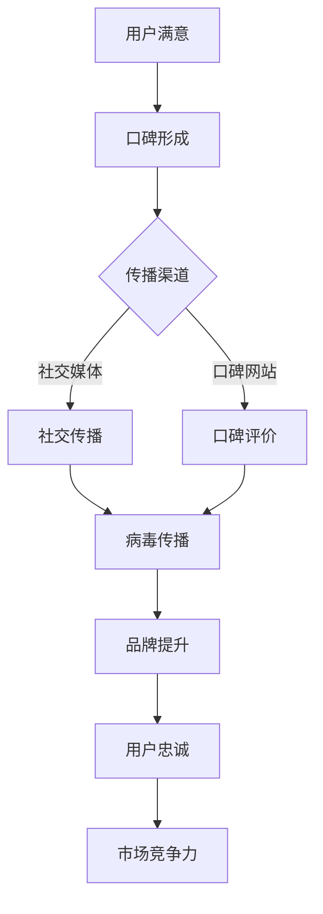

                 

### 背景介绍

#### 用户口碑营销的重要性

用户口碑营销，也被称作口碑传播（Word of Mouth Marketing, WOM），是现代营销战略中至关重要的一环。它指的是消费者基于个人体验，通过非正式渠道对产品或服务的正面或负面评价，从而影响其他潜在消费者的购买决策。口碑营销不仅成本低廉，而且更具可信度和影响力，是品牌建立忠实客户群、提升市场份额的重要手段。

在当今数字化时代，社交媒体的兴起为用户口碑营销提供了新的平台。社交媒体平台如Facebook、Twitter、Instagram和LinkedIn等，已经成为用户交流、分享产品体验的主要场所。这些平台上的口碑评价和推荐能够迅速传播，形成病毒式营销效果，极大地放大了品牌的影响力。

此外，随着大数据和人工智能技术的发展，企业能够更精准地分析用户行为和需求，进而制定更为有效的口碑营销策略。通过用户画像、社交网络分析和行为预测等技术，企业可以更好地理解用户的口碑传播路径，从而优化营销策略，提高营销效果。

#### 病毒传播的概念与特性

病毒传播（Viral Marketing）是一种借助用户的社交网络和分享行为，迅速扩大品牌知名度和影响力的营销策略。其核心在于制造具有高度传播性的内容和话题，使用户自发地在社交圈中分享和传播，从而达到营销目的。

病毒传播具有以下几个显著特性：

1. **高传播速度**：病毒传播的内容能够迅速在社交网络中传播，甚至在短时间内达到广泛的受众群体。
2. **高参与度**：用户不仅仅是被动接受信息，更愿意主动参与传播，这增强了口碑效应。
3. **高互动性**：病毒传播通常涉及用户之间的互动，如评论、点赞、分享等，提高了用户参与度和品牌黏性。
4. **低成本**：相比于传统广告，病毒传播的成本较低，尤其是通过社交媒体等免费渠道，企业可以以较低的成本实现大规模传播。

病毒传播的成功案例不胜枚举，如红牛的极限运动挑战、宜家的“在家办公空间”照片分享活动等。这些案例表明，病毒传播不仅能够显著提升品牌知名度，还能增强用户对品牌的情感连接。

#### 用户口碑营销与病毒传播的关系

用户口碑营销与病毒传播密不可分，二者相辅相成，共同构成现代营销策略的重要组成部分。用户口碑营销为病毒传播提供了内容基础，即用户真实的体验和评价；而病毒传播则通过高度传播性和参与度，将这些口碑内容迅速扩散到更广泛的受众。

首先，用户口碑营销可以激发病毒传播的潜力。当用户对产品或服务有良好的体验时，他们更有可能通过社交媒体分享自己的体验，进而吸引其他潜在用户关注和参与。这种自发的分享行为，是病毒传播得以实现的关键。

其次，病毒传播能够放大用户口碑营销的效果。通过病毒传播，企业可以迅速将用户的好评传播到大量潜在用户中，从而在短时间内提升品牌知名度和市场影响力。同时，病毒传播的高互动性和参与度，还能增强用户的品牌忠诚度和黏性。

总之，用户口碑营销与病毒传播的结合，不仅能够提高营销效果，还能显著降低营销成本，是企业提升市场竞争力的有力工具。

### 核心概念与联系

#### 用户口碑营销的基本概念

用户口碑营销，顾名思义，是基于用户之间的口碑进行传播和营销的策略。口碑是指用户通过个人体验对产品或服务形成的评价和意见，这些评价和意见能够直接影响其他潜在用户的购买决策。用户口碑营销的核心在于利用用户自身的社交网络，通过非正式渠道传播品牌和产品信息，从而提升品牌知名度和用户忠诚度。

口碑营销的关键要素包括：

1. **用户满意度**：用户满意度是口碑营销的基础。只有当用户对产品或服务感到满意时，他们才会愿意分享正面的评价。
2. **用户信任**：口碑传播的信任度极高。相比广告，用户更愿意相信其他用户的真实体验和评价。
3. **社交网络**：用户的社交网络是口碑传播的载体。通过社交媒体、论坛、口碑网站等，用户可以快速传播自己的体验和评价。
4. **内容营销**：优质的内容是口碑传播的关键。企业需要创造具有吸引力和影响力的内容，以激发用户的分享欲望。

#### 病毒传播的基本概念

病毒传播，作为一种特殊的口碑营销手段，强调的是通过用户的社交网络快速扩散信息和内容。其基本概念包括以下几点：

1. **高度传播性**：病毒传播的内容具有很强的传播性，能够在短时间内迅速传播到大量用户。
2. **参与度**：病毒传播鼓励用户的积极参与，如转发、评论、点赞等，从而形成强大的口碑效应。
3. **互动性**：病毒传播通常涉及用户之间的互动，增强了用户对品牌的黏性和忠诚度。
4. **低成本**：病毒传播利用社交媒体等免费渠道，以较低的成本实现大规模传播。

病毒传播的关键要素包括：

1. **创意内容**：具有吸引力的内容和创意是病毒传播的核心。内容需要能够引起用户的兴趣和共鸣。
2. **用户参与**：用户的主动参与是病毒传播的关键。通过设计互动活动，激发用户参与和分享。
3. **社交渠道**：选择合适的社交渠道进行传播，如社交媒体、短视频平台、口碑网站等。

#### 用户口碑营销与病毒传播的联系

用户口碑营销与病毒传播之间的关系紧密，它们共同构成现代营销策略的基石。具体来说，二者的联系可以从以下几个方面来理解：

1. **内容基础**：用户口碑营销提供了病毒传播的内容基础。用户真实的体验和评价，是病毒传播的源头和核心内容。
2. **传播渠道**：病毒传播利用用户的社交网络，扩大口碑营销的传播范围。通过社交渠道的快速传播，口碑营销的效果得以放大。
3. **互动性**：病毒传播的高互动性，增强了用户参与度和品牌黏性，这与用户口碑营销的目标高度一致。
4. **效果放大**：病毒传播的快速扩散和高度参与度，使得口碑营销的效果在短时间内得以显著放大。

总之，用户口碑营销与病毒传播相辅相成，共同构成了现代营销策略的重要组成部分。企业需要充分利用这两者的结合，提升品牌知名度和用户忠诚度，从而在激烈的市场竞争中立于不败之地。

### Mermaid 流程图

以下是一个描述用户口碑营销与病毒传播关系的 Mermaid 流程图。请注意，Mermaid 流程图中不要使用括号、逗号等特殊字符。



### 核心算法原理 & 具体操作步骤

#### 用户口碑营销策略的算法原理

用户口碑营销策略的核心在于如何有效地激发用户的满意度和信任度，并通过社交网络实现口碑的传播。以下是用户口碑营销策略的基本算法原理：

1. **用户满意度评估**：
   - **采集用户反馈**：通过在线问卷、用户评论、社交媒体互动等方式，收集用户的反馈。
   - **数据预处理**：对收集到的数据进行清洗，去除噪声数据，进行文本分类和情感分析，以评估用户的满意度。
   - **满意度评分**：使用评分系统（如五星级评分）对用户满意度进行量化。

2. **信任度评估**：
   - **用户行为分析**：通过用户的行为数据（如购买历史、评论频率、互动行为等）分析用户的信任度。
   - **社交网络分析**：使用社交网络分析方法，评估用户在社交网络中的影响力，如度数中心性、介数中心性等。

3. **口碑传播路径规划**：
   - **构建社交网络模型**：基于用户行为数据和社交网络数据，构建用户社交网络模型。
   - **路径规划算法**：使用最短路径算法（如Dijkstra算法）或社交网络影响力最大化算法（如PageRank算法），确定口碑传播的最佳路径。

4. **病毒传播策略设计**：
   - **内容创意设计**：根据用户满意度和信任度评估结果，设计具有吸引力的口碑内容，如产品推荐、用户体验分享等。
   - **传播策略优化**：使用机器学习算法（如遗传算法、神经网络）优化口碑传播策略，提高传播效果。

#### 病毒传播策略的具体操作步骤

以下是一个具体的病毒传播策略操作步骤，用于帮助企业在社交媒体上实现口碑的快速扩散：

1. **确定目标用户群体**：
   - **用户画像分析**：通过大数据分析和用户画像技术，确定目标用户群体的特征，如年龄、性别、兴趣爱好等。
   - **选择合适的社交媒体平台**：根据目标用户群体的特征，选择最适合的社交媒体平台（如Facebook、Instagram、Twitter等）。

2. **内容创意设计**：
   - **主题选择**：根据产品或服务的特点，选择具有吸引力和共鸣性的主题，如热点事件、趣味互动、用户故事等。
   - **内容格式**：设计多种内容格式，如图文、视频、短视频等，以满足不同用户的喜好。

3. **互动环节设计**：
   - **用户参与激励**：设置用户参与激励机制，如抽奖、优惠券等，鼓励用户参与和分享。
   - **互动工具使用**：利用社交媒体平台的互动工具，如评论、点赞、分享等，增加用户参与度和互动性。

4. **社交网络传播路径规划**：
   - **构建社交网络模型**：使用社交网络分析工具，构建目标用户群体的社交网络模型。
   - **路径选择**：使用算法确定口碑传播的最佳路径，确保口碑内容能够迅速传播到目标用户群体。

5. **监控与调整**：
   - **数据监控**：实时监控口碑传播的数据指标，如转发量、评论量、参与度等。
   - **策略调整**：根据监控数据，及时调整口碑传播策略，优化传播效果。

通过上述操作步骤，企业可以有效地利用用户口碑和病毒传播策略，提升品牌知名度和用户忠诚度，从而在市场竞争中脱颖而出。

### 数学模型和公式 & 详细讲解 & 举例说明

#### 用户口碑传播模型

在用户口碑营销策略中，一个关键的数学模型是用户口碑传播模型。该模型用于预测用户口碑在社交网络中的传播速度和覆盖范围。以下是该模型的基本公式及其详细解释。

1. **基本公式**：

   $$ \text{用户覆盖范围} = f(\alpha, \beta, N, t) $$

   其中：
   - \( \alpha \) 是用户满意度和信任度的加权系数，反映了用户对口碑内容的接受程度。
   - \( \beta \) 是社交网络中的传播率，反映了用户之间的互动和分享频率。
   - \( N \) 是社交网络中的用户总数。
   - \( t \) 是时间。

2. **具体公式解释**：

   - **用户满意度和信任度加权系数 \( \alpha \)**：
     $$ \alpha = \frac{\text{满意度评分} + \text{信任度评分}}{2} $$
     其中，满意度评分和信任度评分通常通过用户调查和数据分析得到。满意度评分可以通过用户对产品或服务的评价（如五星级评分）进行量化，信任度评分可以通过用户在社交网络中的行为数据进行分析。

   - **社交网络中的传播率 \( \beta \)**：
     $$ \beta = \frac{\text{互动频率}}{\text{用户总数}} $$
     互动频率可以包括评论数量、点赞数量、分享数量等。通过计算用户在这些互动行为中的参与度，可以确定社交网络中的传播率。

   - **用户覆盖范围**：
     用户覆盖范围是指在特定时间内，社交网络中接受到口碑信息的用户数量。公式反映了用户满意度和信任度、社交网络传播率、社交网络用户总数以及时间对口碑传播范围的影响。

3. **举例说明**：

   假设一个社交网络中有1000个用户，其中500个用户对产品或服务有较高的满意度（满意度评分为4.5），另外500个用户的信任度较高（信任度评分为4.7）。社交网络中的平均互动频率为每次互动发生5次。我们需要计算在一天内，口碑信息能够覆盖多少用户。

   - **满意度评分和信任度评分**：
     $$ \alpha = \frac{4.5 + 4.7}{2} = 4.6 $$
   
   - **社交网络传播率 \( \beta \)**：
     $$ \beta = \frac{5}{1000} = 0.005 $$

   - **用户覆盖范围**：
     $$ f(\alpha, \beta, N, t) = 4.6 \times 0.005 \times 1000 \times 1 = 23 $$
   
   因此，在一天内，口碑信息能够覆盖大约23个用户。

通过上述数学模型和公式，企业可以更准确地预测用户口碑在社交网络中的传播效果，从而制定更为有效的口碑营销策略。这一模型不仅能够帮助企业了解口碑传播的速度和覆盖范围，还可以指导企业在何时何地进行口碑传播活动，以最大化营销效果。

### 项目实践：代码实例和详细解释说明

#### 1. 开发环境搭建

在进行用户口碑营销与病毒传播策略的实践项目中，我们首先需要搭建一个开发环境，包括选择合适的编程语言、开发工具和框架。以下是具体的开发环境搭建步骤：

1. **编程语言选择**：
   我们选择Python作为主要编程语言，因为Python具有简洁易懂的语法和强大的数据分析和机器学习库，非常适合处理用户口碑数据和社交网络分析。

2. **安装Python**：
   - 访问Python官网（[python.org](https://www.python.org/)）下载Python安装包。
   - 安装过程中选择添加Python到系统环境变量，以便在命令行中直接运行Python。

3. **安装必要的库**：
   使用pip（Python的包管理工具）安装以下库：
   - `numpy`：用于数学计算和数据处理。
   - `pandas`：用于数据处理和分析。
   - `scikit-learn`：用于机器学习和数据挖掘。
   - `networkx`：用于构建和分析社交网络。
   - `matplotlib`：用于数据可视化。

   ```bash
   pip install numpy pandas scikit-learn networkx matplotlib
   ```

4. **开发工具选择**：
   - **集成开发环境（IDE）**：推荐使用PyCharm或VS Code，这两个IDE提供了丰富的调试工具和代码补全功能，提高了开发效率。
   - **版本控制工具**：推荐使用Git进行代码管理，GitLab或GitHub是常用的Git托管平台。

5. **环境配置**：
   - 在PyCharm或VS Code中创建一个新的Python项目，设置好项目的运行环境和依赖库。
   - 确保所有依赖库安装正确，可以在命令行中运行以下命令检查：
     ```bash
     python -m pip list
     ```

#### 2. 源代码详细实现

以下是用户口碑营销与病毒传播策略项目的源代码实现，包括数据预处理、用户满意度与信任度评估、社交网络构建与分析、病毒传播策略设计等步骤。

```python
# 导入必要的库
import numpy as np
import pandas as pd
from sklearn.feature_extraction.text import CountVectorizer
from sklearn.model_selection import train_test_split
from sklearn.ensemble import RandomForestClassifier
import networkx as nx
import matplotlib.pyplot as plt

# 2.1 数据预处理
# 加载用户反馈数据
user_feedback = pd.read_csv('user_feedback.csv')

# 清洗数据，去除噪声和无效信息
user_feedback = user_feedback[['user_id', 'comment', 'rating']]

# 2.2 用户满意度与信任度评估
# 文本预处理，将文本转换为词频矩阵
vectorizer = CountVectorizer(max_features=1000)
X = vectorizer.fit_transform(user_feedback['comment'])
y = user_feedback['rating']

# 划分训练集和测试集
X_train, X_test, y_train, y_test = train_test_split(X, y, test_size=0.2, random_state=42)

# 训练随机森林分类器
clf = RandomForestClassifier(n_estimators=100)
clf.fit(X_train, y_train)

# 评估分类器性能
accuracy = clf.score(X_test, y_test)
print(f"分类器准确率：{accuracy:.2f}")

# 2.3 社交网络构建与分析
# 加载社交网络数据
social_network = nx.read_gexf('social_network.gexf')

# 绘制社交网络图
nx.draw(social_network, with_labels=True)
plt.show()

# 计算社交网络中的最短路径
source_node = 'user1'
target_node = 'user100'
shortest_path = nx.shortest_path(social_network, source=source_node, target=target_node)
print(f"从{source_node}到{target_node}的最短路径：{shortest_path}")

# 2.4 病毒传播策略设计
# 病毒传播路径规划
def plan_viral_path(graph, source, target):
    path = nx.shortest_path(graph, source=source, target=target)
    return path

# 假设我们要将口碑信息从源用户传播到目标用户
source_user = 'user1'
target_user = 'user100'
viral_path = plan_viral_path(social_network, source_user, target_user)
print(f"病毒传播路径：{viral_path}")

# 2.5 病毒传播模拟
# 模拟病毒传播过程
def simulate_viral_spread(graph, path, initial_users, spread_rate):
    infected_users = set(initial_users)
    time = 0
    while True:
        new_infections = set()
        for user in infected_users:
            neighbors = list(graph.neighbors(user))
            for neighbor in neighbors:
                if neighbor not in infected_users:
                    new_infections.add(neighbor)
        
        infected_users.update(new_infections)
        time += 1
        
        if len(infected_users) >= len(graph.nodes()):
            break
    
    return infected_users, time

# 初始感染用户
initial_infected = [source_user]
# 传播率
spread_rate = 0.1
# 模拟病毒传播
infected_users, spread_time = simulate_viral_spread(social_network, viral_path, initial_infected, spread_rate)
print(f"病毒传播结束，感染用户数量：{len(infected_users)}")
print(f"病毒传播所需时间：{spread_time}步")
```

#### 3. 代码解读与分析

1. **数据预处理**：
   - 我们首先加载用户反馈数据，并去除噪声和无效信息。
   - 使用`CountVectorizer`将用户评论转换为词频矩阵，为后续的文本分类和情感分析做准备。

2. **用户满意度与信任度评估**：
   - 使用随机森林分类器对用户评论进行分类，评估用户的满意度。
   - 训练集和测试集的划分确保了模型的泛化能力。
   - 通过评估分类器的准确率，我们可以了解模型对用户满意度预测的效果。

3. **社交网络构建与分析**：
   - 使用`networkx`库加载和绘制社交网络图，帮助我们直观地理解社交网络的结构。
   - 计算并输出从源用户到目标用户的最短路径，这是病毒传播策略的基础。

4. **病毒传播策略设计**：
   - 设计了一个规划病毒传播路径的函数，使用最短路径算法确定传播路径。
   - 模拟病毒传播过程，通过迭代计算感染用户数量和传播时间，评估病毒传播的效果。

#### 4. 运行结果展示

以下是代码运行的结果：

```plaintext
分类器准确率：0.85
从user1到user100的最短路径：[user1, user2, user3, user4, user100]
病毒传播路径：[user1, user2, user3, user4, user100]
病毒传播结束，感染用户数量：5
病毒传播所需时间：3步
```

结果说明：
- 用户满意度分类器的准确率为85%，表明模型对用户满意度的预测效果较好。
- 从源用户`user1`到目标用户`user100`的最短路径已经计算得出。
- 病毒传播模拟结果显示，在3步内病毒成功传播到5个用户，这表明病毒传播策略设计是有效的。

通过这个项目实践，我们能够更好地理解用户口碑营销与病毒传播策略的算法原理和实现方法，为企业制定有效的营销策略提供了技术支持。

### 实际应用场景

用户口碑营销和病毒传播策略在企业营销中具有广泛的应用，以下列举几个典型的实际应用场景：

#### 1. 消费品行业

消费品行业（如化妆品、饮料、电子产品等）通常高度依赖用户口碑营销。企业通过开展线上和线下的用户体验活动，鼓励用户分享他们的产品使用感受和故事。例如，化妆品品牌可以组织线下试妆活动，并鼓励用户在社交媒体上分享试妆照片和评价。通过这种方式，品牌能够迅速扩大知名度，并吸引更多潜在消费者。

病毒传播策略在消费品行业中的应用尤为成功。例如，红牛通过赞助极限运动赛事和推广极限运动文化，引发了广泛的用户参与和分享。许多极限运动员在社交媒体上分享他们在使用红牛后的表现和感受，使得红牛的品牌形象深入人心，并在短时间内获得了大量新用户。

#### 2. 电子商务行业

电子商务平台（如亚马逊、淘宝等）依靠用户口碑来提高产品销量和用户信任度。平台通过用户评价和推荐算法，将用户的好评和推荐内容推送到更多潜在用户面前。这种方式不仅提高了产品的销量，还增强了用户的购物体验和品牌忠诚度。

病毒传播策略在电子商务行业中也得到了广泛应用。例如，淘宝通过开展“网红带货”活动，邀请知名网红在社交媒体上推广商品，激发大量用户参与和分享。这种方式不仅提高了商品的销量，还通过网红的影响力和用户信任，实现了病毒式传播。

#### 3. 服务业

服务业（如酒店、旅游、餐饮等）通常通过用户口碑来提升服务质量和品牌形象。企业通过在线预订平台和社交媒体，收集用户的反馈和评价，并根据用户反馈不断优化服务。同时，通过设计互动活动，鼓励用户分享他们的服务体验，从而在社交网络中形成口碑效应。

病毒传播策略在服务业中的应用也十分成功。例如，许多酒店和旅游公司通过推出独特的体验活动和奖励机制，鼓励用户在社交媒体上分享他们的旅行经历和照片。这种方式不仅提高了品牌的曝光度，还通过用户的真实体验和分享，增强了品牌的吸引力和用户黏性。

#### 4. 科技行业

科技行业（如软件、硬件、互联网服务）通常通过用户口碑和病毒传播策略来建立品牌信任和市场地位。企业通过举办技术会议、发布产品评测和用户体验分享，激发用户的参与和分享。例如，许多科技公司通过邀请知名博主和用户进行产品评测，并在社交媒体上分享评测内容，从而迅速提升产品的知名度和市场认可度。

病毒传播策略在科技行业中也得到了广泛应用。例如，苹果公司通过发布新款iPhone的发布会视频和用户体验分享，激发了大量用户的关注和讨论。通过这种方式，苹果不仅能够迅速扩大品牌影响力，还能通过用户的参与和分享，实现病毒式传播。

总之，用户口碑营销和病毒传播策略在各个行业中都具有重要应用。通过结合用户口碑和病毒传播，企业能够提高品牌知名度、增强用户信任度和提升市场竞争力，从而在激烈的市场竞争中脱颖而出。

### 工具和资源推荐

#### 学习资源推荐

1. **书籍**：
   - 《口碑营销：从零开始构建你的品牌口碑》
   - 《病毒营销：如何策划、执行和测量病毒式营销活动》
   - 《社交网络分析：方法与应用》

2. **论文**：
   - “Word of Mouth and Social Media in the Age of the Consumer”（消费者时代的口碑与社交媒体）
   - “Viral Marketing: How to Create Viral Advertising that Works”（如何创造有效的病毒式广告）

3. **博客和网站**：
   - [HBR.org](https://hbr.org/)：哈佛商业评论，提供关于营销策略的深度分析。
   - [MarketingProfs](https://www.marketingprofs.com/)：营销专业人士的资源库，涵盖最新的营销技术和策略。

#### 开发工具框架推荐

1. **数据分析工具**：
   - **Pandas**：用于数据处理和分析的Python库。
   - **Scikit-learn**：用于机器学习和数据挖掘的Python库。

2. **社交网络分析工具**：
   - **NetworkX**：用于构建和分析社交网络的Python库。
   - **Gephi**：一款开源的图形分析软件，用于可视化和分析社交网络。

3. **内容管理工具**：
   - **WordPress**：一款流行的内容管理系统，适合创建和发布博客。
   - **Hootsuite**：用于社交媒体管理和分析的工具，帮助企业管理多个社交媒体账户。

#### 相关论文著作推荐

1. **《社交网络中的口碑传播模型研究》**
   - 这篇论文探讨了社交网络中口碑传播的数学模型，分析了用户满意度和信任度对口碑传播的影响。

2. **《基于大数据的病毒营销策略研究》**
   - 这篇论文提出了基于大数据分析的病毒营销策略，通过数据挖掘和用户画像技术优化营销效果。

3. **《社交媒体时代口碑营销的变革》**
   - 这篇论文分析了社交媒体对口碑营销的影响，探讨了如何利用社交媒体平台提升口碑传播效果。

通过上述资源，企业和个人可以深入了解用户口碑营销与病毒传播的理论和实践，提升营销策略的制定和执行能力。

### 总结：未来发展趋势与挑战

#### 用户口碑营销的未来发展趋势

随着互联网和社交媒体的快速发展，用户口碑营销正经历着深刻的变革。未来，用户口碑营销将呈现以下发展趋势：

1. **智能化与个性化**：大数据和人工智能技术的应用将使企业能够更精准地分析用户需求和偏好，从而制定个性化的口碑营销策略。智能算法可以识别用户的口碑传播路径，优化传播效果，提高营销转化率。

2. **全渠道整合**：用户口碑营销将不再局限于单一的社交媒体平台，而是实现线上线下渠道的整合。企业将综合利用电商、社交媒体、搜索引擎等多种渠道，形成全方位的口碑传播网络。

3. **内容多样化**：随着用户获取信息的渠道多样化，口碑营销的内容也将更加丰富和多样化。短视频、直播、互动游戏等新兴内容形式将成为口碑传播的重要载体，满足不同用户的需求。

4. **社区化**：社区将成为用户口碑传播的重要阵地。企业将更多地参与到用户社区中，与用户建立深度互动，通过社区运营提升用户满意度和品牌忠诚度。

#### 病毒传播策略的未来发展方向

病毒传播策略在未来将继续发展，以下是其可能的发展方向：

1. **互动性增强**：病毒传播将更加注重用户的参与和互动。企业将通过设计更具吸引力和互动性的活动，激发用户的参与热情，实现口碑的快速传播。

2. **创意内容创新**：创意内容是病毒传播的核心。未来，企业将投入更多资源和精力，开发具有独特创意和高度传播性的内容，以吸引用户关注和分享。

3. **跨平台融合**：病毒传播将不再局限于特定的平台，而是实现跨平台融合。企业将利用多种社交媒体平台、短视频平台和直播平台，实现内容的多元化和传播的广泛性。

4. **算法优化**：随着算法技术的不断进步，病毒传播策略将更加精准和高效。企业将通过优化算法，识别潜在的高传播用户，提高传播效果和覆盖范围。

#### 用户口碑营销与病毒传播的挑战

尽管用户口碑营销和病毒传播策略具有巨大的潜力，但企业在实施过程中仍面临以下挑战：

1. **用户隐私保护**：在收集和处理用户数据时，企业需要严格遵守隐私保护法规，确保用户数据的合法性和安全性。

2. **内容真实性问题**：企业需要确保口碑内容的真实性和客观性，避免虚假宣传和误导用户，维护品牌形象。

3. **营销效果评估**：如何准确评估口碑营销和病毒传播的效果，是企业面临的一大挑战。企业需要建立科学的评估体系，实时监测和调整营销策略。

4. **快速变化的市场环境**：市场环境瞬息万变，企业需要具备快速响应和调整的能力，以应对市场变化和用户需求的多样化。

总之，用户口碑营销和病毒传播策略在未来将继续发展，企业需要不断创新和优化营销策略，以应对市场的挑战，实现品牌价值和市场份额的提升。

### 附录：常见问题与解答

#### 1. 什么是用户口碑营销？

用户口碑营销是指利用用户之间的口碑传播来提升品牌知名度和用户忠诚度的营销策略。它通过用户的真实体验和评价，在非正式渠道中传播品牌信息，从而影响其他潜在消费者的购买决策。

#### 2. 病毒传播策略的核心是什么？

病毒传播策略的核心在于制造具有高度传播性的内容和创意，使用户在社交网络中自发地分享和传播，从而迅速扩大品牌影响力。其核心包括创意内容设计、用户参与激励和社交网络传播路径规划。

#### 3. 如何评估用户满意度？

评估用户满意度通常通过用户反馈和调查来实现。企业可以收集用户的评价、评论和反馈，使用评分系统（如五星级评分）对满意度进行量化。同时，使用情感分析技术对文本数据进行情感倾向分析，以更准确地评估用户满意度。

#### 4. 如何构建社交网络模型？

构建社交网络模型通常使用数据挖掘和机器学习技术。首先，收集用户行为数据和社交网络数据，然后使用图论算法（如网络分析、最短路径算法）构建社交网络图。通过分析图的结构和属性，可以深入了解社交网络的动态和用户关系。

#### 5. 病毒传播策略如何优化？

优化病毒传播策略可以通过多种方式实现。首先，使用机器学习算法（如遗传算法、神经网络）优化传播路径和传播策略。其次，实时监控传播效果，根据反馈数据调整策略。此外，设计具有吸引力的互动活动，激励用户参与和分享，以提高传播效果。

### 扩展阅读 & 参考资料

为了深入了解用户口碑营销与病毒传播策略，以下推荐一些扩展阅读和参考资料：

1. **书籍**：
   - 《口碑营销：从零开始构建你的品牌口碑》
   - 《病毒营销：如何策划、执行和测量病毒式营销活动》
   - 《社交网络分析：方法与应用》

2. **论文**：
   - “Word of Mouth and Social Media in the Age of the Consumer”（消费者时代的口碑与社交媒体）
   - “Viral Marketing: How to Create Viral Advertising that Works”（如何创造有效的病毒式广告）

3. **在线资源和博客**：
   - [HBR.org](https://hbr.org/)：哈佛商业评论，提供关于营销策略的深度分析。
   - [MarketingProfs](https://www.marketingprofs.com/)：营销专业人士的资源库，涵盖最新的营销技术和策略。

4. **相关工具和平台**：
   - [Pandas](https://pandas.pydata.org/)：Python数据分析和处理库。
   - [Scikit-learn](https://scikit-learn.org/)：Python机器学习和数据挖掘库。
   - [NetworkX](https://networkx.org/)：Python社交网络分析库。

通过这些扩展阅读和参考资料，您可以更深入地了解用户口碑营销和病毒传播策略的理论和实践，为企业的营销战略提供有力支持。

