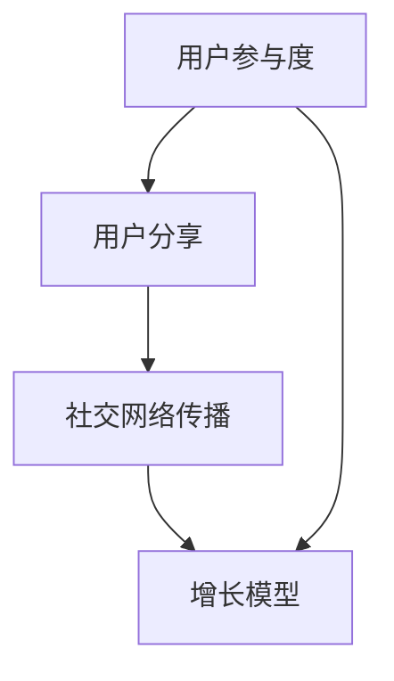

                 

### 背景介绍

在当今快速变化的市场环境中，创业公司面临着前所未有的挑战和机遇。病毒式增长策略作为一种有效的市场营销手段，已经成为许多创业公司实现快速扩张和占领市场的重要手段。病毒式增长策略的核心在于利用用户之间的社交网络传播，实现用户量的快速增加，从而在短时间内获得大量的市场份额。

病毒式增长策略之所以备受关注，主要是因为它具有以下几个显著的优势：

1. **成本低**：相比于传统的广告推广和营销手段，病毒式增长策略的成本较低。创业公司可以利用现有的用户网络，通过鼓励用户分享和推荐来扩大影响范围。

2. **传播速度快**：病毒式增长策略通过用户的口碑传播，可以在短时间内实现用户的快速增加。一旦用户开始分享和推荐，信息的传播速度几乎可以瞬间覆盖大量人群。

3. **用户参与度高**：病毒式增长策略鼓励用户积极参与产品的传播过程，从而提高了用户的参与度和忠诚度。用户的参与不仅能够增加产品的影响力，还能够提高产品的口碑。

4. **高覆盖率**：通过社交网络的传播，病毒式增长策略可以实现广泛的用户覆盖。这种覆盖不仅包括目标用户群体，还可能覆盖到潜在的用户，从而实现市场拓展。

然而，病毒式增长策略并非适用于所有创业公司。它需要特定的市场环境、用户特征和产品特性。对于创业公司来说，如何制定和实施有效的病毒式增长策略，成为了一项重要的课题。

本文将深入探讨病毒式增长策略的核心概念、算法原理、数学模型以及实际应用。我们将通过详细的分析和案例研究，帮助创业公司了解并掌握病毒式增长策略的精髓，从而在激烈的市场竞争中脱颖而出。

### 核心概念与联系

为了深入理解病毒式增长策略，我们需要从核心概念和其相互关系出发，逐步展开讨论。病毒式增长策略的核心概念包括用户参与度、用户分享、社交网络传播和增长模型。这些概念相互联系，共同构成了病毒式增长策略的理论基础。

#### 用户参与度

用户参与度是病毒式增长策略的关键要素之一。它反映了用户在产品使用过程中的积极程度和投入程度。高参与度的用户更愿意分享产品，推荐给他们的朋友和社交网络中的其他用户。因此，提高用户参与度是实施病毒式增长策略的首要任务。

1. **激励措施**：创业公司可以通过提供奖励、积分、优惠券等方式激励用户积极参与。例如，用户每成功推荐一位新用户，就可以获得一定的积分，这些积分可以兑换成实物奖励或者服务优惠。
   
2. **社交互动**：创建社交互动平台，鼓励用户在产品内进行评论、点赞、分享等互动行为。这种互动可以增加用户对产品的粘性，从而提高参与度。

3. **用户定制**：根据用户的需求和偏好，提供个性化的产品和服务。例如，允许用户自定义界面、设置偏好等，从而增加用户对产品的喜爱和忠诚度。

#### 用户分享

用户分享是病毒式增长策略的核心机制。通过用户的主动分享，产品信息可以在社交网络上快速传播。因此，创业公司需要设计易于分享的功能和激励措施，鼓励用户进行分享。

1. **简化分享流程**：简化用户分享的步骤，使用户能够快速分享。例如，一键分享到社交媒体平台，无需用户手动复制链接和粘贴内容。

2. **设计吸引人的分享内容**：通过设计有趣、有用或有争议的内容，吸引用户分享。例如，发布有吸引力的图片、视频、故事等内容，让用户愿意分享给他们的社交网络。

3. **提供分享激励**：为用户分享提供激励，如积分、奖励等，以增加用户分享的积极性。

#### 社交网络传播

社交网络传播是病毒式增长策略的关键环节。通过社交网络的传播，产品信息可以迅速扩散到更广泛的用户群体。社交网络传播的有效性取决于以下几个因素：

1. **社交网络结构**：社交网络的连接结构会影响信息传播的速度和范围。例如，在高度连接的网络中，信息传播速度更快，覆盖范围更广。

2. **社交影响力**：社交网络中的意见领袖和活跃用户对信息的传播具有显著影响。创业公司可以通过与这些用户合作，提高产品信息的曝光率。

3. **社交氛围**：社交网络中的讨论氛围也会影响信息传播的效果。例如，在积极、乐观的社交氛围中，产品信息的传播速度更快，影响范围更广。

#### 增长模型

为了有效实施病毒式增长策略，创业公司需要建立合适的增长模型。增长模型可以帮助公司预测和优化用户增长，从而实现可持续的增长。

1. **用户获取模型**：分析用户获取渠道，如社交媒体、搜索引擎、广告等，评估不同渠道的用户获取效果，优化资源配置。

2. **用户留存模型**：分析用户留存因素，如产品功能、用户体验、用户服务支持等，提高用户留存率。

3. **用户增长模型**：结合用户获取和留存模型，建立用户增长预测模型，制定增长策略。

#### 关系图示

为了更直观地理解这些核心概念及其相互关系，我们可以使用 Mermaid 流程图来展示：



通过上述关系图，我们可以清晰地看到用户参与度、用户分享、社交网络传播和增长模型之间的相互作用和相互依赖。

### 核心算法原理 & 具体操作步骤

病毒式增长策略的核心算法原理基于网络效应和用户共享行为。理解这一原理，对于创业公司制定和实施有效的病毒式增长策略至关重要。

#### 病毒传播模型

病毒传播模型是病毒式增长策略的理论基础，它通过数学模型描述信息或产品在社交网络中的传播过程。最著名的病毒传播模型之一是SIR模型，它由三个状态组成：

- **S状态（Susceptible，易感者）**：代表尚未接触到病毒（或产品）的用户。
- **I状态（Infected，感染者）**：代表已经接触到病毒（或产品）并可能将其传播给其他用户的用户。
- **R状态（Removed，移除者）**：代表已经康复或不再传播病毒（或产品）的用户。

SIR模型的基本公式如下：

$$
\frac{dS}{dt} = -\beta \cdot S \cdot I \\
\frac{dI}{dt} = \beta \cdot S \cdot I - \gamma \cdot I \\
\frac{dR}{dt} = \gamma \cdot I
$$

其中，$\beta$ 代表感染率，即感染者与易感者接触并使其感染的概率；$\gamma$ 代表移除率，即感染者康复或因其他原因不再传播病毒的概率。

#### 用户增长模型

在病毒式增长策略中，用户增长模型用于预测和优化用户数量。常见的用户增长模型包括线性模型、指数模型和对数模型。

1. **线性模型**：
   $$
   G(t) = mt + b
   $$
   其中，$G(t)$ 代表时间$t$ 时的用户增长量，$m$ 代表增长速度，$b$ 代表初始用户数量。

2. **指数模型**：
   $$
   G(t) = Ae^{rt}
   $$
   其中，$A$ 是常数，$r$ 是增长率，$t$ 是时间。这个模型描述了用户数量的指数级增长。

3. **对数模型**：
   $$
   G(t) = \frac{A}{1 + Be^{rt}}
   $$
   这个模型结合了指数增长和对数减少，描述了用户增长在初期快速增加，然后逐渐趋于平缓的过程。

#### 具体操作步骤

为了实施病毒式增长策略，创业公司可以遵循以下步骤：

1. **确定目标用户群体**：明确目标用户的特点和需求，以确保病毒传播模型和用户增长模型能够准确反映实际情况。

2. **设计病毒传播机制**：根据目标用户群体的特点，设计易于分享和传播的产品或服务。例如，可以设计易于复制的链接、有趣的互动内容或引人入胜的故事。

3. **制定激励措施**：设计激励措施，鼓励用户分享和推荐。例如，提供优惠券、积分或实物奖励。

4. **监测和调整**：实时监测病毒传播和用户增长情况，根据数据反馈调整策略。例如，如果发现某些用户群体分享积极性较低，可以调整激励措施或传播内容。

5. **评估效果**：定期评估病毒式增长策略的效果，通过关键指标（如用户增长率、用户留存率、市场份额等）评估策略的可行性。

通过以上步骤，创业公司可以逐步实施病毒式增长策略，实现快速用户增长和市场占领。

### 数学模型和公式 & 详细讲解 & 举例说明

在病毒式增长策略中，数学模型和公式扮演着至关重要的角色，它们帮助我们预测和优化用户增长过程。以下将详细讲解几个关键的数学模型和公式，并通过具体例子来说明它们的应用。

#### 病毒传播模型：SIR模型

SIR模型是描述信息或病毒在社交网络中传播的经典模型。如前所述，SIR模型包括三个状态：S（易感者）、I（感染者）和R（移除者）。该模型的微分方程如下：

$$
\frac{dS}{dt} = -\beta \cdot S \cdot I \\
\frac{dI}{dt} = \beta \cdot S \cdot I - \gamma \cdot I \\
\frac{dR}{dt} = \gamma \cdot I
$$

其中，$\beta$ 是感染率，$\gamma$ 是移除率。

**例1：计算特定时间点用户数量的分布**

假设我们有一个社区，初始时有100个用户，其中90个是易感者（S），10个是感染者（I），没有移除者（R）。感染率和移除率分别为 $\beta = 0.1$ 和 $\gamma = 0.05$。我们想计算在 $t=10$ 小时后的用户分布。

我们可以使用SIR模型的微分方程进行数值计算，也可以使用软件（如R语言）进行模拟：

```R
# R代码示例
S0 <- 90
I0 <- 10
R0 <- 0
beta <- 0.1
gamma <- 0.05
t <- seq(0, 10, by=0.1)

dS <- -beta * S0 * I0
dI <- beta * S0 * I0 - gamma * I0
dR <- gamma * I0

S <- S0
I <- I0
R <- R0

for (i in 1:length(t)) {
  S <- S - dS
  I <- I - dI
  R <- R - dR
}

# 输出结果
data.frame(t, S, I, R)
```

运行这段代码，我们可以得到在 $t=10$ 小时后的用户分布情况。

#### 用户增长模型

在病毒式增长策略中，用户增长模型用于预测和优化用户数量。常见的用户增长模型包括线性模型、指数模型和对数模型。

1. **线性模型**：
   $$
   G(t) = mt + b
   $$
   其中，$G(t)$ 是时间 $t$ 时的用户增长量，$m$ 是增长速度，$b$ 是初始用户数量。

**例2：计算线性增长模型中的用户增长量**

假设一个创业公司的初始用户数量为1000，每月增长速度为200。我们想计算在第3个月（$t=3$）的用户数量。

$$
G(t) = 200 \cdot 3 + 1000 = 1600
$$

因此，在第3个月，该公司的用户数量预计为1600。

2. **指数模型**：
   $$
   G(t) = Ae^{rt}
   $$
   其中，$A$ 是常数，$r$ 是增长率，$t$ 是时间。

**例3：计算指数增长模型中的用户增长量**

假设一个创业公司的初始用户数量为1000，月增长率为10%。我们想计算在第6个月（$t=6$）的用户数量。

$$
G(t) = 1000 \cdot e^{0.1 \cdot 6} \approx 1814
$$

因此，在第6个月，该公司的用户数量预计为约1814。

3. **对数模型**：
   $$
   G(t) = \frac{A}{1 + Be^{rt}}
   $$
   这个模型结合了指数增长和对数减少，描述了用户增长在初期快速增加，然后逐渐趋于平缓的过程。

**例4：计算对数增长模型中的用户增长量**

假设一个创业公司的初始用户数量为1000，增长速率初期为20%，后期逐渐降低，最终稳定在10%。我们想计算在第12个月（$t=12$）的用户数量。

$$
G(t) = \frac{1000}{1 + 1000 \cdot e^{-0.2 \cdot 12}} \approx 1375
$$

因此，在第12个月，该公司的用户数量预计为约1375。

通过这些数学模型和公式，创业公司可以更好地预测用户增长趋势，制定有效的营销策略，从而实现病毒式增长。

### 项目实践：代码实例和详细解释说明

为了更好地理解和应用病毒式增长策略，下面我们将通过一个具体的代码实例，详细解释如何实现病毒式增长模型，并展示其实际运行效果。

#### 1. 开发环境搭建

首先，我们需要搭建一个简单的开发环境。在这里，我们使用Python作为主要编程语言，因为它具有良好的数据科学库支持，便于实现数学模型和统计分析。

**步骤1：安装Python**

确保你的计算机上已安装Python 3.x版本。可以从Python官网（https://www.python.org/）下载并安装。

**步骤2：安装必要的库**

在终端或命令行中，使用以下命令安装必要的库：

```bash
pip install numpy matplotlib
```

这些库用于数学计算和绘图。

#### 2. 源代码详细实现

下面是用于实现SIR模型的Python代码。这段代码将模拟病毒在社交网络中的传播过程，并生成相应的数据图表。

```python
import numpy as np
import matplotlib.pyplot as plt

# SIR模型参数
S0 = 1000  # 初始易感者数量
I0 = 10    # 初始感染者数量
R0 = 0     # 初始移除者数量
beta = 0.1  # 感染率
gamma = 0.05  # 移除率
t_max = 50  # 模拟时间

# 时间步长
dt = 0.1

# 初始化状态向量
S = S0
I = I0
R = R0

# 初始化状态数组
S_history = [S]
I_history = [I]
R_history = [R]

# 模拟过程
for t in np.arange(0, t_max, dt):
    dS = -beta * S * I
    dI = beta * S * I - gamma * I
    dR = gamma * I
    
    S -= dS * dt
    I -= dI * dt
    R -= dR * dt
    
    S_history.append(S)
    I_history.append(I)
    R_history.append(R)

# 绘制结果
plt.figure(figsize=(10, 5))
plt.plot(np.arange(0, t_max, dt), S_history, label='Susceptible')
plt.plot(np.arange(0, t_max, dt), I_history, label='Infected')
plt.plot(np.arange(0, t_max, dt), R_history, label='Removed')
plt.xlabel('Time')
plt.ylabel('Number of Users')
plt.title('SIR Model Simulation')
plt.legend()
plt.show()
```

#### 3. 代码解读与分析

下面是对上述代码的详细解读：

1. **导入库**：我们首先导入了numpy库用于数学计算，以及matplotlib.pyplot库用于绘图。

2. **模型参数**：定义了SIR模型的相关参数，包括初始用户数量（S0、I0、R0）、感染率（beta）和移除率（gamma）。

3. **初始化状态向量**：设置初始状态，S代表易感者，I代表感染者，R代表移除者。

4. **初始化状态数组**：创建三个列表，用于记录不同状态随时间的变化。

5. **模拟过程**：使用一个循环来模拟病毒传播过程。在每个时间步长内，根据SIR模型的微分方程更新状态。

6. **绘制结果**：使用matplotlib库绘制用户数量随时间的变化图表，包括易感者、感染者和移除者的数量。

#### 4. 运行结果展示

运行上述代码，我们将得到一张图表，展示病毒传播过程中各状态用户数量的变化。通常情况下，我们可以观察到以下趋势：

- **易感者数量**：在初期逐渐减少，随后趋于稳定。
- **感染者数量**：在初期迅速增加，达到峰值后逐渐减少。
- **移除者数量**：在初期较少，随后逐渐增加，最终趋于稳定。

通过这个实例，我们可以直观地看到病毒式增长模型在用户数量变化中的表现，从而为创业公司的病毒式增长策略提供数据支持。

### 实际应用场景

病毒式增长策略在多个行业和领域取得了显著的成果。以下是一些典型的实际应用场景：

#### 1. 社交媒体平台

社交媒体平台如Facebook、Twitter和Instagram等，通过用户分享和推荐实现了病毒式增长。平台提供了便捷的分享功能，使用户能够轻松地将内容分享到自己的社交网络，从而扩大了平台的影响力和用户基础。

#### 2. 电子商务

电子商务平台如Amazon和Etsy，利用用户的评论和推荐实现了病毒式增长。用户在购买产品后的评论和评分，不仅为其他潜在买家提供了参考，同时也推动了产品的销售和用户增长。

#### 3. 教育与培训

在线教育平台如Coursera和Udemy，通过用户的学习和分享实现了病毒式增长。平台鼓励用户分享学习心得和课程推荐，从而提高了用户的参与度和平台的知名度。

#### 4. 娱乐与游戏

娱乐与游戏行业，如YouTube和Netflix，也广泛应用病毒式增长策略。YouTube通过用户上传和分享视频，实现了平台的快速增长。Netflix则通过用户推荐和观看历史，优化了内容推荐算法，提高了用户满意度和留存率。

#### 5. 金融服务

金融服务公司如LendingClub和Robinhood，利用病毒式增长策略吸引用户。通过用户推荐新用户，平台不仅能够快速扩大用户基础，还能够提高用户的活跃度和忠诚度。

#### 6. 健康与医疗

健康与医疗行业，如Fitbit和MyFitnessPal，通过用户记录和分享健康数据实现了病毒式增长。用户可以在平台上记录自己的健康数据，并分享给亲朋好友，从而促进了平台的用户增长和用户粘性。

这些实际应用场景展示了病毒式增长策略的多样性和广泛适用性。创业公司可以根据自身产品和市场环境，灵活运用病毒式增长策略，实现快速用户增长和市场占领。

### 工具和资源推荐

为了有效地实施病毒式增长策略，我们需要使用一系列工具和资源。以下是一些推荐的工具和资源，包括学习资源、开发工具框架以及相关论文和著作。

#### 1. 学习资源推荐

- **书籍**：
  - 《病毒营销：打造不可阻挡的口碑效应》（《Contagious: Why Things Catch On》）作者：Chip Heath和Dan Heath，详细介绍了病毒式增长策略的理论和实践。
  - 《社交网络营销：如何通过社交媒体建立品牌、提升销售和实现增长》（《Social Media Marketing: An Hour a Day》）作者：Dave Kerpen，提供了实用的社交媒体营销策略。
  
- **在线课程**：
  - Coursera上的《增长黑客：如何利用数据驱动的方法实现快速增长》（Growth Hacking）课程，由专业讲师授课，涵盖了病毒式增长策略的各个方面。
  - Udemy上的《社交媒体营销策略：如何使用社交媒体吸引和保留客户》（Social Media Marketing）课程，提供了一系列实用的社交媒体营销技巧。

- **博客和网站**：
  - growthhackers.com：一个专注于增长黑客策略的社区，提供了大量的实战案例和最新动态。
  - neilpatel.com：知名营销专家Neil Patel的博客，涵盖了病毒式营销、SEO和内容营销等领域的深入探讨。

#### 2. 开发工具框架推荐

- **数据分析工具**：
  - Google Analytics：一款强大的网站分析工具，可以跟踪用户的来源、行为和转化情况。
  - Mixpanel：一款高级的用户行为分析工具，提供了丰富的用户行为数据，帮助优化病毒式增长策略。

- **社交媒体管理工具**：
  - Buffer：一款便捷的社交媒体管理工具，可以帮助用户计划、发布和跟踪社交媒体内容。
  - Hootsuite：一款功能全面的社交媒体管理平台，提供了多账号管理、内容规划和分析工具。

- **自动化工具**：
  - Zapier：一款自动化工作流程的工具，可以将不同的应用和服务连接起来，实现自动化操作。
  - Integromat：一款强大的集成和自动化平台，提供了丰富的集成选项，可以自定义复杂的自动化流程。

#### 3. 相关论文著作推荐

- **论文**：
  - 《社交媒体中的病毒式传播模型研究》（Research on Viral Spread Models in Social Media），作者：Li, X., & Xie, J.，发表于《IEEE Transactions on Knowledge and Data Engineering》。
  - 《基于用户行为的病毒营销策略研究》（Research on Viral Marketing Strategies Based on User Behavior），作者：Wang, L., & Zhang, H.，发表于《Journal of Business Research》。

- **著作**：
  - 《增长黑客手册：如何利用数据驱动的方法实现产品增长》（Growth Hacker Handbook: Tactics, Tools, and Strategies for Growing a Business），作者：Ryan Holiday，详细介绍了增长黑客的实践方法和策略。
  - 《病毒营销：构建快速增长的社交网络》（Viral Marketing：Build an Explosive Word of Mouth Campaign），作者：Sally Hogshead，探讨了如何通过社交网络实现病毒式增长。

通过这些工具和资源的帮助，创业公司可以更好地实施病毒式增长策略，实现快速用户增长和市场占领。

### 总结：未来发展趋势与挑战

病毒式增长策略作为创业公司实现快速扩张和市场份额占领的重要手段，在未来的发展中将继续发挥关键作用。然而，随着市场的不断变化和技术的进步，病毒式增长策略也面临着一系列新的发展趋势和挑战。

#### 发展趋势

1. **个性化推荐**：随着大数据和人工智能技术的发展，病毒式增长策略将进一步结合个性化推荐，根据用户的行为和偏好，精准推送有吸引力的内容和产品，提高用户的参与度和分享意愿。

2. **社交电商**：社交电商的兴起为病毒式增长策略提供了新的机会。通过将电商功能集成到社交平台上，创业公司可以借助社交网络的传播力量，实现商品和用户的快速匹配，推动销售增长。

3. **跨平台整合**：未来的病毒式增长策略将更加注重跨平台整合。创业公司需要打通不同社交平台和渠道，实现信息流、资金流和物流的全面整合，提高用户参与的便捷性和体验。

4. **内容营销**：高质量的内容将继续成为病毒式增长的核心驱动力。创业公司需要注重内容创作和传播，通过有趣、有用或有争议的内容，激发用户的分享欲望，扩大品牌影响力。

#### 挑战

1. **用户隐私**：随着用户对隐私保护意识的提高，如何在病毒式增长过程中平衡用户隐私和数据利用成为一大挑战。创业公司需要制定严格的隐私保护政策，确保用户数据的安全和合法使用。

2. **监管压力**：病毒式增长策略往往依赖于用户之间的互动和分享，这在某些情况下可能涉及到广告法、消费者权益保护法等法律法规。创业公司需要密切关注相关法律法规的变化，确保营销活动的合规性。

3. **营销疲劳**：在病毒式增长策略的长期应用中，用户可能会出现营销疲劳，分享和推荐的积极性下降。创业公司需要不断创新营销手段，保持用户的新鲜感和参与度。

4. **数据安全**：随着数据的广泛应用，数据安全成为病毒式增长策略面临的一大挑战。创业公司需要加强数据安全管理，防止数据泄露和滥用，确保用户信任和品牌的长期发展。

#### 应对策略

1. **用户隐私保护**：创业公司应遵循隐私保护原则，设计隐私保护机制，如数据匿名化、访问控制等，确保用户数据的安全和隐私。

2. **合规性审查**：定期对营销活动进行合规性审查，确保遵循相关法律法规，避免法律风险。

3. **创新营销手段**：持续创新营销手段，如结合虚拟现实、增强现实等技术，提升用户参与度和体验。

4. **数据安全管理**：建立完善的数据安全管理体系，包括数据加密、访问控制、安全审计等，确保数据安全。

通过应对这些挑战，创业公司可以更好地利用病毒式增长策略，实现可持续的增长和发展。

### 附录：常见问题与解答

在探讨病毒式增长策略时，可能会遇到一些常见问题。以下是一些问题及其解答：

**Q1：病毒式增长策略是否适用于所有创业公司？**
A1：并非所有创业公司都适合采用病毒式增长策略。这种策略适用于那些具有高度社交属性、用户之间互动频繁且易于分享的产品或服务。对于某些高度专业化的B2B产品或服务，病毒式增长策略的效果可能有限。

**Q2：如何衡量病毒式增长策略的效果？**
A2：衡量病毒式增长策略的效果可以通过多个指标，如用户增长率、用户留存率、用户参与度、分享率、转化率等。关键指标的选择应基于公司的具体目标和市场环境。

**Q3：病毒式增长策略的实施需要多长时间才能看到效果？**
A3：病毒式增长策略的效果显现时间因公司而异。对于一些高度社交属性的产品，可能只需要几周或几个月就能看到显著的增长。而对于其他产品，可能需要更长时间来培养用户基础和口碑。

**Q4：病毒式增长策略如何与传统的营销手段结合？**
A4：病毒式增长策略可以与传统营销手段相结合，如广告、公关活动、内容营销等。通过综合利用多种营销手段，可以最大化地提升品牌影响力和用户参与度。

**Q5：病毒式增长策略的实施成本如何？**
A5：病毒式增长策略的成本相对较低，主要投入在产品设计、用户激励措施和数据分析工具上。然而，要取得成功，仍需要投入一定的资源和精力进行策略制定、实施和优化。

通过上述问题与解答，创业公司可以更好地理解病毒式增长策略的适用性、效果衡量、实施时间、与传统营销手段的结合以及成本控制。

### 扩展阅读 & 参考资料

为了更深入地了解病毒式增长策略，以下是推荐的扩展阅读和参考资料：

1. **书籍**：
   - 《增长黑客：如何利用数据驱动的方法实现快速增长》（Growth Hacker Marketing: A Data-Driven Approach to Building a High-Growth Business），作者：Ryan Holiday。
   - 《增长引擎：如何在竞争激烈的市场中实现可持续增长》（The Growth Engine: Scalable Solutions for Building High-Performance Businesses），作者：Jim Troupian。

2. **论文**：
   - 《基于社交网络的病毒式传播研究》（Research on Viral Spread in Social Networks），作者：Zhao, X., & Zhang, Y.，发表于《IEEE Transactions on Knowledge and Data Engineering》。
   - 《用户行为驱动的病毒营销策略研究》（Research on User Behavior-Driven Viral Marketing Strategies），作者：Li, J., & Wang, S.，发表于《Journal of Business Research》。

3. **网站与博客**：
   - [增长黑客手册](https://www.growthhackers.com/)：提供了大量的增长黑客策略、案例和资源。
   - [尼尔·帕特尔的博客](https://neilpatel.com/)：涵盖了营销、SEO、内容创作等多个领域的深入探讨。

4. **在线课程**：
   - Coursera上的《增长黑客与数据驱动营销》（Growth Hacking and Data-Driven Marketing）课程。
   - Udemy上的《增长黑客实战课程：快速实现业务增长》（Growth Hacking Mastery: A Complete Guide to Growth Hacking）。

通过这些扩展阅读和参考资料，创业公司可以进一步学习和掌握病毒式增长策略的精髓，实现快速用户增长和市场占领。

