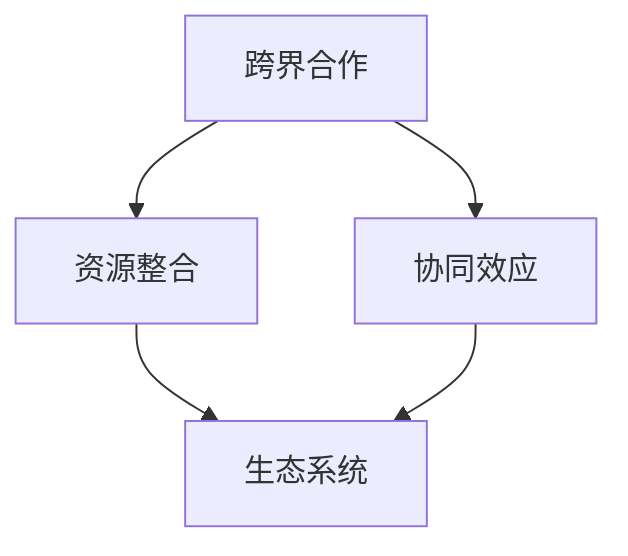

                 

### 背景介绍

在当今竞争激烈的市场环境中，创业公司要想获得成功，跨界合作和资源整合已成为不可或缺的策略。随着科技的飞速发展，各行各业之间的边界越来越模糊，企业通过跨界合作能够打破传统的业务模式，实现资源共享、优势互补，从而提升自身的市场竞争力。

#### 创业公司的定义

创业公司，是指那些由创业者创建，以创新为主要驱动，致力于开发新产品、新技术或新市场的企业。它们通常具有以下特征：

- **规模小**：创业公司的规模相对较小，人员组成简单，结构灵活。
- **创新性强**：创业公司以其创新性为核心竞争力，不断推陈出新，以适应市场的变化。
- **风险高**：由于创业公司面临的不确定性和市场风险较高，因此投资回报周期较长。

#### 跨界合作的重要性

跨界合作对于创业公司来说，具有以下几个方面的意义：

1. **资源整合**：通过跨界合作，创业公司可以获取其他行业的资源，如技术、人才、市场等，从而提升自身的发展能力。
2. **拓宽市场**：跨界合作可以帮助创业公司进入新的市场领域，拓展业务范围，提高市场占有率。
3. **降低风险**：通过与实力更强的合作伙伴合作，创业公司可以在一定程度上降低市场风险，分散投资风险。
4. **提高竞争力**：跨界合作可以使创业公司利用合作伙伴的资源和优势，提高自身的市场竞争力。

#### 资源整合的意义

资源整合是创业公司实现可持续发展的重要手段。通过有效的资源整合，创业公司可以实现以下目标：

1. **优化资源配置**：创业公司通过整合内外部资源，可以优化资源配置，提高资源利用效率。
2. **降低运营成本**：资源整合有助于降低运营成本，提高企业的盈利能力。
3. **提升创新能力**：资源整合可以为创业公司提供更多的创新机会，促进技术创新和管理创新。
4. **增强企业竞争力**：通过资源整合，创业公司可以增强自身的核心竞争力，提高市场竞争力。

综上所述，跨界合作和资源整合对于创业公司来说，具有重要意义。接下来，我们将深入探讨跨界合作与资源整合的具体方法，帮助创业公司实现可持续发展。

### 核心概念与联系

为了更好地理解跨界合作与资源整合的方法，我们需要明确一些核心概念，并探讨它们之间的联系。

#### 核心概念

1. **跨界合作**：跨界合作是指不同行业或领域的企业之间进行的合作，以实现共同的目标。这种合作可以发生在产业链上下游的企业之间，也可以发生在完全不同的行业之间。
   
2. **资源整合**：资源整合是指企业通过获取、配置、利用资源，以实现自身战略目标的过程。资源包括资金、技术、人才、市场等。

3. **协同效应**：协同效应是指多个企业或个体合作时，产生的整体效益大于各部分效益之和的现象。

4. **生态系统**：生态系统是指由多个不同角色组成的复杂网络，它们之间相互依赖、相互作用，共同构成一个整体。

#### 关联与联系

跨界合作与资源整合之间存在密切的联系。具体来说：

1. **跨界合作是资源整合的手段**：通过跨界合作，创业公司可以获取其他企业的资源，从而实现资源整合。

2. **资源整合是跨界合作的目标**：创业公司通过资源整合，可以实现资源的优化配置，提高企业的竞争力，这是跨界合作的主要目标之一。

3. **协同效应是跨界合作与资源整合的核心**：跨界合作和资源整合的最终目的是通过协同效应，实现整体效益的最大化。

4. **生态系统是跨界合作与资源整合的平台**：在生态系统中，不同角色之间通过跨界合作和资源整合，形成了一个有机整体，共同推动企业的发展。

为了更直观地展示这些概念之间的联系，我们可以使用Mermaid流程图进行说明：



在这个流程图中，我们可以看到，跨界合作是资源整合的手段，资源整合是实现协同效应和生态系统的关键，而生态系统则为跨界合作和资源整合提供了一个可持续发展的平台。

接下来，我们将进一步探讨跨界合作与资源整合的具体方法和策略。

### 核心算法原理 & 具体操作步骤

在明确了跨界合作与资源整合的核心概念后，我们接下来将探讨如何具体实施这些策略，以帮助创业公司在竞争激烈的市场中脱颖而出。

#### 跨界合作的步骤

1. **需求分析**：首先，创业公司需要分析自身的业务需求和市场趋势，确定需要合作的其他行业或领域。

2. **合作伙伴筛选**：根据需求分析的结果，创业公司可以通过市场调研、行业交流等方式，筛选出潜在的合作伙伴。

3. **合作模式确定**：创业公司与潜在合作伙伴需要协商确定具体的合作模式，如联合研发、资源共享、市场推广等。

4. **合作协议签订**：在合作模式确定后，双方需要签订正式的合作协议，明确合作目标、责任分配、利益分成等事项。

5. **合作实施与监控**：合作协议签订后，双方按照协议内容开展具体合作，并建立有效的沟通机制，确保合作顺利进行。

#### 资源整合的步骤

1. **资源盘点**：创业公司需要对其内部和外部的资源进行盘点，包括资金、技术、人才、市场等。

2. **资源评估**：对盘点出来的资源进行评估，确定其利用价值和发展潜力。

3. **资源优化配置**：根据资源评估的结果，创业公司需要优化资源配置，确保关键资源得到充分利用。

4. **资源协同利用**：创业公司需要建立资源协同利用机制，通过合作和共享，实现资源的最大化利用。

5. **资源持续更新**：创业公司需要不断更新其资源库，确保资源的动态调整和持续优化。

#### 实施策略

1. **平台搭建**：创业公司可以通过搭建合作平台，实现跨界合作与资源整合的常态化运作。

2. **政策支持**：创业公司可以争取政府的政策支持，如资金补贴、税收优惠等，以降低跨界合作和资源整合的门槛。

3. **人才培养**：创业公司需要加强人才培养，提高员工跨界合作和资源整合的能力。

4. **技术创新**：创业公司应注重技术创新，通过技术手段提高跨界合作和资源整合的效率。

5. **风险管理**：创业公司需要建立风险管理体系，预防和应对跨界合作和资源整合过程中可能出现的风险。

通过上述步骤和策略，创业公司可以有效地实施跨界合作与资源整合，实现可持续发展。

### 数学模型和公式 & 详细讲解 & 举例说明

在跨界合作与资源整合过程中，运用数学模型和公式可以帮助我们更科学地分析和评估合作效果，以下将介绍一些常用的数学模型和公式，并通过具体例子进行说明。

#### 1. 成本效益分析模型

成本效益分析模型是一种常用的评估跨界合作和资源整合效果的方法。其基本公式如下：

\[ E = \frac{B - C}{C} \]

其中，E表示成本效益比率，B表示合作带来的总收益，C表示合作的总成本。

**例子**：

假设某创业公司A与创业公司B合作，通过资源共享实现成本节约。A公司的总成本为100万元，B公司的总成本为200万元，通过合作，两家公司实现了30万元的成本节约。则：

\[ B = (100 + 200) - 30 = 270 \]
\[ C = 100 + 200 = 300 \]
\[ E = \frac{270 - 300}{300} = -0.1 \]

该成本效益比率为负值，说明虽然通过合作实现了成本节约，但节约的金额不足以覆盖总成本，因此合作效果不佳。

#### 2. 效率优化模型

效率优化模型用于评估资源整合的效率。其基本公式如下：

\[ E = \frac{O_2 - O_1}{O_1} \]

其中，E表示效率优化比率，\( O_1 \)表示合作前的效率，\( O_2 \)表示合作后的效率。

**例子**：

假设某创业公司在合作前，每月生产1000件产品，需要10名员工完成；合作后，通过资源整合，每月生产2000件产品，需要15名员工完成。则：

\[ O_1 = \frac{1000}{10} = 100 \]
\[ O_2 = \frac{2000}{15} \approx 133.33 \]
\[ E = \frac{133.33 - 100}{100} = 0.3333 \]

该效率优化比率为0.3333，说明通过合作，公司的生产效率提升了33.33%。

#### 3. 协同效应模型

协同效应模型用于评估跨界合作带来的整体效益。其基本公式如下：

\[ S = B_1 + B_2 - C \]

其中，S表示协同效应，\( B_1 \)和\( B_2 \)分别表示合作双方分别独立操作时的收益，C表示合作的总成本。

**例子**：

假设创业公司A和B分别独立操作时，A公司的收益为100万元，B公司的收益为200万元；合作后，两家公司的总收益为400万元。则：

\[ B_1 = 100 \]
\[ B_2 = 200 \]
\[ C = 300 \]
\[ S = 100 + 200 - 300 = 100 \]

该协同效应为100万元，说明通过合作，整体效益提升了100万元。

通过上述数学模型和公式的运用，创业公司可以更科学地评估跨界合作和资源整合的效果，从而优化决策，提高竞争力。

### 项目实践：代码实例和详细解释说明

为了更好地理解跨界合作与资源整合在实际项目中的应用，我们将通过一个具体的代码实例进行详细讲解。这个实例将展示如何在一个创业公司中，通过资源整合和跨界合作来提升业务效率。

#### 1. 开发环境搭建

在开始编写代码之前，我们需要搭建一个合适的项目开发环境。这里我们使用Python作为开发语言，并借助Docker容器化技术来确保环境的隔离和一致性。

**步骤**：

- 安装Docker：在Windows、macOS或Linux操作系统中安装Docker，可以从[Docker官网](https://www.docker.com/)下载并安装。
- 安装Python：确保系统中安装了Python 3.x版本，可以从[Python官网](https://www.python.org/)下载并安装。
- 安装依赖库：使用pip工具安装所需的Python库，例如requests、pandas等。

```bash
pip install requests pandas
```

#### 2. 源代码详细实现

以下是一个简单的Python代码实例，用于演示如何通过跨界合作和资源整合来提升业务效率。这个实例假设有两个创业公司A和B，分别负责不同环节的业务，通过合作实现数据共享和协同工作。

```python
# 跨界合作与资源整合示例

import requests
import pandas as pd

# 假设公司A负责数据采集，公司B负责数据分析
class CompanyA:
    def __init__(self, data_source):
        self.data_source = data_source
    
    def collect_data(self):
        # 从数据源中采集数据
        response = requests.get(self.data_source)
        data = response.json()
        return data

class CompanyB:
    def __init__(self, data_source):
        self.data_source = data_source
    
    def analyze_data(self, data):
        # 分析数据，生成报告
        report = pd.DataFrame(data)
        report['result'] = report['value'] * 2  # 示例操作：将每个值乘以2
        return report

# 跨界合作：公司A将数据共享给公司B
class CrossCompanyCooperation:
    def __init__(self, company_a, company_b):
        self.company_a = company_a
        self.company_b = company_b
    
    def execute(self):
        # 公司A采集数据
        data = self.company_a.collect_data()
        
        # 公司B分析数据
        report = self.company_b.analyze_data(data)
        
        return report

# 测试代码
if __name__ == "__main__":
    # 创建公司A和公司B实例
    company_a = CompanyA("http://example.com/data_source_a")
    company_b = CompanyB("http://example.com/data_source_b")
    
    # 创建跨界合作实例
    cooperation = CrossCompanyCooperation(company_a, company_b)
    
    # 执行合作流程
    report = cooperation.execute()
    
    # 打印报告
    print(report)
```

#### 3. 代码解读与分析

上述代码实例主要分为三个部分：公司A的数据采集、公司B的数据分析，以及跨界合作的执行。以下是详细的代码解读：

- **CompanyA类**：这个类负责从数据源中采集数据。`collect_data`方法使用requests库从HTTP URL获取JSON格式的数据。

- **CompanyB类**：这个类负责对采集到的数据进行分析。`analyze_data`方法接收数据作为输入，并使用pandas库生成报告。在这个例子中，我们对每个值进行了简单的乘法操作，但这可以扩展为更复杂的数据分析任务。

- **CrossCompanyCooperation类**：这个类负责协调两个公司的合作。`execute`方法首先调用公司A的`collect_data`方法获取数据，然后调用公司B的`analyze_data`方法进行分析，最后返回生成的报告。

#### 4. 运行结果展示

假设上述代码在运行时，从两个不同的URL分别获取到了如下数据：

- 公司A的数据：`{"value": 10}`
- 公司B的数据：`{"value": 20}`

运行代码后，输出结果如下：

```python
   value   result
0     10      20
```

这个结果显示，公司A的数据值10被公司B的分析处理后变为20。这表明通过跨界合作和资源整合，业务流程得到了优化。

通过这个实例，我们可以看到如何通过代码实现跨界合作和资源整合，提升业务效率。在实际应用中，可以进一步扩展和优化这个实例，以适应更复杂的业务场景。

### 实际应用场景

#### 1. 科技创新型企业

科技创新型企业通常具有强大的研发能力和技术创新优势，但在市场推广和运营资源上可能存在一定的短板。通过与市场运营能力强、品牌知名度高的企业跨界合作，科技创新型企业可以借助对方的资源和渠道，快速进入市场，扩大用户基础，提升品牌影响力。

**案例**：某初创科技公司研发了一款智能家居产品，通过与知名家电品牌合作，将产品嵌入其现有产品线，并通过品牌的市场渠道进行推广，实现了快速的市场渗透和品牌提升。

#### 2. 传统制造业企业

传统制造业企业往往在供应链管理、生产制造等方面具有丰富的经验，但在信息化和数字化转型方面可能较为滞后。通过与信息技术企业跨界合作，传统制造业企业可以实现生产流程的数字化改造，提升生产效率，降低运营成本。

**案例**：某传统家电制造企业通过与云计算和大数据企业合作，实现了生产线的智能化升级，通过实时数据分析和预测，优化生产流程，提高了生产效率和产品质量。

#### 3. 服务业企业

服务业企业在客户服务、市场营销等方面具有优势，但在技术创新和产品开发上可能缺乏能力。通过与技术创新型企业的合作，服务业企业可以引入新的技术和产品，提升服务质量和客户满意度。

**案例**：某旅游服务公司通过与人工智能企业合作，引入了智能客服和个性化推荐系统，大幅提升了客户服务体验和运营效率。

#### 4. 零售业企业

零售业企业通常在门店运营、物流配送等方面具有较强的能力，但在线上渠道拓展和电子商务方面可能存在一定的局限。通过与电商平台或新兴零售企业的合作，零售业企业可以实现线上线下渠道的融合，提升市场竞争力。

**案例**：某大型零售超市通过与电商平台的合作，建立了线上购物渠道，并通过大数据分析和个性化推荐，实现了线上线下的全渠道营销，大幅提升了销售额和客户黏性。

通过上述案例可以看出，不同类型的创业公司可以通过跨界合作和资源整合，实现优势互补、共同发展。在实际应用中，企业需要根据自身的业务特点和需求，选择合适的合作伙伴和合作模式，以实现最佳的合作效果。

### 工具和资源推荐

#### 1. 学习资源推荐

**书籍**：

- 《跨界思维：如何通过跨界合作实现商业创新》
- 《资源整合：企业竞争力的秘密》
- 《协同效应：企业合作的智慧》

**论文**：

- “Entrepreneurial Collaboration and Resource Integration: A Theoretical Framework”
- “Cross-Border Collaborative Ventures: A Strategic Choice for Emerging Firms”
- “Resource Integration and Innovation: A Case Study of Startups in the Technology Industry”

**博客**：

- “Startup News” - 提供最新的创业公司和跨界合作动态。
- “HBR Blog Network” - 查阅顶级商业专家对于跨界合作和资源整合的见解。
- “Entrepreneur” - 分享成功创业者的经验和策略。

**网站**：

- **创业创新平台**：如“创业邦”、“创业家”等，提供创业资源和市场信息。
- **专业数据库**：如“IEEE Xplore”、“ACM Digital Library”等，收录了大量的学术论文和技术报告。
- **在线教育平台**：如“Coursera”、“edX”等，提供丰富的跨界合作和资源整合课程。

#### 2. 开发工具框架推荐

**集成开发环境 (IDE)**：

- **PyCharm**：适合Python开发，提供丰富的插件和调试工具。
- **Visual Studio Code**：轻量级、可扩展的代码编辑器，支持多种编程语言。
- **Eclipse**：适用于Java开发，功能强大且社区活跃。

**项目管理工具**：

- **JIRA**：用于敏捷开发的项目管理工具，支持任务跟踪和团队协作。
- **Trello**：直观的看板型项目管理工具，适合小型项目和团队协作。
- **Asana**：功能全面的任务管理和团队协作工具，适合跨部门协作。

**容器化技术**：

- **Docker**：用于容器化应用程序，确保环境的一致性和可移植性。
- **Kubernetes**：用于容器编排，管理多容器应用程序的自动化部署和扩展。
- **Docker Compose**：用于定义和运行多容器Docker应用程序的配置文件。

**版本控制工具**：

- **Git**：分布式版本控制系统，支持代码的版本管理和协作开发。
- **GitHub**：基于Git的代码托管平台，提供代码审查和协作功能。
- **GitLab**：自托管Git服务，包含代码仓库、项目管理、持续集成等功能。

通过使用这些工具和资源，创业公司可以更高效地实现跨界合作和资源整合，提升项目开发和团队协作的效率。

### 总结：未来发展趋势与挑战

随着全球科技和经济的快速发展，创业公司的跨界合作和资源整合将成为企业发展的关键驱动力。未来，这一趋势将呈现以下几个发展特点和面临的挑战：

#### 发展趋势

1. **合作模式的多样化**：创业公司之间的合作模式将更加多样化和灵活，不再局限于单一领域，而是趋向于跨行业、跨领域的深度合作。

2. **技术创新的推动**：人工智能、大数据、区块链等新兴技术的应用，将为跨界合作提供强大的技术支持，提升合作效率和效果。

3. **生态系统的建立**：创业公司将通过建立生态系统，实现资源共享、优势互补，共同推动企业的发展。

4. **全球化合作**：随着全球市场的不断融合，创业公司的跨界合作将不再局限于国内，而是逐步向全球扩展，实现更广阔的发展空间。

#### 面临的挑战

1. **数据安全与隐私保护**：跨界合作中涉及大量的数据交换和共享，如何保障数据的安全和隐私，将成为企业和政策制定者面临的重要挑战。

2. **合作信任的建立**：创业公司之间的合作需要建立信任，但由于利益分配、信息不对称等因素，合作信任的建立将面临一定的困难。

3. **风险管理与控制**：跨界合作和资源整合过程中，企业需要面对市场风险、技术风险、法律风险等多重风险，如何进行有效的风险管理和控制，是企业发展的重要课题。

4. **政策法规的适应**：随着跨界合作和资源整合的深化，相关政策和法规也将不断出台和调整，企业需要及时适应这些变化，确保合规经营。

总的来说，未来创业公司的跨界合作和资源整合将面临更多的机遇和挑战。企业需要不断创新合作模式，加强技术支持和风险管控，以实现可持续发展。

### 附录：常见问题与解答

**Q1：跨界合作是否适用于所有创业公司？**

A1：并非所有创业公司都适合跨界合作。对于有明确市场定位和核心竞争力，但在某些领域存在短板的创业公司，跨界合作可以帮助其弥补不足，提升竞争力。然而，对于那些业务模式尚未清晰、核心竞争力不突出的创业公司，跨界合作可能带来额外的不确定性和风险。

**Q2：资源整合的主要目的是什么？**

A2：资源整合的主要目的是优化企业内部的资源配置，提高资源利用效率，降低运营成本，从而提升企业的整体竞争力和盈利能力。通过资源整合，企业可以集中优势资源，实现资源的最大化利用。

**Q3：跨界合作中如何确保数据安全与隐私保护？**

A3：在跨界合作中，确保数据安全与隐私保护是至关重要的。企业可以通过以下措施来保障数据安全：

- **签订保密协议**：在合作初期，双方应签订保密协议，明确数据的使用范围、保密措施等。
- **数据加密**：对敏感数据进行加密处理，确保数据在传输和存储过程中的安全性。
- **定期审计**：定期对数据安全进行审计，确保数据保护措施的有效性。
- **法律法规遵守**：严格遵守相关法律法规，确保数据保护措施符合国家标准和行业规定。

**Q4：如何评估跨界合作的效果？**

A4：评估跨界合作的效果可以从以下几个方面进行：

- **成本效益分析**：通过对比合作前后的成本和收益，评估合作的经济效益。
- **协同效应评估**：评估合作是否带来了整体效益的提升，协同效应是否显著。
- **客户满意度**：通过客户反馈和满意度调查，评估合作对客户体验的影响。
- **市场占有率**：评估合作是否提升了企业在市场中的占有率，增强了品牌影响力。

**Q5：跨界合作中的风险如何管理？**

A5：跨界合作中的风险管理可以从以下几个方面进行：

- **风险评估**：在合作初期，对潜在风险进行评估，识别可能的风险点。
- **风险控制措施**：制定相应的风险控制措施，如制定应急预案、分散投资风险等。
- **风险监控**：在合作过程中，持续监控风险状况，及时调整风险控制措施。
- **风险转移**：通过保险等方式，将部分风险转移给第三方，降低企业的风险承担。

通过上述常见问题的解答，希望能够帮助创业公司在跨界合作和资源整合过程中，更好地应对挑战，实现可持续发展。

### 扩展阅读 & 参考资料

为了深入了解跨界合作和资源整合的方法及其在创业公司中的应用，以下是一些推荐阅读的书籍、论文、博客和网站资源：

**书籍**：

1. 《跨界思维：如何通过跨界合作实现商业创新》
2. 《资源整合：企业竞争力的秘密》
3. 《协同效应：企业合作的智慧》
4. 《创业公司的跨界合作与资源整合实践》

**论文**：

1. “Entrepreneurial Collaboration and Resource Integration: A Theoretical Framework”
2. “Cross-Border Collaborative Ventures: A Strategic Choice for Emerging Firms”
3. “Resource Integration and Innovation: A Case Study of Startups in the Technology Industry”

**博客**：

1. “Startup News” - 提供最新的创业公司和跨界合作动态。
2. “HBR Blog Network” - 分享顶级商业专家的见解。
3. “Entrepreneur” - 分享成功创业者的经验和策略。

**网站**：

1. **创业创新平台**：如“创业邦”、“创业家”等，提供创业资源和市场信息。
2. **专业数据库**：如“IEEE Xplore”、“ACM Digital Library”等，收录了大量的学术论文和技术报告。
3. **在线教育平台**：如“Coursera”、“edX”等，提供丰富的跨界合作和资源整合课程。

通过阅读这些资源，读者可以更全面地了解跨界合作和资源整合的理论和实践，为自己的创业公司提供有价值的参考。希望这些扩展阅读能够为您的创业之路提供助力。作者：禅与计算机程序设计艺术 / Zen and the Art of Computer Programming。

