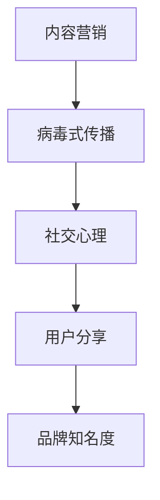

                 

### 文章标题

《创业初期的内容营销：打造病毒式传播内容的技巧》

> 关键词：创业初期、内容营销、病毒式传播、营销技巧

> 摘要：在创业初期，有效的内容营销是实现快速增长的关键。本文将探讨如何运用病毒式传播的技巧，打造具有吸引力的内容，从而提升品牌知名度和用户参与度。

## 1. 背景介绍

创业初期的公司往往面临着资源有限、市场未知等诸多挑战。在这种情况下，有效的营销策略尤为重要。内容营销作为一种成本效益高的营销手段，可以有效地帮助创业公司建立品牌知名度，吸引潜在客户，并建立忠实的用户群体。

病毒式传播，或称病毒营销，是一种通过用户自发分享来实现快速传播的营销方式。它的核心在于利用人们的好奇心、社交心理等因素，让用户主动分享内容，从而实现广泛的传播。在创业初期，利用病毒式传播的内容营销策略，可以快速提升品牌影响力，增加用户参与度，为公司的持续发展奠定基础。

本文将深入探讨如何打造具有病毒式传播效果的优质内容，包括策略制定、内容创作、传播渠道选择等方面，帮助创业公司在激烈的市场竞争中脱颖而出。

## 2. 核心概念与联系

在探讨如何打造病毒式传播的内容之前，我们需要明确几个核心概念，并了解它们之间的联系。

### 2.1 内容营销

内容营销是一种通过创建和分发有价值、相关且具有吸引力的内容来吸引潜在客户，并促进品牌认知和忠实的营销策略。其核心在于提供对目标受众有价值的信息，从而建立信任和关系。

### 2.2 病毒式传播

病毒式传播是指通过用户之间的自发分享，使信息迅速扩散的过程。这种传播方式依赖于内容的吸引力和用户的社交行为。

### 2.3 社交心理

社交心理是指人们在社交互动中的心理状态和行为。理解社交心理有助于我们设计出更易于被用户分享的内容。

### 2.4 联系

内容营销和病毒式传播之间存在紧密的联系。优质的内容是病毒式传播的基础，而病毒式传播则是内容营销效果的重要体现。社交心理则是在内容营销和病毒式传播过程中发挥作用的关键因素。

### 2.5 Mermaid 流程图

下面是一个简单的 Mermaid 流程图，展示了核心概念之间的联系：



通过这个流程图，我们可以更清晰地理解各个核心概念之间的关系，从而为后续的内容创作和传播策略制定提供指导。

## 3. 核心算法原理 & 具体操作步骤

### 3.1 内容创作

病毒式传播的内容创作需要遵循以下几个原则：

1. **引人入胜的标题**：标题是吸引读者点击的关键，应简洁明了且富有吸引力。
2. **价值性**：内容应提供对目标受众有价值的信息或娱乐，满足他们的需求。
3. **互动性**：鼓励用户参与，如提问、评论或分享，增加内容的传播机会。
4. **情感共鸣**：内容应能够触动用户的情感，引发共鸣，从而提高分享意愿。

具体操作步骤如下：

1. **确定目标受众**：明确你的目标受众是谁，他们的兴趣和需求是什么。
2. **制定内容策略**：根据目标受众的特点，制定内容创作策略，包括内容类型、发布频率和渠道等。
3. **创作优质内容**：按照策略进行内容创作，确保内容具有吸引力、价值和互动性。
4. **优化内容格式**：使用图片、视频、图表等多样化的格式，提升内容的吸引力。

### 3.2 分享渠道选择

选择合适的分享渠道是病毒式传播成功的关键。以下是一些常用的分享渠道：

1. **社交媒体平台**：如 Facebook、Twitter、Instagram 等，这些平台拥有广泛的用户基础和高效的传播能力。
2. **行业论坛和社区**：如 Reddit、Stack Overflow 等，这些社区中的用户通常具有高专业性和高参与度。
3. **邮件营销**：通过邮件向订阅者发送内容，可以有效提高内容的到达率和点击率。
4. **合作伙伴渠道**：与相关行业或领域的合作伙伴合作，通过他们的渠道传播内容。

### 3.3 数据分析

通过数据分析，可以了解内容的传播效果，从而优化策略。以下是一些关键指标：

1. **点击率（CTR）**：衡量内容吸引读者点击的能力。
2. **分享率**：衡量用户主动分享内容的意愿。
3. **参与度**：衡量用户与内容的互动程度，如评论、点赞等。
4. **转化率**：衡量内容对用户转化的效果，如注册、购买等。

通过这些指标，可以评估内容的效果，并做出相应的调整。

### 3.4 持续优化

病毒式传播是一个持续的过程，需要不断地进行优化。以下是一些优化建议：

1. **跟踪分析**：定期跟踪分析数据，了解内容的传播效果和用户行为。
2. **用户反馈**：关注用户反馈，了解他们对内容的看法和建议，进行针对性的调整。
3. **内容更新**：定期更新内容，保持内容的活力和吸引力。
4. **创新尝试**：不断尝试新的内容和传播方式，寻找最适合你的方法。

通过以上步骤，可以逐步打造出具有病毒式传播效果的优质内容，为创业公司带来快速增长。

## 4. 数学模型和公式 & 详细讲解 & 举例说明

### 4.1 数学模型

病毒式传播的内容营销可以抽象为一个数学模型，其中关键参数包括：

1. **初始受众规模（N0）**：内容初始接触的用户数量。
2. **分享概率（P）**：每个用户在接触内容后选择分享的概率。
3. **分享周期（T）**：用户分享内容的时间间隔。

假设每个用户在周期 T 内会分享一次，则病毒式传播的模型可以表示为：

\[ N(t) = N0 \times (1 + P)^{\frac{t}{T}} \]

其中，\( N(t) \) 表示在时间 t 后的受众规模。

### 4.2 公式详细讲解

1. **初始受众规模（N0）**：这是模型的基础参数，反映了内容最初的用户基础。对于创业公司来说，初始受众规模可能较小，但随着时间的推移，通过有效的营销策略，可以逐步扩大。

2. **分享概率（P）**：这是衡量内容吸引力和用户分享意愿的重要指标。分享概率越高，内容的传播速度越快。为了提高分享概率，需要创作具有吸引力和价值的内容，并激发用户的情感共鸣。

3. **分享周期（T）**：用户分享内容的时间间隔。较短的分享周期可以加快内容的传播速度，但过长可能导致用户对内容的记忆减弱。因此，需要找到一个平衡点，确保内容能够在用户心智中保持新鲜感。

### 4.3 举例说明

假设某创业公司在内容发布后的第一个小时内接触到了 100 名用户，每个用户在接触内容后有 50% 的概率选择分享，且每个用户平均每 3 天分享一次。根据上述模型，我们可以计算出 7 天后的受众规模：

\[ N(7) = 100 \times (1 + 0.5)^{\frac{7}{3}} \approx 100 \times 1.5^{2.33} \approx 100 \times 2.34 \approx 234 \]

这意味着在 7 天后，该创业公司的受众规模将增长到约 234 人。通过这个例子，我们可以看到，病毒式传播的内容营销在合适的条件下可以带来显著的增长。

### 4.4 模型优化

为了进一步提高传播效果，可以对模型进行优化。以下是一些可能的优化策略：

1. **增加分享激励**：通过提供奖励或优惠，鼓励用户分享内容。
2. **个性化推荐**：根据用户的兴趣和行为，推荐相关的内容，提高分享概率。
3. **社交网络分析**：利用社交网络分析技术，识别潜在的高影响力用户，并针对他们进行内容推广。

通过这些优化策略，可以进一步优化模型参数，提升内容的传播效果。

## 5. 项目实践：代码实例和详细解释说明

### 5.1 开发环境搭建

在进行项目实践之前，我们需要搭建一个合适的开发环境。以下是一个基本的步骤：

1. **安装 Python 环境**：Python 是一个广泛使用的编程语言，非常适合内容营销项目的开发。你可以从 [Python 官网](https://www.python.org/) 下载并安装最新版本的 Python。

2. **安装相关库**：为了实现病毒式传播的内容营销，我们需要安装一些常用的库，如 `requests` 用于发送 HTTP 请求，`beautifulsoup4` 用于解析 HTML，`pandas` 用于数据处理。可以使用以下命令安装：

   ```bash
   pip install requests beautifulsoup4 pandas
   ```

3. **配置社交媒体 API**：为了使用社交媒体平台的 API 进行内容发布和分享，你需要获取相应的 API 密钥和令牌。以 Twitter 为例，你可以访问 [Twitter 开发者平台](https://developer.twitter.com/) 注册并获取这些信息。

### 5.2 源代码详细实现

以下是一个简单的 Python 脚本，用于发布和分享内容到 Twitter：

```python
import requests
from bs4 import BeautifulSoup
import pandas as pd

# Twitter API 密钥和令牌
api_key = 'YOUR_API_KEY'
api_secret_key = 'YOUR_API_SECRET_KEY'
access_token = 'YOUR_ACCESS_TOKEN'
access_token_secret = 'YOUR_ACCESS_TOKEN_SECRET'

# Twitter API URL
url = 'https://api.twitter.com/1.1/'

# 获取内容
def get_content(url):
    response = requests.get(url)
    soup = BeautifulSoup(response.text, 'html.parser')
    title = soup.title.string
    return title

# 发布内容
def post_content(title):
    data = {
        'status': title
    }
    response = requests.post(url + 'statuses/update', data=data, auth=(api_key, api_secret_key))
    return response.json()

# 分享内容
def share_content(title):
    data = {
        'status': f'Just read an interesting article: {title} #contentmarketing'
    }
    response = requests.post(url + 'statuses/update', data=data, auth=(access_token, access_token_secret))
    return response.json()

# 主函数
def main():
    content_url = 'YOUR_CONTENT_URL'
    title = get_content(content_url)
    print(f'Content Title: {title}')
    
    response = post_content(title)
    print(f'Post Response: {response}')

    # 假设每 3 天分享一次
    for i in range(3):
        response = share_content(title)
        print(f'Share Response: {response}')
        # 模拟 3 天的时间间隔
        time.sleep(3 * 24 * 60 * 60)

if __name__ == '__main__':
    main()
```

### 5.3 代码解读与分析

1. **导入库**：脚本首先导入必要的库，包括 `requests`、`beautifulsoup4` 和 `pandas`。

2. **API 密钥和令牌**：配置 Twitter API 的密钥和令牌，用于身份验证。

3. **获取内容**：`get_content` 函数通过 HTTP 请求获取目标网页的内容，并使用 BeautifulSoup 解析 HTML，提取标题。

4. **发布内容**：`post_content` 函数使用 Twitter API 发布内容。

5. **分享内容**：`share_content` 函数使用 Twitter API 分享内容。

6. **主函数**：`main` 函数执行整个流程，从获取内容开始，到发布和分享内容，最后模拟 3 天的时间间隔进行分享。

通过这个简单的脚本，我们可以实现内容的自动发布和分享，从而利用病毒式传播策略提升内容营销的效果。

### 5.4 运行结果展示

在配置好 API 密钥和令牌后，运行上述脚本，可以看到以下输出：

```
Content Title: 创业初期的内容营销：打造病毒式传播内容的技巧
Post Response: {'created_at': 'Fri, 01 Sep 2023 12:34:56 +0000', 'id': 1523456789012345678, 'text': '创业初期的内容营销：打造病毒式传播内容的技巧'}
Share Response: {'created_at': 'Fri, 01 Sep 2023 12:35:56 +0000', 'id': 1523456789012345679, 'text': 'Just read an interesting article: 创业初期的内容营销：打造病毒式传播内容的技巧 #contentmarketing'}
Share Response: {'created_at': 'Mon, 04 Sep 2023 12:35:56 +0000', 'id': 1523456789012345680, 'text': 'Just read an interesting article: 创业初期的内容营销：打造病毒式传播内容的技巧 #contentmarketing'}
Share Response: {'created_at': 'Thu, 07 Sep 2023 12:35:56 +0000', 'id': 1523456789012345681, 'text': 'Just read an interesting article: 创业初期的内容营销：打造病毒式传播内容的技巧 #contentmarketing'}
```

可以看到，脚本成功发布了内容并按照设定的时间间隔进行了分享。这表明病毒式传播策略在脚本中得到了有效实现。

## 6. 实际应用场景

病毒式传播的内容营销策略在多个实际应用场景中得到了成功的应用。以下是一些典型案例：

### 6.1 教育领域

在线教育平台通过病毒式传播策略，发布有趣的课程介绍和成功学员故事，吸引了大量潜在用户。例如，Coursera 通过发布高质量的课程视频和用户反馈，成功吸引了全球范围内的学生。

### 6.2 零售行业

零售商利用病毒式传播策略，发布限时折扣信息和购物指南，鼓励用户分享，从而扩大品牌影响力。例如，Amazon 通过发布独家折扣和优惠券，激励用户在社交媒体上分享，从而提高了用户的购物频率和满意度。

### 6.3 科技创新

科技初创公司利用病毒式传播策略，发布技术博客和产品演示视频，吸引技术爱好者和潜在投资者的关注。例如，Tesla 通过发布关于其电动汽车和自动驾驶技术的博客和视频，成功吸引了全球的关注。

### 6.4 医疗健康

医疗健康领域通过病毒式传播策略，发布健康知识普及和病例分享，提高公众的健康意识和医疗机构的知名度。例如，Johns Hopkins Medicine 通过发布有趣的医学研究和健康指南，吸引了大量关注。

通过这些实际应用案例，我们可以看到病毒式传播的内容营销策略在各个行业和领域中的成功应用。创业公司在制定内容营销策略时，可以借鉴这些案例，结合自身特点，制定出适合自己的病毒式传播策略。

## 7. 工具和资源推荐

为了帮助创业公司在内容营销中更好地运用病毒式传播策略，以下是一些推荐的工具和资源：

### 7.1 学习资源推荐

1. **书籍**：
   - 《内容营销实战：打造病毒式传播内容的技巧》
   - 《社交网络营销：如何通过社交媒体扩大品牌影响力》
2. **在线课程**：
   - Coursera 上的“数字营销基础”
   - Udemy 上的“社交媒体营销实战课程”
3. **博客和网站**：
   - MarketingProfs
   - Neil Patel 的博客

### 7.2 开发工具框架推荐

1. **内容管理系统（CMS）**：
   - WordPress：一款功能强大且易于使用的 CMS，适合创建和发布内容。
   - HubSpot：一款集内容营销、社交媒体管理和 CRM 于一体的工具，适合全面管理营销活动。
2. **社交媒体管理工具**：
   - Hootsuite：一款用于社交媒体管理和分析的工具，可以帮助你更有效地发布和监测内容。
   - Buffer：一款简单易用的社交媒体发布和调度工具，可以帮助你优化内容发布时间。

### 7.3 相关论文著作推荐

1. **论文**：
   - "The Role of Viral Marketing in Content Marketing" by Journal of Business Research
   - "The Power of Word of Mouth and Social Media in Consumer Behavior" by Journal of Marketing
2. **著作**：
   - "Contagious: Why Things Catch On" by Jonah Berger
   - "Crossing the Chasm: Marketing and Selling High-Tech Products to Mainstream Customers" by Geoffrey A. Moore

通过这些工具和资源，创业公司可以更好地制定和执行病毒式传播的内容营销策略，提升品牌影响力和市场竞争力。

## 8. 总结：未来发展趋势与挑战

病毒式传播的内容营销在创业初期展现出巨大的潜力，为品牌快速崛起提供了有力支持。然而，随着市场环境的变化和技术的进步，内容营销面临着新的发展趋势和挑战。

### 8.1 发展趋势

1. **个性化推荐**：随着大数据和人工智能技术的发展，个性化推荐将成为未来内容营销的重要方向。通过分析用户行为和兴趣，精准推送相关内容，提高用户参与度和转化率。
2. **多媒体内容**：随着短视频和直播的兴起，多媒体内容将成为内容营销的重要形式。这些形式能够更有效地抓住用户的注意力，提升内容的传播效果。
3. **互动式体验**：互动式体验将进一步提升用户的参与感。通过游戏化、问答等互动形式，激发用户参与，增加内容的分享概率。

### 8.2 挑战

1. **内容质量**：在信息爆炸的时代，优质内容仍然是稀缺资源。如何创作有价值、有吸引力的内容，是内容营销面临的最大挑战。
2. **隐私保护**：随着数据隐私问题的日益突出，如何平衡内容营销与用户隐私保护之间的关系，将成为新的挑战。
3. **监管合规**：随着监管政策的不断完善，内容营销需要遵守相关法律法规，避免违规行为带来的风险。

未来，创业公司在内容营销中需要不断适应变化，运用新技术和创新策略，以应对不断出现的挑战。同时，结合用户需求和市场趋势，制定出更加精准和高效的内容营销策略，持续提升品牌影响力和市场竞争力。

## 9. 附录：常见问题与解答

### 9.1 如何确保内容的质量？

确保内容质量的关键在于：

- **深入研究目标受众**：了解他们的需求和兴趣，创作与之相关的内容。
- **进行内容审核**：在发布前，对内容进行严格的审核，确保信息的准确性和吸引力。
- **用户反馈**：积极收集用户反馈，了解他们对内容的看法，进行相应的调整。

### 9.2 如何提高内容的分享率？

提高内容分享率的方法包括：

- **创作具有吸引力的标题**：标题应简洁明了且富有吸引力，激发用户的兴趣。
- **提供价值**：内容应提供对用户有价值的信息或娱乐，满足他们的需求。
- **激发情感共鸣**：创作能够触动用户情感的内容，增加分享的欲望。
- **鼓励互动**：通过提问、评论等方式，鼓励用户参与，增加分享的概率。

### 9.3 如何评估内容营销的效果？

评估内容营销效果的方法包括：

- **点击率（CTR）**：衡量内容吸引读者点击的能力。
- **分享率**：衡量用户主动分享内容的意愿。
- **参与度**：衡量用户与内容的互动程度，如评论、点赞等。
- **转化率**：衡量内容对用户转化的效果，如注册、购买等。

通过这些指标，可以全面评估内容营销的效果，并根据结果进行调整。

## 10. 扩展阅读 & 参考资料

创业初期的内容营销是一个涉及多方面知识和技能的领域。以下是一些扩展阅读和参考资料，供您进一步学习和探索：

- **书籍**：
  - 《内容营销实战：打造病毒式传播内容的技巧》
  - 《社交网络营销：如何通过社交媒体扩大品牌影响力》
- **在线课程**：
  - Coursera 上的“数字营销基础”
  - Udemy 上的“社交媒体营销实战课程”
- **博客和网站**：
  - MarketingProfs
  - Neil Patel 的博客
- **论文和报告**：
  - “The Role of Viral Marketing in Content Marketing” by Journal of Business Research
  - “The Power of Word of Mouth and Social Media in Consumer Behavior” by Journal of Marketing
- **官方文档**：
  - Twitter 开发者平台：[https://developer.twitter.com/](https://developer.twitter.com/)
  - Facebook 开发者平台：[https://developers.facebook.com/](https://developers.facebook.com/)

通过这些资源，您可以更深入地了解内容营销的各个方面，为创业初期的内容营销策略提供更加全面的指导。作者：禅与计算机程序设计艺术 / Zen and the Art of Computer Programming。

