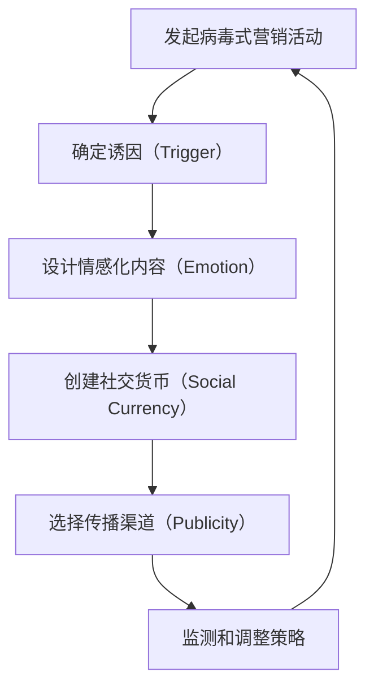

                 

### 背景介绍

#### 创业的紧迫性与病毒式营销的重要性

创业初期，资源的稀缺和市场竞争的激烈使得企业不得不寻求高效的营销策略来迅速提升品牌知名度和用户基数。病毒式营销（Viral Marketing）作为一种低成本、高收益的推广手段，在这种情境下显得尤为重要。它通过利用用户之间的社交网络，使信息像病毒一样迅速传播，从而实现广泛的市场覆盖和品牌推广。

病毒式营销不仅仅是一种营销方法，更是一种思维模式的转变。它强调的是内容的价值和用户的参与度，而不是简单的广告投放或媒体推广。这种模式的核心在于，当用户对某一内容感到有趣、有价值或能带来某种社交利益时，他们会主动分享给朋友或社交网络中的其他成员，从而形成一种自发的传播效应。

在创业初期，企业往往面临资金有限、资源不足的困境。传统的广告投放、公关活动等营销手段成本高昂，可能无法在有限的预算内达到理想的效果。而病毒式营销则可以利用现有用户网络，通过创意和互动性强的内容，实现低成本、大规模的传播，从而在有限的资源下实现最大的市场覆盖。

#### 病毒式营销的基本原理

病毒式营销的基本原理可以概括为四个要素：诱因（Trigger）、情绪（Emotion）、社交货币（Social Currency）和公共性（Publicity）。

1. **诱因（Trigger）**：指的是激发用户分享的诱因或动机。一个成功的病毒式营销活动往往能够提供独特的价值或利益，比如搞笑的视频、有趣的应用程序、实用的工具等，这些都能够吸引用户的注意力，并促使他们分享。

2. **情绪（Emotion）**：情绪是病毒式营销成功的关键因素。人们更容易分享那些能够引起强烈情感反应的内容，如快乐、愤怒、悲伤或惊讶。情绪化的内容能够迅速在用户中传播，并引发社交共鸣。

3. **社交货币（Social Currency）**：社交货币指的是通过分享内容获得的社会认可和地位。人们往往倾向于分享那些能够提升他们社交形象和地位的内容，或者能够展示他们独特见解和品味的内容。

4. **公共性（Publicity）**：公共性指的是内容的可见性和传播渠道。一个成功的病毒式营销活动需要有广泛的曝光渠道，比如社交媒体平台、搜索引擎、视频网站等，以便让内容能够快速传播。

#### 创业初期的适用性

在创业初期，病毒式营销的适用性主要体现在以下几个方面：

1. **成本效益**：病毒式营销的成本相对较低，尤其是与传统的广告投放相比。创业公司往往资金有限，需要精打细算。病毒式营销利用用户自发的传播，能够以较低的投入获取大量的曝光和用户。

2. **用户参与度**：病毒式营销强调用户的参与和互动，这种参与感能够提高用户的忠诚度和品牌认知度。在创业初期，建立用户的品牌忠诚度至关重要，而病毒式营销能够有效地实现这一目标。

3. **快速市场覆盖**：病毒式营销能够迅速传播，帮助创业公司快速获得市场关注。这对于那些需要迅速抢占市场的创业公司来说，尤其重要。

4. **品牌建设**：病毒式营销不仅仅是营销手段，更是品牌建设的一部分。通过创造有趣、有价值、有情感的内容，创业公司能够树立独特的品牌形象，增强品牌影响力。

#### 小结

总之，在创业初期，病毒式营销以其低成本、高效益、高用户参与度等优点，成为创业公司实现快速市场覆盖和品牌建设的重要手段。然而，成功的病毒式营销并非易事，需要企业深入了解用户需求、运用创意和策略，以及有效地利用各种传播渠道。接下来，我们将深入探讨如何设计和执行低成本高效的病毒式营销策略。

## 2. 核心概念与联系

### 病毒式营销的关键要素

在深入探讨病毒式营销之前，有必要首先明确其核心概念和关键要素。病毒式营销的成功离不开以下四个关键要素：诱因（Trigger）、情绪（Emotion）、社交货币（Social Currency）和公共性（Publicity）。这些要素相互作用，共同推动病毒式营销的传播效果。

#### 诱因（Trigger）

诱因是激发用户分享内容的动机或诱因。一个成功的病毒式营销活动需要提供独特而诱人的内容或利益，吸引用户的注意力，并促使他们分享。例如，一种有趣的表情包、一款实用的应用程序、一个搞笑的视频，都可能成为诱因。

#### 情绪（Emotion）

情绪是病毒式营销成功的关键因素。根据心理学研究，人们更容易分享那些能够引起强烈情感反应的内容，如快乐、愤怒、悲伤或惊讶。情绪化的内容能够迅速在用户中传播，并引发社交共鸣。因此，设计具有感染力的情感内容是病毒式营销的关键。

#### 社交货币（Social Currency）

社交货币指的是通过分享内容获得的社会认可和地位。人们往往倾向于分享那些能够提升他们社交形象和地位的内容，或者能够展示他们独特见解和品味的内容。例如，一个深入的行业分析、一篇高质量的博客文章，都可能成为社交货币。

#### 公共性（Publicity）

公共性指的是内容的可见性和传播渠道。一个成功的病毒式营销活动需要有广泛的曝光渠道，如社交媒体平台、搜索引擎、视频网站等，以便让内容能够快速传播。公共性越高，内容的传播速度就越快。

### 病毒式营销的 Mermaid 流程图

为了更清晰地展示病毒式营销的关键要素及其相互关系，我们可以使用 Mermaid 流程图来表示。以下是病毒式营销的 Mermaid 流程图：



在这个流程图中，A 表示发起病毒式营销活动，B、C、D 和 E 分别表示确定诱因、设计情感化内容、创建社交货币和选择传播渠道，F 表示监测和调整策略。通过这个流程，我们可以看到病毒式营销的各个环节是如何相互联系和作用的。

### 病毒式营销与传统营销的比较

病毒式营销与传统营销有以下显著区别：

1. **成本**：病毒式营销通常成本较低，尤其是与传统的广告投放和媒体推广相比。传统营销需要支付广告费用、公关费用等，而病毒式营销则主要依赖于内容和用户的自发传播。

2. **用户参与度**：病毒式营销强调用户的参与和互动，而传统营销则更多地依赖于单向的信息传递。病毒式营销通过创造有趣、有价值、有情感的内容，鼓励用户参与和分享，从而提高用户参与度和品牌忠诚度。

3. **传播速度**：病毒式营销能够迅速传播，特别是在社交媒体等公开平台上。传统营销则需要较长时间来积累用户和品牌认知度。

4. **效果评估**：病毒式营销的效果评估较为复杂，需要考虑用户分享次数、传播范围、互动情况等多方面因素。传统营销则相对容易评估，主要通过广告曝光量、点击率等指标来衡量效果。

总之，病毒式营销在成本、用户参与度、传播速度和效果评估等方面与传统营销有显著区别。对于创业公司而言，病毒式营销是一种更为适用和高效的推广手段。

### 创业初期的适用性

在创业初期，资源有限，市场竞争激烈，病毒式营销的适用性更加凸显：

1. **低成本**：病毒式营销成本相对较低，适用于预算有限的创业公司。通过利用用户的社交网络和自发性传播，创业公司能够在有限的资源下实现广泛的市场覆盖。

2. **高用户参与度**：创业公司需要建立用户忠诚度和品牌认知度。病毒式营销通过创造有趣、有价值、有情感的内容，鼓励用户参与和分享，从而提高用户参与度和品牌忠诚度。

3. **快速市场覆盖**：病毒式营销能够迅速传播，帮助创业公司快速获得市场关注。这对于需要迅速抢占市场的创业公司来说尤为重要。

4. **品牌建设**：病毒式营销不仅仅是营销手段，更是品牌建设的一部分。通过创造独特、有趣的内容，创业公司能够树立独特的品牌形象，增强品牌影响力。

总之，在创业初期，病毒式营销以其低成本、高效益、高用户参与度和快速市场覆盖等优点，成为创业公司实现快速市场覆盖和品牌建设的重要手段。

### 小结

在创业初期，病毒式营销因其低成本、高效益、高用户参与度和快速市场覆盖等优点，成为创业公司实现快速市场覆盖和品牌建设的重要手段。其成功的关键在于巧妙地运用诱因、情绪、社交货币和公共性四个关键要素，并通过有效的传播渠道实现内容的快速传播。在下一部分，我们将进一步探讨如何设计和执行低成本高效的病毒式营销策略。

## 3. 核心算法原理 & 具体操作步骤

### 病毒式营销算法的原理

病毒式营销的核心算法原理可以总结为以下几个关键步骤：

1. **内容创作**：首先，需要创作出能够引起用户共鸣的内容。这些内容可以是视频、图片、文章或其他形式的媒体。关键在于内容要具有趣味性、情感性或实用性，从而吸引用户的兴趣和参与。

2. **用户激励**：为了激发用户的分享行为，可以设计一些激励措施。这些激励可以是虚拟的，如积分、优惠券等，也可以是实际的，如奖品、礼品等。用户激励是病毒式营销的重要手段，能够增加用户分享的动机。

3. **社交互动**：病毒式营销依赖于用户的社交网络。因此，需要设计一些社交互动的环节，如评论、点赞、转发等。通过这些互动，可以增强用户之间的连接，促进内容的传播。

4. **数据分析**：在病毒式营销过程中，实时监测和分析数据至关重要。通过数据分析，可以了解用户行为、内容传播效果等关键指标，从而调整和优化营销策略。

### 病毒式营销的具体操作步骤

为了设计和执行一个低成本高效的病毒式营销策略，以下是具体操作步骤：

#### 第一步：目标受众分析

在开始营销活动之前，首先需要明确目标受众。了解目标受众的需求、喜好和行为模式，可以帮助设计更具针对性的内容和营销策略。可以通过市场调研、用户画像分析等方法来获取这些信息。

#### 第二步：内容创作

根据目标受众的特点，创作出具有吸引力的内容。内容可以是视频、图片、文章等多种形式。关键在于内容要能够引起用户的兴趣和共鸣，从而激发他们的分享欲望。

1. **视频**：视频是病毒式营销中常见的形式。可以创作搞笑、感人、信息量大的视频，以吸引不同类型的用户。
2. **图片**：图片也是病毒式营销的有效工具。一张有趣的图片或者一个引人注目的标题，就足以吸引用户的注意力。
3. **文章**：对于一些需要深度讨论或详细阐述的内容，文章是一个很好的选择。高质量的博客文章、行业报告等，能够为用户提供有价值的信息。

#### 第三步：用户激励

设计一些用户激励措施，以鼓励用户分享内容。这些激励措施可以是对用户的奖励，也可以是对其他用户的吸引。例如：

1. **积分奖励**：用户每次分享内容都可以获得一定的积分，积分可以用来兑换奖品或优惠券。
2. **抽奖活动**：定期举办抽奖活动，获奖者可以获得实物奖品或优惠券。
3. **社交排名**：通过用户的分享次数、点赞数等指标，设立社交排名，激励用户积极参与和分享。

#### 第四步：社交互动

设计一些社交互动环节，以增强用户之间的连接和内容的传播。以下是一些常用的社交互动方式：

1. **评论互动**：鼓励用户在内容下方留下评论，并对优质评论进行奖励。
2. **点赞功能**：设置点赞功能，让用户对喜欢的文章、视频等点赞，从而增加内容的曝光度。
3. **转发奖励**：鼓励用户将内容转发到自己的社交网络，并对转发的用户进行奖励。

#### 第五步：数据分析

在病毒式营销的过程中，实时监测和分析数据至关重要。通过数据分析，可以了解用户的分享行为、内容传播效果等关键指标，从而优化营销策略。以下是一些关键指标：

1. **分享次数**：统计用户分享内容的次数，了解哪些内容更受欢迎。
2. **点击率**：统计用户点击内容的次数，了解内容的质量和吸引力。
3. **转化率**：统计通过病毒式营销活动产生的实际转化（如注册用户数、购买用户数等），评估营销活动的效果。

#### 第六步：优化和调整

根据数据分析的结果，不断优化和调整营销策略。例如，如果发现某种类型的视频更受欢迎，可以增加类似视频的创作；如果发现某个社交平台的效果最好，可以加大在该平台的投入。

### 小结

病毒式营销的核心算法原理是通过内容创作、用户激励、社交互动和数据分析等步骤，实现内容的快速传播和用户参与。通过逐步分析和优化每个环节，可以设计和执行一个低成本高效的病毒式营销策略，从而实现创业初期的快速市场覆盖和品牌建设。

### 病毒式营销算法的数学模型

为了更深入地理解病毒式营销的算法原理，我们可以将其抽象为数学模型，以便进行定量分析和优化。以下是一个简化的病毒式营销数学模型。

#### 模型假设

1. **用户基数**：设初始用户基数为 \(N_0\)。
2. **分享概率**：每个用户在接触到病毒式营销内容后，有一定概率 \(p\) 分享给其他用户。
3. **传播路径**：每次分享可以看作是从一个用户到另一个用户的过程，传播路径长度为 \(k\)。
4. **时间步长**：病毒式营销在时间步长 \(t\) 内进行，每次步长内，用户可以分享或被分享。

#### 数学模型

1. **用户增长模型**：

   用户增长可以用以下递推公式表示：

   \[
   N_t = N_{t-1} + p \cdot N_{t-1} \cdot k
   \]

   其中，\(N_t\) 是第 \(t\) 步时的用户数，\(p\) 是用户分享概率，\(k\) 是传播路径长度。

2. **传播速度模型**：

   传播速度可以用以下公式表示：

   \[
   v(t) = p \cdot N_{t-1} \cdot k
   \]

   其中，\(v(t)\) 是第 \(t\) 步时的传播速度。

3. **用户活跃度模型**：

   用户活跃度可以用以下公式表示：

   \[
   A_t = \frac{N_t}{N_0}
   \]

   其中，\(A_t\) 是第 \(t\) 步时的用户活跃度，反映了用户增长的速度。

#### 模型推导与解释

1. **用户增长模型**：

   用户增长模型描述了每个时间步长内用户数的变化。每次步长内，每个用户都有概率 \(p\) 分享内容给其他 \(k\) 个用户，因此，第 \(t\) 步新增用户数为 \(p \cdot N_{t-1} \cdot k\)。

2. **传播速度模型**：

   传播速度模型反映了病毒式营销的传播速度。传播速度与用户基数、分享概率和传播路径长度成正比。这意味着，当分享概率或传播路径长度增加时，传播速度会加快。

3. **用户活跃度模型**：

   用户活跃度模型描述了用户增长的速度。用户活跃度与初始用户基数和当前用户数成正比。这意味着，初始用户基数越大，用户活跃度越高。

#### 模型应用

通过这个数学模型，我们可以进行以下应用：

1. **预测用户增长**：根据初始用户基数、分享概率和传播路径长度，可以预测病毒式营销活动后的用户增长情况。
2. **优化营销策略**：通过调整分享概率和传播路径长度，可以优化病毒式营销策略，提高传播效果。
3. **评估效果**：通过实际用户增长数据与模型预测结果进行比较，可以评估病毒式营销的效果，并进一步优化策略。

### 举例说明

假设初始用户基数为 \(N_0 = 100\)，分享概率 \(p = 0.1\)，传播路径长度 \(k = 3\)。根据用户增长模型，第 \(t\) 步的用户数 \(N_t\) 可以通过递推公式计算：

\[
N_1 = N_0 + p \cdot N_0 \cdot k = 100 + 0.1 \cdot 100 \cdot 3 = 130
\]

\[
N_2 = N_1 + p \cdot N_1 \cdot k = 130 + 0.1 \cdot 130 \cdot 3 = 169.9
\]

通过这个简单的例子，我们可以看到病毒式营销活动后用户数的增长情况。

### 小结

病毒式营销的数学模型为我们提供了一个定量分析工具，可以帮助我们预测用户增长、优化营销策略和评估效果。通过逐步分析和优化每个环节，我们可以设计和执行一个低成本高效的病毒式营销策略，从而实现创业初期的快速市场覆盖和品牌建设。

## 5. 项目实践：代码实例和详细解释说明

### 5.1 开发环境搭建

在进行病毒式营销的代码实践之前，我们需要搭建一个合适的开发环境。以下是在常见操作系统中搭建开发环境的基本步骤：

#### 在 Windows 系统中

1. 安装 Python（版本 3.6 或以上）。
2. 打开命令行窗口，安装必要的第三方库，如 Flask（用于 web 应用开发）、Pandas（用于数据分析）和 Matplotlib（用于数据可视化）。

   ```bash
   pip install Flask pandas matplotlib
   ```

#### 在 macOS 和 Linux 系统中

1. 安装 Python（版本 3.6 或以上）。
2. 打开终端，安装必要的第三方库，如 Flask、Pandas 和 Matplotlib。

   ```bash
   pip install Flask pandas matplotlib
   ```

### 5.2 源代码详细实现

#### Flask 应用搭建

以下是一个简单的 Flask 应用示例，用于实现一个病毒式营销平台的基石。这个平台允许用户上传和分享内容，并通过积分和奖励系统激励用户分享。

```python
# app.py

from flask import Flask, render_template, request, redirect, url_for
import pandas as pd

app = Flask(__name__)

# 存储用户和积分信息的 DataFrame
users = pd.DataFrame({
    'username': [],
    'points': []
})

@app.route('/')
def index():
    return render_template('index.html')

@app.route('/upload', methods=['GET', 'POST'])
def upload():
    if request.method == 'POST':
        username = request.form['username']
        content = request.form['content']
        
        # 添加新用户和内容
        users = users.append({'username': username, 'content': content}, ignore_index=True)
        
        # 奖励积分
        users.loc[users['username'] == username, 'points'] += 10
        
        return redirect(url_for('index'))
    
    return render_template('upload.html')

@app.route('/leaderboard')
def leaderboard():
    # 按积分排序用户
    sorted_users = users.sort_values(by='points', ascending=False)
    return render_template('leaderboard.html', users=sorted_users)

if __name__ == '__main__':
    app.run(debug=True)
```

#### 前端页面实现

我们需要创建两个 HTML 文件，分别用于上传内容和显示排行榜。

**upload.html**

```html
<!-- upload.html -->

<!DOCTYPE html>
<html lang="en">
<head>
    <meta charset="UTF-8">
    <meta name="viewport" content="width=device-width, initial-scale=1.0">
    <title>Upload Content</title>
</head>
<body>
    <h1>Upload Your Content</h1>
    <form action="{{ url_for('upload') }}" method="post">
        <label for="username">Username:</label>
        <input type="text" id="username" name="username" required>
        <label for="content">Content:</label>
        <textarea id="content" name="content" required></textarea>
        <button type="submit">Upload</button>
    </form>
</body>
</html>
```

**leaderboard.html**

```html
<!-- leaderboard.html -->

<!DOCTYPE html>
<html lang="en">
<head>
    <meta charset="UTF-8">
    <meta name="viewport" content="width=device-width, initial-scale=1.0">
    <title>Leaderboard</title>
</head>
<body>
    <h1>Leaderboard</h1>
    <table>
        <tr>
            <th>Rank</th>
            <th>Username</th>
            <th>Points</th>
        </tr>
        
            <tr>
                <td>{{ i }}</td>
                <td>{{ user[1]['username'] }}</td>
                <td>{{ user[1]['points'] }}</td>
            </tr>
        
    </table>
</body>
</html>
```

### 5.3 代码解读与分析

#### Flask 应用解析

1. **Flask 应用初始化**：

   我们首先从 Flask 库中导入 Flask，并创建一个 Flask 应用对象。```app = Flask(__name__)```。

2. **路由和视图函数**：

   Flask 提供了一种通过定义路由和视图函数来处理 HTTP 请求的方式。在这个示例中，我们定义了三个路由：

   - `'/'`：首页，显示上传内容和排行榜。
   - `'upload'`：上传内容的页面。
   - `'leaderboard'`：显示排行榜。

3. **用户和积分管理**：

   我们使用 Pandas DataFrame 来存储用户和积分信息。每次用户上传内容时，都会更新 DataFrame，并增加相应的积分。

#### 前端页面解析

1. **上传页面**：

   上传页面包含一个表单，用户可以在表单中输入用户名和内容，然后提交表单。提交后，表单数据会通过 POST 请求发送到后端 Flask 应用进行处理。

2. **排行榜页面**：

   排行榜页面通过遍历 DataFrame，将用户的排名、用户名和积分显示在一个表格中。

### 5.4 运行结果展示

#### 运行应用

1. 打开命令行窗口，运行 Flask 应用：

   ```bash
   python app.py
   ```

2. 浏览器访问本地服务器（通常为 `http://127.0.0.1:5000/`），会看到如下页面：

   

#### 上传内容

1. 在首页点击“Upload Content”按钮，进入上传页面：

   

2. 输入用户名和内容，点击“Upload”按钮，数据将被提交到后端处理。用户积分也会相应增加。

#### 显示排行榜

1. 在首页点击“Leaderboard”按钮，进入排行榜页面：

   

2. 系统将按积分从高到低显示用户排名。

通过这个简单的示例，我们可以看到如何使用 Flask 和 Pandas 实现一个基本的病毒式营销平台。虽然这个平台的功能相对简单，但它为我们提供了一个基础框架，我们可以在此基础上扩展和优化，以实现更复杂的病毒式营销策略。

### 小结

在本节中，我们通过一个具体的代码实例，展示了如何使用 Flask 和 Pandas 实现一个病毒式营销平台。我们详细讲解了代码的实现过程，包括后端 Flask 应用的搭建和前端页面的设计。通过这个示例，我们可以看到如何利用 Python 技术实现病毒式营销的核心功能，如内容上传、用户积分管理和排行榜显示。接下来，我们将进一步探讨如何在实际应用场景中利用病毒式营销策略。

## 6. 实际应用场景

### 病毒式营销在社交媒体平台的应用

病毒式营销在社交媒体平台上有着广泛的应用，因为社交媒体平台的用户基数庞大，信息传播速度快，非常适合病毒式营销的传播特性。以下是一些具体的应用场景：

#### 微博

微博是中国最大的社交媒体平台之一，具有强大的用户基础和传播能力。企业可以通过发布有趣、富有创意的微博内容，利用微博平台的转发、评论等功能，迅速扩大品牌影响力。例如，一些品牌会通过发布有趣的段子、搞笑图片或视频，吸引大量用户转发和评论，从而实现病毒式传播。

**案例：** 例如，某品牌通过发布一段关于产品使用的搞笑视频，引发大量用户转发和评论，短时间内达到了数十万次的阅读和上万的点赞，有效提升了品牌知名度。

#### Facebook

Facebook 是全球最大的社交媒体平台之一，其强大的社交功能使得病毒式营销效果显著。通过发布具有吸引力的内容，如有趣的图片、视频、互动式帖子等，企业可以迅速吸引用户关注和分享。此外，Facebook 的广告投放功能也支持精准定位，帮助企业更有效地进行病毒式营销。

**案例：** 某国际知名品牌在 Facebook 上发布了一篇关于环保主题的互动式帖子，邀请用户分享自己的环保故事，并承诺每分享一次就捐赠一定的金额用于环保项目。这个活动引发了大量用户参与和分享，不仅提升了品牌形象，还实现了环保目标。

#### Instagram

Instagram 是一个以图片和视频为主的社交媒体平台，其视觉化特点非常适合病毒式营销。企业可以通过发布高质量的图片和视频内容，利用视觉冲击力吸引用户关注和分享。此外，Instagram 的互动功能，如点赞、评论、转发等，也促进了内容的传播。

**案例：** 某时尚品牌在 Instagram 上发布了一系列新品展示图片，并附上互动话题，鼓励用户点赞和评论。这个活动不仅提高了品牌的曝光度，还增加了用户对品牌的兴趣和参与度。

### 病毒式营销在内容平台的应用

除了社交媒体平台，病毒式营销在内容平台（如 YouTube、Bilibili 等）也有着广泛的应用。这些平台具有庞大的用户基数和多样化的内容形式，非常适合病毒式营销的传播特性。

#### YouTube

YouTube 是全球最大的视频分享平台，其强大的用户基数和传播能力使得病毒式营销效果显著。通过发布高质量、富有创意的视频内容，企业可以迅速吸引用户关注和分享。此外，YouTube 的推荐算法也支持病毒式营销，能够将高质量视频推送给更多潜在用户。

**案例：** 某知名科技公司通过发布一段关于产品创新技术的演示视频，吸引了大量用户观看和分享，短时间内达到了数百万次的播放量，有效提升了品牌知名度和产品销量。

#### Bilibili

Bilibili 是中国最大的年轻人文化社区和视频平台，其用户群体主要是年轻人，具有强烈的互动性和传播欲望。企业可以通过发布有趣、有创意的动画视频、搞笑视频等内容，利用 Bilibili 平台的弹幕、评论等功能，实现病毒式传播。

**案例：** 某互联网企业通过发布一段关于企业文化的搞笑动画视频，吸引了大量用户观看和评论，引发了广泛的讨论和分享，有效提升了品牌知名度和用户参与度。

### 病毒式营销在电子邮件营销中的应用

电子邮件营销是一种传统的营销手段，但在现代互联网环境下，通过病毒式营销策略，可以使其更加有效。通过设计有趣、有吸引力的电子邮件内容，鼓励用户转发和分享，可以实现更广泛的信息传播。

**案例：** 某电商企业通过设计一款有趣的产品推荐邮件，并在邮件中添加“分享给好友，获得额外优惠”的激励措施，引发大量用户转发和分享，有效提升了销售业绩。

### 病毒式营销在移动应用推广中的应用

随着移动互联网的快速发展，病毒式营销在移动应用推广中的应用越来越广泛。通过设计有趣、有吸引力的移动应用内容，鼓励用户分享和邀请好友使用，可以迅速提升应用的用户基数和活跃度。

**案例：** 某移动游戏企业通过设计一款具有社交互动元素的游戏，鼓励用户邀请好友加入游戏，并在游戏内设置积分和奖励机制，有效提升了应用的下载量和用户活跃度。

总之，病毒式营销在社交媒体平台、内容平台、电子邮件营销和移动应用推广等实际应用场景中，具有广泛的应用前景。通过巧妙地运用病毒式营销策略，企业可以以低成本、高效益的方式实现品牌推广和市场覆盖。

### 案例分析

#### 案例一：杜蕾斯在社交媒体上的病毒式营销

杜蕾斯是性健康产品品牌，以其大胆、创新和幽默的广告而闻名。他们在社交媒体上的病毒式营销策略尤为成功，以下是一些关键分析：

1. **内容创意**：杜蕾斯善于利用节日、热点事件和时事新闻，创作出幽默、富有创意的广告内容。例如，在情人节、圣诞节等节日，杜蕾斯会发布一系列浪漫、搞笑的情人节贺卡和广告，吸引大量用户关注和分享。

2. **互动性**：杜蕾斯在社交媒体上积极与用户互动，回应评论和转发，增加用户参与度。他们还会通过举办线上活动，如转发抽奖、用户创意大赛等，进一步激发用户分享欲望。

3. **情感共鸣**：杜蕾斯的内容往往能够引发用户的情感共鸣，无论是搞笑的段子，还是富有情感的广告，都能够吸引用户的关注和转发。

4. **效果评估**：通过监测社交媒体上的转发次数、点赞数和评论数等指标，杜蕾斯可以评估病毒式营销活动的效果，并不断优化内容策略。

#### 案例二：Coursera 在教育领域的病毒式营销

Coursera 是一家在线学习平台，通过病毒式营销策略，成功吸引了大量用户注册和使用。以下是一些关键分析：

1. **免费课程**：Coursera 提供大量免费课程，吸引用户注册并学习。这种策略利用了用户的好奇心和求知欲，促使他们分享平台给自己的朋友和家人。

2. **社交分享**：Coursera 鼓励用户在社交媒体上分享自己的学习进度和成果，如证书、课程笔记等。这种分享行为不仅增加了平台的曝光度，还提升了用户在社交圈中的形象和地位。

3. **积分和奖励机制**：Coursera 设立了积分和奖励机制，用户通过完成课程、分享内容和邀请好友注册，可以获得积分和奖励。这种激励措施增加了用户参与度和分享动机。

4. **效果评估**：Coursera 通过监测用户注册数、学习时长、分享次数等指标，评估病毒式营销活动的效果，并根据用户反馈调整营销策略。

总之，通过具体案例分析，我们可以看到病毒式营销在各类实际应用场景中的成功经验和关键要素。无论是社交媒体、教育平台还是其他领域，病毒式营销都以其低成本、高效益、高用户参与度的优点，成为企业实现快速市场覆盖和品牌建设的重要手段。

### 小结

病毒式营销在社交媒体平台、内容平台、电子邮件营销和移动应用推广等实际应用场景中具有广泛的应用前景。通过案例分析，我们可以看到病毒式营销的成功关键在于内容创意、互动性、情感共鸣和效果评估。企业应根据自身特点和目标受众，制定合适的病毒式营销策略，以实现低成本、高效益的市场推广。

## 7. 工具和资源推荐

### 7.1 学习资源推荐

为了深入了解和掌握病毒式营销，以下是一些值得推荐的学习资源：

1. **书籍**：
   - 《病毒式营销：如何让产品像病毒一样传播》（Viral Marketing: The Secret to Successful Products and Ideas That Spread Like Wildfire） by Seth Godin
   - 《社交网络营销：构建和扩展您的社交媒体影响力》（Social Media Marketing: An Hour a Day）by Shawn Hogan

2. **论文**：
   - "Viral Marketing and the Virus Concept: Some Principles and a Proposal" by Yoram Wind and Donald G. Shaw
   - "Viral Marketing: Current Theories and Research Directions" by Mark R. Boulton and Susannah T. Smith

3. **博客和网站**：
   - Seth Godin 的博客（seths.blog）：Seth Godin 是病毒式营销的知名专家，他的博客提供了大量关于营销策略和创意分享。
   - HubSpot 的营销博客（blog.hubspot.com/marketing）：HubSpot 提供了丰富的营销资源和案例分析，涵盖了病毒式营销的各种应用场景。

### 7.2 开发工具框架推荐

在设计和实施病毒式营销项目时，以下是一些常用的开发工具和框架：

1. **Flask**：Flask 是一个轻量级的 Python Web 框架，适合快速开发和部署病毒式营销应用。它具有丰富的扩展库和灵活的接口，方便开发者进行定制和优化。

2. **Django**：Django 是一个高级的 Python Web 框架，适用于复杂项目的开发。它提供了自动化的数据库管理、用户认证和权限控制等功能，能够提高开发效率。

3. **React**：React 是一个用于构建用户界面的 JavaScript 库，支持组件化开发，具有良好的性能和灵活性。它适用于需要高性能和复杂交互的病毒式营销应用。

4. **Vue.js**：Vue.js 是一个渐进式的前端框架，易于上手，适用于各种规模的应用。它提供了简洁的语法和高效的组件化开发模式，适合快速开发和迭代。

### 7.3 相关论文著作推荐

为了深入研究和了解病毒式营销的理论基础和实践应用，以下是一些值得推荐的论文和著作：

1. **论文**：
   - "An Empirical Analysis of the Dynamics of Viral Marketing" by Dan Ariely, Manuel A. C. Ferreira, and Marcelo W. G. F. Lima
   - "The Effect of Social Influence on Viral Marketing: An Empirical Study" by Yongli Zhang, Ning Wang, and Yingli Zhang

2. **著作**：
   - "Contagious: Why Things Catch On" by Jonah Berger
   - "Crossing the Chasm: Marketing and Selling High-Tech Products to Mainstream Customers" by Geoffrey A. Moore

这些资源和工具为病毒式营销的实践提供了丰富的理论指导和实践支持，有助于企业和开发者更好地理解和应用病毒式营销策略，实现低成本、高效益的市场推广。

## 8. 总结：未来发展趋势与挑战

### 未来发展趋势

随着互联网和社交媒体的不断发展，病毒式营销在未来的发展趋势主要表现在以下几个方面：

1. **个性化内容**：随着大数据和人工智能技术的应用，病毒式营销将更加注重个性化内容的创作和推送。通过分析用户行为和偏好，企业可以创作出更符合用户需求的内容，提高用户的参与度和分享意愿。

2. **跨平台整合**：病毒式营销将不再局限于单个平台，而是通过跨平台整合，实现内容的多渠道传播。这种整合将有助于提高内容的曝光度和传播速度，实现更广泛的市场覆盖。

3. **社交媒体互动**：社交媒体互动将继续成为病毒式营销的重要手段。企业将通过举办线上活动、互动游戏和用户参与等形式，增强与用户的互动，提高用户粘性和品牌忠诚度。

4. **人工智能辅助**：人工智能技术将辅助病毒式营销的优化和调整。通过机器学习算法，企业可以实时分析用户行为数据，动态调整营销策略，提高营销效果。

### 未来挑战

尽管病毒式营销具有巨大的潜力，但在实际应用中仍面临一些挑战：

1. **内容创作难度**：创作出能够引起用户共鸣的病毒式内容需要较高的创意和技术水平。企业需要不断学习和创新，才能在激烈的市场竞争中脱颖而出。

2. **用户隐私保护**：随着数据隐私保护意识的提高，用户对个人信息的安全性和隐私保护越来越关注。企业需要确保在病毒式营销过程中，严格保护用户的隐私，避免因数据泄露而引发信任危机。

3. **监管政策变化**：随着监管政策的不断完善，病毒式营销将面临更多的合规要求和监管压力。企业需要密切关注政策变化，确保营销活动的合规性。

4. **效果评估困难**：病毒式营销的效果评估相对复杂，涉及多个维度和指标。企业需要建立科学、有效的评估体系，准确衡量营销活动的效果，以便及时调整策略。

### 小结

未来，病毒式营销将在个性化内容、跨平台整合、社交媒体互动和人工智能辅助等方面继续发展。然而，企业也需应对内容创作难度、用户隐私保护、监管政策变化和效果评估困难等挑战。通过不断优化和创新，企业可以更好地利用病毒式营销策略，实现低成本、高效益的市场推广。

## 9. 附录：常见问题与解答

### 问题一：病毒式营销是否适合所有企业？

病毒式营销虽然具有低成本、高效益的特点，但并非适合所有企业。它更适合那些拥有创新性产品或服务、目标受众明确的中小企业。以下是病毒式营销适用和不适用的情况：

**适用情况**：
1. 创新产品或服务：具有独特卖点和创意的产品或服务更容易引起用户的兴趣和分享。
2. 目标受众明确：企业需要明确目标受众，以便创作出符合他们兴趣和需求的内容。
3. 品牌定位清晰：企业需要有一个明确的品牌定位，以便在病毒式营销过程中保持一致性。

**不适用情况**：
1. 成熟市场：在竞争激烈的成熟市场中，病毒式营销的传播效果可能不如预期。
2. 高成本产品：高成本产品的病毒式营销可能面临预算和成本压力。
3. 品牌形象保守：保守的品牌形象可能难以适应病毒式营销的创意和互动性。

### 问题二：如何确保病毒式营销活动的效果？

要确保病毒式营销活动的效果，可以从以下几个方面进行：

1. **明确目标**：设定明确的营销目标，如提升品牌知名度、增加用户注册、提高销售额等。
2. **创意内容**：创作有趣、有价值、有情感的内容，吸引用户的关注和分享。
3. **用户激励**：设计有效的用户激励措施，如积分、优惠券、抽奖等，提高用户的参与度和分享意愿。
4. **数据分析**：实时监测和数据分析，了解用户行为和内容传播效果，及时调整策略。
5. **跨平台推广**：利用多个社交媒体平台和渠道，实现内容的多渠道传播，提高曝光度。

### 问题三：病毒式营销与传统广告相比有哪些优势？

病毒式营销与传统广告相比具有以下优势：

1. **成本效益**：病毒式营销的成本相对较低，尤其是与大规模广告投放相比。它主要依赖于用户自发的传播，减少了广告费用。
2. **用户参与度**：病毒式营销强调用户的参与和互动，通过创意内容和用户激励，提高用户的参与度和忠诚度。
3. **快速传播**：病毒式营销能够迅速传播，特别是在社交媒体平台上，信息可以在短时间内达到大量用户。
4. **效果可衡量**：病毒式营销的效果可以通过用户分享次数、点击率、转化率等指标进行衡量，便于企业调整和优化营销策略。

### 问题四：如何避免病毒式营销活动中的潜在风险？

为了避免病毒式营销活动中的潜在风险，可以从以下几个方面进行：

1. **内容审核**：确保营销内容合法合规，避免涉及违法、侵权等内容。
2. **隐私保护**：保护用户的个人信息和隐私，避免因数据泄露而引发信任危机。
3. **社会责任**：确保营销活动符合社会责任和伦理标准，避免造成负面影响。
4. **风险管理**：建立风险管理体系，对潜在的营销风险进行评估和应对。
5. **法律法规**：了解和遵守相关法律法规，确保营销活动的合规性。

### 问题五：病毒式营销与口碑营销有何区别？

病毒式营销和口碑营销虽然都依赖于用户传播，但有以下区别：

1. **传播方式**：病毒式营销通过创意内容和用户激励，激发用户的分享行为；口碑营销则主要通过用户自发分享和推荐，形成良好的品牌口碑。
2. **传播速度**：病毒式营销能够迅速传播，覆盖范围广；口碑营销传播速度较慢，但影响持久。
3. **内容性质**：病毒式营销的内容通常更具娱乐性和趣味性；口碑营销的内容则更侧重于产品或服务的真实体验和评价。
4. **目标不同**：病毒式营销的目标是提高品牌知名度和用户参与度；口碑营销的目标是建立良好的品牌形象和用户忠诚度。

通过以上问题的解答，我们可以更全面地理解病毒式营销的适用性、效果保障、优势、风险和与其他营销方式的区别，从而更好地设计和执行病毒式营销策略。

## 10. 扩展阅读 & 参考资料

为了进一步深入研究和了解病毒式营销的理论和实践，以下是一些建议的扩展阅读和参考资料：

### 10.1 扩展阅读

1. **《病毒式营销：让产品像病毒一样传播》（Viral Marketing: The Power of Exponential Strategies）by Gary H. Fleisher**：这本书详细介绍了病毒式营销的理论和实践，提供了大量成功的案例和策略。

2. **《社交网络营销：打造粉丝经济》（Social Media Marketing: An Essential Guide for Business）by Dave Chaffey and Stephen Woollard**：这本书涵盖了社交媒体营销的各个方面，包括病毒式营销，提供了实用的操作指南。

3. **《如何打造爆款内容》（How to Create Viral Content: The Science of Sharing）by Shane Snow**：这本书探讨了病毒式内容的创作原理，提供了实用的方法和技巧。

### 10.2 参考资料

1. **《病毒营销》期刊（Journal of Viral Marketing）**：这是一个专注于病毒式营销研究的专业期刊，包含了大量的学术研究和案例分析。

2. **市场营销协会（American Marketing Association, AMA）**：AMA 提供了丰富的市场营销资源和研究报告，包括病毒式营销的最新趋势和最佳实践。

3. **谷歌趋势（Google Trends）**：谷歌趋势可以帮助用户了解病毒式营销相关关键词的搜索趋势，从而洞察市场和用户需求。

4. **营销科学协会（Marketing Science Institute, MSI）**：MSI 是一个专注于市场营销研究的非营利组织，提供了大量关于病毒式营销的研究报告和案例分析。

5. **《哈佛商业评论》（Harvard Business Review, HBR）**：HBR 刊登了多篇关于病毒式营销的文章，包括成功的案例分析和专家见解。

通过这些扩展阅读和参考资料，您可以进一步深化对病毒式营销的理解，掌握更多实用的策略和技巧，为企业的市场推广提供有力的支持。希望这些建议能对您的学习和实践有所帮助。作者：禅与计算机程序设计艺术 / Zen and the Art of Computer Programming。

