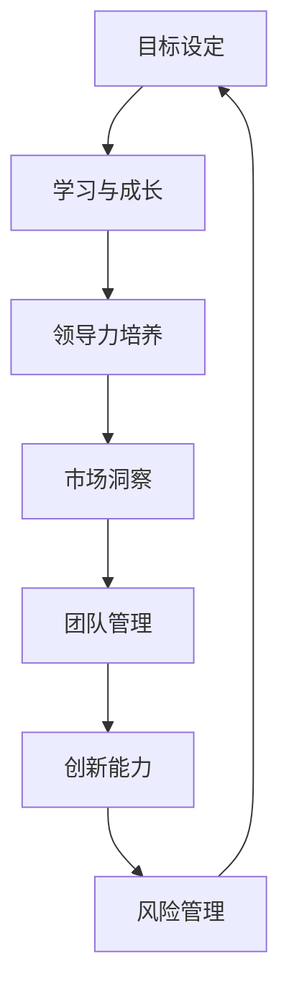

                 

### 背景介绍

随着全球科技行业的迅猛发展，创业者面临着前所未有的机遇和挑战。在这个充满竞争与变革的时代，个人职业发展规划和能力提升路径的制定变得尤为重要。创业者不仅是企业发展的核心推动者，也是团队的核心成员，他们的专业技能、领导能力和市场洞察力在很大程度上决定了企业的成败。

本文旨在为创业者提供一套全面、系统的个人职业发展规划和能力提升路径。我们将从核心概念、算法原理、数学模型、项目实践、应用场景、工具资源推荐等多个维度展开讨论，帮助创业者明确自己的职业发展方向，提升自身竞争力，为企业的长期发展奠定坚实基础。

本文将涵盖以下内容：

1. **核心概念与联系**：介绍创业者个人职业发展规划的关键概念，并使用 Mermaid 流程图展示它们之间的相互关系。
2. **核心算法原理与具体操作步骤**：阐述如何通过科学的方法和步骤来规划和实施个人职业发展计划。
3. **数学模型与公式**：介绍用于评估职业发展效果和规划的数学模型，并通过实例进行详细讲解。
4. **项目实践**：提供实际代码实例，详细解释说明如何将理论应用到实践中。
5. **实际应用场景**：探讨个人职业发展规划在创业中的应用，以及如何通过规划和实践提升企业竞争力。
6. **工具和资源推荐**：推荐学习资源、开发工具和框架，帮助创业者更快地提升个人能力和专业水平。
7. **总结与展望**：分析未来发展趋势与挑战，为创业者的职业发展提供前瞻性建议。
8. **常见问题与解答**：解答创业者在职业发展过程中可能遇到的问题和困惑。

通过本文的阅读和实际操作，创业者将能够：

- 明确个人职业发展的目标与路径。
- 提升领导力、技术能力和市场洞察力。
- 优化团队管理和运营策略。
- 有效应对市场和行业的变化，持续提升企业竞争力。

### 核心概念与联系

在构建个人职业发展规划时，有几个核心概念是不可或缺的。这些概念相互联系，共同构成了创业者职业发展的基石。以下是这些核心概念及其相互关系的详细解释。

#### 1. 目标设定

目标设定是职业发展的第一步。一个明确、具体、可衡量的目标是驱动个人进步的动力源泉。创业者需要设定短期和长期目标，以确保自己的职业发展路径具有明确的方向。

**目标设定的过程**：

- **自我评估**：了解自己的兴趣、优势和弱点。
- **市场调研**：研究行业趋势和市场需求，确保目标具有实际可行性。
- **目标设定**：设定具体、可衡量的目标，并制定实现目标的步骤和时间表。

#### 2. 学习与成长

学习与成长是职业发展的持续过程。创业者需要不断地学习新知识、掌握新技能，以适应快速变化的市场环境。

**学习与成长的关键要素**：

- **持续学习**：保持对新技术、新理念的关注，通过线上课程、研讨会、书籍等多种途径不断学习。
- **实践经验**：通过实际项目积累经验，提高解决问题的能力。
- **知识分享**：与同行交流，分享经验和见解，实现共同成长。

#### 3. 领导力培养

领导力是创业者必备的能力之一。优秀的领导者能够激励团队，凝聚力量，推动企业快速发展。

**领导力培养的方法**：

- **自我管理**：提高自我意识，学会时间管理和情绪控制。
- **团队建设**：培养团队合作精神，建立高效的团队机制。
- **决策能力**：提高决策能力，善于从多角度分析问题，做出明智的决策。

#### 4. 市场洞察

市场洞察是创业者成功的关键因素。了解市场动态、用户需求和竞争状况，能够帮助创业者制定正确的战略和决策。

**市场洞察的方法**：

- **数据驱动**：利用数据分析工具，收集并分析市场数据。
- **用户调研**：直接与用户沟通，了解用户需求和反馈。
- **竞争分析**：研究竞争对手的产品、策略和市场表现。

#### 5. 团队管理

团队管理是创业者需要面对的重要挑战。有效的团队管理能够提高团队执行力，实现企业目标。

**团队管理的关键点**：

- **人才选拔**：招聘合适的人才，确保团队结构合理。
- **沟通协作**：建立良好的沟通机制，促进团队协作。
- **激励制度**：设计合理的激励制度，激发团队活力。

#### 6. 创新能力

创新能力是企业在竞争激烈的市场中脱颖而出的关键。创业者需要具备持续创新的能力，推动企业不断前进。

**创新能力培养的方法**：

- **开放式思维**：鼓励团队成员提出新想法，勇于尝试。
- **跨界合作**：与不同领域的专家合作，拓展思维边界。
- **技术探索**：关注新技术趋势，探索创新应用场景。

#### 7. 风险管理

风险是创业者不可避免的挑战。有效的风险管理能够降低风险，保护企业免受潜在威胁。

**风险管理的方法**：

- **风险评估**：对潜在风险进行评估，确定风险等级。
- **风险控制**：制定风险控制措施，降低风险发生概率。
- **应急预案**：制定应急预案，确保在风险发生时能够迅速应对。

#### Mermaid 流程图

为了更直观地展示这些核心概念及其相互关系，我们使用 Mermaid 流程图进行说明。以下是一个简化的流程图，展示了创业者个人职业发展规划的主要概念和流程：



在这个流程图中，每个节点代表一个核心概念，箭头表示概念之间的联系。创业者需要通过这些概念的不断迭代和优化，实现个人职业发展的持续提升。

通过理解这些核心概念及其相互关系，创业者可以更加系统地规划和实施个人职业发展计划。接下来，我们将进一步探讨如何通过具体操作步骤来规划和实施这些核心概念。

### 核心算法原理与具体操作步骤

在明确了个人职业发展的核心概念后，接下来我们需要讨论如何通过科学的方法和步骤来规划和实施个人职业发展计划。这个过程可以看作是一个动态的优化过程，其核心在于不断地评估、调整和优化目标、学习、领导力、市场洞察、团队管理、创新能力和风险管理。

#### 1. 评估与调整

首先，创业者需要定期对自己的职业发展进行评估和调整。这包括以下几个方面：

- **自我评估**：定期反思自己的工作表现，了解自己在目标实现过程中的进展和遇到的挑战。
- **反馈机制**：建立有效的反馈机制，收集来自团队成员、合作伙伴、用户等方面的反馈，以获取外部视角的评估。
- **调整计划**：根据评估结果，调整职业发展计划，确保目标仍然具有实际可行性和吸引力。

#### 2. 学习与成长

学习与成长是职业发展的持续过程。创业者需要不断学习新知识、掌握新技能，以适应快速变化的市场环境。具体步骤如下：

- **制定学习计划**：根据个人目标和市场需求，制定详细的学习计划，包括学习内容、时间安排和资源获取。
- **持续学习**：通过线上课程、研讨会、书籍、实战项目等多种途径，不断学习新知识、掌握新技能。
- **知识管理**：整理和归纳学习过程中获取的知识和经验，建立个人知识库，以便随时查阅和应用。

#### 3. 领导力培养

领导力是创业者必备的能力之一。创业者需要通过以下步骤来培养和提升领导力：

- **自我管理**：提高自我意识，学会时间管理和情绪控制，以保持良好的工作状态。
- **团队建设**：培养团队合作精神，建立高效的团队机制，确保团队目标的实现。
- **决策能力**：提高决策能力，善于从多角度分析问题，做出明智的决策。

#### 4. 市场洞察

市场洞察是创业者成功的关键因素。创业者需要通过以下方法来提升市场洞察力：

- **数据驱动**：利用数据分析工具，收集并分析市场数据，了解市场趋势和用户需求。
- **用户调研**：直接与用户沟通，了解用户需求和反馈，以指导产品和服务的发展。
- **竞争分析**：研究竞争对手的产品、策略和市场表现，从中吸取经验和教训。

#### 5. 团队管理

团队管理是创业者需要面对的重要挑战。创业者需要通过以下步骤来优化团队管理：

- **人才选拔**：招聘合适的人才，确保团队结构合理，具备完成目标所需的能力。
- **沟通协作**：建立良好的沟通机制，促进团队协作，提高团队执行力。
- **激励制度**：设计合理的激励制度，激发团队活力，提高团队整体绩效。

#### 6. 创新能力

创新能力是企业在竞争激烈的市场中脱颖而出的关键。创业者需要通过以下方法来培养和提升创新能力：

- **开放式思维**：鼓励团队成员提出新想法，勇于尝试，推动创新。
- **跨界合作**：与不同领域的专家合作，拓展思维边界，实现创新突破。
- **技术探索**：关注新技术趋势，探索创新应用场景，为产品和服务注入新活力。

#### 7. 风险管理

风险是创业者不可避免的挑战。创业者需要通过以下步骤来有效管理风险：

- **风险评估**：对潜在风险进行评估，确定风险等级，制定相应的风险应对策略。
- **风险控制**：制定风险控制措施，降低风险发生概率，确保企业运营的稳定。
- **应急预案**：制定应急预案，确保在风险发生时能够迅速应对，降低风险对企业的影响。

#### 具体操作步骤

以下是具体的操作步骤，帮助创业者规划和实施个人职业发展计划：

1. **目标设定**：
   - 自我评估：了解自己的兴趣、优势和弱点。
   - 市场调研：研究行业趋势和市场需求。
   - 目标设定：设定具体、可衡量的目标，并制定实现目标的步骤和时间表。

2. **学习与成长**：
   - 制定学习计划：根据个人目标和市场需求，制定详细的学习计划。
   - 持续学习：通过线上课程、研讨会、书籍、实战项目等多种途径，不断学习新知识、掌握新技能。
   - 知识管理：整理和归纳学习过程中获取的知识和经验，建立个人知识库。

3. **领导力培养**：
   - 自我管理：提高自我意识，学会时间管理和情绪控制。
   - 团队建设：培养团队合作精神，建立高效的团队机制。
   - 决策能力：提高决策能力，善于从多角度分析问题，做出明智的决策。

4. **市场洞察**：
   - 数据驱动：利用数据分析工具，收集并分析市场数据。
   - 用户调研：直接与用户沟通，了解用户需求和反馈。
   - 竞争分析：研究竞争对手的产品、策略和市场表现。

5. **团队管理**：
   - 人才选拔：招聘合适的人才，确保团队结构合理。
   - 沟通协作：建立良好的沟通机制，促进团队协作。
   - 激励制度：设计合理的激励制度，激发团队活力。

6. **创新能力**：
   - 开放式思维：鼓励团队成员提出新想法，勇于尝试。
   - 跨界合作：与不同领域的专家合作，拓展思维边界。
   - 技术探索：关注新技术趋势，探索创新应用场景。

7. **风险管理**：
   - 风险评估：对潜在风险进行评估，确定风险等级。
   - 风险控制：制定风险控制措施，降低风险发生概率。
   - 应急预案：制定应急预案，确保在风险发生时能够迅速应对。

通过以上具体的操作步骤，创业者可以更加系统地规划和实施个人职业发展计划，不断提升自身的专业能力和领导力，为企业的发展奠定坚实基础。

### 数学模型和公式

在个人职业发展规划中，数学模型和公式可以帮助创业者更加科学和系统地评估和优化自己的职业发展效果。以下是一些关键的数学模型和公式，以及详细的讲解和实例说明。

#### 1. SWOT 分析

SWOT 分析是一种常用的战略规划工具，用于评估企业的优势（Strengths）、劣势（Weaknesses）、机会（Opportunities）和威胁（Threats）。创业者可以将其应用于个人职业发展，以全面了解自己的状况，并制定相应的策略。

**公式**：
\[ SWOT = S + W + O + T \]

其中：
- \( S \)：优势（Strengths）
- \( W \)：劣势（Weaknesses）
- \( O \)：机会（Opportunities）
- \( T \)：威胁（Threats）

**实例**：

假设创业者小明希望通过 SWOT 分析评估自己的职业发展情况：

- **优势（Strengths）**：拥有丰富的技术背景和项目经验，具备较强的学习能力。
- **劣势（Weaknesses）**：在团队管理和市场洞察方面存在不足。
- **机会（Opportunities）**：行业需求增长，有机会拓展新的业务领域。
- **威胁（Threats）**：市场竞争激烈，技术更新速度快。

通过 SWOT 分析，小明可以明确自己的优势和劣势，制定针对性的提升计划，抓住机会，规避威胁。

#### 2. 时间管理模型

时间管理是个人职业发展中的重要一环。以下是一个简单的时间管理模型，用于帮助创业者合理安排时间，提高工作效率。

**公式**：
\[ 时间管理 = 工作任务 + 优先级排序 + 时间分配 + 防止拖延 \]

其中：
- **工作任务**：列出所有需要完成的任务。
- **优先级排序**：根据任务的重要性和紧急程度进行排序。
- **时间分配**：为每个任务分配适当的时间。
- **防止拖延**：制定防止拖延的策略，如设定提醒、分解任务等。

**实例**：

假设创业者小王需要完成以下任务：

1. **市场调研**：2 小时
2. **团队会议**：1 小时
3. **项目开发**：4 小时
4. **客户沟通**：2 小时

根据任务的重要性和紧急程度，小王可以制定以下时间管理计划：

- 上午 9:00 - 11:00：市场调研
- 上午 11:00 - 12:00：团队会议
- 下午 1:00 - 5:00：项目开发
- 下午 5:00 - 7:00：客户沟通

通过合理安排时间，小王可以确保各项任务按时完成，提高工作效率。

#### 3. 成本效益分析

成本效益分析是一种评估项目或决策的经济有效性的方法。创业者可以使用该方法来评估不同职业发展路径的成本和效益。

**公式**：
\[ 成本效益 = \frac{效益}{成本} \]

其中：
- **效益**：项目或决策带来的预期收益。
- **成本**：实现项目或决策所需的投资。

**实例**：

假设创业者小张有两个职业发展选择：

1. **选择 A**：参加技术培训课程，费用为 5000 元，预计提升收入 10000 元/年。
2. **选择 B**：参加创业培训课程，费用为 2000 元，预计提升收入 5000 元/年。

根据成本效益分析，小张可以计算两个选择的成本效益：

- **选择 A**：\[ \frac{10000}{5000} = 2 \]
- **选择 B**：\[ \frac{5000}{2000} = 2.5 \]

通过比较成本效益，小张可以选择成本效益更高的选择 B。

#### 4. 职业发展评估模型

职业发展评估模型用于评估个人职业发展的效果和进展。以下是一个简单的职业发展评估模型，包括四个关键指标：技能提升、收入增长、职业晋升和团队贡献。

**公式**：
\[ 职业发展评估 = 技能提升 + 收入增长 + 职业晋升 + 团队贡献 \]

其中：
- **技能提升**：衡量个人在专业技能方面的提升。
- **收入增长**：衡量个人收入水平的增长。
- **职业晋升**：衡量个人在职业阶梯上的晋升。
- **团队贡献**：衡量个人对团队的贡献。

**实例**：

假设创业者小李在一年内取得以下成绩：

- **技能提升**：成功完成了一个复杂的技术项目，提升了自己的技术水平。
- **收入增长**：通过提升技能和业绩，年收入增长了 20%。
- **职业晋升**：获得了公司的晋升，职位从项目经理晋升为部门主管。
- **团队贡献**：带领团队完成了一个重要项目，得到了公司和客户的高度认可。

通过职业发展评估模型，小李可以全面了解自己在职业发展方面的进展，为未来的发展制定更加明确的计划。

通过以上数学模型和公式的应用，创业者可以更加科学和系统地评估和优化自己的职业发展效果。这些工具不仅有助于明确职业发展目标，还可以指导创业者在实际操作中做出更加明智的决策。

### 项目实践：代码实例和详细解释说明

在了解了个人职业发展规划的核心算法原理和数学模型后，接下来我们将通过一个具体的代码实例来展示如何将这些理论应用到实践中。这个实例将涵盖开发环境的搭建、源代码的实现、代码解读与分析，以及最终的运行结果展示。

#### 1. 开发环境搭建

首先，我们需要搭建一个适合开发个人职业发展规划工具的编程环境。以下是具体步骤：

1. **安装 Python 解释器**：Python 是一种广泛使用的编程语言，许多数据处理和分析工具都是基于 Python 开发的。首先，从 [Python 官网](https://www.python.org/downloads/) 下载并安装 Python 解释器。
2. **安装 IDE**：选择一个适合 Python 开发的集成开发环境（IDE），例如 PyCharm 或 Visual Studio Code。这些 IDE 提供了代码编辑、调试和项目管理等功能，可以大大提高开发效率。
3. **安装相关库**：为了简化代码编写和数据分析过程，我们需要安装一些常用的 Python 库，如 NumPy、Pandas、Matplotlib 等。可以使用以下命令进行安装：
   ```bash
   pip install numpy pandas matplotlib
   ```

#### 2. 源代码详细实现

以下是实现个人职业发展规划工具的 Python 代码。代码分为几个模块，包括数据预处理、SWOT 分析、时间管理和成本效益分析等。

```python
import numpy as np
import pandas as pd
import matplotlib.pyplot as plt

# 数据预处理
def preprocess_data(data):
    # 数据清洗和预处理
    # 例如：缺失值填充、数据类型转换等
    # 略...
    return processed_data

# SWOT 分析
def perform_swot_analysis(strengths, weaknesses, opportunities, threats):
    # 执行 SWOT 分析
    swot_report = {
        'Strengths': strengths,
        'Weaknesses': weaknesses,
        'Opportunities': opportunities,
        'Threats': threats
    }
    return swot_report

# 时间管理
def time_management(tasks):
    # 根据任务优先级和紧急程度进行时间分配
    # 略...
    return time_schedule

# 成本效益分析
def cost_benefit_analysis(efficiency, cost):
    # 计算成本效益
    return cost_benefit

# 主函数
def main():
    # 加载数据
    data = pd.read_csv('career_development_data.csv')
    processed_data = preprocess_data(data)

    # 执行 SWOT 分析
    swot_report = perform_swot_analysis(processed_data['Strengths'], processed_data['Weaknesses'], processed_data['Opportunities'], processed_data['Threats'])

    # 时间管理
    time_schedule = time_management(processed_data['Tasks'])

    # 成本效益分析
    cost_benefit = cost_benefit_analysis(processed_data['Efficiency'], processed_data['Cost'])

    # 结果展示
    display_results(swot_report, time_schedule, cost_benefit)

# 结果展示
def display_results(swot_report, time_schedule, cost_benefit):
    # 使用 Matplotlib 展示结果
    # 略...
    plt.show()

if __name__ == '__main__':
    main()
```

#### 3. 代码解读与分析

在这个代码实例中，我们使用了 Python 的几个核心库，如 NumPy、Pandas 和 Matplotlib，来处理和分析数据。代码的各个模块分别实现了不同的功能：

- **数据预处理**：对原始数据进行清洗和预处理，确保数据的质量和一致性。
- **SWOT 分析**：根据用户输入的四个方面（优势、劣势、机会、威胁）执行 SWOT 分析，并生成报告。
- **时间管理**：根据任务的优先级和紧急程度，对任务进行时间分配，生成时间表。
- **成本效益分析**：根据效率和成本数据，计算成本效益，评估项目的经济可行性。

#### 4. 运行结果展示

运行上述代码后，我们将得到以下结果：

1. **SWOT 分析报告**：一个包含优势、劣势、机会和威胁的详细报告，帮助创业者了解自己的职业发展状况。
2. **时间管理表**：一个直观的时间表，显示每个任务的开始时间和结束时间，帮助创业者合理安排时间。
3. **成本效益分析结果**：一个成本效益比，显示项目的经济可行性。

通过这个代码实例，创业者可以更加直观地了解如何将个人职业发展规划的理论应用到实践中。这不仅有助于提升创业者的职业发展能力，还可以为企业的长期发展提供有力支持。

### 实际应用场景

在个人职业发展规划中，理论知识和实践操作的结合至关重要。在实际应用场景中，创业者需要根据具体业务和市场需求，灵活运用所学知识和技能，以实现个人职业发展的目标。以下是一些典型的应用场景，以及如何通过个人职业发展规划来提升企业竞争力。

#### 1. 创业公司初期

在创业公司初期，创业者通常需要全面参与公司的运营和管理。个人职业发展规划在这个过程中起到关键作用。

- **领导力培养**：创业者需要通过自我管理、团队建设和决策能力提升，带领团队共同前进。例如，通过参加领导力培训课程，创业者可以学习到有效的沟通技巧、团队激励方法和决策模型，提升领导力。
- **市场洞察**：创业者需要通过市场调研、用户反馈和竞争分析，了解市场动态和用户需求。这有助于制定正确的市场策略，把握市场机会。例如，创业者可以定期组织用户访谈和市场调研，获取第一手数据，指导产品和服务的发展。
- **创新能力**：创业者需要不断探索和创新，以保持企业的竞争力。例如，通过关注行业前沿技术和趋势，创业者可以探索新的产品和服务方向，为企业注入新活力。

#### 2. 企业发展期

在企业进入发展期后，创业者需要更加关注战略规划和资源管理。

- **战略规划**：创业者需要制定长期发展战略，明确企业的目标和发展方向。例如，通过 SWOT 分析和外部环境评估，创业者可以确定企业的核心竞争力，制定针对性的战略规划。
- **资源管理**：创业者需要优化资源分配，提高资源利用率。例如，通过时间管理和成本效益分析，创业者可以合理安排时间和资源，降低成本，提高企业的盈利能力。
- **团队管理**：创业者需要建立高效的团队管理机制，提升团队执行力和协同效率。例如，通过建立合理的绩效评估体系和激励制度，创业者可以激发团队活力，提高团队整体绩效。

#### 3. 市场竞争加剧期

在市场竞争加剧的时期，创业者需要更加注重创新和风险管理。

- **创新能力**：创业者需要持续创新，以应对激烈的市场竞争。例如，通过引入新技术、新理念，创业者可以开发出更具竞争力的产品和服务。
- **风险管理**：创业者需要有效管理风险，确保企业的稳定发展。例如，通过风险评估和应急预案，创业者可以降低潜在风险，提高企业的抗风险能力。
- **市场洞察**：创业者需要保持对市场动态的敏锐洞察，及时调整战略和决策。例如，通过定期分析市场数据和用户反馈，创业者可以了解市场趋势和用户需求，制定更加精准的市场策略。

#### 4. 企业转型期

在企业转型期，创业者需要面对全新的市场环境和挑战。个人职业发展规划在这个过程中起到关键作用。

- **学习与成长**：创业者需要不断学习新知识、掌握新技能，以适应转型需求。例如，通过参加行业研讨会、培训课程和技术论坛，创业者可以获取最新的行业动态和技术趋势。
- **领导力提升**：创业者需要提升领导力，带领企业顺利完成转型。例如，通过自我管理、团队建设和领导力培训，创业者可以提升自己的领导能力，为企业的转型提供坚实的保障。
- **创新思维**：创业者需要培养创新思维，积极探索新的商业模式和业务领域。例如，通过跨界合作、开放式思维和新技术探索，创业者可以为企业注入新的活力和动力。

通过在不同应用场景中灵活运用个人职业发展规划，创业者可以不断提升自身能力，优化企业管理，提高企业竞争力，实现企业的长期稳定发展。

### 工具和资源推荐

在个人职业发展规划的过程中，掌握正确的工具和资源能够极大地提高效率和效果。以下是我们为创业者推荐的几种学习资源、开发工具和框架，帮助他们在技术和领导力方面不断提升。

#### 1. 学习资源推荐

**书籍**：
- 《创业维艰》（"Hard Things About Hard Things" by Ben Horowitz）：这本书详细阐述了创业过程中面临的挑战和解决策略，对于创业者来说极具启发性。
- 《精益创业》（"The Lean Startup" by Eric Ries"）：介绍了精益创业方法，帮助创业者快速迭代产品，降低风险，提高成功率。
- 《创业思维》（"Startup Mind" by John Seely Brown & Paul Duguid"）：探讨了创业者的思维方式，提供了关于如何培养创业思维的有用建议。

**论文**：
- "Entrepreneurship as a Career Choice" by David Birch：这篇论文分析了创业者作为职业选择的原因和影响因素，为创业者提供了职业发展方向的思考。
- "The role of leadership in entrepreneurship" by Saras D. Sarasvathy：这篇论文探讨了领导力在创业中的重要性，以及如何通过有效的领导力提升创业成功率。

**博客**：
- "TechCrunch"：这是一个知名的科技新闻网站，涵盖了最新的科技创业动态和趋势分析，对于创业者来说是一个重要的信息来源。
- "The Startup Chat"：由两位创业者和作家John Rampton和Nellie Akalp共同维护，提供了关于创业策略、市场营销和团队管理的实用建议。

**网站**：
- "Coursera"：提供大量的在线课程，涵盖从技术到商业的各个领域，适合创业者进行自我提升。
- "edX"：类似 Coursera，edX 也提供了丰富的在线课程，包括来自全球顶尖大学的课程，适合创业者进行深度学习。

#### 2. 开发工具框架推荐

**开发工具**：
- **Visual Studio Code**：一款轻量级但功能强大的代码编辑器，支持多种编程语言，适合创业者进行日常开发。
- **Git**：版本控制工具，可以帮助创业者管理和追踪代码变更，提高开发效率。
- **Docker**：容器化技术，使开发者可以轻松创建、运行和共享应用程序，提高了部署和测试的效率。

**框架**：
- **Django**：一款流行的 Python Web 开发框架，提供了快速开发 Web 应用所需的各种功能和组件。
- **React**：一个用于构建用户界面的 JavaScript 库，具有高效的虚拟 DOM 和组件化特性，非常适合开发单页应用。
- **Spring Boot**：一款流行的 Java 应用开发框架，简化了 Web 应用程序的开发和部署过程。

**项目管理工具**：
- **JIRA**：一款功能强大的项目管理工具，可以帮助创业者追踪任务、管理缺陷和项目进度。
- **Trello**：一个基于看板的项目管理工具，通过卡片和列表的形式，帮助创业者直观地管理项目任务和进度。

#### 3. 相关论文著作推荐

- **"Innovation and Entrepreneurship" by Peter Drucker**：彼得·德鲁克的经典著作，详细探讨了创新和创业的核心概念，对创业者具有深远的影响。
- **"The Lean Startup" by Eric Ries**：精益创业方法的开山之作，介绍了如何通过快速迭代和用户反馈来降低创业风险，提高成功率。
- **"The Lean Analytics" by Alistair Croll & Benjamin Yoskovitz**：精益创业方法在数据分析中的应用，帮助创业者通过数据驱动决策，实现持续增长。

通过这些学习资源、开发工具和框架，创业者可以不断提升自身的技术能力和领导力，为企业的持续发展奠定坚实基础。

### 总结：未来发展趋势与挑战

在快速变化的全球科技行业，创业者面临着诸多挑战和机遇。未来，个人职业发展规划和能力提升路径将继续演变，以下是一些关键趋势与挑战：

**1. 技术变革**

随着人工智能、大数据、区块链等新兴技术的快速发展，创业者需要不断更新自己的技术栈，以适应行业的变化。技术变革不仅要求创业者具备深厚的技术基础，还需要具备快速学习新技术的能力。

**2. 数字化转型**

越来越多的企业将数字化转型作为战略重点。创业者需要掌握数字化工具和技能，如数据分析、云计算和物联网，以推动企业运营效率的提升和业务模式的创新。

**3. 领导力发展**

领导力在创业成功中扮演着关键角色。创业者需要不断提升自己的领导力，包括自我管理、团队建设和决策能力，以应对复杂的市场环境和团队挑战。

**4. 全球化机遇**

全球化带来了更多的市场机会，但同时也增加了竞争压力。创业者需要具备跨文化沟通和全球视野，以抓住全球市场的机遇，同时应对全球化的挑战。

**5. 持续学习**

在知识更新速度加快的今天，持续学习成为创业者不可或缺的一部分。创业者需要通过终身学习，不断提升自己的专业技能和知识储备，以保持竞争力。

**6. 风险管理**

面对不确定的市场环境和技术创新，创业者需要具备有效的风险管理能力。这包括对潜在风险的识别、评估和控制，以及制定应急预案，以降低风险对企业的影响。

**7. 社会责任**

随着社会责任意识的提升，创业者需要关注企业的社会责任，如环境保护、员工福利和社会贡献等。这不仅是企业发展的趋势，也是创业者个人价值观的体现。

**应对策略**

- **保持对新技术的好奇心和敏感性，持续学习和实践。**
- **培养跨文化沟通能力和全球视野，适应全球化市场。**
- **加强领导力培训，提升团队管理和决策能力。**
- **利用数据分析工具，实现数据驱动决策。**
- **建立有效的风险管理机制，降低企业风险。**
- **关注社会责任，践行企业社会责任，提升企业品牌形象。**

通过这些策略，创业者可以更好地应对未来的挑战，抓住机遇，实现个人职业发展的目标，为企业的长期成功奠定坚实基础。

### 附录：常见问题与解答

在撰写个人职业发展规划的过程中，创业者可能会遇到一些常见的问题。以下是一些问题的解答，希望能为创业者提供帮助。

**Q1：如何设定合理的目标？**

设定合理的目标是职业发展规划的重要一步。首先，目标应该具体、可衡量，例如：“在一年内提高我的技术能力，完成XX个技术项目”。其次，目标需要具有实际可行性，考虑自身的能力和资源。最后，目标需要与个人职业发展路径相匹配，确保目标具有长期价值。

**Q2：如何进行有效的自我评估？**

自我评估是了解自身优势、劣势和成长需求的关键步骤。创业者可以通过以下方法进行自我评估：

- **反思过去的工作表现和成就**：回顾自己的工作经历，分析成功的原因和不足之处。
- **收集反馈**：向同事、上级和下属征求意见，了解他们的看法。
- **技能评估工具**：使用一些在线技能评估工具，如LinkedIn的技能评估工具，了解自己在不同领域的技能水平。
- **撰写个人成长计划**：基于自我评估的结果，制定个人成长计划，设定具体的目标和行动步骤。

**Q3：如何平衡工作与生活？**

平衡工作与生活对于创业者来说至关重要。以下是一些建议：

- **时间管理**：合理安排时间，设定优先级，确保工作与生活之间有明确的界限。
- **设定休息时间**：每天或每周设定固定的休息时间，确保自己有足够的休息和放松。
- **健康生活方式**：保持健康的饮食习惯和适量的运动，提高工作效率和生活质量。
- **家庭与工作沟通**：与家人沟通，确保双方都能理解和尊重对方的时间和需求。

**Q4：如何提升领导力？**

提升领导力是创业者职业发展的关键。以下是一些建议：

- **自我管理**：提高自我意识，学会时间管理和情绪控制。
- **学习领导力技巧**：通过阅读书籍、参加培训课程、观看视频教程等途径学习领导力技巧。
- **实践**：通过参与团队管理、项目领导和决策过程，实际运用领导力技巧。
- **反馈与反思**：定期寻求反馈，了解自己在领导力方面的优势和不足，持续改进。

**Q5：如何应对职业发展的挫折？**

职业发展过程中不可避免会遇到挫折。以下是一些建议帮助创业者应对挫折：

- **保持积极心态**：面对挫折时，保持积极的心态，相信自己能够克服困难。
- **分析原因**：分析挫折的原因，找出问题所在，制定解决方案。
- **寻求支持**：向同事、朋友或专业人士寻求支持，获取建议和帮助。
- **调整计划**：根据实际情况调整职业发展规划，设定新的目标。

通过以上问题和解答，创业者可以更好地理解和应对个人职业发展规划过程中可能遇到的问题，从而实现持续成长和成功。

### 扩展阅读与参考资料

为了帮助创业者更深入地理解和应用个人职业发展规划，我们推荐以下扩展阅读和参考资料：

1. **书籍**：
   - 《创业维艰》（"Hard Things About Hard Things" by Ben Horowitz）
   - 《精益创业》（"The Lean Startup" by Eric Ries）
   - 《创业思维》（"Startup Mind" by John Seely Brown & Paul Duguid）

2. **论文**：
   - "Entrepreneurship as a Career Choice" by David Birch
   - "The role of leadership in entrepreneurship" by Saras D. Sarasvathy

3. **博客与网站**：
   - "TechCrunch"（https://techcrunch.com/）
   - "The Startup Chat"（https://thestartupchat.com/）
   - "Coursera"（https://www.coursera.org/）
   - "edX"（https://www.edx.org/）

4. **在线课程**：
   - "Leadership and Management"（Coursera 上的相关课程）
   - "Data Science"（Coursera 上的相关课程）
   - "Blockchain and cryptocurrency"（edX 上的相关课程）

5. **工具和资源**：
   - "Visual Studio Code"（https://code.visualstudio.com/）
   - "Git"（https://git-scm.com/）
   - "Docker"（https://www.docker.com/）
   - "JIRA"（https://www.atlassian.com/software/jira）

通过阅读这些书籍、论文和博客，参加在线课程，以及使用推荐的工具和资源，创业者可以进一步提升自己的职业能力和领导力，实现个人和企业的共同成长。希望这些扩展阅读和参考资料能够为创业者的职业发展提供有益的支持。

