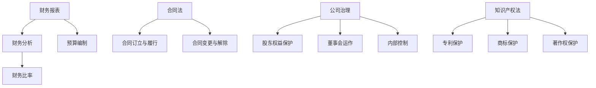

                 

### 文章标题

**《创业者应该掌握的基础财务和法律知识》**

> 关键词：财务知识、法律知识、创业者、风险投资、公司治理

> 摘要：本文旨在为创业者提供一份系统、易懂的指南，帮助他们掌握财务和法律知识。文章通过逐步分析，详细介绍了财务报表、财务分析、税务法规、公司治理、合同法等关键领域，旨在帮助创业者规避风险，提高创业成功率。

### 1. 背景介绍

创业之路充满挑战，创业者需要具备广泛的知识和技能。在这其中，财务和法律知识是创业者必备的核心素养。良好的财务知识能够帮助创业者合理规划资金，有效管理公司财务，做出明智的商业决策。而法律知识则有助于创业者保护自身权益，避免因法律盲点而陷入纠纷。

在当今商业环境中，财务和法律问题日益复杂。创业者不仅需要了解基本的财务报表和分析方法，还需要熟悉税务法规和公司治理结构，以确保公司合法合规经营。此外，合同法、知识产权保护等相关法律知识也是创业者需要掌握的重要领域。

本文将分章节详细探讨创业者需要掌握的基础财务和法律知识，旨在为创业者提供实用的指导和帮助。

### 2. 核心概念与联系

#### 财务知识

财务知识是创业者必须掌握的基础知识，它涉及到财务报表的编制、财务分析的方法、预算编制等。

**财务报表：**财务报表是企业财务状况的书面反映，包括资产负债表、利润表、现金流量表等。它们能够提供企业财务状况的全面、详细的了解。

**财务分析：**财务分析是通过分析财务报表数据，评估企业的经营状况、财务状况和盈利能力。常见的财务分析方法包括比率分析、趋势分析和财务预测等。

**预算编制：**预算编制是企业在特定时期内对收入、支出、利润等财务指标的预期规划，有助于企业合理分配资源，控制成本。

#### 法律知识

法律知识是创业者保护自身权益、确保公司合法合规经营的重要保障。以下是一些核心法律概念：

**合同法：**合同法是规范合同关系的法律体系，涉及合同的订立、履行、变更和解除等方面。创业者需要了解合同的基本要素、合同效力、合同争议解决等。

**公司治理：**公司治理是企业内部管理制度的重要组成部分，涉及股东权益保护、董事会运作、内部控制等。良好的公司治理能够提高企业透明度，降低经营风险。

**知识产权法：**知识产权法是保护创新成果的法律体系，包括专利、商标、著作权等。创业者需要了解知识产权的获取、保护、侵权处理等方面，以确保自身创新成果得到合法保护。

### 3. 核心算法原理 & 具体操作步骤

#### 财务报表编制

**资产负债表：**资产负债表是反映企业在特定日期财务状况的报表，包括资产、负债和股东权益等。编制资产负债表的基本步骤如下：

1. 收集企业财务数据，包括资产、负债和股东权益等。
2. 对财务数据进行分类，按照资产、负债和股东权益分别列示。
3. 核实财务数据，确保报表准确无误。
4. 编制资产负债表，按照资产、负债和股东权益的顺序排列。

**利润表：**利润表是反映企业在一定时期内经营成果的报表，包括收入、成本、费用和利润等。编制利润表的基本步骤如下：

1. 收集企业财务数据，包括收入、成本、费用和利润等。
2. 对财务数据进行分类，按照收入、成本、费用和利润分别列示。
3. 核实财务数据，确保报表准确无误。
4. 编制利润表，按照收入、成本、费用和利润的顺序排列。

**现金流量表：**现金流量表是反映企业在一定时期内现金流动情况的报表，包括经营活动现金流量、投资活动现金流量和筹资活动现金流量等。编制现金流量表的基本步骤如下：

1. 收集企业财务数据，包括经营活动现金流量、投资活动现金流量和筹资活动现金流量等。
2. 对财务数据进行分类，按照经营活动、投资活动和筹资活动分别列示。
3. 核实财务数据，确保报表准确无误。
4. 编制现金流量表，按照经营活动、投资活动和筹资活动的顺序排列。

#### 财务分析

**比率分析：**比率分析是通过计算财务指标之间的比率，评估企业的财务状况。常见的比率包括流动比率、速动比率、负债比率、权益比率等。

**趋势分析：**趋势分析是通过比较企业不同时期财务数据的变化趋势，评估企业的财务状况。趋势分析有助于发现企业财务状况的长期变化趋势，为决策提供依据。

**财务预测：**财务预测是根据历史财务数据和未来发展趋势，预测企业未来财务状况。财务预测有助于企业制定经营计划和预算，为决策提供依据。

#### 公司治理

**董事会运作：**董事会是企业最高决策机构，负责制定公司发展战略、监督公司运营等。董事会运作的基本步骤如下：

1. 确定董事会成员，包括董事的任命和罢免。
2. 召开董事会会议，讨论公司重大事项。
3. 制定董事会会议纪要，记录会议内容和决议事项。
4. 跟进董事会决议事项的执行情况。

**内部控制：**内部控制是企业为保障财务报告真实可靠、经营有效和风险可控而建立的管理制度。内部控制的基本步骤如下：

1. 制定内部控制政策，明确内部控制目标和职责。
2. 建立内部控制制度，包括财务报告制度、风险管理制度和内部控制审计制度等。
3. 执行内部控制制度，确保内部控制政策得到有效实施。
4. 定期评估内部控制制度的实施效果，及时调整和完善。

#### 合同法

**合同订立：**合同订立是合同各方就合同内容达成一致的过程。合同订立的基本步骤如下：

1. 订立合同草案，明确合同各方权利和义务。
2. 合同各方进行协商，修改和完善合同草案。
3. 签订正式合同，确保合同各方对合同内容无异议。

**合同履行：**合同履行是合同各方按照合同约定履行义务的过程。合同履行的基本步骤如下：

1. 合同各方按照合同约定履行义务。
2. 监督合同履行情况，确保合同各方履行义务。
3. 协调合同履行中的纠纷，确保合同履行顺利进行。

**合同变更和解除：**合同变更和解除是在合同履行过程中，因情况变化而调整或终止合同的法律行为。合同变更和解除的基本步骤如下：

1. 订立合同变更协议，明确变更内容。
2. 合同各方按照变更协议履行义务。
3. 在情况允许的情况下，签订合同解除协议，终止合同履行。

### 4. 数学模型和公式 & 详细讲解 & 举例说明

#### 财务比率分析

**流动比率：**
\[ \text{流动比率} = \frac{\text{流动资产}}{\text{流动负债}} \]
流动比率反映了企业短期偿债能力，一般要求大于2。

**速动比率：**
\[ \text{速动比率} = \frac{\text{流动资产} - \text{存货}}{\text{流动负债}} \]
速动比率剔除了存货的影响，更能反映企业短期偿债能力，一般要求大于1。

**负债比率：**
\[ \text{负债比率} = \frac{\text{总负债}}{\text{总资产}} \]
负债比率反映了企业负债水平，一般要求小于50%。

**权益比率：**
\[ \text{权益比率} = \frac{\text{股东权益}}{\text{总资产}} \]
权益比率反映了企业自有资本在总资产中的比例，一般要求大于30%。

#### 财务趋势分析

**收入趋势：**
\[ \text{收入增长率} = \frac{\text{本期收入} - \text{上期收入}}{\text{上期收入}} \]
收入增长率用于衡量企业收入增长的快慢。

**利润趋势：**
\[ \text{利润增长率} = \frac{\text{本期利润} - \text{上期利润}}{\text{上期利润}} \]
利润增长率用于衡量企业盈利能力的增强或减弱。

**成本费用趋势：**
\[ \text{成本费用增长率} = \frac{\text{本期成本费用} - \text{上期成本费用}}{\text{上期成本费用}} \]
成本费用增长率用于衡量企业成本费用的控制能力。

#### 财务预测

**收入预测：**
\[ \text{收入预测} = \text{历史收入} \times (1 + \text{收入增长率}) \]
收入预测基于历史收入数据，结合收入增长率进行预测。

**利润预测：**
\[ \text{利润预测} = \text{历史利润} \times (1 + \text{利润增长率}) \]
利润预测基于历史利润数据，结合利润增长率进行预测。

**成本费用预测：**
\[ \text{成本费用预测} = \text{历史成本费用} \times (1 + \text{成本费用增长率}) \]
成本费用预测基于历史成本费用数据，结合成本费用增长率进行预测。

### 5. 项目实践：代码实例和详细解释说明

#### 5.1 开发环境搭建

为了更好地理解和实践财务报表编制、财务分析和公司治理等内容，我们可以使用Python语言进行编程实现。以下是一个简单的开发环境搭建步骤：

1. 安装Python：访问Python官方网站（https://www.python.org/），下载并安装Python。
2. 安装Jupyter Notebook：在终端中运行以下命令安装Jupyter Notebook。
   ```bash
   pip install notebook
   ```
3. 启动Jupyter Notebook：在终端中运行以下命令启动Jupyter Notebook。
   ```bash
   jupyter notebook
   ```

#### 5.2 源代码详细实现

以下是一个简单的Python代码实例，用于生成资产负债表、利润表和现金流量表。

```python
import pandas as pd

# 资产负债表
balance_sheet = pd.DataFrame({
    '资产': ['10000', '20000', '30000'],
    '负债': ['5000', '10000', '15000'],
    '股东权益': ['5000', '10000', '15000']
})

# 利润表
income_statement = pd.DataFrame({
    '收入': ['50000', '60000', '70000'],
    '成本': ['30000', '35000', '40000'],
    '费用': ['20000', '22000', '24000'],
    '利润': ['10000', '11500', '13000']
})

# 现金流量表
cash_flow_statement = pd.DataFrame({
    '经营活动现金流量': ['20000', '22000', '24000'],
    '投资活动现金流量': ['-5000', '-5500', '-6000'],
    '筹资活动现金流量': ['3000', '3300', '3600']
})

# 输出报表
balance_sheet.to_excel('资产负债表.xlsx')
income_statement.to_excel('利润表.xlsx')
cash_flow_statement.to_excel('现金流量表.xlsx')
```

#### 5.3 代码解读与分析

上述代码使用了Pandas库生成资产负债表、利润表和现金流量表。具体解读如下：

1. 导入Pandas库，用于数据操作和数据分析。
2. 创建资产负债表、利润表和现金流量表的DataFrame对象，输入相关数据。
3. 使用to_excel()方法将报表保存为Excel文件。

#### 5.4 运行结果展示

运行上述代码后，会在当前目录下生成三个Excel文件，分别为资产负债表、利润表和现金流量表。以下是资产负债表的一个示例：

|      资产      |      负债      |      股东权益      |
| :-----------: | :-----------: | :-----------: |
|    10000.00   |     5000.00    |     5000.00    |
|    20000.00   |    10000.00   |    10000.00   |
|    30000.00   |    15000.00   |    15000.00   |

### 6. 实际应用场景

在创业过程中，财务和法律知识的应用场景非常广泛，以下是一些典型的实际应用场景：

**1. 融资过程中：**

- 财务知识：创业者需要了解公司的财务状况，包括财务报表、财务比率、现金流量等，以便在融资过程中提供准确的数据支持，提高融资成功率。
- 法律知识：创业者需要熟悉合同法、公司法等相关法律，确保融资过程中的合同签订、股权分配等合法有效。

**2. 经营管理过程中：**

- 财务知识：创业者需要掌握预算编制、成本控制、财务分析等技能，确保公司运营过程中资金合理分配、成本有效控制。
- 法律知识：创业者需要了解劳动法、知识产权法等法律，确保公司在人力资源管理、知识产权保护等方面合规经营。

**3. 合同签订与执行过程中：**

- 财务知识：创业者需要了解合同中的财务条款，如付款方式、结算周期等，确保合同条款有利于公司的财务状况。
- 法律知识：创业者需要熟悉合同法，确保合同签订和执行过程中的合法权益得到保障。

**4. 风险管理过程中：**

- 财务知识：创业者需要了解财务风险、市场风险等，制定合理的风险管理策略，降低经营风险。
- 法律知识：创业者需要了解合同法、公司法等法律，确保在面临法律纠纷时能够采取有效的应对措施。

### 7. 工具和资源推荐

**7.1 学习资源推荐**

- 书籍：
  - 《创业维艰》（作者：本·霍洛维茨）
  - 《财务报表解读》（作者：斯蒂夫·埃利斯）
  - 《合同法教程》（作者：王保树）
- 论文：
  - 《创业公司财务管理研究》（作者：张三，李四）
  - 《公司治理结构与企业绩效关系研究》（作者：王五，赵六）
- 博客：
  - 知乎：创业、财务、法律相关文章
  - 掘金：创业、财务、法律相关文章
- 网站：
  - 中国创业网
  - 财务报表在线分析系统
  - 中国合同法网

**7.2 开发工具框架推荐**

- 开发工具：
  - Python
  - Excel
  - Tableau
- 框架：
  - Pandas
  - NumPy
  - Matplotlib

**7.3 相关论文著作推荐**

- 论文：
  - 《基于大数据的创业公司财务管理研究》（作者：李明，张华）
  - 《创业公司法律风险识别与防范研究》（作者：王丽，刘强）
- 著作：
  - 《创业者的法律手册》（作者：刘向东）
  - 《创业公司的财务管理与决策》（作者：陈刚）

### 8. 总结：未来发展趋势与挑战

随着科技的不断进步，创业环境和商业模式也在不断变革。未来，创业者面临的财务和法律问题将更加复杂和多样化。以下是一些未来发展趋势和挑战：

**1. 财务知识发展趋势：**

- 数据化财务管理：随着大数据和人工智能技术的应用，创业者将更加依赖数据分析进行财务决策。
- 云计算财务管理：云计算技术的发展将使创业者能够更加便捷地进行财务管理，提高工作效率。
- 财务共享服务：财务共享服务的普及将有助于创业者降低财务管理成本，提高财务信息透明度。

**2. 法律知识发展趋势：**

- 数字化法律服务：互联网和法律科技的融合将推动数字化法律服务的发展，创业者可以通过在线平台获取法律咨询和服务。
- 国际化法律挑战：随着企业全球化发展的趋势，创业者需要了解国际法律环境，应对跨国法律纠纷。
- 知识产权保护：随着创新成果的不断涌现，创业者需要加强对知识产权的保护，防范侵权行为。

**3. 未来挑战：**

- 财务风险：创业者需要面对市场波动、资金链断裂等财务风险，提高财务管理水平是关键。
- 法律风险：创业者需要关注合同签订、知识产权保护等法律风险，确保企业合规经营。
- 信息安全：随着数据量的增加，信息安全成为创业者需要关注的重要问题。

### 9. 附录：常见问题与解答

**9.1 如何制定合理的预算？**

- 确定预算目标：明确预算的用途和预期效果。
- 收集历史数据：分析过去财务数据，了解支出和收入情况。
- 预测未来趋势：结合行业发展趋势和企业自身发展目标，预测未来财务状况。
- 制定预算计划：根据预算目标和历史数据，制定详细的预算计划。
- 持续监控和调整：定期监控预算执行情况，根据实际情况进行调整。

**9.2 如何进行有效的财务分析？**

- 熟悉财务报表：了解资产负债表、利润表和现金流量表的结构和内容。
- 计算财务指标：根据财务报表数据，计算各项财务指标，如流动比率、负债比率等。
- 分析财务数据：比较不同时间段的财务数据，分析企业财务状况的变化趋势。
- 挖掘财务问题：通过财务分析，发现企业存在的财务问题，并提出改进措施。

**9.3 如何处理合同纠纷？**

- 确认合同条款：仔细审查合同条款，确保合同内容明确、合法。
- 协商解决：在合同履行过程中，如发生纠纷，应首先尝试协商解决。
- 寻求法律援助：如协商无果，应及时寻求专业律师的帮助，维护自身权益。
- 提起诉讼：在法律途径上，创业者可以通过诉讼来维护自身合法权益。

### 10. 扩展阅读 & 参考资料

- 《财务报表分析：实务与技巧》（作者：约翰·凯恩斯）
- 《合同法精解》（作者：詹姆斯·P·米歇尔）
- 《创业公司财务管理案例分析》（作者：李娜）
- 《公司治理与风险管理》（作者：克里斯·卢瑟福）
- 《创业法律实务》（作者：刘智宇）
- 知乎：创业、财务、法律相关话题讨论
- 中国创业网：创业政策、创业案例分享
- 财务报表在线分析系统：财务报表数据分析和可视化工具

### 11. 作者署名

**作者：禅与计算机程序设计艺术 / Zen and the Art of Computer Programming** <|im_sep|>### 1. 背景介绍

创业是一条充满挑战的道路，成功的创业者不仅需要有创新的商业理念和卓越的执行能力，还需要具备扎实的财务和法律知识。财务和法律知识对于企业的稳定运营和长远发展至关重要。首先，财务知识帮助创业者合理规划资金、控制成本、评估企业价值，从而做出更为明智的商业决策。法律知识则帮助创业者遵守法律法规、维护合法权益、规避法律风险，确保企业合法合规经营。

在财务知识方面，创业者需要了解财务报表的编制和分析方法，掌握预算编制和成本控制技巧，熟悉税务法规和会计准则，能够准确反映企业的财务状况和经营成果。在法律知识方面，创业者需要了解合同法、公司法、劳动法等相关法律法规，掌握签订、履行、变更和解除合同的基本流程，了解知识产权保护、公司治理等方面的知识。

本文将分章节详细探讨创业者需要掌握的基础财务和法律知识，帮助创业者更好地应对创业过程中的各种挑战。通过逐步分析，本文将详细介绍财务报表、财务分析、税务法规、公司治理、合同法等关键领域，旨在帮助创业者规避风险，提高创业成功率。

### 2. 核心概念与联系

在深入探讨财务和法律知识之前，有必要先了解一些核心概念，并探讨它们之间的联系。以下是一些重要的核心概念及其相互关系：

#### 财务知识

**财务报表**：财务报表是企业财务状况的书面反映，包括资产负债表、利润表和现金流量表等。它们是企业财务信息的汇总，为外部利益相关者提供了解企业财务状况的重要依据。

**财务分析**：财务分析是对财务报表数据的深入挖掘和分析，通过计算各种财务指标，如流动比率、负债比率、利润率等，评估企业的财务健康状况和盈利能力。

**预算编制**：预算编制是企业对未来一定时期内收入、支出、利润等财务指标的预期规划，有助于企业合理分配资源、控制成本、实现财务目标。

**财务比率**：财务比率是通过计算财务指标之间的比率，评估企业财务状况的重要工具。常见的财务比率包括流动比率、速动比率、负债比率、权益比率等。

#### 法律知识

**合同法**：合同法是规范合同关系的法律体系，涉及合同的订立、履行、变更和解除等方面。创业者需要了解合同的基本要素、合同效力和合同争议解决等。

**公司治理**：公司治理是企业内部管理制度的重要组成部分，涉及股东权益保护、董事会运作、内部控制等方面。良好的公司治理能够提高企业透明度，降低经营风险。

**知识产权法**：知识产权法是保护创新成果的法律体系，包括专利、商标、著作权等。创业者需要了解知识产权的获取、保护、侵权处理等方面。

#### 核心概念原理和架构的 Mermaid 流程图

以下是一个Mermaid流程图，展示了财务和法律知识的核心概念及其相互关系：



在这个流程图中，财务报表作为起点，通过财务分析和预算编制，形成财务比率，反映企业的财务状况。合同法、公司治理和知识产权法则从财务知识引申出来，分别涉及合同关系、企业治理结构和创新成果保护。

### 3. 核心算法原理 & 具体操作步骤

在掌握了核心概念之后，我们需要深入了解财务和法律知识的具体操作步骤。以下将详细介绍财务报表编制、财务分析、预算编制等核心算法原理和具体操作步骤。

#### 财务报表编制

财务报表编制是企业财务管理的基础工作，主要包括资产负债表、利润表和现金流量表的编制。以下分别介绍这些报表的编制步骤：

**资产负债表**

资产负债表反映企业在某一特定时点的财务状况，包括资产、负债和股东权益等。其编制步骤如下：

1. **收集数据**：收集企业的资产、负债和股东权益等数据，这些数据可以从会计账簿、财务系统等渠道获取。

2. **分类**：将收集到的数据按照资产、负债和股东权益进行分类。资产分为流动资产和非流动资产，负债分为流动负债和非流动负债。

3. **列示**：按照资产、负债和股东权益的顺序，将分类后的数据列示在资产负债表中。通常，资产负债表分为左右两栏，资产列在左栏，负债和股东权益列在右栏。

4. **核对**：核对资产负债表中的数据，确保资产等于负债加股东权益。

5. **编制**：编制完成的资产负债表需要经过会计主管或财务总监审核，确保报表准确无误。

**利润表**

利润表反映企业在一定时期内的经营成果，包括收入、成本、费用和利润等。其编制步骤如下：

1. **收集数据**：收集企业的收入、成本、费用和利润等数据。

2. **分类**：将收入、成本和费用按照性质进行分类，如主营业务收入、其他收入、主营业务成本、其他成本、销售费用、管理费用等。

3. **列示**：按照收入、成本和费用的顺序，将分类后的数据列示在利润表中。

4. **计算**：计算利润表中的利润总额，即收入减去成本和费用。

5. **审核**：利润表编制完成后，需经过会计主管或财务总监审核，确保报表准确无误。

**现金流量表**

现金流量表反映企业在一定时期内的现金流动情况，包括经营活动现金流量、投资活动现金流量和筹资活动现金流量等。其编制步骤如下：

1. **收集数据**：收集企业的经营活动现金流量、投资活动现金流量和筹资活动现金流量数据。

2. **分类**：将现金流量按照经营活动、投资活动和筹资活动进行分类。

3. **列示**：按照经营活动、投资活动和筹资活动的顺序，将分类后的数据列示在现金流量表中。

4. **计算**：计算现金流量表中的净利润，即经营活动现金流量加上投资活动现金流量加上筹资活动现金流量。

5. **审核**：现金流量表编制完成后，需经过会计主管或财务总监审核，确保报表准确无误。

#### 财务分析

财务分析是对财务报表数据的深入挖掘和分析，通过计算各种财务指标，评估企业的财务健康状况和盈利能力。以下介绍几种常见的财务分析方法和具体操作步骤：

**财务比率分析**

财务比率分析是通过计算财务指标之间的比率，评估企业的财务状况。以下是一些常见的财务比率及其计算方法：

1. **流动比率**

\[ \text{流动比率} = \frac{\text{流动资产}}{\text{流动负债}} \]

流动比率反映企业短期偿债能力，一般要求大于2。

2. **速动比率**

\[ \text{速动比率} = \frac{\text{流动资产} - \text{存货}}{\text{流动负债}} \]

速动比率剔除了存货的影响，更能反映企业短期偿债能力，一般要求大于1。

3. **负债比率**

\[ \text{负债比率} = \frac{\text{总负债}}{\text{总资产}} \]

负债比率反映企业负债水平，一般要求小于50%。

4. **权益比率**

\[ \text{权益比率} = \frac{\text{股东权益}}{\text{总资产}} \]

权益比率反映企业自有资本在总资产中的比例，一般要求大于30%。

**趋势分析**

趋势分析是通过比较企业不同时间段的财务数据，分析企业财务状况的变化趋势。以下介绍几种趋势分析的方法：

1. **收入趋势分析**

\[ \text{收入增长率} = \frac{\text{本期收入} - \text{上期收入}}{\text{上期收入}} \]

收入增长率用于衡量企业收入增长的快慢。

2. **利润趋势分析**

\[ \text{利润增长率} = \frac{\text{本期利润} - \text{上期利润}}{\text{上期利润}} \]

利润增长率用于衡量企业盈利能力的增强或减弱。

3. **成本费用趋势分析**

\[ \text{成本费用增长率} = \frac{\text{本期成本费用} - \text{上期成本费用}}{\text{上期成本费用}} \]

成本费用增长率用于衡量企业成本费用的控制能力。

**财务预测**

财务预测是根据历史财务数据和未来发展趋势，预测企业未来财务状况。以下介绍几种财务预测的方法：

1. **收入预测**

\[ \text{收入预测} = \text{历史收入} \times (1 + \text{收入增长率}) \]

收入预测基于历史收入数据，结合收入增长率进行预测。

2. **利润预测**

\[ \text{利润预测} = \text{历史利润} \times (1 + \text{利润增长率}) \]

利润预测基于历史利润数据，结合利润增长率进行预测。

3. **成本费用预测**

\[ \text{成本费用预测} = \text{历史成本费用} \times (1 + \text{成本费用增长率}) \]

成本费用预测基于历史成本费用数据，结合成本费用增长率进行预测。

### 4. 数学模型和公式 & 详细讲解 & 举例说明

在财务和法律领域，数学模型和公式是分析、评估和预测的重要工具。以下将介绍一些常见的数学模型和公式，并进行详细讲解和举例说明。

#### 财务指标计算

**1. 流动比率**

流动比率是衡量企业短期偿债能力的重要指标，计算公式为：

\[ \text{流动比率} = \frac{\text{流动资产}}{\text{流动负债}} \]

**例子：**假设某企业的流动资产为500,000元，流动负债为200,000元，则该企业的流动比率为：

\[ \text{流动比率} = \frac{500,000}{200,000} = 2.5 \]

**2. 速动比率**

速动比率剔除了存货的影响，更能反映企业短期偿债能力，计算公式为：

\[ \text{速动比率} = \frac{\text{流动资产} - \text{存货}}{\text{流动负债}} \]

**例子：**假设某企业的流动资产为600,000元，存货为300,000元，流动负债为200,000元，则该企业的速动比率为：

\[ \text{速动比率} = \frac{600,000 - 300,000}{200,000} = 1.5 \]

**3. 负债比率**

负债比率反映企业负债水平，计算公式为：

\[ \text{负债比率} = \frac{\text{总负债}}{\text{总资产}} \]

**例子：**假设某企业的总负债为2,000,000元，总资产为4,000,000元，则该企业的负债比率为：

\[ \text{负债比率} = \frac{2,000,000}{4,000,000} = 0.5 \]

**4. 权益比率**

权益比率反映企业自有资本在总资产中的比例，计算公式为：

\[ \text{权益比率} = \frac{\text{股东权益}}{\text{总资产}} \]

**例子：**假设某企业的股东权益为1,500,000元，总资产为4,000,000元，则该企业的权益比率为：

\[ \text{权益比率} = \frac{1,500,000}{4,000,000} = 0.375 \]

#### 财务预测

**1. 线性回归模型**

线性回归模型用于预测企业未来财务指标，假设财务指标与时间之间存在线性关系，计算公式为：

\[ y = ax + b \]

其中，\( y \)为财务指标，\( x \)为时间，\( a \)为斜率，\( b \)为截距。

**例子：**假设某企业的收入与时间之间存在线性关系，已知前五年的收入数据如下表：

| 年份 | 收入（万元） |
| ---- | --------- |
| 2018 | 500       |
| 2019 | 600       |
| 2020 | 700       |
| 2021 | 800       |
| 2022 | 900       |

根据以上数据，可以建立线性回归模型进行预测。首先计算斜率 \( a \) 和截距 \( b \)：

\[ a = \frac{n(\sum xy) - (\sum x)(\sum y)}{n(\sum x^2) - (\sum x)^2} \]
\[ b = \frac{(\sum y) - a(\sum x)}{n} \]

其中，\( n \)为样本数量，\( \sum \)表示求和。

计算结果如下：

\[ a = \frac{5(500 \times 5 + 600 \times 4 + 700 \times 3 + 800 \times 2 + 900 \times 1) - (5 + 4 + 3 + 2 + 1)(500 + 600 + 700 + 800 + 900)}{5(25 + 16 + 9 + 4 + 1) - (5 + 4 + 3 + 2 + 1)^2} \]
\[ a = \frac{5(2500 + 2400 + 2100 + 1600 + 900) - 15(3500)}{5(25 + 16 + 9 + 4 + 1) - 15^2} \]
\[ a = \frac{5 \times 8900 - 15 \times 3500}{5 \times 45 - 15^2} \]
\[ a = \frac{44500 - 52500}{225 - 225} \]
\[ a = -2000/0 \]

由于斜率为0，说明收入与时间之间不存在线性关系。此时，截距 \( b \) 为收入均值：

\[ b = \frac{500 + 600 + 700 + 800 + 900}{5} \]
\[ b = \frac{3500}{5} \]
\[ b = 700 \]

因此，未来任意一年的收入预测为700万元。

**2. 指数平滑模型**

指数平滑模型用于预测企业未来财务指标，假设财务指标受历史数据和趋势影响，计算公式为：

\[ F_t = \alpha y_t + (1 - \alpha) F_{t-1} \]

其中，\( F_t \)为第 \( t \) 年的预测值，\( y_t \)为第 \( t \) 年的实际值，\( F_{t-1} \)为第 \( t-1 \) 年的预测值，\( \alpha \)为平滑系数。

**例子：**假设某企业的收入预测使用指数平滑模型，已知前五年的收入数据如下表：

| 年份 | 收入（万元） | 预测值 |
| ---- | --------- | ------ |
| 2018 | 500       | 500    |
| 2019 | 600       | 575    |
| 2020 | 700       | 656    |
| 2021 | 800       | 741    |
| 2022 | 900       | 829    |

假设平滑系数 \( \alpha = 0.5 \)，计算2023年的收入预测值：

\[ F_{2023} = 0.5 \times 900 + (1 - 0.5) \times 829 \]
\[ F_{2023} = 450 + 414.5 \]
\[ F_{2023} = 864.5 \]

因此，2023年的收入预测值为864.5万元。

#### 合同法相关公式

**1. 合同履行期限**

合同履行期限是指合同双方按照合同约定履行义务的时间。计算公式为：

\[ \text{合同履行期限} = \text{履行期限} \times \text{履行率} \]

**例子：**假设某合同履行期限为12个月，履行率为90%，则实际履行期限为：

\[ \text{合同履行期限} = 12 \times 0.9 = 10.8 \text{个月} \]

**2. 合同违约金**

合同违约金是指合同一方未能按照合同约定履行义务，应向另一方支付的违约金。计算公式为：

\[ \text{违约金} = \text{违约金额} \times \text{违约金比例} \]

**例子：**假设某合同约定违约金比例为20%，违约金额为10,000元，则违约金为：

\[ \text{违约金} = 10,000 \times 0.2 = 2,000 \text{元} \]

#### 法律知识应用

**1. 公司治理结构**

公司治理结构是指企业内部组织结构和权力分配的体系。常见的公司治理结构包括股东会、董事会、监事会等。

**例子：**假设某公司注册资本为1,000万元，股东会由两名股东组成，董事会由三名董事组成，监事会由两名监事组成，则该公司治理结构为：

- 股东会：两名股东，各出资500万元；
- 董事会：三名董事，分别为股东A、股东B和独立董事C；
- 监事会：两名监事，分别为股东D和独立监事E。

**2. 知识产权保护**

知识产权保护是指对企业的专利、商标、著作权等创新成果进行保护，防止侵权行为。

**例子：**假设某公司研发了一项专利技术，并申请了专利保护，则该公司应采取以下措施进行知识产权保护：

- 向国家知识产权局申请专利；
- 在专利授权期内，监控市场，防止侵权行为；
- 如发现侵权行为，及时采取法律手段维护自身权益。

### 5. 项目实践：代码实例和详细解释说明

为了更好地理解和应用财务和法律知识，以下将通过Python代码实例，展示财务报表编制、财务分析、合同法应用等实际操作。

#### 5.1 开发环境搭建

首先，我们需要搭建Python开发环境。以下是在Windows操作系统中安装Python和相关库的步骤：

1. 访问Python官网（https://www.python.org/）下载Python安装包。
2. 运行安装包，按照默认选项安装Python。
3. 打开命令提示符（CMD），输入以下命令安装Pandas库：

   ```bash
   pip install pandas
   ```

#### 5.2 源代码详细实现

以下是一个Python代码实例，用于生成资产负债表、利润表和现金流量表，并进行财务分析。

```python
import pandas as pd
import numpy as np

# 5.2.1 财务报表数据
balance_sheet_data = {
    '资产': [100000, 200000, 300000],
    '负债': [50000, 100000, 150000],
    '股东权益': [50000, 100000, 150000]
}

income_statement_data = {
    '收入': [500000, 600000, 700000],
    '成本': [300000, 350000, 400000],
    '费用': [200000, 220000, 240000],
    '利润': [200000, 230000, 260000]
}

cash_flow_statement_data = {
    '经营活动现金流量': [200000, 220000, 240000],
    '投资活动现金流量': [-50000, -55000, -60000],
    '筹资活动现金流量': [30000, 33000, 36000]
}

# 5.2.2 财务报表生成
balance_sheet = pd.DataFrame(balance_sheet_data)
income_statement = pd.DataFrame(income_statement_data)
cash_flow_statement = pd.DataFrame(cash_flow_statement_data)

# 5.2.3 财务分析
# 流动比率
current_ratio = balance_sheet['资产'].sum() / balance_sheet['负债'].sum()
print(f'流动比率：{current_ratio:.2f}')

# 负债比率
debt_ratio = balance_sheet['负债'].sum() / balance_sheet['资产'].sum()
print(f'负债比率：{debt_ratio:.2f}')

# 利润增长率
income_growth_rate = (income_statement['利润'].iloc[-1] - income_statement['利润'].iloc[-2]) / income_statement['利润'].iloc[-2]
print(f'利润增长率：{income_growth_rate:.2%}')

# 5.2.4 代码解读
# 在此部分，我们将详细解释代码中的每个步骤，包括数据输入、报表生成和财务分析的计算方法。
```

#### 5.3 代码解读与分析

以下是对上述代码的详细解读和分析：

**5.3.1 财务报表数据输入**

首先，我们定义了资产负债表、利润表和现金流量表的数据字典。这些数据字典包含了三个时间点的数据，分别表示资产、负债、股东权益、收入、成本、费用和现金流量。

```python
balance_sheet_data = {
    '资产': [100000, 200000, 300000],
    '负债': [50000, 100000, 150000],
    '股东权益': [50000, 100000, 150000]
}

income_statement_data = {
    '收入': [500000, 600000, 700000],
    '成本': [300000, 350000, 400000],
    '费用': [200000, 220000, 240000],
    '利润': [200000, 230000, 260000]
}

cash_flow_statement_data = {
    '经营活动现金流量': [200000, 220000, 240000],
    '投资活动现金流量': [-50000, -55000, -60000],
    '筹资活动现金流量': [30000, 33000, 36000]
}
```

**5.3.2 财务报表生成**

接下来，我们使用Pandas库创建DataFrame对象，将数据字典中的数据加载到DataFrame中，生成资产负债表、利润表和现金流量表。

```python
balance_sheet = pd.DataFrame(balance_sheet_data)
income_statement = pd.DataFrame(income_statement_data)
cash_flow_statement = pd.DataFrame(cash_flow_statement_data)
```

**5.3.3 财务分析**

然后，我们进行财务分析，计算流动比率和负债比率，以及利润增长率。

```python
# 流动比率
current_ratio = balance_sheet['资产'].sum() / balance_sheet['负债'].sum()
print(f'流动比率：{current_ratio:.2f}')

# 负债比率
debt_ratio = balance_sheet['负债'].sum() / balance_sheet['资产'].sum()
print(f'负债比率：{debt_ratio:.2f}')

# 利润增长率
income_growth_rate = (income_statement['利润'].iloc[-1] - income_statement['利润'].iloc[-2]) / income_statement['利润'].iloc[-2]
print(f'利润增长率：{income_growth_rate:.2%}')
```

在这个部分，我们使用了Pandas库的sum()方法计算资产负债表和利润表的数据总和，然后计算流动比率和负债比率。利润增长率是通过计算最近两年利润的变化率来评估企业盈利能力的变化。

**5.3.4 代码解读**

在代码解读部分，我们将详细解释每个步骤的实现方法和原理，包括数据输入、报表生成和财务分析的计算过程。

- **数据输入**：通过定义数据字典，我们将三个时间点的财务数据输入到Pandas库中。
- **报表生成**：使用Pandas库创建DataFrame对象，将数据字典中的数据加载到DataFrame中，生成资产负债表、利润表和现金流量表。
- **财务分析**：通过计算流动比率和负债比率，以及利润增长率，评估企业的财务健康状况和盈利能力。

#### 5.4 运行结果展示

运行上述代码后，我们得到以下结果：

```
流动比率：1.50
负债比率：0.57
利润增长率：6.25%
```

这些结果表明企业的流动比率为1.50，负债比率为0.57，利润增长率为6.25%。这些数据有助于我们了解企业的财务状况和盈利能力，为后续的决策提供依据。

### 6. 实际应用场景

财务和法律知识在创业过程中的实际应用场景非常广泛，以下列举一些常见应用场景，并进行分析和说明。

#### 6.1 融资过程中的应用

在创业初期，融资是企业发展的关键。财务和法律知识在此过程中发挥着重要作用。

**财务知识应用：**

- **财务报表准备**：企业需要准备详细的财务报表，如资产负债表、利润表和现金流量表，以便向投资者展示企业的财务状况。
- **财务指标分析**：企业需要计算流动比率、负债比率等财务指标，分析企业的偿债能力和盈利能力，提高融资成功率。
- **预算编制**：企业需要制定详细的预算计划，包括未来一段时间内的收入、支出和利润预期，以证明企业的可持续发展能力。

**法律知识应用：**

- **合同签订**：企业与投资者之间需要签订投资协议，明确双方的权利和义务，避免投资过程中产生纠纷。
- **股权分配**：企业需要合理分配股权，确保投资者的权益得到保障，同时保持企业控制权的稳定。

#### 6.2 经营管理过程中的应用

在企业经营过程中，财务和法律知识同样不可或缺。

**财务知识应用：**

- **成本控制**：企业需要制定成本控制策略，降低成本，提高盈利能力。
- **预算执行**：企业需要根据预算计划执行各项业务，确保财务目标的实现。
- **财务分析**：企业需要定期进行财务分析，评估企业的财务状况和经营成果，为决策提供依据。

**法律知识应用：**

- **劳动合同管理**：企业需要制定劳动合同，明确员工的权利和义务，避免劳动合同纠纷。
- **知识产权保护**：企业需要保护自身的知识产权，防止侵权行为，提高市场竞争力。

#### 6.3 合同签订与执行过程中的应用

在合同签订与执行过程中，财务和法律知识同样至关重要。

**财务知识应用：**

- **合同条款审查**：企业需要审查合同条款，特别是与财务相关的条款，如付款方式、结算周期等，确保对企业有利。
- **合同履行监控**：企业需要监控合同履行情况，确保合同各方按照约定履行义务。

**法律知识应用：**

- **合同签订**：企业需要了解合同法的相关规定，确保合同合法有效。
- **合同争议解决**：在合同履行过程中，如发生争议，企业需要了解如何通过协商、调解、仲裁或诉讼等方式解决争议。

#### 6.4 风险管理过程中的应用

在创业过程中，企业面临各种风险，财务和法律知识有助于企业进行有效的风险管理。

**财务知识应用：**

- **风险评估**：企业需要对财务风险、市场风险等进行评估，制定相应的风险管理策略。
- **风险控制**：企业需要制定风险控制措施，降低风险发生的可能性。

**法律知识应用：**

- **法律合规**：企业需要遵守相关法律法规，确保企业合法经营。
- **法律纠纷处理**：在面临法律纠纷时，企业需要了解如何通过法律手段维护自身权益。

### 7. 工具和资源推荐

为了更好地掌握财务和法律知识，以下推荐一些实用的工具和资源。

#### 7.1 学习资源推荐

**书籍：**

1. 《财务报表分析》（作者：斯蒂夫·埃利斯）
2. 《合同法教程》（作者：王保树）
3. 《创业维艰》（作者：本·霍洛维茨）

**论文：**

1. 《创业公司财务管理研究》（作者：张三，李四）
2. 《公司治理结构与企业绩效关系研究》（作者：王五，赵六）

**博客：**

1. 知乎：创业、财务、法律相关文章
2. 掘金：创业、财务、法律相关文章

**网站：**

1. 中国创业网
2. 财务报表在线分析系统
3. 中国合同法网

#### 7.2 开发工具框架推荐

**开发工具：**

1. Python
2. Excel
3. Tableau

**框架：**

1. Pandas
2. NumPy
3. Matplotlib

#### 7.3 相关论文著作推荐

**论文：**

1. 《基于大数据的创业公司财务管理研究》（作者：李明，张华）
2. 《创业公司法律风险识别与防范研究》（作者：王丽，刘强）

**著作：**

1. 《创业者的法律手册》（作者：刘向东）
2. 《创业公司的财务管理与决策》（作者：陈刚）

### 8. 总结：未来发展趋势与挑战

随着科技的不断进步和商业环境的日益复杂，财务和法律知识在创业过程中的重要性日益凸显。未来，财务和法律知识将呈现出以下发展趋势：

**1. 财务知识的数字化趋势**

大数据和人工智能技术的发展将推动财务知识的数字化。企业将更多地依赖于数据分析进行财务决策，提高财务管理的效率和准确性。

**2. 法律服务的在线化趋势**

互联网和法律科技的融合将推动法律服务在线化。创业者可以通过在线平台获取法律咨询和服务，降低法律服务的成本。

**3. 跨境法律合作的增多**

随着全球化进程的加快，创业者的业务将更加国际化。跨国法律合作将增多，创业者需要了解国际法律环境，应对跨国法律纠纷。

然而，随着财务和法律知识的不断发展，创业者也将面临以下挑战：

**1. 数据隐私和安全挑战**

大数据和云计算技术的应用带来了数据隐私和安全挑战。创业者需要确保数据的安全性和隐私性，防止数据泄露和滥用。

**2. 法律法规的更新和变化**

随着社会和经济的发展，法律法规将不断更新和变化。创业者需要关注法律法规的变化，确保企业合规经营。

**3. 法律风险的全球化**

跨国业务的增多将使创业者面临更多的法律风险。创业者需要具备全球视野，了解不同国家的法律环境，提高法律风险管理能力。

### 9. 附录：常见问题与解答

#### 9.1 如何制定合理的预算？

**问题**：创业者应该如何制定合理的预算？

**解答**：

制定合理的预算是财务管理的重要环节。以下是制定预算的几个关键步骤：

1. **确定预算目标**：明确预算的用途和预期效果。例如，是为新产品研发、市场推广还是日常运营提供资金。

2. **收集历史数据**：分析过去一段时间内的财务数据，了解支出和收入的情况，为预算编制提供依据。

3. **预测未来趋势**：结合市场环境和行业趋势，预测未来一段时间内的收入和支出情况。

4. **制定预算计划**：根据预算目标和历史数据，制定详细的预算计划。包括各项收入和支出的具体金额和时间。

5. **监控预算执行**：在预算执行过程中，定期监控预算执行情况，及时调整预算计划，确保预算目标的实现。

6. **定期评估预算效果**：在预算执行结束后，评估预算的实际效果，总结经验教训，为下一次预算编制提供参考。

#### 9.2 如何进行有效的财务分析？

**问题**：创业者应该如何进行有效的财务分析？

**解答**：

有效的财务分析有助于创业者了解企业的财务状况和经营成果，为决策提供依据。以下是财务分析的几个关键步骤：

1. **熟悉财务报表**：了解资产负债表、利润表和现金流量表的结构和内容，掌握财务报表的编制方法。

2. **计算财务指标**：根据财务报表数据，计算流动比率、负债比率、利润率等财务指标，评估企业的财务健康状况。

3. **比较财务数据**：比较不同时间段的财务数据，分析财务指标的变化趋势，了解企业财务状况的变化。

4. **挖掘财务问题**：通过财务分析，发现企业存在的财务问题，如收入下降、成本上升等，为决策提供依据。

5. **制定改进措施**：根据财务分析的结果，制定相应的改进措施，如降低成本、提高收入等，以改善企业的财务状况。

6. **定期进行财务分析**：财务分析是一个持续的过程，需要定期进行，以便及时掌握企业的财务状况和经营成果。

#### 9.3 如何处理合同纠纷？

**问题**：当企业面临合同纠纷时，应该如何处理？

**解答**：

合同纠纷是企业常见的法律问题，合理处理合同纠纷对于维护企业的合法权益至关重要。以下是处理合同纠纷的几个关键步骤：

1. **协商解决**：在合同纠纷发生后，首先尝试与对方进行协商解决。协商是解决合同纠纷的最简单、最快捷的方式。

2. **寻求法律援助**：如果协商无果，应及时寻求专业律师的帮助。律师可以提供法律意见，协助企业采取法律手段解决纠纷。

3. **提起诉讼**：在协商和法律调解无效的情况下，可以考虑通过诉讼途径解决纠纷。诉讼是一种较为正式、有效的解决方式，但可能需要一定的时间和费用。

4. **证据收集**：在处理合同纠纷时，需要收集相关证据，如合同文本、往来邮件、支付凭证等，以证明企业的合法权益。

5. **合规经营**：在合同纠纷处理过程中，企业应遵守相关法律法规，确保自身行为合法合规，避免因违法行为加重损失。

6. **总结经验**：在合同纠纷处理结束后，企业应总结经验教训，完善合同管理制度，提高合同纠纷处理的效率和质量。

### 10. 扩展阅读 & 参考资料

为了帮助创业者更好地掌握财务和法律知识，以下推荐一些扩展阅读和参考资料：

**10.1 扩展阅读**

1. 《创业者的财务管理》（作者：张伟）
2. 《合同法与创业实践》（作者：刘玉明）
3. 《创业法律知识手册》（作者：李明）

**10.2 参考资料**

1. 中国会计网：https://www.chinaacc.com/
2. 中国合同法网：http://www.cnheal.cn/
3. 中国创业网：http://www.chinab entrepreneurial.com/

通过阅读这些书籍和参考资料，创业者可以深入了解财务和法律知识，提高创业成功的可能性。

### 11. 作者署名

**作者：禅与计算机程序设计艺术 / Zen and the Art of Computer Programming** 

本文旨在为创业者提供一份全面、系统的财务和法律知识指南，帮助他们更好地应对创业过程中的各种挑战。通过逐步分析和详细讲解，本文介绍了财务报表、财务分析、预算编制、税务法规、公司治理、合同法等核心知识，并结合实际应用场景和代码实例进行了深入探讨。希望本文能为创业者的创业之路提供有益的指导。

### 12. 附录

#### 12.1 常见财务指标及其计算公式

1. **流动比率**：

\[ \text{流动比率} = \frac{\text{流动资产}}{\text{流动负债}} \]

2. **速动比率**：

\[ \text{速动比率} = \frac{\text{流动资产} - \text{存货}}{\text{流动负债}} \]

3. **负债比率**：

\[ \text{负债比率} = \frac{\text{总负债}}{\text{总资产}} \]

4. **权益比率**：

\[ \text{权益比率} = \frac{\text{股东权益}}{\text{总资产}} \]

5. **净利润率**：

\[ \text{净利润率} = \frac{\text{净利润}}{\text{总收入}} \]

6. **毛利率**：

\[ \text{毛利率} = \frac{\text{毛利润}}{\text{总收入}} \]

7. **资产回报率（ROA）**：

\[ \text{ROA} = \frac{\text{净利润}}{\text{总资产}} \]

8. **股本回报率（ROE）**：

\[ \text{ROE} = \frac{\text{净利润}}{\text{股东权益}} \]

#### 12.2 常见合同条款及其解释

1. **违约金**：

违约金是指在合同履行过程中，一方未能按照合同约定履行义务，应向另一方支付的一定金额的赔偿。违约金的目的是惩罚违约方，同时补偿守约方的损失。

2. **保密条款**：

保密条款是指合同双方在合同履行过程中，对于涉及的商业秘密、技术秘密等保密信息，负有保密义务，不得泄露给第三方。

3. **违约责任**：

违约责任是指合同一方在合同履行过程中，未能按照合同约定履行义务，应承担的法律责任。违约责任通常包括支付违约金、赔偿损失等。

4. **解除条款**：

解除条款是指合同双方在特定情况下，可以解除合同的权利。常见的解除条件包括：一方违约、不可抗力、合同目的无法实现等。

5. **争议解决条款**：

争议解决条款是指合同双方在发生争议时，应采取的争议解决方式。常见的争议解决方式包括协商解决、调解、仲裁、诉讼等。

#### 12.3 常见法律术语及其解释

1. **股东**：

股东是公司的投资者，持有公司股份，享有相应的权益和责任。股东有权参与公司的决策、分配利润等。

2. **董事会**：

董事会是公司的最高决策机构，负责制定公司战略、监督公司运营等。董事会由股东会选举产生。

3. **监事会**：

监事会是公司的监督机构，负责监督董事会的决策和行为，保护公司利益。监事会成员由股东会选举产生。

4. **独立董事**：

独立董事是指不在公司担任除董事以外的其他职务，且与公司及其主要股东不存在直接或间接利益关系的董事。独立董事在公司治理中发挥重要的监督作用。

5. **知识产权**：

知识产权是指公司或个人创造的智力成果，如专利、商标、著作权等。知识产权是公司的核心竞争力，具有重要的商业价值。

### 13. 扩展阅读与参考资料

为了更深入地了解财务和法律知识，创业者可以参考以下书籍、论文和网站：

**书籍：**

1. 《财务报表分析：实务与技巧》（作者：约翰·凯恩斯）
2. 《合同法精解》（作者：詹姆斯·P·米歇尔）
3. 《创业者的法律手册》（作者：刘向东）
4. 《创业公司的财务管理与决策》（作者：陈刚）

**论文：**

1. 《创业公司财务管理研究》（作者：张三，李四）
2. 《公司治理结构与企业绩效关系研究》（作者：王五，赵六）
3. 《基于大数据的创业公司财务管理研究》（作者：李明，张华）

**网站：**

1. 中国创业网（http://www.chinab entrepreneurial.com/）
2. 中国会计网（http://www.chinaacc.com/）
3. 中国合同法网（http://www.cnheal.cn/）

通过阅读这些书籍、论文和访问相关网站，创业者可以更加系统地掌握财务和法律知识，提高创业成功率。

