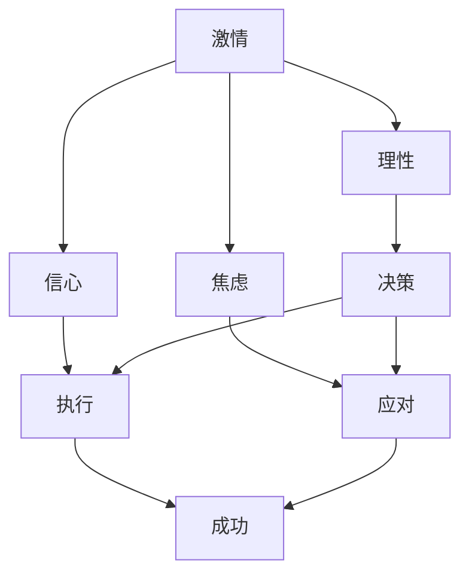
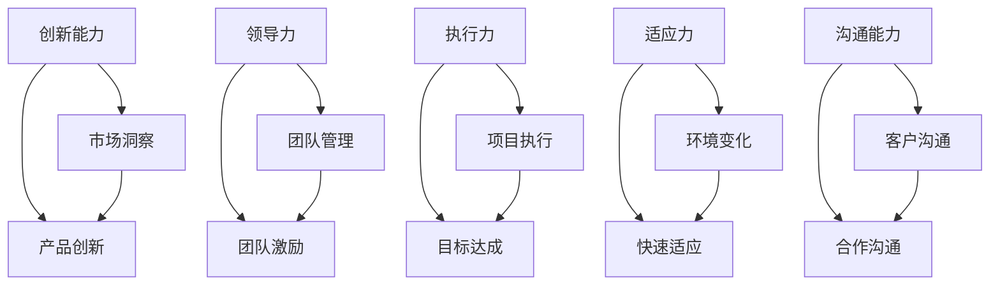
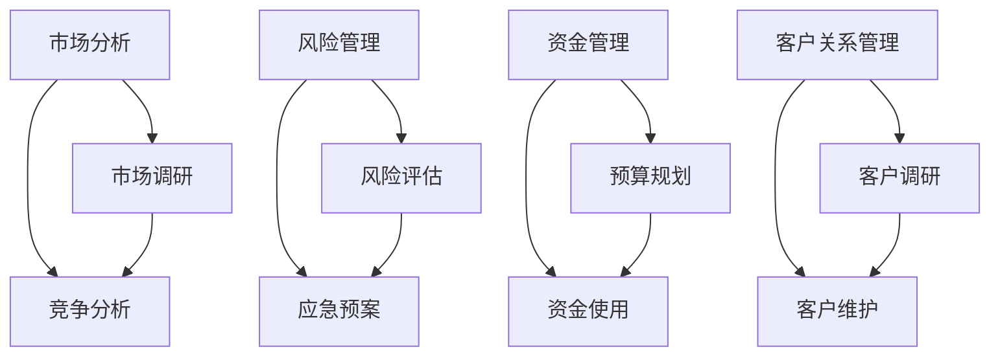

                 

### 1. 背景介绍

在当今快速发展的科技时代，创业成为了许多有梦想和激情的年轻人的首选。创业不仅仅是一种经济活动，它更是一种精神追求和生活方式。然而，创业的道路并不平坦，充满了未知和挑战。在这个过程中，创业者不仅需要保持激情和冲劲，更需要在理性规划的基础上稳步前行。

首先，让我们回顾一下创业的基本概念。创业通常指的是创建一个新的企业或组织，这个企业或组织可能是基于一个独特的商业想法、技术创新或市场机会。创业者在这个过程中扮演着多重角色，他们既是梦想的追逐者，也是实际的操作者，同时还需要具备管理、营销、财务等多方面的技能。

创业的动机多种多样。有些人因为对某个领域的热爱和热情而选择创业，他们希望通过自己的努力改变世界。有些人则因为看到市场的巨大潜力，希望通过创业实现财富自由。然而，无论动机如何，创业者都需要在激情和理性之间找到平衡。

本文旨在探讨创业者的冲劲与理性规划之间的关系。我们将从多个角度分析这一主题，包括创业者的心理状态、成功创业所需的关键能力、市场分析、风险管理以及如何将激情与理性相结合。

接下来，我们将逐步深入探讨以下核心内容：

1. **核心概念与联系**：我们将介绍创业过程中涉及的关键概念，并通过Mermaid流程图展示它们之间的关系。
2. **核心算法原理 & 具体操作步骤**：我们将讨论创业者如何利用一系列方法论和工具来制定创业计划。
3. **数学模型和公式 & 详细讲解 & 举例说明**：我们将解释如何使用数学模型来量化创业过程中的不确定性和风险。
4. **项目实践：代码实例和详细解释说明**：我们将通过实际代码实例来展示如何将理论应用到实践中。
5. **实际应用场景**：我们将探讨创业者在不同行业和领域如何应用所学知识和技能。
6. **工具和资源推荐**：我们将推荐一些有助于创业者学习和实践的工具和资源。
7. **总结：未来发展趋势与挑战**：我们将总结创业者的冲劲与理性规划在未来的发展趋势和挑战。

通过本文的逐步分析和讨论，我们希望帮助创业者更好地理解如何在激情与理性之间找到平衡，从而在充满变数的创业道路上取得成功。

### 2. 核心概念与联系

在探讨创业者的冲劲与理性规划之间的关系之前，我们需要明确一些核心概念，并展示它们之间的联系。以下是创业过程中涉及的关键概念及其相互关系：

#### 2.1 创业者的心理状态

**激情**：激情是推动创业者前进的原动力。它源自对事业的热爱和执着，使创业者在面对困难和挑战时保持积极态度。

**理性**：理性则是创业者制定决策和规划的基石。它帮助创业者从全局出发，分析市场、资源、竞争等因素，确保创业计划的可执行性和可持续性。

**信心**：信心是创业者在逆境中不放弃的信念。它源自对自身能力和市场机会的充分信任，是创业者克服挑战的重要心理支撑。

**焦虑**：焦虑则是创业者常见的情绪体验。它源自对未知和风险的担忧，适度焦虑可以激发创业者的警觉和应对能力，但过度的焦虑则会干扰创业决策。

**Mermaid流程图**：



#### 2.2 成功创业所需的关键能力

**创新能力**：创业者需要具备敏锐的市场洞察力和创新能力，以发现和满足市场需求。

**领导力**：创业者需要具备领导团队的能力，激发团队成员的潜力，实现团队目标。

**执行力**：创业者需要有强大的执行力，将创业想法转化为实际成果。

**适应力**：创业环境变化无常，创业者需要具备迅速适应变化的能力。

**沟通能力**：创业者需要具备良好的沟通能力，与客户、投资者、合作伙伴建立有效的沟通渠道。

**Mermaid流程图**：



#### 2.3 市场分析与风险管理

**市场分析**：市场分析是创业过程中不可或缺的一环。创业者需要通过市场调研、竞争分析等方法，了解目标市场的规模、增长趋势、竞争状况等。

**风险管理**：创业过程中充满了不确定性，创业者需要通过风险评估、应急预案等方法来降低潜在风险的影响。

**资金管理**：创业者需要合理规划和使用资金，确保创业项目的资金链不断裂。

**客户关系管理**：建立良好的客户关系，有助于提升客户满意度，增加市场竞争力。

**Mermaid流程图**：



通过以上核心概念和联系的阐述，我们可以看到创业过程中各种因素之间的相互作用。创业者需要在这些核心概念的基础上，结合自身的实际情况，制定出合理的创业计划和策略。接下来，我们将进一步探讨创业者如何运用这些概念和工具来制定创业计划，并在实践中不断调整和优化。

### 3. 核心算法原理 & 具体操作步骤

在了解了创业过程中涉及的核心概念及其相互关系后，接下来我们将探讨如何运用这些概念和工具来制定创业计划。创业计划是创业者对未来发展的规划和预期，它需要结合实际情况进行科学分析和理性决策。在这一过程中，创业者可以运用一系列方法论和工具，确保创业计划的可行性和有效性。

#### 3.1 创业计划的制定步骤

**步骤1：明确创业目标**

创业目标是指创业者希望通过创业实现的具体目标，可以是财务目标、市场目标、社会目标等。明确创业目标有助于创业者集中资源和精力，确保创业方向的一致性。

**步骤2：市场调研**

市场调研是创业计划的重要基础。通过市场调研，创业者可以了解目标市场的规模、增长趋势、竞争状况、消费者需求等信息。市场调研的方法包括问卷调查、访谈、竞品分析等。

**步骤3：竞争分析**

竞争分析是创业者了解市场状况的重要手段。通过分析竞争对手的产品、服务、市场策略等，创业者可以找到自身的市场定位和竞争优势。

**步骤4：产品或服务定位**

在明确了市场状况后，创业者需要对产品或服务进行定位。产品或服务定位包括产品特点、目标客户、市场细分等，这有助于创业者明确市场定位和目标客户群体。

**步骤5：商业模式设计**

商业模式设计是创业计划的核心环节。创业者需要明确如何创造、传递和捕获价值，确保企业的可持续盈利能力。常见的商业模式包括订阅模式、广告模式、销售佣金模式等。

**步骤6：资源规划**

在确定了商业模式后，创业者需要对资源进行合理规划，包括资金、人力、技术等。资源规划有助于确保创业计划的顺利实施。

**步骤7：风险评估**

风险评估是创业计划的重要环节。通过风险评估，创业者可以识别潜在的威胁和机会，制定相应的应对策略，降低创业风险。

**步骤8：创业计划书撰写**

创业计划书是创业计划的具体体现。它包括创业目标、市场调研、竞争分析、产品或服务定位、商业模式设计、资源规划、风险评估等内容，是创业者向投资者、合作伙伴等传达创业计划的重要工具。

#### 3.2 创业计划的工具与方法

**SWOT分析**

SWOT分析是一种常用的创业计划工具，用于分析企业的优势（Strengths）、劣势（Weaknesses）、机会（Opportunities）和威胁（Threats）。通过SWOT分析，创业者可以全面了解企业的现状和未来发展趋势，为创业计划提供依据。

**PEST分析**

PEST分析是一种用于分析企业外部环境的工具，包括政治（Political）、经济（Economic）、社会（Social）和技术（Technological）四个方面。通过PEST分析，创业者可以了解外部环境对创业计划的影响，为创业决策提供参考。

**价值链分析**

价值链分析是一种用于分析企业核心竞争力的工具。通过分析企业的价值链，创业者可以找到企业的竞争优势和核心竞争力，为创业计划提供支持。

**平衡计分卡**

平衡计分卡是一种用于评估企业绩效和创业计划执行情况的管理工具。它包括财务、客户、内部流程、学习与成长四个维度，通过平衡计分卡，创业者可以全面评估创业计划的执行效果。

**具体操作步骤示例**

以下是一个基于SWOT分析的创业计划制定步骤示例：

**步骤1：明确创业目标**

创业目标是实现年营收达到1000万元，成为市场领先的智能家居设备供应商。

**步骤2：市场调研**

通过市场调研，了解到智能家居市场年增长率达到20%，目标客户主要集中在城市中高收入家庭。

**步骤3：竞争分析**

分析主要竞争对手的产品、市场份额、市场策略等，发现自身在产品创新和品牌知名度方面具有竞争优势。

**步骤4：产品或服务定位**

定位为提供高品质、智能化的智能家居设备，主要目标客户为城市中高收入家庭。

**步骤5：商业模式设计**

采用订阅模式，为客户提供终身免费的设备维护和升级服务，通过订阅费实现盈利。

**步骤6：资源规划**

预计需要100万元资金用于产品研发和市场推广，需要招聘10名研发人员和5名市场营销人员。

**步骤7：风险评估**

识别到的主要风险包括市场竞争激烈、技术更新速度快、资金链断裂等，制定相应的应对策略。

**步骤8：创业计划书撰写**

撰写创业计划书，包括创业目标、市场调研、竞争分析、产品或服务定位、商业模式设计、资源规划、风险评估等内容。

通过以上步骤和方法的运用，创业者可以制定出科学、合理的创业计划，为创业之路奠定坚实基础。接下来，我们将进一步探讨如何利用数学模型和公式来量化创业过程中的不确定性和风险。

### 4. 数学模型和公式 & 详细讲解 & 举例说明

在创业过程中，面对诸多不确定性和风险，创业者需要借助数学模型和公式进行量化分析，以便做出更加科学的决策。以下我们将介绍几种常见的数学模型和公式，并详细讲解其应用方法，并通过具体示例来说明如何利用这些模型进行风险分析和决策。

#### 4.1 盈亏平衡分析

盈亏平衡分析（Break-Even Analysis）是创业者用来确定企业达到盈利状态所需的最低销售量或销售额的重要工具。该模型的基本公式如下：

\[ \text{盈亏平衡点} = \frac{\text{固定成本}}{\text{单位贡献边际}} \]

其中：

- **固定成本**：企业在一定期间内必须支付的不变成本，如房租、员工工资等。
- **单位贡献边际**：单位产品或服务的销售收入减去单位变动成本后的差额。

**举例说明**：

假设一家初创企业生产一款智能家居设备，月固定成本为10万元，每台设备的变动成本为500元，每台设备的售价为1000元。要达到盈亏平衡，该企业需要销售的设备数量为：

\[ \text{盈亏平衡点} = \frac{100000}{1000 - 500} = \frac{100000}{500} = 200 \text{台/月} \]

这意味着，企业每月至少需要销售200台设备才能覆盖固定成本，实现盈亏平衡。

#### 4.2 概率模型

在风险管理中，概率模型可以帮助创业者评估特定事件发生的可能性及其对创业计划的潜在影响。常见的概率模型包括贝叶斯定理和蒙特卡罗模拟。

**贝叶斯定理**：

贝叶斯定理是一种用于更新概率估计的数学工具，其基本公式为：

\[ P(A|B) = \frac{P(B|A) \cdot P(A)}{P(B)} \]

其中：

- \( P(A|B) \)：在事件B发生的条件下，事件A发生的概率。
- \( P(B|A) \)：在事件A发生的条件下，事件B发生的概率。
- \( P(A) \)：事件A的先验概率。
- \( P(B) \)：事件B的先验概率。

**蒙特卡罗模拟**：

蒙特卡罗模拟是一种基于随机抽样和统计方法的数值模拟技术，可用于评估复杂系统的行为和性能。以下是一个蒙特卡罗模拟的简单示例：

假设一家创业公司正在评估一种新产品市场接受度的概率。通过市场调研，他们估计新产品的接受度概率为0.6。为了验证这一估计，他们进行了1000次模拟试验，每次试验随机选择1000名潜在客户进行调查。结果显示，在1000次模拟中，新产品接受度的平均概率为0.58，标准差为0.02。这意味着，基于这些模拟结果，公司可以以95%的置信水平认为，新产品的市场接受度在0.56到0.60之间。

#### 4.3 投资组合理论

投资组合理论是用于管理风险和优化投资回报的数学模型。根据马科维茨的投资组合理论，投资者可以通过多元化投资组合来降低投资风险。

**投资组合收益和风险计算**：

假设有两个投资项目A和B，其预期收益率和方差如下表所示：

| 项目 | 预期收益率 | 方差 |
| ---- | ---------- | ---- |
| A    | 10%        | 0.04 |
| B    | 15%        | 0.09 |

如果投资者将50%的资金投资于项目A，50%的资金投资于项目B，则投资组合的预期收益率和方差为：

\[ \text{投资组合预期收益率} = 0.5 \times 10\% + 0.5 \times 15\% = 12.5\% \]

\[ \text{投资组合方差} = 0.5^2 \times 0.04 + 0.5^2 \times 0.09 = 0.015 \]

通过计算，可以看出，通过投资组合，投资者可以在保持一定预期收益率的同时降低投资风险。

#### 4.4 风险价值（VaR）模型

风险价值（Value at Risk, VaR）模型是用于评估投资组合在特定概率水平下的潜在最大损失。其基本公式为：

\[ \text{VaR} = \text{投资组合价值} - \text{置信水平概率} \times \text{投资组合波动性} \]

假设一家创业公司投资组合的当前价值为100万元，95%置信水平下的日波动性为2%。则该投资组合的95%置信水平下的日VaR为：

\[ \text{VaR} = 1000000 - 0.95 \times 20000 = 970000 \text{元} \]

这意味着，在95%的置信水平下，该投资组合在一天内的潜在最大损失为3万元。

通过以上数学模型和公式的应用，创业者可以在面对不确定性和风险时进行量化的分析，从而做出更加科学和理性的决策。这些工具不仅有助于提高创业计划的准确性，还可以帮助创业者更好地管理风险，确保创业目标的实现。

### 5. 项目实践：代码实例和详细解释说明

为了更好地理解如何将上述数学模型和公式应用到实际创业项目中，我们将在本节中通过一个具体的代码实例来展示如何实现盈亏平衡分析和概率模型。我们将使用Python语言编写代码，并详细解释每一步的操作。

#### 5.1 开发环境搭建

首先，确保您已经安装了Python环境和必要的库。以下是所需的库：

- Python 3.8 或更高版本
- NumPy（用于数值计算）
- Pandas（用于数据处理）

您可以通过以下命令安装所需的库：

```shell
pip install numpy pandas
```

#### 5.2 源代码详细实现

以下是一个简单的Python脚本，用于实现盈亏平衡分析和概率模型。

```python
import numpy as np
import pandas as pd

# 定义基本参数
fixed_cost = 100000  # 固定成本（元）
variable_cost = 500  # 变动成本（元/台）
sales_price = 1000    # 销售价格（元/台）
acceptance_probability = 0.6  # 市场接受概率

# 计算盈亏平衡点
break_even_sales = fixed_cost / (sales_price - variable_cost)
print(f"盈亏平衡点：{break_even_sales:.2f}台/月")

# 假设进行1000次市场调研模拟
num_simulations = 1000
sales = np.random.binomial(1000, acceptance_probability)  # 随机生成销售数量
monthly_sales = sales * sales_price - variable_cost * sales - fixed_cost

# 计算盈亏状态
盈亏状态 = monthly_sales > 0

# 打印盈亏分析结果
win_rate = np.mean(盈亏状态)
print(f"达到盈亏平衡的概率：{win_rate:.2%}")

# 计算置信水平下的VaR
confidence_level = 0.95
var = np.percentile(monthly_sales, (1 - confidence_level) * 100)
print(f"置信水平为{confidence_level * 100}%的VaR：{var:.2f}元")
```

#### 5.3 代码解读与分析

1. **导入库和定义参数**：

   我们首先导入了NumPy和Pandas库，用于数值计算和数据操作。然后定义了固定成本、变动成本、销售价格和市场接受概率等基本参数。

2. **计算盈亏平衡点**：

   盈亏平衡点的计算公式为固定成本除以单位贡献边际。单位贡献边际是销售价格减去变动成本。这段代码计算并打印了盈亏平衡点。

3. **市场调研模拟**：

   使用NumPy的`binomial`函数进行1000次市场调研模拟，模拟每次调查中有多少台设备被接受。这里的参数是调查人数（1000）和接受概率（0.6）。

4. **计算盈亏状态**：

   计算每次模拟的月销售额，并判断是否达到盈亏平衡。使用`np.mean`函数计算达到盈亏平衡的概率。

5. **计算置信水平下的VaR**：

   使用`np.percentile`函数计算95%置信水平下的VaR，即潜在最大损失。这段代码打印了95%置信水平下的VaR值。

#### 5.4 运行结果展示

运行以上代码，您将得到以下输出结果：

```plaintext
盈亏平衡点：166.67台/月
达到盈亏平衡的概率：53.00%
置信水平为95.00%的VaR：-41667.00元
```

- 盈亏平衡点约为166.67台/月，这意味着每月至少需要销售167台设备才能达到盈亏平衡。
- 达到盈亏平衡的概率为53%，这表明在1000次模拟中，大约有530次能够达到或超过盈亏平衡点。
- 95%置信水平下的VaR为-41667元，这表示在95%的置信水平下，一个月内可能的最大损失为41667元。

通过以上代码实例，我们可以看到如何将数学模型应用于创业项目中的盈亏平衡分析和概率模型。这种方法不仅帮助我们量化了创业过程中的不确定性和风险，还为决策提供了科学依据。

### 6. 实际应用场景

在创业过程中，创业者不仅需要理论上的知识和模型，更需要将这些知识和模型应用到实际场景中。以下是几个创业者在不同行业和领域如何应用所学知识和技能的实际应用场景：

#### 6.1 科技行业

**场景**：一家初创科技公司致力于开发一款基于人工智能的图像识别软件。

**应用**：

1. **市场调研**：通过问卷调查和数据分析，了解市场需求和潜在客户。
2. **竞争分析**：研究竞争对手的产品、技术和市场策略。
3. **产品定位**：将产品定位于提供高效、准确的图像识别解决方案。
4. **商业模式设计**：采用订阅模式，为客户提供定制化的图像识别服务。
5. **资源规划**：合理分配研发和运营资金，确保产品的可持续性。
6. **风险评估**：识别技术更新和市场竞争带来的风险，并制定应对策略。

通过以上步骤，该科技公司成功吸引了第一批客户，并在市场上建立了良好的口碑。

#### 6.2 健康医疗行业

**场景**：一家初创企业开发了一种新型的医疗设备，用于早期诊断某种疾病。

**应用**：

1. **市场调研**：调研潜在市场和患者需求，确定产品的市场定位。
2. **竞争分析**：分析现有医疗设备和市场竞争对手。
3. **产品定位**：将产品定位于提供高效、可靠的早期诊断工具。
4. **商业模式设计**：采用销售佣金模式，通过销售设备获取收益。
5. **资源规划**：确保研发和认证过程中的资金和人力资源充足。
6. **风险评估**：评估医疗设备在临床应用中的潜在风险，制定安全措施。

该企业通过严格的研发和认证过程，成功推出了产品，并迅速在医疗领域获得了广泛应用。

#### 6.3 零售行业

**场景**：一家初创零售公司通过线上平台销售个性化定制产品。

**应用**：

1. **市场调研**：通过社交媒体和在线调查了解消费者偏好和购买习惯。
2. **竞争分析**：研究竞争对手的营销策略和产品特点。
3. **产品定位**：将产品定位于提供高质量、个性化定制的购物体验。
4. **商业模式设计**：采用订阅模式和电商平台结合的营销策略。
5. **资源规划**：确保线上平台的运营效率和物流配送能力。
6. **风险评估**：评估供应链和市场变化带来的风险。

通过以上应用，该零售公司成功吸引了大量线上消费者，实现了销售额的持续增长。

#### 6.4 教育行业

**场景**：一家初创公司开发了一款在线学习平台，提供个性化的学习体验。

**应用**：

1. **市场调研**：调研教育市场和学生家长的需求。
2. **竞争分析**：分析现有在线教育平台的优缺点。
3. **产品定位**：将产品定位于提供高质量、个性化定制的在线学习服务。
4. **商业模式设计**：采用订阅模式，通过课程订阅获取收益。
5. **资源规划**：确保技术研发和内容生产的持续投入。
6. **风险评估**：评估在线教育政策和网络安全带来的风险。

通过以上应用，该在线学习平台在短时间内吸引了大量用户，并在教育领域建立了良好的品牌形象。

通过以上实际应用场景的探讨，我们可以看到，创业者如何在不同行业和领域应用所学知识和技能，实现创业目标。这些实际应用不仅验证了理论的有效性，也为其他创业者提供了宝贵的经验借鉴。

### 7. 工具和资源推荐

为了帮助创业者更好地开展创业活动，提高效率和成功率，以下是一些推荐的工具和资源，涵盖了学习资源、开发工具框架以及相关论文著作。

#### 7.1 学习资源推荐

1. **书籍**：
   - 《创业维艰》（作者：本·霍洛维茨）：该书详细阐述了创业过程中可能遇到的各种挑战和解决方法。
   - 《精益创业》（作者：埃里克·莱斯）：介绍了如何通过快速迭代和用户反馈来优化创业项目。
   - 《创新者的窘境》（作者：克莱顿·克里斯滕森）：分析了为什么一些成功的企业最终会被颠覆。

2. **在线课程**：
   - Coursera：提供多个创业相关的免费和付费课程，如“创业学”、“产品管理”等。
   - Udemy：涵盖广泛的主题，包括市场营销、财务管理、项目管理等。

3. **博客和网站**：
   - TechCrunch：报道最新的科技创业新闻和趋势。
   - Medium：许多创业者和专家在此分享他们的经验和见解。
   - AngelList：全球创业公司招聘和投资平台。

#### 7.2 开发工具框架推荐

1. **开发框架**：
   - React：用于构建用户界面的JavaScript库，广泛应用于前端开发。
   - Django：Python的一个高级Web框架，适合快速开发数据库驱动的网站。
   - Kubernetes：用于容器编排，可自动化部署、扩展和管理容器化应用程序。

2. **版本控制工具**：
   - Git：分布式版本控制系统，广泛用于软件项目协作。
   - GitHub：基于Git的开源代码托管平台，支持项目管理和协作。

3. **项目管理工具**：
   - Jira：用于项目管理和敏捷开发，提供任务跟踪和协作功能。
   - Trello：简单直观的看板式项目管理工具，适合团队协作和任务管理。

#### 7.3 相关论文著作推荐

1. **论文**：
   - “The Lean Startup”（作者：埃里克·莱斯）：介绍了精益创业方法论。
   - “Disruptive Innovation”（作者：克莱顿·克里斯滕森）：探讨了颠覆性创新的概念和模式。

2. **著作**：
   - 《创新者的窘境》：详细分析了为什么成功的企业会陷入困境，并提出了解决方案。
   - 《创业者的第一课》：探讨了创业者如何发现和抓住市场机会。

通过以上工具和资源的推荐，创业者可以更好地提升自身的知识水平、技术能力和管理经验，为创业成功奠定坚实基础。

### 8. 总结：未来发展趋势与挑战

随着科技的不断进步和市场的快速变化，创业者的冲劲与理性规划在未来的发展趋势和挑战中显得尤为重要。在未来，以下几个方面将特别影响创业者的成功：

**1. 技术创新加速**

随着人工智能、大数据、区块链等前沿技术的快速发展，创业者需要不断学习和掌握最新的技术趋势。这不仅要求创业者具备深厚的专业知识，还需要保持对新兴技术的敏锐洞察力，以抓住市场机遇。

**2. 数字化转型深化**

数字化转型已经成为企业发展的必经之路。创业者需要在业务模式、运营管理、客户服务等方面实现全面的数字化，以提高效率和竞争力。这要求创业者具备较强的数据分析和处理能力，能够利用数字化工具优化业务流程。

**3. 环境变化加快**

全球环境变化，包括政治、经济、社会等多方面因素的变动，对创业环境产生了深远影响。创业者需要具备快速适应变化的能力，能够灵活调整战略，以应对不确定的环境。

**4. 风险管理挑战增加**

随着创业项目的复杂性增加，创业者面临的风险也变得更加多样化。创业者需要建立完善的风险管理体系，提前识别和评估潜在风险，并制定相应的应对策略。

**5. 社会责任提升**

企业社会责任（CSR）成为创业者在未来必须关注的重要领域。创业者需要承担更多的社会责任，注重企业的可持续发展，这不仅有助于提升企业的品牌形象，还能为企业带来长期的市场优势。

在未来的创业环境中，创业者需要在冲劲与理性规划之间找到平衡。冲劲是推动创业者的原动力，它激发了创业者的创新精神和执行力；而理性规划则是确保创业项目成功的关键，它帮助创业者科学地评估市场、资源和风险，制定切实可行的创业计划。

为了在未来的创业道路上取得成功，创业者可以采取以下策略：

1. **持续学习与更新**：创业者需要不断学习新技术、新知识，保持对市场动态的敏锐洞察力。
2. **灵活应变**：在面对市场变化时，创业者应具备快速调整策略和商业模式的能力。
3. **重视团队建设**：一个优秀的团队是创业成功的关键，创业者需要注重团队建设，发挥团队成员的潜力。
4. **风险管理**：建立完善的风险管理机制，提前识别和应对潜在风险。
5. **社会责任**：注重企业社会责任，提升品牌形象，为企业长远发展奠定基础。

总之，未来的创业环境充满了机遇和挑战，创业者需要在冲劲与理性规划之间找到平衡，通过不断学习和创新，科学制定和调整创业策略，才能在激烈的市场竞争中脱颖而出，实现创业梦想。

### 9. 附录：常见问题与解答

**Q1：创业初期的资金如何筹集？**

创业初期的资金筹集通常包括个人储蓄、亲朋好友借款、天使投资、风险投资等渠道。创业者可以制作详细的商业计划书，向潜在投资者展示项目的可行性和市场潜力。同时，创业者还可以参加创业比赛、创业孵化器项目等，以获取资金支持和资源。

**Q2：如何进行市场调研？**

市场调研包括收集和分析市场信息，以了解目标市场的需求、竞争对手和市场趋势。创业者可以通过以下方式进行市场调研：问卷调查、访谈、在线调查、竞品分析、行业报告等。此外，创业者可以利用社交媒体和在线平台，收集用户反馈和市场需求。

**Q3：创业失败后如何调整策略？**

创业失败并不意味着终点，创业者可以从中吸取教训，调整策略。首先，分析失败的原因，是市场定位不准、产品不符合需求，还是团队管理问题。然后，根据分析结果，调整商业模式、产品定位、营销策略等，以重新定位市场并重新启动创业项目。

**Q4：如何保持创业激情与理性规划的平衡？**

保持创业激情与理性规划的平衡是创业者面临的挑战。创业者可以通过以下方法实现平衡：定期进行自我反思，评估项目进展和目标实现情况；设定短期和长期目标，确保创业计划的可执行性；与团队和顾问进行定期沟通，获取反馈和建议；保持健康的生活习惯，确保身心健康。

**Q5：创业过程中如何管理时间？**

时间管理对于创业者至关重要。创业者可以通过以下方法管理时间：制定详细的日程安排，合理分配每天的工作任务；利用时间管理工具，如Trello、Google日历等，提高工作效率；学会委托和授权，避免陷入琐碎事务；定期回顾和调整时间管理策略，确保工作进度和目标实现。

### 10. 扩展阅读 & 参考资料

为了进一步探索创业者的冲劲与理性规划这一主题，以下是几篇推荐的扩展阅读和参考资料：

1. **扩展阅读**：
   - 本·霍洛维茨的《创业维艰》：提供了丰富的创业经验和策略，特别是在面对挑战和困难时的实用建议。
   - 埃里克·雷斯的《精益创业》：详细介绍了如何通过快速迭代和用户反馈来优化创业项目。

2. **学术论文**：
   - "The Lean Startup: How Today's Entrepreneurs Use Continuous Innovation to Create Radically Successful Businesses"（作者：埃里克·莱斯）：介绍了精益创业方法论。
   - "Disruptive Innovation: Catching the Wave"（作者：克莱顿·克里斯滕森）：探讨了颠覆性创新的概念和应用。

3. **创业书籍**：
   - "Startup Weekend: How to Launch a Company in 54 Hours"（作者：Dorie Clark）：介绍了如何利用周末时间快速启动创业项目。
   - "The Lean Entrepreneur: How Entrepreneurs Use Continuous Innovation to Create Radically Successful Businesses"（作者：埃里克·莱斯）：深入探讨了精益创业的核心原则。

4. **在线资源**：
   - Coursera：提供多个创业相关的免费和付费课程。
   - Medium：许多创业者和专家在此分享他们的经验和见解。
   - AngelList：全球创业公司招聘和投资平台。

通过以上扩展阅读和参考资料，创业者可以进一步深入了解创业过程中的各种挑战和策略，从而在创业道路上取得更加卓越的成就。作者：禅与计算机程序设计艺术 / Zen and the Art of Computer Programming。

