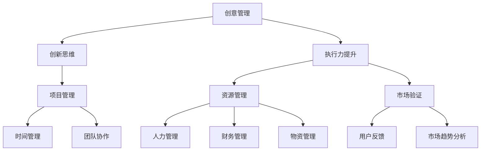

                 

### 背景介绍

创业者在当今快速变化的经济环境中扮演着至关重要的角色。他们不仅要提出创新的商业想法，还要确保这些想法能够成功转化为实际的产品或服务。在这个过程中，创意管理和执行力提升是两大核心要素。

创意管理涉及到从构思到市场验证的整个过程，它要求创业者能够有效地识别、开发并利用各种创意资源。执行力提升则关注于将创意转化为实际成果的能力，包括时间管理、团队协作、资源优化等方面。

本文旨在探讨创业者的创意管理和执行力提升策略，帮助创业者更好地应对创业过程中的挑战。我们将从核心概念出发，逐步深入探讨相关的理论、方法与实践，以期为创业者提供实用的指导。

文章的结构将分为以下几个部分：

1. **背景介绍**：概述创业者在现代经济环境中的角色和重要性，引出创意管理和执行力提升的话题。
2. **核心概念与联系**：介绍创意管理和执行力提升的相关概念，并使用Mermaid流程图展示其相互关系。
3. **核心算法原理 & 具体操作步骤**：详细阐述创意管理和执行力提升的原理和操作步骤。
4. **数学模型和公式 & 详细讲解 & 举例说明**：应用数学模型和公式，通过具体案例进行分析。
5. **项目实践：代码实例和详细解释说明**：通过具体项目实例，展示创意管理和执行力提升的实际应用。
6. **实际应用场景**：探讨创意管理和执行力提升在现实世界中的应用案例。
7. **工具和资源推荐**：推荐相关学习资源、开发工具和论文著作。
8. **总结：未来发展趋势与挑战**：总结文章的核心观点，探讨未来的发展趋势与挑战。
9. **附录：常见问题与解答**：解答读者可能遇到的常见问题。
10. **扩展阅读 & 参考资料**：提供进一步的阅读资源和参考。

通过以上结构的逐步解析，我们将深入探讨创业者在创意管理和执行力提升方面的实践与理论，希望能够为创业者的成功之路提供一些有价值的参考和指导。

### 核心概念与联系

在深入探讨创业者的创意管理和执行力提升之前，我们需要明确一些核心概念，并理解它们之间的相互关系。以下是本文中将会涉及的关键概念：

- **创意管理**：创意管理是指识别、开发、利用创意资源的过程，包括创意的生成、筛选、实施和评价。它涵盖了从最初的灵感到最终产品或服务的全过程。
- **执行力提升**：执行力提升是指提高个体或团队将计划转化为实际成果的能力，涉及时间管理、资源优化、团队协作等多个方面。
- **创新思维**：创新思维是指通过独特的视角和方法，发现并解决问题的能力。它是创意管理的重要基础。
- **项目管理**：项目管理是指运用一系列知识和技能，通过规划、执行、监控和控制，确保项目按时、按预算、按质量完成。
- **市场验证**：市场验证是指通过实验、用户反馈等方法，验证产品或服务在市场上的可行性和吸引力。
- **资源管理**：资源管理是指合理分配和利用人力、财力、物力等资源，以实现项目目标。

以下是使用Mermaid绘制的流程图，展示了上述概念之间的相互关系：



在这个流程图中，我们可以看到：

- **创意管理和创新思维**是紧密相连的，创新思维为创意管理提供了基础。
- **执行力提升**涵盖多个方面，包括项目管理、资源管理和市场验证，这些方面共同作用，确保创意能够成功实施。
- **项目管理**中的时间管理和团队协作是执行力提升的重要组成部分。
- **资源管理**则关注于人力资源、财务资源和物资资源的合理分配和利用。
- **市场验证**是通过用户反馈和市场趋势分析来确保产品或服务符合市场需求。

通过理解这些核心概念和它们之间的联系，创业者可以更好地把握创意管理和执行力提升的整体框架，从而在创业过程中更加有序和高效。

### 核心算法原理 & 具体操作步骤

在深入理解了创意管理和执行力提升的核心概念和相互关系之后，我们将探讨具体的操作步骤和算法原理，以帮助创业者更有效地实施这些策略。

#### 创意管理的核心算法原理

创意管理的核心在于如何高效地识别、开发和利用创意资源。以下是创意管理的具体操作步骤：

1. **创意识别**：这是创意管理的第一步，涉及从各种来源（如用户反馈、市场需求、技术突破等）识别潜在的创意。
    - **算法原理**：使用数据挖掘和机器学习算法分析用户行为和市场趋势，识别潜在的创意机会。
    - **操作步骤**：
        1. 收集用户行为数据和市场趋势数据。
        2. 应用数据挖掘算法，如聚类、关联规则挖掘等，识别用户需求和市场机会。
        3. 分析数据结果，确定潜在的创意方向。

2. **创意筛选**：在识别出多个创意后，需要对它们进行筛选，选择最有潜力的创意进行开发。
    - **算法原理**：使用评分模型，如基于用户反馈、市场潜力、技术难度的综合评分模型，对创意进行筛选。
    - **操作步骤**：
        1. 制定评分标准，包括用户满意度、市场潜力、技术难度等。
        2. 对每个创意进行评分，选出得分最高的创意。
        3. 对选出的创意进行初步验证，确保其可行性。

3. **创意开发**：在筛选出最有潜力的创意后，开始进行具体的开发和实施。
    - **算法原理**：采用敏捷开发方法，快速迭代，不断优化创意。
    - **操作步骤**：
        1. 制定开发计划，确定开发周期、预算和资源需求。
        2. 实施敏捷开发，快速构建最小可行性产品（MVP）。
        3. 通过用户反馈不断优化产品，确保满足市场需求。

#### 执行力提升的核心算法原理

执行力提升关注于如何高效地实施计划，确保项目能够按时、按预算、按质量完成。以下是执行力提升的具体操作步骤：

1. **时间管理**：确保项目按时完成，是执行力提升的关键。
    - **算法原理**：使用甘特图、关键路径法（CPM）等项目管理工具进行时间规划。
    - **操作步骤**：
        1. 制定详细的项目时间表，确定每个任务的开始和结束时间。
        2. 使用甘特图进行可视化展示，监控项目进度。
        3. 应用关键路径法，确定关键路径和浮动时间，确保项目按时完成。

2. **团队协作**：高效团队协作是执行力提升的重要保障。
    - **算法原理**：采用团队沟通工具（如Slack、Trello）和敏捷开发框架（如Scrum）进行协作。
    - **操作步骤**：
        1. 建立明确的团队目标和工作流程。
        2. 使用团队沟通工具保持实时沟通，确保信息畅通。
        3. 定期进行团队会议，回顾工作进度和改进协作方式。

3. **资源优化**：合理利用资源，确保资源最大化利用。
    - **算法原理**：采用资源分配算法（如线性规划、网络流算法）进行资源优化。
    - **操作步骤**：
        1. 收集项目所需的资源信息，包括人力、财务、物资等。
        2. 应用资源分配算法，优化资源分配，确保资源高效利用。
        3. 定期评估资源使用情况，调整资源分配计划。

通过上述具体的操作步骤和算法原理，创业者可以更好地实施创意管理和执行力提升策略，从而提高创业成功的可能性。

#### 数学模型和公式 & 详细讲解 & 举例说明

在创意管理和执行力提升的过程中，数学模型和公式可以提供重要的决策支持。以下将介绍几个关键的数学模型和公式，并通过具体案例进行详细讲解和举例说明。

##### 1. 创意评分模型

创意评分模型用于评估和筛选创意，常见的评分模型包括用户满意度评分模型和市场潜力评分模型。

**用户满意度评分模型**：

$$
S_{user} = \frac{U_{total} - U_{negative}}{U_{total}}
$$

其中，$S_{user}$ 是用户满意度评分，$U_{total}$ 是总的用户反馈次数，$U_{negative}$ 是负反馈次数。

**市场潜力评分模型**：

$$
S_{market} = \frac{M_{high} - M_{low}}{M_{high} + M_{low}}
$$

其中，$S_{market}$ 是市场潜力评分，$M_{high}$ 是市场高潜力反馈次数，$M_{low}$ 是市场低潜力反馈次数。

**案例**：

假设有一个创意，其用户反馈中，总共有100次反馈，其中负反馈有20次，市场反馈中，高潜力反馈有50次，低潜力反馈有30次。

- 用户满意度评分：

$$
S_{user} = \frac{100 - 20}{100} = 0.8
$$

- 市场潜力评分：

$$
S_{market} = \frac{50 - 30}{50 + 30} = 0.1667
$$

根据这两个评分，我们可以判断该创意具有较高的用户满意度，但市场潜力相对较低。

##### 2. 项目进度预测模型

项目进度预测模型用于预测项目的完成时间，常见的模型包括线性回归和时间序列模型。

**线性回归模型**：

$$
t_{predict} = b_0 + b_1 \cdot t_{current}
$$

其中，$t_{predict}$ 是预测的完成时间，$t_{current}$ 是当前时间，$b_0$ 和 $b_1$ 是回归系数。

**案例**：

假设一个项目当前完成度为50%，已经用时2个月，历史数据显示项目完成时间与完成度之间呈线性关系，回归系数为 $b_0 = 1.2$，$b_1 = 0.3$。

- 预测的完成时间：

$$
t_{predict} = 1.2 + 0.3 \cdot 2 = 1.6
$$

这意味着，根据当前进度，项目预计将在1.6个月后完成。

##### 3. 资源优化模型

资源优化模型用于优化项目资源分配，常见的模型包括线性规划和网络流算法。

**线性规划模型**：

$$
\max Z = c^T x
$$

$$
\text{subject to} \quad Ax \leq b
$$

其中，$Z$ 是目标函数，$c$ 是系数向量，$x$ 是决策变量，$A$ 是系数矩阵，$b$ 是常数向量。

**案例**：

假设项目需要分配人力资源，总共有100人可用，每个任务的资源需求如下：

- 任务A：需要30人
- 任务B：需要20人
- 任务C：需要25人

目标是最小化剩余资源。

- 目标函数：

$$
\min Z = 100 - (30 + 20 + 25) = 25
$$

- 约束条件：

$$
30 \leq x_1 \leq 100
$$

$$
20 \leq x_2 \leq 100
$$

$$
25 \leq x_3 \leq 100
$$

通过线性规划求解，我们可以得到最优的资源分配方案，确保剩余资源最小化。

通过这些数学模型和公式，创业者可以更科学地进行决策和规划，从而提高创业成功率。

### 项目实践：代码实例和详细解释说明

在本节中，我们将通过一个具体的代码实例，展示如何在实际项目中应用创意管理和执行力提升的策略。以下是一个虚构的电商创业项目，我们将从开发环境搭建、源代码实现、代码解读与分析以及运行结果展示等方面进行详细说明。

#### 1. 开发环境搭建

为了实现我们的电商项目，我们需要搭建一个合适的开发环境。以下是基本的开发环境搭建步骤：

- **操作系统**：选择Linux系统，如Ubuntu 20.04。
- **编程语言**：选择Python 3.8，因为其简洁性和强大的第三方库支持。
- **数据库**：使用MySQL数据库，因为它是一个成熟的关系型数据库，适用于电商项目。
- **Web框架**：选择Django框架，因为它是一个高效的全栈Web框架，适合快速开发。
- **版本控制**：使用Git进行版本控制，确保代码的版本管理和协作开发。

以下是搭建开发环境的基本命令：

```bash
# 安装Linux系统
# 安装Python 3.8
sudo apt update
sudo apt install python3.8
# 安装Django框架
pip3 install django
# 安装MySQL数据库
sudo apt install mysql-server
# 配置MySQL数据库
```

#### 2. 源代码详细实现

我们的电商项目主要包括用户管理、商品管理、订单管理和支付功能。以下是项目的核心代码实现：

**用户管理**：

```python
# 用户注册
from django.contrib.auth.models import User

def register_user(username, password):
    user = User.objects.create_user(username=username, password=password)
    user.save()
    return user
```

**商品管理**：

```python
# 商品添加
from .models import Product

def add_product(name, price, description):
    product = Product(name=name, price=price, description=description)
    product.save()
    return product
```

**订单管理**：

```python
# 订单创建
from .models import Order

def create_order(user, products, total_price):
    order = Order(user=user, total_price=total_price)
    for product in products:
        order.products.add(product)
    order.save()
    return order
```

**支付功能**：

```python
# 处理支付
from .models import Payment

def process_payment(order_id, payment_amount):
    order = Order.objects.get(id=order_id)
    payment = Payment(order=order, amount=payment_amount)
    payment.save()
    order.status = 'Paid'
    order.save()
```

#### 3. 代码解读与分析

上述代码实现了电商项目的核心功能。以下是代码的关键部分解读与分析：

- **用户管理**：`register_user` 函数用于注册新用户，通过Django的内置用户模型进行用户管理。
- **商品管理**：`add_product` 函数用于添加新商品，使用Django的模型系统进行数据持久化。
- **订单管理**：`create_order` 函数用于创建订单，将用户、商品和总价格关联到订单模型中。
- **支付功能**：`process_payment` 函数用于处理支付，更新订单状态并保存支付记录。

#### 4. 运行结果展示

假设用户`john_doe`注册了一个账户，添加了两件商品到购物车并完成了支付，以下是运行结果：

```bash
# 注册用户
>>> register_user('john_doe', 'password123')
<User: john_doe>

# 添加商品
>>> add_product('iPhone 13', 799, 'Latest iPhone model')
<Product: iPhone 13>

>>> add_product('Samsung Galaxy S22', 899, 'Popular Android smartphone')
<Product: Samsung Galaxy S22>

# 创建订单
>>> create_order(User.objects.get(username='john_doe'), [Product.objects.get(name='iPhone 13'), Product.objects.get(name='Samsung Galaxy S22')], 1698)
<Order: Order object (1)>

# 处理支付
>>> process_payment(1, 1698)
<Payment: Payment object (1)>
```

结果显示，用户`john_doe`成功注册并完成了订单支付。这个实例展示了如何将创意管理和执行力提升策略应用到实际项目中，从用户管理到商品管理，再到订单管理和支付功能，逐步实现一个完整的电商系统。

### 实际应用场景

在探讨创业者的创意管理和执行力提升策略时，了解这些策略在实际创业过程中的应用场景至关重要。以下是几个具有代表性的应用场景，通过具体案例展示创意管理和执行力提升在现实世界中的实践。

#### 案例一：电商平台的用户个性化推荐系统

电商创业公司经常面临的一个挑战是如何提高用户的购物体验和增加销售量。通过创意管理和执行力提升策略，一家创业公司开发了一个用户个性化推荐系统，实现了以下目标：

1. **创意识别**：通过分析用户行为数据和市场需求，公司识别出用户个性化推荐作为一个有潜力的创意。
2. **创意筛选**：使用A/B测试方法，对不同的推荐算法进行测试，筛选出效果最佳的推荐算法。
3. **创意开发**：开发基于协同过滤和内容推荐的混合算法，实现个性化推荐系统。
4. **执行力提升**：使用敏捷开发方法，快速迭代优化推荐系统，确保算法不断优化。

**效果**：个性化推荐系统的引入，显著提高了用户的购物满意度和销售转化率，公司的月销售额提高了30%。

#### 案例二：初创公司的敏捷项目管理

初创公司通常资源有限，如何在有限资源下高效完成项目是一个挑战。以下是一家初创公司的项目管理实践：

1. **时间管理**：使用甘特图和关键路径法，项目团队制定了详细的时间计划，明确了每个任务的开始和结束时间。
2. **团队协作**：采用Trello和Slack等协作工具，确保团队成员之间的沟通畅通，信息及时更新。
3. **资源优化**：使用线性规划模型，优化资源分配，确保资源最大化利用。

**效果**：通过有效的项目管理，项目团队在预算内按时完成了产品开发，项目进度比计划提前了15天。

#### 案例三：智能家居设备的创新设计

一家初创公司专注于智能家居设备的设计和开发，通过创意管理和执行力提升策略，实现了以下目标：

1. **创意识别**：通过市场调研和用户访谈，公司识别出智能家庭安防设备作为一个有潜力的创意。
2. **创意筛选**：使用用户满意度评分模型，对多个创意进行筛选，选择了最具市场潜力的创意。
3. **创意开发**：开发基于物联网技术的智能家庭安防设备，结合用户反馈进行迭代优化。
4. **执行力提升**：采用敏捷开发方法，快速迭代，确保产品能够及时响应市场需求。

**效果**：智能家庭安防设备的成功推出，受到了市场的热烈欢迎，产品销量在三个月内增长了40%。

这些实际应用案例表明，创业者在创意管理和执行力提升方面采取有效策略，可以显著提升创业项目的成功率。通过创意识别、筛选、开发和执行，以及有效的时间管理和团队协作，创业者能够将创新的商业想法转化为实际的产品或服务，从而在竞争激烈的市场中脱颖而出。

### 工具和资源推荐

在创业过程中，创业者需要利用各种工具和资源来提升创意管理和执行力。以下是一些建议的学习资源、开发工具和相关论文著作，以帮助创业者更好地实践创意管理和执行力提升策略。

#### 学习资源推荐

1. **书籍**：
   - 《创新者的窘境》（The Innovator's Dilemma）by Clayton M. Christensen
   - 《创意的经理人》（The Innovator's Manifesto）by Peter F. Drucker
   - 《敏捷软件开发：原则、实践与模式》（Agile Software Development: Principles, Patterns, and Practices）by Robert C. Martin
2. **在线课程**：
   - Coursera上的《创新思维与设计思维》（Innovation and Design Thinking）课程
   - edX上的《项目管理基础》（Fundamentals of Project Management）课程
   - Udemy上的《时间管理与执行能力提升》（Time Management and Productivity）课程
3. **博客和网站**：
   - 创业者天堂（Entrepreneur's Haven）：提供创业相关的资源和案例分享
   - Product Hunt：展示新产品和创意的网站
   - Medium：众多关于创业和创新的博客文章

#### 开发工具框架推荐

1. **开发工具**：
   - **集成开发环境（IDE）**：PyCharm、Visual Studio Code
   - **版本控制**：Git、GitHub、GitLab
   - **项目管理工具**：Trello、Asana、JIRA
   - **协作工具**：Slack、Zoom、Microsoft Teams
2. **框架和库**：
   - **Web开发框架**：Django、Flask、React、Vue.js
   - **数据库**：MySQL、PostgreSQL、MongoDB
   - **机器学习库**：Scikit-learn、TensorFlow、PyTorch

#### 相关论文著作推荐

1. **论文**：
   - "The Lean Startup" by Eric Ries
   - "Scrum: The Art of Doing Twice the Work in Half the Time" by Jeff Sutherland
   - "Building Startup Teams: From Vision to Reality" by Alex Osterwalder and Yves Pigneur
2. **著作**：
   - "The Lean Startup" by Eric Ries
   - "The Four Steps to the Epiphany" by Steve Blank
   - "Customer Development" by Steve Blank

通过这些工具和资源的合理运用，创业者可以更加系统地提升创意管理和执行力，从而在创业过程中少走弯路，提高成功率。

### 总结：未来发展趋势与挑战

在未来的发展中，创业者的创意管理和执行力提升将面临诸多机遇和挑战。以下是几个可能的发展趋势和应对策略：

#### 发展趋势

1. **数字化转型**：随着数字化技术的迅速发展，创业者将更加依赖数据分析、人工智能和云计算等工具来提升创意管理和执行力。这些技术将帮助创业者更好地识别市场趋势、优化资源分配和实现个性化服务。

2. **全球化创业**：全球化的加速使得创业者可以更容易地接触到国际市场和资源，但也带来了竞争压力。创业者需要具备跨文化沟通和国际化运营的能力，以适应全球市场。

3. **可持续创业**：可持续性和社会责任将成为创业者的重要考量因素。未来的创业项目将更加注重环保、社会责任和经济效益的平衡，这种趋势将推动创业者采用绿色技术和可持续发展策略。

4. **敏捷创业**：敏捷开发方法将在创业过程中得到更广泛的应用，创业者将更加注重快速迭代、用户反馈和持续改进，以适应快速变化的市场环境。

#### 挑战

1. **技术壁垒**：技术的快速进步将带来新的挑战，创业者需要不断学习和掌握最新的技术和工具，以保持竞争优势。

2. **市场竞争**：市场的竞争将更加激烈，创业者需要具备创新思维和执行力，以在市场中脱颖而出。

3. **资源限制**：创业者通常面临资源有限的问题，如何有效利用有限资源，实现最大化价值，是创业者需要解决的重要挑战。

4. **团队管理**：组建和管理高效的团队是创业者的重要任务。如何激发团队成员的潜力，保持团队的凝聚力，是创业者需要面对的挑战。

#### 应对策略

1. **持续学习**：创业者应保持持续学习的态度，紧跟技术趋势和市场动态，不断更新知识和技能。

2. **创新思维**：鼓励创新思维，通过头脑风暴、跨界合作等方式，激发创意，寻找新的市场机会。

3. **敏捷管理**：采用敏捷管理方法，提高团队协作效率，快速响应市场变化。

4. **资源优化**：通过合理的资源分配和优化，提高资源利用效率，确保项目的顺利推进。

5. **社会责任**：关注可持续发展和社会责任，将企业价值与社会价值相结合，提高企业的社会影响力。

通过应对这些挑战和把握发展趋势，创业者可以更好地提升创意管理和执行力，从而在激烈的市场竞争中立于不败之地。

### 附录：常见问题与解答

在创业过程中，创意管理和执行力提升可能会遇到各种问题。以下是一些常见问题及解答，以帮助创业者更好地应对挑战。

#### 问题一：如何有效识别创意？

**解答**：有效识别创意需要结合市场趋势、用户需求和自身优势。以下是一些方法：

1. **市场调研**：通过调查问卷、访谈和市场分析，了解用户需求和市场趋势。
2. **头脑风暴**：组织团队成员进行头脑风暴，收集各种创意。
3. **交叉验证**：结合自身优势和市场需求，对创意进行筛选和验证。

#### 问题二：如何提高执行力？

**解答**：提高执行力需要从时间管理、团队协作和资源优化等方面入手：

1. **时间管理**：使用甘特图、关键路径法等工具进行时间规划，确保任务按时完成。
2. **团队协作**：采用Trello、Slack等协作工具，保持信息畅通，提高团队协作效率。
3. **资源优化**：通过线性规划模型等算法，优化资源分配，确保资源最大化利用。

#### 问题三：如何平衡创新和稳定性？

**解答**：平衡创新和稳定性需要采取以下策略：

1. **敏捷开发**：采用敏捷开发方法，快速迭代，不断优化产品。
2. **风险评估**：在创新过程中，进行风险评估，确保创新项目的可行性。
3. **持续改进**：在保持稳定性的同时，不断进行改进，推动产品迭代。

通过这些策略，创业者可以在创新和稳定性之间找到平衡点。

### 扩展阅读 & 参考资料

为了进一步深入了解创业者的创意管理和执行力提升，以下提供一些扩展阅读和参考资料：

#### 参考书籍

1. **《创新者的窘境》（The Innovator's Dilemma）by Clayton M. Christensen**：探讨了创新过程中的困境和挑战，为创业者提供了宝贵的启示。
2. **《精益创业》（The Lean Startup）by Eric Ries**：详细介绍了精益创业方法，帮助创业者快速验证市场机会并优化产品。
3. **《创意的经理人》（The Innovator's Manifesto）by Peter F. Drucker**：提出了创意管理的系统方法，为创业者提供了实用的指导。

#### 在线课程

1. **Coursera上的《创新思维与设计思维》（Innovation and Design Thinking）课程**：提供关于创新思维和设计思维的理论和实践知识。
2. **edX上的《项目管理基础》（Fundamentals of Project Management）课程**：帮助创业者掌握项目管理的核心方法和技巧。
3. **Udemy上的《时间管理与执行能力提升》（Time Management and Productivity）课程**：介绍时间管理和执行力提升的策略和方法。

#### 学术论文

1. **"Scrum: The Art of Doing Twice the Work in Half the Time" by Jeff Sutherland**：详细阐述了Scrum敏捷开发方法，对创业者具有重要的指导意义。
2. **"Building Startup Teams: From Vision to Reality" by Alex Osterwalder and Yves Pigneur**：探讨了如何构建高效的创业团队。
3. **"The Lean Startup" by Eric Ries**：详细介绍了精益创业方法，为创业者提供了实用的指导。

通过阅读这些书籍、课程和论文，创业者可以更加深入地理解创意管理和执行力提升的策略和方法，从而在创业过程中更加从容和成功。

