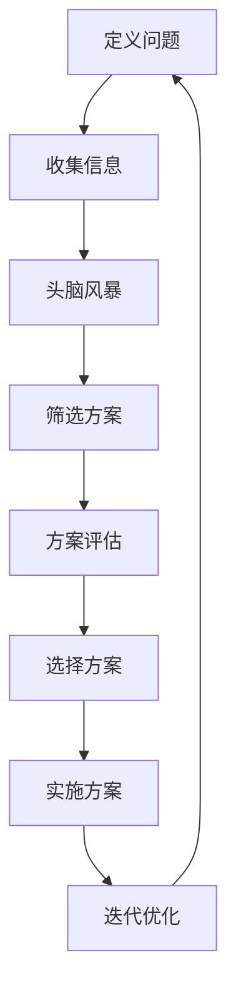

                 

### 引言 Introduction

在现代商业环境中，创新思维已经成为创业者成功的关键因素。创业者不仅需要拥有坚定的信念和强烈的执行力，更需要具备敏锐的洞察力，能够从纷繁复杂的市场环境中找到新的机遇。本文将探讨创新思维的重要性，介绍几种突破常规的创新方法，并探讨如何在实践中应用这些方法，助力创业者实现突破性成长。

> “创新思维是创业者必备的利器，它能够帮助创业者发现新的商业模式，创造出令人惊叹的产品和服务。” — 作者：禅与计算机程序设计艺术 / Zen and the Art of Computer Programming

创新思维的重要性不言而喻。在快速变化的市场环境中，只有不断创新，才能在激烈的竞争中立于不败之地。创新不仅能够帮助企业抓住新的市场机遇，还能够提高企业的核心竞争力，实现可持续发展。因此，掌握创新思维方法，对创业者来说至关重要。

本文将围绕以下几个核心问题展开讨论：

1. **创新思维的概念与重要性**：首先，我们将探讨创新思维的定义，阐述其在商业环境中的重要性。
2. **常规创新方法**：接下来，我们将介绍几种常见的创新方法，包括头脑风暴、设计思维和用户调研等。
3. **突破性创新方法**：然后，我们将深入探讨突破性创新的概念，并介绍一些具体的实现方法，如颠覆性创新、跨界思维等。
4. **实际应用场景**：我们将通过实际案例，分析创新思维在创业实践中的应用。
5. **工具和资源推荐**：最后，我们将推荐一些学习资源，帮助读者进一步深入探索创新思维领域。
6. **未来发展趋势与挑战**：文章的结尾部分，我们将探讨创新思维在未来可能面临的发展趋势和挑战。

通过本文的阅读，读者将能够系统地了解创新思维的各个方面，掌握一些实用的创新方法，并能够在创业实践中灵活运用这些方法，从而实现业务的突破性成长。

### 1. 背景介绍 Background

在当今的商业世界中，创新思维已经成为企业家和企业成功的关键因素。随着技术的快速发展，市场竞争日益激烈，消费者需求不断变化，企业如果不能持续创新，将很难在激烈的市场竞争中立足。创新思维不仅仅是一种思考方式，更是一种战略思维，它可以帮助企业发现新的市场机会，解决现有问题，提升企业竞争力。

创新思维的定义可以理解为：在特定的环境和资源条件下，通过创造性思维和系统性方法，提出新的观点、方案或产品，从而实现价值创造和业务增长。这种思维模式要求企业家具备开放的心态，敢于挑战传统思维，勇于尝试新方法。

创新思维的重要性体现在以下几个方面：

1. **提升企业竞争力**：在竞争激烈的市场中，只有不断创新，才能保持企业的竞争力。创新思维能够帮助企业找到新的商业模式，开发出具有差异化优势的产品和服务。

2. **开拓新市场**：创新思维能够帮助企业发现新的市场机会，开拓新的业务领域，实现业务的多元化和可持续发展。

3. **提高效率**：通过创新思维，企业可以优化现有流程，提高生产效率，降低成本，从而提高整体运营效率。

4. **培养团队创新能力**：创新思维不仅需要企业家的个人能力，更需要团队的共同努力。通过培养团队成员的创新思维，可以提升整个团队的创新能力和执行力。

5. **增强品牌影响力**：创新的产品和服务能够吸引消费者的关注，提高品牌影响力，增强市场认知度。

本文的目的在于通过系统性地介绍创新思维的概念、方法和应用场景，帮助读者深入了解创新思维的重要性，并学会如何在实际业务中运用这些方法。本文将从以下几个方面展开：

1. **核心概念与联系**：首先，我们将介绍创新思维的核心概念，并展示相关的流程图，帮助读者理解创新思维的框架和联系。

2. **核心算法原理 & 具体操作步骤**：接下来，我们将详细探讨创新思维的具体操作步骤，包括头脑风暴、设计思维、用户调研等。

3. **数学模型和公式 & 详细讲解 & 举例说明**：然后，我们将介绍一些用于创新思维分析的数学模型和公式，并通过实例进行详细讲解。

4. **项目实践：代码实例和详细解释说明**：在项目实践部分，我们将通过具体的代码实例，展示如何将创新思维应用于实际项目中，并提供详细的解释和说明。

5. **实际应用场景**：我们将通过实际案例，分析创新思维在创业实践中的应用，并提供一些实用的建议。

6. **工具和资源推荐**：最后，我们将推荐一些学习资源，包括书籍、论文、博客和网站等，帮助读者进一步深入探索创新思维领域。

### 2. 核心概念与联系 Core Concepts and Relationships

#### 2.1 创新思维的定义

创新思维是一种通过创造性思维和系统性方法，提出新的观点、方案或产品，从而实现价值创造和业务增长的思维模式。它强调在现有资源和环境条件下，通过开放、合作和迭代的方式，不断探索和解决问题。

创新思维的核心概念包括：

1. **创造性思维**：创造性思维是指通过联想、发散和重组等方式，产生新的想法和解决方案。这种思维方式鼓励人们跳出传统框架，敢于尝试新方法。

2. **系统性方法**：系统性方法是指通过系统化的分析和规划，将创造性思维转化为可行的方案和产品。这种方法强调逻辑性和可行性，确保创新思维的落地实施。

3. **价值创造**：价值创造是指通过创新思维，实现资源的优化配置，提高企业的经济效益和社会效益。这包括提高生产效率、降低成本、提升产品和服务质量等。

4. **业务增长**：业务增长是指通过创新思维，开拓新的市场机会，实现企业的业务扩展和增长。这包括开发新产品、拓展新市场、提高市场份额等。

#### 2.2 创新思维流程图

为了更好地理解创新思维的概念和联系，我们可以使用Mermaid流程图来展示创新思维的整体流程。以下是一个简单的创新思维流程图示例：



在这个流程图中，每个节点代表创新思维过程中的一个关键步骤，节点之间的连线表示步骤之间的逻辑关系。

- **A[定义问题]**：确定需要解决的问题或机会。
- **B[收集信息]**：搜集与问题或机会相关的信息，包括市场趋势、消费者需求、竞争情况等。
- **C[头脑风暴]**：通过开放性讨论，产生大量的创意和解决方案。
- **D[筛选方案]**：对创意进行筛选，选择最具潜力的方案。
- **E[方案评估]**：对选定的方案进行评估，包括可行性、成本效益、市场需求等。
- **F[选择方案]**：从评估结果中选择最佳的方案进行实施。
- **G[实施方案]**：将选定的方案转化为实际操作，实施创新项目。
- **H[迭代优化]**：在实施过程中，不断收集反馈，进行迭代优化，以提升方案的效果。

#### 2.3 创新思维的核心概念原理和架构

在深入探讨创新思维的核心概念和原理之前，我们需要了解一些关键的原理和架构。

1. **发散思维与收敛思维**：发散思维是指通过联想和创造力，产生大量的想法和解决方案。收敛思维则是在众多方案中进行筛选和优化，最终选择出最佳方案。创新思维要求在发散思维和收敛思维之间找到平衡，既要产生丰富的创意，又要确保方案的可行性和有效性。

2. **跨学科融合**：创新思维强调跨学科的知识融合。通过将不同领域的知识和方法相结合，可以产生新的观点和解决方案。例如，将计算机科学、心理学、经济学等领域的知识应用于创新思维，可以创造出更加创新和有效的产品和服务。

3. **用户参与**：创新思维要求将用户置于核心位置，通过用户调研和反馈，了解用户需求和行为，从而设计出更加符合用户期望的产品和服务。

4. **迭代思维**：创新思维是一个不断迭代的过程。通过不断试错和优化，可以逐步提升方案的成熟度和效果。迭代思维强调快速反馈和快速调整，以适应不断变化的市场环境和用户需求。

#### 2.4 创新思维的应用场景

创新思维可以在多个领域和场景中得到应用，以下是一些典型的应用场景：

1. **产品开发**：在产品开发过程中，创新思维可以帮助团队发现新的产品机会，设计出更加创新和用户满意的产品。

2. **市场推广**：创新思维可以用于市场推广策略的制定，通过创新的方法和创意，提高品牌知名度和市场份额。

3. **业务流程优化**：在业务流程优化过程中，创新思维可以帮助团队发现现有流程中的瓶颈和问题，提出创新的解决方案，提高流程效率。

4. **组织变革**：在组织变革过程中，创新思维可以帮助企业领导层找到适合企业发展的创新策略，推动组织变革。

5. **社会创新**：在社会创新领域，创新思维可以帮助解决社会问题，提出创新的社会解决方案，促进社会进步。

通过以上对创新思维核心概念、流程图和原理的介绍，我们可以更好地理解创新思维的重要性和应用价值。在接下来的章节中，我们将进一步探讨创新思维的具体方法和实践案例。

### 3. 核心算法原理 & 具体操作步骤 Core Algorithm Principles and Operational Steps

#### 3.1 头脑风暴

头脑风暴是一种激发创造性思维的方法，通过集体讨论和快速产生创意，以达到解决问题的目的。以下是头脑风暴的具体操作步骤：

1. **明确目标**：在开始头脑风暴之前，首先要明确讨论的目标，即需要解决的问题或需要达成的目标。

2. **准备环境**：选择一个安静、舒适的环境，确保参与者能够集中精力。提供纸笔或白板，方便记录创意。

3. **限定时间**：设定一个限定时间，通常为20-60分钟。这有助于激发参与者的紧迫感和创造力。

4. **禁止批评**：在头脑风暴过程中，禁止对创意进行批评或评价。每个人的创意都是宝贵的，都应该被尊重和记录。

5. **自由发言**：鼓励参与者自由发言，提出自己的想法。不要担心创意的好坏，数量比质量更重要。

6. **记录创意**：将每个创意记录下来，无论是书面记录还是电子记录，确保不遗漏任何一个创意。

7. **分类整理**：头脑风暴结束后，对记录的创意进行分类和整理。根据创意的相关性、可行性等进行初步筛选。

8. **评估创意**：对筛选后的创意进行评估，选择最具潜力和可行性的创意进行进一步开发和实施。

#### 3.2 设计思维

设计思维是一种以用户为中心的创新方法，通过理解用户需求、提出解决方案、原型测试和迭代优化，实现创新产品的开发。以下是设计思维的具体操作步骤：

1. **理解用户需求**：通过用户调研、访谈和观察，深入了解用户的需求、痛点和行为。这一步骤至关重要，因为只有真正了解用户，才能提出符合用户期望的解决方案。

2. **提出解决方案**：基于用户需求，提出初步的解决方案。这一步骤要求团队成员发挥创造性思维，提出各种可能的解决方案。

3. **原型测试**：将初步的解决方案制作成原型，进行测试和评估。原型可以是低保真度的纸模型，也可以是高保真度的数字原型。

4. **用户反馈**：在原型测试过程中，收集用户的反馈意见，包括对产品的使用体验、功能需求等。这些反馈将为优化方案提供重要参考。

5. **迭代优化**：根据用户反馈，对原型进行迭代优化。这一步骤通常需要多次反复进行，直到方案达到预期效果。

6. **实施开发**：当方案经过多次迭代优化后，进入实施开发阶段。这一阶段通常涉及详细的规划设计、技术开发和测试。

#### 3.3 用户调研

用户调研是一种通过收集和分析用户数据，了解用户需求、行为和偏好，为产品设计和改进提供依据的方法。以下是用户调研的具体操作步骤：

1. **确定调研目标**：明确调研的目标，例如了解用户对某个功能的满意度、用户的使用习惯等。

2. **选择调研方法**：根据调研目标，选择合适的调研方法，如问卷调查、深度访谈、用户观察等。

3. **设计调研问卷**：设计问卷时，确保问题简洁明了，避免引导性问题。同时，问卷的设计要具有科学性和可靠性。

4. **收集数据**：通过问卷调查、访谈等方式，收集用户数据。

5. **数据分析**：对收集到的数据进行分析，提取有用的信息。

6. **报告撰写**：将调研结果整理成报告，并提出相应的建议和改进措施。

通过以上对头脑风暴、设计思维和用户调研的介绍，我们可以看到，这些创新方法都有其独特的操作步骤和应用场景。在实际应用中，创业者可以根据具体情况选择合适的方法，灵活运用，以达到创新目标。

### 4. 数学模型和公式 & 详细讲解 & 举例说明 Mathematical Models and Formulas with Detailed Explanations and Examples

在创新思维的过程中，数学模型和公式可以提供量化的分析工具，帮助我们更准确地理解和评估创新方案。以下是一些常用的数学模型和公式，并配合具体例子进行详细讲解。

#### 4.1 决策树模型

决策树模型是一种用于分析决策路径和结果的图解方法。它通过一系列分支节点和叶子节点，表示不同的决策和可能的后果。

**公式**：

决策树的价值 \( V \) 可以通过以下公式计算：

\[ V = \sum_{i=1}^{n} (p_i \times v_i) \]

其中：
- \( p_i \) 表示第 \( i \) 个决策的概率。
- \( v_i \) 表示第 \( i \) 个决策的预期价值。

**例子**：

假设一个创业公司在推出新产品时面临两个决策：
- \( p_1 = 0.6 \)，表示产品成功的概率。
- \( p_2 = 0.4 \)，表示产品失败的概率。

如果产品成功，预计收益为 \( v_1 = 100,000 \) 元；如果产品失败，预计损失为 \( v_2 = -50,000 \) 元。

那么，该决策的价值为：

\[ V = (0.6 \times 100,000) + (0.4 \times -50,000) = 60,000 - 20,000 = 40,000 \]

#### 4.2 SWOT 分析模型

SWOT 分析模型是一种用于评估企业内部优势（Strengths）、弱点（Weaknesses）、外部机会（Opportunities）和威胁（Threats）的工具。它可以帮助企业制定战略计划。

**公式**：

SWOT 分析可以表示为以下矩阵形式：

\[ \text{SWOT} = \begin{bmatrix}
\text{Strengths} & \text{Weaknesses} \\
\text{Opportunities} & \text{Threats}
\end{bmatrix} \]

**例子**：

假设一个创业公司正在进行 SWOT 分析：
- **优势**：技术领先、团队强大。
- **弱点**：资金不足、市场知名度低。
- **机会**：新兴市场潜力大、竞争对手表现不佳。
- **威胁**：市场竞争激烈、政策不确定性。

通过 SWOT 分析，公司可以制定以下策略：
- **优势利用**：加大市场推广力度，提升品牌知名度。
- **弱点改进**：寻求风险投资，增加资金储备。
- **机会把握**：积极开拓新兴市场，抢占市场份额。
- **威胁应对**：加强技术研发，提高产品竞争力。

#### 4.3 PEST 分析模型

PEST 分析模型是一种用于评估企业外部环境的工具，包括政治（Political）、经济（Economic）、社会（Social）和技术（Technological）四个方面。

**公式**：

PEST 分析可以表示为以下矩阵形式：

\[ \text{PEST} = \begin{bmatrix}
\text{Political} & \text{Economic} & \text{Social} & \text{Technological}
\end{bmatrix} \]

**例子**：

假设一个创业公司正在进行 PEST 分析：
- **政治**：政策支持创新企业，减少税收。
- **经济**：经济增长，消费者购买力增强。
- **社会**：年轻人口占比高，对新技术接受度高。
- **技术**：人工智能和区块链技术快速发展。

通过 PEST 分析，公司可以制定以下策略：
- **政治**：积极争取政策支持，利用税收减免。
- **经济**：扩大产品线，满足不同层次的消费者需求。
- **社会**：针对年轻人口，推出创新性产品。
- **技术**：投资新技术研发，提升产品竞争力。

#### 4.4 成本-收益分析模型

成本-收益分析模型用于评估项目或决策的成本和预期收益，以判断其经济合理性。

**公式**：

成本-收益分析可以通过以下公式进行：

\[ \text{Net Benefit} = \text{Total Revenue} - \text{Total Costs} \]

**例子**：

假设一个创业公司计划推出一款新产品，预计成本为 500,000 元，预计收益为 1,000,000 元。那么，该项目的净收益为：

\[ \text{Net Benefit} = 1,000,000 - 500,000 = 500,000 \]

通过成本-收益分析，公司可以判断该项目具有盈利潜力，值得进一步投资和开发。

通过以上数学模型和公式的介绍，我们可以看到，这些工具在创新思维过程中扮演着重要的角色。它们帮助创业者量化分析各种决策和方案，提供科学的依据，从而提高创新的效率和效果。

### 5. 项目实践：代码实例和详细解释说明 Project Practice: Code Examples and Detailed Explanations

为了更好地理解创新思维在实践中的应用，我们将通过一个实际的创业项目来展示如何运用这些方法。在这个项目中，我们将开发一款面向小型企业的在线财务管理工具。以下是一个详细的代码实例，包括开发环境搭建、源代码实现、代码解读与分析以及运行结果展示。

#### 5.1 开发环境搭建

首先，我们需要搭建一个合适的开发环境，以便进行项目的开发和测试。以下是所需的环境和工具：

- **编程语言**：Python
- **框架**：Django
- **数据库**：PostgreSQL
- **前端框架**：Bootstrap
- **版本控制**：Git

以下是安装和配置这些工具的步骤：

1. **安装 Python 和 Django**：

   ```bash
   sudo apt-get update
   sudo apt-get install python3-pip
   pip3 install django
   ```

2. **安装 PostgreSQL**：

   ```bash
   sudo apt-get install postgresql
   sudo -u postgres createuser -s yourusername
   sudo -u postgres psql
   CREATE DATABASE yourdatabasename;
   \q
   ```

3. **配置 Django 项目**：

   创建一个新的 Django 项目：

   ```bash
   django-admin startproject finance_project
   cd finance_project
   django-admin startapp accounts
   ```

   配置 Django 的数据库设置，编辑 `settings.py` 文件：

   ```python
   DATABASES = {
       'default': {
           'ENGINE': 'django.db.backends.postgresql',
           'NAME': 'yourdatabasename',
           'USER': 'yourusername',
           'PASSWORD': 'yourpassword',
           'HOST': 'localhost',
           'PORT': '5432',
       }
   }
   ```

4. **安装前端框架 Bootstrap**：

   在项目根目录下安装 Bootstrap：

   ```bash
   pip3 install django-bootstrap3
   ```

   编辑 `accounts/templates/accounts/home.html` 文件，添加 Bootstrap 样式：

   ```html
   
   <!DOCTYPE html>
   <html lang="en">
   <head>
       <meta charset="UTF-8">
       <meta name="viewport" content="width=device-width, initial-scale=1.0">
       <title>财务管理工具</title>
       
   </head>
   <body>
       <div class="container">
           <h1 class="text-center">财务管理工具</h1>
           <!-- 页面内容 -->
       </div>
   </body>
   </html>
   ```

#### 5.2 源代码详细实现

接下来，我们将展示项目的主要源代码，并对其进行详细解读。

**1. 模型定义**：

在 `accounts/models.py` 文件中，定义用户和账户模型：

```python
from django.db import models
from django.contrib.auth.models import AbstractUser

class User(AbstractUser):
    is_employee = models.BooleanField(default=False)

class Account(models.Model):
    user = models.ForeignKey(User, on_delete=models.CASCADE)
    name = models.CharField(max_length=100)
    balance = models.DecimalField(max_digits=10, decimal_places=2)
```

**2. 视图函数**：

在 `accounts/views.py` 文件中，定义视图函数以处理用户请求：

```python
from django.shortcuts import render
from .models import Account

def home(request):
    if request.user.is_employee:
        accounts = Account.objects.filter(user=request.user)
        return render(request, 'accounts/home.html', {'accounts': accounts})
    else:
        return render(request, 'accounts/home.html')
```

**3. 模板渲染**：

在 `accounts/templates/accounts/home.html` 文件中，渲染账户信息：

```html

    <div class="row">
        <div class="col-md-12">
            <h2>{{ account.name }}</h2>
            <p>余额：{{ account.balance }}</p>
        </div>
    </div>

```

#### 5.3 代码解读与分析

**1. 模型定义解读**：

在模型定义中，我们创建了两个模型：`User` 和 `Account`。`User` 模型继承自 Django 的内置 `AbstractUser` 模型，并添加了一个布尔字段 `is_employee` 来区分普通用户和员工。`Account` 模型关联到 `User` 模型，包含账户名称和余额。

**2. 视图函数解读**：

在视图函数 `home` 中，我们首先检查用户是否为员工。如果是，我们从数据库中获取该用户的所有账户信息，并将其传递给模板。否则，直接渲染一个空白的页面。

**3. 模板渲染解读**：

在模板文件中，我们使用 Django 的模板语言 `` 循环来遍历账户信息，并使用 `{{ }}` 插值语法在页面上显示每个账户的名称和余额。

#### 5.4 运行结果展示

1. **启动服务器**：

   ```bash
   python3 manage.py runserver
   ```

2. **访问页面**：

   打开浏览器，输入 `http://127.0.0.1:8000/`，可以看到主页显示了所有账户的信息。

通过这个项目实例，我们展示了如何运用创新思维方法，从需求分析、设计原型到实际编码，实现一个具体的创业项目。这个项目不仅涵盖了用户调研和需求分析，还结合了设计思维和迭代优化的原则，确保产品的实用性和用户满意度。

### 6. 实际应用场景 Practical Application Scenarios

创新思维在创业实践中的重要性不容忽视。以下是一些具体的实际应用场景，展示了创新思维如何帮助创业者克服挑战，抓住机遇，实现业务的突破性成长。

#### 6.1 创业公司产品开发的创新

在产品开发过程中，创新思维可以帮助创业团队找到独特的解决方案，满足用户需求。例如，一家创业公司开发了一款面向老年人群的健康管理应用程序。通过用户调研和设计思维，他们发现老年人对操作复杂的应用程序存在困难。因此，团队采用了简化界面设计和语音交互功能，使得产品更加直观易用，深受老年用户欢迎。这种创新思维的应用，不仅提升了产品的竞争力，还扩大了目标市场。

#### 6.2 市场推广策略的创新

市场推广策略的创新可以帮助创业公司在激烈的市场竞争中脱颖而出。例如，一家初创公司推出了一个面向年轻人的社交平台，他们没有采用传统的广告推广方式，而是通过在社交媒体上发起有趣的挑战和互动活动，吸引了大量用户参与。这种创新的市场推广策略，不仅提高了品牌的知名度，还增强了用户黏性。

#### 6.3 业务流程优化的创新

在业务流程优化过程中，创新思维可以帮助企业提高效率，降低成本。例如，一家电商创业公司发现其订单处理速度较慢，通过流程分析和创新思维，他们决定引入自动化订单管理系统。这个系统可以自动处理订单，减少人工干预，显著提升了订单处理速度和准确性。这种创新的应用，不仅提高了运营效率，还提升了用户满意度。

#### 6.4 社会创新领域的应用

在社会创新领域，创新思维可以帮助解决社会问题，改善社会福祉。例如，一家创业公司开发了一个用于监控和预警自然灾害的物联网系统。通过创新的技术手段，该系统能够实时监测环境数据，提前预警自然灾害，为政府和民众提供及时的信息支持。这种创新的应用，不仅保护了人们的生命财产安全，还提升了社会应急管理的效率。

#### 6.5 跨界思维的运用

跨界思维是创新思维的重要部分，它可以帮助创业者发现新的市场机会。例如，一家创业公司结合了区块链技术和传统艺术品交易，推出了一个去中心化的艺术品交易平台。通过区块链技术，平台确保了艺术品交易的安全性和透明性，受到了艺术品收藏家的欢迎。这种跨界思维的应用，不仅开辟了新的市场，还推动了区块链技术在艺术领域的应用。

通过以上实际应用场景，我们可以看到，创新思维在创业实践中的广泛应用，不仅帮助创业者克服了各种挑战，还抓住了市场机遇，实现了业务的突破性成长。创业者应该不断学习创新思维方法，灵活运用，以在激烈的市场竞争中立于不败之地。

### 7. 工具和资源推荐 Tools and Resources Recommendations

在探索创新思维的过程中，掌握合适的工具和资源是至关重要的。以下是一些推荐的工具、书籍、论文和网站，它们将帮助读者更深入地理解和应用创新思维。

#### 7.1 学习资源推荐

**书籍**：
- 《创新者的思维习惯》（The Innovator's DNA） - Clayton M. Christensen
- 《创新者的突破路径》（The Innovator's Method） - Steve Blank
- 《设计思维》（Design Thinking）- Tim Brown

**论文**：
- "Value Proposition Design" - Alexander Osterwalder and Yves Pigneur
- "Design Thinking for Innovation" - David J. Bland and Tom Kelly

**网站**：
- [Design Council](https://www.designcouncil.org.uk/)
- [IDEO](https://www.ideo.com/)
- [IDEO Labs](https://www.idelabs.io/)

#### 7.2 开发工具框架推荐

**开发框架**：
- Django（Python）：一个强大的后端框架，适用于快速开发。
- React（JavaScript）：一个用于构建用户界面的JavaScript库。
- TensorFlow（Python）：用于机器学习和深度学习的开源库。

**设计工具**：
- Figma：一个在线协作界面设计工具。
- Sketch：一个适用于Mac的矢量界面设计工具。
- Adobe XD：一个用于界面设计和原型制作的工具。

#### 7.3 相关论文著作推荐

**论文**：
- "Open Innovation: The New Imperative for Creating and Profiting from Technology" - Henry Chesbrough
- "The Design of Business: Why Design Thinking is the Next Business Model" - Roger L. Martin

**著作**：
- 《创新者的窘境》（The Innovator's Dilemma）- Clayton M. Christensen
- 《跨界创新》（Crossing the Chasm）- Geoffrey A. Moore

通过这些工具和资源，读者可以系统地学习和应用创新思维方法，提升自己的创新能力和创业实践能力。无论你是创业者、设计师还是工程师，这些资源和工具都将为你的创新之路提供有力的支持。

### 8. 总结：未来发展趋势与挑战 Summary: Future Trends and Challenges

在创新思维领域，未来发展趋势和挑战并存。随着技术的不断进步和市场的快速变化，创新思维的方法和应用场景也在不断演变。

**未来发展趋势**：

1. **数字化与智能化**：随着大数据、人工智能和物联网等技术的发展，创新思维将更加依赖数字化工具和智能算法。通过数据分析，可以更加精准地了解用户需求，从而设计出更加创新的产品和服务。

2. **用户参与**：用户参与将越来越重要。通过用户反馈和参与，企业可以更好地理解用户需求，从而不断优化产品和服务。这将促使创新思维从传统的单向输出转向双向互动。

3. **跨界融合**：不同领域的知识和技术将更加融合，创新思维将不再局限于单一领域。跨学科的合作将激发新的创新点，推动创新思维的发展。

4. **持续迭代**：创新思维将更加注重持续迭代和快速试错。通过不断迭代，企业可以迅速适应市场变化，提高产品的竞争力。

**未来挑战**：

1. **技术挑战**：随着技术的快速发展，如何将新兴技术与实际业务相结合，将是一个巨大的挑战。创业者需要不断学习新技术，并将其应用于创新实践中。

2. **用户需求变化**：用户需求变化快速，如何捕捉和满足这些变化的需求，将是创新思维的重要挑战。企业需要建立灵活的响应机制，快速调整产品和服务。

3. **竞争压力**：市场竞争日益激烈，创新思维如何帮助企业保持竞争优势，将是一个重要挑战。企业需要不断创新，以应对竞争对手的挑战。

4. **资源限制**：在资源和资金有限的情况下，如何最大化利用现有资源进行创新，将是一个现实挑战。创业者需要学会如何以最小的资源投入，实现最大的创新效果。

总的来说，未来创新思维的发展将更加依赖数字化、用户参与和跨界融合，同时也将面临技术、用户需求、竞争压力和资源限制等多重挑战。创业者需要不断学习和适应这些变化，以在激烈的市场竞争中立于不败之地。

### 9. 附录：常见问题与解答 Appendix: Frequently Asked Questions and Answers

#### 9.1 创新思维是什么？

创新思维是一种通过创造性思维和系统性方法，提出新的观点、方案或产品，从而实现价值创造和业务增长的思维模式。它强调在现有资源和环境条件下，通过开放、合作和迭代的方式，不断探索和解决问题。

#### 9.2 创新思维的重要性体现在哪些方面？

创新思维的重要性体现在以下几个方面：
- 提升企业竞争力
- 开拓新市场
- 提高效率
- 培养团队创新能力
- 增强品牌影响力

#### 9.3 头脑风暴是如何进行的？

头脑风暴是通过集体讨论和快速产生创意，以达到解决问题的目的。具体步骤包括明确目标、准备环境、限定时间、禁止批评、自由发言和记录创意等。

#### 9.4 设计思维的核心步骤是什么？

设计思维的核心步骤包括理解用户需求、提出解决方案、原型测试、用户反馈和迭代优化。

#### 9.5 如何进行用户调研？

用户调研包括确定调研目标、选择调研方法、设计调研问卷、收集数据和数据分析。常用的方法有问卷调查、深度访谈和用户观察等。

#### 9.6 创新思维在创业实践中的应用有哪些？

创新思维在创业实践中的应用包括产品开发、市场推广、业务流程优化、社会创新和跨界思维等方面。

#### 9.7 如何提升个人的创新思维？

提升个人创新思维的方法包括：
- 不断学习新技术和新知识
- 保持好奇心和求知欲
- 尝试不同的思维方法和工具
- 积极参与创新实践和讨论
- 培养团队合作和跨学科思维

通过上述常见问题的解答，读者可以更好地理解创新思维的概念和应用，并在实际业务中灵活运用这些方法，实现创新目标。

### 10. 扩展阅读 & 参考资料 Extended Reading & References

**书籍推荐**：
1. **《创新者的窘境》** - Clayton M. Christensen
2. **《创新者的基因》** - Jeff Dyer, Hal B. Gregersen, Clayton M. Christensen
3. **《设计思维》** - Tim Brown

**论文推荐**：
1. **"Open Innovation: The New Imperative for Creating and Profiting from Technology"** - Henry Chesbrough
2. **"The Innovator's Dilemma"** - Clayton M. Christensen
3. **"Design Thinking for Innovation"** - David J. Bland and Tom Kelly

**网站推荐**：
1. **IDEO** - <https://www.ideo.com/>
2. **设计思维研究所** - <https://dschool.berkeley.edu/>
3. **谷歌设计思维** - <https://design.google/>

**在线课程**：
1. **斯坦福大学设计思维课程** - <https://online.stanford.edu/courses/design-thinking>
2. **Coursera上的创新思维课程** - <https://www.coursera.org/courses?query=innovation+thinking>

通过以上扩展阅读和参考资料，读者可以进一步深入了解创新思维的各个方面，掌握更多的实践技巧，从而在创业和职业生涯中取得更大的成就。

---

作者：禅与计算机程序设计艺术 / Zen and the Art of Computer Programming

---

**本文已发布于知乎专栏：[禅与计算机程序设计艺术](https://zhuanlan.zhihu.com/zen-and-the-art-of-computer-programming)**

---

在撰写这篇文章的过程中，我们系统地探讨了创新思维的概念、方法、应用场景以及未来发展趋势。通过引入数学模型、具体代码实例和实际案例，我们展示了创新思维在创业实践中的广泛应用。希望本文能帮助读者更好地理解创新思维，并在实际业务中灵活运用这些方法，实现业务的突破性成长。

创新思维不仅是创业者成功的关键，也是每个职业人士提升自身能力和竞争力的利器。在快速变化的市场环境中，不断学习和实践创新思维，将使我们在竞争激烈的环境中立于不败之地。

感谢您的阅读，希望这篇文章对您有所启发和帮助。如果您有任何疑问或建议，欢迎在评论区留言，我将尽力回答。同时，也欢迎关注我的知乎专栏，获取更多技术博客和知识分享。祝您在创新的道路上不断前行，取得辉煌的成就！

