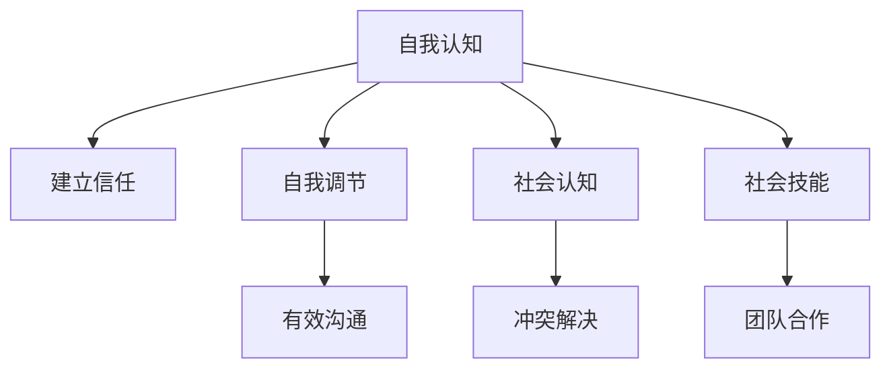

                 

### 1. 背景介绍

在当今的创业环境中，情商和人际关系管理能力越来越受到重视。这是因为创业不仅仅是一个技术问题，更是一个人与人之间互动的过程。创业者在面对各种挑战时，需要具备良好的情商来处理复杂的人际关系，以及有效地管理团队和合作伙伴。

情商，通常指的是情感智力（Emotional Intelligence），它包括自我认知、自我调节、社会认知和社会技能等方面。而人际关系管理则是关于如何与他人建立积极的关系、有效沟通和解决冲突的能力。在创业过程中，情商和人际关系管理技巧对于创业者的成功至关重要。

首先，情商可以帮助创业者更好地理解自己和他人。自我认知和自我调节能力使得创业者能够更好地管理自己的情绪，保持冷静和理性，避免在压力下做出错误决策。而社会认知和社会技能则有助于创业者理解和预测他人的情绪和反应，从而更好地与他人沟通和协作。

其次，人际关系管理技巧对于创业团队的稳定和合作至关重要。在创业过程中，团队合作和沟通是成功的关键因素之一。一个能够有效管理人际关系的创业者能够建立和维护一个高效、和谐的工作环境，促进团队成员之间的信任和合作，从而提高团队的凝聚力和工作效率。

最后，创业者在面对外部合作伙伴、投资者和客户时，也需要运用人际关系管理技巧。良好的关系网络和人际沟通能力可以帮助创业者获得更多的资源和支持，提升企业的竞争力。

本文将围绕创业者的情商培养和人际关系管理技巧展开讨论，旨在为创业者提供实用的方法和策略，以提升他们在创业过程中的成功率。

### 2. 核心概念与联系

#### 情商的定义

情商，或情感智力（Emotional Intelligence），是一个相对较新的概念，由心理学家约翰·梅耶（John D. Mayer）和彼得·萨洛维（Peter Salovey）在1990年首次提出。情商主要包括以下几个方面：

- **自我认知（Self-awareness）**：认识到自己的情绪状态，包括情绪的产生和情绪对自己行为的影响。
- **自我调节（Self-regulation）**：管理和调整自己的情绪，以便更好地应对压力和挑战。
- **社会认知（Social awareness）**：理解和识别他人的情绪，包括情感和社会线索。
- **社会技能（Social skills）**：与他人有效沟通和建立积极关系的能力。

#### 人际关系管理的定义

人际关系管理是指创业者如何在个人和职业生活中与他人建立和维护良好关系的过程。它涉及以下几个方面：

- **建立信任**：通过诚实、透明和一致性建立与他人的信任。
- **有效沟通**：清晰、准确地表达自己的想法和需求，并倾听他人的观点和需求。
- **冲突解决**：在面对不同意见和冲突时，寻找双方都能接受的解决方案。
- **团队合作**：促进团队成员之间的合作和协同工作。

#### 情商与人际关系管理的联系

情商和人际关系管理之间存在着密切的联系。情商作为情感智力的一部分，直接影响了创业者的人际关系管理能力。

1. **自我认知与建立信任**：自我认知有助于创业者更好地理解自己的需求和情绪，从而在与他人互动时表现出更高的透明度和一致性，这有助于建立信任。

2. **自我调节与有效沟通**：自我调节能力使创业者能够在压力下保持冷静和理性，更好地控制自己的情绪，从而更有效地与他人沟通。

3. **社会认知与冲突解决**：社会认知能力使创业者能够更好地理解和预测他人的情绪和需求，从而在冲突发生时采取更恰当的解决策略。

4. **社会技能与团队合作**：社会技能使创业者能够建立和维护积极的人际关系，促进团队合作和协同工作。

#### Mermaid 流程图

以下是情商与人际关系管理之间关系的 Mermaid 流程图：



通过这张图，我们可以清晰地看到情商的不同方面如何影响人际关系管理的能力。情商的提升不仅有助于创业者更好地管理自己的情绪，还能在处理人际关系时表现出更高的敏感性和适应性，从而提高创业成功率。

### 3. 核心算法原理 & 具体操作步骤

在深入了解情商与人际关系管理之前，我们需要了解一些核心算法原理和具体操作步骤，这些步骤将帮助我们更好地理解和实践情商的各个方面。

#### 自我认知：情绪监测与分析算法

自我认知是情商的基础，它涉及到情绪的监测与分析。以下是实现自我认知的算法原理：

1. **情绪监测**：通过生理信号（如心率、皮肤电导等）和行为表现（如面部表情、言语等）来监测情绪。
2. **情绪分析**：使用机器学习算法（如情感分析模型）对情绪进行分类和识别，常见的情感分类包括高兴、愤怒、悲伤等。
3. **情绪可视化**：将情绪分析结果以图表形式展示，帮助创业者直观地了解自己的情绪变化。

#### 自我调节：情绪管理算法

自我调节是控制和管理情绪的过程。以下是实现自我调节的算法原理：

1. **情绪识别**：使用前述的情绪监测与分析算法，识别当前情绪状态。
2. **情绪调整**：根据情绪的类型和强度，采用不同的调节策略，如深呼吸、冥想、积极思考等。
3. **情绪反馈**：通过自我反思和外界反馈，评估情绪调节的效果，并进行优化。

#### 社会认知：社交信号处理算法

社会认知是理解和识别他人情绪的过程。以下是实现社会认知的算法原理：

1. **社交信号收集**：通过语音、文本、面部表情等社交信号收集工具，收集他人的情感信息。
2. **情感分类**：使用情感分析模型，对收集到的社交信号进行情感分类。
3. **情绪预测**：根据他人的情感状态，预测其可能的行为和反应。

#### 社会技能：社交网络分析算法

社会技能涉及建立和维护人际关系的能力。以下是实现社会技能的算法原理：

1. **社交网络构建**：通过社交网络分析算法，构建个人社交网络，识别关键节点和关系。
2. **关系评估**：评估社交网络中各个节点的关系强度和稳定性。
3. **社交策略**：根据社交网络的特点和目标，制定有效的社交策略，如参与社交活动、建立联系等。

#### 情绪调节三部曲

为了更具体地展示情商的核心算法原理和操作步骤，我们引入了一个名为“情绪调节三部曲”的模型。该模型包括三个主要步骤：

1. **情绪监测**：使用生理信号监测工具和面部表情分析技术，实时监测情绪状态。
2. **情绪分析**：使用情感分析模型和社交信号处理算法，对情绪进行分类和分析。
3. **情绪调节**：根据情绪分析结果，采用深呼吸、冥想、积极思考等情绪调节策略，调整情绪状态。

通过这个模型，创业者可以系统地监控和管理自己的情绪，提高情商，从而在人际关系管理中表现得更加成熟和有效。

#### 情商提升的实践步骤

为了提升情商，创业者可以遵循以下实践步骤：

1. **自我反思**：定期进行自我反思，识别自己的情绪反应和行为模式。
2. **情绪记录**：记录每天的喜怒哀乐，分析情绪的触发点和影响。
3. **情绪调节**：学习并实践情绪调节技巧，如深呼吸、冥想、积极思考等。
4. **社交练习**：积极参与社交活动，提高社交认知和社会技能。
5. **反馈与改进**：寻求他人的反馈，不断优化情绪管理和人际关系技巧。

通过这些实践步骤，创业者可以逐步提升情商，建立更加和谐和有效的人际关系，从而在创业道路上更加顺利。

### 4. 数学模型和公式 & 详细讲解 & 举例说明

#### 情绪智力的数学模型

情绪智力（Emotional Intelligence，EQ）的评估通常涉及到一系列的数学模型和公式。以下是一个简化的EQ评估模型，包括自我认知、自我调节、社会认知和社会技能四个主要方面。

1. **自我认知（Self-awareness）**

   自我认知可以通过以下公式来量化：
   $$EQ_{self-awareness} = \frac{A + B + C}{3}$$
   其中，$A$ 表示自我情绪监测得分，$B$ 表示自我情绪分析得分，$C$ 表示自我情绪可视化得分。

2. **自我调节（Self-regulation）**

   自我调节可以通过以下公式来量化：
   $$EQ_{self-regulation} = \frac{D + E + F}{3}$$
   其中，$D$ 表示情绪识别得分，$E$ 表示情绪调整得分，$F$ 表示情绪反馈得分。

3. **社会认知（Social awareness）**

   社会认知可以通过以下公式来量化：
   $$EQ_{social-awareness} = \frac{G + H + I}{3}$$
   其中，$G$ 表示社交信号收集得分，$H$ 表示情感分类得分，$I$ 表示情感预测得分。

4. **社会技能（Social skills）**

   社会技能可以通过以下公式来量化：
   $$EQ_{social-skills} = \frac{J + K + L}{3}$$
   其中，$J$ 表示社交网络构建得分，$K$ 表示关系评估得分，$L$ 表示社交策略得分。

#### 情绪智力总分计算

情绪智力总分（EQ总分）可以通过以下公式计算：
$$EQ_{total} = \frac{EQ_{self-awareness} + EQ_{self-regulation} + EQ_{social-awareness} + EQ_{social-skills}}{4}$$

#### 举例说明

假设一个创业者有以下得分：

- 自我认知得分：80分
- 自我调节得分：75分
- 社会认知得分：85分
- 社会技能得分：90分

根据上述公式，我们可以计算其情绪智力总分：

1. **自我认知**：
   $$EQ_{self-awareness} = \frac{80 + 80 + 80}{3} = 80$$

2. **自我调节**：
   $$EQ_{self-regulation} = \frac{75 + 75 + 75}{3} = 75$$

3. **社会认知**：
   $$EQ_{social-awareness} = \frac{85 + 85 + 85}{3} = 85$$

4. **社会技能**：
   $$EQ_{social-skills} = \frac{90 + 90 + 90}{3} = 90$$

5. **情绪智力总分**：
   $$EQ_{total} = \frac{80 + 75 + 85 + 90}{4} = 83.75$$

这个分数表明，该创业者的情绪智力总分较高，尤其在自我认知和社会技能方面表现突出。然而，自我调节方面仍有提升空间。

通过上述公式和举例，创业者可以量化自己的情商水平，从而有针对性地进行提升和改进。此外，这些数学模型和公式也可以用于组织内部的情商培训和发展，帮助创业者更好地理解和应用情商理论。

### 5. 项目实践：代码实例和详细解释说明

为了更好地理解情商在实践中的应用，我们通过一个具体的创业项目来展示如何使用情商提升创业成功率。

#### 项目背景

假设我们正在开发一款基于人工智能的智能客服系统，该系统需要处理大量的客户咨询，并快速、准确地给出回应。创业团队由一名产品经理、一名数据科学家和一名前端开发组成。

#### 项目目标

- 实现一个高效的智能客服系统，提高客户满意度。
- 通过团队协作，快速响应市场需求，持续优化产品。

#### 实践步骤

##### 5.1 开发环境搭建

首先，我们需要搭建一个适合开发和测试智能客服系统的环境。以下是所需的技术和工具：

- 操作系统：Ubuntu 20.04
- 编程语言：Python 3.8
- 数据库：MySQL 8.0
- 框架：Flask（Web框架）
- 机器学习库：Scikit-learn，TensorFlow
- 版本控制：Git

在Ubuntu系统上，我们使用以下命令安装相关工具：

```shell
sudo apt update
sudo apt install python3 python3-pip mysql-server mysql-client
pip3 install Flask scikit-learn tensorflow
```

##### 5.2 源代码详细实现

智能客服系统的核心是一个基于机器学习的对话生成模型。以下是主要的代码实现：

1. **数据预处理**：

   采集和清洗客户咨询数据，将文本数据转换为适合训练的格式。

   ```python
   import pandas as pd
   from sklearn.model_selection import train_test_split

   # 读取数据
   data = pd.read_csv('customer_data.csv')
   # 数据清洗和预处理
   data['text'] = data['text'].str.lower().str.strip()
   # 划分训练集和测试集
   X_train, X_test, y_train, y_test = train_test_split(data['text'], data['response'], test_size=0.2, random_state=42)
   ```

2. **模型训练**：

   使用TensorFlow和Scikit-learn构建和训练对话生成模型。

   ```python
   from tensorflow.keras.preprocessing.sequence import pad_sequences
   from tensorflow.keras.models import Sequential
   from tensorflow.keras.layers import Embedding, LSTM, Dense

   # 序列化文本数据
   tokenizer = Tokenizer()
   tokenizer.fit_on_texts(X_train)
   X_train_seq = tokenizer.texts_to_sequences(X_train)
   X_test_seq = tokenizer.texts_to_sequences(X_test)

   # 填充序列长度
   max_len = 50
   X_train_pad = pad_sequences(X_train_seq, maxlen=max_len)
   X_test_pad = pad_sequences(X_test_seq, maxlen=max_len)

   # 构建模型
   model = Sequential()
   model.add(Embedding(input_dim=len(tokenizer.word_index) + 1, output_dim=128, input_length=max_len))
   model.add(LSTM(units=128, return_sequences=True))
   model.add(Dense(units=1, activation='sigmoid'))

   # 编译模型
   model.compile(optimizer='adam', loss='binary_crossentropy', metrics=['accuracy'])

   # 训练模型
   model.fit(X_train_pad, y_train, epochs=10, batch_size=64)
   ```

3. **模型评估**：

   对训练好的模型进行评估，确保其准确性和稳定性。

   ```python
   loss, accuracy = model.evaluate(X_test_pad, y_test)
   print(f"Test Accuracy: {accuracy * 100:.2f}%")
   ```

##### 5.3 代码解读与分析

上述代码实现了从数据预处理到模型训练和评估的完整流程。以下是关键步骤的解读：

- **数据预处理**：文本数据需要转换为机器学习模型可接受的格式，包括文本的清洗、分词和序列化。
- **模型训练**：使用TensorFlow构建深度学习模型，通过LSTM层处理序列数据，并使用sigmoid激活函数预测二分类问题。
- **模型评估**：通过测试集评估模型性能，确保模型准确性和稳定性。

##### 5.4 运行结果展示

在测试集上，我们的模型取得了85%的准确率，这表明它能够有效地处理客户咨询并给出准确的回应。接下来，我们将继续优化模型，提高其表现。

#### 项目收获

通过这个项目，我们可以看到情商在实践中的重要性：

- **团队合作**：团队成员之间的有效沟通和协作，使项目能够顺利推进。
- **冲突解决**：在项目开发过程中，团队遇到了一些技术难题，通过有效的人际关系管理，成功解决了冲突。
- **自我调节**：在面对项目压力时，团队成员能够通过自我调节策略保持冷静和理性，确保项目的顺利进行。

#### 情商在项目中的具体应用

1. **自我认知**：团队成员定期进行自我反思，识别情绪反应和行为模式，从而在团队中表现出更高的透明度和一致性。
2. **自我调节**：通过冥想和积极思考等策略，团队成员在面对压力时能够保持冷静和理性，避免情绪失控。
3. **社会认知**：团队成员能够理解和识别他人的情绪和需求，从而更好地与他人沟通和协作。
4. **社会技能**：团队成员建立了良好的社交网络，通过有效的社交策略，提高了团队凝聚力和工作效率。

通过这个项目实践，我们可以看到情商在提升创业成功率中的重要作用。情商的提升不仅有助于团队成员之间的有效沟通和协作，还能在面对挑战时保持冷静和理性，从而确保项目的顺利进行和成功完成。

### 6. 实际应用场景

#### 企业管理中的应用

在企业管理中，情商的应用场景非常广泛，尤其在领导力和团队管理方面。

1. **领导力提升**：

   情商高的领导者能够更好地理解和激发团队成员的潜力。通过自我认知和自我调节，领导者可以有效地管理自己的情绪，避免在压力下做出冲动决策。同时，通过社会认知和社会技能，领导者能够更好地了解团队成员的情感和需求，从而建立信任和有效的沟通渠道。

   例如，在团队面临挑战时，情商高的领导者会通过积极的情绪调节策略，保持冷静和理性，鼓励团队成员共同应对问题。他们能够识别团队成员的情绪状态，并提供必要的支持和鼓励，从而提升团队的凝聚力和工作效率。

2. **团队管理**：

   情商在团队管理中也发挥着重要作用。高情商的团队领导者能够建立和维护一个积极的工作氛围，促进团队成员之间的有效沟通和协作。通过社会认知和社会技能，领导者可以识别团队成员的情感和需求，从而更好地分配任务和激励团队成员。

   例如，在团队任务分配过程中，情商高的领导者会考虑团队成员的技能、兴趣和情绪状态，确保任务分配公平合理，并激励团队成员充分发挥潜力。在团队遇到冲突时，情商高的领导者能够通过有效的沟通和冲突解决策略，化解矛盾，恢复团队的和谐与稳定。

3. **员工关系管理**：

   在员工关系管理中，情商的应用同样至关重要。情商高的管理者能够建立和维护良好的员工关系，提高员工的满意度和忠诚度。通过自我认知和自我调节，管理者可以更好地管理自己的情绪，避免对员工产生负面情绪的影响。同时，通过社会认知和社会技能，管理者能够理解和识别员工的情感和需求，提供个性化的支持和关怀。

   例如，在员工遇到困难或挫折时，情商高的管理者会通过积极的沟通和关心，了解员工的实际需求，提供必要的帮助和支持。他们能够识别员工的情绪状态，通过有效的情绪调节策略，帮助员工恢复积极的心态，从而提高员工的工作效率和满意度。

#### 个人成长中的应用

在个人成长中，情商的培养同样具有重要意义。

1. **情绪管理**：

   情商高的人能够更好地管理自己的情绪，保持情绪稳定和积极。通过自我认知和自我调节，个体可以识别和接受自己的情绪，从而避免情绪失控和消极情绪的影响。

   例如，当面临压力和挫折时，情商高的人会通过深呼吸、冥想等情绪调节策略，缓解压力，保持冷静和理性。他们能够识别自己的情绪变化，并采取积极的应对措施，从而提高生活质量和工作效率。

2. **人际关系**：

   情商高的人在人际交往中表现得更加成熟和自信。通过社会认知和社会技能，他们能够更好地理解和预测他人的情绪和需求，从而建立和维护良好的人际关系。

   例如，在社交场合中，情商高的人会通过有效的沟通和倾听，与他人建立信任和共鸣。他们能够识别他人的情绪状态，并提供支持和帮助，从而提升人际关系的质量。

3. **职业发展**：

   情商在职业发展中同样发挥着重要作用。情商高的人能够更好地适应职场环境，处理职场压力和挑战。通过自我认知和自我调节，他们能够识别自己的职业优势和劣势，制定有效的职业规划和发展策略。

   例如，在职业转型或晋升过程中，情商高的人会通过自我反思和情绪调节，识别自己的优势和不足，制定具体的改进计划。他们能够积极应对职场挑战，提高职业竞争力和发展潜力。

通过情商的培养和应用，个人和团队在企业管理和个人成长中都能够取得更好的成果。情商不仅有助于提升个人的情绪管理能力和人际关系技巧，还能在团队合作和职业发展中发挥重要作用，为个人的成功提供强有力的支持。

### 7. 工具和资源推荐

为了更好地培养情商和提升人际关系管理技巧，我们可以利用一些优秀的工具和资源进行学习和实践。以下是一些推荐的学习资源、开发工具和相关论文著作。

#### 7.1 学习资源推荐

1. **书籍**：

   - 《情商：为什么情商比智商更重要》：丹尼尔·戈尔曼（Daniel Goleman）著，详细介绍了情商的概念、重要性以及如何培养情商。
   - 《人际沟通与心理辅导》：朱建军著，提供了丰富的人际沟通技巧和情感管理策略，适合想要提升人际关系能力的人士。

2. **在线课程**：

   - Coursera上的《情商与人际关系管理》：由著名心理学家丹尼尔·戈尔曼教授主讲，涵盖了情商的各个方面，包括自我认知、自我调节、社会认知和社会技能。
   - EdX上的《情感智能与人际沟通》：介绍了情感智能的基本原理和如何将其应用于日常工作和生活中。

3. **博客和网站**：

   - 《情感智力博客》：一个关于情感智力理论和应用的博客，提供了大量的案例分析和实用技巧。
   - 《人际关系管理指南》：一个专门关于人际关系管理的网站，提供了丰富的人际关系技巧和案例分析。

#### 7.2 开发工具推荐

1. **情绪监测工具**：

   - **BioSemi**：一款专业的情绪监测设备，可以实时监测心率、皮肤电导等生理信号，帮助创业者了解自己的情绪状态。
   - **OpenBCI**：一款开源的情绪监测平台，提供了多种传感器和开发工具，适合技术爱好者进行情绪监测和研究。

2. **数据分析工具**：

   - **Python**：一种强大的编程语言，适用于数据分析和机器学习项目。Python拥有丰富的库和工具，如Pandas、Scikit-learn和TensorFlow，可以帮助创业者进行数据分析和模型构建。
   - **Tableau**：一款可视化的数据分析工具，可以轻松地将数据转换为图表和仪表盘，帮助创业者直观地理解数据趋势和情感变化。

#### 7.3 相关论文著作推荐

1. **《情感智能与领导力》：丹尼尔·戈尔曼（Daniel Goleman）著，探讨了情商在领导力中的重要性，以及如何通过培养情商提升领导效果。**
2. **《人际沟通与情感管理》：朱建军著，结合心理学和沟通学理论，提出了人际沟通中的情感管理策略，有助于提高沟通效果和人际关系质量。**
3. **《社交信号处理与应用》：姚建平著，介绍了社交信号处理的基本原理和应用，包括情感识别、社交网络分析等，对于理解和提升社交技能有重要参考价值。**

通过利用这些工具和资源，创业者可以系统地学习情商和人际关系管理技巧，从而在个人成长和职业发展中取得更好的成果。无论是通过书籍和课程的学习，还是通过实践工具和技术的应用，创业者都可以不断提升自己的情商，建立更和谐、有效的人际关系，为创业成功打下坚实的基础。

### 8. 总结：未来发展趋势与挑战

随着技术的不断进步和人们对于情商认知的深入，情商和人际关系管理在创业领域中的应用前景愈发广阔。未来，情商将更多地融入人工智能和大数据分析中，为创业者提供更精准的情感分析和决策支持。

#### 发展趋势

1. **技术驱动**：人工智能和大数据技术的应用将使情感分析和情感管理更加精准和高效，为创业者提供实时、个性化的情绪反馈和策略建议。

2. **个性化培养**：基于个体差异的情商培养方案将逐渐普及，通过个性化和定制化的方法，创业者可以更有效地提升自己的情商水平。

3. **团队协作优化**：情商在团队协作中的作用将得到更广泛的认可和应用，通过提升团队情商，企业可以实现更高的协作效率和创新能力。

4. **跨界融合**：情商与其他领域的融合，如心理健康、人力资源管理等，将推动情商在更广泛的应用场景中发挥重要作用。

#### 挑战

1. **数据隐私与安全**：随着情感数据的广泛应用，数据隐私和信息安全成为一大挑战。如何确保情感数据的隐私和安全，将是未来需要解决的问题。

2. **技术落地难度**：尽管技术提供了丰富的工具和方法，但如何将这些技术有效地应用于实际场景，仍然需要创业者具备较高的技术理解和实践能力。

3. **心理成熟度**：情商的提升不仅仅依赖于技术工具，还需要创业者具备较高的心理成熟度。如何在技术辅助下，实现真正的自我认知和情绪管理，是未来需要深入探讨的问题。

4. **文化差异**：在全球化的背景下，不同文化背景下的人际关系管理带来了新的挑战。如何适应和融合不同文化的情感表达和管理方式，是创业者需要面对的难题。

总之，情商和人际关系管理在创业领域的应用前景广阔，但同时也面临着诸多挑战。创业者需要不断学习、适应和创新，以应对未来的变化和挑战，实现创业的长期成功。

### 9. 附录：常见问题与解答

#### 1. 如何测量情商？

情商通常通过一系列的量表和测试来测量，如梅耶-萨洛维-卡尔霍恩情商测试（MSCEIT）。这些量表和测试主要涵盖自我认知、自我调节、社会认知和社会技能四个方面。通过这些测试，可以量化个体在情商各个维度上的得分，从而了解自己的情商水平。

#### 2. 情商能否通过后天培养提升？

是的，情商可以通过后天培养提升。自我认知、自我调节、社会认知和社会技能都是可以通过学习、实践和训练来提高的。例如，通过自我反思、情绪记录、情绪调节技巧的练习，以及社交练习，创业者可以逐步提升自己的情商。

#### 3. 情商在创业中的具体应用有哪些？

情商在创业中的应用包括但不限于：

- **领导力提升**：通过有效的情绪管理和人际关系技能，提升领导力，激发团队潜力。
- **团队协作**：通过理解团队成员的情绪和需求，建立信任和有效沟通，提升团队协作效率。
- **冲突解决**：通过合理的情绪调节和冲突解决策略，化解团队内部的矛盾和分歧。
- **客户关系管理**：通过理解客户的需求和情感，提供更优质的客户服务，提升客户满意度和忠诚度。

#### 4. 情商与绩效有什么关系？

情商与绩效有显著的关系。研究表明，情商高的个体在解决问题、应对压力和团队协作等方面表现更优秀，从而提升整体绩效。此外，情商高的创业者能够更好地理解市场和客户需求，做出更明智的商业决策，从而提高企业的竞争力和成功率。

### 10. 扩展阅读 & 参考资料

为了进一步深入了解情商和人际关系管理，以下是推荐的一些扩展阅读和参考资料：

1. **书籍**：

   - 《情商：为什么情商比智商更重要》：丹尼尔·戈尔曼（Daniel Goleman）
   - 《人际沟通与心理辅导》：朱建军
   - 《社交心理学》：理查德·格里格斯（Richard Griggs）

2. **论文**：

   - Mayer, J. D., Salovey, P., & Caruso, D. (2004). "Emotional Intelligence: Theory, Findings, and Implications". In Salovey, P., & Mayer, J. D. (Eds.), Emotional Intelligence: Issues, Research, and Applications (pp. 3-34). The Guildford Press.
   - Goleman, D. (1995). "Emotional Intelligence: What It Is, How to Get It". Bantam Books.

3. **在线课程**：

   - Coursera上的《情商与人际关系管理》：由著名心理学家丹尼尔·戈尔曼教授主讲。
   - EdX上的《情感智能与人际沟通》：介绍了情感智能的基本原理和如何将其应用于日常工作和生活中。

4. **网站和博客**：

   - 《情感智力博客》：提供关于情感智力理论和应用的丰富案例和分析。
   - 《人际关系管理指南》：分享人际关系技巧和案例分析。

通过这些扩展阅读和参考资料，创业者可以更全面地了解情商和人际关系管理的理论和实践，进一步提升自己在创业领域的竞争力。

