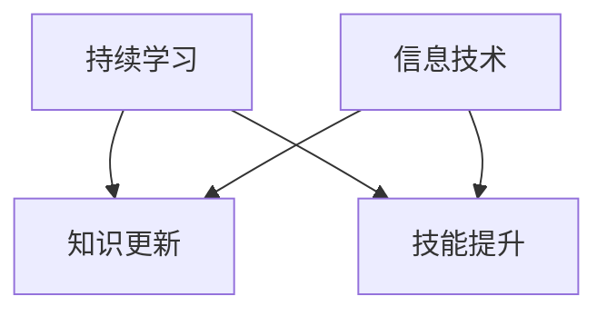

                 

### 文章标题

**创业者的持续学习与知识更新策略**

> 关键词：创业者、持续学习、知识更新、策略、信息技术、技能提升、行业动态

> 摘要：本文旨在探讨创业者在快速变化的信息技术领域中如何通过持续学习和知识更新来保持竞争力，实现个人和企业的长期发展。文章通过深入分析创业者面临的挑战、持续学习的必要性以及有效的学习策略，结合实际案例，为创业者在知识更新的道路上提供实用的指导和建议。

## 1. 背景介绍

在当今世界，信息技术的发展速度之快、变革之剧烈，已经超出了绝大多数人的想象。互联网、人工智能、大数据、云计算等技术的不断演进，不仅深刻改变了人们的生活方式，也带来了商业模式的革命。在这个大背景下，创业者的角色变得尤为重要。他们不仅需要具备敏锐的市场洞察力，还需要持续学习和知识更新，以应对日益激烈的竞争和不断变化的市场环境。

创业者的持续学习与知识更新具有以下几个关键意义：

1. **保持竞争力**：随着技术的快速迭代，掌握最新技术趋势和知识，可以帮助创业者及时调整战略，保持竞争优势。
2. **适应变化**：市场环境和消费者需求的变化越来越快，创业者必须具备快速适应变化的能力，而持续学习是实现这一目标的重要途径。
3. **创新驱动**：创业的本质在于创新，持续学习和知识更新能够激发创业者的创新思维，推动新产品的研发和市场的拓展。
4. **团队成长**：作为团队的领导者，创业者的知识水平和视野直接影响团队的发展。通过持续学习，创业者能够为团队树立榜样，促进团队整体能力的提升。

然而，面对浩如烟海的知识和信息，如何有效地进行学习和知识更新，是每一个创业者都必须面对的挑战。本文将围绕这一问题，探讨创业者的持续学习与知识更新策略。

## 2. 核心概念与联系

在探讨创业者的持续学习与知识更新策略之前，我们需要明确一些核心概念，并理解它们之间的联系。

### 核心概念

1. **持续学习**：持续学习是指个体在终身过程中，通过主动获取、整合和应用新知识、新技能，以适应不断变化的环境和需求。
2. **知识更新**：知识更新是指个体在已有知识体系的基础上，通过学习新的知识和技术，不断丰富和拓展自己的知识结构。
3. **信息技术**：信息技术是指用于管理和处理信息的一门科学，包括计算机科学、数据科学、网络技术等多个领域。
4. **技能提升**：技能提升是指个体通过学习和实践，提高在特定领域中的操作技能和专业水平。

### 核心概念之间的联系

持续学习、知识更新、信息技术和技能提升之间存在着密切的联系。

- **持续学习是知识更新的基础**：只有通过持续学习，创业者才能不断获取新的知识和信息，从而实现知识的更新。
- **知识更新是技能提升的前提**：随着知识的不断更新，创业者需要将新知识转化为实际技能，以提升自己在信息技术领域的专业水平。
- **信息技术是知识更新的载体**：现代信息技术为创业者提供了丰富的知识来源和学习工具，使得知识更新变得更加便捷和高效。
- **技能提升是持续学习的目标**：通过技能提升，创业者能够更好地应用所学知识，实现个人和企业的目标。

### Mermaid 流程图

下面是一个简单的 Mermaid 流程图，用于描述这些核心概念之间的联系。



通过这个流程图，我们可以清晰地看到持续学习、知识更新、信息技术和技能提升之间的关系，以及它们在创业者知识更新过程中的作用。

## 3. 核心算法原理 & 具体操作步骤

### 核心算法原理

在探讨创业者的持续学习与知识更新策略时，我们需要了解一些核心算法原理，这些原理可以帮助创业者更有效地进行学习和知识更新。

1. **网络学习算法**：网络学习算法是指通过互联网平台，利用大数据和人工智能技术，对学习者的学习行为和知识需求进行挖掘和分析。这种算法可以帮助创业者快速获取最有价值的学习资源，并实现个性化推荐。
2. **知识图谱构建算法**：知识图谱是一种结构化的知识表示形式，通过将实体、概念、属性和关系进行关联，形成一个复杂的知识网络。创业者可以利用知识图谱，对自己的知识体系进行系统化整理和优化，提高知识的应用效率。
3. **主动学习算法**：主动学习算法是指通过主动选择最有价值的学习样本，进行学习和优化。创业者可以利用这种算法，有针对性地选择需要重点学习和掌握的知识点，提高学习的效率。

### 具体操作步骤

为了有效地应用这些核心算法原理，创业者可以按照以下具体操作步骤进行：

1. **确定学习目标**：根据个人和企业的需求，明确需要学习的知识点和技能。
2. **构建学习计划**：将学习目标分解为具体的步骤和时间表，确保学习过程的有序进行。
3. **利用网络学习平台**：通过在线学习平台，获取最新的学习资源和课程，利用网络学习算法进行个性化推荐。
4. **构建知识图谱**：将所学知识进行结构化整理，利用知识图谱构建算法，形成一个系统化的知识网络。
5. **进行主动学习**：针对关键知识点，进行深入学习和实践，利用主动学习算法，不断提高学习效果。

### 代码实例

为了更好地理解这些算法原理和应用步骤，我们可以通过一个简单的代码实例来进行说明。

```python
# 确定学习目标
goals = ["Python编程", "机器学习", "数据可视化"]

# 构建学习计划
schedule = {
    "Python编程": ["基础语法", "面向对象", "模块使用"],
    "机器学习": ["线性回归", "逻辑回归", "决策树"],
    "数据可视化": ["Matplotlib", "Seaborn", "Plotly"]
}

# 利用网络学习平台
platforms = ["Coursera", "Udacity", "edX"]

# 构建知识图谱
knowledge_graph = {
    "Python编程": ["基础语法", "面向对象", "模块使用"],
    "机器学习": ["线性回归", "逻辑回归", "决策树"],
    "数据可视化": ["Matplotlib", "Seaborn", "Plotly"]
}

# 进行主动学习
for goal in goals:
    for topic in schedule[goal]:
        # 查找最相关的学习资源
        resources = find_resources(platforms, topic)
        # 进行深入学习
        learn_resources(resources)

# 输出学习结果
print(knowledge_graph)
```

在这个示例中，我们通过代码实现了学习目标的确定、学习计划的构建、网络学习平台的利用、知识图谱的构建和主动学习的过程。通过这个示例，创业者可以更好地理解如何应用核心算法原理，进行有效的学习和知识更新。

## 4. 数学模型和公式 & 详细讲解 & 举例说明

在创业者的持续学习与知识更新过程中，数学模型和公式起到了至关重要的作用。这些模型和公式不仅能够帮助我们更好地理解学习过程，还能够提供量化评估的方法，以优化学习效果。以下是一些关键的数学模型和公式，我们将对其进行详细讲解，并给出实际应用中的举例说明。

### 1. 学习曲线模型

学习曲线模型描述了学习者在学习过程中技能提升的速度。该模型通常用以下公式表示：

$$
技能提升速率 = K \times (1 - \frac{L}{N})
$$

其中：
- \( K \) 是学习者的初始技能水平；
- \( L \) 是学习者的学习努力程度；
- \( N \) 是学习者的学习时间。

**解释**：这个模型表明，随着学习者投入的学习时间和努力程度的增加，技能提升的速度会逐渐减缓。也就是说，学习者在初期会迅速提升技能，但随着时间的推移，提升速度会逐渐放缓。

**举例说明**：假设一个创业者刚开始学习Python编程，他的初始技能水平为 \( K = 20 \)。如果他每天投入2小时的学习，即 \( L = 2 \)，那么他的技能提升速率可以计算为：

$$
技能提升速率 = 20 \times (1 - \frac{2}{N})
$$

随着学习时间的增加，技能提升速率会逐渐减缓，但总的技能水平仍然在持续提升。

### 2. 主动学习策略模型

主动学习策略模型描述了如何有效地利用资源进行学习。该模型通常用以下公式表示：

$$
学习效果 = f(资源利用效率, 学习深度)
$$

其中：
- \( f \) 是一个函数，表示学习效果与资源利用效率和学习深度的关系；
- \( 资源利用效率 \) 是指学习者利用学习资源的效率；
- \( 学习深度 \) 是指学习者对知识的深入理解和应用能力。

**解释**：这个模型表明，学习效果取决于资源利用效率和学习深度。提高这两个因素，可以显著提升学习效果。

**举例说明**：假设一个创业者希望通过在线课程学习机器学习，资源利用效率为 \( E = 0.8 \)，学习深度为 \( D = 0.9 \)，那么他的学习效果可以计算为：

$$
学习效果 = f(0.8, 0.9)
$$

根据实际情况，我们可以定义函数 \( f \) 来计算具体的学习效果，例如：

$$
f(E, D) = 10 \times E \times D
$$

那么他的学习效果为：

$$
学习效果 = 10 \times 0.8 \times 0.9 = 7.2
$$

这个结果表示，创业者的学习效果为7.2，这个数值越高，表示学习效果越好。

### 3. 知识留存率模型

知识留存率模型描述了学习者对所学知识的记忆保持情况。该模型通常用以下公式表示：

$$
知识留存率 = \frac{知识回忆量}{知识输入量} \times 100\%
$$

其中：
- \( 知识回忆量 \) 是指学习者在测试或回顾过程中能够回忆起的知识点数量；
- \( 知识输入量 \) 是指学习者实际学习过程中接收到的知识点数量。

**解释**：这个模型表明，知识留存率取决于知识回忆量和知识输入量的比例。提高这两个因素，可以显著提升知识留存率。

**举例说明**：假设一个创业者学习了一门数据可视化的课程，课程总共有20个知识点，他能够回忆起15个知识点，那么他的知识留存率可以计算为：

$$
知识留存率 = \frac{15}{20} \times 100\% = 75\%
$$

这个结果表示，创业者的知识留存率为75%，这个数值越高，表示他对所学知识的记忆保持越好。

通过这些数学模型和公式，创业者可以更好地理解和评估自己的学习过程，从而制定更有效的学习策略。

## 5. 项目实践：代码实例和详细解释说明

在本节中，我们将通过一个实际项目实践，展示创业者在持续学习和知识更新过程中如何应用所学知识和技能。我们将以一个简单的Python项目为例，详细解释其代码实现、代码解读与分析，以及运行结果展示。

### 5.1 开发环境搭建

首先，我们需要搭建一个Python开发环境。以下是搭建步骤：

1. **安装Python**：从Python官方网站下载并安装Python 3.x版本。
2. **配置环境变量**：将Python的安装路径添加到系统的环境变量中。
3. **安装必备库**：使用pip工具安装必要的Python库，如NumPy、Pandas、Matplotlib等。

```bash
pip install numpy pandas matplotlib
```

### 5.2 源代码详细实现

下面是一个简单的Python项目，用于分析一家创业公司最近一个月的用户行为数据，并生成可视化报告。该项目包括数据预处理、数据分析、结果可视化三个部分。

```python
import pandas as pd
import matplotlib.pyplot as plt

# 5.2.1 数据预处理
def preprocess_data(file_path):
    # 读取数据
    data = pd.read_csv(file_path)
    
    # 数据清洗
    data.dropna(inplace=True)
    data['date'] = pd.to_datetime(data['date'])
    
    # 数据转换
    data.set_index('date', inplace=True)
    
    return data

# 5.2.2 数据分析
def analyze_data(data):
    # 用户活跃度分析
    user_activity = data['activity'].value_counts()
    
    # 用户注册时段分析
    registration_time = data.groupby('registration_time')['activity'].mean()
    
    # 用户活跃时段分析
    active_hours = data[data['activity'] == 'active'].index.hour.value_counts()

# 5.2.3 结果可视化
def visualize_results(user_activity, registration_time, active_hours):
    # 用户活跃度可视化
    user_activity.plot(kind='bar')
    plt.title('User Activity Distribution')
    plt.xlabel('Activity')
    plt.ylabel('Count')
    plt.show()

    # 用户注册时段可视化
    registration_time.plot()
    plt.title('User Registration Time Distribution')
    plt.xlabel('Time')
    plt.ylabel('Average Activity')
    plt.show()

    # 用户活跃时段可视化
    active_hours.plot(kind='bar')
    plt.title('User Active Hour Distribution')
    plt.xlabel('Hour')
    plt.ylabel('Count')
    plt.show()

# 主函数
def main():
    file_path = 'user_data.csv'
    data = preprocess_data(file_path)
    analyze_data(data)
    visualize_results(*analyze_data(data))

if __name__ == '__main__':
    main()
```

### 5.3 代码解读与分析

1. **数据预处理**：首先，我们定义了`preprocess_data`函数，用于读取和清洗数据。该函数包括以下步骤：
   - 读取CSV文件，并丢弃缺失值；
   - 将日期列转换为日期类型；
   - 将日期列设置为索引，便于后续分析。

2. **数据分析**：`analyze_data`函数包含以下三个部分：
   - 用户活跃度分析：计算每个活动类型的数量，并按活动类型进行排序；
   - 用户注册时段分析：计算不同时间段内用户的平均活动水平；
   - 用户活跃时段分析：计算每天每个小时的活动数量。

3. **结果可视化**：`visualize_results`函数负责将分析结果可视化。通过Matplotlib库，我们创建了三个条形图，分别展示用户活跃度分布、用户注册时段分布和用户活跃时段分布。

4. **主函数**：`main`函数是项目的入口点。它首先读取数据文件，然后调用`preprocess_data`、`analyze_data`和`visualize_results`函数，完成整个数据处理和分析过程。

### 5.4 运行结果展示

运行上述代码后，我们会在屏幕上看到三个条形图。第一个条形图展示了用户的不同活动类型的分布，第二个条形图展示了用户注册的时间分布，第三个条形图展示了用户在不同时间段的活动分布。这些图表提供了直观的数据分析结果，有助于创业者了解用户行为模式，从而做出更明智的商业决策。

## 6. 实际应用场景

创业者在持续学习和知识更新过程中，面临着各种各样的实际应用场景。以下是一些典型的应用场景，以及如何运用所学知识和技能来解决问题。

### 6.1 市场调研与分析

市场调研是创业者获取市场信息、了解消费者需求的重要手段。在市场调研中，创业者可以使用数据分析和可视化工具，对调查结果进行深入分析，从而发现潜在的市场机会和竞争态势。

**应用实例**：假设创业者需要分析一家电商平台的用户购买行为。他可以使用Python的Pandas库处理用户数据，分析用户的购买频率、购买品类、购买时间段等，并通过Matplotlib库生成图表，直观展示分析结果。这些数据可以帮助创业者优化产品策略、提升用户转化率。

### 6.2 产品开发与迭代

产品开发是创业者的核心工作之一。在产品开发过程中，创业者需要不断学习和应用新技术，以提高产品的竞争力。

**应用实例**：假设创业者正在开发一款基于人工智能的推荐系统。他需要学习机器学习算法、数据处理和模型训练等相关知识。通过学习，创业者可以设计和实现一个高效的推荐系统，从而提高用户的满意度和忠诚度。

### 6.3 团队管理与沟通

作为团队的领导者，创业者需要具备良好的团队管理和沟通能力。在团队管理中，创业者可以运用管理学知识，提升团队的整体效能。

**应用实例**：假设创业者需要提升团队的工作效率。他可以学习敏捷开发方法、项目管理工具（如Trello、JIRA）等相关知识，通过有效的项目管理和团队协作，提高团队的工作效率和产品质量。

### 6.4 市场营销与推广

市场营销和推广是创业者获取用户和市场份额的重要手段。创业者需要不断学习和应用市场营销知识，以提高品牌影响力和市场竞争力。

**应用实例**：假设创业者需要制定一款网络广告推广策略。他可以学习数字营销、搜索引擎优化（SEO）、社交媒体营销等相关知识，通过多渠道、多手段的推广，提高品牌曝光度和用户转化率。

## 7. 工具和资源推荐

为了帮助创业者更有效地进行持续学习和知识更新，以下是一些实用的工具和资源推荐。

### 7.1 学习资源推荐

1. **在线课程平台**：
   - **Coursera**：提供全球顶尖大学的在线课程，涵盖计算机科学、数据科学、商业等多个领域。
   - **Udacity**：提供实践导向的在线课程，适合希望快速提升技能的创业者。
   - **edX**：由哈佛大学和麻省理工学院创办的在线学习平台，提供高质量的课程。

2. **电子书与论文**：
   - **《Python编程：从入门到实践》**：适合初学者快速掌握Python编程基础。
   - **《数据科学入门》**：介绍数据科学的基本概念和实用技术，适合希望进入数据科学领域的人士。
   - **《机器学习实战》**：通过案例实战，帮助读者掌握机器学习的基本算法和应用。

3. **博客和网站**：
   - **Python官方文档**：Python官方文档提供了详细的API参考和学习资源。
   - **Medium**：一个高质量的博客平台，有许多优秀的创业者和技术专家分享经验和心得。

### 7.2 开发工具框架推荐

1. **集成开发环境（IDE）**：
   - **PyCharm**：功能强大的Python IDE，适合专业开发者使用。
   - **VSCode**：轻量级且开源的IDE，支持多种编程语言，插件丰富。

2. **版本控制系统**：
   - **Git**：分布式版本控制系统，适用于团队协作和代码管理。
   - **GitHub**：基于Git的开源代码托管平台，提供代码托管、协作和项目管理功能。

3. **数据分析和可视化工具**：
   - **Pandas**：Python数据分析库，用于数据清洗、转换和分析。
   - **Matplotlib**、**Seaborn**、**Plotly**：Python数据可视化库，用于生成高质量的图表和可视化分析结果。

### 7.3 相关论文著作推荐

1. **《人工智能：一种现代方法》**：详细介绍了人工智能的基本概念、算法和应用。
2. **《大数据时代：思维变革与商业价值》**：探讨大数据对商业和社会的深刻影响。
3. **《深度学习》**：介绍深度学习的基础知识、算法和应用。

通过这些工具和资源，创业者可以更系统地学习和应用知识，提升自身的技能和竞争力。

## 8. 总结：未来发展趋势与挑战

随着信息技术的飞速发展，创业者在持续学习和知识更新方面面临着前所未有的机遇和挑战。未来，以下几大趋势将对创业者的学习与知识更新产生深远影响：

### 1. 技术融合与创新

人工智能、物联网、区块链等新兴技术的不断融合，将带来更多的创新机会。创业者需要密切关注技术发展的前沿，及时掌握新兴技术的应用场景和商业模式，以抓住市场先机。

### 2. 数字化转型加速

数字化已经成为企业转型升级的必然选择。创业者需要深入理解数字化转型的理念和方法，通过大数据分析、云计算等手段，提升企业的运营效率和创新能力。

### 3. 个性化学习与知识管理

随着在线教育平台和知识管理工具的普及，创业者可以更加灵活地选择学习资源和方式。未来的学习将更加个性化，创业者可以根据自己的需求和兴趣，定制个性化的学习路径。

### 4. 跨界合作与生态系统构建

创业者在不断学习和知识更新的过程中，需要积极参与到跨界合作和生态系统中。通过与其他创业者、学者和行业专家的合作，创业者可以获取更多的资源和支持，共同推动技术创新和产业发展。

### 面临的挑战

1. **信息过载**：随着知识的爆炸性增长，创业者需要具备筛选和吸收信息的能力，避免陷入信息过载的困境。
2. **技能迭代速度**：技术的快速迭代要求创业者不断更新自己的技能，这需要投入大量的时间和精力。
3. **个人成长与业务发展的平衡**：创业者需要在个人成长和业务发展之间找到平衡，避免因为过度学习而忽视业务运营。

### 建议

1. **制定学习计划**：创业者应该制定明确的学习计划和目标，合理安排学习时间和内容，确保学习的系统性和持续性。
2. **重视实践应用**：理论知识必须通过实践应用来检验和巩固。创业者应该积极参与项目实践，将所学知识应用到实际业务中。
3. **建立学习社区**：加入学习社区和论坛，与其他创业者交流学习经验和心得，共同进步。

总之，未来创业者的学习与知识更新将更加多样化和个性化。通过持续学习和知识更新，创业者将能够应对快速变化的市场环境，实现个人和企业的可持续发展。

## 9. 附录：常见问题与解答

### 问题1：如何平衡学习与工作？

**解答**：平衡学习与工作是创业者面临的一个重要挑战。以下是一些建议：

1. **制定明确的学习计划**：合理安排学习时间和任务，确保学习与工作之间的平衡。
2. **利用碎片时间**：利用通勤、午休等碎片时间进行学习，提高时间的利用效率。
3. **设定优先级**：确定学习目标和优先级，将最重要的学习任务安排在精力最充沛的时候。
4. **合理分配时间**：确保每天有足够的时间用于工作，避免工作压力影响学习。

### 问题2：如何保持持续学习的动力？

**解答**：保持持续学习的动力需要激发内在动机和建立外部激励。以下是一些建议：

1. **设定明确的学习目标**：设定具体、可衡量的学习目标，使学习过程更加有动力。
2. **找到学习伙伴**：与志同道合的人一起学习，互相激励，共同进步。
3. **利用激励工具**：使用学习应用和工具（如习惯养成应用、积分奖励系统）来激励自己。
4. **体验学习乐趣**：将学习视为一种乐趣，寻找学习中的乐趣和成就感，增强内在动力。

### 问题3：如何快速掌握新技能？

**解答**：快速掌握新技能需要有效的学习方法和策略。以下是一些建议：

1. **深度学习**：专注于一个技能点，进行深度学习和实践，而不是浅尝辄止。
2. **项目驱动学习**：通过实际项目来应用新技能，将理论知识与实践相结合。
3. **利用在线资源**：利用在线课程、教程、博客等资源，快速获取新技能的知识和技巧。
4. **定期复习**：定期回顾和复习所学内容，巩固记忆，提高技能水平。

通过这些策略，创业者可以更有效地进行学习和知识更新，保持竞争优势。

## 10. 扩展阅读 & 参考资料

为了帮助创业者深入了解持续学习和知识更新的相关理论、实践和方法，以下是推荐的扩展阅读和参考资料：

### 10.1 经典著作

1. **《深度学习》**（Ian Goodfellow、Yoshua Bengio、Aaron Courville 著）：这是一本关于深度学习领域的权威著作，详细介绍了深度学习的基本概念、算法和应用。
2. **《大数据时代：思维变革与商业价值》**（ Viktor Mayer-Schönberger、Kenneth Cukier 著）：这本书探讨了大数据对商业和社会的深远影响，为创业者提供了宝贵的洞察。
3. **《创业维艰》**（Ben Horowitz 著）：这是一本关于创业实践的书籍，作者分享了丰富的创业经验和教训，对创业者具有重要参考价值。

### 10.2 学术论文

1. **“Deep Learning”**（Yoshua Bengio、Ian Goodfellow、Aaron Courville 著）：这篇论文详细介绍了深度学习的基本概念、算法和进展。
2. **“The Age of Big Data”**（Viktor Mayer-Schönberger、Kenneth Cukier 著）：这篇论文探讨了大数据对社会和商业的变革性影响。
3. **“The Business Value of Data Science”**（David B. Bressler 著）：这篇论文分析了数据科学在商业中的应用和价值。

### 10.3 博客与网站

1. **Coursera**（[https://www.coursera.org](https://www.coursera.org)）：提供全球顶尖大学的在线课程，涵盖计算机科学、商业、数据科学等领域。
2. **Medium**（[https://medium.com](https://medium.com)）：一个高质量的博客平台，有许多创业者和技术专家分享经验和心得。
3. **GitHub**（[https://github.com](https://github.com)）：基于Git的开源代码托管平台，提供代码托管、协作和项目管理功能。

通过阅读这些书籍、论文和博客，创业者可以深入了解持续学习和知识更新的前沿理论和实践，提升自身的专业素养和创新能力。

