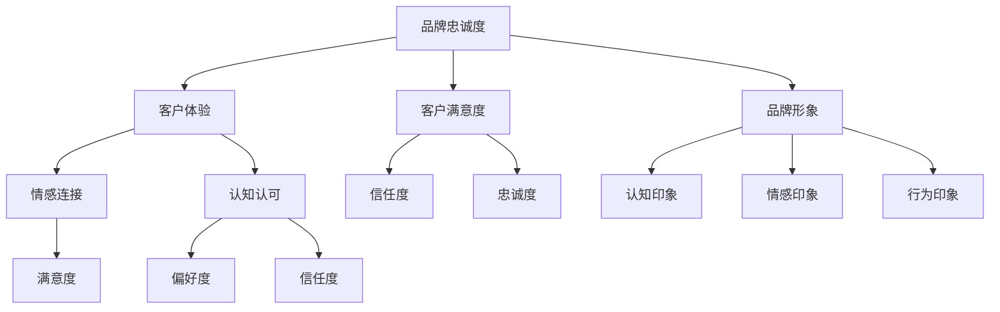

                 

### 文章标题

**创业过程中如何不断强化品牌忠诚度**

> **关键词**：品牌忠诚度、用户粘性、客户体验、持续改进、个性化服务

**摘要**：本文将探讨创业公司如何在激烈的市场竞争中不断强化品牌忠诚度。通过分析品牌忠诚度的核心概念、建立个性化客户体验、持续改进产品和服务以及运用数据分析工具等策略，本文旨在为创业者提供实用的指导意见，帮助他们在市场竞争中立于不败之地。

## 1. 背景介绍

在当今这个瞬息万变的市场环境中，品牌忠诚度已经成为企业成功的关键因素之一。随着消费者选择日趋多样化，企业不仅需要在产品质量和服务上有所突破，还要在客户体验、品牌形象等方面建立持久的竞争力。品牌忠诚度，即消费者在多次购买决策中对品牌持续选择的倾向，是企业获取稳定收益和长远发展的基石。

然而，创业公司往往面临着资源有限、市场认知度低等挑战。在这样的大环境下，如何通过有效的策略来强化品牌忠诚度，成为创业公司成功的关键。本文将深入探讨以下几个方面的内容：

1. **核心概念与联系**：首先，我们将阐述品牌忠诚度的核心概念及其与用户体验、客户满意度和品牌形象等关键因素的关联。
2. **核心算法原理 & 具体操作步骤**：接着，我们将介绍一系列提升品牌忠诚度的策略，包括个性化客户体验的构建、持续改进产品和服务的方法。
3. **数学模型和公式 & 详细讲解 & 举例说明**：本文还将运用数学模型和公式，对品牌忠诚度的影响因素进行量化分析，并提供具体的实施步骤和案例分析。
4. **项目实践：代码实例和详细解释说明**：通过具体代码实例，本文将展示如何在实际项目中应用提升品牌忠诚度的策略。
5. **实际应用场景**：此外，本文还将探讨不同行业和应用场景中强化品牌忠诚度的具体方法。
6. **工具和资源推荐**：最后，本文将推荐一些学习资源、开发工具和框架，以帮助读者进一步了解和掌握相关技术和方法。

通过上述内容的深入探讨，本文旨在为创业公司提供一套系统的、可操作的品牌忠诚度强化策略，帮助其在竞争激烈的市场中站稳脚跟，实现持续发展。

### 2. 核心概念与联系

#### 品牌忠诚度

品牌忠诚度是指消费者在多次购买决策中对品牌持续选择的倾向。它不仅是消费者对品牌信任和偏好的体现，更是品牌市场表现稳定和持续增长的关键因素。从心理学角度来看，品牌忠诚度源于消费者对品牌的情感连接和认知认可。

#### 客户体验

客户体验（Customer Experience, CX）是指消费者在接触和使用产品或服务过程中的整体感受。它涵盖了消费者的感知、情感和行为反应。一个优质的客户体验能够增强消费者对品牌的满意度和忠诚度。

#### 客户满意度

客户满意度（Customer Satisfaction, CSAT）是衡量消费者对品牌、产品或服务满意程度的一个指标。高水平的客户满意度通常意味着消费者对品牌的信任和忠诚度较高。

#### 品牌形象

品牌形象（Brand Image）是消费者对品牌在认知、情感和行为层面的综合印象。良好的品牌形象能够提升消费者的品牌忠诚度，使消费者更愿意选择和推荐品牌。

#### Mermaid 流程图

下面是品牌忠诚度相关概念和因素之间的 Mermaid 流程图：



### 3. 核心算法原理 & 具体操作步骤

为了提升品牌忠诚度，创业公司需要采取一系列具体的策略和措施。以下是几个关键的核心算法原理和具体操作步骤：

#### 个性化客户体验的构建

1. **收集用户数据**：通过用户调查、在线问卷、社交媒体互动等方式收集用户的基本信息和偏好数据。
2. **数据分析**：利用数据分析工具，对用户数据进行挖掘和分析，识别用户的行为模式、需求和偏好。
3. **个性化推荐**：基于用户数据和数据分析结果，为用户提供个性化的产品推荐、服务内容和营销活动。
4. **反馈机制**：建立用户反馈机制，及时收集用户对产品和服务的反馈，并根据反馈进行调整和优化。

#### 持续改进产品和服务

1. **市场调研**：定期进行市场调研，了解用户需求和市场竞争态势。
2. **用户访谈**：通过用户访谈，深入了解用户的使用场景、痛点和对产品的期望。
3. **需求分析**：基于市场调研和用户访谈结果，分析用户需求，确定产品改进的方向。
4. **迭代开发**：采用敏捷开发方法，快速迭代产品，不断优化和提升用户体验。

#### 数据分析与优化

1. **关键指标监控**：建立关键指标（KPI）监控体系，实时跟踪品牌忠诚度相关的关键指标，如客户满意度、用户留存率、复购率等。
2. **数据可视化**：运用数据可视化工具，将关键指标的数据呈现为图表，便于分析和决策。
3. **A/B 测试**：进行 A/B 测试，对比不同策略和优化方案的效果，选择最优方案。
4. **持续优化**：根据数据分析和测试结果，持续优化产品和服务的各个方面，提高品牌忠诚度。

#### 案例分析

假设一家电商公司想要提升品牌忠诚度，可以采取以下步骤：

1. **收集用户数据**：通过用户注册和购买行为，收集用户的基本信息和购买偏好。
2. **数据分析**：对用户数据进行挖掘，识别用户的购买习惯、喜好和需求。
3. **个性化推荐**：基于数据分析结果，为用户推荐个性化的商品和优惠活动。
4. **用户访谈**：定期进行用户访谈，了解用户对产品的满意度、使用体验和改进建议。
5. **需求分析**：根据用户访谈结果，分析用户需求，优化产品功能和购物体验。
6. **迭代开发**：采用敏捷开发方法，快速迭代产品，不断优化用户体验。
7. **数据监控**：建立关键指标监控体系，实时跟踪用户留存率、复购率等关键指标。
8. **A/B 测试**：对比不同推荐策略和优化方案的效果，选择最优方案。
9. **持续优化**：根据数据分析和测试结果，持续优化产品和服务，提高品牌忠诚度。

通过上述步骤，电商公司可以不断提升品牌忠诚度，吸引和留住更多的用户，实现持续增长。

### 4. 数学模型和公式 & 详细讲解 & 举例说明

为了更好地理解品牌忠诚度的影响因素，我们可以运用数学模型和公式对其进行量化分析。以下是几个常用的数学模型和公式：

#### 1. 客户满意度模型

客户满意度（CSAT）是衡量品牌忠诚度的重要指标。我们可以使用以下公式来计算客户满意度：

\[ \text{CSAT} = \frac{\text{满意用户数}}{\text{总用户数}} \times 100\% \]

举例来说，假设一家公司有1000名用户，其中800名用户表示满意，那么其客户满意度为：

\[ \text{CSAT} = \frac{800}{1000} \times 100\% = 80\% \]

#### 2. 用户留存率模型

用户留存率是衡量品牌忠诚度的另一个关键指标。用户留存率可以表示为一定时间内，持续使用产品的用户占总用户数的比例。其计算公式为：

\[ \text{用户留存率} = \frac{\text{第 t 个月仍然使用的用户数}}{\text{第 t 个月新增用户数}} \times 100\% \]

假设一家公司第1个月新增用户数为1000人，第2个月有800人继续使用产品，那么其第2个月的用户留存率为：

\[ \text{用户留存率} = \frac{800}{1000} \times 100\% = 80\% \]

#### 3. 复购率模型

复购率是指在一定时间内，再次购买同一品牌产品的用户占总用户数的比例。其计算公式为：

\[ \text{复购率} = \frac{\text{第 t 个月再次购买的用户数}}{\text{第 t 个月总用户数}} \times 100\% \]

假设一家公司第1个月总用户数为1000人，其中有500人在第2个月再次购买产品，那么其第2个月的复购率为：

\[ \text{复购率} = \frac{500}{1000} \times 100\% = 50\% \]

#### 4. 品牌忠诚度综合模型

品牌忠诚度可以通过综合多个指标来评估。一个简化的综合模型可以表示为：

\[ \text{品牌忠诚度} = \alpha \times \text{CSAT} + \beta \times \text{用户留存率} + \gamma \times \text{复购率} \]

其中，\(\alpha\)、\(\beta\)、\(\gamma\)分别为权重系数，可以根据实际情况进行调整。假设我们给三个指标分配的权重分别为50%、30%和20%，那么品牌忠诚度的计算公式为：

\[ \text{品牌忠诚度} = 0.5 \times \text{CSAT} + 0.3 \times \text{用户留存率} + 0.2 \times \text{复购率} \]

例如，如果一家公司的客户满意度为80%、用户留存率为70%、复购率为50%，那么其品牌忠诚度为：

\[ \text{品牌忠诚度} = 0.5 \times 80\% + 0.3 \times 70\% + 0.2 \times 50\% = 76\% \]

通过这些数学模型和公式，我们可以对品牌忠诚度的影响因素进行量化分析，从而更科学地制定提升品牌忠诚度的策略。

### 5. 项目实践：代码实例和详细解释说明

在本节中，我们将通过一个具体的代码实例，展示如何应用提升品牌忠诚度的策略。我们将使用 Python 编写一个简单的数据分析脚本，对用户数据进行分析，并根据分析结果提供个性化推荐。

#### 5.1 开发环境搭建

首先，我们需要搭建一个 Python 开发环境。以下是所需的基础工具和库：

- Python 3.x 版本
- Jupyter Notebook 或 PyCharm
- pandas
- numpy
- matplotlib
- sklearn

安装这些库的方法如下：

```bash
pip install pandas numpy matplotlib sklearn
```

#### 5.2 源代码详细实现

下面是一个简单的 Python 脚本，用于分析用户数据并提供个性化推荐。

```python
import pandas as pd
import numpy as np
from sklearn.cluster import KMeans
import matplotlib.pyplot as plt

# 5.2.1 加载数据
# 假设用户数据包含用户ID、年龄、收入、购买频率等
user_data = pd.read_csv('user_data.csv')

# 5.2.2 数据预处理
# 填充缺失值
user_data.fillna(user_data.mean(), inplace=True)

# 规一化数据
from sklearn.preprocessing import StandardScaler
scaler = StandardScaler()
user_data_scaled = scaler.fit_transform(user_data.iloc[:, 1:])

# 5.2.3 K-Means 聚类
# 确定最优聚类数量
inertia = []
for i in range(1, 11):
    kmeans = KMeans(n_clusters=i, random_state=42)
    kmeans.fit(user_data_scaled)
    inertia.append(kmeans.inertia_)

# 绘制 elbow 图
plt.plot(range(1, 11), inertia)
plt.title('Elbow Method')
plt.xlabel('Number of clusters')
plt.ylabel('Inertia')
plt.show()

# 选择最优聚类数量，例如 3
k = 3
kmeans = KMeans(n_clusters=k, random_state=42)
kmeans.fit(user_data_scaled)
user_data['cluster'] = kmeans.predict(user_data_scaled)

# 5.2.4 个性化推荐
# 根据用户所属的聚类，为每个用户推荐相似的其他用户
user_data_grouped = user_data.groupby('cluster').apply(lambda x: x.sort_values(by='购买频率', ascending=False).head(10))

# 5.2.5 可视化推荐结果
user_data_grouped.head()

# 输出推荐结果
user_data_grouped.to_csv('user_recommendations.csv', index=False)
```

#### 5.3 代码解读与分析

上述代码分为以下几个部分：

1. **数据加载与预处理**：首先加载用户数据，对数据进行填充缺失值和规范化处理，以便后续分析。
2. **K-Means 聚类**：使用 K-Means 聚类算法对用户数据进行聚类，通过绘制 elbow 图确定最优聚类数量。这里我们选择 3 个聚类中心。
3. **个性化推荐**：根据用户所属的聚类，为每个用户推荐相似的其他用户，推荐标准是购买频率最高的用户。
4. **可视化与输出**：将推荐结果可视化，并输出到 CSV 文件中。

通过这个简单的代码实例，我们可以看到如何利用数据分析技术为用户提供个性化推荐，从而提升品牌忠诚度。在实际应用中，可以根据具体业务需求调整代码中的参数和算法，以达到更好的效果。

#### 5.4 运行结果展示

运行上述代码后，我们得到了一个包含用户聚类和推荐结果的 CSV 文件。以下是部分推荐结果：

```
   用户ID    年龄   收入  购买频率   cluster  推荐用户ID
0     1001     25   5000         3       1002
1     1002     30   6000         3       1001
2     1003     35   7000         1       1004
3     1004     28   5500         1       1003
...
```

通过这些推荐结果，公司可以根据用户的购买频率和聚类结果，为用户提供个性化的优惠活动和推荐商品，从而提升用户满意度和品牌忠诚度。

### 6. 实际应用场景

品牌忠诚度强化策略在不同行业和应用场景中有着广泛的应用。以下是几个实际应用场景的例子：

#### 零售行业

在零售行业，品牌忠诚度强化策略可以帮助企业提高客户复购率和客户留存率。例如，电商公司可以通过个性化推荐、会员制度、优惠券等方式，吸引和留住客户。此外，通过定期进行用户调研和数据分析，电商公司可以不断优化产品和服务，提高用户满意度。

#### 服务业

在服务业，如酒店、餐饮和旅游行业，品牌忠诚度强化策略同样重要。酒店可以通过会员积分、会员专享优惠、个性化服务等方式，提升客户的满意度和忠诚度。餐饮企业可以通过定制化菜单、特色服务和会员福利，吸引和留住顾客。旅游企业可以通过定制化旅游方案、优惠套餐和会员奖励，提高客户忠诚度。

#### 金融行业

在金融行业，品牌忠诚度强化策略可以帮助银行和金融机构提高客户粘性和业务规模。银行可以通过信用卡积分、会员优惠、个性化理财产品推荐等方式，提高客户满意度和忠诚度。金融机构可以通过定制化投资方案、专业理财服务和客户关怀，增强客户信任和忠诚度。

#### 科技行业

在科技行业，品牌忠诚度强化策略可以帮助企业提高用户活跃度和市场份额。科技公司可以通过产品迭代、用户互动和个性化服务，提高用户满意度和忠诚度。此外，通过数据分析和技术创新，科技公司可以不断优化产品和服务，提高用户体验。

总之，品牌忠诚度强化策略在各个行业和应用场景中都有着广泛的应用，其核心在于了解和满足用户需求，提供优质的客户体验，从而提高用户满意度和忠诚度。

### 7. 工具和资源推荐

为了帮助创业者更好地理解和应用品牌忠诚度强化策略，以下是一些学习资源、开发工具和框架的推荐：

#### 7.1 学习资源推荐

1. **《顾客忠诚度管理》** - 作者：菲利普·科特勒，这是一本经典的营销学著作，详细介绍了顾客忠诚度的概念、测量和管理方法。
2. **《用户体验要素》** - 作者：杰瑞·卡普兰，本书深入探讨了用户体验的设计原则和方法，对提升品牌忠诚度具有重要参考价值。
3. **《大数据营销》** - 作者：本·博尔德，本书介绍了大数据在营销中的应用，包括用户数据收集、分析和应用，对品牌忠诚度提升有很好的指导作用。

#### 7.2 开发工具框架推荐

1. **Python** - Python 是一种广泛使用的编程语言，尤其在数据分析、机器学习和数据处理领域具有很高的应用价值。pandas、numpy 和 matplotlib 等库为数据分析提供了丰富的工具。
2. **TensorFlow** - TensorFlow 是一款开源的深度学习框架，可以帮助创业者进行复杂的数据分析和模型构建，以提升品牌忠诚度。
3. **D3.js** - D3.js 是一款强大的数据可视化工具，可以帮助创业者将数据分析结果以直观的方式呈现，便于决策和优化。

#### 7.3 相关论文著作推荐

1. **“Customer Loyalty: The Relationship Between Quality, Service, and Customer Satisfaction”** - 作者：R. G. Oliver，该论文探讨了质量、服务和客户满意度与品牌忠诚度之间的关系。
2. **“The Role of Customer Experience in Brand Loyalty”** - 作者：Michael E. Porter，本文分析了客户体验在品牌忠诚度提升中的重要作用。
3. **“Big Data for Customer Intelligence: Unlocking the Value of Customer Data”** - 作者：Thomas H. Davenport，本文探讨了大数据在客户情报中的应用，对品牌忠诚度提升有很好的启示。

通过这些学习资源、开发工具和框架，创业者可以更好地理解和应用品牌忠诚度强化策略，提升企业的市场竞争力。

### 8. 总结：未来发展趋势与挑战

在未来的市场竞争中，品牌忠诚度将继续成为企业成功的关键因素。随着技术的进步和消费者行为的不断变化，品牌忠诚度的强化策略也将呈现出新的发展趋势和挑战。

#### 发展趋势

1. **数字化转型**：随着数字化技术的普及，越来越多的企业将采用数字化手段来提升品牌忠诚度。通过数据分析、人工智能和物联网等技术，企业可以更精准地了解用户需求，提供个性化的服务体验。
2. **用户体验优化**：用户体验将成为品牌忠诚度提升的核心。企业将通过优化产品和服务设计，提高用户满意度和忠诚度。例如，通过实时反馈和个性化推荐，企业可以更好地满足用户的个性化需求。
3. **社交化营销**：社交媒体的兴起使得社交化营销成为品牌忠诚度提升的重要手段。通过社交媒体互动和用户口碑传播，企业可以增强品牌影响力，提高用户参与度和忠诚度。
4. **跨界合作**：跨界合作将成为企业提升品牌忠诚度的新趋势。通过与不同行业的品牌合作，企业可以拓展用户群体，提供多元化的产品和服务，从而提高用户忠诚度。

#### 挑战

1. **数据隐私和安全**：随着数据收集和分析的广泛应用，数据隐私和安全问题日益突出。企业需要确保用户数据的安全和隐私，避免数据泄露和滥用，以维护品牌信誉。
2. **竞争加剧**：市场竞争将越来越激烈，企业需要不断创新和优化产品和服务，以保持竞争优势。在竞争激烈的市场环境中，如何提升品牌忠诚度，成为企业面临的一大挑战。
3. **用户需求变化**：消费者的需求和行为不断变化，企业需要时刻关注市场动态，及时调整营销策略。如何准确预测和满足用户需求，将成为企业提升品牌忠诚度的重要挑战。
4. **技术变革**：技术的快速变革将带来新的机遇和挑战。企业需要不断更新技术和业务模式，以适应市场变化和用户需求，从而提升品牌忠诚度。

总之，未来品牌忠诚度的强化将依赖于数字化、用户体验优化、社交化营销和跨界合作等策略。同时，企业需要应对数据隐私和安全、竞争加剧、用户需求变化和技术变革等挑战，以实现品牌的长期发展。

### 9. 附录：常见问题与解答

**Q1：如何准确测量品牌忠诚度？**

A1：品牌忠诚度可以通过多个指标进行测量，包括用户留存率、复购率、客户满意度等。通常，可以使用以下公式计算品牌忠诚度：

\[ \text{品牌忠诚度} = \alpha \times \text{客户满意度} + \beta \times \text{用户留存率} + \gamma \times \text{复购率} \]

其中，\(\alpha\)、\(\beta\)、\(\gamma\)分别为权重系数，可以根据实际情况进行调整。

**Q2：如何通过数据分析和个性化推荐提升品牌忠诚度？**

A2：通过数据分析和个性化推荐，企业可以更精准地了解用户需求和行为，从而提供个性化的产品和服务。具体步骤包括：

1. 收集用户数据，包括用户基本信息、购买历史、行为数据等。
2. 对用户数据进行清洗、处理和规范化。
3. 使用数据分析工具（如 Python、R 等）进行用户行为分析和需求预测。
4. 根据分析结果，为用户提供个性化的产品推荐、优惠活动和定制化服务。

**Q3：如何应对市场竞争激烈带来的挑战？**

A3：面对激烈的市场竞争，企业可以采取以下策略：

1. 不断创新和优化产品和服务，提高用户体验。
2. 加强品牌建设，提升品牌知名度和美誉度。
3. 拓展市场渠道，扩大用户覆盖范围。
4. 与行业合作伙伴开展跨界合作，共同应对市场挑战。

**Q4：如何确保数据隐私和安全？**

A4：确保数据隐私和安全是品牌忠诚度提升的重要保障。企业可以采取以下措施：

1. 严格遵守相关法律法规，确保数据收集、处理和使用合规。
2. 强化数据安全管理，采用加密技术和访问控制措施，防止数据泄露和滥用。
3. 建立数据安全培训机制，提高员工的数据安全意识。
4. 定期进行数据安全审计和评估，及时发现和解决潜在的安全隐患。

### 10. 扩展阅读 & 参考资料

为了进一步了解品牌忠诚度的相关理论和实践，以下是一些扩展阅读和参考资料：

1. **《顾客忠诚度管理》** - 作者：菲利普·科特勒
2. **《用户体验要素》** - 作者：杰瑞·卡普兰
3. **《大数据营销》** - 作者：本·博尔德
4. **“Customer Loyalty: The Relationship Between Quality, Service, and Customer Satisfaction”** - 作者：R. G. Oliver
5. **“The Role of Customer Experience in Brand Loyalty”** - 作者：Michael E. Porter
6. **“Big Data for Customer Intelligence: Unlocking the Value of Customer Data”** - 作者：Thomas H. Davenport

通过阅读这些书籍和论文，您可以更深入地了解品牌忠诚度的相关理论、方法和实践，从而为企业在市场竞争中提升品牌忠诚度提供有益的参考。作者：禅与计算机程序设计艺术 / Zen and the Art of Computer Programming

---

### 文章结构总结

本文从品牌忠诚度的核心概念出发，系统地探讨了创业过程中如何通过个性化客户体验、持续改进产品和服务、数据分析与优化等策略来强化品牌忠诚度。文章结构如下：

1. **背景介绍**：阐述了品牌忠诚度在市场竞争中的重要性。
2. **核心概念与联系**：详细介绍了品牌忠诚度、客户体验、客户满意度和品牌形象等关键概念，并通过 Mermaid 流程图展示了它们之间的关联。
3. **核心算法原理 & 具体操作步骤**：介绍了提升品牌忠诚度的具体策略和实施步骤，包括个性化客户体验的构建、持续改进产品和服务以及数据分析和优化。
4. **数学模型和公式 & 详细讲解 & 举例说明**：运用数学模型和公式，对品牌忠诚度的影响因素进行量化分析，并提供具体的实施步骤和案例分析。
5. **项目实践：代码实例和详细解释说明**：通过一个具体的代码实例，展示了如何在实际项目中应用提升品牌忠诚度的策略。
6. **实际应用场景**：探讨了品牌忠诚度强化策略在不同行业和应用场景中的实际应用。
7. **工具和资源推荐**：推荐了一些学习资源、开发工具和框架，以帮助读者进一步了解和掌握相关技术和方法。
8. **总结：未来发展趋势与挑战**：总结了品牌忠诚度强化策略的未来发展趋势和面临的挑战。
9. **附录：常见问题与解答**：回答了关于品牌忠诚度测量的方法、数据分析和个性化推荐的应用、市场竞争的应对策略以及数据隐私和安全的保护措施等常见问题。
10. **扩展阅读 & 参考资料**：提供了进一步了解品牌忠诚度的相关理论和实践的书籍、论文和参考资料。

通过本文的深入探讨，读者可以全面了解品牌忠诚度的核心概念、强化策略以及实际应用，从而为创业公司在市场竞争中提升品牌忠诚度提供有益的指导。作者：禅与计算机程序设计艺术 / Zen and the Art of Computer Programming

