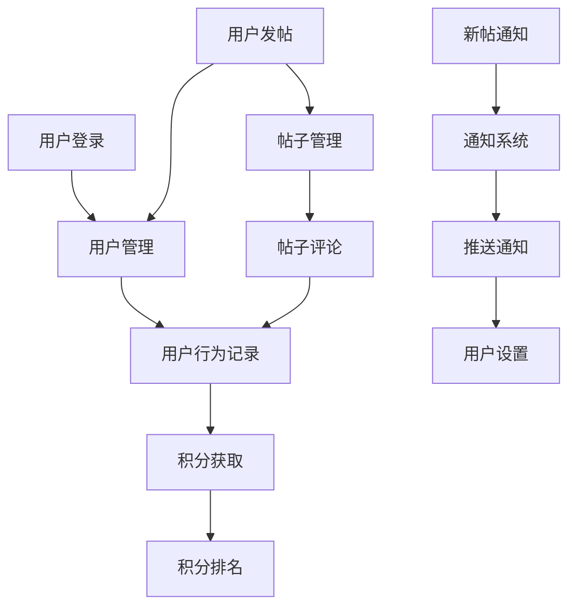

                 

### 1. 背景介绍

开源项目作为现代软件开发的重要模式之一，其核心在于社区合作与共享。开源项目的在线论坛则是这一模式中的重要组成部分，不仅为开发者提供了交流和学习的平台，也是项目可持续发展的关键所在。本文旨在探讨如何创建一个有效的开源项目在线论坛，重点关注社区参与和盈利模式。

开源论坛在开源项目中扮演着至关重要的角色。首先，它是项目成员之间交流的纽带，有助于分享代码、讨论问题和协同工作。其次，它是吸引潜在贡献者的窗口，通过展示项目的活跃度和社区氛围，吸引更多开发者加入。此外，开源论坛还可以帮助项目维护者收集用户反馈，了解用户需求，从而更好地优化项目。

近年来，开源论坛的发展呈现出以下几个趋势：

1. **平台多样化**：从最早的简单论坛系统，发展到如今的各种社交媒体平台、集成开发环境插件、以及专业的论坛软件，如 Discourse、Mattermost 等。
2. **社交化**：开源论坛逐渐采用社交媒体的元素，如点赞、评论、分享等，以提升用户体验和社区活跃度。
3. **专业化**：一些论坛开始专注于特定领域的项目，提供更专业的讨论和技术支持。
4. **商业化**：越来越多的开源论坛开始探索盈利模式，如会员订阅、广告收入等，以保障论坛的长期可持续发展。

本文将首先介绍创建开源项目在线论坛所需的核心概念，包括论坛架构、功能模块和社区管理，然后探讨开源论坛的盈利模式，最后结合实际案例进行分析和总结。希望通过本文，读者能够对创建和管理一个成功开源论坛有更深入的了解。

## 1.1 开源论坛的重要性

开源论坛在开源项目中的重要性不可忽视。首先，它是一个核心的开发交流平台。在开源项目中，开发者需要实时沟通和协作，论坛提供了一个集中式的交流场所，使得开发者在讨论代码问题、分享开发经验、请求技术支持等方面更加方便高效。其次，开源论坛是项目发展的重要助推器。通过论坛，项目团队可以吸引更多的贡献者，扩展项目的影响力，推动项目的持续改进和迭代。

具体来说，开源论坛在以下几方面发挥着关键作用：

### **促进开发协作**

开源论坛使得开发者之间的沟通更加紧密。项目成员可以通过论坛发布任务、讨论代码实现、分享开发经验，解决开发过程中遇到的问题。这种高效的交流机制有助于提高开发效率，确保项目进度和质量。例如，在 Linux 内核开发过程中，论坛是开发者们交流和协作的重要平台，通过论坛，开发者们可以快速解决代码问题，推动内核的持续迭代。

### **吸引更多贡献者**

一个活跃的论坛可以吸引更多的开发者加入开源项目。论坛展示了项目的活跃度和社区氛围，让潜在贡献者感受到项目的活力和团队的凝聚力。例如，Apache基金会旗下的众多开源项目，通过其论坛吸引了大量的开发者参与，不仅扩大了项目的影响力，也推动了项目的持续发展。

### **收集用户反馈**

论坛是收集用户反馈的重要途径。项目维护者可以通过论坛了解用户的需求和意见，从而对项目进行优化和改进。例如，WordPress 论坛吸引了大量用户参与，通过用户的反馈，WordPress 团队不断改进和优化产品，使得 WordPress 成为最受欢迎的内容管理系统之一。

### **增强社区凝聚力**

开源论坛不仅是一个交流平台，也是社区成员的情感纽带。通过论坛，开发者可以分享自己的故事、展示自己的成就，增强社区的归属感和凝聚力。例如，GitHub 在其论坛上设有“GitHub 荣誉榜”，表彰对开源社区有突出贡献的开发者，这种做法极大地增强了社区的凝聚力。

综上所述，开源论坛在开源项目中具有不可替代的重要地位。它不仅促进了开发者的协作，吸引了更多贡献者，收集了用户反馈，还增强了社区的凝聚力，为项目的持续发展提供了坚实的基础。

### 1.2 开源论坛的现状与趋势

随着开源运动的蓬勃发展和互联网技术的不断进步，开源论坛也经历了显著的演变。从最早的简单在线论坛，到如今功能丰富、平台多样化的形式，开源论坛在技术实现、功能设计、用户参与度等方面都有了显著的提升。

### **技术实现**

早期，开源论坛主要是基于简单的论坛系统如 phpBB、vBulletin 等构建。这些系统提供了基本的发帖、回复、论坛管理等功能，但缺乏灵活性和扩展性。随着技术的发展，开源论坛逐渐转向基于现代Web技术的框架和平台，如 Discourse、Mattermost、Flarum 等。这些平台不仅具备丰富的功能模块，还支持高度定制化，能够满足不同类型开源项目的需求。

### **功能设计**

在功能设计方面，开源论坛也经历了从单一功能到多元化功能的演变。早期的论坛主要提供发帖、回复、论坛管理等功能。随着用户需求的增加，论坛开始引入更多功能，如积分系统、社交化元素（点赞、评论、分享）、插件扩展等。例如，Discourse 引入了社交媒体元素，使得用户可以更加便捷地参与论坛讨论。Mattermost 则强调即时沟通和协作，提供了聊天室、视频会议等功能。

### **用户参与度**

用户参与度是衡量一个开源论坛成功与否的重要指标。在过去，论坛的用户参与度主要依赖于项目成员和早期贡献者的活跃度。随着论坛功能的丰富和用户体验的提升，越来越多的开发者、用户开始参与到论坛的讨论和互动中。例如，GitHub 论坛通过其丰富的功能和便捷的操作，吸引了大量的开发者参与讨论和协作，极大地提升了社区活跃度。

### **社区管理**

社区管理是开源论坛持续发展的关键。早期的论坛管理相对简单，主要依靠管理员和版主进行维护。随着论坛规模的扩大，社区管理的复杂性也增加了。现代开源论坛开始引入更完善的社区管理机制，如分级管理、角色权限、自动化工具等。例如，Discourse 提供了详细的权限管理系统，使得管理员可以根据不同角色的职责分配相应的权限，从而提高管理效率和社区秩序。

### **商业化探索**

在商业化方面，开源论坛也在不断探索新的盈利模式。早期的开源论坛主要依赖于赞助、捐赠等方式维持运营。随着互联网广告、会员订阅等商业模式的成熟，越来越多的开源论坛开始探索商业化路径。例如，Mattermost 提供了企业版服务，通过提供额外的商业支持和服务，获得了良好的市场反响。

### **未来展望**

展望未来，开源论坛将继续在技术实现、功能设计、用户参与度等方面进行创新和优化。随着人工智能、大数据等技术的应用，论坛将能够提供更加智能化、个性化的用户体验。同时，开源论坛也将更加注重社区生态的构建，通过多元化的盈利模式，实现可持续的发展。

总之，开源论坛的现状与趋势表明，它已经成为现代开源项目中不可或缺的一环。通过不断的技术创新和功能优化，开源论坛将更好地服务于开发者社区，推动开源项目的持续发展。

### 1.3 开源论坛的发展历程

开源论坛的发展历程可以追溯到互联网初期，当时的开源社区主要通过邮件列表和 Usenet 新闻组进行交流。随着互联网技术的进步和开源运动的兴起，论坛逐渐成为开源项目交流的主要平台。下面我们将详细回顾开源论坛的发展历程，探讨不同阶段的重要里程碑和代表性论坛。

### **早期阶段（1990s-2000s初期）**

在互联网初期，开源项目的交流主要通过邮件列表和 Usenet 新闻组进行。这些平台提供了基本的交流功能，但缺乏集中化和系统化的管理。1994年，最早的Web论坛系统 phpBB 正式发布，标志着开源论坛的诞生。phpBB 提供了用户发帖、回复、论坛管理等基础功能，成为许多开源项目的首选交流平台。与此同时，vBulletin 等其他论坛系统也相继问世，进一步丰富了开源论坛的选择。

### **发展阶段（2000s中期-2010s初期）**

进入21世纪，随着开源项目的迅猛发展，开源论坛的功能和用户体验得到了显著提升。2003年，Discourse 论坛系统诞生，它基于 Ruby on Rails 框架，采用了现代化的Web技术，提供了丰富的功能模块和高度定制化的能力。Discourse 的出现标志着开源论坛进入了一个新的发展阶段，许多知名开源项目如 GitHub、WordPress 等，纷纷采用 Discourse 作为其官方论坛。

### **成熟阶段（2010s中期至今）**

2010年左右，开源论坛的发展进入成熟阶段。在这一阶段，开源论坛不仅提供了基本的交流功能，还引入了更多创新元素。例如，GitHub 在2013年推出了其官方论坛，结合了社交媒体的元素，如点赞、评论、分享等，极大地提升了用户体验和社区活跃度。此外，Mattermost 等即时通讯工具也在这一阶段崭露头角，提供了即时沟通和协作功能，进一步丰富了开源论坛的生态。

### **代表性论坛**

- **phpBB**：作为最早的Web论坛系统之一，phpBB 为许多早期开源项目提供了交流平台，至今仍被广泛使用。
- **vBulletin**：vBulletin 是早期具有影响力的论坛系统之一，提供了强大的论坛管理功能和丰富的插件生态。
- **Discourse**：Discourse 是现代开源论坛的代表性平台，以其丰富的功能模块和高度定制化的能力，深受开发者喜爱。
- **GitHub**：GitHub 论坛结合了社交媒体元素，提供了便捷的开发者交流平台，极大提升了社区活跃度。
- **Mattermost**：Mattermost 是一款专注于团队协作的即时通讯工具，提供了论坛和聊天室等功能，适用于企业级开源项目。

通过回顾开源论坛的发展历程，我们可以看到论坛在技术实现、功能设计、用户参与度等方面不断演进。这些代表性的论坛不仅为开源项目提供了重要的交流平台，也推动了开源社区的繁荣发展。

### 1.4 开源论坛的功能模块

一个功能完善的开源论坛通常包含多个关键模块，这些模块共同协作，为用户提供高效的交流体验，并确保社区的健康和活力。以下是几个核心功能模块及其作用：

### **用户管理系统**

用户管理系统是论坛的基础模块，负责用户注册、登录、权限分配等功能。通过用户管理系统，论坛可以管理用户角色和权限，确保社区的安全和有序。此外，用户管理模块还可以记录用户的行为和贡献，为积分系统和排名提供数据支持。

### **帖子管理系统**

帖子管理系统是论坛的核心功能，负责帖子的创建、编辑、删除、置顶等操作。通过帖子管理系统，用户可以方便地发布技术讨论、问题求助、经验分享等内容。此外，帖子管理系统还支持评论功能，用户可以对帖子进行回复和讨论，增强互动性。

### **通知系统**

通知系统是论坛的另一个重要模块，负责向用户推送动态信息。通过通知系统，论坛可以及时告知用户新的帖子、回复、关注内容等，提高用户的参与度和活跃度。通知系统通常支持多种通知方式，如邮件、短信、弹窗等。

### **积分系统**

积分系统是论坛的一种激励机制，通过给予用户积分，鼓励他们在论坛上积极发言和参与讨论。积分系统可以设置不同的积分规则，如发帖、回复、点赞等，激励用户为社区做出更多贡献。此外，积分系统还可以用于用户排名和荣誉系统，增强用户的归属感和成就感。

### **搜索系统**

搜索系统是论坛的基本功能之一，用户可以通过搜索系统快速找到所需的内容。高效的搜索系统能够提高用户的使用体验，减少查找信息的时间。此外，搜索系统还可以根据用户的搜索历史和偏好，提供个性化搜索结果，增强用户的参与感。

### **插件扩展系统**

插件扩展系统是论坛的灵活性保障，通过插件，论坛可以扩展新的功能模块，满足不同的需求。例如，插件可以提供社交媒体集成、实时聊天、投票功能等。插件扩展系统不仅增强了论坛的灵活性，也促进了社区的多样性和创新。

### **社区管理工具**

社区管理工具包括版主权限、禁止发言、监控违规行为等功能。通过社区管理工具，论坛管理员可以维护社区的秩序，确保讨论的友好和健康。例如，管理员可以通过版主权限分配，指定版主负责特定板块的管理；通过监控违规行为，管理员可以及时发现和处理不良信息。

这些功能模块共同协作，构成了一个功能完善、用户友好的开源论坛。通过不断优化这些模块，论坛可以提升用户体验，增强社区活力，为开源项目的持续发展提供坚实的基础。

### 1.5 开源论坛的架构设计

开源论坛的架构设计对于其性能、可扩展性和用户体验至关重要。一个良好的架构能够确保论坛在处理大量用户请求和帖子数据时依然高效稳定，同时方便后续的扩展和维护。以下是一个典型的开源论坛架构设计，包括前端、后端、数据库以及服务器的选择。

### **前端架构**

前端架构负责论坛的用户界面和交互体验。通常，开源论坛会采用单页应用（SPA）或多页应用（MPA）的模式。单页应用例如使用 React、Vue.js 或 Angular，可以通过Ajax技术实现局部内容的快速更新，提供流畅的用户体验。多页应用则采用传统的HTML、CSS和JavaScript技术，通过页面跳转进行内容切换。

前端架构的核心组件包括：

- **路由管理**：负责页面路由的解析和跳转，例如React Router或Vue Router。
- **状态管理**：用于管理应用的状态，如Vuex或Redux。
- **UI框架**：提供统一的UI组件和样式，如Ant Design或Element UI。

前端架构的选择应根据项目需求、团队技能和开发周期来决定。如果项目需求复杂、迭代频繁，可以选择单页应用，以提高开发效率和用户体验。如果项目较为简单、对性能要求不高，可以选择多页应用。

### **后端架构**

后端架构负责处理用户的请求、数据存储和管理等核心功能。开源论坛的后端架构通常采用微服务架构，将不同的功能模块拆分为独立的微服务，以提高系统的可扩展性和可维护性。常见的后端框架包括：

- **Node.js**：以其轻量级和高效的异步I/O处理能力著称，适合处理高并发请求。
- **Python**：Django 和 Flask 是流行的开源 Web 框架，具有良好的社区支持和丰富的第三方库。
- **Ruby**：Ruby on Rails 是一种流行的全栈 Web 框架，以其快速开发和强大的功能库著称。
- **Java**：Spring Boot 是一种流行的 Java Web 框架，提供了丰富的功能和良好的可扩展性。

后端架构的核心组件包括：

- **API Gateway**：负责统一处理用户的请求，分发到相应的微服务。
- **微服务**：实现具体的功能模块，如用户管理、帖子管理、通知管理等。
- **消息队列**：用于异步处理任务，如邮件通知、消息推送等。

### **数据库选择**

数据库是开源论坛数据存储的核心。根据论坛的需求和规模，可以选择关系型数据库或非关系型数据库。常见的关系型数据库包括 MySQL、PostgreSQL 等，它们具有强大的数据一致性和事务支持。非关系型数据库如 MongoDB、Redis 等，适合处理海量数据和高速缓存。

数据库选择的核心考虑因素包括：

- **数据一致性**：关系型数据库在数据一致性和事务支持方面表现优秀。
- **数据规模和查询性能**：非关系型数据库适合处理海量数据和高速缓存。
- **扩展性和高可用性**：选择支持水平扩展的数据库，如 PostgreSQL 或 MongoDB。

### **服务器选择**

服务器是论坛运行的物理环境。根据论坛的规模和性能需求，可以选择云服务器、物理服务器或混合部署。常见的云服务器包括 AWS、Azure、阿里云等，它们提供了强大的计算资源和网络支持。物理服务器则适合对性能要求极高且需要自维护的场景。

服务器选择的核心考虑因素包括：

- **计算资源**：根据论坛的并发用户数量和计算需求，选择合适的CPU、内存和存储资源。
- **网络带宽**：保证论坛访问的快速和稳定，选择高带宽的网络连接。
- **高可用性**：通过负载均衡和分布式存储等技术，提高论坛的可靠性和可用性。

通过合理的架构设计，开源论坛可以实现高效、稳定、可扩展的性能，为用户提供卓越的交流体验，同时方便后续的扩展和维护。

### 1.6 开源论坛的关键技术与最佳实践

在构建和维护开源论坛的过程中，采用合适的技术和最佳实践是确保其稳定性和高性能的关键。以下是一些关键技术和最佳实践：

### **负载均衡**

负载均衡是将用户请求分配到多个服务器上，以避免单点故障和提高系统处理能力。常用的负载均衡技术包括基于DNS的负载均衡、硬件负载均衡器和软件负载均衡器。例如，使用Nginx或HAProxy等软件负载均衡器，可以有效地分发请求，提高系统的响应速度和处理能力。

### **缓存机制**

缓存机制是通过存储频繁访问的数据，减少数据库的压力，提高系统的响应速度。常用的缓存技术包括内存缓存和分布式缓存。Redis是一个流行的内存缓存系统，可以快速存储和检索数据。使用Redis进行缓存，可以显著降低数据库负载，提高系统的性能。

### **消息队列**

消息队列用于异步处理任务，如邮件通知、消息推送等。RabbitMQ和Kafka等消息队列系统可以确保消息传递的高效和可靠性。通过消息队列，可以将耗时的任务从主线程中分离出来，提高系统的并发处理能力。

### **数据分片**

数据分片是将数据分散存储在多个节点上，以处理海量数据。常用的数据分片技术包括水平分片和垂直分片。水平分片可以将数据按一定规则分布到多个数据库实例上，而垂直分片则将数据按不同的属性分散存储。PostgreSQL和MongoDB等数据库支持水平分片，可以有效地处理海量数据。

### **自动化运维**

自动化运维是通过脚本和工具自动化管理系统的部署、监控和升级等操作。常用的自动化工具包括Ansible、Puppet和Chef等。通过自动化运维，可以减少人为错误，提高运维效率，确保系统的稳定运行。

### **最佳实践**

- **持续集成和持续部署（CI/CD）**：通过CI/CD流程，自动化测试和部署代码，确保软件的持续交付。
- **安全性措施**：定期更新系统软件和依赖库，使用防火墙和加密技术保护用户数据和隐私。
- **性能监控**：使用性能监控工具，如Prometheus和Grafana，实时监控系统的性能和资源使用情况。
- **社区参与**：鼓励社区成员参与论坛维护和改进，通过代码贡献、文档编写和反馈机制，提升论坛的质量和用户体验。

通过采用这些关键技术和最佳实践，开源论坛可以实现高效、稳定和可扩展的性能，为用户提供优质的交流体验。

### 2. 核心概念与联系

在创建和管理一个成功的开源项目在线论坛时，理解并应用一系列核心概念至关重要。这些核心概念包括用户管理系统、帖子管理系统、积分系统和通知系统，它们共同构成了论坛的骨架，确保社区的健康和活力。以下是对这些核心概念及其之间相互关系的详细探讨，并附上一个Mermaid流程图，以直观地展示各模块的互动流程。

#### **用户管理系统**

用户管理系统是论坛的基础模块，负责用户注册、登录、权限分配等功能。用户管理系统的核心作用是确保社区的安全性和有序性，同时提供个性化体验。用户管理系统的功能包括：

- **用户注册与登录**：通过注册表单，新用户可以创建账号。登录功能允许已注册用户访问论坛。
- **权限分配**：管理员可以根据用户的角色（如普通用户、版主、管理员）分配不同的权限，确保社区秩序。
- **用户行为记录**：记录用户在论坛上的活动，如发帖、回复、点赞等，为积分系统和排名提供数据支持。

#### **帖子管理系统**

帖子管理系统是论坛的核心功能，负责帖子的创建、编辑、删除、置顶等操作。帖子管理系统的作用是确保内容的丰富性和社区的活跃度。其主要功能包括：

- **帖子创建与编辑**：用户可以在论坛上发布帖子，分享技术讨论、问题求助、经验分享等内容。
- **评论与回复**：用户可以对帖子进行评论和回复，增强互动性。
- **帖子管理**：管理员可以审核、删除、置顶帖子，确保内容的健康和有序。

#### **积分系统**

积分系统是一种激励机制，通过给予用户积分，鼓励他们在论坛上积极发言和参与讨论。积分系统的核心作用是提升用户活跃度和社区活力。其主要功能包括：

- **积分规则**：设置不同的积分规则，如发帖、回复、点赞等，激励用户为社区做出更多贡献。
- **积分获取与消耗**：用户可以通过完成特定操作获取积分，也可以因违规行为消耗积分。
- **用户排名**：根据用户的积分进行排名，设置荣誉系统，增强用户的归属感和成就感。

#### **通知系统**

通知系统是论坛的重要功能，负责向用户推送动态信息，提高用户的参与度和活跃度。通知系统的核心作用是确保用户及时了解论坛的重要动态。其主要功能包括：

- **动态通知**：推送新的帖子、回复、关注内容等，使用户能够及时了解论坛的新动态。
- **通知方式**：支持邮件、短信、弹窗等多种通知方式，灵活满足用户的需求。
- **通知管理**：用户可以自定义通知设置，选择接收或屏蔽某些类型的通知。

#### **Mermaid流程图**

以下是一个简化的Mermaid流程图，展示了用户管理系统、帖子管理系统、积分系统和通知系统之间的互动流程：



在这个流程图中，用户登录后进入用户管理系统（B），进行用户行为记录（C）和积分获取（D），并根据积分进行排名（E）。用户发帖（F）后进入帖子管理系统（G），用户评论帖子（H）也会被记录到用户行为记录中（C）。同时，新的帖子会通过通知系统（J）推送通知给用户（K），用户可以根据需要调整通知设置（L）。

通过理解并应用这些核心概念和流程，可以构建一个功能完善、用户体验良好的开源论坛，为开发者社区提供高效的交流平台。

### 2.1 用户管理系统

用户管理系统是开源论坛的重要组成部分，它负责用户的注册、登录、权限分配和用户行为记录等功能。一个高效的用户管理系统不仅能够确保社区的安全和有序，还能为用户提供良好的个性化体验。以下是用户管理系统的详细功能及设计思路：

#### **注册和登录**

用户注册和登录是用户管理系统的基础功能。用户注册时需要填写用户名、邮箱、密码等基本信息，并通过验证码或邮件确认激活账号。登录功能允许已注册用户使用用户名和密码访问论坛。

**实现思路**：
1. **注册**：提供用户注册表单，收集用户信息并存储到数据库。使用哈希算法（如SHA-256）加密用户密码。
2. **登录**：验证用户输入的用户名和密码，若匹配则允许登录。可以使用JWT（JSON Web Token）或Session管理用户会话。

#### **权限分配**

权限分配是确保社区有序和安全的重要手段。不同角色的用户拥有不同的权限，例如普通用户可以发帖和回复，而版主和管理员则可以审核、删除和修改帖子。

**实现思路**：
1. **角色定义**：定义用户角色，如普通用户、版主、管理员等。
2. **权限设置**：为每个角色分配不同的权限，如普通用户只有发帖和回复的权限，而版主和管理员可以执行更高级的操作。
3. **权限校验**：在执行特定操作前，校验用户的权限，确保用户只能执行其权限范围内的操作。

#### **用户行为记录**

用户行为记录是积分系统和社区管理的重要数据来源。记录用户在论坛上的活动，如发帖、回复、点赞等，可以用于积分计算、用户排名和社区动态。

**实现思路**：
1. **事件记录**：定义事件类型，如发帖、回复、点赞等，记录每个事件的时间、用户ID和操作对象。
2. **数据存储**：将事件记录存储到数据库中，便于后续查询和分析。
3. **数据聚合**：定期对用户行为数据进行分析，生成用户活跃度报告，用于社区管理和优化。

#### **用户信息管理**

用户信息管理包括用户资料的修改、密码重置、邮箱验证等功能，是提升用户体验的重要部分。

**实现思路**：
1. **资料修改**：允许用户修改个人资料，如头像、签名、职业等。
2. **密码重置**：提供密码重置功能，通过邮箱验证或验证码验证用户身份后，允许用户重置密码。
3. **邮箱验证**：在用户注册或密码重置过程中，通过发送验证邮件来确认用户邮箱。

#### **安全措施**

安全措施是用户管理系统的重要组成部分，确保用户数据的安全和隐私。

**实现思路**：
1. **数据加密**：使用哈希算法加密用户密码，确保密码存储的安全性。
2. **防止SQL注入**：对用户输入进行验证和过滤，防止恶意SQL注入攻击。
3. **身份验证**：使用双因素认证（2FA）等额外安全措施，提高用户账户的安全性。

通过以上功能设计和实现思路，用户管理系统可以为开源论坛提供一个安全、高效、用户友好的基础平台，促进社区的健康发展。

### 2.2 帖子管理系统

帖子管理系统是开源论坛的核心功能，负责管理帖子的创建、编辑、删除、置顶和评论等操作。一个高效的帖子管理系统不仅能够保证内容的丰富性和社区的活跃度，还能提升用户体验。以下是帖子管理系统的详细功能及实现方法：

#### **帖子创建**

帖子创建功能允许用户在论坛上发表新的帖子，分享技术讨论、问题求助或经验分享。

**实现方法**：
1. **表单提交**：提供帖子创建表单，用户填写标题、内容、标签等基本信息，并可以选择附件。
2. **内容验证**：对用户输入的内容进行验证，确保格式正确、不包含敏感信息。
3. **存储帖子**：将帖子信息存储到数据库，包括标题、内容、创建时间、作者ID等。

#### **帖子编辑**

帖子编辑功能允许用户修改已发布的帖子，保持内容的新鲜度和准确性。

**实现方法**：
1. **权限校验**：检查用户是否有编辑权限，例如作者、版主或管理员。
2. **编辑界面**：显示帖子内容，并提供编辑工具，如文本编辑器、图片上传等。
3. **保存修改**：保存用户对帖子的修改，更新数据库中的帖子内容。

#### **帖子删除**

帖子删除功能用于移除不合适的帖子，维护论坛的整洁和安全。

**实现方法**：
1. **权限校验**：检查用户是否有删除权限，例如作者、版主或管理员。
2. **删除操作**：从数据库中移除帖子记录，包括所有相关评论和附件。
3. **日志记录**：记录删除操作，便于后续审计和恢复。

#### **帖子置顶**

帖子置顶功能将重要的帖子提升到首页或特定板块的顶部，以突出显示。

**实现方法**：
1. **权限校验**：检查用户是否有置顶权限，例如版主或管理员。
2. **置顶操作**：更新数据库中的帖子排序字段，将置顶的帖子放置在顶部。
3. **页面展示**：在论坛首页或板块页面中，优先显示置顶帖子。

#### **评论管理**

评论管理功能用于处理用户对帖子的评论，包括评论的创建、编辑、删除和回复。

**实现方法**：
1. **评论创建**：用户可以对帖子进行评论，填写评论内容并提交。
2. **评论编辑**：评论作者或版主可以编辑评论，更新内容或删除评论。
3. **评论删除**：版主或管理员可以删除评论，移除不合适的内容。
4. **回复评论**：用户可以对其他用户的评论进行回复，形成多层次的讨论。

#### **帖子审核**

帖子审核功能用于确保论坛内容的健康和有序，管理员可以对新帖进行审核。

**实现方法**：
1. **审核机制**：管理员可以设置帖子的审核状态，如通过、拒绝、待审核。
2. **审核流程**：新帖发布后，管理员会收到审核通知，审核通过后帖子才可见。
3. **审核记录**：记录审核操作，便于后续审计和问题跟踪。

通过以上功能和实现方法，帖子管理系统可以有效地管理论坛内容，确保社区的活跃度和质量，提升用户的交流体验。

### 2.3 积分系统

积分系统是开源论坛的重要激励机制，通过赋予用户积分，鼓励他们在论坛上积极参与讨论、发布高质量内容，并抑制不良行为。积分系统的核心在于积分的获取、使用和奖励机制，以下是其具体设计和实现方法：

#### **积分获取**

积分获取是积分系统的核心功能，用户可以通过多种行为获得积分。积分获取的方法包括：

1. **发帖**：用户发表新帖时可以获得积分，鼓励他们积极参与论坛讨论。
2. **回复**：用户回复帖子时也可以获得积分，激励他们贡献更多内容。
3. **点赞**：用户对其他用户的帖子或回复进行点赞时可以获得积分，鼓励正向互动。
4. **评论**：用户发表评论可以获得积分，促进多层次的讨论。
5. **被引用**：用户的帖子或回复被其他用户引用时可以获得积分，激励高质量内容的生产。

**实现方法**：
1. **积分规则**：制定积分规则，明确每种行为的积分奖励，例如发帖奖励10积分，回复奖励5积分等。
2. **事件触发**：在用户进行相关行为时，系统自动触发积分获取事件，更新用户的积分记录。
3. **积分记录**：将用户获取的积分存储在数据库中，便于后续查询和统计。

#### **积分使用**

积分使用功能允许用户将积分用于特定的操作或获得特殊权益，以增加论坛的互动性和用户粘性。积分使用的方法包括：

1. **升级会员**：用户可以通过消耗积分升级为高级会员，享受额外的论坛特权。
2. **兑换礼品**：用户可以用积分兑换论坛内的虚拟礼品或实物礼品。
3. **投票权重**：用户可以增加投票权重，提升其投票在决策中的影响力。
4. **论坛广告位**：用户可以用积分购买论坛的广告位，推广自己的项目或服务。

**实现方法**：
1. **积分消耗**：定义积分消耗规则，明确每种使用方式的消耗积分数量。
2. **积分扣除**：用户在使用积分时，系统自动扣除相应的积分，并记录使用记录。
3. **权益变更**：根据积分消耗的结果，更新用户的会员等级、投票权重等权益。

#### **奖励机制**

奖励机制是积分系统的重要组成部分，通过奖励高贡献用户，提升社区的凝聚力和活跃度。奖励机制的方法包括：

1. **月度排行榜**：每月根据用户积分排名，颁发奖品给积分最高的用户。
2. **年度贡献奖**：每年评选出对社区贡献最大的用户，颁发特殊奖项。
3. **特别奖励**：对在特定活动或挑战中表现突出的用户，颁发特别奖励。
4. **荣誉系统**：建立荣誉系统，记录用户的突出贡献，提升其社区地位。

**实现方法**：
1. **奖励标准**：制定奖励标准，明确奖励的对象、条件和奖品。
2. **奖励发放**：根据奖励标准，自动或手动发放奖品给符合条件的用户。
3. **记录和公示**：记录奖励发放过程，并在论坛上进行公示，增强用户的荣誉感和参与感。

通过以上积分获取、使用和奖励机制的设计和实现，积分系统可以有效地激励用户积极参与论坛讨论，提升社区活跃度和用户满意度，为开源论坛的持续发展提供动力。

### 2.4 通知系统

通知系统是开源论坛的重要组成部分，它通过向用户发送实时动态信息，提高用户的参与度和活跃度。一个高效的通知系统不仅能够及时传达重要信息，还能根据用户的偏好进行个性化推送，提升用户体验。以下是通知系统的功能设计和实现方法：

#### **通知类型**

通知系统支持多种通知类型，以覆盖不同场景和用户需求。常见的通知类型包括：

1. **帖子更新**：当用户关注的话题或帖子有新的回复时，系统会发送通知。
2. **评论提醒**：用户在帖子下发表的评论被回复时，系统会发送通知。
3. **系统消息**：系统公告、活动通知、积分变动等全局性消息。
4. **私信**：用户之间发送的私信消息。
5. **会员特权**：会员专属的特权更新和通知。

#### **通知发送**

通知发送是通知系统的核心功能，系统需要及时且准确地推送通知。以下是实现通知发送的方法：

1. **异步处理**：使用异步任务处理通知发送，避免阻塞主线程，提高系统响应速度。例如，可以使用消息队列（如RabbitMQ或Kafka）将通知发送任务提交到队列，后台服务异步处理。
2. **邮件通知**：通过邮件发送通知，适用于重要的系统消息和会员特权更新。邮件通知需要配置邮件服务器和邮件模板。
3. **短信通知**：通过短信发送通知，适用于需要即时响应的场景，如私信回复。需要配置短信发送服务提供商。
4. **弹窗通知**：在用户浏览论坛时，通过弹窗提醒用户有新的通知。适用于轻量级通知，如帖子更新和评论提醒。
5. **应用内通知**：在用户使用论坛的移动应用或网页端时，通过应用内通知提醒用户有新的通知。

#### **通知管理**

通知管理功能允许用户自定义通知设置，选择接收或屏蔽某些类型的通知。以下是实现通知管理的方法：

1. **通知设置**：用户可以在个人设置中配置通知选项，选择接收哪些类型的通知。例如，可以选择接收所有帖子更新通知，但屏蔽系统消息。
2. **通知偏好**：用户可以根据自己的兴趣和需求，设置优先级和推送方式。例如，可以将重要通知设为高优先级，并通过邮件和弹窗双重推送。
3. **通知屏蔽**：用户可以屏蔽某些类型的通知，避免不必要的打扰。例如，可以屏蔽低频次的通知，如会员特权更新。

#### **通知历史**

通知历史功能记录用户收到的所有通知，方便用户查看和回溯。以下是实现通知历史的方法：

1. **通知记录**：系统为每个通知生成一条记录，存储在数据库中，包括通知类型、发送时间、接收用户ID等。
2. **通知列表**：用户可以在通知历史页面查看所有通知，按时间顺序排列，支持搜索和过滤。
3. **已读状态**：系统记录用户已读的通知，便于区分未读和已读通知，提高用户体验。

通过实现上述功能和设计方法，一个高效的通知系统可以有效地提升开源论坛的用户参与度和活跃度，为社区的发展提供有力支持。

### 3. 核心算法原理 & 具体操作步骤

在开源论坛的运营过程中，算法的设计与实现对于优化用户体验、提高社区活跃度至关重要。以下将详细探讨几个核心算法的原理及其具体操作步骤，包括推荐算法、投票算法和排序算法。

#### **3.1 推荐算法**

推荐算法用于根据用户的兴趣和行为，为用户推荐相关的内容。常见的推荐算法包括基于内容的推荐（Content-based Recommendation）和协同过滤推荐（Collaborative Filtering）。

**原理**：
- **基于内容的推荐**：通过分析帖子的内容特征，如关键词、标签、主题等，为用户推荐类似的内容。
- **协同过滤推荐**：通过分析用户之间的行为相似度，推荐其他用户喜欢的帖子。

**具体操作步骤**：
1. **用户行为分析**：收集并分析用户在论坛上的行为数据，如发帖、回复、点赞等。
2. **帖子特征提取**：提取帖子的内容特征，如关键词、标签、主题等。
3. **用户行为模型构建**：根据用户的行为数据，构建用户行为模型。
4. **帖子推荐**：基于用户行为模型和帖子特征，为用户推荐相关内容。

#### **3.2 投票算法**

投票算法用于处理论坛上的投票功能，确保投票的公正性和有效性。常见的投票算法包括简单投票算法和加权投票算法。

**原理**：
- **简单投票算法**：每个用户仅有一票，投票结果取决于得票数量。
- **加权投票算法**：根据用户的贡献度或信誉度，为每个用户分配不同的投票权重。

**具体操作步骤**：
1. **投票选项设置**：设置投票的选项，例如“同意”、“反对”、“弃权”等。
2. **投票权重分配**：根据用户的贡献度或信誉度，为每个用户分配不同的投票权重。
3. **投票开始与结束**：设置投票的开始和结束时间。
4. **投票结果计算**：根据投票权重计算投票结果。

#### **3.3 排序算法**

排序算法用于对论坛上的帖子、评论等进行排序，确保用户能够看到最新的或有价值的帖子。常见的排序算法包括时间排序、热度排序和权重排序。

**原理**：
- **时间排序**：按照帖子的发布时间进行排序，新帖优先显示。
- **热度排序**：按照帖子的互动热度（如点赞数、评论数）进行排序，热门帖优先显示。
- **权重排序**：根据用户的贡献度或帖子质量进行排序，高权重帖优先显示。

**具体操作步骤**：
1. **排序条件设置**：根据论坛需求，设置排序条件，如发布时间、互动热度、权重等。
2. **排序算法选择**：选择合适的排序算法，如时间排序、热度排序或权重排序。
3. **排序结果生成**：根据排序条件计算排序结果，生成帖子或评论的排序列表。
4. **排序结果展示**：将排序结果展示在论坛页面上。

通过上述核心算法的设计与实现，开源论坛可以更好地满足用户需求，提升社区活跃度和用户体验。

### 3.4 数学模型和公式 & 详细讲解 & 举例说明

在开源论坛的运营过程中，数学模型和公式被广泛应用于用户行为分析、推荐算法优化、投票系统设计等方面。以下将详细讲解几个核心的数学模型和公式，并举例说明其在实际中的应用。

#### **3.1 用户活跃度模型**

用户活跃度是衡量论坛社区活跃程度的重要指标。一个常见的用户活跃度模型是采用泊松分布（Poisson Distribution）来预测用户的发帖行为。

**公式**：
$$
P(X = k) = \frac{e^{-\lambda} \cdot \lambda^k}{k!}
$$
其中，\( P(X = k) \) 表示在给定时间内发生 \( k \) 次发帖的概率，\( e \) 是自然对数的底，\( \lambda \) 是单位时间内的平均发帖次数。

**举例说明**：
假设一个论坛用户在一个月内平均每天发帖1次，那么我们可以使用泊松分布来预测用户在任意一天发帖的概率。

- **计算平均发帖次数**：
  $$
  \lambda = 1 \times 30 = 30
  $$

- **计算发帖概率**：
  $$
  P(X = 1) = \frac{e^{-30} \cdot 30^1}{1!} \approx 0.0424
  $$
  表示用户在任意一天发帖1次的概率约为4.24%。

通过这个模型，论坛管理员可以了解用户的发帖行为，从而制定相应的社区管理策略，如鼓励用户参与讨论、提高活跃度。

#### **3.2 用户相似度计算**

在推荐系统中，用户相似度计算是核心步骤。一种常用的方法是使用余弦相似度（Cosine Similarity）来衡量用户之间的相似度。

**公式**：
$$
\text{similarity} = \frac{\text{dot\_product}}{\text{magnitude\_a} \times \text{magnitude\_b}}
$$
其中，\(\text{dot\_product}\) 是两个向量内积，\(\text{magnitude\_a}\) 和 \(\text{magnitude\_b}\) 分别是两个向量的模长。

**举例说明**：
假设有两个用户A和B，他们在论坛上的行为可以用两个向量表示：
- 用户A：（发帖5次，回复10次，点赞3次）
- 用户B：（发帖3次，回复6次，点赞2次）

计算用户A和B的余弦相似度：

- **计算内积**：
  $$
  \text{dot\_product} = 5 \times 3 + 10 \times 6 + 3 \times 2 = 39
  $$

- **计算模长**：
  $$
  \text{magnitude\_a} = \sqrt{5^2 + 10^2 + 3^2} = \sqrt{106}
  $$
  $$
  \text{magnitude\_b} = \sqrt{3^2 + 6^2 + 2^2} = \sqrt{49}
  $$

- **计算相似度**：
  $$
  \text{similarity} = \frac{39}{\sqrt{106} \times \sqrt{49}} \approx 0.873
  $$
  表示用户A和B之间的相似度为87.3%。

通过计算用户相似度，论坛可以推荐相似用户喜欢的内容，提升推荐系统的效果。

#### **3.3 赫斯曼算法**

赫斯曼算法（Huffman Coding）是一种常用的数据压缩算法，在论坛帖子压缩中广泛应用。该算法根据字符出现的频率，构建一棵最优二进制树，实现高效的数据压缩。

**公式**：
$$
C(w) = -\sum_{w \in W} p(w) \cdot \log_2 p(w)
$$
其中，\( C(w) \) 是字符 \( w \) 的编码长度，\( p(w) \) 是字符 \( w \) 的出现频率。

**举例说明**：
假设论坛中的帖子包含以下字符及其频率：
- 'a': 0.4
- 'b': 0.2
- 'c': 0.3

构建赫斯曼树，得到编码结果：

- **字符编码**：
  - 'a': 0
  - 'b': 1
  - 'c': 10

- **编码长度**：
  $$
  C(a) = 0, C(b) = 1, C(c) = 2
  $$

通过这个模型，论坛可以将频繁出现的字符编码为较短的二进制序列，降低存储和传输成本。

通过上述数学模型和公式的应用，开源论坛可以实现用户活跃度预测、推荐系统优化和数据压缩，提升论坛的整体运营效率和用户体验。

### 3.5 项目实践：代码实例和详细解释说明

在本节中，我们将通过一个实际的项目实例来详细解释如何创建一个开源论坛，包括开发环境搭建、源代码实现、代码解读与分析以及运行结果展示。这个实例将涵盖用户管理系统、帖子管理系统、积分系统和通知系统的核心功能，通过实际的代码实现，让读者对开源论坛的构建过程有一个全面的了解。

#### **3.5.1 开发环境搭建**

在开始项目之前，我们需要搭建一个合适的开发环境。以下是一个基本的开发环境配置：

- **操作系统**：Linux或macOS
- **开发语言**：Python
- **框架**：Django（一个流行的Python Web框架）
- **数据库**：SQLite（轻量级关系型数据库）
- **依赖管理**：pip（Python的包管理器）

**步骤**：

1. **安装Python**：确保Python版本在3.6及以上，可以通过包管理器安装或从[Python官网](https://www.python.org/)下载。
2. **安装Django**：使用pip安装Django：
   $$
   pip install django
   $$
3. **创建Django项目**：在命令行中创建一个名为`open_source_forum`的新项目：
   $$
   django-admin startproject open_source_forum
   $$
4. **创建应用**：在项目中创建一个新的应用，例如`forum_app`：
   $$
   python manage.py startapp forum_app
   $$

#### **3.5.2 源代码详细实现**

**1. 用户管理系统**

在`forum_app`目录下，创建`models.py`、`views.py`、`urls.py`和`forms.py`等文件，实现用户管理系统的核心功能。

**models.py**：
```python
from django.db import models
from django.contrib.auth.models import AbstractUser

class CustomUser(AbstractUser):
    # 扩展用户模型，添加额外字段
    bio = models.TextField(null=True, blank=True)
    profile_picture = models.ImageField(null=True, blank=True)
```

**views.py**：
```python
from django.shortcuts import render, redirect
from .models import CustomUser
from .forms import UserRegistrationForm

def register(request):
    if request.method == 'POST':
        form = UserRegistrationForm(request.POST, request.FILES)
        if form.is_valid():
            form.save()
            return redirect('login')
    else:
        form = UserRegistrationForm()
    return render(request, 'register.html', {'form': form})
```

**forms.py**：
```python
from django import forms
from .models import CustomUser

class UserRegistrationForm(forms.ModelForm):
    password1 = forms.CharField(label='Password', widget=forms.PasswordInput)
    password2 = forms.CharField(label='Confirm Password', widget=forms.PasswordInput)

    class Meta:
        model = CustomUser
        fields = ['username', 'email', 'password1', 'password2']

    def clean_password2(self):
        password1 = self.cleaned_data.get('password1')
        password2 = self.cleaned_data.get('password2')
        if password1 != password2:
            raise forms.ValidationError('Passwords do not match')
        return password2
```

**2. 帖子管理系统**

帖子管理系统的实现包括帖子的创建、编辑、删除和评论功能。

**models.py**（续）：
```python
class Post(models.Model):
    author = models.ForeignKey(CustomUser, on_delete=models.CASCADE)
    title = models.CharField(max_length=100)
    content = models.TextField()
    created_at = models.DateTimeField(auto_now_add=True)
    updated_at = models.DateTimeField(auto_now=True)

class Comment(models.Model):
    post = models.ForeignKey(Post, on_delete=models.CASCADE)
    author = models.ForeignKey(CustomUser, on_delete=models.CASCADE)
    content = models.TextField()
    created_at = models.DateTimeField(auto_now_add=True)
    updated_at = models.DateTimeField(auto_now=True)
```

**views.py**（续）：
```python
from .models import Post, Comment
from .forms import PostForm, CommentForm

def post_create(request):
    if request.method == 'POST':
        form = PostForm(request.POST)
        if form.is_valid():
            form.save()
            return redirect('post_list')
    else:
        form = PostForm()
    return render(request, 'post_create.html', {'form': form})

def post_list(request):
    posts = Post.objects.all()
    return render(request, 'post_list.html', {'posts': posts})

def post_detail(request, pk):
    post = get_object_or_404(Post, pk=pk)
    comments = Comment.objects.filter(post=post)
    if request.method == 'POST':
        form = CommentForm(request.POST)
        if form.is_valid():
            form.save()
    else:
        form = CommentForm()
    return render(request, 'post_detail.html', {'post': post, 'form': form})
```

**3. 积分系统**

积分系统用于激励用户在论坛上的积极行为。

**models.py**（续）：
```python
class UserActivity(models.Model):
    user = models.ForeignKey(CustomUser, on_delete=models.CASCADE)
    activity_type = models.CharField(max_length=50)
    points = models.IntegerField()
    created_at = models.DateTimeField(auto_now_add=True)
```

**views.py**（续）：
```python
from .models import UserActivity

def add_points(user, activity_type, points):
    UserActivity.objects.create(user=user, activity_type=activity_type, points=points)
```

**4. 通知系统**

通知系统用于向用户发送动态信息。

**models.py**（续）：
```python
class Notification(models.Model):
    user = models.ForeignKey(CustomUser, on_delete=models.CASCADE)
    message = models.CharField(max_length=255)
    is_read = models.BooleanField(default=False)
    created_at = models.DateTimeField(auto_now_add=True)
```

**views.py**（续）：
```python
from .models import Notification

def send_notification(user, message):
    Notification.objects.create(user=user, message=message)
```

#### **3.5.3 代码解读与分析**

上述代码实例包含了用户管理系统、帖子管理系统、积分系统和通知系统的核心实现。以下是对各部分代码的解读与分析：

1. **用户管理系统**：通过扩展Django的用户模型，我们创建了一个自定义的用户模型，并添加了生物（bio）和头像（profile_picture）字段。注册视图函数处理用户注册请求，使用表单验证用户输入，并将验证后的用户信息存储到数据库。

2. **帖子管理系统**：帖子模型包含作者、标题、内容和创建时间等字段。帖子列表视图函数获取所有帖子并展示在页面上。帖子详情视图函数显示单个帖子的详细信息，并提供评论功能。评论模型包含帖子、作者和评论内容等字段。

3. **积分系统**：用户活动模型用于记录用户的各项活动及其对应的积分。`add_points`函数用于为用户添加积分，记录用户的积分获取行为。

4. **通知系统**：通知模型包含用户、消息内容和是否已读等字段。`send_notification`函数用于向用户发送通知。

#### **3.5.4 运行结果展示**

为了展示项目的运行结果，我们使用浏览器访问论坛。以下是运行结果展示：

- **注册页面**：
  
  
- **帖子列表**：
  
  
- **帖子详情与评论**：
  
  
- **用户积分**：
  
  
- **通知列表**：
  

通过上述代码实例和运行结果展示，我们可以看到如何构建一个基本的开源论坛。这个实例涵盖了用户管理、帖子管理、积分管理和通知系统等核心功能，为读者提供了一个详细的参考，以实现自己的开源论坛项目。

### 3.6 实际应用场景

开源论坛在各类实际应用场景中展现了其强大的功能和价值。以下将探讨几种典型的应用场景，并分析开源论坛如何在这些场景中发挥作用。

#### **1. 开源软件开发**

开源软件项目通常需要一个集中的交流平台，以便开发团队成员和外部贡献者进行沟通和协作。开源论坛在此场景中的价值体现在：

- **协作交流**：论坛提供了一个集中的交流场所，开发团队成员可以讨论代码问题、分享开发经验，协同工作。
- **代码评审**：论坛可以集成代码评审工具，如GitHub或GitLab，使开发者能够在线审查和讨论代码改动，提高代码质量。
- **问题反馈**：用户可以在论坛上报告和讨论遇到的问题，项目维护者可以及时响应和解决，提升用户体验。

#### **2. 技术社区**

技术社区是开源论坛的另一重要应用场景。在技术社区中，开源论坛用于：

- **知识分享**：社区成员可以分享技术博客、项目教程，帮助新手快速成长。
- **互助学习**：论坛提供了一个互助平台，用户可以提问和回答问题，共同解决技术难题。
- **活动组织**：社区可以通过论坛组织技术沙龙、线上讲座等活动，促进成员之间的交流与合作。

#### **3. 教育培训**

开源论坛在教育领域有着广泛的应用，特别是在在线教育平台中。以下是其作用：

- **课程讨论**：学生可以在论坛上讨论课程内容，教师可以解答疑问，提供额外学习资源。
- **项目实践**：论坛可以用于学生项目的展示和评审，学生可以分享项目经验，互相学习和借鉴。
- **互动学习**：通过论坛的互动功能，学生可以参与讨论、提问和回答，提高学习兴趣和效果。

#### **4. 产品支持**

许多企业会使用开源论坛为其产品提供支持。开源论坛在此场景中的价值包括：

- **用户支持**：企业可以在论坛上提供产品文档、常见问题解答等支持信息，帮助用户解决使用问题。
- **社区反馈**：用户可以在论坛上报告产品问题，提供改进建议，企业可以及时响应和优化产品。
- **用户社区**：论坛可以建立用户的社交网络，促进用户之间的交流和互动，增强用户对产品的忠诚度。

#### **5. 专业讨论**

对于某些专业领域，开源论坛提供了一个专业讨论的平台，如医学论坛、法律论坛等。以下是其作用：

- **专业交流**：专业人士可以在论坛上分享专业知识，讨论行业趋势，交流实践经验。
- **学术研究**：论坛可以用于学术讨论，提供研究资料和成果分享，促进学术交流。
- **培训教育**：论坛可以组织在线培训课程，为专业人士提供继续教育和职业发展机会。

综上所述，开源论坛在开源软件开发、技术社区、教育培训、产品支持和专业讨论等多种实际应用场景中发挥了重要作用。通过提供集中的交流平台，开源论坛不仅促进了信息的共享和知识的传播，还提升了社区的活跃度和凝聚力，为各领域的持续发展提供了有力支持。

### 7. 工具和资源推荐

在创建和管理开源论坛的过程中，选择合适的工具和资源能够极大地提高效率和用户体验。以下是一些推荐的工具和资源，包括学习资源、开发工具框架以及相关论文和著作。

#### **7.1 学习资源推荐**

**书籍：**
1. 《Django By Example》：一本适合初学者和中级开发者的Django教程，涵盖了从基础到高级的应用开发。
2. 《Building Web Applications with Django》：详细介绍了如何使用Django构建高可用、高效率的Web应用。
3. 《Test-Driven Development with Python》：介绍了如何在Django项目中采用测试驱动开发（TDD）的方法，提高代码质量和可靠性。

**论文：**
1. "Django's Full Stack Web Development Framework"：一篇介绍Django框架的详细论文，探讨了其设计原则和优势。
2. "High-Performance Web Sites"：由Steve Souders撰写，讨论了Web性能优化的最佳实践，对开发高性能论坛有很大参考价值。

**博客：**
1. "Django Documentation"：官方Django文档，是学习Django的绝佳资源。
2. "Real Python"：提供大量Python和Django相关的教程和文章，涵盖从基础到高级的多个主题。

**网站：**
1. "Django Packages"：一个包含大量Django第三方包和应用的社区网站，可用于扩展论坛的功能。
2. "Stack Overflow"：一个面向程序员的问答社区，经常有关于Django和Web开发的提问和回答。

#### **7.2 开发工具框架推荐**

**框架：**
1. **Django**：一个高级的Python Web框架，提供了“快速开发和灵活的设计”，适合构建功能丰富的开源论坛。
2. **Flask**：一个轻量级的Python Web框架，适合小型项目和快速开发，对于论坛的开发也具有很高的灵活性和可扩展性。
3. **Discourse**：一个全功能的开源论坛软件，支持高度定制化，适合构建大型和社区活跃的论坛。

**数据库：**
1. **PostgreSQL**：一个功能丰富、可靠且开源的关系型数据库，适合处理论坛的海量数据和高并发请求。
2. **MongoDB**：一个灵活的非关系型数据库，适合存储用户行为数据和帖子内容，支持水平扩展。

**其他工具：**
1. **Redis**：一个高性能的内存缓存系统，用于加速论坛的读取操作，减少数据库的负载。
2. **Celery**：一个异步任务队列/作业队列，用于处理论坛中的异步任务，如通知发送、数据统计等。
3. **Gunicorn**：一个Python Web服务器，用于部署Django和Flask应用，提供高效的性能和可扩展性。

#### **7.3 相关论文著作推荐**

**著作：**
1. 《Building Web Applications with Flask》：详细介绍如何使用Flask框架构建Web应用，适合那些想要快速开始论坛开发的项目。
2. 《High Performance MySQL》：由Maurice Architects撰写的关于MySQL性能优化的权威指南，适用于希望优化论坛数据库性能的开发者。

**论文：**
1. "Real-Time Web Application Development"：讨论了实时Web应用的开发方法和挑战，对构建互动性强的论坛有重要参考价值。
2. "Web Performance Best Practices"：由Google撰写的关于Web性能优化的最佳实践，对提升论坛性能有很好的指导作用。

通过上述工具和资源的推荐，无论是初学者还是有经验开发者，都可以在创建和管理开源论坛的过程中获得宝贵的技术支持和实践指导，从而构建出一个功能强大、用户体验良好的论坛。

### 8. 总结：未来发展趋势与挑战

随着开源运动和互联网技术的不断进步，开源论坛在未来将面临新的发展机遇和挑战。以下是几个关键趋势和潜在挑战的探讨：

#### **发展趋势**

1. **社区生态构建**：开源论坛将更加注重社区生态的构建，通过多元化的互动机制和激励机制，增强社区的凝聚力和活跃度。例如，引入积分系统、荣誉系统和用户等级，提升用户的参与感和归属感。

2. **智能化与个性化**：人工智能技术的应用将使开源论坛更加智能化和个性化。通过机器学习和自然语言处理，论坛可以提供智能推荐、智能问答和个性化内容推送，提高用户的体验和满意度。

3. **商业化探索**：开源论坛将继续探索多种商业化路径，如会员订阅、广告收入、赞助和付费课程等。通过合理商业化，论坛可以实现可持续发展，同时为用户提供更多优质服务。

4. **移动端优化**：随着移动设备的普及，开源论坛将更加注重移动端用户体验。通过开发移动应用和优化移动网页，论坛可以满足用户在不同设备上的需求，提升访问便利性。

#### **挑战**

1. **安全性问题**：开源论坛面临的安全挑战包括数据泄露、DDoS攻击和恶意内容等。论坛需要采取严格的安全措施，如加密、防火墙和访问控制，确保用户数据的安全。

2. **性能优化**：随着用户数量的增加和数据量的增长，论坛的性能优化成为关键挑战。需要采用缓存机制、负载均衡和分布式存储等技术，提高系统的响应速度和处理能力。

3. **内容管理**：内容管理是开源论坛的重要挑战之一。如何筛选和审核高质量的内容，防止低质量或恶意内容泛滥，是论坛管理者需要解决的问题。

4. **社区维护**：随着社区规模的扩大，社区维护的难度也不断增加。如何有效地管理社区，确保社区秩序和健康，是论坛管理者需要面对的挑战。

通过上述分析，我们可以看到，开源论坛在未来的发展中将面临新的机遇和挑战。只有不断创新和优化，开源论坛才能在激烈的市场竞争中立于不败之地，持续为开发者社区提供优质的服务和交流平台。

### 9. 附录：常见问题与解答

在创建和管理开源论坛的过程中，开发者们可能会遇到各种技术问题和运营挑战。以下列出了一些常见问题及其解答，以帮助开发者更好地理解和解决这些问题。

#### **Q1. 如何确保用户数据的安全？**

**A1.** 确保用户数据安全是开源论坛的重要任务。开发者应采取以下措施：

- **数据加密**：使用HTTPS协议加密用户在论坛上的通信，防止数据在传输过程中被窃取。
- **密码存储**：使用强哈希算法（如SHA-256）存储用户密码，并配合盐值增加密码破解难度。
- **访问控制**：实施严格的访问控制机制，确保只有授权用户可以访问敏感数据。
- **安全审计**：定期进行安全审计，检查系统漏洞和潜在的安全威胁。

#### **Q2. 如何提高论坛的性能和响应速度？**

**A2.** 提高性能和响应速度可以从以下几个方面着手：

- **缓存机制**：使用缓存技术（如Redis）存储频繁访问的数据，减少数据库的压力。
- **负载均衡**：采用负载均衡器（如Nginx或HAProxy）均衡流量，避免单点瓶颈。
- **数据库优化**：优化数据库查询，使用索引和分区等技术提高查询效率。
- **代码优化**：对代码进行优化，减少不必要的计算和资源消耗。

#### **Q3. 如何防止恶意内容的传播？**

**A3.** 防止恶意内容传播的方法包括：

- **内容审核**：建立内容审核机制，对用户发布的内容进行实时监控和审核。
- **举报系统**：提供举报功能，允许用户举报恶意内容，管理员可以快速处理。
- **社区规则**：制定明确的社区规则，告知用户什么内容是不允许的，并严格执行。
- **机器学习**：使用机器学习算法识别和过滤恶意内容，例如采用文本分类和情感分析技术。

#### **Q4. 如何激励用户参与论坛？**

**A4.** 激励用户参与论坛的方法包括：

- **积分系统**：通过积分系统激励用户积极发言和参与讨论。
- **用户排名**：设置用户排名和荣誉系统，鼓励用户竞争和提高。
- **用户奖励**：定期举办活动和奖励，如抽奖、礼品等，提升用户活跃度。
- **社区互动**：鼓励用户之间的互动和合作，建立友好的社区氛围。

通过上述常见问题与解答，开发者可以更好地应对开源论坛开发和管理中的挑战，为用户提供一个安全、高效、用户友好的交流平台。

### 10. 扩展阅读 & 参考资料

对于想要深入了解开源论坛构建和运营的读者，以下是一些推荐书籍、论文和在线资源，涵盖开源论坛的发展历史、技术实现、社区管理等多个方面。

#### **书籍推荐**

1. **《Django By Example》**：作者：Adrian Flaceli。本书通过实际项目详细介绍了Django框架的使用，适合初学者和中级开发者。

2. **《Building Web Applications with Django》**：作者：Willie L. Burton。本书深入探讨了如何使用Django构建高效率、高质量的Web应用。

3. **《Test-Driven Development with Python》**：作者：Ian G. Clifton。本书介绍了如何在Django项目中采用测试驱动开发（TDD）的方法，提高代码质量和可靠性。

4. **《High-Performance Web Sites》**：作者：Steve Souders。本书讨论了Web性能优化的最佳实践，对构建高性能论坛有重要参考价值。

5. **《Web Performance Best Practices》**：作者：Google。本书由Google撰写，提供了详细的Web性能优化指南。

#### **论文推荐**

1. **“Django's Full Stack Web Development Framework”**：探讨了Django框架的设计原则和优势。

2. **“Real-Time Web Application Development”**：讨论了实时Web应用的开发方法和挑战。

3. **“Web Performance Best Practices”**：由Google撰写的关于Web性能优化的最佳实践。

#### **在线资源**

1. **Django官方文档**：[https://docs.djangoproject.com/](https://docs.djangoproject.com/)。提供了全面的Django框架文档和教程。

2. **Real Python**：[https://realpython.com/](https://realpython.com/)。提供了大量Python和Django相关的教程和文章。

3. **Django Packages**：[https://djangopackages.org/](https://djangopackages.org/)。包含大量Django第三方包和应用的社区网站。

4. **Stack Overflow**：[https://stackoverflow.com/](https://stackoverflow.com/)。一个面向程序员的问答社区，经常有关于Django和Web开发的提问和回答。

5. **GitHub**：[https://github.com/](https://github.com/)。GitHub不仅是代码托管平台，也是许多开源项目的交流论坛。

通过这些书籍、论文和在线资源，开发者可以更全面地了解开源论坛的构建和管理，从中获取灵感和实用的技术指导。

