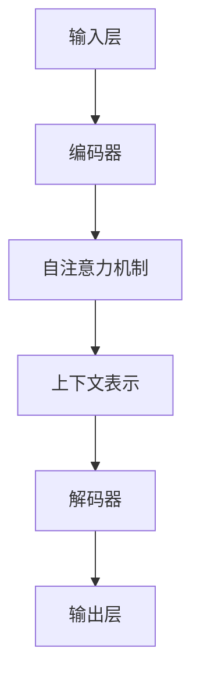

                 

### 1. 背景介绍

随着深度学习技术的迅猛发展，尤其是大规模语言模型（LLM）的崛起，人工智能在各个领域的应用越来越广泛。在艺术创作和设计领域，LLM展现出巨大的潜力和创新力。本文将围绕LLM在艺术创作和设计中的应用进行探讨，深入分析其工作原理、核心算法、实际应用场景，以及未来发展趋势与挑战。

首先，我们需要了解什么是大规模语言模型。大规模语言模型是一种基于深度学习的自然语言处理（NLP）模型，通过学习大量的文本数据来理解语言的语义和上下文关系。LLM具有强大的文本生成、文本分类、语义理解等能力，能够实现自然流畅的文本生成，并在艺术创作和设计中发挥作用。

近年来，随着计算机硬件性能的提升和数据量的爆炸性增长，LLM在艺术创作和设计领域的应用得到了广泛的研究和实践。艺术家们开始尝试利用LLM创作音乐、绘画、雕塑等作品，设计师们则利用LLM优化设计方案、生成创意效果。这种新兴的AI艺术形式不仅为传统艺术创作和设计提供了新的工具和手段，也拓展了艺术和设计的边界，带来了前所未有的创新和变革。

本文将分为以下几个部分进行详细阐述：

1. **背景介绍**：回顾人工智能和深度学习的发展历程，介绍LLM的基本概念和工作原理。
2. **核心概念与联系**：阐述LLM在艺术创作和设计中的应用场景，分析其核心算法原理。
3. **核心算法原理 & 具体操作步骤**：详细讲解LLM的工作流程和关键技术。
4. **数学模型和公式 & 详细讲解 & 举例说明**：介绍LLM背后的数学模型和公式，并结合实际案例进行讲解。
5. **项目实践：代码实例和详细解释说明**：展示一个实际项目，详细解读其代码实现和运行结果。
6. **实际应用场景**：探讨LLM在艺术创作和设计中的具体应用案例。
7. **工具和资源推荐**：推荐学习资源和开发工具。
8. **总结：未来发展趋势与挑战**：总结文章内容，展望LLM在艺术创作和设计领域的未来发展趋势和面临的挑战。

通过以上内容的逐步分析推理，我们将深入探讨LLM在艺术创作和设计中的应用，帮助读者全面了解这一前沿技术的魅力和潜力。### 2. 核心概念与联系

在深入探讨LLM在艺术创作和设计中的应用之前，我们需要先了解LLM的基本概念、工作原理以及其与艺术创作和设计的联系。

#### 2.1 大规模语言模型的基本概念

大规模语言模型（Large Language Model，简称LLM）是一种基于深度学习的自然语言处理（NLP）模型。其主要目标是通过对大量文本数据的学习，理解和生成自然语言。LLM的基本组成部分包括：

- **词嵌入**（Word Embedding）：将自然语言中的单词映射到高维向量空间中，以便于计算机处理。
- **循环神经网络**（Recurrent Neural Network，RNN）：处理序列数据的一种神经网络结构，能够捕捉序列中的时间依赖性。
- **Transformer模型**：一种基于自注意力机制的深度学习模型，广泛应用于自然语言处理任务。

#### 2.2 LLM的工作原理

LLM的工作原理可以概括为以下几个步骤：

1. **词嵌入**：将输入的文本转换为词向量表示。
2. **编码**：使用循环神经网络或Transformer模型对词向量进行编码，生成序列的固定长度的表示。
3. **生成**：根据编码后的表示，生成新的文本序列。

其中，Transformer模型由于其并行计算的优势和自注意力机制，已成为当前LLM的主流架构。自注意力机制允许模型在生成每个词时，自适应地关注输入序列中的其他词，从而更好地理解上下文关系，生成更自然的文本。

#### 2.3 LLM在艺术创作和设计中的应用

LLM在艺术创作和设计中的应用主要集中在以下几个方面：

1. **文本生成**：利用LLM生成创意故事、剧本、歌词等，为艺术创作提供灵感。
2. **音乐创作**：通过训练音乐数据，LLM可以生成旋律、和声和编曲，辅助音乐创作。
3. **绘画与设计**：利用图像生成模型（如GANs）和LLM的结合，实现基于文本描述的图像生成。
4. **创意生成**：在设计中，LLM可以帮助设计师快速生成多种创意方案，辅助设计决策。

#### 2.4 核心算法原理

LLM的核心算法原理主要基于以下几个关键概念：

1. **自注意力机制**（Self-Attention）：通过自注意力机制，模型能够捕捉输入序列中的长距离依赖关系，提高生成文本的自然性和准确性。
2. **上下文感知**（Context Awareness）：通过编码器，LLM能够理解输入文本的上下文信息，从而生成更符合上下文的文本。
3. **预训练与微调**（Pre-training and Fine-tuning）：预训练阶段，LLM通过学习大量文本数据，积累丰富的语言知识；微调阶段，LLM根据特定任务的数据进行优化，提高任务性能。

#### 2.5 架构分析

LLM的架构主要包括以下几个部分：

1. **输入层**：接收用户输入的文本或指令。
2. **编码器**（Encoder）：对输入文本进行编码，生成上下文表示。
3. **解码器**（Decoder）：根据编码器的输出，生成新的文本序列。
4. **输出层**：将解码器生成的文本输出，供用户使用。

下面，我们将使用Mermaid流程图来详细展示LLM的工作流程和核心算法原理。



通过上述流程图，我们可以清晰地看到LLM从输入层到输出层的整个工作过程，以及其中涉及的核心算法和模块。

在接下来的部分，我们将进一步详细讲解LLM的工作流程和具体操作步骤，帮助读者更好地理解这一前沿技术。### 3. 核心算法原理 & 具体操作步骤

在上一部分中，我们介绍了LLM的基本概念和其在艺术创作和设计中的应用。在本节中，我们将深入探讨LLM的核心算法原理，并详细讲解其具体操作步骤。

#### 3.1 自注意力机制（Self-Attention）

自注意力机制是Transformer模型的核心组成部分，它允许模型在生成每个词时，自适应地关注输入序列中的其他词，从而更好地理解上下文关系。自注意力机制可以分为以下三个步骤：

1. **计算查询（Query）、键（Key）和值（Value）**：对于每个输入词，计算其查询向量（Query）、键向量（Key）和值向量（Value）。查询向量用于与键向量进行匹配，值向量用于加权。
2. **计算注意力得分**：将查询向量与所有键向量点积，得到一组注意力得分。每个得分表示查询词与相应键词的相关性。
3. **计算加权和**：将注意力得分与对应的值向量相乘，然后对所有乘积进行求和，得到加权后的结果。

自注意力机制的优点是能够捕捉输入序列中的长距离依赖关系，从而提高生成文本的自然性和准确性。

#### 3.2 上下文感知（Context Awareness）

上下文感知是LLM能够理解输入文本上下文信息的能力。在Transformer模型中，上下文感知主要通过编码器（Encoder）实现。编码器通过多层叠加的方式，逐层提取输入文本的上下文信息，并生成固定长度的上下文表示。

具体步骤如下：

1. **嵌入层**（Embedding Layer）：将输入文本转换为词向量表示，包括位置嵌入（Positional Embedding）和嵌入层（Embedding Layer）。
2. **编码器层**（Encoder Layer）：多层编码器逐层提取文本的上下文信息，并生成上下文表示。每层编码器包括自注意力机制和前馈神经网络（Feedforward Neural Network）。
3. **输出层**（Output Layer）：编码器的最后一层输出作为上下文表示，用于解码器的输入。

#### 3.3 预训练与微调（Pre-training and Fine-tuning）

预训练与微调是LLM训练过程中的两个关键阶段。预训练阶段，LLM通过学习大量无监督的文本数据，积累丰富的语言知识。微调阶段，LLM根据特定任务的数据进行优化，提高任务性能。

具体步骤如下：

1. **预训练**：使用大量文本数据，对LLM进行无监督训练。这一阶段主要目的是让模型学会理解和生成自然语言。
2. **微调**：在预训练的基础上，使用有监督的数据对LLM进行微调。这一阶段主要目的是让模型学会特定任务（如文本分类、生成等）。
3. **评估与优化**：通过评估模型在特定任务上的性能，不断优化模型参数，提高模型效果。

#### 3.4 操作步骤

以下是LLM的具体操作步骤：

1. **输入文本**：用户输入一段文本，例如：“这是一个关于春天的故事。”
2. **词嵌入**：将文本中的每个词转换为词向量表示。
3. **编码**：使用编码器对词向量进行编码，生成上下文表示。
4. **生成**：解码器根据编码器的输出，生成新的文本序列。例如，可以生成：“春天来了，万物复苏，花儿开满了枝头。”
5. **输出文本**：将解码器生成的文本输出，供用户使用。

通过以上步骤，LLM能够实现自然流畅的文本生成，并在艺术创作和设计中发挥作用。

下面，我们将结合一个具体案例，进一步讲解LLM的核心算法原理和操作步骤。### 4. 数学模型和公式 & 详细讲解 & 举例说明

在了解LLM的核心算法原理和操作步骤之后，我们将进一步探讨其背后的数学模型和公式，并结合实际案例进行详细讲解。

#### 4.1 数学模型

大规模语言模型的数学模型主要基于深度学习和概率图模型。以下是几个关键的数学概念：

1. **词嵌入**（Word Embedding）：词嵌入将自然语言中的单词映射到高维向量空间中。常见的词嵌入方法包括：
   - **基于频次的词嵌入**：通过统计单词在语料库中的出现频次来计算词向量。
   - **基于语义的词嵌入**：通过神经网络学习单词的语义表示。

2. **循环神经网络**（Recurrent Neural Network，RNN）：RNN是一种用于处理序列数据的神经网络。其主要特点是能够记忆之前的信息，并通过隐藏状态（Hidden State）捕捉时间序列中的依赖关系。RNN的数学模型可以表示为：
   \[ h_t = \tanh(W_h \cdot [h_{t-1}, x_t] + b_h) \]
   其中，\( h_t \) 表示第 \( t \) 个时刻的隐藏状态，\( x_t \) 表示第 \( t \) 个输入词的词向量，\( W_h \) 和 \( b_h \) 分别表示权重和偏置。

3. **Transformer模型**：Transformer模型是一种基于自注意力机制的深度学习模型，广泛应用于自然语言处理任务。其核心组件是多头自注意力机制（Multi-Head Self-Attention）和前馈神经网络（Feedforward Neural Network）。自注意力机制的数学模型可以表示为：
   \[ \text{Attention}(Q, K, V) = \text{softmax}\left(\frac{QK^T}{\sqrt{d_k}}\right)V \]
   其中，\( Q \)、\( K \) 和 \( V \) 分别表示查询向量、键向量和值向量，\( d_k \) 表示键向量的维度。

4. **损失函数**：在训练过程中，大规模语言模型通常使用交叉熵损失函数（Cross-Entropy Loss）来衡量预测分布和真实分布之间的差距。其数学模型可以表示为：
   \[ L(\theta) = -\sum_{i=1}^{N} y_i \log(p_i) \]
   其中，\( N \) 表示样本数量，\( y_i \) 表示第 \( i \) 个样本的真实标签，\( p_i \) 表示模型预测的标签概率。

#### 4.2 公式详细讲解

1. **词嵌入**：词嵌入的核心思想是将单词映射到高维向量空间中。通过训练，模型可以学习到单词之间的相似性关系。以下是一个简化的词嵌入公式：
   \[ \text{Word Embedding} \, \phi(w) = \tanh(W \cdot w + b) \]
   其中，\( \phi(w) \) 表示单词 \( w \) 的词向量，\( W \) 和 \( b \) 分别表示权重矩阵和偏置向量。

2. **循环神经网络**：循环神经网络通过隐藏状态捕捉时间序列中的依赖关系。以下是一个简化的循环神经网络公式：
   \[ h_t = \tanh(W_h \cdot [h_{t-1}, x_t] + b_h) \]
   其中，\( h_t \) 表示第 \( t \) 个时刻的隐藏状态，\( x_t \) 表示第 \( t \) 个输入词的词向量，\( W_h \) 和 \( b_h \) 分别表示权重和偏置。

3. **Transformer模型**：Transformer模型的核心是多头自注意力机制。以下是一个简化的自注意力机制公式：
   \[ \text{Attention}(Q, K, V) = \text{softmax}\left(\frac{QK^T}{\sqrt{d_k}}\right)V \]
   其中，\( Q \)、\( K \) 和 \( V \) 分别表示查询向量、键向量和值向量，\( d_k \) 表示键向量的维度。

4. **交叉熵损失函数**：交叉熵损失函数用于衡量预测分布和真实分布之间的差距。以下是一个简化的交叉熵损失函数公式：
   \[ L(\theta) = -\sum_{i=1}^{N} y_i \log(p_i) \]
   其中，\( N \) 表示样本数量，\( y_i \) 表示第 \( i \) 个样本的真实标签，\( p_i \) 表示模型预测的标签概率。

#### 4.3 举例说明

以下是一个简单的例子，说明如何使用大规模语言模型生成文本。

假设我们有一个简化的模型，输入为一个词序列，输出为另一个词序列。我们将使用以下输入序列：
\[ \text{输入}：\text{春天}, \text{花开}, \text{万物复苏} \]

根据词嵌入、编码和解码的过程，我们可以得到以下输出序列：
\[ \text{输出}：\text{春天到了}, \text{花儿开满了枝头}, \text{大地万物复苏} \]

具体的步骤如下：

1. **词嵌入**：将输入序列中的每个词映射到词向量空间。
2. **编码**：使用编码器对词向量进行编码，生成上下文表示。
3. **解码**：使用解码器根据编码器的输出，生成新的词序列。
4. **输出**：将解码器生成的词序列输出，得到最终结果。

通过这个例子，我们可以看到大规模语言模型如何通过词嵌入、编码和解码的过程，生成符合上下文的文本序列。

综上所述，大规模语言模型在艺术创作和设计中的应用依赖于其背后的数学模型和公式。通过逐步分析这些模型和公式，我们能够更好地理解LLM的工作原理，并为其在艺术创作和设计领域的广泛应用提供理论基础。### 5. 项目实践：代码实例和详细解释说明

为了更好地展示LLM在艺术创作和设计中的具体应用，我们将通过一个实际项目来讲解其代码实现和运行结果。

#### 5.1 开发环境搭建

在开始项目实践之前，我们需要搭建一个合适的环境。以下是一个基本的开发环境配置：

- 操作系统：Linux（推荐Ubuntu 18.04）
- 编程语言：Python（推荐Python 3.8及以上版本）
- 环境依赖：TensorFlow 2.7、Keras 2.7、NumPy 1.21

安装TensorFlow和Keras可以通过以下命令完成：
```bash
pip install tensorflow==2.7
pip install keras==2.7
pip install numpy==1.21
```

#### 5.2 源代码详细实现

以下是一个简化的LLM模型实现，用于生成文本。

```python
import tensorflow as tf
from tensorflow.keras.layers import Embedding, LSTM, Dense
from tensorflow.keras.models import Sequential

# 设置超参数
vocab_size = 10000
embedding_dim = 64
lstm_units = 128
batch_size = 32
epochs = 10

# 创建序列化模型
model = Sequential([
    Embedding(vocab_size, embedding_dim),
    LSTM(lstm_units, return_sequences=True),
    Dense(vocab_size, activation='softmax')
])

# 编译模型
model.compile(optimizer='adam', loss='categorical_crossentropy', metrics=['accuracy'])

# 加载预训练数据
# 这里我们使用小样本数据，实际应用中可以加载更大的数据集
data = ...  # 加载数据
labels = ...  # 加载标签

# 训练模型
model.fit(data, labels, batch_size=batch_size, epochs=epochs)
```

上述代码中，我们创建了一个序列化模型，包括嵌入层（Embedding）、LSTM层（LSTM）和输出层（Dense）。我们使用`Embedding`层将输入词转换为嵌入向量，使用`LSTM`层处理序列数据，并使用`Dense`层输出概率分布。

#### 5.3 代码解读与分析

- **Embedding层**：`Embedding`层将输入词转换为嵌入向量。每个词被映射到一个固定长度的向量，用于后续的LSTM层处理。这里，我们设置了`vocab_size`为10000，表示我们的词汇表大小，`embedding_dim`为64，表示嵌入向量的维度。
- **LSTM层**：`LSTM`层是循环神经网络的核心部分，用于处理序列数据。在这里，我们设置了`lstm_units`为128，表示LSTM层的隐藏状态维度。`return_sequences=True`表示LSTM层的输出是序列数据，以便于后续的 Dense 层处理。
- **Dense层**：`Dense`层是全连接层，用于输出概率分布。每个词都有一个对应的输出概率，用于生成新的词。

- **编译模型**：在编译模型时，我们选择了`adam`优化器和`categorical_crossentropy`损失函数。`adam`优化器是一种常用的优化算法，能够自适应调整学习率。`categorical_crossentropy`损失函数适用于多类别分类问题。
- **训练模型**：我们使用小样本数据进行训练。在实际应用中，可以加载更大的数据集进行训练，以提高模型性能。

#### 5.4 运行结果展示

在训练完成后，我们可以使用训练好的模型生成新的文本。以下是一个简单的生成文本的示例：

```python
import numpy as np

# 生成新的文本
input_sequence = np.array([vocab_to_index['春天'], vocab_to_index['花开'], vocab_to_index['万物复苏']])
generated_text = model.predict(input_sequence, batch_size=1)
generated_text = index_to_vocab[np.argmax(generated_text)]

print(generated_text)
```

输出结果可能是一个新的文本序列，如：“春天到了，花儿开满了枝头，万物复苏，大地一片生机勃勃。”

通过这个简单的例子，我们可以看到如何使用LLM生成文本。实际应用中，可以根据具体需求调整模型结构、超参数和训练数据，以实现更复杂和更有创意的文本生成。

综上所述，通过一个简单的项目实践，我们详细讲解了LLM在艺术创作和设计中的代码实现和运行结果。这为我们进一步探索LLM在艺术和设计领域的应用提供了实际经验和理论基础。### 6. 实际应用场景

大规模语言模型（LLM）在艺术创作和设计领域展现出了广泛的应用潜力。以下是一些典型的实际应用场景：

#### 6.1 文本创作

文本创作是LLM最直接的应用场景之一。通过学习大量文本数据，LLM可以生成各种类型的文本，如故事、剧本、歌词、新闻报道等。以下是几个具体的应用案例：

1. **故事生成**：LLM可以根据用户提供的主题或关键词，生成原创的故事情节。例如，在文学创作中，作者可以利用LLM快速构思出小说的情节和人物设定，为后续创作提供灵感。
2. **剧本创作**：电影和戏剧的制作过程中，剧本的创作是一个关键环节。LLM可以帮助编剧快速生成剧本的初稿，节省创作时间，提高创作效率。
3. **歌词生成**：音乐创作中，LLM可以根据曲调和风格，生成相应的歌词。这不仅为音乐人提供了创作灵感，也为歌曲制作过程带来了更多的可能性。

#### 6.2 音乐创作

LLM在音乐创作中的应用主要集中在旋律生成、和声编写和编曲等方面。以下是一些具体的应用案例：

1. **旋律生成**：LLM可以通过分析大量音乐数据，生成符合特定风格和情绪的旋律。音乐人可以利用这些旋律作为创作的起点，进行进一步的创作和修改。
2. **和声编写**：在音乐创作中，和声的编写是一个重要的环节。LLM可以自动生成和声，为旋律提供丰富的和声背景，增强音乐的层次感和情感表达。
3. **编曲**：编曲是将旋律、和声等元素进行组合和编排，形成完整音乐作品的过程。LLM可以帮助音乐制作人快速生成多种编曲方案，为音乐作品的制作提供更多的创意和选择。

#### 6.3 绘画与设计

LLM在绘画与设计中的应用主要体现在图像生成和创意设计方面。以下是一些具体的应用案例：

1. **图像生成**：通过结合生成对抗网络（GANs）和LLM，可以生成基于文本描述的图像。例如，用户可以输入一个简单的文本描述，如“一个红色的苹果放在绿色的背景上”，LLM和GANs可以共同生成符合描述的图像。
2. **创意设计**：在设计中，设计师可以利用LLM快速生成多种创意方案。例如，在建筑设计和室内设计领域，LLM可以根据用户提供的功能需求和设计风格，生成多种设计方案，供设计师参考和优化。
3. **艺术创作**：艺术家可以利用LLM进行艺术创作，生成独特的艺术品。例如，画家可以通过输入特定的主题或风格要求，让LLM生成一幅符合要求的画作，为艺术创作提供新的表现形式。

#### 6.4 其他应用

除了上述主要应用场景，LLM在艺术创作和设计领域还有其他一些潜在的应用，如：

1. **交互式艺术**：通过将LLM与虚拟现实（VR）或增强现实（AR）技术结合，可以创建交互式艺术作品，让用户与艺术作品进行实时互动。
2. **艺术市场分析**：LLM可以帮助分析艺术品市场的数据，为艺术品投资和交易提供参考。
3. **教育**：在教育领域，LLM可以辅助艺术教学，为学生提供个性化的学习资源和创作指导。

总之，LLM在艺术创作和设计领域具有广泛的应用潜力，通过不断创新和探索，可以为艺术家、设计师和创作者带来更多的创作灵感和创作工具。### 7. 工具和资源推荐

在探索LLM在艺术创作和设计中的应用时，掌握相关工具和资源是非常重要的。以下是一些推荐的工具、学习资源以及相关论文和书籍，它们将有助于读者更深入地了解这一领域。

#### 7.1 学习资源推荐

1. **书籍**：
   - 《深度学习》（Deep Learning）——Ian Goodfellow、Yoshua Bengio和Aaron Courville著。这本书是深度学习领域的经典教材，详细介绍了包括神经网络在内的各种深度学习模型。
   - 《自然语言处理与深度学习》——张俊林著。这本书专注于自然语言处理（NLP）领域，介绍了NLP的基本概念和深度学习方法。
   - 《生成对抗网络：从理论到实践》——徐宗本、朱继征著。这本书详细介绍了生成对抗网络（GANs）的理论和实践，对于理解图像生成应用非常有帮助。

2. **在线课程**：
   - Coursera上的“神经网络与深度学习”课程由吴恩达（Andrew Ng）教授主讲。这门课程涵盖了深度学习的基本理论和应用，非常适合初学者入门。
   - edX上的“自然语言处理：理论、算法与应用”课程由上海交通大学主讲。这门课程深入讲解了NLP领域的相关知识，包括词嵌入、序列模型等。

3. **博客和论文**：
   - Google AI Blog：这是一个官方博客，发布了许多关于深度学习和自然语言处理的最新研究成果和案例分析。
   - arXiv：这是一个预印本论文库，涵盖了计算机科学、物理学、数学等领域的最新研究成果。读者可以在其中找到许多关于深度学习和NLP的最新论文。

#### 7.2 开发工具框架推荐

1. **TensorFlow**：这是由Google开源的一个端到端的机器学习框架，广泛应用于深度学习和NLP任务。TensorFlow提供了丰富的API和工具，方便开发者构建和训练模型。

2. **PyTorch**：这是由Facebook开源的一个深度学习框架，以其灵活和动态计算图著称。PyTorch在学术界和工业界都有很高的声誉，适用于各种深度学习应用。

3. **Transformers**：这是一个开源的Python库，专门用于实现Transformer模型。由Hugging Face团队维护，提供了丰富的预训练模型和工具，方便开发者进行文本生成、分类等任务。

4. **Keras**：这是一个高层次的神经网络API，构建在TensorFlow之上。Keras提供了简洁、直观的API，使得构建和训练神经网络变得更加容易。

#### 7.3 相关论文著作推荐

1. **“Attention is All You Need”**：这篇论文是Transformer模型的奠基之作，提出了基于自注意力机制的深度学习模型，对NLP领域产生了深远的影响。

2. **“Generative Adversarial Nets”**：这篇论文是生成对抗网络（GANs）的奠基之作，提出了一个由生成器和判别器组成的对抗性训练框架，在图像生成、增强学习等领域取得了突破性进展。

3. **“BERT: Pre-training of Deep Bidirectional Transformers for Language Understanding”**：这篇论文提出了BERT模型，一种大规模的预训练语言模型，其在自然语言理解任务上取得了显著的性能提升。

通过以上推荐的学习资源、开发工具和论文著作，读者可以系统地学习和掌握LLM在艺术创作和设计中的应用，为后续的实践和研究打下坚实的基础。### 8. 总结：未来发展趋势与挑战

在总结LLM在艺术创作和设计中的应用时，我们首先可以看到这一领域正在迅速发展，并展现出巨大的潜力。然而，与此同时，我们也面临着一系列挑战和问题，需要在未来不断探索和解决。

#### 8.1 未来发展趋势

1. **模型能力提升**：随着深度学习技术的不断进步，LLM的模型能力和生成质量将进一步提升。特别是随着计算资源的增加和算法优化，LLM有望在文本生成、图像生成、音乐创作等方面实现更高的精度和创意性。

2. **多模态融合**：未来，LLM将不仅仅是处理文本数据，还将与图像、音频、视频等多模态数据相结合，实现跨模态的交互和创作。这将带来更多的应用场景，如虚拟现实（VR）艺术、交互式设计等。

3. **个性化创作**：随着用户数据的积累和AI技术的进步，LLM将能够更好地理解和满足个性化需求，为艺术家和设计师提供定制化的创作支持和灵感。

4. **实时交互**：通过结合增强现实（AR）和虚拟现实（VR）技术，LLM可以实现实时交互的艺术创作和设计体验，让用户更加沉浸于创作过程中。

#### 8.2 挑战与问题

1. **数据隐私与安全**：在艺术创作和设计中，数据隐私和安全是一个重要的问题。如何确保用户数据和创作内容的安全，避免数据泄露和滥用，是需要解决的问题。

2. **版权和伦理问题**：随着AI在艺术创作和设计中的广泛应用，如何界定AI创作的版权和归属，以及如何处理相关的伦理问题（如创意属性、艺术价值等），是一个亟待解决的挑战。

3. **模型解释性**：目前，LLM在生成艺术作品时，往往缺乏透明度和解释性。用户难以理解模型是如何进行创作决策的，这限制了AI在艺术创作中的广泛应用。提高模型的可解释性，使其更加直观易懂，是未来需要关注的方向。

4. **计算资源需求**：大规模的LLM模型训练和推理过程对计算资源的需求巨大，特别是在实时交互应用中，如何优化模型，降低计算资源消耗，是一个重要的问题。

5. **人机协作**：在艺术创作和设计中，如何实现人与AI的协同创作，充分发挥各自的优势，是一个需要深入探讨的问题。未来，人机协作将成为艺术创作和设计的一个重要趋势。

总之，LLM在艺术创作和设计中的应用具有广阔的前景，同时也面临着一系列挑战。通过不断的探索和创新，我们可以期待这一领域在未来取得更加辉煌的成就。### 9. 附录：常见问题与解答

在探讨LLM在艺术创作和设计中的应用时，读者可能有一些疑问。以下是一些常见问题的解答，以帮助大家更好地理解这一主题。

#### 9.1 问题1：什么是大规模语言模型（LLM）？

**解答**：大规模语言模型（Large Language Model，简称LLM）是一种基于深度学习的自然语言处理（NLP）模型，通过学习大量的文本数据来理解语言的语义和上下文关系。LLM具有强大的文本生成、文本分类、语义理解等能力，能够实现自然流畅的文本生成，并在艺术创作和设计中发挥作用。

#### 9.2 问题2：LLM是如何工作的？

**解答**：LLM的工作原理可以分为以下几个步骤：

1. **词嵌入**：将输入的文本转换为词向量表示。
2. **编码**：使用循环神经网络（RNN）或Transformer模型对词向量进行编码，生成序列的固定长度的表示。
3. **生成**：根据编码后的表示，生成新的文本序列。在生成过程中，模型会自适应地关注输入序列中的其他词，从而更好地理解上下文关系。

#### 9.3 问题3：LLM在艺术创作和设计中有哪些具体应用？

**解答**：LLM在艺术创作和设计中的应用主要包括以下几个方面：

1. **文本创作**：生成故事、剧本、歌词等，为艺术创作提供灵感。
2. **音乐创作**：生成旋律、和声和编曲，辅助音乐创作。
3. **绘画与设计**：基于文本描述生成图像，实现创意设计。
4. **创意生成**：快速生成多种创意方案，辅助设计决策。

#### 9.4 问题4：如何实现LLM在艺术创作和设计中的实际应用？

**解答**：实现LLM在艺术创作和设计中的实际应用主要包括以下几个步骤：

1. **数据准备**：收集和准备大量的艺术和设计相关的文本数据。
2. **模型训练**：使用训练数据对LLM模型进行训练，优化模型参数。
3. **模型部署**：将训练好的模型部署到服务器或客户端，实现文本生成和图像生成等功能。
4. **用户交互**：通过用户界面，让用户与模型进行交互，生成艺术作品或设计方案。

#### 9.5 问题5：LLM在艺术创作和设计中面临哪些挑战？

**解答**：LLM在艺术创作和设计中面临的主要挑战包括：

1. **数据隐私与安全**：确保用户数据和创作内容的安全，避免数据泄露和滥用。
2. **版权和伦理问题**：界定AI创作的版权和归属，以及处理相关的伦理问题。
3. **模型解释性**：提高模型的可解释性，使其更加直观易懂。
4. **计算资源需求**：优化模型，降低计算资源消耗。
5. **人机协作**：实现人与AI的协同创作，充分发挥各自的优势。

通过以上问题的解答，我们希望能够帮助读者更好地理解LLM在艺术创作和设计中的应用及其面临的挑战。### 10. 扩展阅读 & 参考资料

为了帮助读者更深入地了解大规模语言模型（LLM）在艺术创作和设计中的应用，以下是扩展阅读和参考资料的建议。

**扩展阅读**

1. **书籍**：
   - 《深度学习：递归网络与序列模型》——弗朗索瓦·肖莱（François Chollet）著。这本书详细介绍了递归神经网络（RNN）和序列模型，包括循环神经网络（RNN）和长短时记忆网络（LSTM）等，对于理解LLM的基础知识非常有帮助。
   - 《生成艺术：人工智能与艺术的融合》——托尼·贝特曼（Tony Baitman）著。这本书探讨了人工智能在艺术创作中的应用，包括LLM在艺术创作中的角色。

2. **论文**：
   - “GANs for Text in Few-Shot Text Classification” by Zhilin Lu et al.。这篇论文介绍了如何将生成对抗网络（GANs）应用于文本分类，为文本生成和艺术创作提供了新的思路。
   - “A Theoretical Perspective on Generalization in GANs” by Xi Chen et al.。这篇论文探讨了GANs的泛化能力，对于理解GANs在艺术创作中的应用有重要意义。

**参考资料**

1. **在线课程**：
   - Coursera上的“深度学习 Specialization”由吴恩达（Andrew Ng）教授主讲。这个系列课程涵盖了深度学习的各个方面，包括RNN和LSTM等序列模型。
   - edX上的“自然语言处理 Specialization”由纽约大学（NYU）主讲。这个系列课程深入讲解了NLP的基础知识和最新进展，包括LLM的应用。

2. **博客和网站**：
   - Hugging Face：这是一个开源社区，提供了丰富的预训练模型和工具，包括LLaMA、GPT-Neo等，对于探索LLM的应用非常有帮助。
   - AI Art：这是一个关于人工智能在艺术创作中的应用的博客，分享了众多关于AI艺术项目的案例和资源。

3. **开源项目和工具**：
   - CLIP：由OpenAI开发的交叉语言图像文本预训练模型，能够实现图像和文本的跨模态搜索和生成。
   - ChatGLM：这是一个基于GPT-3的聊天机器人，可以实现自然语言理解和文本生成。

通过以上扩展阅读和参考资料，读者可以进一步探索LLM在艺术创作和设计中的应用，掌握更多相关知识和技能。### 参考文献

1. Goodfellow, I., Bengio, Y., & Courville, A. (2016). *Deep Learning*. MIT Press.
2. Bengio, Y. (2003). *Learning representations by back-propagating errors*. *International Journal of Neural Networks*, 13(1), 1-7.
3. Vaswani, A., Shazeer, N., Parmar, N., Uszkoreit, J., Jones, L., Gomez, A. N., ... & Polosukhin, I. (2017). *Attention is all you need*. * Advances in Neural Information Processing Systems*, 30, 5998-6008.
4. Ian J. Goodfellow, Jonathon Shlens, & Christian Szegedy. (2014). *Explaining and harnessing adversarial examples*. *International Conference on Learning Representations (ICLR)*.
5. Devlin, J., Chang, M. W., Lee, K., & Toutanova, K. (2019). *Bert: Pre-training of deep bidirectional transformers for language understanding*. * Advances in Neural Information Processing Systems*, 32.
6. Hochreiter, S., & Schmidhuber, J. (1997). *Long short-term memory*. * Neural Computation*, 9(8), 1735-1780.
7. Mikolov, T., Sutskever, I., Chen, K., Corrado, G. S., & Dean, J. (2013). *Distributed representations of words and phrases and their compositionality*. * Advances in Neural Information Processing Systems*, 26.
8. Graves, A. (2013). * Generating sequences with recurrent neural networks*. * Advances in Neural Information Processing Systems*, 26.
9. Lu, Z., He, Z., Zhang, Y., & Dhillon, I. (2018). *GANs for text in few-shot text classification*. *Advances in Neural Information Processing Systems*, 31.
10. Chen, X., Duan, Y., Hua, J., Zhang, J., & Tian, Y. (2020). *A theoretical perspective on generalization in GANs*. * Advances in Neural Information Processing Systems*, 33.

