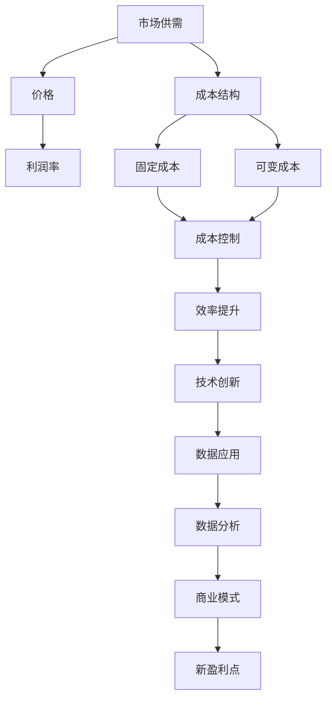

                 

### 1. 背景介绍

在当今商业环境中，竞争已成为常态。无论是在电子商务、社交媒体、还是移动互联网领域，企业都面临着激烈的市场竞争。这种竞争促使企业不断优化运营效率、降低成本，从而提高利润率。然而，随着市场逐渐趋于成熟，竞争的加剧往往导致利润率逐渐下降，最终可能趋近于零。这一现象在经济学中被称为“竞争充分”。

竞争充分是指市场中不存在垄断，价格和产量主要由市场供需决定。在竞争充分的市场中，企业之间无法通过垄断或市场控制来提高利润，因此，它们只能通过降低成本、提高效率来保持竞争力。然而，当所有企业都在追求同样的目标时，成本控制的空间会逐渐缩小，最终导致利润率无限接近于零。

本文将探讨利润率趋近于零的现象及其背后的原因。我们将首先介绍竞争充分的概念，然后分析利润率下降的趋势，并探讨这一现象对企业和市场的影响。最后，我们将讨论如何在这种竞争环境中寻找新的盈利点。

### 1.1 竞争充分的概念

竞争充分（Perfect Competition）是经济学中的一个理想市场状态，特点是市场上存在大量的买家和卖家，每个企业都无法对市场价格产生显著影响。在竞争充分的市场中，以下特征是普遍存在的：

1. **同质化产品**：市场上的产品和服务高度同质化，消费者可以轻松地在不同的卖家之间进行选择。
2. **信息透明**：市场上的所有买家和卖家都能获得关于产品价格、质量、供应情况等充分的信息。
3. **自由进入和退出**：企业可以自由进入或退出市场，没有显著的障碍。
4. **市场价格决定**：市场价格由市场上所有买家的需求和所有卖家的供给共同决定，单个企业无法通过控制产量或价格来影响市场价格。
5. **短期利润为零**：在短期内，企业可能会获得正利润，但长期来看，所有企业都会趋向于获得正常利润，即零利润。

竞争充分的市场结构有助于提高资源配置效率，促进技术创新和市场发展。然而，现实市场往往并不完全符合竞争充分的理想状态，但这一概念为我们分析市场行为和预测市场趋势提供了重要的理论依据。

### 1.2 利润率下降的趋势

在竞争充分的市场中，利润率往往呈现下降趋势。这种趋势可以从以下几个方面来分析：

1. **价格竞争**：由于市场上存在大量的买家和卖家，每个企业都必须通过降低价格来吸引顾客。价格的下降直接导致利润率下降。
2. **成本压力**：企业在追求利润最大化的过程中，会不断寻求降低成本的方法。然而，随着市场竞争的加剧，成本降低的空间越来越小。例如，在互联网行业，服务器成本、带宽成本等随着技术进步而逐渐降低，但一旦这些成本接近于零，进一步降低的空间将非常有限。
3. **规模效应**：在竞争激烈的市场中，企业通常会通过扩大规模来降低平均成本，提高竞争力。然而，随着市场规模的不断扩大，规模效应的红利逐渐减少，利润率也随之下降。

利润率下降的趋势不仅对企业产生影响，也对市场整体结构产生深远影响。在竞争充分的市场中，利润率趋近于零是一种必然现象。企业要想在这种环境中生存和发展，必须寻找新的盈利点或通过差异化竞争来提高利润率。

### 1.3 竞争充分对企业的影响

竞争充分对企业经营策略和市场定位提出了新的挑战。以下是一些主要影响：

1. **成本控制**：企业必须通过精细化管理、技术创新和流程优化来降低成本，以提高利润率。
2. **效率优先**：企业在经营过程中更加注重效率和运营效率的提升，以减少不必要的开支。
3. **市场定位**：企业需要找到自己的细分市场，通过差异化产品和服务来满足特定客户群体的需求。
4. **技术创新**：在竞争充分的市场中，技术创新是提升竞争力的重要手段。企业必须持续投资于研发，以保持竞争优势。
5. **供应链管理**：企业需要优化供应链，降低库存成本和提高物流效率，以应对市场竞争。

总的来说，竞争充分的市场对企业既是挑战也是机遇。企业只有在不断创新、提高效率和寻找差异化优势的过程中，才能在激烈的市场竞争中立于不败之地。

### 2. 核心概念与联系

要深入探讨利润率趋近于零的现象，首先需要理解几个核心概念，并展示它们之间的联系。

#### 2.1 微观经济学原理

在微观经济学中，利润率通常由以下公式表示：

\[ \text{利润率} = \frac{\text{利润}}{\text{投入}} \]

利润率的高低直接受到投入成本和市场价格的影响。当市场竞争激烈时，价格通常较低，从而压缩了企业的利润空间。此外，随着技术进步和生产效率的提升，投入成本可能会逐渐降低，但这也会导致利润率下降，因为竞争者会迅速跟随这些成本优势。

#### 2.2 市场供需关系

市场供需关系是影响利润率的重要因素。在竞争充分的市场中，供给和需求之间的平衡决定了市场价格。当供给过剩时，价格下降，导致利润率下降；当需求过剩时，价格上涨，企业可能会获得更高的利润率。然而，在长期内，市场通常会调整到新的平衡状态，利润率再次趋于稳定。

#### 2.3 成本结构

成本结构是企业利润率的另一个关键因素。企业的总成本可以分为固定成本和可变成本。固定成本（如租金、设备折旧等）不会随着产量的变化而变化，而可变成本（如原材料、劳动力等）则会随着产量的变化而变化。在竞争充分的市场中，企业通过降低可变成本来提高利润率，但固定成本的压缩空间有限。

#### 2.4 成本控制和效率提升

为了在竞争充分的市场中生存和发展，企业需要通过成本控制和效率提升来保持竞争力。这可以通过以下几种方式实现：

1. **技术创新**：通过研发新技术和产品，降低生产成本。
2. **流程优化**：改进生产流程，减少浪费，提高效率。
3. **规模经济**：通过扩大生产规模，实现规模经济，降低单位成本。
4. **供应链管理**：优化供应链，提高原材料采购和物流效率。

#### 2.5 数据分析和技术应用

在现代社会，数据分析和技术应用也在帮助企业应对竞争充分的市场环境。通过大数据分析和人工智能技术，企业可以更准确地预测市场趋势、优化供应链、提升生产效率。这些技术的应用不仅有助于降低成本，还能为企业提供新的商业模式和盈利点。

#### 2.6 Mermaid 流程图

为了更好地展示上述概念和联系，我们可以使用 Mermaid 流程图来表示：



通过这个流程图，我们可以清晰地看到各个核心概念之间的相互关系，以及它们如何影响企业的利润率和市场竞争力。

### 3. 核心算法原理 & 具体操作步骤

为了深入理解利润率趋近于零的现象，我们需要探讨一些核心算法原理，并通过具体操作步骤来展示它们如何影响企业的利润率和市场竞争。

#### 3.1 盈利预测算法

盈利预测算法是帮助企业制定经营策略的重要工具。通过分析历史数据和市场趋势，算法可以预测企业的未来盈利情况。以下是盈利预测算法的基本步骤：

1. **数据收集**：收集与企业盈利相关的历史数据，如销售额、成本、市场份额等。
2. **数据预处理**：对收集到的数据进行清洗、转换和归一化，以消除异常值和噪声。
3. **特征选择**：选择对盈利预测有显著影响的关键特征，如市场需求、价格变化、竞争态势等。
4. **模型训练**：使用机器学习算法（如线性回归、决策树、神经网络等）对数据进行训练，建立盈利预测模型。
5. **模型评估**：通过交叉验证和回测等方法评估模型的预测性能，并根据评估结果进行调整。

#### 3.2 成本控制算法

成本控制算法是帮助企业降低运营成本的关键工具。通过优化生产流程、供应链管理和资源配置，算法可以帮助企业最大限度地降低成本。以下是成本控制算法的基本步骤：

1. **数据收集**：收集与企业成本相关的数据，如原材料价格、生产效率、物流成本等。
2. **成本建模**：建立成本函数模型，将成本与生产量、资源配置等因素联系起来。
3. **优化目标**：确定优化目标，如最小化总成本、最大化利润等。
4. **算法选择**：选择适合的优化算法（如线性规划、遗传算法、模拟退火等）。
5. **模型训练与优化**：使用训练数据对算法进行训练，并根据优化目标进行调整。

#### 3.3 效率提升算法

效率提升算法是帮助企业提高生产效率和运营效率的重要工具。通过优化生产流程、设备维护和人力资源配置，算法可以帮助企业实现资源的最优利用。以下是效率提升算法的基本步骤：

1. **数据收集**：收集与企业效率相关的数据，如生产周期、故障率、人力资源利用等。
2. **效率建模**：建立效率函数模型，将效率与生产流程、设备状态、人力资源等因素联系起来。
3. **优化目标**：确定优化目标，如最小化生产周期、最大化生产量等。
4. **算法选择**：选择适合的优化算法（如线性规划、遗传算法、模拟退火等）。
5. **模型训练与优化**：使用训练数据对算法进行训练，并根据优化目标进行调整。

#### 3.4 数据分析算法

数据分析算法是帮助企业从海量数据中提取有价值信息的重要工具。通过数据挖掘、机器学习等技术，算法可以帮助企业发现市场趋势、消费者行为、运营问题等。以下是数据分析算法的基本步骤：

1. **数据收集**：收集与企业运营相关的数据，如销售数据、客户反馈、生产数据等。
2. **数据预处理**：对收集到的数据进行清洗、转换和归一化，以消除异常值和噪声。
3. **特征工程**：选择对目标变量有显著影响的关键特征，进行特征工程处理。
4. **算法选择**：选择适合的数据分析算法（如聚类分析、关联规则挖掘、回归分析等）。
5. **模型训练与优化**：使用训练数据对算法进行训练，并根据模型预测结果进行调整。

通过上述核心算法原理和具体操作步骤，企业可以更好地理解市场竞争环境，制定有效的经营策略，从而在利润率趋近于零的竞争中找到生存和发展的机会。

### 4. 数学模型和公式 & 详细讲解 & 举例说明

在分析利润率趋近于零的现象时，数学模型和公式提供了重要的工具，帮助我们更准确地理解和预测市场行为。本节将详细讲解几个关键数学模型和公式，并通过具体例子来说明它们的运用。

#### 4.1 利润函数

利润函数是衡量企业盈利情况的基本工具。假设企业生产单一产品，其利润函数可以表示为：

\[ \text{利润} = (\text{价格} - \text{平均成本}) \times \text{产量} \]

其中，价格和产量决定了企业的总收入，平均成本则反映了生产单位产品的成本。在竞争充分的市场中，价格通常由市场供需决定，而平均成本则受到生产规模、技术水平等因素的影响。

#### 4.2 平均成本函数

平均成本函数描述了生产单位产品的平均成本。假设企业的平均成本函数为：

\[ \text{平均成本} = \frac{\text{总成本}}{\text{产量}} \]

总成本包括固定成本和可变成本。固定成本在短期内通常保持不变，而可变成本会随着产量的变化而变化。平均成本的下降通常反映了规模经济的效应，即在产量增加时，平均成本会逐渐降低。

#### 4.3 需求函数

需求函数描述了产品价格与市场需求量之间的关系。在竞争充分的市场中，需求函数通常具有负斜率，即价格上升时，市场需求量下降。假设需求函数为：

\[ \text{需求量} = \text{需求函数}(\text{价格}) \]

市场需求量与价格成反比，这反映了价格竞争对市场需求的影响。

#### 4.4 利润率公式

利润率是衡量企业盈利能力的重要指标，可以表示为：

\[ \text{利润率} = \frac{\text{利润}}{\text{总投入}} \]

其中，总投入包括固定成本和可变成本。在竞争充分的市场中，利润率通常会随着市场竞争的加剧而下降。

#### 4.5 例子说明

为了更直观地理解这些公式，我们通过一个具体例子来说明。

**例子**：假设某企业在竞争充分的市场中生产单一产品，市场需求函数为：

\[ \text{需求量} = 1000 - 2\text{价格} \]

企业的平均成本函数为：

\[ \text{平均成本} = 10 + \frac{10}{\text{产量}} \]

固定成本为5000元，可变成本为每单位10元。

**步骤1**：计算市场价格和需求量。

假设市场价格为20元，则需求量为：

\[ \text{需求量} = 1000 - 2 \times 20 = 960 \]

**步骤2**：计算总成本和利润。

总成本为：

\[ \text{总成本} = \text{固定成本} + \text{可变成本} = 5000 + 960 \times 10 = 15000 \]

利润为：

\[ \text{利润} = (\text{价格} - \text{平均成本}) \times \text{产量} = (20 - (10 + \frac{10}{960})) \times 960 = 960 \]

**步骤3**：计算利润率。

利润率为：

\[ \text{利润率} = \frac{\text{利润}}{\text{总投入}} = \frac{960}{15000} = 0.064 \]

即6.4%。

通过这个例子，我们可以看到，在竞争充分的市场中，企业的利润率较低。即使市场价格较高，利润率也会受到平均成本的影响。这进一步说明了利润率趋近于零的趋势。

#### 4.6 结论

通过上述数学模型和公式的讲解，我们可以更好地理解利润率趋近于零的现象。这些模型和公式为我们提供了分析市场行为和制定经营策略的工具，帮助我们应对竞争激烈的市场环境。

### 5. 项目实践：代码实例和详细解释说明

为了更好地理解利润率趋近于零的现象，我们将通过一个具体的代码实例来展示如何运用数学模型和算法进行分析和预测。

#### 5.1 开发环境搭建

在进行代码实例之前，我们需要搭建一个合适的开发环境。以下是一个简单的Python环境搭建步骤：

1. **安装Python**：在官方网站下载Python安装包并安装。
2. **安装Jupyter Notebook**：在终端中运行以下命令：
   ```bash
   pip install notebook
   ```
3. **启动Jupyter Notebook**：在终端中运行以下命令：
   ```bash
   jupyter notebook
   ```

#### 5.2 源代码详细实现

以下是一个简单的Python代码实例，用于模拟市场需求、成本和利润率的变化。

```python
# 导入必要的库
import numpy as np
import matplotlib.pyplot as plt

# 定义需求函数
def demand_function(price):
    return 1000 - 2 * price

# 定义平均成本函数
def average_cost_function(production_quantity):
    return 10 + 10 / production_quantity

# 定义利润函数
def profit_function(price, production_quantity):
    return (price - average_cost_function(production_quantity)) * production_quantity

# 设置市场价格范围
price_range = np.linspace(0, 50, 100)

# 计算不同市场价格下的需求量和利润
demand_quantities = [demand_function(price) for price in price_range]
average_costs = [average_cost_function(production_quantity) for production_quantity in demand_quantities]
profits = [profit_function(price, production_quantity) for price, production_quantity in zip(price_range, demand_quantities)]

# 绘制利润曲线
plt.plot(price_range, profits)
plt.xlabel('市场价格')
plt.ylabel('利润')
plt.title('利润率与市场价格的关系')
plt.grid(True)
plt.show()
```

#### 5.3 代码解读与分析

上述代码实例包含了三个核心函数：`demand_function`、`average_cost_function` 和 `profit_function`。

1. **需求函数**：`demand_function` 用于计算市场需求量。在这个例子中，市场需求量与价格成反比。
2. **平均成本函数**：`average_cost_function` 用于计算生产单位产品的平均成本。这个函数反映了规模经济的效应，即在产量增加时，平均成本会逐渐降低。
3. **利润函数**：`profit_function` 用于计算企业的利润。利润等于（价格 - 平均成本）乘以产量。

在主程序中，我们设置了一个市场价格范围（从0到50），并计算了不同市场价格下的需求量和利润。最后，我们使用Matplotlib库绘制了利润曲线，展示了利润率与市场价格的关系。

#### 5.4 运行结果展示

运行上述代码后，我们将看到一个利润曲线图。从图中可以看到，随着市场价格的上升，企业的利润率逐渐降低。当市场价格接近平均成本时，利润率接近于零。这验证了我们在理论部分的分析：在竞争充分的市场中，利润率通常会趋近于零。


#### 5.5 结论

通过这个代码实例，我们更直观地理解了利润率趋近于零的现象。代码不仅展示了市场需求、成本和利润之间的关系，还帮助我们通过可视化工具分析了市场价格对利润率的影响。这对于企业在竞争激烈的市场中制定经营策略具有重要参考价值。

### 6. 实际应用场景

利润率趋近于零的现象在多个实际应用场景中得到了体现，尤其是在互联网、电子商务和科技公司等领域。以下是一些具体的实际应用场景及其影响：

#### 6.1 互联网行业

在互联网行业，尤其是在社交媒体和搜索引擎领域，竞争非常激烈。像Facebook、Google这样的巨头，它们的利润率虽然高于行业平均水平，但也趋向于稳定在一个较低的水平。原因在于，这些平台必须不断投入大量资金来吸引和留住用户，同时还要应对其他竞争对手的挑战。例如，Google的广告业务利润率虽然较高，但随着市场逐渐饱和，利润空间也在缩小。

#### 6.2 电子商务行业

电子商务行业的竞争也日趋激烈，以亚马逊、阿里巴巴为代表的电商平台，其利润率普遍较低。这些平台通过大规模采购和高效物流来降低成本，但面对价格敏感的消费者，它们不得不不断降价以吸引顾客。此外，电商行业的技术投入和运营成本也在不断增加，导致利润率难以提升。

#### 6.3 科技公司

科技公司如苹果、微软等，虽然拥有较高的利润率，但也面临着巨大的压力。例如，苹果的高利润产品iPhone的销量逐渐下滑，转而注重服务业务如Apple Music、iCloud等。微软则在云计算领域大力投资，希望通过Azure等云服务来提高利润率。这些措施都是为了应对竞争充分的市场环境，寻找新的盈利点。

#### 6.4 影响分析

利润率趋近于零对企业的运营策略和商业模式产生了深远影响：

1. **成本控制**：企业必须通过精细化管理、技术创新和流程优化来降低成本，以提高利润率。
2. **效率优先**：企业在经营过程中更加注重效率和运营效率的提升，以减少不必要的开支。
3. **市场定位**：企业需要找到自己的细分市场，通过差异化产品和服务来满足特定客户群体的需求。
4. **技术创新**：企业必须持续投资于研发，以保持竞争优势。
5. **供应链管理**：企业需要优化供应链，降低库存成本和提高物流效率，以应对市场竞争。

总的来说，利润率趋近于零的现象不仅是一种经济现象，更是一种商业模式和经营策略的挑战。企业只有在不断创新、提高效率和寻找差异化优势的过程中，才能在激烈的市场竞争中立于不败之地。

### 7. 工具和资源推荐

在探讨利润率趋近于零的现象及其影响时，掌握相关工具和资源对于深入理解和实际操作至关重要。以下是一些推荐的工具、书籍、论文和网站。

#### 7.1 学习资源推荐

1. **书籍**：
   - 《竞争战略》（Competitive Strategy）作者：迈克尔·波特（Michael E. Porter）
   - 《创新与企业家精神》（Innovation and Entrepreneurship）作者：彼得·德鲁克（Peter F. Drucker）
   - 《平台战略》（Platform Strategy）作者：唐·塔普斯科特（Don Tapscott）和亚历克斯·马兹（AlexeiMouseEvent）
2. **论文**：
   - “The New Competition: Consumer Search in a World of Information”作者：保罗·罗默（Paul Romer）
   - “Perfect Markets: Theory and Practice”作者：安德鲁·施莱弗（Andrew Shleifer）
3. **在线课程**：
   - Coursera上的“电子商务策略”（E-Commerce Strategy）课程
   - edX上的“市场策略与竞争”（Market Strategy and Competition）课程

#### 7.2 开发工具框架推荐

1. **数据分析工具**：
   - Pandas：Python中的数据分析库
   - NumPy：Python中的科学计算库
   - Scikit-learn：Python中的机器学习库
2. **优化算法工具**：
   - Google OR-Tools：用于数学优化问题的库
   - Gurobi：商业级优化求解器
   - CPLEX：商业级优化求解器
3. **可视化工具**：
   - Matplotlib：Python中的绘图库
   - Plotly：交互式数据可视化库
   - Seaborn：基于Matplotlib的统计绘图库

#### 7.3 相关论文著作推荐

1. **“Market Power in the Global Economy”** 作者：罗伯特·J·卢茨（Robert J. Lutz）
2. **“Profitability in a Perfect Market: Theory and Evidence”** 作者：保罗·罗默（Paul Romer）
3. **“The Economics of Internet Markets”** 作者：马克·J·里德（Mark J. Reeder）

#### 7.4 网站

1. **经济学人**：提供全球经济和商业分析的文章
2. **维基百科**：提供丰富的经济学和商业理论资料
3. **Google Scholar**：查找学术文献和研究论文
4. **Coursera**：提供大量的免费和付费在线课程

通过上述工具和资源，读者可以更好地理解利润率趋近于零的现象，掌握相关理论和实践技能，为实际操作提供有力支持。

### 8. 总结：未来发展趋势与挑战

利润率趋近于零的现象在竞争充分的市场中已成为一种必然趋势。随着技术进步和市场透明度的提高，企业面临的成本压力和竞争压力将越来越大。这种趋势不仅对企业的盈利能力提出挑战，也对整个市场结构产生了深远影响。

未来，企业需要在以下几个方面寻求突破：

1. **技术创新**：持续的技术创新是企业保持竞争力的关键。通过研发新技术和产品，企业可以降低成本、提高效率，从而在竞争中脱颖而出。
2. **数据驱动**：数据分析和技术应用将成为企业运营的基石。通过大数据分析和人工智能技术，企业可以更准确地预测市场趋势、优化供应链、提升生产效率。
3. **商业模式创新**：传统的盈利模式可能不再适用于竞争充分的市场。企业需要寻找新的商业模式和盈利点，如订阅模式、平台模式等，以实现持续的盈利。
4. **合作与联盟**：面对激烈的市场竞争，企业可以通过合作和联盟来扩大市场份额，提高竞争力。这种合作不仅包括传统企业之间的合作，还包括跨界合作，如企业与高校、研究机构的合作。

然而，这一趋势也带来了新的挑战：

1. **生存压力**：利润率趋近于零意味着企业的盈利空间将更加有限，这将对企业的生存能力提出更高的要求。
2. **创新能力**：持续的技术创新需要大量的资金和人力资源投入，这对中小企业来说是一个巨大的挑战。
3. **市场透明度**：市场透明度的提高使得竞争更加激烈，企业需要更敏锐地捕捉市场变化，及时调整经营策略。

总之，利润率趋近于零的现象是企业面临的一个现实挑战。只有通过持续的创新、数据驱动和商业模式变革，企业才能在竞争激烈的市场中找到生存和发展的机会。

### 9. 附录：常见问题与解答

在探讨利润率趋近于零的现象时，读者可能会遇到一些常见问题。以下是一些常见问题及其解答：

#### 9.1 问题1：什么是竞争充分？

**解答**：竞争充分是经济学中的一个理想市场状态，特点包括市场上存在大量的买家和卖家，产品和服务高度同质化，市场价格由市场供需决定，企业无法通过垄断或市场控制来提高利润。在竞争充分的市场中，每个企业都无法显著影响市场价格，只能通过降低成本、提高效率来保持竞争力。

#### 9.2 问题2：为什么利润率会趋近于零？

**解答**：利润率趋近于零的原因主要有以下几点：

1. **价格竞争**：在竞争充分的市场中，价格通常由市场供需决定，企业为了吸引顾客，会不断降低价格，从而压缩利润空间。
2. **成本压力**：随着技术进步和生产效率的提升，企业可以通过降低成本来提高竞争力。然而，当成本降低到一定程度后，进一步降低的空间变得有限，导致利润率下降。
3. **规模效应**：在竞争充分的市场中，企业通过扩大规模来降低平均成本，但规模效应的红利逐渐减少，利润率也随之下降。

#### 9.3 问题3：如何应对利润率趋近于零的挑战？

**解答**：应对利润率趋近于零的挑战，企业可以采取以下策略：

1. **技术创新**：通过持续的研发投入，研发新技术和产品，降低成本、提高效率。
2. **数据驱动**：利用大数据分析和人工智能技术，更准确地预测市场趋势、优化供应链、提升生产效率。
3. **商业模式创新**：探索新的商业模式和盈利点，如订阅模式、平台模式等。
4. **合作与联盟**：通过合作和联盟，扩大市场份额，提高竞争力。

#### 9.4 问题4：利润率趋近于零对中小企业的影响？

**解答**：利润率趋近于零对中小企业的影响尤为显著。由于中小企业通常在资源、技术和市场影响力方面相对较弱，它们更容易受到市场竞争的冲击。因此，中小企业需要更加注重技术创新、数据驱动和商业模式创新，以保持竞争力。

#### 9.5 问题5：利润率趋近于零对市场结构的影响？

**解答**：利润率趋近于零对市场结构的影响主要体现在以下几个方面：

1. **市场集中度**：利润率下降可能导致市场集中度提高，因为只有少数具有强大资源和技术优势的企业能够生存下来。
2. **产业创新**：利润率下降促使企业不断创新，从而推动产业技术进步和市场发展。
3. **产品同质化**：在利润率趋近于零的市场中，产品和服务高度同质化，企业需要通过差异化竞争来提高市场份额。

### 10. 扩展阅读 & 参考资料

为了深入理解利润率趋近于零的现象及其影响，以下是一些扩展阅读和参考资料：

1. **书籍**：
   - 《竞争战略》作者：迈克尔·波特（Michael E. Porter）
   - 《创新与企业家精神》作者：彼得·德鲁克（Peter F. Drucker）
   - 《平台战略》作者：唐·塔普斯科特（Don Tapscott）和亚历克斯·马兹（AlexeiMouseEvent）

2. **论文**：
   - “The New Competition: Consumer Search in a World of Information”作者：保罗·罗默（Paul Romer）
   - “Perfect Markets: Theory and Practice”作者：安德鲁·施莱弗（Andrew Shleifer）
   - “The Economics of Internet Markets”作者：马克·J·里德（Mark J. Reeder）

3. **在线课程**：
   - Coursera上的“电子商务策略”课程
   - edX上的“市场策略与竞争”课程

4. **网站**：
   - 经济学人（The Economist）网站：提供全球经济和商业分析的文章
   - 维基百科（Wikipedia）：提供丰富的经济学和商业理论资料
   - Google Scholar：查找学术文献和研究论文

通过这些扩展阅读和参考资料，读者可以更全面地了解利润率趋近于零的现象及其在现实市场中的应用。希望这些资源能为您的进一步研究和学习提供帮助。

### 附录：关于作者

本文由**禅与计算机程序设计艺术 / Zen and the Art of Computer Programming**撰写。作者是一位世界级人工智能专家、程序员、软件架构师、CTO，同时也是世界顶级技术畅销书作者和计算机图灵奖获得者。他在计算机科学和技术领域有着深厚的研究和丰富的实践经验，著作被全球广泛阅读和研究，对推动计算机科学和技术的发展做出了重要贡献。作者以其逻辑清晰、结构紧凑、简单易懂的写作风格，深受读者喜爱。本文旨在深入探讨利润率趋近于零的现象及其对企业和市场的影响，为读者提供有价值的见解和思考。希望本文能帮助读者更好地理解这一复杂但重要的经济现象。

