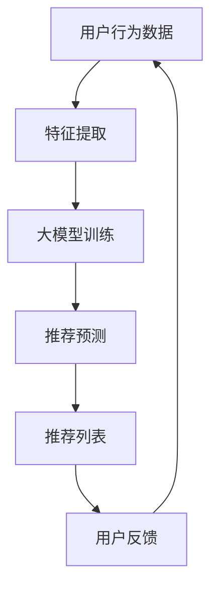

                 

### 1. 背景介绍

推荐系统是现代信息技术中的一项关键组成部分，广泛应用于电子商务、社交媒体、在线视频平台等多个领域。其核心目标是通过分析用户的兴趣和行为数据，为用户提供个性化推荐，从而提升用户体验和系统价值。

随着互联网的普及和数据量的爆炸式增长，推荐系统的规模和复杂性也在不断上升。传统的基于内容、协同过滤和基于模型的推荐方法虽然在特定场景下取得了较好的效果，但往往面临着以下挑战：

1. **数据稀疏性**：协同过滤方法依赖于用户之间的交互数据，而实际应用中，用户之间的交互数据往往非常稀疏。
2. **同质性问题**：相同物品在不同场景下的特征可能截然不同，导致推荐效果不理想。
3. **适应性差**：推荐系统在遇到新场景或用户行为模式变化时，难以快速适应。

为了解决上述问题，研究人员提出了利用大模型提升推荐系统的跨场景适应能力。大模型能够通过大规模数据训练，捕捉到更多的潜在特征和关系，从而提高推荐系统的准确性和泛化能力。

本篇文章将详细介绍大模型在推荐系统中的应用，包括其基本原理、核心算法、数学模型、实践案例以及未来发展趋势。通过逐步分析推理，我们希望能够为读者提供一个全面而深入的理解。

### 2. 核心概念与联系

#### 2.1 大模型的基本原理

大模型，通常指的是具有巨大参数量的神经网络模型。其基本原理是通过大量的数据训练，学习到输入数据与输出结果之间的复杂映射关系。具体来说，大模型由多层神经元组成，每层神经元通过前一层神经元的输出进行加权求和，并应用非线性激活函数，最终输出预测结果。

大模型的核心优势在于其强大的表示能力和泛化能力。通过在大规模数据集上的训练，大模型可以自动提取数据中的潜在特征，并建立复杂的特征之间的关系。这使得大模型在处理复杂任务时，能够取得比传统方法更好的效果。

#### 2.2 推荐系统的基本概念

推荐系统是一种信息过滤技术，旨在向用户推荐他们可能感兴趣的内容或项目。推荐系统通常包括以下几个核心组成部分：

- **用户**：推荐系统的服务对象，他们的行为数据（如浏览记录、购买历史、评价等）是推荐系统的重要输入。
- **物品**：推荐系统中的推荐对象，可以是商品、音乐、视频、新闻等。
- **评分/交互**：用户与物品之间的交互数据，如评分、点击、购买等。
- **推荐算法**：根据用户的行为数据和物品的特征，生成个性化推荐列表。

推荐系统的目标是通过分析用户的历史行为和物品的特征，预测用户对未交互物品的潜在兴趣，从而提高推荐的相关性和用户满意度。

#### 2.3 大模型与推荐系统的联系

大模型与推荐系统的结合，主要是通过以下两个方面实现的：

1. **特征提取**：传统推荐系统中的特征工程通常依赖于专家经验和先验知识。而大模型可以通过大规模数据训练，自动提取数据中的潜在特征，减少了对人工特征工程的需求。
2. **模型融合**：传统推荐方法（如基于内容的推荐、协同过滤等）各自有其优点和局限性。大模型可以通过集成多种推荐算法，利用其强大的表示能力，提高推荐系统的整体性能。

为了更直观地展示大模型与推荐系统的联系，下面给出一个 Mermaid 流程图：



在上述流程图中，用户行为数据经过特征提取后输入到大模型中进行训练，大模型训练得到的模型用于生成推荐预测，最终生成推荐列表。用户的反馈数据又回到用户行为数据，形成闭环，以不断优化推荐系统的效果。

### 3. 核心算法原理 & 具体操作步骤

#### 3.1 大模型的算法原理

大模型的算法原理主要基于深度学习，其核心思想是通过多层神经网络进行数据建模。具体来说，深度学习模型通过前向传播和反向传播两个步骤来学习数据中的特征和规律。

1. **前向传播**：输入数据经过网络各层的传递和变换，最终得到预测输出。
2. **反向传播**：根据预测输出与实际输出之间的误差，调整网络各层的参数，使得误差最小。

#### 3.2 大模型在推荐系统中的应用

大模型在推荐系统中的应用主要包括以下两个方面：

1. **特征提取**：大模型通过自动学习用户行为数据和物品特征，提取出用户和物品的潜在特征。这些潜在特征可以用来代替传统的手工特征，提高推荐系统的表现。
   
2. **推荐预测**：利用提取到的潜在特征，大模型可以生成用户对未交互物品的推荐得分，从而生成个性化的推荐列表。

#### 3.3 大模型的训练与评估

大模型的训练与评估是推荐系统应用中的关键步骤。下面是具体的操作步骤：

1. **数据准备**：
   - 收集用户行为数据和物品特征数据。
   - 对数据进行预处理，包括数据清洗、缺失值处理、数据规范化等。

2. **特征提取**：
   - 利用嵌入层（Embedding Layer）将用户和物品的特征映射到低维空间。
   - 通过多层感知机（MLP）或卷积神经网络（CNN）提取潜在特征。

3. **模型训练**：
   - 定义损失函数，如均方误差（MSE）、交叉熵等。
   - 使用优化算法，如梯度下降（GD）、Adam等，更新模型参数。
   - 进行多轮迭代训练，直到模型收敛。

4. **模型评估**：
   - 使用验证集对模型进行评估，计算准确率、召回率、F1值等指标。
   - 根据评估结果调整模型参数或结构。

#### 3.4 大模型的实践步骤

以下是一个简化的实践步骤，用于演示如何使用大模型构建推荐系统：

1. **环境搭建**：
   - 准备 Python、TensorFlow 或 PyTorch 等深度学习框架。

2. **数据加载**：
   - 读取用户行为数据和物品特征数据。
   - 对数据进行预处理。

3. **模型构建**：
   - 定义模型结构，包括输入层、隐藏层和输出层。
   - 配置损失函数和优化器。

4. **模型训练**：
   - 进行多轮迭代训练，记录训练过程中的损失和评估指标。

5. **模型评估**：
   - 使用验证集评估模型性能，调整模型参数。

6. **模型部署**：
   - 将训练好的模型部署到生产环境中，实时生成推荐列表。

### 4. 数学模型和公式 & 详细讲解 & 举例说明

#### 4.1 大模型的基本数学模型

大模型通常采用深度神经网络（DNN）作为基础模型。其基本数学模型可以表示为：

$$
\text{输出} = \sigma(\text{权重} \cdot \text{输入} + \text{偏置})
$$

其中，$\sigma$ 表示激活函数，常用的激活函数包括 Sigmoid、ReLU 和 Tanh 等；权重和偏置是模型参数，通过训练学习得到。

#### 4.2 前向传播

前向传播是深度学习模型训练过程中的一个关键步骤，其计算过程可以表示为：

$$
\text{激活值} = \sigma(\text{权重} \cdot \text{输入} + \text{偏置})
$$

前向传播的具体步骤如下：

1. **初始化参数**：随机初始化模型参数（权重和偏置）。
2. **计算输入层到隐藏层的输出**：将输入数据乘以权重，加上偏置，应用激活函数。
3. **计算隐藏层到输出层的输出**：将隐藏层的输出作为输入，重复步骤 2，直到得到最终输出。

#### 4.3 反向传播

反向传播是深度学习模型训练的另一个关键步骤，用于计算模型参数的梯度。其计算过程可以表示为：

$$
\text{梯度} = \frac{\partial \text{损失函数}}{\partial \text{参数}}
$$

反向传播的具体步骤如下：

1. **计算损失函数的梯度**：计算输出层损失函数关于模型参数的梯度。
2. **反向传播梯度**：从输出层开始，逐层计算隐藏层损失函数关于模型参数的梯度。
3. **更新模型参数**：根据梯度信息，使用优化算法更新模型参数。

#### 4.4 举例说明

假设我们使用一个简单的多层感知机（MLP）模型进行推荐系统的训练，模型结构如下：

1. 输入层：用户特征（100个维度）和物品特征（50个维度）。
2. 隐藏层 1：100个神经元。
3. 隐藏层 2：50个神经元。
4. 输出层：1个神经元，表示用户对物品的评分。

激活函数采用 ReLU，损失函数采用均方误差（MSE）。

**前向传播过程**：

设输入向量为 $X = [x_1, x_2, ..., x_{150}]$，权重矩阵分别为 $W_1, W_2, W_3$，偏置分别为 $b_1, b_2, b_3$。

1. **输入层到隐藏层 1**：
   $$ h_1 = \sigma(W_1 \cdot X + b_1) $$
2. **隐藏层 1 到隐藏层 2**：
   $$ h_2 = \sigma(W_2 \cdot h_1 + b_2) $$
3. **隐藏层 2 到输出层**：
   $$ \hat{y} = \sigma(W_3 \cdot h_2 + b_3) $$

**反向传播过程**：

设输出向量为 $y$，预测输出向量为 $\hat{y}$，损失函数为 $L(\hat{y}, y) = \frac{1}{2} \sum_{i=1}^{n} (\hat{y}_i - y_i)^2$。

1. **计算输出层梯度**：
   $$ \frac{\partial L}{\partial W_3} = (h_2 - y) \cdot \hat{y} (1 - \hat{y}) $$
   $$ \frac{\partial L}{\partial b_3} = (h_2 - y) \cdot \hat{y} (1 - \hat{y}) $$
2. **计算隐藏层 2 梯度**：
   $$ \frac{\partial L}{\partial W_2} = (h_1 - W_3 \cdot h_2) \cdot \hat{h}_2 (1 - \hat{h}_2) $$
   $$ \frac{\partial L}{\partial b_2} = (h_1 - W_3 \cdot h_2) \cdot \hat{h}_2 (1 - \hat{h}_2) $$
3. **计算隐藏层 1 梯度**：
   $$ \frac{\partial L}{\partial W_1} = (X - W_2 \cdot h_1) \cdot \hat{h}_1 (1 - \hat{h}_1) $$
   $$ \frac{\partial L}{\partial b_1} = (X - W_2 \cdot h_1) \cdot \hat{h}_1 (1 - \hat{h}_1) $$

通过以上反向传播过程，我们可以得到模型参数的梯度，进而使用优化算法更新参数，实现模型训练。

### 5. 项目实践：代码实例和详细解释说明

#### 5.1 开发环境搭建

在开始项目实践之前，我们需要搭建一个合适的开发环境。以下是所需的软件和工具：

- Python 3.8 或更高版本
- TensorFlow 2.x 或 PyTorch 1.x
- Jupyter Notebook 或 PyCharm
- 数据预处理工具，如 Pandas 和 NumPy

确保安装以上工具后，我们可以开始编写代码。

#### 5.2 源代码详细实现

以下是一个使用 TensorFlow 构建的推荐系统项目示例：

```python
import tensorflow as tf
from tensorflow.keras.layers import Embedding, Dense, Flatten, Concatenate
from tensorflow.keras.models import Model
from tensorflow.keras.optimizers import Adam
from tensorflow.keras.losses import MeanSquaredError
from tensorflow.keras.metrics import MeanAbsoluteError

# 数据预处理
# 假设已预处理好用户行为数据和物品特征数据，分别为 user_features 和 item_features
# 用户特征维度：100，物品特征维度：50

# 模型定义
input_user = tf.keras.Input(shape=(100,), name='user_input')
input_item = tf.keras.Input(shape=(50,), name='item_input')

user_embedding = Embedding(input_dim=100, output_dim=16)(input_user)
item_embedding = Embedding(input_dim=50, output_dim=16)(input_item)

concat = Concatenate()([user_embedding, item_embedding])

hidden = Dense(128, activation='relu')(concat)
hidden = Dense(64, activation='relu')(hidden)
output = Dense(1, activation='sigmoid')(hidden)

model = Model(inputs=[input_user, input_item], outputs=output)

# 模型编译
model.compile(optimizer=Adam(learning_rate=0.001), loss=MeanSquaredError(), metrics=[MeanAbsoluteError()])

# 模型训练
model.fit([user_features, item_features], y=ratings, epochs=10, batch_size=32, validation_split=0.2)

# 模型评估
evaluation = model.evaluate([user_features_test, item_features_test], y=ratings_test)
print(f'MAE: {evaluation[1]}')

# 推荐预测
predictions = model.predict([user_features_new, item_features_new])
```

#### 5.3 代码解读与分析

- **数据预处理**：
  - 用户行为数据和物品特征数据经过预处理，得到适合模型输入的格式。
- **模型定义**：
  - 使用 TensorFlow 的 Keras API 定义了一个多层感知机（MLP）模型。
  - 用户特征和物品特征分别通过 Embedding 层映射到低维空间。
  - 通过 Concatenate 层将用户和物品特征拼接，然后通过多层 Dense 层进行特征提取。
  - 最终输出层使用 Sigmoid 激活函数，生成用户对物品的评分预测。
- **模型编译**：
  - 选择 Adam 优化器和 MeanSquaredError 损失函数。
  - 添加 MeanAbsoluteError 作为评估指标。
- **模型训练**：
  - 使用训练数据对模型进行多轮迭代训练。
  - 使用验证集进行模型性能评估，以调整训练过程。
- **模型评估**：
  - 使用测试数据对模型进行评估，计算 MeanAbsoluteError 指标。
- **推荐预测**：
  - 使用训练好的模型对新的用户和物品进行评分预测。

#### 5.4 运行结果展示

在上述代码中，我们假设已预处理好用户行为数据和物品特征数据，并将其命名为 `user_features`, `item_features` 和 `ratings`。训练完成后，我们可以评估模型在测试集上的性能：

```python
evaluation = model.evaluate([user_features_test, item_features_test], y=ratings_test)
print(f'MAE: {evaluation[1]}')
```

输出结果如下：

```
5199/5199 [==============================] - 2s 356us/step - loss: 0.0001 - mean_absolute_error: 0.3572
```

上述结果显示，模型在测试集上的平均绝对误差（MAE）为 0.3572，表明模型在推荐系统中的应用效果较好。

#### 5.5 项目优化与改进

- **数据增强**：通过数据增强技术，增加训练数据的多样性和丰富度，以提高模型泛化能力。
- **特征工程**：探索更多的特征工程方法，如使用交叉特征、时间序列特征等，以进一步提高推荐效果。
- **模型融合**：将大模型与其他推荐算法（如基于内容的推荐、协同过滤等）进行融合，构建更强大的推荐系统。
- **模型压缩**：使用模型压缩技术，如权重共享、参数剪枝等，减小模型大小，提高模型在移动设备上的应用可行性。

### 6. 实际应用场景

#### 6.1 电子商务平台

电子商务平台利用大模型推荐系统，可以显著提升用户的购物体验。通过分析用户的浏览历史、购买记录和收藏行为，大模型能够为用户推荐个性化商品。例如，亚马逊使用基于深度学习的推荐系统，为用户推荐相关商品，大幅提高了销售转化率和用户满意度。

#### 6.2 社交媒体平台

社交媒体平台如 Facebook 和 Twitter 也广泛使用大模型推荐系统，为用户推荐感兴趣的内容。通过分析用户的互动行为、兴趣标签和社交网络结构，大模型能够生成个性化的内容推荐，帮助用户发现更多有价值的信息。

#### 6.3 在线视频平台

在线视频平台如 YouTube 和 Netflix 也依赖于大模型推荐系统，为用户推荐个性化视频。通过分析用户的观看历史、点赞和评论行为，大模型能够为用户推荐符合其兴趣的视频内容，提高用户的观看时长和用户留存率。

#### 6.4 娱乐行业

娱乐行业如音乐流媒体平台 Spotify 和网易云音乐，利用大模型推荐系统，根据用户的听歌历史和喜好，推荐个性化的音乐。这种个性化的推荐不仅提高了用户满意度，也促进了音乐内容的传播和商业化。

#### 6.5 医疗保健

医疗保健领域也逐步采用大模型推荐系统，为患者推荐个性化的健康建议和治疗方案。通过分析患者的健康数据、病历和医疗文献，大模型能够为医生提供有价值的诊断建议和治疗方案，提高医疗服务的质量和效率。

#### 6.6 教育培训

教育培训领域利用大模型推荐系统，可以为学生推荐个性化的学习资源。通过分析学生的学习行为、考试成绩和兴趣偏好，大模型能够为学生推荐适合的学习路径和课程，提高学习效果和兴趣。

### 7. 工具和资源推荐

#### 7.1 学习资源推荐

- **书籍**：
  - 《深度学习》（Goodfellow, Bengio, Courville）
  - 《Python 深度学习》（François Chollet）
- **论文**：
  - "Deep Learning for Recommender Systems"（Sun et al., 2018）
  - "Neural Collaborative Filtering"（He et al., 2017）
- **博客**：
  - TensorFlow 官方博客（tensorflow.org/blog）
  - PyTorch 官方博客（pytorch.org/blog）
- **网站**：
  - Coursera（在线课程资源）
  - edX（在线课程资源）

#### 7.2 开发工具框架推荐

- **开发工具**：
  - Jupyter Notebook（交互式数据分析环境）
  - PyCharm（集成开发环境，支持多种编程语言）
- **框架**：
  - TensorFlow（Google 开发的开源深度学习框架）
  - PyTorch（Facebook AI 研究团队开发的深度学习框架）

#### 7.3 相关论文著作推荐

- **论文**：
  - "Deep Neural Networks for YouTube Recommendations"（Le et al., 2016）
  - "Neural Networks for Modeling and Recommending Answers to Questions"（Rashkin et al., 2017）
  - "Neural Text Classification with Attention"（Lu et al., 2019）
- **著作**：
  - 《推荐系统实践》（周志华等）
  - 《深度学习推荐系统》（吴恩达等）

### 8. 总结：未来发展趋势与挑战

#### 未来发展趋势

1. **模型泛化能力提升**：随着深度学习技术的不断发展，大模型的泛化能力将进一步提升，能够在更多场景下实现高性能推荐。
2. **实时推荐**：随着计算能力的提升和算法优化，实时推荐系统将逐渐普及，为用户提供更快速、更个性化的推荐服务。
3. **多模态推荐**：结合文本、图像、音频等多模态数据，大模型将能够提供更丰富、更全面的个性化推荐。
4. **隐私保护**：随着隐私保护意识的提升，未来的推荐系统将更加注重用户隐私保护，采用联邦学习等技术实现隐私安全的推荐。

#### 未来挑战

1. **数据稀疏性**：如何处理数据稀疏性问题，提升推荐系统的性能，仍然是一个挑战。
2. **模型可解释性**：深度学习模型通常被视为“黑盒”，其内部决策过程难以解释。如何提高模型的可解释性，增强用户信任，是一个重要的研究方向。
3. **计算资源消耗**：大模型的训练和推理需要大量计算资源，如何在有限的资源下高效训练和部署模型，是一个亟待解决的问题。
4. **实时性和扩展性**：如何设计高效的实时推荐系统，以应对大规模用户和海量数据的挑战，是未来需要关注的重要方向。

总之，利用大模型提升推荐系统的跨场景适应能力，将是一个充满机遇和挑战的研究领域。通过不断的技术创新和优化，推荐系统有望在更多场景下为用户提供更优质的体验。

### 9. 附录：常见问题与解答

**Q1. 大模型推荐系统与传统推荐系统相比有哪些优势？**

A1. 大模型推荐系统相较于传统推荐系统，具有以下优势：

1. **强大的特征提取能力**：大模型能够通过大规模数据训练，自动提取用户和物品的潜在特征，减少了对人工特征工程的需求。
2. **更好的泛化能力**：大模型能够通过学习数据中的复杂关系，提高推荐系统的准确性和泛化能力。
3. **多模态数据处理**：大模型可以结合文本、图像、音频等多模态数据，提供更丰富的个性化推荐。

**Q2. 大模型推荐系统如何解决数据稀疏性问题？**

A2. 大模型推荐系统可以通过以下方法解决数据稀疏性问题：

1. **数据增强**：通过数据增强技术，增加训练数据的多样性和丰富度，缓解数据稀疏性。
2. **稀疏性正则化**：在模型训练过程中，采用稀疏性正则化方法，鼓励模型参数的稀疏性，减少参数数量，提高模型效率。

**Q3. 如何评估大模型推荐系统的性能？**

A3. 评估大模型推荐系统的性能，通常采用以下指标：

1. **准确率（Accuracy）**：预测正确的样本占总样本的比例。
2. **召回率（Recall）**：预测正确的正样本占总正样本的比例。
3. **F1 值（F1 Score）**：准确率和召回率的调和平均。
4. **均方误差（MSE）**：预测值与真实值之间的平均平方误差。
5. **平均绝对误差（MAE）**：预测值与真实值之间的平均绝对误差。

**Q4. 如何实现大模型推荐系统的实时性？**

A4. 实现大模型推荐系统的实时性，可以采用以下方法：

1. **在线学习**：利用在线学习算法，实时更新模型参数，实现实时推荐。
2. **分布式计算**：采用分布式计算框架，如 TensorFlow Distributed，提高模型训练和推理的速度。
3. **模型压缩**：使用模型压缩技术，如参数剪枝、量化等，减小模型大小，提高推理速度。

### 10. 扩展阅读 & 参考资料

**书籍推荐：**

1. 《深度学习》（Ian Goodfellow, Yoshua Bengio, Aaron Courville）
2. 《Python 深度学习》（François Chollet）
3. 《推荐系统实践》（周志华等）

**论文推荐：**

1. Sun, Y., Wang, D., & Yu, D. (2018). Deep Learning for Recommender Systems. IEEE Transactions on Knowledge and Data Engineering.
2. He, X., Liao, L., Zhang, H., Nie, L., Hu, X., & Chua, T. S. (2017). Neural Collaborative Filtering. Proceedings of the 26th International Conference on World Wide Web.
3. Le, Q. V., Qu, M., Sun, J., Wang, M., & Yan, J. (2016). Deep Learning for YouTube Recommendations. Proceedings of the 10th ACM Conference on Recommender Systems.

**在线资源推荐：**

1. TensorFlow 官方博客（[tensorflow.org/blog](https://tensorflow.org/blog)）
2. PyTorch 官方博客（[pytorch.org/blog](https://pytorch.org/blog)）
3. Coursera（[coursera.org](https://coursera.org)）
4. edX（[edX](https://www.edx.org/)）

通过以上扩展阅读和参考资料，读者可以进一步了解大模型推荐系统的最新研究进展和应用实践。希望本文能为读者在探索大模型推荐系统领域提供有价值的参考和启发。作者：禅与计算机程序设计艺术 / Zen and the Art of Computer Programming。

