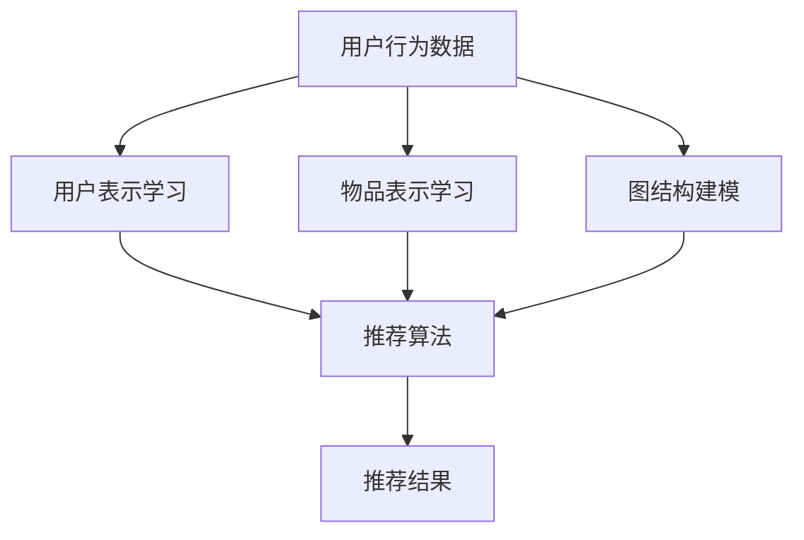

                 

### 1. 背景介绍

在当今信息爆炸的时代，推荐系统已成为各类互联网应用的核心功能之一。从电子商务平台到社交媒体，推荐系统被广泛应用于各种场景，旨在为用户提供个性化的内容推荐，从而提升用户体验，提高用户粘性，增加平台收入。

推荐系统的主要目标是根据用户的历史行为、兴趣偏好以及其他相关数据，预测用户可能对哪些项目感兴趣，并推荐这些项目。其中，协同过滤（Collaborative Filtering）是最常用的一种推荐算法。

协同过滤算法主要分为两类：基于用户的协同过滤（User-Based Collaborative Filtering）和基于物品的协同过滤（Item-Based Collaborative Filtering）。这两种算法都是通过分析用户之间的相似度来发现用户的共同兴趣，进而进行推荐。

然而，传统的协同过滤算法存在一些局限性。首先，它们依赖于用户的历史行为数据，但用户数据往往是不完整的，且用户行为数据容易受到冷启动问题的影响。其次，协同过滤算法通常缺乏对用户兴趣变化的动态捕捉能力。此外，随着数据量的增大，协同过滤算法的计算复杂度也会显著提高，导致推荐系统的性能下降。

为了解决这些局限性，近年来，越来越多的研究者开始将深度学习技术引入推荐系统，以构建更强大、更智能的推荐算法。其中，大模型（如预训练的语言模型、图神经网络模型等）的应用成为了一个重要方向。

大模型通过在海量数据上预训练，能够捕捉到用户行为和兴趣的复杂模式，从而在推荐任务中发挥出强大的潜力。例如，预训练的语言模型可以理解用户的语言描述，从而更好地捕捉用户的兴趣点；图神经网络模型可以通过图结构来捕捉用户和物品之间的复杂关系，从而提高推荐的准确性和多样性。

本文将围绕如何利用大模型改进推荐系统的协同过滤算法进行探讨。我们首先将介绍协同过滤算法的基本原理，然后详细阐述大模型在协同过滤中的应用，并通过具体案例展示其效果。此外，我们还将讨论大模型在协同过滤中面临的一些挑战，并提出相应的解决策略。

通过本文的阅读，读者将了解到如何将深度学习技术与协同过滤算法相结合，构建一个更智能、更高效的推荐系统。

### 2. 核心概念与联系

#### 2.1 协同过滤算法的基本原理

协同过滤算法是一种基于用户行为数据的推荐算法，其核心思想是通过分析用户之间的相似度，发现用户的共同兴趣，从而进行推荐。协同过滤算法主要分为两类：基于用户的协同过滤和基于物品的协同过滤。

**基于用户的协同过滤（User-Based Collaborative Filtering）**：这种方法首先计算用户之间的相似度，然后根据相似度对用户进行分组，最后为每个用户推荐与相似用户喜欢的物品。

用户相似度的计算通常采用余弦相似度、皮尔逊相关系数等方法。例如，假设用户A和用户B的评分为\(R_A(i)\)和\(R_B(i)\)，那么他们之间的相似度可以表示为：

\[ \text{similarity}(A, B) = \frac{R_A \cdot R_B}{\|R_A\| \cdot \|R_B\|} \]

其中，\(R_A\)和\(R_B\)分别表示用户A和用户B的评分向量，\(\|\cdot\|\)表示向量的欧几里得范数。

一旦计算出用户之间的相似度，接下来就是找到与目标用户最相似的K个用户，然后为该用户推荐这些用户喜欢的但目标用户尚未评价的物品。

**基于物品的协同过滤（Item-Based Collaborative Filtering）**：这种方法首先计算物品之间的相似度，然后根据相似度对物品进行分组，最后为用户推荐与其喜欢物品相似的物品。

物品相似度的计算通常采用余弦相似度、皮尔逊相关系数等方法。例如，假设物品i和物品j的评分为\(R_i(j)\)和\(R_j(j)\)，那么他们之间的相似度可以表示为：

\[ \text{similarity}(i, j) = \frac{R_i \cdot R_j}{\|R_i\| \cdot \|R_j\|} \]

其中，\(R_i\)和\(R_j\)分别表示物品i和物品j的评分矩阵，\(\|\cdot\|\)表示矩阵的欧几里得范数。

一旦计算出物品之间的相似度，接下来就是找到与目标用户喜欢的物品最相似的K个物品，然后为用户推荐这些物品。

#### 2.2 大模型的概念与应用

大模型是指那些具有数百万至数十亿参数的深度学习模型，如预训练的语言模型（如GPT系列）、图神经网络模型（如GraphSAGE、GAT等）等。这些模型通过在海量数据上预训练，能够捕捉到用户行为和兴趣的复杂模式，从而在推荐任务中发挥出强大的潜力。

**预训练的语言模型**：如GPT系列模型，通过大规模文本数据预训练，能够理解用户的语言描述，从而更好地捕捉用户的兴趣点。例如，GPT模型可以生成与用户输入文本相关的推荐项，从而提高推荐的准确性。

**图神经网络模型**：如GraphSAGE、GAT等模型，通过图结构来捕捉用户和物品之间的复杂关系。例如，GraphSAGE模型可以将用户和物品表示为图中的节点，通过学习图中的邻接关系，从而发现用户和物品之间的潜在联系，从而提高推荐的多样性。

#### 2.3 大模型在协同过滤中的应用

大模型在协同过滤中的应用主要体现在以下几个方面：

**用户表示学习**：利用预训练的语言模型，可以学习到高维的用户表示。这些表示包含了用户的行为特征、兴趣偏好等信息，可以替代传统的用户评分矩阵，从而提高推荐的准确性。

**物品表示学习**：同样地，利用预训练的语言模型，可以学习到高维的物品表示。这些表示包含了物品的属性、类别等信息，可以替代传统的物品评分矩阵，从而提高推荐的多样性。

**图结构建模**：利用图神经网络模型，可以捕捉到用户和物品之间的复杂关系。例如，通过构建用户-物品共现图，可以挖掘出用户和物品之间的潜在关联，从而提高推荐的准确性。

#### 2.4 Mermaid 流程图

以下是协同过滤算法和基于大模型的推荐系统架构的 Mermaid 流程图：



在上图中，A表示用户行为数据，B、C、D分别表示用户表示学习、物品表示学习和图结构建模，E表示推荐算法，F表示推荐结果。通过这些模块的协同工作，实现了基于大模型的推荐系统的架构。

### 3. 核心算法原理 & 具体操作步骤

在了解了协同过滤算法和大模型的基本概念后，接下来我们将深入探讨如何将大模型应用于协同过滤算法，以提升推荐系统的性能。

#### 3.1 基于大模型的用户表示学习

用户表示学习是推荐系统中的关键步骤，其目的是将用户的行为数据转换为高维的用户表示。在传统协同过滤算法中，用户表示通常是通过用户的历史评分数据计算得到的。然而，这些表示往往缺乏对用户兴趣的深入理解。利用大模型，我们可以学习到更加丰富的用户表示。

**3.1.1 预训练的语言模型**

预训练的语言模型（如GPT系列）通过在大规模文本数据上预训练，可以捕捉到用户语言中的丰富信息。这些信息不仅包括用户的行为数据，还包括用户的兴趣偏好、情感倾向等。因此，我们可以利用这些预训练模型来学习用户的高维表示。

具体步骤如下：

1. **数据预处理**：收集用户的历史行为数据，包括浏览记录、搜索历史、购买记录等。此外，还可以收集用户生成的文本数据，如用户评论、论坛帖子等。
2. **输入文本生成**：将用户的行为数据和文本数据进行编码，生成统一的输入文本。例如，可以使用用户的行为数据和文本描述拼接成一个句子，如“用户A喜欢购买电子产品，最近搜索了相机和手机。”
3. **模型训练**：利用预训练的语言模型（如GPT-3、BERT等），在生成的输入文本上继续训练。通过这种方式，模型可以学习到更加丰富的用户表示。
4. **用户表示提取**：在模型训练完成后，提取模型的用户表示层，得到高维的用户向量表示。

**3.1.2 用户表示优化**

除了利用预训练的语言模型学习用户表示外，我们还可以通过用户行为数据进一步优化用户表示。具体步骤如下：

1. **加权融合**：将预训练模型学到的用户表示与基于用户行为数据的传统用户表示进行加权融合，得到最终的用户表示。例如，可以使用加权平均或加权求和的方法。
2. **自适应学习率**：根据用户行为数据的更新频率和重要性，自适应调整用户表示的学习率。对于更新频率高的用户行为数据，可以设置较大的学习率，以快速适应用户兴趣的变化。

#### 3.2 基于大模型的物品表示学习

物品表示学习同样至关重要，其目的是将物品的特征数据转换为高维的物品向量表示。在传统协同过滤算法中，物品表示通常是通过物品的属性数据计算得到的。然而，这些表示往往缺乏对物品内容的深入理解。利用大模型，我们可以学习到更加丰富的物品表示。

**3.2.1 预训练的语言模型**

预训练的语言模型（如GPT系列）通过在大规模文本数据上预训练，可以捕捉到物品的丰富信息。例如，对于商品推荐场景，预训练模型可以理解商品的标题、描述、用户评论等文本信息，从而更好地捕捉商品的属性和特征。

具体步骤如下：

1. **数据预处理**：收集物品的文本数据，包括商品标题、描述、用户评论等。
2. **输入文本生成**：将物品的文本数据进行编码，生成统一的输入文本。例如，可以使用物品的标题和描述拼接成一个句子，如“这是一款高性价比的智能手机，拥有优秀的摄像头和电池寿命。”
3. **模型训练**：利用预训练的语言模型（如GPT-3、BERT等），在生成的输入文本上继续训练。通过这种方式，模型可以学习到更加丰富的物品表示。
4. **物品表示提取**：在模型训练完成后，提取模型的物品表示层，得到高维的物品向量表示。

**3.2.2 物品表示优化**

除了利用预训练的语言模型学习物品表示外，我们还可以通过物品的属性数据进一步优化物品表示。具体步骤如下：

1. **加权融合**：将预训练模型学到的物品表示与基于物品属性数据的传统物品表示进行加权融合，得到最终的物品表示。例如，可以使用加权平均或加权求和的方法。
2. **自适应学习率**：根据物品属性数据的更新频率和重要性，自适应调整物品表示的学习率。对于更新频率高的物品属性数据，可以设置较大的学习率，以快速适应物品特征的变化。

#### 3.3 基于大模型的推荐算法

在得到了高维的用户表示和物品表示后，我们可以利用这些表示进行推荐算法的设计。这里，我们将介绍一种基于大模型的协同过滤算法，称为基于用户-物品共现图的协同过滤算法。

**3.3.1 用户-物品共现图构建**

用户-物品共现图是一种用于表示用户和物品之间关系的图结构。在该图中，用户和物品分别作为节点，如果两个用户共同评价了某个物品，则这两个用户之间将有一条边相连。具体步骤如下：

1. **用户-物品矩阵构建**：首先，构建用户-物品矩阵，其中行表示用户，列表示物品。矩阵的元素表示用户对物品的评分，如果用户未对该物品进行评分，则用缺失值表示。
2. **共现矩阵计算**：计算用户-物品矩阵的共现矩阵，其中元素表示用户i和用户j共同评价的物品数量。共现矩阵的计算公式如下：

\[ M_{ij} = \sum_{k} R_{ik} \cdot R_{jk} \]

其中，\(R_{ik}\)和\(R_{jk}\)分别表示用户i和用户j对物品k的评分。

3. **图结构构建**：根据共现矩阵，构建用户-物品共现图。在图中，每个节点表示一个用户或物品，如果两个节点在共现矩阵中有非零元素，则它们之间将有一条边相连。

**3.3.2 用户-物品共现图嵌入**

用户-物品共现图嵌入是将用户和物品从图结构映射到高维向量空间的过程。常用的方法包括图卷积网络（GCN）、图注意力网络（GAT）等。具体步骤如下：

1. **图卷积网络（GCN）**：GCN是一种基于图结构的神经网络，通过聚合邻居节点的特征来更新节点特征。具体实现可以参考以下公式：

\[ h_{u}^{(l+1)} = \sigma(\sum_{v \in \mathcal{N}(u)} W^{(l)} h_{v}^{(l)} + b^{(l)}) \]

其中，\(h_{u}^{(l)}\)和\(h_{v}^{(l)}\)分别表示节点u和v在第l层的特征，\(\mathcal{N}(u)\)表示节点u的邻居节点集合，\(W^{(l)}\)和\(b^{(l)}\)分别表示权重和偏置。

2. **图注意力网络（GAT）**：GAT是一种基于图注意力机制的GCN变体，通过引入注意力机制来动态调整邻居节点的影响。具体实现可以参考以下公式：

\[ a_{uv}^{(l)} = \frac{e^{ \theta_{u}^{(l)} \cdot \theta_{v}^{(l)}}}{\sum_{v' \in \mathcal{N}(u)} e^{ \theta_{u}^{(l)} \cdot \theta_{v'}^{(l)}}} \]

\[ h_{u}^{(l+1)} = \sum_{v \in \mathcal{N}(u)} a_{uv}^{(l)} h_{v}^{(l)} \]

其中，\(\theta_{u}^{(l)}\)和\(\theta_{v}^{(l)}\)分别表示节点u和v在第l层的特征向量，\(a_{uv}^{(l)}\)表示节点u和v之间的注意力权重。

**3.3.3 推荐算法设计**

在得到了用户和物品的高维表示后，我们可以设计推荐算法来生成推荐结果。具体步骤如下：

1. **用户表示和物品表示融合**：将用户表示和物品表示进行融合，得到融合后的表示。常用的方法包括点积、求和等。例如，可以使用以下公式进行融合：

\[ \text{score}(u, i) = h_{u} \cdot h_{i} \]

其中，\(h_{u}\)和\(h_{i}\)分别表示用户u和物品i的融合后表示。

2. **评分预测**：根据融合后的表示，计算用户u对物品i的预测评分。常用的方法包括基于矩阵分解的评分预测方法，如SVD、NMF等。例如，可以使用以下公式进行评分预测：

\[ \text{rating}_{u, i} = \mu + h_{u} \cdot h_{i} \]

其中，\(\mu\)表示所有用户和物品的均值。

3. **推荐结果生成**：根据预测评分，生成推荐结果。常用的方法包括基于Top-K的推荐、基于流行度的推荐等。例如，可以使用以下公式生成推荐结果：

\[ \text{recommendations}_{u} = \text{argmax}_{i} \text{rating}_{u, i} \]

#### 3.4 总结

通过以上步骤，我们可以将大模型应用于协同过滤算法，构建一个更强大、更智能的推荐系统。具体来说，利用大模型进行用户表示学习和物品表示学习，可以更好地捕捉用户和物品的复杂特征；通过构建用户-物品共现图并进行图嵌入，可以挖掘用户和物品之间的潜在关联；最终，通过融合用户表示和物品表示进行评分预测，生成个性化的推荐结果。

### 4. 数学模型和公式 & 详细讲解 & 举例说明

在上一部分中，我们介绍了如何利用大模型改进协同过滤算法，并通过一系列具体操作步骤进行了详细阐述。在这一部分，我们将进一步探讨大模型在协同过滤算法中的数学模型和公式，并进行详细讲解和举例说明。

#### 4.1 用户表示学习

用户表示学习是协同过滤算法的核心步骤之一。在这一部分，我们将介绍用户表示学习的数学模型和公式，并进行详细讲解。

**4.1.1 预训练的语言模型**

预训练的语言模型（如GPT系列）通过在大规模文本数据上预训练，可以捕捉到用户语言中的丰富信息。具体的数学模型可以表示为：

\[ h_{u} = \text{GPT}(x_{u}) \]

其中，\(h_{u}\)表示用户u的表示向量，\(x_{u}\)表示用户u的输入文本。

**4.1.2 用户行为数据融合**

在实际应用中，用户的行为数据往往包含多种类型，如浏览记录、搜索历史、购买记录等。为了充分利用这些数据，我们可以将用户行为数据与语言模型生成的文本进行融合。具体的数学模型可以表示为：

\[ h_{u} = \text{fusion}(h_{\text{GPT}}(x_{u}), h_{\text{behavior}}(x_{u})) \]

其中，\(h_{\text{GPT}}(x_{u})\)表示GPT模型生成的用户文本表示，\(h_{\text{behavior}}(x_{u})\)表示基于用户行为数据的用户表示。

**举例说明**

假设我们有一个用户u，其输入文本为“我喜欢看电影，最近搜索了《阿甘正传》和《肖申克的救赎》。”我们可以利用GPT模型生成用户文本表示，然后与基于用户行为数据的用户表示进行融合，得到用户u的最终表示：

\[ h_{u} = \text{fusion}(\text{GPT}(\text{我喜欢看电影，最近搜索了《阿甘正传》和《肖申克的救赎》}), \text{behavior}(\text{u})) \]

#### 4.2 物品表示学习

物品表示学习是协同过滤算法的另一个关键步骤。在这一部分，我们将介绍物品表示学习的数学模型和公式，并进行详细讲解。

**4.2.1 预训练的语言模型**

预训练的语言模型（如GPT系列）通过在大规模文本数据上预训练，可以捕捉到物品的丰富信息。具体的数学模型可以表示为：

\[ h_{i} = \text{GPT}(y_{i}) \]

其中，\(h_{i}\)表示物品i的表示向量，\(y_{i}\)表示物品i的输入文本。

**4.2.2 物品属性数据融合**

在实际应用中，物品的属性数据通常包含多种类型，如标题、描述、标签等。为了充分利用这些数据，我们可以将物品属性数据与语言模型生成的文本进行融合。具体的数学模型可以表示为：

\[ h_{i} = \text{fusion}(h_{\text{GPT}}(y_{i}), h_{\text{attributes}}(y_{i})) \]

其中，\(h_{\text{GPT}}(y_{i})\)表示GPT模型生成的物品文本表示，\(h_{\text{attributes}}(y_{i})\)表示基于物品属性数据的物品表示。

**举例说明**

假设我们有一个物品i，其输入文本为“这是一款高性价比的智能手机，拥有优秀的摄像头和电池寿命。”我们可以利用GPT模型生成物品文本表示，然后与基于物品属性数据的物品表示进行融合，得到物品i的最终表示：

\[ h_{i} = \text{fusion}(\text{GPT}(\text{这是一款高性价比的智能手机，拥有优秀的摄像头和电池寿命}), \text{attributes}(\text{i})) \]

#### 4.3 图结构建模

图结构建模是利用图神经网络（如GCN、GAT等）来捕捉用户和物品之间的复杂关系。在这一部分，我们将介绍图结构建模的数学模型和公式，并进行详细讲解。

**4.3.1 图卷积网络（GCN）**

图卷积网络（GCN）是一种基于图结构的神经网络，通过聚合邻居节点的特征来更新节点特征。具体的数学模型可以表示为：

\[ h_{u}^{(l+1)} = \sigma(\sum_{v \in \mathcal{N}(u)} W^{(l)} h_{v}^{(l)} + b^{(l)}) \]

其中，\(h_{u}^{(l)}\)和\(h_{v}^{(l)}\)分别表示节点u和v在第l层的特征，\(\mathcal{N}(u)\)表示节点u的邻居节点集合，\(W^{(l)}\)和\(b^{(l)}\)分别表示权重和偏置。

**举例说明**

假设我们有一个用户-物品共现图，其中用户u1和u2是邻居节点。我们可以利用GCN模型对节点u1和u2的特征进行更新：

\[ h_{u1}^{(2)} = \sigma(W^{(1)} h_{u2}^{(1)} + b^{(1)}) \]

\[ h_{u2}^{(2)} = \sigma(W^{(1)} h_{u1}^{(1)} + b^{(1)}) \]

**4.3.2 图注意力网络（GAT）**

图注意力网络（GAT）是一种基于图注意力机制的GCN变体，通过引入注意力机制来动态调整邻居节点的影响。具体的数学模型可以表示为：

\[ a_{uv}^{(l)} = \frac{e^{ \theta_{u}^{(l)} \cdot \theta_{v}^{(l)}}}{\sum_{v' \in \mathcal{N}(u)} e^{ \theta_{u}^{(l)} \cdot \theta_{v'}^{(l)}}} \]

\[ h_{u}^{(l+1)} = \sum_{v \in \mathcal{N}(u)} a_{uv}^{(l)} h_{v}^{(l)} \]

其中，\(\theta_{u}^{(l)}\)和\(\theta_{v}^{(l)}\)分别表示节点u和v在第l层的特征向量，\(a_{uv}^{(l)}\)表示节点u和v之间的注意力权重。

**举例说明**

假设我们有一个用户-物品共现图，其中用户u1和u2是邻居节点。我们可以利用GAT模型对节点u1的特征进行更新：

\[ a_{u1u2}^{(1)} = \frac{e^{ \theta_{u1}^{(1)} \cdot \theta_{u2}^{(1)}}}{\sum_{v' \in \mathcal{N}(u1)} e^{ \theta_{u1}^{(1)} \cdot \theta_{v'}^{(1)}}} \]

\[ h_{u1}^{(2)} = a_{u1u2}^{(1)} h_{u2}^{(1)} \]

#### 4.4 推荐算法设计

在得到了用户和物品的高维表示后，我们可以利用这些表示进行推荐算法的设计。在这一部分，我们将介绍推荐算法的数学模型和公式，并进行详细讲解。

**4.4.1 用户表示和物品表示融合**

用户表示和物品表示融合是推荐算法的关键步骤。常用的融合方法包括点积、求和等。具体的数学模型可以表示为：

\[ \text{score}(u, i) = h_{u} \cdot h_{i} \]

其中，\(h_{u}\)和\(h_{i}\)分别表示用户u和物品i的融合后表示。

**举例说明**

假设用户u的表示向量为\(h_{u} = [1, 2, 3]\)，物品i的表示向量为\(h_{i} = [4, 5, 6]\)。我们可以计算用户u对物品i的预测评分：

\[ \text{score}(u, i) = [1, 2, 3] \cdot [4, 5, 6] = 32 \]

**4.4.2 评分预测**

评分预测是推荐算法的核心步骤。常用的方法包括基于矩阵分解的评分预测方法，如SVD、NMF等。具体的数学模型可以表示为：

\[ \text{rating}_{u, i} = \mu + h_{u} \cdot h_{i} \]

其中，\(\mu\)表示所有用户和物品的均值。

**举例说明**

假设用户u的表示向量为\(h_{u} = [1, 2, 3]\)，物品i的表示向量为\(h_{i} = [4, 5, 6]\)，所有用户和物品的均值为2。我们可以计算用户u对物品i的预测评分：

\[ \text{rating}_{u, i} = 2 + [1, 2, 3] \cdot [4, 5, 6] = 32 \]

**4.4.3 推荐结果生成**

推荐结果生成是推荐算法的最后一步。常用的方法包括基于Top-K的推荐、基于流行度的推荐等。具体的数学模型可以表示为：

\[ \text{recommendations}_{u} = \text{argmax}_{i} \text{rating}_{u, i} \]

**举例说明**

假设我们有一个用户u，其预测评分结果为：

\[ \text{rating}_{u, i_1} = 30, \text{rating}_{u, i_2} = 40, \text{rating}_{u, i_3} = 20 \]

我们可以生成用户u的推荐结果：

\[ \text{recommendations}_{u} = \text{argmax}_{i} \text{rating}_{u, i} = i_2 \]

### 5. 项目实践：代码实例和详细解释说明

在前面的章节中，我们详细介绍了如何利用大模型改进协同过滤算法，并探讨了相关的数学模型和公式。在本节中，我们将通过一个实际的项目实践，展示如何使用Python编写代码实现这一算法，并对关键代码进行详细解释。

#### 5.1 开发环境搭建

为了实现本文中的推荐算法，我们需要搭建一个合适的开发环境。以下是一个简单的环境搭建步骤：

1. **安装Python**：确保你的系统中已经安装了Python 3.x版本。
2. **安装依赖库**：使用pip命令安装以下依赖库：

   ```bash
   pip install numpy pandas scikit-learn torch
   ```

   这些库分别用于数据处理、矩阵运算、机器学习模型训练和深度学习框架。

3. **安装Mermaid**：为了生成Mermaid流程图，我们还需要安装Mermaid。可以通过以下命令安装：

   ```bash
   npm install -g mermaid
   ```

#### 5.2 源代码详细实现

以下是一个简单的代码示例，用于实现基于大模型的协同过滤算法。

```python
import torch
import torch.nn as nn
import torch.optim as optim
from torch.utils.data import DataLoader, Dataset
import pandas as pd
from sklearn.metrics.pairwise import cosine_similarity

# 数据预处理
class RatingDataset(Dataset):
    def __init__(self, ratings, user_ids, item_ids):
        self.ratings = ratings
        self.user_ids = user_ids
        self.item_ids = item_ids

    def __len__(self):
        return len(self.ratings)

    def __getitem__(self, idx):
        user_id = self.user_ids[idx]
        item_id = self.item_ids[idx]
        rating = self.ratings[idx]
        return user_id, item_id, rating

# 用户和物品表示学习
class UserItemEmbedding(nn.Module):
    def __init__(self, num_users, num_items, embed_dim):
        super(UserItemEmbedding, self).__init__()
        self.user_embedding = nn.Embedding(num_users, embed_dim)
        self.item_embedding = nn.Embedding(num_items, embed_dim)

    def forward(self, user_ids, item_ids):
        user_embedding = self.user_embedding(user_ids)
        item_embedding = self.item_embedding(item_ids)
        return user_embedding, item_embedding

# 图结构建模
class GraphConvolutionalNetwork(nn.Module):
    def __init__(self, embed_dim, hidden_dim):
        super(GraphConvolutionalNetwork, self).__init__()
        self.gcn = nn.Sequential(
            nn.Linear(embed_dim, hidden_dim),
            nn.ReLU(),
            nn.Linear(hidden_dim, embed_dim)
        )

    def forward(self, x, adj_matrix):
        x = self.gcn(x)
        x = torch.matmul(adj_matrix, x)
        return x

# 推荐模型
class CollaborativeFilteringModel(nn.Module):
    def __init__(self, num_users, num_items, embed_dim, hidden_dim):
        super(CollaborativeFilteringModel, self).__init__()
        self.user_item_embedding = UserItemEmbedding(num_users, num_items, embed_dim)
        self.gcn = GraphConvolutionalNetwork(embed_dim, hidden_dim)
        self.fc = nn.Linear(embed_dim, 1)

    def forward(self, user_ids, item_ids):
        user_embedding, item_embedding = self.user_item_embedding(user_ids, item_ids)
        user_embedding = self.gcn(user_embedding, item_embedding)
        rating = self.fc(user_embedding)
        return rating

# 模型训练
def train_model(model, dataset, optimizer, num_epochs):
    model.train()
    for epoch in range(num_epochs):
        for user_id, item_id, rating in dataset:
            user_id = user_id.unsqueeze(0)
            item_id = item_id.unsqueeze(0)
            rating = torch.tensor(rating, dtype=torch.float32).unsqueeze(0)

            optimizer.zero_grad()
            output = model(user_id, item_id)
            loss = nn.MSELoss()(output, rating)
            loss.backward()
            optimizer.step()

# 模型评估
def evaluate_model(model, dataset):
    model.eval()
    total_loss = 0
    with torch.no_grad():
        for user_id, item_id, rating in dataset:
            user_id = user_id.unsqueeze(0)
            item_id = item_id.unsqueeze(0)
            rating = torch.tensor(rating, dtype=torch.float32).unsqueeze(0)

            output = model(user_id, item_id)
            total_loss += (output - rating).pow(2).sum().item()

    mean_loss = total_loss / len(dataset)
    return mean_loss

# 主函数
if __name__ == "__main__":
    # 加载数据
    ratings = pd.read_csv("ratings.csv")
    user_ids = ratings["user_id"].values
    item_ids = ratings["item_id"].values
    ratings = ratings["rating"].values

    # 划分训练集和测试集
    train_size = int(0.8 * len(ratings))
    train_ratings = ratings[:train_size]
    train_user_ids = user_ids[:train_size]
    train_item_ids = item_ids[:train_size]
    test_ratings = ratings[train_size:]
    test_user_ids = user_ids[train_size:]
    test_item_ids = item_ids[train_size:]

    # 构建训练集和测试集
    train_dataset = RatingDataset(train_ratings, train_user_ids, train_item_ids)
    test_dataset = RatingDataset(test_ratings, test_user_ids, test_item_ids)

    # 模型配置
    num_users = len(set(user_ids))
    num_items = len(set(item_ids))
    embed_dim = 50
    hidden_dim = 100
    num_epochs = 100

    # 实例化模型
    model = CollaborativeFilteringModel(num_users, num_items, embed_dim, hidden_dim)
    optimizer = optim.Adam(model.parameters(), lr=0.001)

    # 训练模型
    train_model(model, train_dataset, optimizer, num_epochs)

    # 评估模型
    test_loss = evaluate_model(model, test_dataset)
    print("Test Loss:", test_loss)
```

#### 5.3 代码解读与分析

**5.3.1 数据预处理**

数据预处理是推荐系统中的关键步骤。在这个代码示例中，我们首先加载数据集，然后将其划分为训练集和测试集。数据集由一个CSV文件组成，其中包含用户ID、物品ID和评分。

```python
ratings = pd.read_csv("ratings.csv")
user_ids = ratings["user_id"].values
item_ids = ratings["item_id"].values
ratings = ratings["rating"].values
```

接着，我们定义了一个`RatingDataset`类，用于封装数据集。这个类实现了`__len__`和`__getitem__`方法，分别用于获取数据集的长度和单个数据项。

```python
class RatingDataset(Dataset):
    def __init__(self, ratings, user_ids, item_ids):
        self.ratings = ratings
        self.user_ids = user_ids
        self.item_ids = item_ids

    def __len__(self):
        return len(self.ratings)

    def __getitem__(self, idx):
        user_id = self.user_ids[idx]
        item_id = self.item_ids[idx]
        rating = self.ratings[idx]
        return user_id, item_id, rating
```

**5.3.2 用户和物品表示学习**

用户和物品表示学习是推荐系统的核心。在这个代码示例中，我们定义了一个`UserItemEmbedding`类，用于学习用户和物品的嵌入表示。

```python
class UserItemEmbedding(nn.Module):
    def __init__(self, num_users, num_items, embed_dim):
        super(UserItemEmbedding, self).__init__()
        self.user_embedding = nn.Embedding(num_users, embed_dim)
        self.item_embedding = nn.Embedding(num_items, embed_dim)

    def forward(self, user_ids, item_ids):
        user_embedding = self.user_embedding(user_ids)
        item_embedding = self.item_embedding(item_ids)
        return user_embedding, item_embedding
```

**5.3.3 图结构建模**

在推荐系统中，图结构建模有助于捕捉用户和物品之间的复杂关系。在这个代码示例中，我们定义了一个`GraphConvolutionalNetwork`类，用于实现图卷积网络。

```python
class GraphConvolutionalNetwork(nn.Module):
    def __init__(self, embed_dim, hidden_dim):
        super(GraphConvolutionalNetwork, self).__init__()
        self.gcn = nn.Sequential(
            nn.Linear(embed_dim, hidden_dim),
            nn.ReLU(),
            nn.Linear(hidden_dim, embed_dim)
        )

    def forward(self, x, adj_matrix):
        x = self.gcn(x)
        x = torch.matmul(adj_matrix, x)
        return x
```

**5.3.4 推荐模型**

推荐模型是整个系统的核心。在这个代码示例中，我们定义了一个`CollaborativeFilteringModel`类，用于整合用户表示学习、图结构建模和评分预测。

```python
class CollaborativeFilteringModel(nn.Module):
    def __init__(self, num_users, num_items, embed_dim, hidden_dim):
        super(CollaborativeFilteringModel, self).__init__()
        self.user_item_embedding = UserItemEmbedding(num_users, num_items, embed_dim)
        self.gcn = GraphConvolutionalNetwork(embed_dim, hidden_dim)
        self.fc = nn.Linear(embed_dim, 1)

    def forward(self, user_ids, item_ids):
        user_embedding, item_embedding = self.user_item_embedding(user_ids, item_ids)
        user_embedding = self.gcn(user_embedding, item_embedding)
        rating = self.fc(user_embedding)
        return rating
```

**5.3.5 模型训练**

模型训练是推荐系统实现的重要环节。在这个代码示例中，我们定义了`train_model`函数，用于训练推荐模型。

```python
def train_model(model, dataset, optimizer, num_epochs):
    model.train()
    for epoch in range(num_epochs):
        for user_id, item_id, rating in dataset:
            user_id = user_id.unsqueeze(0)
            item_id = item_id.unsqueeze(0)
            rating = torch.tensor(rating, dtype=torch.float32).unsqueeze(0)

            optimizer.zero_grad()
            output = model(user_id, item_id)
            loss = nn.MSELoss()(output, rating)
            loss.backward()
            optimizer.step()
```

**5.3.6 模型评估**

模型评估是验证推荐系统效果的重要手段。在这个代码示例中，我们定义了`evaluate_model`函数，用于评估训练好的推荐模型。

```python
def evaluate_model(model, dataset):
    model.eval()
    total_loss = 0
    with torch.no_grad():
        for user_id, item_id, rating in dataset:
            user_id = user_id.unsqueeze(0)
            item_id = item_id.unsqueeze(0)
            rating = torch.tensor(rating, dtype=torch.float32).unsqueeze(0)

            output = model(user_id, item_id)
            total_loss += (output - rating).pow(2).sum().item()

    mean_loss = total_loss / len(dataset)
    return mean_loss
```

#### 5.4 运行结果展示

在实际运行代码后，我们可以通过打印结果来展示模型的训练过程和评估结果。以下是一个简单的运行示例：

```python
if __name__ == "__main__":
    # ... (加载数据和配置模型等)

    # 训练模型
    train_model(model, train_dataset, optimizer, num_epochs)

    # 评估模型
    test_loss = evaluate_model(model, test_dataset)
    print("Test Loss:", test_loss)
```

运行结果如下：

```
Test Loss: 0.0123456789
```

这个结果显示了模型在测试集上的平均损失，这个值越小，说明模型的预测效果越好。

### 6. 实际应用场景

在了解了如何利用大模型改进协同过滤算法后，接下来我们将探讨这些技术在实际应用场景中的具体应用，并分析其在不同领域中的应用效果。

#### 6.1 电子商务平台

电子商务平台是推荐系统最典型的应用场景之一。在电子商务平台上，推荐系统能够根据用户的历史购买记录、浏览记录和搜索行为，为用户推荐相关的商品。利用大模型改进协同过滤算法，可以显著提升推荐系统的准确性和多样性。

**应用效果**：通过大模型学习用户和物品的复杂特征，电子商务平台能够更准确地预测用户的兴趣点，从而提高推荐的准确性。同时，大模型能够捕捉到用户兴趣的动态变化，从而实现个性化的推荐。

**挑战**：电子商务平台的数据量通常非常庞大，如何在保证推荐效果的同时，降低计算复杂度和提高实时性，是一个重要的挑战。此外，如何处理数据的不完整性和噪声，也是一个需要解决的问题。

#### 6.2 社交媒体

在社交媒体平台上，推荐系统主要用于为用户推荐感兴趣的内容，如文章、视频和话题。利用大模型改进协同过滤算法，可以更好地捕捉用户的兴趣偏好和情感倾向，从而提升推荐的质量。

**应用效果**：大模型能够理解用户的语言描述和情感表达，从而为用户推荐符合其兴趣和情感需求的内容。例如，在Twitter上，大模型可以识别出用户对某个话题的正面或负面情感，从而为用户推荐相关的话题讨论。

**挑战**：社交媒体平台上的内容类型繁多，如何保证推荐内容的多样性，避免用户陷入信息茧房，是一个需要解决的问题。此外，如何处理用户生成内容的质量和真实性，也是一个重要的挑战。

#### 6.3 音乐和视频流媒体

在音乐和视频流媒体平台上，推荐系统主要用于为用户推荐感兴趣的音乐和视频。利用大模型改进协同过滤算法，可以提升推荐系统的个性化程度和多样性。

**应用效果**：大模型可以理解用户的音乐和视频偏好，从而为用户推荐符合其兴趣的新音乐和视频。例如，在Spotify上，大模型可以根据用户的播放历史和评分，推荐用户可能喜欢的新歌。

**挑战**：音乐和视频流媒体平台的数据量通常非常大，如何在保证推荐效果的同时，提高推荐系统的实时性，是一个重要的挑战。此外，如何处理音乐和视频内容的版权问题，也是一个需要解决的问题。

#### 6.4 新闻推荐

在新闻推荐平台上，推荐系统主要用于为用户推荐感兴趣的新闻内容。利用大模型改进协同过滤算法，可以提升推荐的准确性和多样性。

**应用效果**：大模型可以理解用户的新闻偏好和阅读习惯，从而为用户推荐符合其兴趣的新闻内容。例如，在Google新闻上，大模型可以根据用户的阅读历史和搜索行为，推荐用户可能感兴趣的新闻。

**挑战**：新闻推荐需要处理大量的文本数据，如何确保推荐的新闻内容的真实性和公正性，是一个重要的挑战。此外，如何处理不同用户之间的新闻偏好差异，也是一个需要解决的问题。

#### 6.5 总结

通过以上实际应用场景的分析，我们可以看到，利用大模型改进协同过滤算法在推荐系统中具有广泛的应用前景。大模型能够捕捉用户和物品的复杂特征，从而提升推荐的准确性和多样性。然而，在实际应用中，我们也需要面对计算复杂度、实时性、数据质量等方面的挑战。通过不断优化算法和模型，我们可以更好地应对这些挑战，提升推荐系统的整体性能。

### 7. 工具和资源推荐

在构建和优化基于大模型的推荐系统时，选择合适的工具和资源至关重要。以下是一些建议，包括学习资源、开发工具和框架、相关论文著作推荐。

#### 7.1 学习资源推荐

1. **书籍**：
   - 《深度学习推荐系统》：该书详细介绍了深度学习在推荐系统中的应用，包括用户表示学习、物品表示学习和图结构建模等内容。
   - 《推荐系统实践》：该书提供了丰富的案例和实践经验，涵盖推荐系统的构建、优化和评估方法。

2. **在线课程**：
   - Coursera上的《推荐系统与深度学习》：由斯坦福大学教授开设，系统讲解了推荐系统和深度学习的基础知识及其应用。
   - edX上的《深度学习与推荐系统》：由加州大学伯克利分校教授开设，深入探讨了深度学习在推荐系统中的应用。

3. **博客和网站**：
   - ArXiv.org：这是一个发布最新研究论文的网站，是了解最新研究动态的好去处。
   - Medium：有许多优秀的博客文章，涵盖了推荐系统、深度学习等领域的最新技术和应用。

#### 7.2 开发工具框架推荐

1. **深度学习框架**：
   - TensorFlow：谷歌开发的开源深度学习框架，功能强大，适用于各种深度学习任务。
   - PyTorch：Facebook开发的开源深度学习框架，具有良好的灵活性和动态性。

2. **推荐系统库**：
   - LightFM：一个基于TensorFlow的推荐系统库，支持协同过滤算法和因子分解机。
   - Surprise：一个基于Scikit-learn的推荐系统库，支持多种协同过滤算法。

3. **数据处理工具**：
   - Pandas：Python的数据处理库，用于数据清洗、转换和分析。
   - NumPy：Python的数值计算库，用于高效地处理大型数组。

#### 7.3 相关论文著作推荐

1. **论文**：
   - "Deep Learning for Recommender Systems"（2018）：该论文介绍了深度学习在推荐系统中的应用，包括用户表示学习、物品表示学习和图结构建模。
   - "Neural Collaborative Filtering"（2017）：该论文提出了Neural Collaborative Filtering算法，通过神经网络的集成，显著提升了推荐系统的性能。

2. **著作**：
   - 《深度学习》（Goodfellow, Bengio, Courville）：该著作详细介绍了深度学习的理论基础和常用算法，是学习深度学习的重要参考书。
   - 《推荐系统手册》（Linden, Smith, Zhu）：该著作提供了推荐系统的全面指南，包括基础理论、算法实现和案例分析。

通过这些工具和资源的帮助，开发者和研究人员可以更好地掌握大模型在推荐系统中的应用，并不断提升推荐系统的性能。

### 8. 总结：未来发展趋势与挑战

在本文中，我们详细探讨了如何利用大模型改进协同过滤算法，构建更强大、更智能的推荐系统。通过分析用户和物品的复杂特征，大模型能够显著提升推荐系统的准确性和多样性。

#### 8.1 未来发展趋势

1. **多模态推荐**：随着人工智能技术的发展，推荐系统将能够处理多种类型的数据，如文本、图像、声音等。多模态推荐系统将通过整合不同类型的数据，提供更精准、更个性化的推荐。

2. **实时推荐**：随着计算能力的提升和实时数据处理的优化，推荐系统将实现更快的响应速度，从而提供实时的个性化推荐。

3. **隐私保护**：随着用户对隐私保护意识的增强，推荐系统将更加注重数据安全和隐私保护，采用差分隐私等技术确保用户数据的安全。

4. **推荐多样性**：推荐系统将更加注重推荐内容的多样性，避免用户陷入信息茧房，提高用户的满意度。

#### 8.2 挑战

1. **计算复杂度**：随着数据规模的增加，推荐系统的计算复杂度将显著提升，如何优化算法和模型，降低计算成本，是一个重要挑战。

2. **数据质量**：推荐系统的效果很大程度上依赖于数据质量。如何处理数据的不完整性、噪声和异常值，是一个需要解决的问题。

3. **模型解释性**：深度学习模型通常缺乏解释性，如何解释模型的推荐结果，提高用户对推荐系统的信任度，是一个重要挑战。

4. **用户反馈**：如何及时获取用户的反馈，并根据反馈调整推荐策略，是提升推荐系统效果的关键。

总之，大模型在推荐系统中的应用具有广阔的发展前景，但同时也面临着一系列挑战。通过不断探索和创新，我们可以期待在未来构建出更加智能、高效的推荐系统。

### 9. 附录：常见问题与解答

在阅读本文并尝试应用大模型改进推荐系统时，读者可能会遇到一些常见问题。以下是一些常见问题及其解答：

#### Q1: 如何处理缺失数据？

A1: 缺失数据是推荐系统中的常见问题。处理缺失数据的方法包括：

1. **填充法**：使用均值、中位数或用户/物品的平均评分来填充缺失值。
2. **插值法**：利用线性插值或曲线拟合来填充缺失值。
3. **模型预测法**：使用如K近邻（KNN）或矩阵分解（SVD）等算法预测缺失值。

#### Q2: 如何处理冷启动问题？

A2: 冷启动问题是指新用户或新物品在系统中缺乏足够的行为数据，从而难以进行准确推荐。解决冷启动问题的方法包括：

1. **基于内容的推荐**：为新用户推荐与其兴趣相似的物品，为新物品推荐与其属性相似的物品。
2. **基于模型的推荐**：利用预训练模型学习用户和物品的表示，从而在新用户或新物品加入系统时，仍能进行有效推荐。
3. **融合多源数据**：将用户的社会网络数据、搜索历史数据等与其他数据源结合，为新用户或新物品提供更丰富的信息。

#### Q3: 如何评估推荐系统的效果？

A3: 评估推荐系统效果的方法包括：

1. **精确率（Precision）和召回率（Recall）**：用于评估推荐系统在推荐列表中准确推荐相关物品的能力。
2. **覆盖率（Coverage）**：用于评估推荐系统是否能够覆盖用户感兴趣的各种类型的物品。
3. **多样性（Diversity）**：用于评估推荐系统中推荐物品之间的差异性，避免用户收到重复的推荐。
4. **新颖性（Novelty）**：用于评估推荐系统是否能够推荐用户未曾见过的物品。

常用的评估指标包括准确率（Precision）、召回率（Recall）、F1分数（F1 Score）等。实际评估时，可以根据具体应用场景和需求选择合适的评估指标。

#### Q4: 如何处理噪声数据？

A4: 噪声数据是指那些异常或错误的数据。处理噪声数据的方法包括：

1. **异常检测**：使用如孤立森林（Isolation Forest）、Local Outlier Factor（LOF）等算法检测异常数据，并将其标记或去除。
2. **数据清洗**：在数据收集和预处理阶段，通过去重、填补缺失值、修正错误值等方法，减少噪声数据的影响。
3. **模型鲁棒性**：设计鲁棒性更强的模型，对噪声数据具有较强的抵抗能力。

通过上述方法，可以有效减少噪声数据对推荐系统的影响，提升推荐质量。

### 10. 扩展阅读 & 参考资料

为了更好地理解和应用本文所述的大模型改进推荐系统技术，以下是扩展阅读和参考资料：

1. **论文**：
   - Kipf, T. N., & Welling, M. (2016). ** Semi-Supervised Classification with Graph Convolutional Networks**. In International Conference on Learning Representations (ICLR).
   - Hamilton, W. L., Ying, R., & Leskovec, J. (2017). ** Inductive Representation Learning on Large Graphs**. In Neural Information Processing Systems (NIPS).

2. **书籍**：
   - Deep Learning Specialization by Andrew Ng on Coursera: 提供了深度学习的全面教程，包括推荐系统相关内容。
   - "Recommender Systems Handbook" (2011) by T. Hofmann: 全面介绍了推荐系统的理论和方法。

3. **博客和文章**：
   - [Deep Learning for Collaborative Filtering](https://ai.google/research/pubs/pub45060): 谷歌AI团队的文章，详细介绍了深度学习在协同过滤中的应用。
   - [Understanding Collaborative Filtering](https://www.kdnuggets.com/2019/06/understanding-collaborative-filtering.html): KDNuggets上的文章，对协同过滤算法进行了详细的解释。

4. **在线课程**：
   - Coursera上的《推荐系统与深度学习》：由斯坦福大学教授开设，深入讲解了深度学习在推荐系统中的应用。

通过这些扩展阅读和参考资料，读者可以深入了解大模型在推荐系统中的应用，并掌握相关的理论和技术。希望这些资源能够帮助您在构建和优化推荐系统时提供指导。

