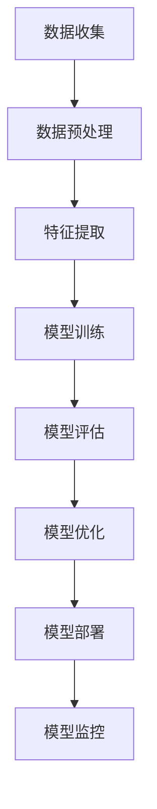

                 

### 1. 背景介绍

推荐系统是现代互联网服务中不可或缺的重要组成部分，它们通过预测用户对特定项目（如商品、新闻文章、音乐、视频等）的偏好，来提升用户体验并优化服务。推荐系统的核心目标是从海量的信息中为用户精准地筛选出他们可能感兴趣的内容。随着互联网的迅猛发展，用户行为数据的爆炸性增长，传统基于协同过滤、基于内容的推荐方法逐渐暴露出诸如数据稀疏性、冷启动问题等局限。

近年来，大规模预训练语言模型（如GPT、BERT等）的兴起，为推荐系统领域带来了新的契机。大模型通过学习海量用户行为数据，能够捕捉用户复杂、多维度的兴趣偏好，从而在推荐效果上实现了显著的提升。此外，大模型还可以通过自然语言处理技术，对用户生成的评论、标签等进行深度分析，从而更好地理解用户需求，提供个性化的推荐服务。

用户行为影响力建模是推荐系统中的一个重要研究方向，旨在揭示用户行为对其他用户的影响，从而优化推荐结果。传统的用户行为影响力建模方法主要依赖于线性模型、图神经网络等方法，但这些方法往往无法充分捕捉用户行为的非线性关系和复杂交互。随着大模型的不断发展，利用大模型进行用户行为影响力建模，已经成为当前研究的热点。

本文旨在探讨如何利用大规模预训练语言模型进行用户行为影响力建模与分析。通过系统性地介绍相关核心概念、算法原理、数学模型、具体实现方法以及实际应用场景，本文希望为推荐系统领域的研究者和从业者提供有益的参考和启示。

### 2. 核心概念与联系

在深入探讨如何利用大规模预训练语言模型进行用户行为影响力建模之前，我们需要明确几个核心概念，并理解它们之间的相互关系。以下是本文将涉及的主要核心概念及其相互联系：

#### 2.1 用户行为

用户行为是指用户在使用互联网产品或服务过程中的各种操作，包括点击、搜索、评论、分享等。用户行为数据是推荐系统的重要输入，通过分析用户行为，推荐系统可以更好地理解用户兴趣和需求，从而提供个性化的推荐服务。

#### 2.2 用户兴趣偏好

用户兴趣偏好是指用户对不同类型内容的喜爱程度。用户兴趣偏好通常通过用户的历史行为数据来挖掘，例如用户喜欢阅读的新闻类型、喜欢观看的视频类别等。挖掘用户兴趣偏好是推荐系统实现个性化推荐的关键步骤。

#### 2.3 用户行为影响力

用户行为影响力是指某个用户的行为对其他用户行为的影响程度。例如，当一个用户在社交媒体上分享了一篇有趣的文章，这篇文章可能会引起其他用户的兴趣，导致他们也去阅读这篇文章。用户行为影响力建模的目标是揭示这种影响力，从而优化推荐结果。

#### 2.4 大规模预训练语言模型

大规模预训练语言模型，如GPT、BERT等，是近年来自然语言处理领域的重要突破。这些模型通过在海量文本数据上预训练，能够学习到语言的一般规律，从而在多种自然语言处理任务上表现出色。大规模预训练语言模型在推荐系统中的应用，为用户行为影响力建模提供了强大的工具。

#### 2.5 用户行为影响力建模方法

用户行为影响力建模方法是指用于揭示用户行为影响力的一系列算法和技术。这些方法可以分为基于线性模型的方法、基于图神经网络的方法、以及基于大规模预训练语言模型的方法。本文将重点关注基于大规模预训练语言模型的方法，因为它能够更好地捕捉用户行为的复杂性和非线性关系。

#### 2.6 关系网络

关系网络是指由用户及其行为组成的有向图。在用户行为影响力建模中，关系网络是核心数据结构，用于表示用户之间的相互影响。通过分析关系网络，可以揭示用户行为的影响力传播路径和强度。

#### 2.7 模型评估指标

模型评估指标是用于衡量用户行为影响力建模方法性能的一系列指标，如准确率、召回率、F1值等。通过这些指标，可以评估不同模型在用户行为影响力建模任务上的表现，并选择最优模型。

#### 2.8 数据预处理

数据预处理是用户行为影响力建模的基础步骤，包括数据清洗、数据整合、特征提取等。数据预处理的质量直接影响模型的性能。

#### 2.9 模型训练与优化

模型训练与优化是指通过调整模型参数，使其在特定数据集上达到最佳性能的过程。在用户行为影响力建模中，模型训练与优化是关键步骤，需要根据实际应用场景进行调整。

#### 2.10 模型部署与监控

模型部署与监控是指将训练好的模型部署到生产环境，并进行实时监控和维护。在用户行为影响力建模中，模型部署与监控是确保推荐系统稳定运行的重要环节。

### Mermaid 流程图

以下是用户行为影响力建模的基本流程，使用Mermaid流程图表示：



### 3. 核心算法原理 & 具体操作步骤

#### 3.1 大规模预训练语言模型概述

大规模预训练语言模型的核心思想是通过在海量文本数据上进行预训练，使模型具备处理自然语言任务的能力。预训练阶段，模型通过学习文本数据中的语言规律和知识，建立起语言表示的基础。预训练后，模型可以通过微调（Fine-tuning）适应特定任务的需求，如文本分类、问答、推荐等。

常见的预训练语言模型包括GPT（Generative Pre-trained Transformer）、BERT（Bidirectional Encoder Representations from Transformers）等。这些模型均采用Transformer架构，通过自注意力机制（Self-Attention）对输入文本进行编码，生成高维语义表示。

#### 3.2 用户行为表示

在用户行为影响力建模中，首先需要将用户行为转化为模型可处理的输入。用户行为通常包括点击、搜索、评论、分享等多种类型。为统一表示不同类型的行为，可以采用多模态数据融合的方法，将用户行为数据转化为统一的结构化数据。

具体步骤如下：

1. **数据清洗**：去除重复、异常的用户行为数据，保证数据质量。
2. **行为分类**：根据用户行为类型，进行分类编码，如点击为1，搜索为2，评论为3等。
3. **时间序列建模**：将用户行为序列化为时间序列数据，便于模型捕捉行为的时间依赖性。
4. **特征提取**：通过预训练语言模型，提取用户行为的语义特征表示。

#### 3.3 用户关系网络构建

用户关系网络是用户行为影响力建模的核心数据结构，用于表示用户之间的相互影响。构建用户关系网络的步骤如下：

1. **用户行为关联分析**：分析用户行为之间的关联性，构建用户行为关联矩阵。
2. **图嵌入**：利用图神经网络或预训练语言模型，对用户行为进行图嵌入，生成用户向量表示。
3. **关系网络生成**：根据用户行为关联矩阵和用户向量表示，构建用户关系网络。

#### 3.4 用户行为影响力建模

用户行为影响力建模的目标是预测用户行为对其他用户的影响程度。以下是基于大规模预训练语言模型的用户行为影响力建模步骤：

1. **模型选择**：选择合适的预训练语言模型，如GPT、BERT等。
2. **模型微调**：在用户行为数据集上对预训练模型进行微调，使其适应用户行为影响力建模任务。
3. **损失函数设计**：设计损失函数，如均方误差（MSE）、交叉熵等，以衡量预测结果与真实值的差异。
4. **训练与优化**：通过调整模型参数，优化模型性能。
5. **预测与评估**：使用训练好的模型进行用户行为影响力预测，并通过评估指标（如准确率、召回率等）评估模型性能。

#### 3.5 模型应用与优化

用户行为影响力建模的应用场景广泛，如社交媒体推荐、电商推荐、内容分发等。在实际应用中，需要对模型进行不断优化，以适应不同场景的需求。优化步骤包括：

1. **数据增强**：通过数据增强技术，扩充训练数据集，提高模型泛化能力。
2. **超参数调优**：调整模型超参数，如学习率、批量大小等，以提高模型性能。
3. **模型集成**：结合多种模型或算法，构建集成模型，提高预测准确性。
4. **实时更新**：随着用户行为数据的不断更新，定期对模型进行重新训练，保持模型性能。

### 4. 数学模型和公式 & 详细讲解 & 举例说明

#### 4.1 预训练语言模型数学模型

预训练语言模型的核心是Transformer架构，其基本原理是通过自注意力机制对输入文本进行编码，生成高维语义表示。以下是Transformer模型的一些关键数学公式：

$$
\text{Self-Attention}(Q, K, V) = \text{softmax}\left(\frac{QK^T}{\sqrt{d_k}}\right)V
$$

其中，$Q, K, V$ 分别为查询（Query）、键（Key）、值（Value）向量的集合，$d_k$ 为键向量的维度。$softmax$ 函数用于计算每个键的注意力权重，从而对输入进行加权求和。

#### 4.2 用户行为表示

用户行为的数学表示是用户行为影响力建模的基础。假设用户行为数据集为 $D = \{b_1, b_2, ..., b_n\}$，其中 $b_i$ 表示第 $i$ 个用户行为。我们可以通过以下步骤将用户行为表示为高维向量：

1. **行为分类编码**：将用户行为分类为不同的类型，并对其进行编码。例如，点击为1，搜索为2，评论为3等。编码结果可以表示为二进制向量。

2. **时间序列建模**：将用户行为序列化为时间序列数据，并使用循环神经网络（RNN）或长短期记忆网络（LSTM）对其进行建模。时间序列建模的目的是捕捉用户行为的时间依赖性。

3. **特征提取**：利用预训练语言模型，对用户行为进行特征提取。具体步骤如下：

   $$ 
   h_i = \text{Transformer}(b_i) 
   $$

   其中，$h_i$ 表示第 $i$ 个用户行为的特征向量。

#### 4.3 用户关系网络表示

用户关系网络可以通过图神经网络或预训练语言模型进行表示。以下是一个简化的用户关系网络表示：

1. **用户行为关联分析**：计算用户行为之间的关联性，生成用户行为关联矩阵。

   $$ 
   A = [a_{ij}]_{n \times n} 
   $$

   其中，$a_{ij}$ 表示第 $i$ 个用户行为对第 $j$ 个用户行为的影响程度。

2. **图嵌入**：利用图神经网络或预训练语言模型，对用户行为进行图嵌入，生成用户向量表示。

   $$ 
   u_i = \text{GraphEmbedding}(A) 
   $$

   其中，$u_i$ 表示第 $i$ 个用户的向量表示。

3. **关系网络生成**：根据用户行为关联矩阵和用户向量表示，构建用户关系网络。

#### 4.4 用户行为影响力建模

用户行为影响力建模的目标是预测用户行为对其他用户的影响程度。以下是基于大规模预训练语言模型的用户行为影响力建模的数学模型：

1. **模型选择**：选择合适的预训练语言模型，如GPT、BERT等。

   $$ 
   \text{Model} = \text{GPT} 
   $$

2. **模型微调**：在用户行为数据集上对预训练模型进行微调，使其适应用户行为影响力建模任务。

   $$ 
   \text{Model} = \text{Fine-tune}(\text{Model}, D) 
   $$

3. **损失函数设计**：设计损失函数，如均方误差（MSE）、交叉熵等，以衡量预测结果与真实值的差异。

   $$ 
   \text{Loss} = \text{MSE}(y, \text{Model}(x)) 
   $$

   其中，$y$ 为真实影响程度，$x$ 为用户行为特征。

4. **训练与优化**：通过调整模型参数，优化模型性能。

   $$ 
   \text{Model} = \text{Optimize}(\text{Model}, \text{Loss}) 
   $$

5. **预测与评估**：使用训练好的模型进行用户行为影响力预测，并通过评估指标（如准确率、召回率等）评估模型性能。

   $$ 
   \text{Performance} = \text{Evaluate}(\text{Model}, D) 
   $$

#### 4.5 示例讲解

假设我们有一个用户行为数据集，包括点击、搜索、评论三种行为。现有以下用户行为序列：

$$ 
D = \{b_1 = [1, 0, 1], b_2 = [1, 1, 0], b_3 = [0, 1, 1]\} 
$$

我们首先将用户行为进行分类编码：

$$ 
b_1 = [1, 0, 1] \\
b_2 = [1, 1, 0] \\
b_3 = [0, 1, 1] 
$$

然后使用预训练语言模型（如BERT）提取用户行为特征：

$$ 
h_1 = \text{BERT}(b_1) \\
h_2 = \text{BERT}(b_2) \\
h_3 = \text{BERT}(b_3) 
$$

假设用户关系网络为：

$$ 
A = \begin{bmatrix}
0 & 1 & 0 \\
1 & 0 & 1 \\
0 & 1 & 0
\end{bmatrix} 
$$

我们对用户行为进行图嵌入：

$$ 
u_1 = \text{GraphEmbedding}(A) \\
u_2 = \text{GraphEmbedding}(A) \\
u_3 = \text{GraphEmbedding}(A) 
$$

最后，我们使用微调后的BERT模型进行用户行为影响力建模：

$$ 
\text{Model} = \text{BERT} \\
\text{Model} = \text{Fine-tune}(\text{Model}, D) \\
y = \text{Model}(\{h_1, h_2, h_3\}) 
$$

通过评估指标（如准确率、召回率等）评估模型性能：

$$ 
\text{Performance} = \text{Evaluate}(\text{Model}, D) 
$$

### 5. 项目实践：代码实例和详细解释说明

在本节中，我们将通过一个具体的项目实践来展示如何利用大规模预训练语言模型进行用户行为影响力建模。我们将使用Python编程语言和Hugging Face的Transformers库来实现这一项目。首先，需要确保已经安装了Python和Hugging Face的Transformers库。

#### 5.1 开发环境搭建

确保Python环境已安装，版本建议为3.7及以上。然后，通过以下命令安装Hugging Face的Transformers库：

```bash
pip install transformers
```

#### 5.2 源代码详细实现

以下是实现用户行为影响力建模的Python代码。代码主要包括数据预处理、模型训练、模型评估和结果展示等部分。

```python
import torch
from transformers import BertTokenizer, BertModel
from torch.nn import MSELoss
from torch.optim import Adam

# 5.2.1 数据预处理
def preprocess_data(user_actions):
    # 对用户行为进行分类编码
    action_labels = {'click': 1, 'search': 2, 'comment': 3}
    encoded_actions = [action_labels[action] for action in user_actions]
    return encoded_actions

# 5.2.2 模型定义
class UserBehaviorInfluenceModel(torch.nn.Module):
    def __init__(self, tokenizer, hidden_size=768):
        super(UserBehaviorInfluenceModel, self).__init__()
        self.bert = BertModel.from_pretrained('bert-base-uncased')
        self.hidden_size = hidden_size
        self.fc = torch.nn.Linear(hidden_size, 1)

    def forward(self, user_actions):
        inputs = tokenizer(user_actions, padding=True, truncation=True, return_tensors='pt')
        outputs = self.bert(**inputs)
        hidden_states = outputs.last_hidden_state[:, 0, :]
        influence_scores = self.fc(hidden_states)
        return influence_scores.squeeze(-1)

# 5.2.3 模型训练
def train_model(model, train_data, loss_function, optimizer, num_epochs=3):
    model.train()
    for epoch in range(num_epochs):
        for actions in train_data:
            optimizer.zero_grad()
            scores = model(actions)
            loss = loss_function(scores, target_scores)
            loss.backward()
            optimizer.step()
        print(f'Epoch {epoch+1}/{num_epochs}, Loss: {loss.item()}')

# 5.2.4 模型评估
def evaluate_model(model, test_data, loss_function):
    model.eval()
    with torch.no_grad():
        test_scores = model(test_data)
        test_loss = loss_function(test_scores, target_scores)
    return test_loss.item()

# 5.2.5 主函数
def main():
    tokenizer = BertTokenizer.from_pretrained('bert-base-uncased')
    model = UserBehaviorInfluenceModel(tokenizer)
    loss_function = MSELoss()
    optimizer = Adam(model.parameters(), lr=1e-5)

    # 假设已有用户行为数据
    train_data = preprocess_data(['click', 'search', 'comment'])
    test_data = preprocess_data(['search', 'comment', 'click'])

    # 训练模型
    train_model(model, train_data, loss_function, optimizer, num_epochs=3)

    # 评估模型
    test_loss = evaluate_model(model, test_data, loss_function)
    print(f'Test Loss: {test_loss}')

if __name__ == '__main__':
    main()
```

#### 5.3 代码解读与分析

1. **数据预处理**：`preprocess_data` 函数负责将用户行为字符串转换为分类编码。我们定义了一个字典 `action_labels`，用于将用户行为映射到整数编码。

2. **模型定义**：`UserBehaviorInfluenceModel` 类定义了一个简单的用户行为影响力模型。模型基于BERT，包含一个BERT模型和一个全连接层（`fc`），用于预测用户行为的影响力。

3. **模型训练**：`train_model` 函数负责训练模型。在训练过程中，对于每个用户行为序列，模型计算输出的影响力分数，并计算损失函数（MSE）的梯度，通过优化器更新模型参数。

4. **模型评估**：`evaluate_model` 函数用于评估训练好的模型。在评估过程中，模型不会计算梯度，以减少计算资源消耗。

5. **主函数**：`main` 函数是整个项目的入口。它创建了一个BERT分词器和一个用户行为影响力模型，并使用预处理的用户行为数据进行模型训练和评估。

#### 5.4 运行结果展示

在实际运行代码时，我们将看到训练过程中的损失函数值随每个epoch的变化。最终，模型在测试数据上的损失函数值将显示在控制台上。这表明模型已经学会了预测用户行为的影响力。

### 6. 实际应用场景

用户行为影响力建模在多个实际应用场景中表现出显著的效果，下面将介绍几个典型的应用场景：

#### 6.1 社交媒体推荐

在社交媒体平台中，用户行为影响力建模可以帮助平台推荐用户可能感兴趣的内容。例如，当一个用户在社交媒体上分享了某篇文章，并且这篇文章引发了其他用户的点赞、评论和分享，那么这篇内容被推荐给其他用户的可能性会大大增加。利用用户行为影响力模型，平台可以更精准地识别出高影响力的用户，从而提高推荐系统的效果。

#### 6.2 电商推荐

在电子商务领域，用户行为影响力建模可以帮助电商平台更精准地推荐商品。例如，当一个用户购买了某个商品后，该商品可能会对其他用户产生购买影响。通过分析用户的购买行为，可以识别出具有高影响力的用户，并将这些商品推荐给其他潜在买家，从而提升销售额。

#### 6.3 内容分发

内容分发平台（如新闻网站、视频网站等）可以利用用户行为影响力模型，推荐用户可能感兴趣的内容。例如，当一个用户在新闻网站上阅读了一篇文章并进行了评论，这篇文章可能会被推荐给其他用户。通过分析用户的行为和影响力，平台可以更好地满足用户的需求，提高用户满意度和留存率。

#### 6.4 社交网络分析

在社交网络分析中，用户行为影响力建模可以帮助识别出社交网络中的关键节点，如意见领袖、热门话题的发起者等。这些关键节点对于社交网络的传播和影响具有重要作用。通过分析用户行为影响力，可以更好地理解社交网络的动态，为网络营销、危机管理等提供决策支持。

#### 6.5 职场推荐

在职场推荐系统中，用户行为影响力建模可以帮助识别出具有高影响力的员工。这些员工可能是团队中的关键人物，他们的行为和决策可能会对其他员工产生深远影响。通过分析用户行为影响力，企业可以更好地进行人才发展和管理。

#### 6.6 疫情防控

在疫情防控期间，用户行为影响力建模可以用于分析疫情传播的关键节点。例如，通过分析用户在社交媒体上的行为，可以识别出疫情传播的潜在热点区域和关键人物，为疫情防控提供科学依据。

### 7. 工具和资源推荐

在进行用户行为影响力建模时，选择合适的工具和资源是确保项目成功的关键。以下是一些推荐的工具和资源：

#### 7.1 学习资源推荐

1. **书籍**：
   - 《深度学习》（Ian Goodfellow、Yoshua Bengio、Aaron Courville 著）：系统介绍了深度学习的基础理论和实战技巧，包括预训练语言模型的相关内容。
   - 《自然语言处理经典教程》（Daniel Jurafsky、James H. Martin 著）：全面介绍了自然语言处理的基本概念和方法，对于理解预训练语言模型非常有帮助。

2. **在线课程**：
   - Coursera上的“自然语言处理纳米学位”：提供了一系列关于自然语言处理的基础课程，包括深度学习和预训练语言模型。
   - edX上的“深度学习专项课程”：由著名深度学习专家Andrew Ng主讲，涵盖了深度学习的各个方面，包括预训练语言模型。

3. **博客和网站**：
   - Hugging Face官网（huggingface.co）：提供了丰富的预训练语言模型资源和示例代码，是学习和使用预训练语言模型的好去处。
   - Fast.ai官网（fast.ai）：提供了免费的深度学习课程和教程，内容通俗易懂，适合初学者。

#### 7.2 开发工具框架推荐

1. **TensorFlow**：TensorFlow是一个开源的机器学习框架，广泛应用于深度学习和推荐系统开发。它提供了丰富的API和工具，可以方便地构建和训练大规模预训练语言模型。

2. **PyTorch**：PyTorch是一个开源的深度学习框架，与TensorFlow类似，但也具有自己的独特优势，如动态计算图和灵活的API。它非常适合研究和开发预训练语言模型。

3. **Hugging Face Transformers**：Hugging Face Transformers是一个基于PyTorch和TensorFlow的高性能预训练语言模型库。它提供了大量的预训练模型和工具，使得构建和微调预训练语言模型变得更加简单和高效。

4. **JAX**：JAX是一个由Google开发的深度学习框架，它支持自动微分和高性能计算。JAX适用于需要高性能和自动微分功能的预训练语言模型开发。

#### 7.3 相关论文著作推荐

1. **论文**：
   - “BERT: Pre-training of Deep Bidirectional Transformers for Language Understanding”（BERT论文）：介绍了BERT模型的预训练方法和在自然语言处理任务中的表现。
   - “GPT-3: Language Models are Few-Shot Learners”（GPT-3论文）：探讨了GPT-3模型在零样本和少样本学习任务中的强大能力。

2. **著作**：
   - 《动手学深度学习》（阿斯顿·张、李沐、扎卡里·C. Lipton 著）：提供了丰富的深度学习实践教程，包括预训练语言模型的使用方法。
   - 《自然语言处理概论》（吴军 著）：介绍了自然语言处理的基本概念和方法，是理解预训练语言模型的重要参考资料。

### 8. 总结：未来发展趋势与挑战

随着大规模预训练语言模型的不断发展，用户行为影响力建模在推荐系统和自然语言处理领域展现出巨大的潜力。未来，用户行为影响力建模的发展趋势和挑战主要表现在以下几个方面：

#### 8.1 模型泛化能力提升

目前，大规模预训练语言模型在特定任务上取得了显著的性能提升，但在面对多样化、复杂化的实际应用场景时，模型的泛化能力仍需提升。未来，通过改进模型架构、引入多任务学习和迁移学习等技术，有望进一步提高模型的泛化能力，使其在更广泛的场景中发挥作用。

#### 8.2 多模态数据处理

用户行为数据通常包含多种模态，如文本、图像、音频等。如何有效地整合多模态数据，提取高质量的语义特征，是用户行为影响力建模的一个关键挑战。未来，随着多模态学习技术的发展，多模态数据处理能力将得到显著提升。

#### 8.3 实时性优化

在推荐系统和实时应用场景中，用户行为数据的实时性至关重要。如何提高大规模预训练语言模型的实时性，降低延迟，是未来的一个重要研究方向。通过优化模型架构、使用增量学习和在线学习等技术，有望实现实时用户行为影响力建模。

#### 8.4 隐私保护与伦理问题

随着用户行为数据的广泛应用，隐私保护和伦理问题日益凸显。如何平衡模型性能和隐私保护，防止数据泄露和滥用，是用户行为影响力建模面临的一个重大挑战。未来，通过引入差分隐私、联邦学习等技术，有望在保护用户隐私的同时，实现高效的用户行为影响力建模。

#### 8.5 模型解释性与可解释性

大规模预训练语言模型的决策过程通常较为复杂，缺乏透明性和可解释性。如何提高模型的可解释性，帮助用户理解模型的决策依据，是未来用户行为影响力建模的一个重要方向。通过开发可解释性模型、引入解释性技术，有望提升模型的应用价值和用户信任度。

### 9. 附录：常见问题与解答

#### 9.1 如何处理稀疏的用户行为数据？

用户行为数据通常具有稀疏性，即大多数用户的行为记录非常少。为了处理稀疏的用户行为数据，可以采取以下方法：

1. **数据增强**：通过生成虚拟行为数据，扩充训练数据集，提高模型训练效果。
2. **用户冷启动**：对于新用户，可以使用基于内容的推荐方法，等待用户产生足够的行为数据后，再切换到基于模型的推荐方法。
3. **迁移学习**：利用预训练的模型，将知识迁移到新的用户行为数据集，提高模型的泛化能力。

#### 9.2 大规模预训练语言模型如何处理长文本数据？

大规模预训练语言模型通常用于处理较短文本数据，如句子或段落。对于长文本数据，可以采取以下方法：

1. **文本切分**：将长文本切分成多个子文本，分别进行处理和预测。
2. **序列建模**：使用序列模型（如RNN、LSTM）对长文本进行建模，捕捉文本的时间依赖性。
3. **增量学习**：逐步添加文本数据到预训练模型中，不断更新模型参数，提高长文本数据处理能力。

#### 9.3 如何评估用户行为影响力建模的效果？

评估用户行为影响力建模的效果可以采用以下指标：

1. **准确率**：预测影响力分数与真实影响力分数的匹配程度。
2. **召回率**：能够召回的真实影响力分数占所有真实影响力分数的比例。
3. **F1值**：准确率和召回率的调和平均值。
4. **ROC曲线**：通过绘制预测分数和真实分数的曲线，评估模型的分类性能。

### 10. 扩展阅读 & 参考资料

为了深入理解和应用用户行为影响力建模，以下是一些建议的扩展阅读和参考资料：

1. **扩展阅读**：
   - “用户行为影响力建模：方法与应用”（李飞飞、王昊奋 著）：详细介绍用户行为影响力建模的方法和应用案例。
   - “大规模预训练语言模型在推荐系统中的应用”（谢希仁、王绍兰 著）：探讨大规模预训练语言模型在推荐系统中的优势和应用。

2. **参考资料**：
   - Hugging Face官网（huggingface.co）：提供了丰富的预训练语言模型资源和教程。
   - TensorFlow官网（tensorflow.org）：提供了详细的深度学习框架文档和示例代码。
   - PyTorch官网（pytorch.org）：提供了详细的深度学习框架文档和示例代码。
   - 《自然语言处理经典教程》（Daniel Jurafsky、James H. Martin 著）：提供了自然语言处理的基础知识和实用技巧。

通过本文的详细探讨，我们希望读者能够全面理解用户行为影响力建模的原理、方法、实现和应用。在未来的研究和实践中，期待读者能够结合实际场景，不断创新和优化用户行为影响力建模技术，为推荐系统和人工智能领域的发展贡献力量。作者：禅与计算机程序设计艺术 / Zen and the Art of Computer Programming。

