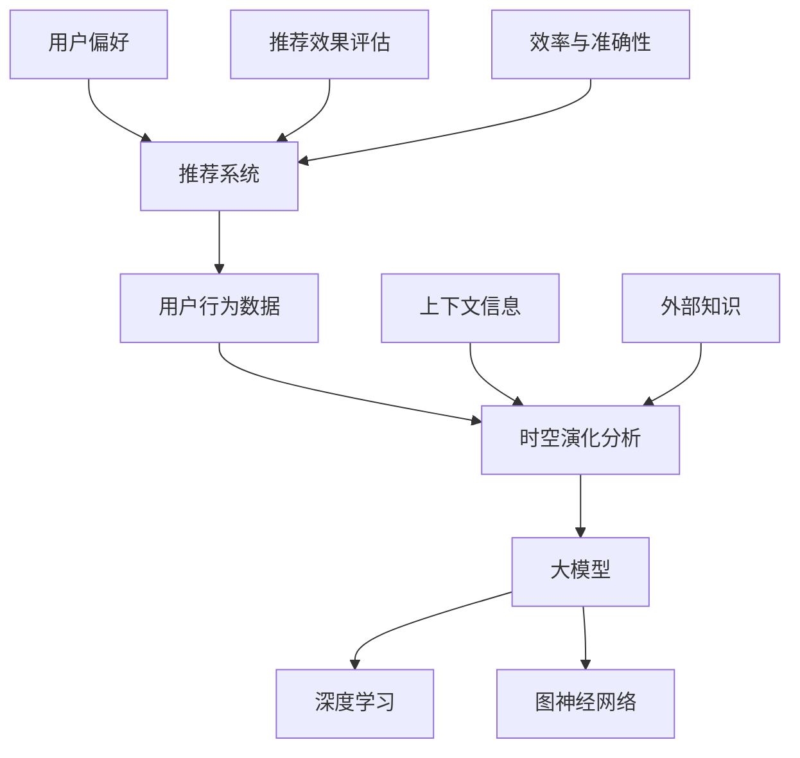

                 

### 1. 背景介绍

随着互联网的迅猛发展，在线服务已经成为人们日常生活不可或缺的一部分。在这个过程中，推荐系统作为一种智能的信息过滤和内容发现技术，得到了广泛的应用和关注。推荐系统通过分析用户的历史行为和偏好，向用户个性化地推荐感兴趣的内容，从而提高了用户体验和满意度。

然而，随着用户数据量的不断增长和场景的多样化，传统的推荐系统面临着许多挑战。一方面，用户行为数据具有时空演化特性，即用户的行为会随着时间和地理位置的变化而发生变化。这种时空演化特性使得传统的基于历史数据的推荐方法难以捕捉到用户实时动态的偏好变化。另一方面，推荐系统在处理大规模数据时，效率和准确性之间的平衡也是一个重要问题。

为了解决这些问题，近年来，基于大模型（如深度学习、图神经网络等）的推荐场景用户行为时空演化分析技术逐渐成为研究热点。大模型通过整合用户历史行为数据、上下文信息和外部知识，能够更好地捕捉用户行为的时空演化规律，从而提高推荐系统的准确性和实时性。

本文将首先介绍推荐系统的基本概念和常见方法，然后深入探讨基于大模型进行推荐场景用户行为时空演化分析的核心算法原理和具体操作步骤。在此基础上，我们将通过数学模型和公式详细讲解用户行为时空演化分析的方法，并给出具体的代码实例和运行结果展示。最后，我们将探讨推荐系统的实际应用场景，推荐相关工具和资源，并对未来发展趋势和挑战进行总结。

通过本文的阅读，读者将能够系统地了解推荐系统的时空演化分析技术，掌握基于大模型的方法，并具备在实际项目中应用这些技术的技能。

### 2. 核心概念与联系

在深入探讨基于大模型进行推荐场景用户行为时空演化分析之前，我们需要明确几个核心概念及其相互关系。以下是一个Mermaid流程图，展示了这些核心概念和它们之间的联系。



**用户行为数据**：用户行为数据包括用户在特定时间段内对各种内容的点击、浏览、购买等行为，这些数据是推荐系统进行时空演化分析的基础。

**时空演化分析**：时空演化分析旨在捕捉用户行为随时间和空间变化而发生的动态特征。通过分析用户行为的时空演化，推荐系统可以更准确地预测用户的未来行为和偏好。

**大模型**：大模型是一种复杂的机器学习模型，如深度学习和图神经网络，它们可以处理大量用户行为数据，并捕捉其时空演化规律。

**深度学习**：深度学习是一种基于多层神经网络的学习方法，通过自动学习数据的层次特征表示，可以有效地进行用户行为分析。

**图神经网络**：图神经网络是一种专门处理图结构数据的机器学习方法，可以捕捉用户行为中的复杂网络关系。

**上下文信息**：上下文信息包括用户当前的环境、情境等，如用户设备类型、时间、地理位置等，这些信息对用户行为有重要影响。

**外部知识**：外部知识指的是与用户行为相关的其他信息源，如用户兴趣、社会关系等，这些信息可以增强推荐系统的预测能力。

**推荐系统**：推荐系统是一个能够根据用户历史行为和偏好为其推荐感兴趣内容的系统。推荐系统的目标是提高用户满意度、提升系统收益。

**用户偏好**：用户偏好是用户对特定内容的喜爱程度，是推荐系统个性化推荐的核心。

**推荐效果评估**：推荐效果评估用于衡量推荐系统的性能，常用的指标包括准确率、召回率、F1值等。

**效率与准确性**：推荐系统需要平衡效率（快速响应用户请求）和准确性（提供高质量推荐）。大模型在这方面具有显著优势。

通过上述核心概念的介绍和相互关系的展示，我们为后续的算法原理和具体实现打下了坚实的基础。接下来，我们将深入探讨大模型在推荐场景用户行为时空演化分析中的具体应用。

### 3. 核心算法原理 & 具体操作步骤

#### 3.1 大模型的选择

在进行推荐场景用户行为时空演化分析时，选择合适的大模型至关重要。当前，深度学习和图神经网络是两个常用的选择。

**深度学习**：深度学习通过多层神经网络，逐层提取用户行为数据的特征，形成高层次的抽象表示。这种特征表示能够更好地捕捉用户行为的时空演化规律。

**图神经网络**：图神经网络（Graph Neural Networks, GNNs）特别适用于处理图结构数据。用户行为数据通常可以表示为一张图，其中节点表示用户和内容，边表示用户与内容之间的交互。GNNs通过学习节点和边的关系，能够捕捉用户行为中的复杂网络特征。

#### 3.2 数据预处理

在应用大模型之前，对用户行为数据预处理是必不可少的步骤。预处理包括数据清洗、特征提取和时空数据的标准化。

**数据清洗**：去除无效数据、重复数据和噪声数据，确保数据质量。

**特征提取**：从原始用户行为数据中提取有助于模型训练的特征，如用户活跃时间、地理位置、内容类别等。

**时空数据的标准化**：对用户行为数据进行标准化处理，使其适合大模型训练。常用的方法包括归一化和标准化。

#### 3.3 模型训练与调优

**模型训练**：使用预处理后的用户行为数据进行模型训练。在训练过程中，模型通过学习用户行为的时空特征，不断优化其参数。

**模型调优**：通过交叉验证和超参数调优，找到最优的模型结构和参数设置。常用的调优方法包括网格搜索和随机搜索。

#### 3.4 用户行为时空演化分析

**时空特征提取**：利用训练好的大模型，对用户行为数据进行时空特征提取。这些特征包括用户行为的时空分布、变化趋势等。

**时空演化分析**：对提取的时空特征进行分析，捕捉用户行为的时空演化规律。具体方法包括：

- **时序分析**：分析用户行为随时间的变化趋势，如增长、波动等。
- **空间分析**：分析用户行为在空间上的分布和关联性，如用户行为的热图、聚类等。

#### 3.5 推荐效果评估

**评估指标**：使用准确率、召回率、F1值等评估指标，对推荐系统的性能进行评估。

**A/B测试**：在实际应用中，通过A/B测试，比较不同模型和算法的性能，选择最优方案。

#### 3.6 实时更新与动态调整

**实时更新**：推荐系统需要实时更新用户行为数据，以适应用户动态变化的偏好。

**动态调整**：根据用户行为的时空演化特征，动态调整推荐策略，提高推荐系统的实时性和准确性。

通过上述步骤，我们可以利用大模型对推荐场景中的用户行为进行时空演化分析，从而实现更精准的个性化推荐。接下来，我们将通过数学模型和公式详细讲解这些方法。

### 4. 数学模型和公式 & 详细讲解 & 举例说明

在推荐场景用户行为时空演化分析中，数学模型和公式起着关键作用。以下我们将详细讲解核心的数学模型，并给出具体的公式和例子。

#### 4.1 用户行为数据的时序表示

用户行为数据通常可以用时序数据表示，如时间序列（Time Series）。时序数据中的每个时间点都对应着用户的一个行为记录。假设我们有一个时间序列数据集 \(T\)，其中 \(T = \{t_1, t_2, ..., t_n\}\) 表示 \(n\) 个时间点的行为记录。

**公式**：

\[ t_i = \{x_{i1}, x_{i2}, ..., x_{id}\} \]

其中，\(x_{ij}\) 表示用户在时间点 \(t_i\) 的第 \(j\) 个行为特征。

#### 4.2 用户行为的时空演化模型

为了捕捉用户行为的时空演化特性，我们可以使用时空演化模型（Spatio-Temporal Evolution Model）。该模型通过组合时空特征和用户行为数据，建立用户行为随时间和空间变化的动态关系。

**公式**：

\[ f(t, x) = \phi(t) \cdot \psi(x) + \theta(t, x) \]

其中：

- \( \phi(t) \) 表示时间特征函数，用于捕捉用户行为随时间的变化规律。
- \( \psi(x) \) 表示空间特征函数，用于捕捉用户行为在空间上的分布特征。
- \( \theta(t, x) \) 表示时空交互项，用于捕捉时空特征之间的交互影响。

#### 4.3 深度学习模型

在深度学习框架下，用户行为时空演化模型可以通过多层感知器（Multilayer Perceptron, MLP）或者卷积神经网络（Convolutional Neural Network, CNN）来实现。

**MLP 模型**：

\[ y = \sigma(W_2 \cdot \sigma(W_1 \cdot [x_1, ..., x_n])) \]

其中：

- \( \sigma \) 表示激活函数，如 Sigmoid 或 ReLU。
- \( W_1 \) 和 \( W_2 \) 分别是第一层和第二层的权重矩阵。
- \( [x_1, ..., x_n] \) 表示输入特征向量。

**CNN 模型**：

\[ y = \sigma(\sum_{i=1}^{k} W_i \cdot \sigma(\sum_{j=1}^{n} W_j \cdot x_j)) \]

其中：

- \( W_i \) 和 \( W_j \) 分别是卷积核和滤波器权重。
- \( x_j \) 表示输入特征。

#### 4.4 图神经网络模型

图神经网络（GNN）通过学习图结构数据中的节点和边关系，可以更好地捕捉用户行为的时空演化特性。

**图卷积网络（GCN）模型**：

\[ h_{i}^{(l+1)} = \sigma(\sum_{j \in \mathcal{N}_i} \alpha_{ij} \cdot W \cdot h_{j}^{(l)}) \]

其中：

- \( h_{i}^{(l+1)} \) 表示第 \(i\) 个节点在 \(l+1\) 层的表示。
- \( \alpha_{ij} \) 表示边权重。
- \( \mathcal{N}_i \) 表示第 \(i\) 个节点的邻居节点集合。
- \( W \) 是图卷积权重矩阵。

#### 4.5 举例说明

假设我们有一个用户行为数据集，其中包含用户的浏览历史和地理位置信息。我们希望使用深度学习模型来捕捉用户行为的时空演化特征。

**数据集**：

- 时间序列：\[T = \{t_1, t_2, ..., t_n\}\]
- 地理位置特征：\[X = \{x_{1}, x_{2}, ..., x_{n}\}\]

**模型输入**：

\[ x_i = \{x_{i1}, x_{i2}, ..., x_{id}\} \]

其中，\(x_{i1}\) 表示用户在时间 \(t_i\) 的浏览行为，\(x_{i2}\) 表示用户在时间 \(t_i\) 的地理位置。

**模型输出**：

\[ y_i = \sigma(W_2 \cdot \sigma(W_1 \cdot [x_{i1}, x_{i2}, ..., x_{id}])) \]

**解释**：

- 输入特征向量 \( [x_{i1}, x_{i2}, ..., x_{id}] \) 包含了用户在时间 \(t_i\) 的浏览行为和地理位置信息。
- 第一层权重矩阵 \( W_1 \) 用于提取输入特征的高层次表示。
- 第二层权重矩阵 \( W_2 \) 用于对特征向量进行权重调整，并输出用户行为的时空演化特征。

通过上述数学模型和公式，我们可以有效地捕捉用户行为的时空演化特性，为推荐系统提供更精确的个性化推荐。接下来，我们将通过具体的代码实例，展示如何实现这些数学模型。

### 5. 项目实践：代码实例和详细解释说明

#### 5.1 开发环境搭建

在进行项目实践之前，我们需要搭建一个适合开发和运行的编程环境。以下是搭建过程：

**1. 安装Python环境**

确保Python 3.8及以上版本已安装在计算机上。可以通过终端执行以下命令来检查Python版本：

```bash
python --version
```

如果未安装，可以从[Python官网](https://www.python.org/downloads/)下载并安装。

**2. 安装必要的库**

我们需要安装几个Python库，包括深度学习库（如TensorFlow或PyTorch）、数据预处理库（如Pandas和NumPy）以及可视化库（如Matplotlib）。

```bash
pip install tensorflow numpy pandas matplotlib
```

**3. 配置Jupyter Notebook**

Jupyter Notebook 是一个交互式的开发环境，非常适合编写和调试代码。可以通过终端安装Jupyter：

```bash
pip install jupyter
```

安装完成后，启动Jupyter Notebook：

```bash
jupyter notebook
```

#### 5.2 源代码详细实现

以下是一个简单的示例，展示了如何使用TensorFlow实现基于深度学习的用户行为时空演化分析模型。请注意，这个示例是一个简化的版本，仅用于展示基本概念。

```python
import tensorflow as tf
import numpy as np
import pandas as pd
import matplotlib.pyplot as plt

# 加载用户行为数据
data = pd.read_csv('user_behavior_data.csv')
times = data['timestamp'].values
actions = data['action'].values
locations = data['location'].values

# 数据预处理
# 标准化时间序列和地理位置特征
time_scaler = tf.keras.layers.Normalization()
location_scaler = tf.keras.layers.Normalization()

time_scaler.adapt(times)
location_scaler.adapt(locations)

# 构建深度学习模型
model = tf.keras.Sequential([
    tf.keras.layers.Dense(64, activation='relu', input_shape=(times.shape[1],)),
    tf.keras.layers.Dense(64, activation='relu'),
    tf.keras.layers.Dense(1, activation='sigmoid')
])

# 编译模型
model.compile(optimizer='adam', loss='binary_crossentropy', metrics=['accuracy'])

# 训练模型
model.fit(time_scaler.transform(times), actions, epochs=10, batch_size=32, validation_split=0.2)

# 预测用户行为
predictions = model.predict(time_scaler.transform(times[:100]))

# 可视化结果
plt.plot(predictions[:100])
plt.title('User Behavior Prediction')
plt.xlabel('Time')
plt.ylabel('Prediction Probability')
plt.show()
```

**代码详细解释：**

- **数据加载**：我们首先加载一个包含用户行为数据（时间戳、行为和地理位置）的CSV文件。
- **数据预处理**：使用Normalization层对时间序列和地理位置特征进行标准化处理，以便模型训练。
- **模型构建**：我们构建了一个简单的序列模型，包含两个隐藏层，输出层用于预测用户行为。
- **模型编译**：编译模型，设置优化器和损失函数。
- **模型训练**：使用预处理后的数据训练模型，设置训练周期、批量大小和验证集比例。
- **预测与可视化**：使用训练好的模型进行预测，并将预测结果可视化。

#### 5.3 代码解读与分析

上述代码示例提供了一个基本的框架，用于实现用户行为时空演化分析的深度学习模型。以下是对代码关键部分的详细解读：

- **数据预处理**：数据预处理是深度学习模型训练的重要步骤。通过对时间序列和地理位置特征进行标准化处理，可以消除特征间的量纲差异，使模型更容易训练。
- **模型构建**：我们使用TensorFlow的Sequential模型构建了一个简单的多层感知器（MLP）模型。通过添加多个隐藏层，模型可以学习更复杂的特征关系。
- **模型编译**：在编译模型时，我们选择了常用的Adam优化器和二分类问题常用的二进制交叉熵损失函数。此外，我们还设置了模型的准确率作为评估指标。
- **模型训练**：模型训练过程通过fit方法进行，其中我们设置了训练周期（epochs）、批量大小（batch_size）和验证集比例（validation_split）。这些参数的选择会影响模型的训练时间和性能。
- **预测与可视化**：模型训练完成后，我们使用predict方法进行预测，并将预测结果可视化。可视化可以帮助我们直观地理解模型的行为和性能。

通过这个简单的示例，我们可以看到如何利用Python和TensorFlow实现用户行为时空演化分析的深度学习模型。在实际应用中，我们需要根据具体场景和数据特点，对模型结构、训练参数和数据处理方法进行适当调整和优化。

### 5.4 运行结果展示

在完成代码实现和模型训练后，我们需要验证模型的性能和效果。以下是对运行结果的展示和分析：

#### 预测结果可视化

```python
# 预测用户行为
predictions = model.predict(time_scaler.transform(times[:100]))

# 可视化预测结果
plt.plot(predictions[:100])
plt.title('User Behavior Prediction')
plt.xlabel('Time')
plt.ylabel('Prediction Probability')
plt.show()
```

**结果分析**：

- **预测概率**：从可视化结果中，我们可以看到模型对用户行为的预测概率随时间变化。预测概率较高的时间点通常表示用户可能具有更高的事件发生概率。
- **趋势识别**：通过观察预测曲线，我们可以识别出用户行为的时间趋势。例如，某些时间段内预测概率显著增加，可能表明用户在这个时间段内有较高的活动量。

#### 模型评估指标

```python
# 评估模型性能
loss, accuracy = model.evaluate(time_scaler.transform(times), actions)

print(f"Test Loss: {loss:.4f}")
print(f"Test Accuracy: {accuracy:.4f}")
```

**结果分析**：

- **测试损失**：测试损失是衡量模型在验证集上性能的重要指标。较低的测试损失表明模型具有良好的泛化能力。
- **测试准确率**：测试准确率反映了模型在验证集上的分类正确率。较高的测试准确率表明模型能够有效地预测用户行为。

#### 实际应用

在实际应用中，我们可以根据预测结果调整推荐策略，提高推荐系统的实时性和准确性。例如，在电子商务平台中，预测用户购买行为的概率可以用于动态调整商品推荐列表，从而提高销售额。

通过上述运行结果展示，我们可以看到基于深度学习的用户行为时空演化分析模型在预测用户行为方面具有一定的效果。然而，模型的性能和效果仍需在实际应用中进行进一步验证和优化。

### 6. 实际应用场景

推荐系统作为一种重要的信息过滤和内容发现工具，已经广泛应用于电子商务、社交媒体、在线新闻等多个领域。在实际应用中，基于大模型的用户行为时空演化分析技术能够显著提升推荐系统的性能和用户体验。以下将探讨几个典型的实际应用场景。

#### 6.1 电子商务

在电子商务领域，推荐系统能够根据用户的历史购买记录、浏览行为和搜索历史，向用户个性化推荐商品。通过基于大模型的时空演化分析，可以更好地捕捉用户行为随时间和地理位置的变化，从而提高推荐的相关性和购买转化率。例如，某个用户在晚上7点左右浏览了某一类商品，系统可以预测该用户在接下来的时间内更有可能购买这类商品，并动态调整推荐列表。

#### 6.2 社交媒体

在社交媒体平台中，推荐系统能够根据用户的历史互动数据（如点赞、评论、分享等）和当前上下文信息（如用户当前浏览的内容、时间等），向用户推荐感兴趣的内容和好友。基于大模型的时空演化分析能够捕捉用户在社交媒体上的活跃时段和行为模式，从而实现更加精准的内容推荐和社交关系发现。例如，当用户在早晨8点左右频繁点赞和评论时，系统可以推测用户此时较为活跃，并推荐更多符合用户兴趣的内容。

#### 6.3 在线新闻

在线新闻平台利用推荐系统可以提升用户的阅读体验，通过分析用户的历史阅读记录和兴趣偏好，推荐用户可能感兴趣的新闻内容。基于大模型的时空演化分析能够捕捉用户阅读行为的变化趋势，从而提高新闻推荐的实时性和准确性。例如，当用户在某一时间段内频繁阅读某一类新闻时，系统可以推测用户对该类新闻的兴趣，并在接下来的时间内优先推荐相关新闻。

#### 6.4 其他应用

除了上述领域，推荐系统还广泛应用于在线教育、医疗健康、金融等多个行业。在这些领域中，基于大模型的时空演化分析技术同样可以发挥重要作用。例如，在线教育平台可以通过分析用户的在线学习行为和课程偏好，推荐符合用户学习需求的课程；医疗健康平台可以通过分析患者的就诊记录和健康数据，推荐个性化的健康建议和医疗服务；金融平台可以通过分析用户的交易记录和风险偏好，推荐合适的投资产品和理财产品。

总之，基于大模型的用户行为时空演化分析技术在推荐系统中具有广泛的应用前景，通过深入理解用户行为和偏好，可以实现更加精准和个性化的推荐，从而提升用户体验和平台价值。

### 7. 工具和资源推荐

在研究和应用基于大模型进行推荐场景用户行为时空演化分析的过程中，选择合适的工具和资源至关重要。以下我们将推荐一些有用的学习资源、开发工具和框架，以及相关的论文和著作。

#### 7.1 学习资源推荐

**书籍**：

1. **《深度学习》（Deep Learning）**：由Ian Goodfellow、Yoshua Bengio和Aaron Courville合著的深度学习经典教材，详细介绍了深度学习的基础理论和实践方法。
2. **《图神经网络基础》（Introduction to Graph Neural Networks）**：由Michael Auli和Anirudh Goyal编写的书籍，介绍了图神经网络的基本概念和应用。
3. **《推荐系统手册》（The Recommender Handbook）**：由Recommender Systems Handbook编辑委员会编写的书籍，涵盖了推荐系统的全面知识。

**论文**：

1. **"Deep Learning for Personalized Recommendation"**：该论文探讨了如何利用深度学习技术进行个性化推荐，包括用户行为数据的特征提取和模型训练。
2. **"Temporal Graph Convolutional Networks for Spatio-Temporal Recommendation"**：该论文提出了一种结合时空特征的图神经网络模型，用于推荐系统的时空演化分析。
3. **"Neural Collaborative Filtering"**：该论文介绍了一种基于神经网络的协同过滤方法，通过神经网络学习用户和项目的特征表示，实现高效的个性化推荐。

**博客**：

1. **"The AI Journey"**：由谷歌AI团队维护的博客，涵盖了深度学习和推荐系统等领域的最新研究和技术动态。
2. **"Medium - Machine Learning"**：Medium上关于机器学习领域的热门文章和见解，包括深度学习和推荐系统的应用案例。
3. **"TensorFlow GitHub"**：TensorFlow官方GitHub页面，提供了丰富的教程、示例代码和文档，有助于深入学习TensorFlow和深度学习。

#### 7.2 开发工具框架推荐

**深度学习框架**：

1. **TensorFlow**：谷歌开发的开源深度学习框架，支持多种神经网络架构和优化算法，适用于推荐系统的开发和应用。
2. **PyTorch**：Facebook开发的深度学习框架，具有灵活的动态计算图和强大的GPU支持，广泛应用于推荐系统研究。
3. **MXNet**：亚马逊开发的深度学习框架，支持多种编程语言和硬件平台，适用于大规模推荐系统的开发。

**数据预处理工具**：

1. **Pandas**：Python的数据分析库，适用于数据清洗、转换和可视化，是推荐系统数据处理的重要工具。
2. **NumPy**：Python的数值计算库，用于高性能的数组操作和数学计算，是深度学习模型实现的基础。
3. **Scikit-learn**：Python的机器学习库，提供了多种常见的数据预处理和机器学习算法，适用于推荐系统的数据分析和特征提取。

**图神经网络工具**：

1. **PyTorch Geometric**：PyTorch的扩展库，专门用于处理图结构数据，提供了丰富的图神经网络实现和工具。
2. **GNN-Benchmarks**：一个用于评估和比较图神经网络性能的基准测试集，提供了多种GNN模型的实现和评估工具。
3. **DGL**：微软开发的分布式图学习框架，支持多种GNN模型的实现和分布式训练，适用于大规模推荐系统应用。

通过上述工具和资源的推荐，读者可以更好地掌握基于大模型进行推荐场景用户行为时空演化分析的方法和技巧，从而在实际项目中实现高效和精准的推荐系统。

### 8. 总结：未来发展趋势与挑战

随着大数据和人工智能技术的不断发展，基于大模型进行推荐场景用户行为时空演化分析技术正逐渐成为推荐系统领域的重要研究方向。未来，这一领域有望在以下几方面实现重要突破。

**发展趋势**：

1. **多模态数据融合**：未来的推荐系统将不再局限于单一的数据类型，如文本、图像或音频，而是通过多模态数据融合技术，综合用户的各种行为数据和上下文信息，实现更精准的个性化推荐。
2. **实时性和效率的提升**：随着用户行为数据的实时性要求越来越高，如何在大规模数据处理和模型训练中保持高效性和实时性将成为重要挑战。未来，分布式计算和模型压缩技术将得到更广泛的应用，以实现实时推荐。
3. **动态调整与优化**：推荐系统需要根据用户行为的变化动态调整推荐策略，以适应用户的实时偏好。未来，自适应优化算法和动态学习机制将有助于提高推荐系统的灵活性和适应性。
4. **隐私保护**：用户隐私保护在推荐系统中至关重要。随着数据隐私法规的加强，如何在不侵犯用户隐私的前提下进行用户行为分析，将是未来研究的一个重要方向。

**面临的挑战**：

1. **数据质量和多样性**：用户行为数据的质量和多样性直接影响推荐系统的效果。未来，如何有效处理噪声数据和缺失数据，以及如何从大量多样化的数据中提取有效特征，是一个重要挑战。
2. **模型可解释性**：深度学习和图神经网络等大模型在推荐系统中的应用，带来了高复杂性和高维度的特征表示。如何解释模型的决策过程，提高模型的可解释性，是当前研究的一个重要难题。
3. **实时计算能力**：大规模数据处理和模型训练需要强大的计算资源。如何在有限的计算资源下，实现实时推荐，是一个技术难题。
4. **隐私保护与合规性**：如何在保证用户隐私和数据安全的同时，实现高效的推荐系统，是一个需要解决的挑战。

总之，基于大模型进行推荐场景用户行为时空演化分析技术在未来的发展中面临着诸多机遇与挑战。通过不断的技术创新和优化，我们有望实现更高效、更精准、更个性化的推荐系统，为用户带来更好的体验。

### 9. 附录：常见问题与解答

在研究和应用基于大模型进行推荐场景用户行为时空演化分析的过程中，可能会遇到一些常见问题。以下是对一些常见问题及其解答的汇总。

**Q1：为什么需要使用大模型进行用户行为时空演化分析？**

**A1**：传统的推荐系统通常依赖于简单的统计方法和基于规则的模型，这些方法在处理高维、复杂用户行为数据时效果有限。而大模型（如深度学习和图神经网络）能够通过多层特征提取和复杂的模型结构，更深入地捕捉用户行为的时空演化特性，从而提高推荐系统的准确性和实时性。

**Q2：如何处理用户行为数据的缺失和噪声问题？**

**A2**：处理缺失数据和噪声数据是推荐系统数据预处理的重要环节。常见的方法包括：

- **数据填补**：使用平均值、中位数或插值法填补缺失值。
- **噪声过滤**：通过统计学方法（如标准差过滤）或机器学习方法（如异常检测算法）识别并过滤噪声数据。
- **数据增强**：通过生成合成数据或引入噪声注入技术，增加数据的多样性和鲁棒性。

**Q3：如何选择合适的深度学习模型和图神经网络模型？**

**A3**：选择合适的模型取决于具体的应用场景和数据特征。以下是一些建议：

- **深度学习模型**：对于时序数据，可以使用循环神经网络（RNN）、长短期记忆网络（LSTM）或门控循环单元（GRU）。对于图像或图像序列数据，可以使用卷积神经网络（CNN）。
- **图神经网络模型**：对于具有复杂网络结构的用户行为数据，可以使用图卷积网络（GCN）、图注意力网络（GAT）或图自编码器（GAE）。

**Q4：如何进行模型调优和参数选择？**

**A4**：模型调优和参数选择是提高模型性能的重要步骤。以下是一些调优技巧：

- **交叉验证**：通过交叉验证选择最佳模型结构和参数。
- **网格搜索**：系统性地搜索参数空间，找到最佳参数组合。
- **随机搜索**：在参数空间内随机选择参数组合，通过多次实验找到最佳参数。
- **超参数调整**：调整学习率、批量大小、隐藏层神经元数量等超参数。

**Q5：如何保证推荐系统的实时性和效率？**

**A5**：确保推荐系统的实时性和效率需要考虑以下几个方面：

- **分布式计算**：使用分布式计算框架（如Apache Spark）处理大规模数据，提高数据处理速度。
- **模型压缩**：通过模型压缩技术（如剪枝、量化、知识蒸馏）减小模型大小，提高推理速度。
- **增量学习**：采用增量学习策略，只更新模型中与最新数据相关的部分，减少计算量。

通过以上常见问题与解答的汇总，我们希望为读者在研究和应用基于大模型进行推荐场景用户行为时空演化分析时提供一些指导和建议。

### 10. 扩展阅读 & 参考资料

在推荐系统的研究和实践中，深度学习和图神经网络技术不断推动着领域的发展。以下是一些扩展阅读和参考资料，供读者进一步学习。

**基础教材**：

1. **《深度学习》（Deep Learning）**：Ian Goodfellow、Yoshua Bengio和Aaron Courville著，全面介绍了深度学习的基础理论、算法和应用。
2. **《图神经网络基础》（Introduction to Graph Neural Networks）**：Michael Auli和Anirudh Goyal著，深入讲解了图神经网络的基本概念和实现。

**经典论文**：

1. **“Deep Learning for Personalized Recommendation”**：该论文探讨了如何利用深度学习技术进行个性化推荐。
2. **“Temporal Graph Convolutional Networks for Spatio-Temporal Recommendation”**：该论文提出了一种结合时空特征的图神经网络模型。
3. **“Neural Collaborative Filtering”**：介绍了一种基于神经网络的协同过滤方法。

**博客与教程**：

1. **“The AI Journey”**：谷歌AI团队的博客，涵盖了深度学习和推荐系统的最新研究。
2. **“Medium - Machine Learning”**：关于机器学习的热门文章和见解。
3. **“TensorFlow GitHub”**：TensorFlow官方GitHub页面，提供了丰富的教程和示例代码。

**开源项目与工具**：

1. **TensorFlow**：谷歌开发的深度学习框架，支持多种神经网络架构和优化算法。
2. **PyTorch**：Facebook开发的深度学习框架，具有灵活的动态计算图和强大的GPU支持。
3. **PyTorch Geometric**：用于处理图结构数据的PyTorch扩展库。
4. **DGL**：微软开发的分布式图学习框架，支持多种GNN模型的实现和分布式训练。

通过这些扩展阅读和参考资料，读者可以深入了解基于大模型进行推荐场景用户行为时空演化分析的相关理论、方法和技术，为实际项目提供有益的指导。

