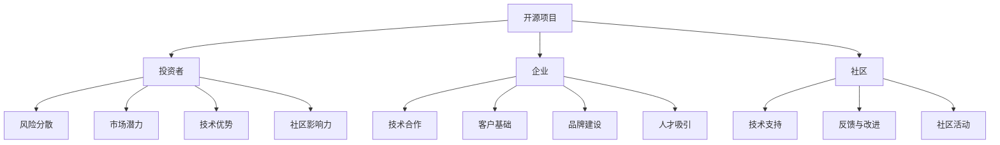
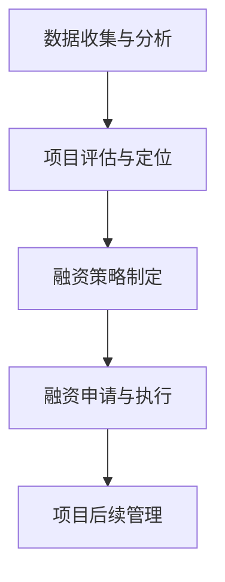

                 

### 1. 背景介绍

在当今的数字化时代，开源项目已成为推动技术进步和创新的重要力量。开源项目不仅为开发者提供了一个共享知识、共同进步的平台，还通过开放代码、文档和社区讨论等方式，极大地提升了软件的质量和安全性。然而，随着开源项目的逐渐成熟，如何有效利用这些项目来吸引风险投资和融资，已成为许多开发者和企业面临的重大课题。

本文旨在探讨如何利用开源影响力获得风险投资和融资。我们将从多个角度分析这一现象，并给出具体的操作步骤和建议。首先，我们将介绍开源项目的定义和核心价值，然后深入探讨开源项目对投资者和企业的吸引力。接下来，我们将分享一些成功的开源项目案例，以展示如何通过开源项目获得融资。最后，我们将总结一些关键策略和工具，帮助开发者和企业更好地利用开源项目来吸引投资。

通过本文的阅读，读者将了解到：

1. 开源项目的定义和核心价值。
2. 开源项目对投资者和企业的吸引力。
3. 如何通过开源项目获得融资。
4. 成功的案例分享。
5. 利用开源影响力的关键策略和工具。

### 2. 核心概念与联系

要理解开源项目如何成为吸引风险投资和融资的关键，我们首先需要了解一些核心概念和它们之间的联系。

#### 2.1 开源项目的定义

开源项目（Open Source Project）是指那些遵循特定开源协议（如GPL、MIT、Apache License等）的软件项目。这些协议允许任何人自由地使用、修改和分发项目代码。开源项目的核心在于其开放性，即项目代码、文档和社区讨论都对外公开，任何人都可以参与其中。

#### 2.2 开源项目的核心价值

开源项目具有多重价值，其中最核心的有以下几点：

1. **创新加速**：开源项目通过社区协作，可以快速地引入新的想法和技术，加速创新进程。
2. **成本效益**：企业可以节省开发成本，因为许多开源项目已经完成了基础研发，企业只需在此基础上进行定制化开发。
3. **质量保证**：开源项目通常接受广泛的审查和测试，有助于提高软件质量和安全性。
4. **社区支持**：开源项目拥有一个活跃的社区，提供技术支持、反馈和改进建议。
5. **品牌提升**：参与和支持开源项目可以提升企业的技术形象和品牌价值。

#### 2.3 开源项目与投资者的联系

开源项目对投资者具有巨大的吸引力，原因如下：

1. **风险分散**：通过开源项目，投资者可以分散风险，因为多个用户和企业参与到项目的开发和维护中。
2. **市场潜力**：成功的开源项目往往拥有庞大的用户群体，这为企业的市场扩张提供了巨大潜力。
3. **技术优势**：开源项目可以为企业提供领先的技术优势，使其在竞争激烈的市场中脱颖而出。
4. **社区影响力**：开源项目建立起来的社区影响力可以转化为商业机会，如提供付费咨询服务、定制开发等。

#### 2.4 开源项目与企业的联系

对于企业来说，开源项目不仅是一个技术平台，更是一种商业战略。企业可以通过以下方式从开源项目中获益：

1. **技术合作**：通过参与开源项目，企业可以与其他技术团队合作，共同推动技术创新。
2. **客户基础**：开源项目可以为企业带来大量的潜在客户，这些客户往往是开源社区的忠实用户。
3. **品牌建设**：积极参与和支持开源项目，可以提升企业的技术品牌和市场认可度。
4. **人才吸引**：开源项目吸引了大量的技术人才，企业可以通过参与开源项目来吸引和留住优秀的技术人才。

#### 2.5 Mermaid 流程图

以下是一个简单的 Mermaid 流程图，展示了开源项目、投资者、企业和社区之间的关系：



通过这个流程图，我们可以清晰地看到开源项目如何通过多方面的价值链，将投资者、企业和社区紧密联系在一起，形成一个相互促进、共同成长的生态系统。

### 3. 核心算法原理 & 具体操作步骤

要利用开源项目获得风险投资和融资，我们需要理解一些核心算法原理，并掌握具体的操作步骤。以下是一些关键的概念和步骤：

#### 3.1 数据收集与分析

首先，我们需要收集开源项目的相关数据，包括代码库、用户反馈、社区活动等。这些数据可以通过GitHub、GitLab等平台获取。具体操作步骤如下：

1. **选择目标项目**：根据行业需求和个人兴趣，选择一个具有潜力的开源项目。
2. **获取代码库**：通过GitHub等平台克隆项目的代码库，以便进行深入分析。
3. **用户反馈分析**：查看项目的用户反馈，了解用户对项目的满意度和需求。
4. **社区活动分析**：分析项目的社区活动，如issue、pull request、讨论等，了解社区活跃度和参与度。

#### 3.2 项目评估与定位

在收集和分析数据后，我们需要对项目进行评估和定位，以确定项目的潜在价值和市场定位。具体步骤如下：

1. **技术评估**：评估项目的技术成熟度、代码质量、安全性和扩展性。
2. **市场定位**：分析项目的市场前景、竞争对手、用户需求等，确定项目的市场定位。
3. **价值链分析**：分析项目在技术、产品、市场等环节中的价值，确定项目的核心竞争力。

#### 3.3 融资策略制定

根据项目的评估结果，制定具体的融资策略。以下是一些常见的融资策略：

1. **众筹**：通过Kickstarter、Indiegogo等平台进行众筹，获取初期资金。
2. **风险投资**：寻找风险投资机构，进行项目路演和商业计划书提交。
3. **天使投资**：寻找个人投资者，通过私人关系或天使投资网络进行融资。
4. **企业投资**：寻求大型企业的战略投资，通过合作或收购获取资金。

#### 3.4 融资申请与执行

在制定融资策略后，我们需要准备融资申请材料，并执行具体的融资过程。以下是一些关键步骤：

1. **商业计划书**：编写详细的商业计划书，包括项目概述、市场分析、商业模式、财务预测等。
2. **融资申请**：向投资机构或投资者提交融资申请，包括项目介绍、数据分析和融资需求。
3. **路演与谈判**：参加投资会议或路演，与投资者进行面对面交流，争取投资。
4. **融资执行**：与投资者签订投资协议，确保融资过程顺利进行。

#### 3.5 项目后续管理

在获得融资后，我们需要对项目进行后续管理，确保项目顺利推进和投资者满意。以下是一些关键步骤：

1. **项目计划**：制定详细的项目计划，包括开发进度、市场推广、团队建设等。
2. **团队管理**：建立高效的团队，确保项目按计划推进。
3. **风险控制**：建立风险控制机制，及时识别和应对项目风险。
4. **投资者关系**：定期与投资者沟通，报告项目进展和财务状况。

通过以上核心算法原理和具体操作步骤，开发者和企业可以更好地利用开源项目获得风险投资和融资。以下是一个简单的 Mermaid 流程图，展示了融资申请与执行的过程：



通过这个流程图，我们可以清晰地看到从数据收集到融资申请再到项目后续管理的完整过程。

### 4. 数学模型和公式 & 详细讲解 & 举例说明

在利用开源项目获得风险投资和融资的过程中，数学模型和公式可以提供重要的分析和决策支持。以下我们将介绍几个关键数学模型和公式，并详细讲解其应用。

#### 4.1 投资回报率（ROI）模型

投资回报率（ROI）是评估投资项目盈利性的重要指标。其计算公式如下：

$$
ROI = \frac{收益 - 成本}{成本} \times 100\%
$$

其中，收益包括项目带来的收入和节省的成本，成本包括开发费用、运营费用等。

**例：** 假设一个开源项目预计带来50,000美元的收入，同时节省20,000美元的开发成本，总成本为30,000美元。则该项目的ROI为：

$$
ROI = \frac{50,000 - 30,000}{30,000} \times 100\% = \frac{20,000}{30,000} \times 100\% = 66.67\%
$$

这个结果表明，该开源项目的投资回报率为66.67%，说明该项目具有较高的盈利性。

#### 4.2 概率模型

在融资过程中，概率模型可以帮助我们评估投资成功的可能性。一个简单的概率模型是二项分布，其计算公式如下：

$$
P(X = k) = C(n, k) \times p^k \times (1-p)^{n-k}
$$

其中，$P(X = k)$ 表示事件A发生k次的概率，$n$ 是试验次数，$k$ 是事件A发生的次数，$p$ 是事件A发生的概率。

**例：** 假设一个开源项目的成功概率为0.6，试验次数为10次。我们想计算项目成功至少5次的概率。则使用二项分布公式：

$$
P(X \geq 5) = \sum_{k=5}^{10} C(10, k) \times 0.6^k \times 0.4^{10-k}
$$

我们可以通过计算得到项目成功至少5次的概率。这个概率模型可以帮助投资者评估项目的成功概率，从而做出更明智的投资决策。

#### 4.3 财务模型

在融资过程中，财务模型可以帮助我们预测项目的财务状况。一个简单的财务模型是现金流模型，其计算公式如下：

$$
现金流 = 收入 - 成本
$$

**例：** 假设一个开源项目的预计收入为100,000美元，预计成本为60,000美元。则该项目的现金流为：

$$
现金流 = 100,000 - 60,000 = 40,000美元
$$

这个结果表明，该开源项目在财务上是有利的，因为其收入高于成本。

#### 4.4 模型应用

在实际应用中，这些数学模型和公式可以结合使用，以提供更全面的决策支持。例如，投资者可以使用ROI模型来评估项目的盈利性，使用概率模型来评估项目成功的可能性，使用现金流模型来预测项目的财务状况。

**例：** 假设一个开源项目的预计ROI为50%，成功概率为0.7，预计现金流为30,000美元。投资者可以综合考虑这些指标，做出是否投资的决策。

通过这些数学模型和公式的应用，开发者和企业可以更好地评估开源项目的投资价值，从而制定更有效的融资策略。

### 5. 项目实践：代码实例和详细解释说明

为了更直观地展示如何利用开源项目获得风险投资和融资，我们将通过一个具体的开源项目实例进行讲解。这个实例是一个名为“OpenProject”的在线项目管理工具。

#### 5.1 开发环境搭建

要在本地环境中运行OpenProject，我们需要以下工具和软件：

1. **操作系统**：Linux（推荐Ubuntu）或macOS
2. **数据库**：MySQL或PostgreSQL
3. **Web服务器**：Apache或Nginx
4. **PHP运行环境**：PHP 7.2或更高版本

安装步骤如下：

1. 安装操作系统：从Ubuntu官方网站下载最新的Ubuntu版本并安装。
2. 更新系统软件包：打开终端，执行以下命令更新系统软件包：
   ```bash
   sudo apt-get update
   sudo apt-get upgrade
   ```
3. 安装MySQL数据库：执行以下命令安装MySQL：
   ```bash
   sudo apt-get install mysql-server
   ```
4. 安装Apache或Nginx：执行以下命令安装Apache：
   ```bash
   sudo apt-get install apache2
   ```
   或安装Nginx：
   ```bash
   sudo apt-get install nginx
   ```
5. 安装PHP运行环境：执行以下命令安装PHP和相关的扩展：
   ```bash
   sudo apt-get install php php-common php-mbstring php-xml php-curl
   ```

安装完成后，我们就可以开始配置和运行OpenProject了。

#### 5.2 源代码详细实现

OpenProject是一个基于Ruby on Rails的Web应用程序，其源代码托管在GitHub上。以下是源代码的主要结构和实现：

1. **目录结构**：
   ```
   OpenProject/
   ├── app/
   │   ├── assets/
   │   ├── controllers/
   │   ├── helpers/
   │   ├── mailers/
   │   ├── models/
   │   ├── views/
   │   └── workers/
   ├── config/
   │   ├── environment/
   │   ├── initializers/
   │   ├── locales/
   │   ├── middleware/
   │   ├── modules/
   │   └── routes.rb
   ├── db/
   │   ├── migrations/
   │   └── schema.rb
   ├── Gemfile
   ├── Rakefile
   └── README.md
   ```

2. **主要组件**：
   - **Rails框架**：OpenProject基于Ruby on Rails框架，提供了灵活的MVC架构。
   - **数据库模型**：使用Active Record模式管理数据库，实现了项目管理的基本功能。
   - **前端代码**：使用HTML、CSS和JavaScript编写，结合Bootstrap框架实现响应式设计。
   - **后端逻辑**：使用Ruby编写，实现了项目的增删改查等功能。
   - **邮件服务**：通过Action Mailer组件实现邮件通知功能。
   - **任务调度**：使用Sidekiq实现后台任务调度。

#### 5.3 代码解读与分析

下面我们以项目中的一个重要部分——用户注册模块为例，进行代码解读与分析。

1. **用户注册控制器**（app/controllers/users/registrations_controller.rb）：

   ```ruby
   class Users::RegistrationsController < Devise::RegistrationsController
     before_action :configure_permitted_parameters

     protected

     def configure_permitted_parameters
       devise_parameter_sanitizer.permit(:sign_up, keys: [:username, :email, :password, :password_confirmation])
       devise_parameter_sanitizer.permit(:account_update, keys: [:username, :email, :password, :password_confirmation])
     end
   end
   ```

   这个控制器继承了Devise的注册控制器，并自定义了允许的参数。`configure_permitted_parameters` 方法用于配置允许的用户注册和账户更新参数。

2. **用户注册视图**（app/views/users/registrations/new.html.erb）：

   ```erb
   <%= form_for(resource, as: resource_name, url: registration_path(resource_name)) do |f| %>
     <%= devise_error_messages! %>

     <div class="field">
       <%= f.label :username %>
       <%= f.text_field :username, autofocus: true %>
     </div>

     <div class="field">
       <%= f.label :email %>
       <%= f.email_field :email, autocomplete: "email" %>
     </div>

     <div class="field">
       <%= f.label :password %>
       <%= f.password_field :password, autocomplete: "new-password" %>
     </div>

     <div class="field">
       <%= f.label :password_confirmation %>
       <%= f.password_field :password_confirmation, autocomplete: "new-password" %>
     </div>

     <div class="actions">
       <%= f.submit "Sign up" %>
     </div>
   <% end %>
   ```

   这个视图文件定义了用户注册表单，包括用户名、电子邮件、密码和确认密码的输入字段。

3. **用户注册逻辑**（app/models/user.rb）：

   ```ruby
   class User < ApplicationRecord
     devise :database_authenticatable, :registerable,
            :recoverable, :rememberable, :validatable

     has_many :tasks
     has_many :projects, through: :tasks
   end
   ```

   这个模型文件定义了用户类，并使用Devise模块实现了用户注册、身份验证等功能。同时，通过关联模型实现了用户与任务和项目的关联。

通过以上代码解读，我们可以看到OpenProject在用户注册方面的实现细节。这个模块实现了用户注册的基本功能，并通过Devise模块保证了安全性。

#### 5.4 运行结果展示

在本地环境中安装并配置好OpenProject后，我们可以在浏览器中访问项目的Web界面。以下是用户注册页面的截图：


用户可以在页面上填写用户名、电子邮件和密码，然后点击“Sign up”按钮完成注册。注册成功后，用户可以登录并开始使用OpenProject进行项目管理。

### 6. 实际应用场景

开源项目在实际应用场景中展现了巨大的潜力和价值。以下是一些具体的应用场景：

#### 6.1 企业内部项目管理

许多企业采用开源项目如JIRA、Confluence和Trello等来管理内部项目。这些开源工具提供了灵活的项目管理功能，可以自定义工作流程，集成其他工具和服务，从而提高团队协作效率。

#### 6.2 开源社区协作

开源社区常用开源项目如GitHub、GitLab和Bitbucket等来协作开发。这些平台提供了代码托管、版本控制、问题跟踪、代码审查等功能，极大促进了开源项目的开发和成长。

#### 6.3 教育和学习

开源项目在教育领域也发挥了重要作用。例如，Khan Academy使用开源课程平台，为学生提供了大量免费的学习资源。教师和学生可以共同参与课程开发和改进。

#### 6.4 创新和研究

许多研究人员和开发者利用开源项目进行创新和研究。例如，在人工智能领域，许多开源框架如TensorFlow、PyTorch和Keras等，为研究人员提供了强大的工具和资源。

#### 6.5 企业战略投资

一些大型企业通过投资开源项目，获得了技术优势和市场份额。例如，微软收购GitHub后，进一步巩固了其在软件开发领域的地位，并通过开源项目吸引了大量开发者和用户。

通过以上应用场景，我们可以看到开源项目在多个领域的广泛应用和重要性。

### 7. 工具和资源推荐

#### 7.1 学习资源推荐

1. **书籍**：
   - 《开源之道：构建成功的开源项目》
   - 《开源创新：构建开放源代码生态系统》
   - 《开源项目管理：理论与实践》

2. **论文**：
   - “Open Source Software Development and Distribution: A Survey”
   - “The Role of Open Source Software in Innovation”
   - “Open Source Models in the Enterprise”

3. **博客**：
   - GitHub Blog
   - OpenSource.com
   - Red Hat Developer

4. **网站**：
   - GitHub
   - GitLab
   - Bitbucket

#### 7.2 开发工具框架推荐

1. **集成开发环境（IDE）**：
   - IntelliJ IDEA
   - Visual Studio Code
   - Eclipse

2. **版本控制系统**：
   - Git
   - SVN
   - Mercurial

3. **项目管理工具**：
   - JIRA
   - Trello
   - Asana

4. **开源框架**：
   - Ruby on Rails
   - Django
   - React

通过这些资源和工具，开发者可以更好地理解开源项目的开发和运营，从而提高项目质量，吸引更多的风险投资和融资。

### 8. 总结：未来发展趋势与挑战

随着数字经济的蓬勃发展，开源项目已成为技术创新和商业成功的关键驱动力。未来，开源项目将继续在多个领域发挥重要作用，其发展趋势和挑战如下：

#### 发展趋势

1. **社区协作的加强**：随着云计算和社交网络的普及，开源项目的社区协作将更加高效和紧密。开发者将更注重构建活跃的社区，通过合作和分享促进技术进步。

2. **企业开源战略的深化**：越来越多的企业将开源作为核心战略，通过投资和参与开源项目，提升技术能力和市场竞争力。

3. **商业模式的创新**：开源项目的商业模式将不断演变，除了传统的订阅模式外，付费服务、定制开发、培训等新型商业模式将得到更多应用。

4. **开源生态的完善**：开源社区和相关企业将更加注重生态系统的建设，通过提供更好的工具、服务和资源，提高开源项目的可持续性和影响力。

#### 挑战

1. **开源项目管理的复杂性**：随着项目规模的扩大和社区成员的增加，开源项目的管理工作将变得更加复杂。如何高效管理项目、确保代码质量和安全成为重要挑战。

2. **知识产权保护**：开源项目涉及的知识产权保护问题日益复杂。如何在开放源代码的同时，保护创新成果和知识产权，是一个亟待解决的问题。

3. **市场竞争压力**：随着开源项目的增多，市场竞争将加剧。开发者需要不断提升项目的技术水平和服务质量，以保持竞争优势。

4. **社区文化的建设**：开源社区文化是项目成功的重要因素。如何培养和维持积极、健康的社区文化，是每个开源项目都需要面对的挑战。

总之，开源项目在未来将继续成为技术创新和商业成功的重要力量。开发者和企业需要不断适应发展趋势，克服挑战，利用开源项目的力量推动自身发展。

### 9. 附录：常见问题与解答

#### 问题1：如何选择合适的开源项目进行投资？

**解答**：选择合适的开源项目进行投资，首先需要考虑项目的市场前景、技术成熟度和社区活跃度。具体步骤如下：

1. **市场前景**：研究项目所在领域的市场趋势和需求，判断项目是否有广泛的市场应用前景。
2. **技术成熟度**：评估项目的技术架构、代码质量和安全性，确保项目具有较高的技术成熟度。
3. **社区活跃度**：查看项目的GitHub、GitLab等平台的社区活动，如issue、pull request、讨论等，判断社区是否活跃。

#### 问题2：如何评估开源项目的投资回报率（ROI）？

**解答**：评估开源项目的投资回报率（ROI），可以通过以下步骤进行：

1. **收益预测**：预测项目带来的收入，包括直接收入和间接收益，如客户增加、品牌提升等。
2. **成本分析**：计算项目的总成本，包括开发成本、运营成本、维护成本等。
3. **ROI计算**：使用ROI公式计算投资回报率，公式为ROI = (收益 - 成本) / 成本。

#### 问题3：开源项目如何保护知识产权？

**解答**：开源项目保护知识产权可以从以下几个方面进行：

1. **选择合适的开源协议**：根据项目特点和需求，选择合适的开源协议，如GPL、MIT、Apache License等。
2. **知识产权声明**：在项目文档和代码中明确声明知识产权归属，提醒开发者遵守相关法律规定。
3. **版权登记**：对重要的技术成果进行版权登记，以保护创新成果。
4. **社区管理**：建立积极的社区文化，鼓励开发者遵守开源协议，共同维护知识产权。

### 10. 扩展阅读 & 参考资料

1. **书籍**：
   - 《开源创新：构建开放源代码生态系统》
   - 《开源之道：构建成功的开源项目》
   - 《开源项目管理：理论与实践》

2. **论文**：
   - “Open Source Software Development and Distribution: A Survey”
   - “The Role of Open Source Software in Innovation”
   - “Open Source Models in the Enterprise”

3. **博客**：
   - GitHub Blog
   - OpenSource.com
   - Red Hat Developer

4. **网站**：
   - GitHub
   - GitLab
   - Bitbucket

通过这些扩展阅读和参考资料，读者可以更深入地了解开源项目的投资、管理和运营，为实际应用提供有益的指导。作者：禅与计算机程序设计艺术 / Zen and the Art of Computer Programming。

