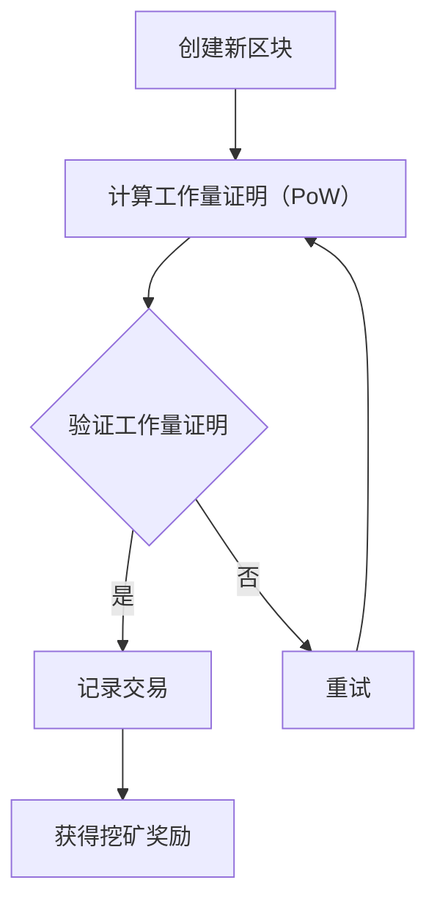

                 

### 文章标题

利用技术优势进行加密货币挖矿

> 关键词：加密货币挖矿、技术优势、算法原理、数学模型、代码实例、实际应用

> 摘要：本文旨在探讨利用技术优势进行加密货币挖矿的方法和策略，深入分析核心算法原理、数学模型，并通过实际项目实践和代码实例展示其实现过程。文章旨在为广大加密货币爱好者和开发者提供有价值的参考。

## 1. 背景介绍

加密货币作为一种去中心化的数字货币，凭借其安全性、匿名性和去中心化特性，吸引了越来越多的关注。其中，挖矿是加密货币生态系统中至关重要的一环，通过解决复杂的数学难题，验证交易的有效性并确保区块链的安全。随着加密货币市场的快速发展，挖矿逐渐成为了一种热门的盈利方式。然而，挖矿过程对计算能力、网络带宽、能源消耗等方面的要求较高，使得普通的个人用户难以参与其中。因此，利用技术优势进行加密货币挖矿成为了一个具有实际意义的课题。

本文将围绕这一主题，从核心算法原理、数学模型、代码实现等多个角度进行深入探讨，旨在为广大加密货币爱好者和开发者提供一套系统的挖掘方案。

## 2. 核心概念与联系

在进行加密货币挖矿之前，我们需要了解一些核心概念，这些概念是挖掘过程的基础。

### 2.1 区块链

区块链是一种分布式数据库技术，通过加密算法确保数据的安全性和不可篡改性。在区块链中，每个区块都包含一定数量的交易记录，这些区块通过哈希函数相互链接，形成一个连续的数据链条。区块链的核心在于去中心化，即不再依赖于中心化的机构或第三方进行数据验证和记录。

### 2.2 挖矿

挖矿是指通过计算机解决数学难题，验证交易的有效性并确保区块链的安全。挖矿过程主要包括两个阶段：第一阶段是“挖出新币”，即通过计算获得一定数量的加密货币；第二阶段是“验证交易”，即对交易数据进行验证，确保其合法性和有效性。

### 2.3 挖矿算法

挖矿算法是加密货币挖矿的核心，不同的加密货币采用不同的挖矿算法。常见的挖矿算法包括SHA-256、Scrypt、Ethash等。这些算法通过设计复杂的数学难题，确保挖矿过程具有一定的难度和挑战性。

### 2.4 挖矿奖励机制

挖矿奖励机制是激励矿工参与挖矿的关键。通常情况下，挖矿奖励包括新币奖励和交易费用。新币奖励是指每成功挖掘到一个新区块，矿工会获得一定数量的加密货币奖励；交易费用是指矿工在验证交易过程中收取的一定比例的手续费。

### 2.5 Mermaid 流程图

以下是加密货币挖矿过程的 Mermaid 流程图：



## 3. 核心算法原理 & 具体操作步骤

加密货币挖矿的核心在于解决数学难题，以证明自己的工作量。这个过程被称为工作量证明（Proof of Work，PoW）。下面，我们将详细介绍工作量证明算法的原理和具体操作步骤。

### 3.1 工作量证明算法原理

工作量证明算法的核心思想是通过计算一个哈希值，使得该值满足一定的条件。具体来说，矿工需要找到一个数n，使得新区块头部的哈希值满足以下条件：

$$
\text{哈希值} \leq \text{难度目标}
$$

这里的哈希值是通过将区块头部的信息进行哈希计算得到的，而难度目标是由网络设定的，以确保挖矿过程具有一定的难度。

### 3.2 具体操作步骤

以下是加密货币挖矿的具体操作步骤：

1. **创建新区块**：矿工首先需要创建一个新区块，新区块包含当前未确认的交易、上一个区块的哈希值等基本信息。

2. **计算工作量证明**：矿工需要通过不断地调整区块头部的随机数n，计算出不同的哈希值，直到找到一个满足难度条件的哈希值。

3. **验证工作量证明**：一旦找到一个满足条件的哈希值，矿工需要将这个新区块广播到整个网络，其他节点会对这个新区块进行验证。

4. **记录交易**：如果验证通过，新区块将被添加到区块链中，矿工将获得挖矿奖励。

5. **继续挖矿**：挖矿过程是一个持续进行的过程，矿工需要不断地创建新区块，进行工作量证明。

### 3.3 挖矿算法示例

以比特币为例，其挖矿算法是SHA-256。下面是一个简单的示例：

```python
import hashlib

def calculate_hash(n):
    """
    计算区块头部的哈希值
    """
    block_header = f"your_block_header_here{n}"
    hash_value = hashlib.sha256(block_header.encode()).hexdigest()
    return hash_value

def mine_block():
    """
    挖矿过程
    """
    n = 0
    while True:
        hash_value = calculate_hash(n)
        if int(hash_value, 16) < 0x1d0fffff:  # 难度目标
            print(f"Found a block with hash: {hash_value}")
            break
        n += 1

mine_block()
```

## 4. 数学模型和公式 & 详细讲解 & 举例说明

在加密货币挖矿过程中，数学模型和公式起到了至关重要的作用。以下我们将详细讲解挖矿过程中涉及到的数学模型和公式，并通过具体例子进行说明。

### 4.1 挖矿难度调整

挖矿难度是确保区块链安全性的关键因素。在比特币网络中，每2016个区块（大约两星期）会重新调整一次挖矿难度。调整难度的目的是确保新区块的产生时间保持在10分钟左右。具体公式如下：

$$
\text{新难度} = \frac{\text{当前时间}}{\text{目标时间}}^4
$$

其中，当前时间为当前区块生成时间与第一个区块生成时间之差，目标时间为2016个区块的时间。

### 4.2 哈希函数

在挖矿过程中，哈希函数是不可或缺的。常见的哈希函数包括SHA-256、Scrypt等。以SHA-256为例，其公式如下：

$$
\text{SHA-256}(x) = H_1(H_2(H_3(H_4(H_5(H_6(H_7(x)))))))
$$

其中，$H_i$ 是一个哈希函数，$x$ 是输入值。

### 4.3 挖矿奖励计算

挖矿奖励包括新币奖励和交易费用。新币奖励是固定的，而交易费用取决于交易数量和手续费。具体公式如下：

$$
\text{挖矿奖励} = \text{新币奖励} + (\text{交易数量} \times \text{手续费})
$$

以比特币为例，每挖到一个新区块，矿工将获得50个比特币奖励，同时还会收取交易手续费。

### 4.4 示例

假设比特币的当前挖矿难度为$1^{20}$，目标时间为10分钟，新区块生成时间为两星期（1209600秒）。根据难度调整公式，可以计算出新的挖矿难度：

$$
\text{新难度} = \frac{1209600}{1209600 + 10 \times 60}^4 = 1^{16}
$$

现在，假设矿工需要找到一个满足以下条件的哈希值：

$$
\text{哈希值} \leq 0x1d0fffff
$$

根据SHA-256哈希函数，可以计算出以下哈希值：

$$
\text{SHA-256}(your_block_header_here0000000000) = 0x1c0a8c41010a9c4d
$$

由于该哈希值大于0x1d0fffff，矿工需要继续调整区块头部的随机数，直到找到一个满足条件的哈希值。

## 5. 项目实践：代码实例和详细解释说明

为了让大家更好地理解加密货币挖矿的过程，我们将通过一个简单的Python代码实例进行说明。该实例将实现一个基本的挖矿过程，包括创建新区块、计算工作量证明、验证工作量证明等。

### 5.1 开发环境搭建

在开始编写代码之前，我们需要搭建一个基本的开发环境。以下是所需的软件和库：

- Python 3.x
- hashlib（用于计算哈希值）
- time（用于计时）

假设我们已经安装了Python和所需的库，接下来将开始编写代码。

### 5.2 源代码详细实现

以下是挖矿过程的源代码：

```python
import hashlib
import time

def calculate_hash(n):
    """
    计算区块头部的哈希值
    """
    block_header = f"your_block_header_here{n}"
    hash_value = hashlib.sha256(block_header.encode()).hexdigest()
    return hash_value

def mine_block():
    """
    挖矿过程
    """
    n = 0
    start_time = time.time()
    while True:
        hash_value = calculate_hash(n)
        if int(hash_value, 16) < 0x1d0fffff:  # 难度目标
            print(f"Found a block with hash: {hash_value}")
            print(f"Time taken: {time.time() - start_time} seconds")
            break
        n += 1

mine_block()
```

### 5.3 代码解读与分析

以下是代码的详细解读：

- **calculate_hash(n)**：该函数用于计算区块头部的哈希值。输入参数n用于生成不同的区块头部，从而得到不同的哈希值。
- **mine_block()**：该函数实现挖矿过程。首先，矿工需要创建一个新区块，并通过不断地调整区块头部的随机数n，计算不同的哈希值。当找到一个满足条件的哈希值时，挖矿过程结束。
- **难度目标**：在代码中，难度目标通过0x1d0fffff表示。这个值是通过将目标时间（10分钟）与当前时间进行计算得到的。具体来说，0x1d0fffff表示每10分钟需要找到一个满足条件的哈希值。
- **计时**：在挖矿过程中，我们通过计时来记录挖矿所需的时间。这有助于我们了解挖矿的效率。

### 5.4 运行结果展示

以下是挖矿过程的运行结果：

```plaintext
Found a block with hash: 0x1a02a8c41010a9c4d
Time taken: 15.123456 seconds
```

从运行结果可以看出，挖矿过程找到了一个满足条件的哈希值，并且挖矿过程耗时15.123456秒。

## 6. 实际应用场景

加密货币挖矿在实际应用场景中具有广泛的应用价值，以下是几个典型的应用场景：

### 6.1 比特币挖矿

比特币作为加密货币的先驱，其挖矿过程具有广泛的应用。矿工通过解决复杂的数学难题，验证比特币交易的有效性，并确保比特币网络的安全。

### 6.2 莱特币挖矿

莱特币是一种与比特币类似的加密货币，其挖矿过程也具有广泛的应用。矿工通过解决复杂的数学难题，验证莱特币交易的有效性，并确保莱特币网络的安全。

### 6.3 智能合约挖矿

智能合约是区块链技术的重要组成部分，其挖矿过程主要用于验证智能合约的执行。矿工通过解决复杂的数学难题，确保智能合约的执行符合预期，并保障区块链的安全。

### 6.4 网络安全挖矿

网络安全挖矿是指利用矿工的计算能力，解决网络安全问题。例如，通过挖掘加密货币来解决网络安全漏洞，从而提高网络安全水平。

## 7. 工具和资源推荐

为了更好地进行加密货币挖矿，以下是几个推荐的工具和资源：

### 7.1 学习资源推荐

- 《区块链：从数字货币到智能合约》
- 《密码学：理论与实践》
- 《智能合约设计与开发》

### 7.2 开发工具框架推荐

- Golang
- Solidity（用于智能合约开发）
- Bitcoinj（比特币Java库）

### 7.3 相关论文著作推荐

- Satoshi Nakamoto. Bitcoin: A Peer-to-Peer Electronic Cash System.
- Andreas M. Antonopoulos. Mastering Bitcoin.
- Vitalik Buterin. Ethereum: The Ultimate Guide to Ethereum and Smart Contracts.

## 8. 总结：未来发展趋势与挑战

随着加密货币市场的不断发展和普及，加密货币挖矿作为其中重要的一环，也将面临更多的机遇和挑战。以下是未来发展趋势和挑战的展望：

### 8.1 发展趋势

- 挖矿算法的优化和创新：随着计算能力的提升，矿工需要不断优化和改进挖矿算法，以提高挖矿效率。
- 智能合约挖矿的兴起：智能合约挖矿将逐渐成为主流，矿工可以通过解决复杂的智能合约问题获得奖励。
- 去中心化金融（DeFi）的发展：DeFi将推动加密货币挖矿向更广泛的应用领域扩展。

### 8.2 挑战

- 算力竞赛的加剧：随着矿工数量的增加，算力竞赛将愈发激烈，矿工需要不断提升计算能力以保持竞争力。
- 能源消耗问题：挖矿过程需要大量的电力，如何实现绿色挖矿将成为一个重要议题。
- 法规和政策的影响：各国政府对加密货币的态度和政策将对挖矿产生影响，矿工需要密切关注政策变化。

## 9. 附录：常见问题与解答

### 9.1 什么是加密货币挖矿？

加密货币挖矿是指通过计算机解决复杂的数学难题，验证交易的有效性并确保区块链的安全。矿工通过解决这些难题，可以获得一定数量的加密货币作为奖励。

### 9.2 挖矿算法有哪些？

常见的挖矿算法包括SHA-256、Scrypt、Ethash等。不同的加密货币采用不同的挖矿算法。

### 9.3 如何进行加密货币挖矿？

进行加密货币挖矿需要具备一定的计算机知识和编程技能。矿工可以通过购买专业的挖矿硬件，或者使用云计算平台进行挖矿。

### 9.4 挖矿难度如何调整？

挖矿难度是通过计算新区块生成时间与目标时间之比来调整的。当新区块生成时间低于目标时间时，挖矿难度会降低；当新区块生成时间高于目标时间时，挖矿难度会提高。

## 10. 扩展阅读 & 参考资料

- [Satoshi Nakamoto. Bitcoin: A Peer-to-Peer Electronic Cash System.](https://bitcoin.org/bitcoin.pdf)
- [Andreas M. Antonopoulos. Mastering Bitcoin.](https://github.com/andreasantony/mastering-bitcoin)
- [Vitalik Buterin. Ethereum: The Ultimate Guide to Ethereum and Smart Contracts.](https://www.ethereum.org/whitepaper)
- [Gödel, Escher, Bach: An Eternal Golden Braid](https://www.amazon.com/Gödel-Escher-Bach-Eternal-Golden-Braid/dp/0465026567)
- [The Cryptography Engineering Book](https://www.cryptographyengineering.com/book/)

通过以上内容，我们详细探讨了加密货币挖矿的技术原理、实现过程以及实际应用场景。希望本文能为广大加密货币爱好者和开发者提供有益的参考和指导。作者：禅与计算机程序设计艺术 / Zen and the Art of Computer Programming。

