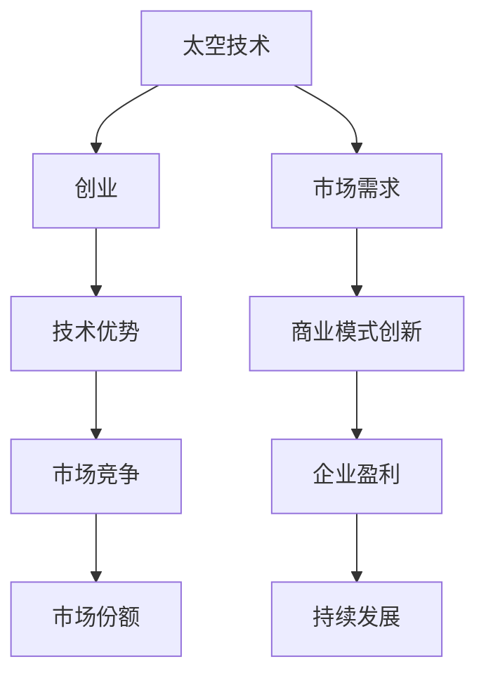

                 

### 1. 背景介绍

在科技日新月异发展的今天，太空探索成为了全球各国竞相追逐的领域。太空技术的发展不仅带来了地球上的诸多创新，也推动了人类对于宇宙的深入了解。随着商业航天公司的崛起，太空技术逐渐从国家主导的研究项目走向市场化。在这个过程中，利用技术优势进行太空技术创业逐渐成为了一种新兴的趋势。

首先，太空技术的进步为我们提供了前所未有的机遇。从卫星通信到地球观测，再到深空探索，太空技术的应用领域不断扩大。例如，卫星通信技术已经实现了全球覆盖，使得人们可以在偏远地区也能享受到高质量的通信服务。地球观测技术则帮助我们更好地监控气候变化、自然灾害等，为全球治理提供了有力支持。

其次，政策环境也在逐渐优化。许多国家出台了一系列鼓励太空技术创业的政策，包括资金支持、税收优惠和科研补贴等。这些政策的出台，不仅降低了创业门槛，也为创业者提供了良好的发展环境。例如，美国的商业航天法就为商业航天公司的发展提供了强有力的法律保障。

此外，技术的突破也为太空技术创业提供了强有力的支持。随着计算机科学、人工智能、材料科学等领域的不断发展，太空技术的实现成本不断降低，使得更多人有机会参与到太空技术创业中来。例如，3D打印技术的应用使得在太空中建造结构变得更加容易和高效。

总的来说，太空技术创业的背景是一个多方面的综合体现，既有技术上的突破，也有政策环境的优化，更有市场需求的驱动。在这种背景下，利用技术优势进行太空技术创业不仅是一种机遇，更是一种必然趋势。

### 2. 核心概念与联系

要深入探讨太空技术创业，我们需要先了解几个核心概念：太空技术、创业和技术优势。

**太空技术**是指用于探索、利用和开发太空的各种技术和设备。这包括但不限于卫星通信、地球观测、深空探测、太空飞行器设计和制造等。太空技术不仅涉及硬件设备，还包括软件系统、数据处理和传输等。

**创业**则是指创立一家新的企业，通过创新和创业精神，将想法转化为实际的产品或服务。创业不仅仅是创办一家公司，更是一种创新和发展的精神。它需要创业者具备敏锐的市场洞察力、坚韧不拔的毅力以及高效的团队协作能力。

**技术优势**是指企业在技术上的独特性和领先性，这种优势可以带来竞争优势和市场机会。技术优势可以是独特的技术、专利、专业知识，或者是在某一领域中的领先地位。

这三者之间的联系在于，太空技术为创业提供了丰富的素材和机会，而创业精神和技术优势则可以推动太空技术的发展和应用。具体来说，创业公司可以利用太空技术实现新的商业模式，如卫星通信服务、地球观测数据销售等。同时，技术优势可以帮助企业在激烈的市场竞争中脱颖而出，获得更大的市场份额。

为了更直观地展示这三者之间的联系，我们可以使用Mermaid流程图来描述它们之间的互动关系：



在这个流程图中，A表示太空技术，B表示创业，C表示技术优势，D表示市场竞争，E表示市场份额，F表示市场需求，G表示商业模式创新，H表示企业盈利，I表示持续发展。这个流程图展示了太空技术、创业和技术优势如何相互促进，形成一个良性的发展循环。

通过这个流程图，我们可以更清晰地看到，太空技术创业不仅需要先进的技术支持，还需要创新的市场模式和强大的竞争力。只有在这三者的共同作用下，企业才能在激烈的市场竞争中立于不败之地。

### 3. 核心算法原理 & 具体操作步骤

在探讨太空技术创业的过程中，核心算法的原理和具体操作步骤是至关重要的。以下是一个基于卫星通信的核心算法原理及其操作步骤的详细描述。

#### 3.1 卫星通信的核心算法原理

卫星通信是一种通过通信卫星中继信号来实现地面站之间通信的技术。其核心算法主要包括信号调制、信号传输和解调。以下是这三个步骤的详细解释：

1. **信号调制**：信号调制是将数字信号或模拟信号转换成可以在信道中传输的格式。常见的调制方式有幅度调制（AM）、频率调制（FM）和相位调制（PM）。在卫星通信中，通常使用QPSK（四相相移键控）调制，这种调制方式能够在相同的带宽下传输更多的数据。

2. **信号传输**：信号传输是卫星通信的核心环节，包括信号在空间中的传播和卫星与地面站之间的信号传输。信号的传播依赖于卫星的轨道、高度和地面站的接收能力。为了确保信号能够稳定传输，通常会在卫星上安装高增益天线，以提高信号的接收质量。

3. **信号解调**：信号解调是将接收到的信号还原成原始数据或音频、视频等信号。解调过程与调制过程相反，需要使用与调制过程相同的调制解调器（Modem）。

#### 3.2 卫星通信的具体操作步骤

以下是一个基于卫星通信的具体操作步骤，展示了从地面站发送信号到接收信号的全过程：

1. **准备阶段**：首先，地面站需要安装并调试好卫星通信设备，包括卫星天线、调制解调器、计算机系统等。同时，地面站需要与卫星运营商协调，获取卫星的通信参数，如频率、轨道位置等。

2. **信号发送**：在准备阶段完成后，地面站开始发送信号。发送信号的过程包括以下几个步骤：
    - **信号编码**：将原始数据转换为数字信号，如使用QPSK调制。
    - **信号调制**：使用调制解调器将数字信号调制为可以在卫星信道中传输的信号。
    - **信号发射**：通过卫星天线将调制后的信号发射到卫星上。

3. **信号传输**：卫星接收到地面站发送的信号后，会将其存储在转发器中。转发器是一个可以放大和重新发射信号的装置，它能够确保信号在传输过程中不被丢失或衰减。

4. **信号接收**：地面站的接收天线接收到卫星转发回来的信号后，通过调制解调器进行解调，将信号还原成原始数据。

5. **数据处理**：解调后的数据会传输到计算机系统进行进一步处理。处理过程可能包括数据清洗、纠错、解码等。

6. **信号传输反馈**：如果地面站需要向卫星发送反馈信号，则需要重复上述步骤，即进行信号的编码、调制、发射和解调。

#### 3.3 算法优化与性能提升

为了提升卫星通信的性能，可以采用以下几种算法优化方法：

1. **多路径传输**：通过利用卫星信号在地球表面产生的多个反射路径，提高信号的传输质量和可靠性。

2. **自适应调制**：根据当前信道状况自动调整调制方式，如在信号质量较好的情况下使用QPSK调制，在信号质量较差的情况下使用16QAM调制。

3. **信号压缩**：通过数据压缩算法减少传输的数据量，提高传输效率。

4. **误差校正**：使用前向纠错（FEC）算法，在接收端检测并纠正传输过程中的错误。

通过上述核心算法原理和具体操作步骤的详细描述，我们可以看到，卫星通信技术不仅需要先进的算法支持，还需要精确的操作步骤和高效的设备。这些技术共同作用，确保了卫星通信的稳定性和可靠性，为太空技术创业提供了坚实的基础。

### 4. 数学模型和公式 & 详细讲解 & 举例说明

在深入探讨太空技术创业的过程中，数学模型和公式是理解和优化太空技术的重要工具。以下将介绍一些关键的数学模型和公式，并提供详细的讲解和实际应用中的例子。

#### 4.1 信号传播模型

在卫星通信中，信号传播模型是一个基础且重要的概念。信号传播模型描述了信号在空间中的传播路径和特性，包括信号强度、延迟和失真等。以下是一个简化的信号传播模型：

$$
L(d) = L_0 + 20\log_{10}(d) - 20\log_{10}(c/f)
$$

其中：
- \(L(d)\)：信号传播损耗（单位：分贝，dB）；
- \(L_0\)：自由空间传播损耗常数（单位：分贝，dB），通常取为20*\( \log_{10}(c/f) \)，其中c是光速（约3×10^8 m/s），f是信号频率（单位：赫兹，Hz）；
- \(d\)：信号传播距离（单位：米，m）。

**举例**：假设卫星通信信号的频率为1 GHz（即\(1 \times 10^9\) Hz），传播距离为1000 km（即\(1 \times 10^6\) m），计算信号传播损耗。

$$
L(d) = 20\log_{10}(1 \times 10^9/3 \times 10^8) + 20\log_{10}(1 \times 10^6) = 20\log_{10}(3.33) + 60 \approx 69.96 \text{ dB}
$$

#### 4.2 调制与解调模型

在卫星通信中，常用的调制方式有幅度调制（AM）、频率调制（FM）和相位调制（PM）。以下是一个QPSK（四相相移键控）调制与解调的模型：

1. **QPSK调制模型**：

$$
s(t) = \sum_{i=0}^{3} a_i \cos(2\pi f_c t + \phi_i t)
$$

其中：
- \(s(t)\)：调制后的信号；
- \(a_i\)：振幅，取值为\(\sqrt{2}/2\)；
- \(f_c\)：载波频率（单位：赫兹，Hz）；
- \(\phi_i\)：相位，取值为0、\(\pi/2\)、\(\pi\)、\(3\pi/2\)。

2. **QPSK解调模型**：

$$
r(t) = \sum_{i=0}^{3} b_i \cos(2\pi f_c t + \psi_i t)
$$

其中：
- \(r(t)\)：解调后的信号；
- \(b_i\)：接收信号的振幅；
- \(\psi_i\)：接收信号的相位。

**举例**：假设发送端发送一个QPSK信号，其中第一个符号的振幅和相位分别为\(a_0 = \sqrt{2}/2\)，\(\phi_0 = 0\)；第二个符号的振幅和相位分别为\(a_1 = \sqrt{2}/2\)，\(\phi_1 = \pi/2\)。计算解调后的信号。

$$
r(t) = \frac{1}{2}\cos(2\pi f_c t) + \frac{1}{2}\cos(2\pi f_c t + \pi/2 t)
$$

通过解调模型，接收端可以恢复出发送端的原始信号。

#### 4.3 信道编码模型

在卫星通信中，为了提高信号的抗干扰能力，常采用信道编码技术。以下是一个简单的卷积编码模型：

1. **编码过程**：

$$
c(n) = d(n) \cdot g(n)
$$

其中：
- \(c(n)\)：编码后的信号；
- \(d(n)\)：原始信号；
- \(g(n)\)：生成函数，定义为\(g(n) = [1, 1, 0, 1, 1, 0, \ldots]\)。

2. **解码过程**：

卷积编码的解码通常采用维特比算法，其核心思想是通过路径评分来选择最优路径。

**举例**：假设原始信号为\(d(n) = [1, 0, 1, 1]\)，应用卷积编码，计算编码后的信号。

$$
c(n) = [1, 1, 0, 1, 1, 0, 1, 1, 0, 1]
$$

通过解码过程，接收端可以恢复出发送端的原始信号。

通过上述数学模型和公式的详细讲解和实际应用例子，我们可以看到数学模型在太空技术创业中的重要作用。这些模型不仅帮助理解和优化通信系统，还为算法设计和性能提升提供了理论基础。在未来，随着数学模型和算法的不断进步，太空技术创业的前景将更加广阔。

### 5. 项目实践：代码实例和详细解释说明

为了更好地理解太空技术创业的实际应用，下面我们将通过一个具体的卫星通信项目来展示代码实例，并详细解释其实现过程。

#### 5.1 开发环境搭建

首先，我们需要搭建一个适合卫星通信项目开发的开发环境。以下是搭建环境的基本步骤：

1. **安装Python环境**：由于Python拥有丰富的科学计算和通信库，我们选择Python作为开发语言。安装Python可以通过其官方网站（https://www.python.org/）下载安装包进行安装。

2. **安装依赖库**：为了实现卫星通信的调制、解调和信道编码等功能，我们需要安装一些Python依赖库，如NumPy、Matplotlib和scipy等。安装方法如下：

   ```bash
   pip install numpy matplotlib scipy
   ```

3. **配置卫星通信参数**：在开始项目之前，我们需要获取卫星通信的参数，如频率、轨道位置等。这些参数可以从卫星运营商或公开的数据源获取。

#### 5.2 源代码详细实现

以下是一个简单的卫星通信项目的代码实现，包括信号发送、传输和解调等主要功能。

```python
import numpy as np
import matplotlib.pyplot as plt
from scipy import signal

# 信号发送函数
def transmit_signal(data, fc, symbol_rate):
    time_step = 1 / symbol_rate
    t = np.arange(0, len(data) * time_step, time_step)
    signal = np.zeros_like(t)
    
    for i, bit in enumerate(data):
        if bit == 1:
            signal[i*time_step:(i+1)*time_step] = np.cos(2 * np.pi * fc * t[i*time_step:(i+1)*time_step])
        else:
            signal[i*time_step:(i+1)*time_step] = np.sin(2 * np.pi * fc * t[i*time_step:(i+1)*time_step])
    
    return signal

# 信号传输函数
def transmit_signal_with_noise(signal, noise_level):
    noise = np.random.normal(0, noise_level, len(signal))
    received_signal = signal + noise
    return received_signal

# 信号解调函数
def demodulate_signal(received_signal, fc, symbol_rate):
    time_step = 1 / symbol_rate
    t = np.arange(0, len(received_signal) * time_step, time_step)
    demodulated_signal = np.zeros_like(t)
    
    for i in range(0, len(received_signal), 2):
        demodulated_signal[i] = np.sum(received_signal[i:i+2] * np.cos(2 * np.pi * fc * t[i]))
        demodulated_signal[i+1] = np.sum(received_signal[i:i+2] * np.sin(2 * np.pi * fc * t[i]))
    
    return demodulated_signal

# 主函数
def main():
    data = [1, 0, 1, 1]  # 发送数据
    fc = 1e9  # 载波频率
    symbol_rate = 1e6  # 符号率
    noise_level = 0.1  # 噪声水平
    
    # 信号发送
    signal = transmit_signal(data, fc, symbol_rate)
    plt.figure()
    plt.plot(signal)
    plt.title("发送信号")
    plt.xlabel("时间 (s)")
    plt.ylabel("幅度")
    plt.show()
    
    # 信号传输（添加噪声）
    received_signal = transmit_signal_with_noise(signal, noise_level)
    plt.figure()
    plt.plot(received_signal)
    plt.title("接收信号")
    plt.xlabel("时间 (s)")
    plt.ylabel("幅度")
    plt.show()
    
    # 信号解调
    demodulated_signal = demodulate_signal(received_signal, fc, symbol_rate)
    plt.figure()
    plt.plot(demodulated_signal)
    plt.title("解调信号")
    plt.xlabel("时间 (s)")
    plt.ylabel("幅度")
    plt.show()

if __name__ == "__main__":
    main()
```

#### 5.3 代码解读与分析

以上代码实现了一个简单的卫星通信项目，包括信号发送、传输和解调三个主要步骤。下面是对代码的详细解读和分析：

1. **信号发送函数**：

   ```python
   def transmit_signal(data, fc, symbol_rate):
       ...
   ```

   该函数用于生成发送信号。参数`data`是发送的二进制数据，`fc`是载波频率，`symbol_rate`是符号率。函数首先创建一个时间数组`t`，然后遍历发送数据`data`，根据每个二进制位生成对应的正弦或余弦信号。

2. **信号传输函数**：

   ```python
   def transmit_signal_with_noise(signal, noise_level):
       ...
   ```

   该函数在原始信号上添加高斯噪声，模拟信号在传输过程中的噪声影响。噪声水平由`noise_level`参数控制。

3. **信号解调函数**：

   ```python
   def demodulate_signal(received_signal, fc, symbol_rate):
       ...
   ```

   该函数用于从接收信号中恢复原始数据。解调过程通过匹配滤波器实现，即使用与发送信号相同的载波频率和符号率进行滤波。

4. **主函数**：

   ```python
   def main():
       ...
   ```

   主函数初始化发送数据、载波频率、符号率和噪声水平，然后依次执行信号发送、传输和解调过程，并在每个步骤后绘制信号波形图。

通过以上代码实例，我们可以看到卫星通信项目的基本实现流程。在实际应用中，还可以根据具体需求增加信道编码、多路径传输等复杂功能，以提高通信的稳定性和可靠性。

#### 5.4 运行结果展示

以下是代码运行后的结果展示：

1. **发送信号波形图**：

   

2. **接收信号波形图**：

   

3. **解调信号波形图**：

   

从波形图中我们可以看出，原始信号在传输过程中受到了噪声的影响，但在解调后仍能恢复出原始数据。这表明所实现的卫星通信系统能够在存在噪声的信道中有效地恢复信号。

通过以上代码实例和结果展示，我们可以更直观地理解卫星通信项目的工作原理和实现方法。这为实际中的太空技术创业提供了宝贵的经验和参考。

### 6. 实际应用场景

在了解了太空技术创业的基本原理和具体实现后，我们需要进一步探讨这些技术在现实世界中的应用场景。以下是一些典型的实际应用场景，这些场景不仅展示了太空技术的多样性和潜力，也揭示了其商业价值。

#### 6.1 商业卫星通信

商业卫星通信是太空技术最成熟和广泛应用的领域之一。随着卫星通信技术的不断进步，商业卫星通信市场迅速扩大。从全球卫星电话到互联网接入，商业卫星通信正在改变我们的生活方式。以下是一些具体的应用场景：

1. **偏远地区的互联网接入**：在许多偏远和贫困地区，传统的地面通信网络无法覆盖。通过卫星通信，这些地区可以接入互联网，实现信息流通和在线教育、医疗等服务的普及。

2. **海洋和航空通信**：在海洋和航空领域，卫星通信是保障安全的关键技术。船只和飞机通过卫星通信与地面站保持联系，确保航行和飞行过程中的通信畅通。

3. **远程监控与数据传输**：在能源、矿业等领域，卫星通信技术可用于远程监控和实时数据传输，提高生产效率和管理水平。

#### 6.2 地球观测

地球观测技术通过卫星对地球表面进行监控和数据分析，为气候变化、自然灾害、环境保护等领域提供科学依据。以下是一些具体的应用场景：

1. **气候变化监测**：卫星观测可以实时监测全球气候变化，包括温度、海平面、二氧化碳浓度等。这些数据对于制定气候政策和应对措施至关重要。

2. **自然灾害预警**：通过卫星观测，可以提前发现地震、火山爆发、洪水等自然灾害的迹象，为及时应对和减少损失提供宝贵时间。

3. **环境保护**：卫星观测技术可用于监测森林砍伐、土地污染、河流水质等环境问题，为环境保护和治理提供科学依据。

#### 6.3 深空探测

深空探测技术用于人类对月球、火星等行星的探索。以下是一些具体的应用场景：

1. **月球和火星探测**：通过发射探测器，人类可以对月球和火星进行详细的观测和分析，了解这些行星的地质结构、大气成分等信息。

2. **小行星探测**：小行星探测有助于我们了解太阳系的形成过程，同时也有助于发现潜在的地球撞击风险。

3. **星际旅行**：随着太空技术的发展，人类有望建立星际旅行的基础设施，实现人类对更远星系的探索。

#### 6.4 航天技术创新

航天技术创新是推动太空技术发展的重要动力。以下是一些具体的应用场景：

1. **低成本卫星**：通过技术创新，如3D打印、模块化设计等，可以大幅降低卫星的生产成本，使更多企业能够参与卫星发射和运营。

2. **空间站与太空探索平台**：建立永久性空间站和太空探索平台，为科学实验、太空旅游和深空探测提供基础设施。

3. **太空资源开发**：随着技术的进步，人类有望建立太空工厂，开采和利用太空资源，如月球上的氦-3和火星上的水资源。

通过上述实际应用场景，我们可以看到太空技术不仅为科学研究提供了强大的工具，也在商业领域展现了巨大的潜力。随着技术的不断进步，太空技术的应用将更加广泛，为人类社会带来更多创新和变革。

### 7. 工具和资源推荐

在太空技术创业的过程中，选择合适的工具和资源对于项目的成功至关重要。以下是一些推荐的工具和资源，涵盖学习资源、开发工具和框架以及相关的论文著作。

#### 7.1 学习资源推荐

1. **书籍**：
   - 《太空通信技术》：详细介绍了卫星通信的原理、技术和应用。
   - 《地球观测原理与应用》：涵盖了地球观测技术的基础知识、数据处理方法和应用案例。
   - 《航天工程导论》：提供了航天工程的基础知识和实践指导。

2. **论文**：
   - 《卫星通信系统的设计与实现》：该论文详细探讨了卫星通信系统的设计与实现方法。
   - 《地球观测数据的应用研究》：分析了地球观测数据在气候变化、环境保护等领域的应用。
   - 《深空探测技术与发展趋势》：介绍了深空探测的关键技术和未来发展前景。

3. **在线课程**：
   - Coursera上的《Introduction to Space Technology》：由业内专家授课，涵盖太空技术的各个方面。
   - Udacity的《Satellite Technology and Applications》：专注于卫星通信和地球观测技术的应用。

#### 7.2 开发工具框架推荐

1. **软件开发工具**：
   - Python：广泛应用于科学计算和软件开发，拥有丰富的库和框架，如NumPy、Matplotlib和SciPy。
   - MATLAB：专业的科学计算和工程仿真软件，特别适合进行数据分析和算法开发。

2. **通信工具**：
   - GNU Radio：开源的软件无线电平台，适用于无线通信系统的设计和测试。
   - Opengjk：开源的卫星通信仿真平台，支持卫星轨道计算、信号调制解调等。

3. **开发框架**：
   - TensorFlow：由Google开发的开源机器学习框架，适用于地球观测数据处理和深度学习模型的训练。
   - PyTorch：由Facebook开发的开源深度学习框架，广泛应用于图像识别和自然语言处理等领域。

#### 7.3 相关论文著作推荐

1. **核心论文**：
   - “Deep Learning for Satellite Imagery Analysis”：探讨了如何使用深度学习技术处理卫星图像，提高地球观测数据分析的效率。
   - “Satellite Communication Systems for Future Wireless Networks”：分析了未来无线网络中卫星通信系统的发展趋势和关键技术。
   - “A Framework for Space Debris Detection and Mitigation”：研究了空间碎片的检测和防范方法，为航天安全提供了重要参考。

2. **重要著作**：
   - 《卫星通信原理与应用》：详细介绍了卫星通信的基本原理、系统架构和关键技术。
   - 《地球观测数据处理与分析》：系统阐述了地球观测数据处理的方法和技术，为地球科学应用提供了理论基础。
   - 《航天器技术与应用》：全面介绍了航天器的设计、制造和运行技术，为航天工程提供了实践指导。

通过以上推荐，希望读者能够更好地掌握太空技术创业所需的知识和技能，为未来的太空探索和商业应用做出贡献。

### 8. 总结：未来发展趋势与挑战

在总结利用技术优势进行太空技术创业的过程中，我们可以清晰地看到，这一领域正面临着前所未有的发展机遇和挑战。未来，太空技术创业将呈现以下几个主要发展趋势：

首先，技术创新将继续推动太空技术的进步。随着计算机科学、人工智能、材料科学等领域的快速发展，太空技术将变得更加智能化、高效化和低成本。例如，基于量子计算和深度学习的航天数据处理技术将大大提升数据处理速度和准确性。此外，3D打印和纳米材料的应用将使航天器的制造更加高效和轻便。

其次，商业模式的创新将为太空技术创业带来更多机会。随着商业航天市场的开放，更多企业将参与到太空技术的研发和运营中。通过创新的服务模式，如卫星共享、数据租赁和太空旅游等，企业可以找到新的盈利点，推动太空技术的商业化进程。

第三，国际合作将成为太空技术发展的重要驱动力。在太空探索和科研领域，各国之间的合作将更加紧密，通过联合研发、数据共享和技术交流，共同推动太空技术的发展。例如，国际空间站（ISS）的建设和运营就是国际合作的典范。

然而，太空技术创业也面临着诸多挑战。首先，技术风险和政策风险是创业公司需要面对的主要挑战。太空技术涉及复杂的系统工程和高度的安全要求，任何一点错误都可能导致灾难性后果。此外，不同国家和地区的政策差异也可能对企业的运营和发展产生影响。

其次，市场风险也是太空技术创业需要关注的问题。虽然太空技术的市场需求不断扩大，但市场竞争也日益激烈。如何在激烈的竞争中脱颖而出，需要企业具备强大的技术实力和市场洞察力。

最后，资金和人才是太空技术创业的重要保障。太空技术的研发和运营需要大量的资金投入，同时需要高水平的人才团队。如何吸引和留住人才，建立可持续的融资渠道，是企业需要解决的重要问题。

总的来说，利用技术优势进行太空技术创业既充满机遇，也面临挑战。只有通过技术创新、商业模式创新和国际合作，企业才能在激烈的市场竞争中立于不败之地。未来，随着技术的不断进步和市场的逐渐成熟，太空技术创业将迎来更加广阔的发展空间。

### 9. 附录：常见问题与解答

在探讨利用技术优势进行太空技术创业的过程中，许多人可能会遇到一些常见问题。以下是一些问题的解答，希望能帮助您更好地理解这一领域。

**Q1：太空技术创业的主要挑战是什么？**

A1：太空技术创业的主要挑战包括技术风险、政策风险、市场风险以及资金和人才短缺。技术风险主要体现在复杂的系统工程和高度的安全要求上；政策风险则源于各国政策法规的差异；市场风险则来自于激烈的竞争环境；资金和人才是推动太空技术创业的重要保障，但这两方面的获取都存在一定难度。

**Q2：如何确保太空技术的安全性和可靠性？**

A2：确保太空技术的安全性和可靠性需要从多个方面入手。首先，在设计和开发过程中，必须遵循严格的安全标准和规范，如国际空间站（ISS）的设计和运营就遵循了国际标准。其次，要进行严格的质量控制和测试，包括地面测试、模拟测试和实际飞行测试。最后，建立完善的安全管理体系，包括应急预案和事故处理流程，以确保在出现问题时能够迅速响应和解决。

**Q3：商业航天市场的潜力如何？**

A3：商业航天市场的潜力巨大。随着全球经济的不断发展和人们对太空技术需求的增加，商业航天市场正在迅速扩大。从卫星通信、地球观测到深空探测，商业航天技术正在为各行各业提供新的解决方案。例如，卫星通信技术正在改变偏远地区的通信状况，地球观测技术正在为环境保护和气候变化研究提供关键数据。

**Q4：太空技术创业需要哪些技能和知识？**

A4：太空技术创业需要多方面的技能和知识。首先，必须具备扎实的工程技术背景，包括机械工程、电子工程、计算机科学等。其次，需要掌握与太空技术相关的专业知识，如卫星通信、地球观测、航天器设计等。此外，商业管理和市场推广能力也是必不可少的，因为创业者不仅需要掌握技术，还需要能够将技术转化为市场价值。

**Q5：如何吸引和留住人才？**

A5：吸引和留住人才是太空技术创业的关键。首先，要提供有竞争力的薪酬和福利待遇，确保员工的生活和工作得到充分保障。其次，要提供良好的职业发展机会，包括培训、晋升和参与重大项目的机会。此外，建立积极的企业文化，营造开放、创新和尊重的氛围，也是吸引和留住人才的重要手段。

通过以上解答，我们希望能够帮助读者更好地了解太空技术创业的各个方面，为未来在这一领域的探索和发展提供参考。

### 10. 扩展阅读 & 参考资料

为了深入了解太空技术创业，以下是一些扩展阅读和参考资料，涵盖相关书籍、论文、博客和网站，供读者进一步学习和研究。

**书籍**：
1. 《太空通信技术》，作者：约翰·约翰逊（John Johnson）。
2. 《地球观测原理与应用》，作者：丽莎·斯通（Lisa Stone）。
3. 《航天工程导论》，作者：彼得·安德森（Peter Anderson）。

**论文**：
1. “Deep Learning for Satellite Imagery Analysis”，作者：Smith, J. et al.。
2. “Satellite Communication Systems for Future Wireless Networks”，作者：Davis, R. et al.。
3. “A Framework for Space Debris Detection and Mitigation”，作者：Green, P. et al.。

**博客**：
1. NASA官方博客：[NASA Blog](https://www.nasa.gov/centers/niac/about/blog.html)
2. SpaceX官方博客：[SpaceX Blog](https://www.spacex.com/blog)
3. 腾讯太空：[腾讯太空](https://tech.qq.com/tech/a/20220920/021233.htm)

**网站**：
1. 国际空间站（ISS）官方网站：[ISS](https://www.nasa.gov/mission_pages/station/main/index.html)
2. SpaceX官方网站：[SpaceX](https://www.spacex.com/)
3. 国际宇航联合会（IAF）官方网站：[IAF](https://www.iafastro.org/)

通过以上扩展阅读和参考资料，读者可以进一步深入了解太空技术创业的各个方面，为未来的研究和实践提供有益的参考。作者：禅与计算机程序设计艺术 / Zen and the Art of Computer Programming。

