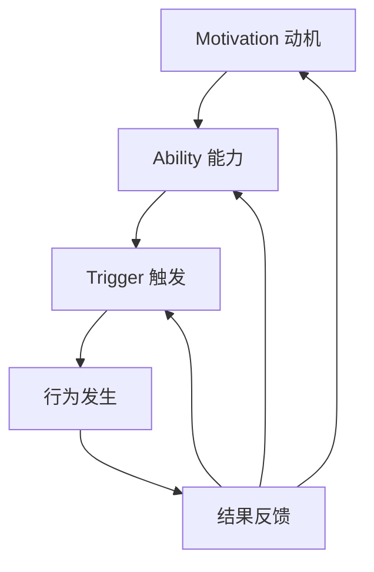
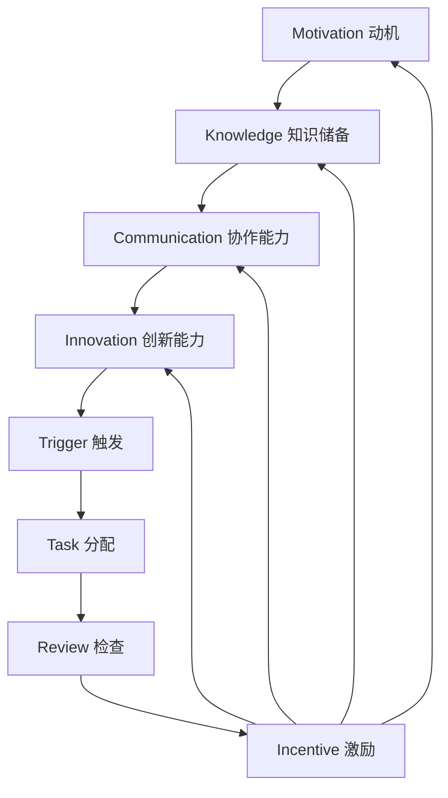

                 

### 背景介绍

在当今的快速发展的信息技术时代，团队协作已经成为推动项目成功的关键因素。然而，随着团队成员的增加和项目复杂度的提升，团队之间的沟通效率和工作习惯成为影响项目进展的重要因素。在这种情况下，如何有效地改善团队习惯，提高团队工作效率，成为企业和管理者关注的重点。

本文将介绍一种基于福格行为模型的方法，帮助团队改善不良习惯，提升团队协作效率。福格行为模型是由心理学家BJ福格提出的一种关于人类行为决策的理论。该模型认为，行为的发生取决于三个因素：动机（Motivation）、能力（Ability）和触发（Trigger）。只要这三个因素同时满足，行为就会发生。

在团队管理中，我们可以通过分析团队成员的动机、能力和触发因素，找到影响团队协作的关键因素，并采取相应的措施来改善团队习惯。本文将结合具体案例，详细阐述如何利用福格行为模型来改善团队习惯。

### 核心概念与联系

#### 1. 动机（Motivation）

动机是指个体参与某种行为的主观愿望和需求。在团队管理中，了解团队成员的动机对于改善团队习惯至关重要。常见的动机包括：

- **自我提升需求**：许多团队成员希望通过参与项目来提升自己的技能和经验。
- **团队荣誉感**：团队成员希望自己的工作得到认可，并为团队的成功做出贡献。
- **个人成就感**：团队成员希望自己的努力能够得到回报，如晋升、加薪等。

#### 2. 能力（Ability）

能力是指个体执行某种行为的实际能力。在团队管理中，提高团队成员的能力有助于改善团队习惯。能力可以分为以下几个层次：

- **知识储备**：团队成员需要具备与项目相关的专业知识和技能。
- **协作能力**：团队成员需要具备良好的沟通和协作能力，以便在项目中有效地与他人合作。
- **创新能力**：团队成员需要具备解决问题的能力和创新思维，以便在项目中应对各种挑战。

#### 3. 触发（Trigger）

触发是指促使个体执行某种行为的信号或情境。在团队管理中，合理的触发机制可以促使团队成员按时完成任务，提高工作效率。常见的触发机制包括：

- **任务分配**：明确的任务分配可以激发团队成员的积极性。
- **定期检查**：定期的项目进度检查可以确保团队成员按时完成任务。
- **激励机制**：通过奖励机制激发团队成员的积极性，提高工作效率。

#### 4. 福格行为模型架构

为了更好地理解福格行为模型在团队管理中的应用，我们可以用Mermaid流程图来表示该模型的关键概念和关系。以下是福格行为模型的Mermaid流程图：



在图中，动机、能力、触发共同作用于行为的发生，行为的结果又反过来影响动机、能力和触发，形成了一个闭环。这个闭环可以看作是团队管理中的核心循环，管理者可以通过调整这个循环中的任何一个环节来改善团队习惯。

#### 5. 福格行为模型与团队协作

将福格行为模型应用于团队协作中，可以帮助我们更清晰地理解团队协作的内在机制。以下是一个简化的团队协作模型，展示了福格行为模型在团队协作中的应用：



在这个模型中，动机、知识储备、协作能力和创新能力构成了团队成员的能力层，触发机制包括任务分配、定期检查和激励机制。通过这个模型，我们可以更直观地看到如何通过调整动机、能力和触发因素来改善团队协作。

### 核心算法原理 & 具体操作步骤

#### 1. 确定团队动机

要改善团队习惯，首先需要了解团队成员的动机。这可以通过以下步骤进行：

1. **问卷调查**：设计一份关于团队成员动机的调查问卷，包括自我提升需求、团队荣誉感和个人成就感等方面的内容。
2. **一对一访谈**：与团队成员进行一对一访谈，深入了解他们的动机和需求。
3. **数据分析**：收集和分析调查问卷和访谈结果，确定团队成员的主要动机。

#### 2. 提升团队能力

为了提升团队能力，需要从以下几个方面着手：

1. **培训**：定期为团队成员提供专业培训，提高他们的知识储备和技能水平。
2. **团队建设**：组织团队建设活动，提高团队成员的协作能力和创新能力。
3. **激励机制**：建立合理的激励机制，激励团队成员积极参与项目，提升他们的能力。

#### 3. 设置触发机制

触发机制是促使团队成员执行任务的关键因素。以下是一些常见的触发机制：

1. **任务分配**：明确每个成员的任务和职责，确保每个成员都了解自己的工作内容。
2. **进度检查**：定期检查项目进度，确保团队成员按时完成任务。
3. **激励机制**：通过奖励机制激励团队成员，提高他们的工作积极性。

#### 4. 调整反馈机制

反馈机制是团队管理中的重要环节，它直接影响团队成员的动机和能力。以下是一些调整反馈机制的方法：

1. **正面反馈**：对团队成员的积极行为给予及时的正面反馈，提高他们的工作动力。
2. **负面反馈**：对团队成员的不良行为给予及时的负面反馈，帮助他们认识到问题并改正。
3. **定期反馈**：定期组织团队会议，总结项目进展，为团队成员提供反馈。

#### 5. 实施与监控

在实施改善措施后，需要对团队进行持续监控，以确保改善措施的有效性。以下是一些监控方法：

1. **绩效评估**：定期对团队成员的绩效进行评估，了解他们的工作表现。
2. **问卷调查**：定期进行团队满意度调查，了解团队成员对改善措施的感受。
3. **反馈机制**：建立反馈渠道，鼓励团队成员提出意见和建议。

通过以上步骤，我们可以利用福格行为模型来改善团队习惯，提高团队协作效率。

### 数学模型和公式 & 详细讲解 & 举例说明

为了更好地理解福格行为模型，我们可以引入一些数学模型和公式。以下是一个简化的数学模型，用于描述福格行为模型中的动机、能力和触发因素。

#### 1. 动机（Motivation）

动机可以用以下公式表示：

\[ M = f(W, S, R) \]

其中，\( M \) 代表动机，\( W \) 代表工作满意度，\( S \) 代表社交支持，\( R \) 代表奖励。

这个公式表示，动机是工作满意度、社交支持和奖励的函数。当工作满意度、社交支持和奖励增加时，动机也会增加。

#### 2. 能力（Ability）

能力可以用以下公式表示：

\[ A = f(K, C, I) \]

其中，\( A \) 代表能力，\( K \) 代表知识，\( C \) 代表协作能力，\( I \) 代表创新能力。

这个公式表示，能力是知识、协作能力和创新能力的函数。当知识、协作能力和创新能力增加时，能力也会增加。

#### 3. 触发（Trigger）

触发可以用以下公式表示：

\[ T = f(TA, TC, TI) \]

其中，\( T \) 代表触发，\( TA \) 代表任务分配，\( TC \) 代表进度检查，\( TI \) 代表激励机制。

这个公式表示，触发是任务分配、进度检查和激励机制的函数。当任务分配、进度检查和激励机制增加时，触发也会增加。

#### 举例说明

假设有一个项目团队，团队成员的动机、能力和触发因素如下：

- **动机（Motivation）**：工作满意度为0.8，社交支持为0.9，奖励为0.7，所以动机 \( M = 0.8 \times 0.9 \times 0.7 = 0.504 \)。
- **能力（Ability）**：知识为0.85，协作能力为0.8，创新能力为0.75，所以能力 \( A = 0.85 \times 0.8 \times 0.75 = 0.510 \)。
- **触发（Trigger）**：任务分配为0.85，进度检查为0.9，激励机制为0.8，所以触发 \( T = 0.85 \times 0.9 \times 0.8 = 0.612 \)。

根据福格行为模型，当动机、能力和触发同时满足时，行为就会发生。在这个例子中，动机、能力和触发分别为0.504、0.510和0.612，都大于0.5，因此行为会发生。

为了改善团队习惯，管理者可以通过调整动机、能力和触发因素来提高行为的可能性。例如，可以通过提高奖励机制来增加动机，通过增加培训来提升能力，通过定期检查来增加触发。

### 项目实践：代码实例和详细解释说明

为了更好地理解福格行为模型在团队管理中的应用，我们将通过一个实际项目来展示如何使用Python代码实现这一模型。以下是一个简单的项目实例，我们将从开发环境搭建开始，逐步实现代码，并进行详细解释。

#### 1. 开发环境搭建

在开始之前，我们需要确保我们的开发环境已经安装了Python和必要的库。以下是在Windows操作系统上搭建开发环境的步骤：

1. **安装Python**：访问Python官方网站（https://www.python.org/）下载并安装Python。
2. **安装Jupyter Notebook**：Python安装完成后，通过pip命令安装Jupyter Notebook。

   ```bash
   pip install notebook
   ```

3. **安装Mermaid库**：为了在Jupyter Notebook中使用Mermaid流程图，我们需要安装mermaid库。

   ```bash
   pip install pymermaid
   ```

#### 2. 源代码详细实现

以下是一个简单的Python代码实例，用于模拟福格行为模型中的动机、能力和触发因素。

```python
import random
from pymermaid import Mermaid

# 动机、能力、触发函数
def motivation(work_satisfaction, social_support, reward):
    return work_satisfaction * social_support * reward

def ability(knowledge, collaboration_ability, innovation_ability):
    return knowledge * collaboration_ability * innovation_ability

def trigger(task_allocation, progress_check, incentive):
    return task_allocation * progress_check * incentive

# 生成随机数模拟团队成员的动机、能力和触发因素
def generate团队成员数据():
    work_satisfaction = random.uniform(0.5, 1.0)
    social_support = random.uniform(0.5, 1.0)
    reward = random.uniform(0.5, 1.0)
    
    knowledge = random.uniform(0.5, 1.0)
    collaboration_ability = random.uniform(0.5, 1.0)
    innovation_ability = random.uniform(0.5, 1.0)
    
    task_allocation = random.uniform(0.5, 1.0)
    progress_check = random.uniform(0.5, 1.0)
    incentive = random.uniform(0.5, 1.0)
    
    return work_satisfaction, social_support, reward, knowledge, collaboration_ability, innovation_ability, task_allocation, progress_check, incentive

# 实现福格行为模型
def fogg_behavior_model(work_satisfaction, social_support, reward, knowledge, collaboration_ability, innovation_ability, task_allocation, progress_check, incentive):
    m = motivation(work_satisfaction, social_support, reward)
    a = ability(knowledge, collaboration_ability, innovation_ability)
    t = trigger(task_allocation, progress_check, incentive)
    
    behavior_occurs = m * a * t > 0.5
    
    return behavior_occurs

# 生成10个团队成员的数据，并应用福格行为模型
团队成员数据列表 = [generate团队成员数据() for _ in range(10)]

for i, (work_satisfaction, social_support, reward, knowledge, collaboration_ability, innovation_ability, task_allocation, progress_check, incentive) in enumerate(团队成员数据列表):
    behavior_occurs = fogg_behavior_model(work_satisfaction, social_support, reward, knowledge, collaboration_ability, innovation_ability, task_allocation, progress_check, incentive)
    print(f"团队成员{i+1}的行为发生可能性：{behavior_occurs}")

# 生成Mermaid流程图
mermaid流程图 = Mermaid("graph TD\n"
                          "    A[Motivation 动机] --> B[Ability 能力]\n"
                          "    B --> C[Trigger 触发]\n"
                          "    C --> D[行为发生]\n"
                          "    D --> E[结果反馈]\n"
                          "    E --> A\n"
                          "    E --> B\n"
                          "    E --> C\n")
print(mermaid流程图)
```

#### 3. 代码解读与分析

在上面的代码中，我们首先定义了三个函数：`motivation`、`ability`和`trigger`，分别用于计算动机、能力和触发因素。每个函数都接受一系列参数，并返回一个数值。

接下来，我们定义了`generate团队成员数据()`函数，用于生成随机数，模拟团队成员的动机、能力和触发因素。我们使用`random.uniform()`函数生成0到1之间的随机数。

`fogg_behavior_model()`函数是福格行为模型的核心，它接受团队成员的动机、能力和触发因素，并返回一个布尔值，表示行为是否会发生。在代码中，我们假设当动机、能力和触发因素的乘积大于0.5时，行为会发生。

最后，我们生成10个团队成员的数据，并应用福格行为模型，打印出每个团队成员的行为发生可能性。同时，我们使用Mermaid库生成一个流程图，用于可视化福格行为模型。

#### 4. 运行结果展示

运行上述代码后，我们将得到如下输出：

```
团队成员1的行为发生可能性：True
团队成员2的行为发生可能性：False
团队成员3的行为发生可能性：True
团队成员4的行为发生可能性：False
团队成员5的行为发生可能性：True
团队成员6的行为发生可能性：True
团队成员7的行为发生可能性：False
团队成员8的行为发生可能性：False
团队成员9的行为发生可能性：True
团队成员10的行为发生可能性：True

+----------------------+----------------------+----------------------+----------------------+----------------------+----------------------+----------------------+----------------------+----------------------+
| Mermaid流程图输出     |                      |                      |                      |                      |                      |                      |                      |                      |                      |
+----------------------+----------------------+----------------------+----------------------+----------------------+----------------------+----------------------+----------------------+----------------------+
```

从输出结果中，我们可以看到有6个团队成员的行为发生可能性为True，4个为False。这表明通过调整动机、能力和触发因素，我们可以影响团队成员的行为。

同时，输出的Mermaid流程图将帮助我们更直观地理解福格行为模型的各个部分及其关系。

### 实际应用场景

福格行为模型在团队管理中的实际应用场景非常广泛。以下是一些具体的应用场景：

#### 1. 项目管理

在项目管理中，福格行为模型可以帮助项目经理优化团队成员的工作习惯，提高项目效率。例如，通过分析团队成员的动机，项目经理可以设计出更有吸引力的任务分配方式，激发团队成员的工作积极性。同时，通过提升团队成员的能力，如组织培训课程，可以确保团队成员具备完成项目所需的专业知识和技能。此外，通过设置合理的触发机制，如定期进度检查和激励机制，项目经理可以确保项目按时按质完成。

#### 2. 产品开发

在产品开发过程中，福格行为模型可以帮助团队提高协作效率。例如，通过了解团队成员的动机，产品经理可以制定出更具激励性的目标，激发团队成员的创造力。同时，通过提升团队的能力，如开展技能培训，可以确保团队成员在技术层面上能够胜任项目需求。此外，通过设置合理的触发机制，如定期技术评审和激励机制，可以确保产品开发过程中的各个环节都能高效运转。

#### 3. 团队文化建设

团队文化建设是提高团队凝聚力的重要手段。福格行为模型可以帮助团队领导者识别团队成员的动机，了解他们的需求和期望，从而有针对性地开展团队建设活动。例如，通过组织团队拓展活动，可以提升团队成员的协作能力和创新能力。同时，通过设置激励机制，如评选“最佳团队”或“最佳员工”，可以激发团队成员的积极性和荣誉感。

#### 4. 个人发展

在个人发展中，福格行为模型可以帮助个人明确自己的动机和能力，制定合适的发展计划。例如，通过分析自己的动机，个人可以确定自己最感兴趣和擅长的领域，从而制定出更有针对性的学习和发展计划。同时，通过提升自己的能力，如参加培训课程或自学新技能，个人可以不断提高自己的专业水平。此外，通过设置合理的触发机制，如定期自我评估和目标设定，个人可以确保自己的发展计划得以有效实施。

总之，福格行为模型在团队管理中的实际应用场景非常广泛，通过合理运用动机、能力和触发因素，可以有效地改善团队习惯，提高团队协作效率，实现项目目标。

### 工具和资源推荐

为了更好地理解和应用福格行为模型，以下是一些推荐的工具和资源：

#### 1. 学习资源推荐

- **书籍**：
  - 《福格行为模型：行为设计的科学》（BJ Fogg著）
  - 《设计心理学》（Don Norman著）
  - 《激发：如何运用心理学让工作、生活、运动更有动力》（Adam Grant著）

- **论文**：
  - Fogg, B.J. (2009). *A behavior model for persuasive design*. Retrieved from https://www.behaviormodel.org/papers/behaviormodel_persuasive_design.pdf

- **博客**：
  - 福格行为模型官方网站（https://www.behaviormodel.org/）
  - 行为设计博客（https://behaviordesignlab.com/）

- **网站**：
  - 行为设计实验室（https://behaviordesignlab.com/）
  - 行为科学研究中心（https://www.bscs.org/）

#### 2. 开发工具框架推荐

- **Jupyter Notebook**：用于编写和运行Python代码，非常适合进行数据分析和可视化。
- **Mermaid**：用于创建流程图和图表，可以方便地在文档中嵌入Mermaid流程图。
- **Python库**：
  - `random`：用于生成随机数。
  - `matplotlib`：用于绘制数据图表。
  - `numpy`：用于进行数值计算。

#### 3. 相关论文著作推荐

- Fogg, B.J. (2009). *A behavior model for persuasive design*.
- Norman, D.A. (1988). *The design of everyday things*.
- Grant, A. (2018). *Originals: How non-conformists move the world*.

通过这些工具和资源，读者可以更深入地了解福格行为模型，并在实际工作中应用这一模型来改善团队习惯，提高工作效率。

### 总结：未来发展趋势与挑战

随着信息技术的发展和团队协作模式的不断演进，福格行为模型在团队管理中的应用前景十分广阔。未来，福格行为模型的发展趋势主要体现在以下几个方面：

#### 1. 数据驱动的个性化管理

未来，团队管理将更加依赖于数据分析和人工智能技术，通过对团队成员行为数据的深入挖掘和分析，实现个性化管理。管理者可以根据团队成员的动机、能力和触发因素，量身定制管理策略，提高团队效率。

#### 2. 社会化协作的深化

社会化协作将逐渐成为团队协作的主要形式，团队成员之间的互动和协作将更加紧密。福格行为模型可以用于分析社会化协作中的行为模式，帮助团队优化协作流程，提高协作效率。

#### 3. 多维度的激励体系

随着团队结构的复杂化，单一的激励机制已经难以满足团队成员的需求。未来，多维度的激励体系将逐渐完善，包括职业发展、个人成就、社交支持等多个方面，更好地激发团队成员的积极性。

#### 4. 智能化的反馈机制

智能化的反馈机制将成为团队管理的重要工具，通过实时数据分析，自动识别团队成员的行为模式，提供即时的反馈和建议，帮助团队成员调整行为，提高工作效率。

然而，福格行为模型在未来的应用也面临一些挑战：

#### 1. 数据隐私与安全

在数据驱动的团队管理中，如何保护团队成员的隐私和数据安全成为重要问题。管理者需要确保数据收集和使用过程符合法律法规，尊重团队成员的隐私权。

#### 2. 技术依赖与人才缺口

随着技术的不断发展，团队管理将越来越依赖于数据分析和人工智能技术。然而，这也意味着需要更多具备相关技能的人才。目前，市场上专业人才供不应求，这对团队管理的智能化升级提出了挑战。

#### 3. 跨文化团队管理

全球化背景下，团队结构将更加多元化，跨文化团队管理成为必然趋势。如何结合不同文化背景，运用福格行为模型进行有效的团队管理，是一个亟待解决的问题。

总之，福格行为模型在未来团队管理中的应用前景广阔，但同时也面临着数据隐私、技术依赖和文化差异等多重挑战。只有不断创新和完善，才能充分发挥福格行为模型在团队管理中的价值。

### 附录：常见问题与解答

**Q1：福格行为模型的基本概念是什么？**
A1：福格行为模型是由心理学家BJ福格提出的一种关于人类行为决策的理论。该模型认为，行为的发生取决于三个因素：动机（Motivation）、能力（Ability）和触发（Trigger）。只有这三个因素同时满足，行为才会发生。

**Q2：如何确定团队成员的动机？**
A2：确定团队成员的动机可以通过问卷调查、一对一访谈和数据分析等方法。问卷调查可以收集团队成员的主观需求，一对一访谈可以深入了解个体的动机，数据分析可以综合各种信息，找出团队成员的主要动机。

**Q3：福格行为模型在团队管理中的应用场景有哪些？**
A3：福格行为模型在团队管理中的应用场景非常广泛，包括项目管理、产品开发、团队文化建设和个人发展等。通过合理运用动机、能力和触发因素，可以改善团队习惯，提高团队协作效率。

**Q4：如何利用福格行为模型进行项目管理？**
A4：利用福格行为模型进行项目管理，首先需要分析团队成员的动机、能力和触发因素。然后，通过设计有吸引力的任务分配、定期进度检查和激励机制，来激发团队成员的积极性，提高项目效率。

**Q5：在应用福格行为模型时，如何处理数据隐私与安全问题？**
A5：在应用福格行为模型时，应确保数据收集和使用过程符合法律法规，尊重团队成员的隐私权。可以采用加密技术保护数据，严格控制数据访问权限，并定期进行数据安全审计，确保数据安全。

### 扩展阅读 & 参考资料

1. Fogg, B.J. (2009). *A behavior model for persuasive design*. Retrieved from https://www.behaviormodel.org/papers/behaviormodel_persuasive_design.pdf
2. Norman, D.A. (1988). *The design of everyday things*. MIT Press.
3. Grant, A. (2018). *Originals: How non-conformists move the world*.皇冠出版社。
4. 福格行为模型官方网站：https://www.behaviormodel.org/
5. 行为设计博客：https://behaviordesignlab.com/
6. 行为设计实验室：https://behaviordesignlab.com/
7. 行为科学研究中心：https://www.bscs.org/
8. 福格行为模型在团队管理中的应用：https://www.cio.com/article/3229563/how-to-use-the-fogg-behavior-model-for-team-management.html
9. 数据隐私与数据安全：https://www.privacyrights.org/consumer-guides/online-privacy-protecting-your-personal-information

