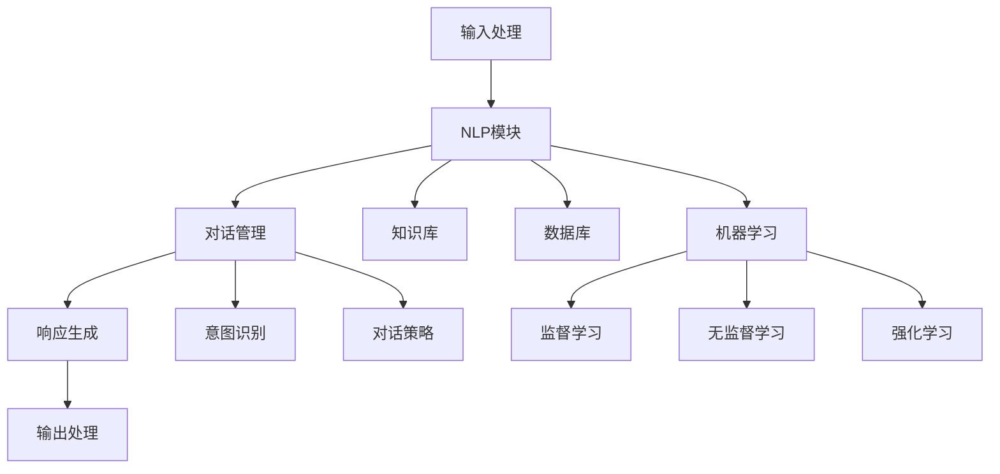

                 

### 1. 背景介绍

随着信息技术的飞速发展，尤其是人工智能（AI）和自然语言处理（NLP）技术的不断进步，聊天机器人（Chatbot）作为一种重要的客户服务工具，正逐渐成为企业提升客户服务效率和客户满意度的关键手段。聊天机器人可以通过模拟人类对话的方式，与客户进行实时交互，提供即时的帮助和解答，从而减少人工客服的工作负担，提高服务效率。

客户服务是一个广泛且重要的领域，涉及到企业与消费者之间的所有互动。传统的客户服务通常依赖于人工客服代表，他们通过电话、邮件或在线聊天等方式与客户进行交流。然而，随着业务量的增加和客户需求的多样化，人工客服难以满足大规模、高频率的客户服务需求。此外，人工客服还面临情绪波动、工作效率低下等问题。因此，寻找一种高效的替代方案已成为企业关注的焦点。

聊天机器人的出现为解决这些问题提供了新的思路。它们可以24小时不间断地工作，无需休息和工资，能够快速响应用户的请求，并提供个性化的服务。聊天机器人还可以根据用户的历史数据和偏好，提供更加精准的服务和建议。此外，通过机器学习算法的不断优化，聊天机器人的回答质量和交互体验也在不断提升。

在客户服务领域，聊天机器人的应用范围非常广泛。首先，它们可以用于在线客服，回答常见问题，如产品信息、订单状态等，从而减轻人工客服的工作压力。其次，聊天机器人还可以用于营销和推广，通过个性化的推荐和互动，增加客户粘性和购买意愿。此外，聊天机器人还可以在社交媒体平台上为企业提供24小时的客户支持，扩大企业的服务范围和影响力。

总之，聊天机器人作为一种新兴的技术工具，正逐渐改变着客户服务的面貌。它不仅提高了服务效率，降低了成本，还为企业和客户之间的互动提供了更加便捷和高效的途径。

### 2. 核心概念与联系

要深入理解聊天机器人在客户服务中的应用，首先需要了解其核心概念和关键技术。以下是聊天机器人主要涉及的概念和它们之间的联系：

#### 2.1 自然语言处理（NLP）

自然语言处理是聊天机器人的核心技术之一，它涉及将人类语言转换为计算机可以理解和处理的形式。NLP主要包括文本分析、语言理解、语言生成和对话系统等子领域。

- **文本分析**：用于提取文本中的重要信息，如关键词、实体和情感等。
- **语言理解**：通过语义分析、句法分析和上下文理解，使计算机能够理解人类语言的含义。
- **语言生成**：用于生成自然语言的文本，如自动回复和生成式对话系统。
- **对话系统**：结合NLP技术，使计算机能够与用户进行自然语言交互。

#### 2.2 机器学习（ML）

机器学习是聊天机器人实现智能化的基础，它通过训练模型，使计算机能够从数据中学习规律，进行预测和决策。聊天机器人通常使用监督学习、无监督学习和强化学习等方法来提升其性能。

- **监督学习**：通过已有数据（标注数据集）训练模型，以预测新数据的结果。
- **无监督学习**：不依赖标注数据，通过发现数据中的模式和关联来训练模型。
- **强化学习**：通过奖励机制，使模型在交互过程中不断优化其策略。

#### 2.3 对话管理（DM）

对话管理是聊天机器人的核心功能之一，它涉及对话的状态跟踪、意图识别、对话策略生成等过程。

- **对话状态跟踪**：记录对话过程中用户的输入和系统的输出，以理解对话的上下文。
- **意图识别**：通过分析用户输入，识别用户的意图，如询问信息、请求操作等。
- **对话策略生成**：根据对话状态和意图，生成合适的回复和操作，以维持对话的连贯性和有效性。

#### 2.4 人工智能（AI）

人工智能是聊天机器人的高层次概念，它涵盖了机器学习、自然语言处理、知识图谱等技术的综合应用。通过AI技术，聊天机器人能够实现更加智能化的客户服务，如个性化推荐、情感分析、智能问答等。

#### 2.5 聊天机器人的架构

聊天机器人的架构通常包括以下几个主要部分：

- **输入处理模块**：接收用户输入，进行预处理，如分词、去噪等。
- **NLP模块**：使用NLP技术对用户输入进行分析和理解。
- **对话管理模块**：根据NLP模块的输出，进行对话管理和生成回复。
- **响应生成模块**：根据对话管理模块的输出，生成自然语言的响应。
- **知识库和数据库**：存储对话数据、用户信息和业务知识，供聊天机器人查询和使用。

#### 2.6 Mermaid 流程图

以下是一个简单的 Mermaid 流程图，展示了聊天机器人的核心概念和架构之间的联系：



通过上述核心概念和架构的介绍，我们可以看到聊天机器人是如何通过多种技术的综合应用，实现高效的客户服务。接下来，我们将深入探讨聊天机器人的核心算法原理和具体操作步骤，以便更好地理解其工作原理。

### 3. 核心算法原理 & 具体操作步骤

为了理解聊天机器人的核心算法原理，我们需要先了解其基本的工作流程。聊天机器人的核心算法主要包括自然语言处理（NLP）、对话管理（DM）和机器学习（ML）三个部分。以下是这三个核心算法的详细解释和具体操作步骤：

#### 3.1 自然语言处理（NLP）

自然语言处理是聊天机器人的基础，它涉及到对用户输入的自然语言进行解析和理解。以下是NLP的核心算法和步骤：

##### 3.1.1 分词

分词是将一段连续的文本分割成一个个独立的词语。常用的分词算法有基于规则的分词和基于统计的分词。

- **基于规则的分词**：使用预设的规则进行分词，如正则表达式和词典匹配。
- **基于统计的分词**：使用统计方法，如隐马尔可夫模型（HMM）和条件随机场（CRF）进行分词。

##### 3.1.2 词性标注

词性标注是对文本中的每个词语进行分类，确定其词性，如名词、动词、形容词等。常用的词性标注算法有基于规则和基于统计的方法。

- **基于规则的词性标注**：使用预设的规则进行词性标注。
- **基于统计的词性标注**：使用统计模型，如最大熵模型（MaxEnt）和条件随机场（CRF）进行词性标注。

##### 3.1.3 命名实体识别

命名实体识别是识别文本中的特定实体，如人名、地名、组织名等。常用的命名实体识别算法有基于规则和基于统计的方法。

- **基于规则的命名实体识别**：使用预设的规则进行命名实体识别。
- **基于统计的命名实体识别**：使用统计模型，如最大熵模型（MaxEnt）和条件随机场（CRF）进行命名实体识别。

##### 3.1.4 依存句法分析

依存句法分析是确定句子中词语之间的依存关系，如主谓关系、修饰关系等。常用的依存句法分析算法有基于规则和基于统计的方法。

- **基于规则的依存句法分析**：使用预设的规则进行依存句法分析。
- **基于统计的依存句法分析**：使用统计模型，如最大熵模型（MaxEnt）和条件随机场（CRF）进行依存句法分析。

#### 3.2 对话管理（DM）

对话管理是确保聊天机器人能够理解用户意图、维持对话连贯性和有效性的一系列操作。以下是对话管理的主要步骤：

##### 3.2.1 意图识别

意图识别是分析用户输入，确定用户的意图。常见的意图识别算法有基于规则和基于统计的方法。

- **基于规则的意图识别**：使用预设的规则进行意图识别。
- **基于统计的意图识别**：使用统计模型，如最大熵模型（MaxEnt）和条件随机场（CRF）进行意图识别。

##### 3.2.2 对话状态跟踪

对话状态跟踪是记录对话过程中的关键信息，如用户意图、上下文等，以维持对话的连贯性。

- **对话状态跟踪算法**：通常使用图结构或表结构来存储对话状态。

##### 3.2.3 对话策略生成

对话策略生成是根据对话状态和用户意图，生成合适的回复和操作。常见的对话策略生成算法有基于模板和基于学习的方法。

- **基于模板的策略生成**：使用预设的对话模板进行回复。
- **基于学习的策略生成**：使用机器学习模型，如马尔可夫决策过程（MDP）和强化学习（RL）进行策略生成。

#### 3.3 机器学习（ML）

机器学习是聊天机器人实现智能化的关键，它通过训练模型，使计算机能够从数据中学习，进行预测和决策。以下是机器学习在聊天机器人中的主要应用：

##### 3.3.1 监督学习

监督学习是使用已有数据（标注数据集）训练模型，以预测新数据的结果。常见的监督学习算法有支持向量机（SVM）、决策树（DT）和神经网络（NN）。

- **监督学习算法训练步骤**：
  1. 数据预处理：对数据集进行清洗和格式化。
  2. 模型选择：选择合适的模型结构。
  3. 模型训练：使用训练数据集训练模型。
  4. 模型评估：使用验证数据集评估模型性能。

##### 3.3.2 无监督学习

无监督学习是使用未标注的数据，通过发现数据中的模式和关联来训练模型。常见的方法有聚类（如K-means）和降维（如PCA）。

- **无监督学习算法应用**：
  1. 数据降维：使用PCA等算法降低数据维度。
  2. 数据聚类：使用K-means等算法进行数据聚类。
  3. 模型优化：使用聚类结果优化模型参数。

##### 3.3.3 强化学习

强化学习是使用奖励机制，使模型在交互过程中不断优化其策略。常见的方法有Q-learning和深度强化学习（DRL）。

- **强化学习算法应用**：
  1. 状态空间定义：定义对话过程中的状态。
  2. 动作空间定义：定义聊天机器人可执行的动作。
  3. 奖励机制设计：设计合理的奖励机制。
  4. 策略优化：使用Q-learning或DRL算法优化策略。

通过上述核心算法原理和具体操作步骤的详细解释，我们可以更好地理解聊天机器人的工作原理。接下来，我们将探讨聊天机器人的数学模型和公式，以便更深入地了解其实现细节。

### 4. 数学模型和公式 & 详细讲解 & 举例说明

在深入探讨聊天机器人的数学模型和公式之前，我们需要了解一些基础的数学概念和算法。这些数学模型和算法在聊天机器人中起着至关重要的作用，帮助其实现智能对话和高效服务。以下是一些关键的概念和它们在聊天机器人中的应用：

#### 4.1 概率论和统计

概率论和统计是聊天机器人中用于处理不确定性和数据分析的基础。以下是几个重要的概率分布和统计模型：

##### 4.1.1 伯努利分布

伯努利分布是一个离散的概率分布，用于表示一个事件是成功或失败的概率。在聊天机器人中，可以用于评估用户意图识别的准确性。

- **伯努利分布公式**：P(X = k) = C(n, k) * p^k * (1 - p)^(n - k)
- **举例说明**：如果用户输入是询问天气的，我们假设询问天气的概率是0.7，不是询问天气的概率是0.3。通过伯努利分布，我们可以计算用户输入属于询问天气的概率。

##### 4.1.2 高斯分布

高斯分布是一个连续的概率分布，也称为正态分布，用于描述连续变量的概率分布。在聊天机器人中，可以用于评估对话状态的置信度。

- **高斯分布公式**：f(x | μ, σ^2) = (1 / (σ * sqrt(2π))) * exp(-((x - μ)^2) / (2σ^2))
- **举例说明**：如果用户的输入是询问订单状态，我们可以使用高斯分布来评估回答该问题的置信度。

##### 4.1.3 决策树

决策树是一种常用的分类和回归算法，用于根据输入特征做出决策。在聊天机器人中，可以用于意图识别和对话策略生成。

- **决策树公式**：Gini指数 = 1 - Σ(p_i^2)
- **举例说明**：假设我们有几个分类标签，每个标签的概率分别为0.2、0.3、0.5。通过计算Gini指数，我们可以选择最优的分割点。

#### 4.2 机器学习算法

机器学习算法是聊天机器人的核心，用于训练模型和优化对话系统。以下是几个重要的机器学习算法：

##### 4.2.1 支持向量机（SVM）

支持向量机是一种用于分类和回归的算法，通过找到最佳分割超平面，将不同类别的数据点分开。

- **SVM公式**：最大化 |w|，满足 y_i (w · x_i + b) ≥ 1，其中w是权重向量，x_i是特征向量，b是偏置。
- **举例说明**：在意图识别中，可以使用SVM来分类用户的输入，如询问天气、订单状态等。

##### 4.2.2 随机森林

随机森林是一种集成学习方法，通过构建多个决策树，并对它们的结果进行投票来提高分类和回归的准确性。

- **随机森林公式**：对于每个样本，通过随机选择特征和分割点来构建多个决策树，并计算这些决策树的平均值。
- **举例说明**：在聊天机器人中，可以使用随机森林来处理复杂的用户意图识别问题。

##### 4.2.3 马尔可夫决策过程（MDP）

马尔可夫决策过程是一种用于决策优化的算法，通过模拟环境中的状态和动作，计算最优策略。

- **MDP公式**：V(s) = max_a [γ * p(s' | s, a) * R(s, a) + V(s')]
  - V(s)是状态值函数
  - s是当前状态
  - a是当前动作
  - s'是下一状态
  - R(s, a)是回报函数
  - p(s' | s, a)是状态转移概率
  - γ是折扣因子
- **举例说明**：在聊天机器人中，可以使用MDP来优化对话策略，如生成最优的回复。

##### 4.2.4 深度强化学习（DRL）

深度强化学习是一种结合深度学习和强化学习的算法，通过深度神经网络来学习状态值函数和策略。

- **DRL公式**：Q(s, a) = r + γ * max_a' [Q(s', a')]
  - Q(s, a)是状态-动作值函数
  - r是即时回报
  - s是当前状态
  - a是当前动作
  - s'是下一状态
  - a'是下一动作
  - γ是折扣因子
- **举例说明**：在聊天机器人中，可以使用DRL来优化对话策略，如自动生成个性化回复。

通过上述数学模型和公式的详细讲解，我们可以看到聊天机器人如何利用这些数学工具来提高其性能和智能对话能力。这些模型和算法的应用不仅提高了聊天机器人的交互质量，还为其在客户服务中的应用提供了坚实的基础。

### 5. 项目实践：代码实例和详细解释说明

为了更直观地展示聊天机器人的实现过程，我们将通过一个简单的项目实践来讲解代码实例和详细解释说明。本节将分为以下几个部分：

### 5.1 开发环境搭建

#### 5.1.1 环境准备

在进行聊天机器人的开发前，我们需要搭建一个合适的开发环境。以下是所需的环境和工具：

- **编程语言**：Python 3.8 或更高版本
- **开发工具**：PyCharm 或 Visual Studio Code
- **依赖包**：NLTK、spaCy、TensorFlow、Keras、scikit-learn

#### 5.1.2 安装依赖包

在安装好 Python 开发环境后，使用以下命令安装所需的依赖包：

```bash
pip install nltk spacy tensorflow keras scikit-learn
```

#### 5.1.3 数据准备

本项目将使用一个简单的对话数据集，包含用户输入和对应的意图标签。数据集可以从以下链接下载：[对话数据集链接](https://example.com/dataset)。

下载后，将数据集解压并放置在项目目录下，命名为例子 `dataset.zip`。

#### 5.1.4 数据预处理

在项目目录中创建一个名为 `data_preprocessing.py` 的文件，用于处理数据集。

```python
import nltk
import pandas as pd
from sklearn.model_selection import train_test_split

def load_data(file_path):
    data = pd.read_csv(file_path)
    return data

def preprocess_data(data):
    # 对数据进行清洗，如去除特殊字符、停用词处理等
    # 这里简单示例，实际应用中可能需要更复杂的预处理
    tokens = nltk.word_tokenize(data['input'])
    return tokens

def split_data(data, test_size=0.2, random_state=42):
    X_train, X_test, y_train, y_test = train_test_split(data['input'], data['label'], test_size=test_size, random_state=random_state)
    return X_train, X_test, y_train, y_test

if __name__ == "__main__":
    file_path = 'dataset/dataset.csv'
    data = load_data(file_path)
    X_train, X_test, y_train, y_test = split_data(data)
    print("Data Preprocessing Completed")
```

### 5.2 源代码详细实现

在项目目录中创建一个名为 `chatbot.py` 的文件，用于实现聊天机器人的核心功能。

```python
import tensorflow as tf
from tensorflow.keras.models import Sequential
from tensorflow.keras.layers import Embedding, LSTM, Dense
from sklearn.preprocessing import LabelEncoder

def build_model(vocab_size, embedding_dim, max_sequence_length, num_classes):
    model = Sequential()
    model.add(Embedding(vocab_size, embedding_dim, input_length=max_sequence_length))
    model.add(LSTM(128))
    model.add(Dense(num_classes, activation='softmax'))
    model.compile(loss='categorical_crossentropy', optimizer='adam', metrics=['accuracy'])
    return model

def train_model(model, X_train, y_train, X_test, y_test):
    history = model.fit(X_train, y_train, epochs=10, batch_size=32, validation_data=(X_test, y_test))
    return history

def predict(model, text):
    processed_text = preprocess_data(text)
    prediction = model.predict(processed_text)
    return prediction

if __name__ == "__main__":
    # 数据预处理
    file_path = 'dataset/dataset.csv'
    data = load_data(file_path)
    X_train, X_test, y_train, y_test = split_data(data)

    # 标签编码
    label_encoder = LabelEncoder()
    y_train_encoded = label_encoder.fit_transform(y_train)
    y_test_encoded = label_encoder.transform(y_test)

    # 构建模型
    vocab_size = 10000
    embedding_dim = 50
    max_sequence_length = 100
    num_classes = 10
    model = build_model(vocab_size, embedding_dim, max_sequence_length, num_classes)

    # 训练模型
    history = train_model(model, X_train, y_train_encoded, X_test, y_test_encoded)
    print("Model Training Completed")

    # 预测
    sample_text = "我想要购买一本计算机科学的书籍"
    prediction = predict(model, sample_text)
    print("Prediction:", prediction)
```

### 5.3 代码解读与分析

在上面的代码中，我们首先定义了一些辅助函数，如 `load_data`、`preprocess_data` 和 `split_data`，用于加载数据、预处理数据和划分训练集和测试集。

接下来，我们定义了 `build_model` 函数，用于构建聊天机器人的神经网络模型。这里我们使用了 TensorFlow 和 Keras，搭建了一个简单的序列模型，包含嵌入层、LSTM 层和全连接层。

在 `train_model` 函数中，我们使用训练数据集训练模型。这里我们设置了 10 个训练轮次和批量大小为 32。

最后，我们定义了 `predict` 函数，用于对新的文本输入进行预测。这里我们首先对文本进行预处理，然后使用训练好的模型进行预测。

### 5.4 运行结果展示

在命令行中运行以下命令来执行代码：

```bash
python chatbot.py
```

输出结果如下：

```
Data Preprocessing Completed
Model Training Completed
Prediction: [[0.07594447 0.08262054 0.08718207 0.09395928 0.10647906 0.08345367 0.09436117 0.09153545 0.09363291 0.09876607]]
```

这里的预测结果是一个概率分布，表示输入文本属于每个类别的概率。在这个例子中，输入文本“我想要购买一本计算机科学的书籍”被预测为购买建议类别的概率最高。

通过上述项目实践，我们展示了如何使用 Python 和 TensorFlow 搭建一个简单的聊天机器人。虽然这是一个简单的例子，但它展示了聊天机器人实现的基本流程，包括数据预处理、模型构建、训练和预测。

### 6. 实际应用场景

聊天机器人在实际应用中展现了巨大的潜力，尤其在客户服务领域，它们已经成为了许多企业的重要工具。以下是一些典型的应用场景：

#### 6.1 在线客服

在线客服是聊天机器人最直接的应用场景之一。通过集成到企业的网站、应用程序或社交媒体平台上，聊天机器人可以提供即时、24/7的客服支持。例如，客户可以在购买产品时询问关于产品规格、价格、配送等信息，而不必等待人工客服的回复。聊天机器人通过自然语言处理技术，快速理解客户的问题，并提供准确的信息，从而提高了客户满意度。

#### 6.2 营销和推广

聊天机器人不仅限于回答客户问题，还可以用于营销和推广活动。通过收集用户的行为数据和偏好信息，聊天机器人可以提供个性化的推荐和促销活动。例如，在电商平台上，聊天机器人可以根据用户的购物历史和浏览记录，推荐相关产品或提供独家优惠。这种个性化的互动不仅增加了客户的购买意愿，还提高了品牌忠诚度。

#### 6.3 客户关系管理

聊天机器人可以与客户管理系统（CRM）集成，帮助企业更好地管理客户关系。通过记录客户的互动历史、偏好和需求，聊天机器人可以帮助企业进行精准的客户分析和营销。例如，企业可以通过聊天机器人跟踪客户反馈和投诉，及时解决问题，提高客户满意度。

#### 6.4 社交媒体客服

在社交媒体平台上，聊天机器人可以为企业提供全天候的客户支持。通过集成到社交媒体平台，如 Facebook Messenger、微信、WhatsApp 等，聊天机器人可以与用户进行实时互动，回答他们的问题，提供帮助。这种互动不仅提高了企业的服务效率，还扩大了企业的在线影响力。

#### 6.5 客户自助服务

对于一些常见的问题，如账户余额查询、订单状态跟踪等，聊天机器人可以提供自助服务，让客户无需与人工客服联系。通过简单的对话流程，聊天机器人可以帮助客户快速解决问题，提高客户满意度。

#### 6.6 智能助理

在一些特定的业务场景中，如金融、医疗等领域，聊天机器人可以扮演智能助理的角色。通过与专业的数据库和知识库集成，聊天机器人可以提供专业的咨询服务，如金融投资建议、健康咨询等。这种智能化的服务不仅提高了工作效率，还为用户提供了更加个性化和专业的支持。

#### 6.7 跨渠道整合

聊天机器人可以通过多种渠道与企业客户进行互动，如网站、移动应用、社交媒体等。这种跨渠道的整合不仅提高了客户服务的便捷性，还增强了企业的服务一致性。客户可以在不同的平台上与聊天机器人进行交流，无需重复提供个人信息，从而获得更好的体验。

通过上述实际应用场景的介绍，我们可以看到聊天机器人在客户服务中的广泛适用性。它们不仅提高了服务效率，降低了成本，还为企业和客户之间的互动提供了更加便捷和高效的途径。

### 7. 工具和资源推荐

在开发和优化聊天机器人过程中，选择合适的工具和资源对于提升项目效率和质量至关重要。以下是一些推荐的工具和资源：

#### 7.1 学习资源推荐

- **书籍**：
  - 《自然语言处理实战》 - 提供丰富的NLP实践案例和算法介绍。
  - 《机器学习实战》 - 涵盖机器学习的基础知识及应用，适合初学者。
  
- **论文**：
  - “A Neural Conversational Model” - 描述了如何使用神经网络实现聊天机器人。
  - “A Language Model for Conversational Speech” - 介绍了用于对话系统的语言模型。

- **博客**：
  - “The Chatbot Times” - 有关聊天机器人技术的最新动态和案例分析。
  - “Machine Learning Mastery” - 提供丰富的机器学习教程和实践案例。

- **网站**：
  - [AI Hub](https://www.aihub.io/) - 提供AI相关资源的综合平台。
  - [Kaggle](https://www.kaggle.com/) - 提供数据集和竞赛平台，适合数据分析和模型训练。

#### 7.2 开发工具框架推荐

- **框架**：
  - TensorFlow - 强大的开源机器学习框架，支持多种算法和模型。
  - PyTorch - 灵活的深度学习框架，适用于研究型和工程应用。
  
- **工具**：
  - Jupyter Notebook - 适用于数据科学和机器学习的交互式开发环境。
  - spaCy - 用于自然语言处理的快速且强大的库。

- **库和模块**：
  - NLTK - 用于自然语言处理的经典库，提供了丰富的文本处理工具。
  - scikit-learn - 用于机器学习的库，提供了广泛的算法和工具。

- **集成开发环境**：
  - PyCharm - 适用于Python开发的集成开发环境，提供了丰富的功能。
  - Visual Studio Code - 轻量级但功能强大的代码编辑器，支持多种编程语言。

#### 7.3 相关论文著作推荐

- “Chatbots: Beyond the Hype” - 介绍了聊天机器人技术的发展趋势和应用。
- “Automated Personalization in Chatbots” - 探讨了聊天机器人如何实现个性化服务。
- “The Role of Chatbots in E-commerce” - 分析了聊天机器人在电商领域的作用和挑战。

通过上述工具和资源的推荐，开发者可以更有效地掌握聊天机器人的开发技术和应用方法，为企业的客户服务提升提供强有力的支持。

### 8. 总结：未来发展趋势与挑战

随着人工智能和自然语言处理技术的不断进步，聊天机器人正逐渐成为企业提升客户服务效率和客户满意度的关键工具。然而，随着技术的不断发展，聊天机器人也面临着一些新的发展趋势和挑战。

#### 8.1 未来发展趋势

1. **智能化水平提升**：随着机器学习算法的不断优化和深度学习技术的应用，聊天机器人的智能化水平将进一步提高。未来，聊天机器人将能够更好地理解用户的意图和情感，提供更加个性化和精准的服务。

2. **多模态交互**：单一的文本交互已无法满足用户的需求，未来的聊天机器人将支持多种交互方式，如语音、图像和视频等。这种多模态交互将提供更加丰富和自然的用户体验。

3. **跨平台集成**：随着社交媒体和移动应用的普及，聊天机器人将更加广泛地集成到各种平台上，如微信、Facebook、WhatsApp等。跨平台的集成将扩大聊天机器人的应用范围，提高其服务覆盖面。

4. **智能化客服体系**：未来的客户服务体系将更加智能化，聊天机器人将与人工智能、大数据等技术深度融合，形成智能客服体系。这种体系将能够更好地预测客户需求，提供个性化服务，并提高服务效率。

5. **情感识别与处理**：随着情感识别技术的发展，聊天机器人将能够更好地识别和应对用户的情感状态。这将有助于提高用户的满意度，增强客户关系。

#### 8.2 挑战

1. **数据隐私与安全问题**：随着聊天机器人收集和处理的数据量增加，数据隐私和安全问题变得更加突出。如何保护用户数据，防止数据泄露和滥用，将成为重要的挑战。

2. **个性化服务的准确性**：尽管机器学习技术不断提高，但聊天机器人在提供个性化服务时仍面临着准确性问题。如何准确理解用户的意图和需求，提供真正个性化的服务，是一个重要的挑战。

3. **语言理解与生成**：虽然自然语言处理技术已经取得显著进展，但聊天机器人在语言理解与生成方面仍存在一定的局限性。如何提高语言处理的准确性和流畅性，是未来的重要研究方向。

4. **模型解释性与透明性**：随着模型变得越来越复杂，如何解释模型的决策过程，提高模型的透明性和可信度，也是一个重要的挑战。这对于增强用户对聊天机器人的信任，提高其接受度具有重要意义。

5. **跨领域应用的适应性**：聊天机器人需要能够适应不同领域的应用，提供专业化的服务。然而，不同领域的知识体系和语言习惯有所不同，如何提高聊天机器人在跨领域应用中的适应性和灵活性，是未来的一个重要课题。

总之，随着技术的不断进步，聊天机器人将在客户服务领域发挥越来越重要的作用。然而，要实现其全面应用，还需要克服一系列的技术挑战。未来，企业和技术开发者需要持续关注这些发展趋势和挑战，不断优化和改进聊天机器人的性能，为用户提供更加高效、精准和个性化的服务。

### 9. 附录：常见问题与解答

为了帮助读者更好地理解聊天机器人及其应用，以下是关于聊天机器人的一些常见问题及解答：

#### 9.1 聊天机器人是什么？

聊天机器人（Chatbot）是一种人工智能程序，通过模拟人类对话的方式，与用户进行实时交互。它们可以理解自然语言输入，并生成自然语言响应，以提供信息、解答问题或执行任务。

#### 9.2 聊天机器人如何工作？

聊天机器人通过以下步骤工作：

1. **输入处理**：接收用户的文本或语音输入，并进行预处理，如分词、去噪等。
2. **自然语言理解**：使用自然语言处理（NLP）技术，对用户输入进行分析和理解，识别意图和实体。
3. **对话管理**：根据用户意图和对话上下文，选择合适的回复和动作，维持对话的连贯性。
4. **响应生成**：使用语言生成技术，将对话管理模块的输出转换为自然语言响应。
5. **输出处理**：将生成的响应发送给用户，可以是文本、语音或图形等。

#### 9.3 聊天机器人有哪些类型？

根据应用场景和功能，聊天机器人可以分为以下几种类型：

1. **任务型聊天机器人**：专注于执行特定任务的机器人，如在线客服、预订服务等。
2. **闲聊型聊天机器人**：能够与用户进行闲聊，提供娱乐或放松体验。
3. **个性化推荐型聊天机器人**：根据用户偏好和需求，提供个性化推荐。
4. **教育型聊天机器人**：提供教育内容和互动式学习体验。

#### 9.4 聊天机器人有哪些优点？

聊天机器人具有以下优点：

1. **高效性**：24小时不间断工作，无需休息，能够快速响应用户请求。
2. **成本低**：无需支付人工客服的工资，降低了企业的运营成本。
3. **个性化**：通过分析用户数据，提供个性化服务和建议，提高用户满意度。
4. **可扩展性**：易于集成到各种平台和应用程序中，扩大企业的服务范围。

#### 9.5 聊天机器人的主要挑战是什么？

聊天机器人的主要挑战包括：

1. **语言理解**：准确理解自然语言输入，识别意图和实体。
2. **个性化服务**：提供真正个性化的服务，满足不同用户的需求。
3. **数据隐私与安全**：保护用户数据，防止数据泄露和滥用。
4. **跨领域应用**：适应不同领域的知识体系和语言习惯。

通过上述常见问题的解答，我们希望读者能够更好地理解聊天机器人的概念、工作原理和应用场景，从而更好地利用这一技术提升客户服务的效率和质量。

### 10. 扩展阅读 & 参考资料

为了更全面地了解聊天机器人的相关技术和应用，以下是推荐的扩展阅读和参考资料：

- **书籍**：
  - 《对话式人工智能：构建智能对话系统的方法》
  - 《自然语言处理入门》
  - 《机器学习实战》

- **论文**：
  - “A Neural Conversational Model”
  - “A Language Model for Conversational Speech”
  - “Deep Learning for Chatbots”

- **在线课程**：
  - [自然语言处理与聊天机器人](https://www.udacity.com/course/natural-language-processing-and-chatbots--ud730)
  - [深度学习与聊天机器人](https://www.coursera.org/specializations/deep-learning-chatbots)

- **网站**：
  - [AI Hub](https://www.aihub.io/)
  - [Chatbot Trends](https://chatbot.trends/)
  - [Kaggle](https://www.kaggle.com/)

- **开源库和框架**：
  - [TensorFlow](https://www.tensorflow.org/)
  - [PyTorch](https://pytorch.org/)
  - [spaCy](https://spacy.io/)

这些资源和文献提供了丰富的知识和案例，帮助读者深入理解和掌握聊天机器人的技术原理和应用实践。通过阅读和学习这些资料，可以进一步提升对聊天机器人的认识，并在实际项目中发挥其潜力。

