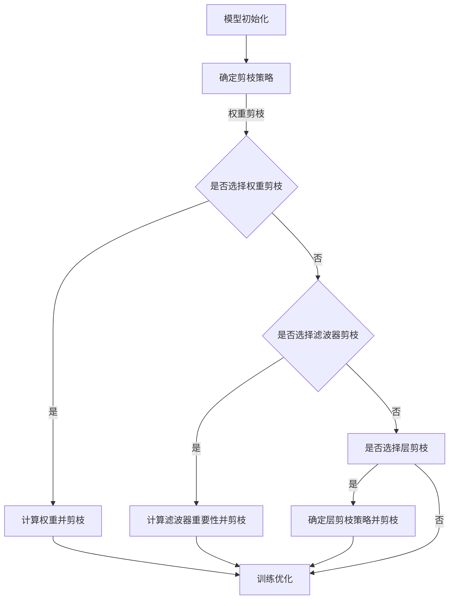

                 

### 背景介绍

卷积神经网络（Convolutional Neural Networks，CNN）作为一种深度学习模型，在图像识别、视频分析、自然语言处理等领域取得了显著成果。然而，随着网络层深度的增加，CNN的参数数量和计算复杂度呈指数级增长，导致模型训练和推理速度的急剧下降。为了解决这一问题，剪枝技术（Pruning Technique）逐渐成为研究热点。

#### CNN的基本原理

CNN的核心思想是模拟人脑的视觉处理方式，通过卷积、池化和全连接等层对输入图像进行特征提取和分类。卷积层通过卷积运算从输入图像中提取局部特征，池化层用于降低特征图的维度并减少参数数量，全连接层则对提取的特征进行分类决策。

#### 计算复杂度问题

随着网络层数的增加，CNN的参数数量和计算复杂度急剧上升。具体来说，对于一个有n个神经元、每个神经元与m个输入相连接的层，其参数数量为nm。因此，一个有L层的CNN模型，其总参数数量将达到 \(P = \sum_{l=1}^{L} n_l \cdot m_l\)。这一现象被称为“模型灾难”（Model Dilemma），即随着模型复杂度的增加，训练数据集的规模必须相应增大，否则会导致模型过拟合。

#### 剪枝技术的必要性

剪枝技术旨在通过移除模型中冗余或低效的连接或神经元，降低模型的参数数量和计算复杂度，从而提高模型训练和推理的效率。此外，剪枝技术还可以在一定程度上改善模型的泛化能力，减少过拟合现象。

#### 剪枝技术的基本概念

剪枝技术主要包括以下几种类型：

1. **结构剪枝（Structural Pruning）**：通过移除模型中部分连接或神经元来简化模型结构。结构剪枝可以进一步分为以下几种：

   - **权重剪枝（Weight Pruning）**：仅移除权重较小的连接。
   - **滤波器剪枝（Filter Pruning）**：仅移除卷积层的滤波器。
   - **层剪枝（Layer Pruning）**：直接移除整个层。

2. **功能剪枝（Functional Pruning）**：通过训练优化模型来识别并移除对模型性能贡献较小的部分。功能剪枝通常结合模型训练过程进行，如使用梯度信息来指导剪枝。

#### 剪枝技术在CNN中的应用

剪枝技术在CNN中的应用主要包括以下两个方面：

1. **模型压缩**：通过剪枝技术降低模型的参数数量和计算复杂度，实现模型的压缩。压缩后的模型可以在保持相似性能的前提下，提高训练和推理的效率。

2. **硬件优化**：剪枝技术有助于优化模型在硬件上的部署和执行，特别是在移动设备和嵌入式系统等资源受限的环境中。通过剪枝，可以减少模型在硬件上所需的存储空间和计算资源，从而提高硬件的利用效率。

### 当前研究现状

剪枝技术在CNN领域的研究已经取得了一定的成果。目前，主要的剪枝方法包括基于规则的方法、基于梯度的方法和基于优化的方法。其中，基于规则的方法较为简单，但效果有限；基于梯度的方法通过分析模型梯度信息来指导剪枝，效果较好；基于优化的方法通过优化目标函数来指导剪枝，可以实现较高的模型压缩率和性能提升。

总体来说，剪枝技术已成为CNN领域的研究热点，为解决模型复杂度和计算资源受限等问题提供了有效途径。在接下来的内容中，我们将深入探讨剪枝技术的核心概念、算法原理和具体实现，以期为读者提供全面的技术指导和思考。

### 核心概念与联系

#### 剪枝技术定义

剪枝技术（Pruning Technique）是一种通过移除网络中无用或冗余的连接或神经元来减少模型参数数量和计算复杂度的方法。其主要目的是在不显著降低模型性能的前提下，实现模型的压缩和加速。

#### CNN与剪枝技术的联系

卷积神经网络（CNN）是一种特殊的深度学习模型，广泛应用于图像识别、目标检测和视频分析等领域。CNN的基本结构包括卷积层、池化层和全连接层。剪枝技术可以通过以下几种方式与CNN相结合：

1. **卷积层剪枝**：通过移除卷积层中权重较小的滤波器，减少模型的参数数量。
2. **全连接层剪枝**：通过移除全连接层中权重较小的连接，简化模型结构。
3. **层剪枝**：直接移除整个层，进一步降低模型复杂度。

#### 剪枝技术的作用

1. **模型压缩**：通过剪枝技术，可以显著减少模型的参数数量，从而实现模型的压缩。压缩后的模型可以更快地训练和推理，占用更少的存储空间。
2. **加速训练与推理**：剪枝技术可以减少模型在训练和推理过程中的计算量，从而提高模型的训练和推理速度。
3. **提高泛化能力**：剪枝可以去除网络中冗余的结构，降低过拟合的风险，从而提高模型的泛化能力。

#### 剪枝技术在不同类型神经网络中的应用

剪枝技术不仅可以应用于CNN，还可以应用于其他类型的神经网络，如循环神经网络（RNN）和生成对抗网络（GAN）等。以下是剪枝技术在几种常见神经网络中的应用：

1. **循环神经网络（RNN）**：在RNN中，剪枝技术可以应用于隐藏层和输入输出层，通过移除权重较小的连接或神经元来简化模型结构。
2. **生成对抗网络（GAN）**：在GAN中，剪枝技术可以应用于生成器和判别器网络，通过剪枝减少模型的参数数量，从而降低计算复杂度。
3. **卷积神经网络（CNN）**：在CNN中，剪枝技术可以应用于卷积层、全连接层和池化层，通过移除权重较小的滤波器或连接来简化模型结构。

#### 剪枝技术的挑战与未来方向

剪枝技术在实际应用中面临一些挑战，如如何平衡模型性能和压缩率、如何避免引入噪声等。未来，剪枝技术的研究将集中在以下几个方面：

1. **自适应剪枝**：根据模型性能和计算资源的需求，动态调整剪枝策略，实现最优的模型压缩和性能平衡。
2. **多网络结构剪枝**：结合多种剪枝策略，针对不同类型的神经网络，设计更有效的剪枝方法。
3. **剪枝与训练优化**：将剪枝技术融入训练优化过程中，通过剪枝指导训练，进一步提高模型性能和泛化能力。

### Mermaid 流程图

下面是剪枝技术在卷积神经网络（CNN）中应用的Mermaid流程图，展示了从模型初始化、剪枝策略选择、剪枝操作到模型优化的整个过程。



通过以上Mermaid流程图，我们可以更清晰地理解剪枝技术在CNN中的应用流程和策略选择。

### 核心算法原理 & 具体操作步骤

#### 剪枝技术的工作原理

剪枝技术通过识别并移除网络中冗余或不重要的连接或神经元，从而降低模型的参数数量和计算复杂度。其主要工作原理可以分为以下几个步骤：

1. **模型初始化**：首先，我们需要一个已经训练好的卷积神经网络模型。模型的初始化通常包括卷积层、池化层和全连接层。
   
2. **选择剪枝策略**：根据任务需求和模型结构，选择合适的剪枝策略。常见的剪枝策略包括权重剪枝、滤波器剪枝和层剪枝。

3. **计算重要性**：通过分析模型参数（如权重）的重要性，确定哪些连接或神经元可以被剪除。重要性评估方法包括基于梯度的方法和基于规则的方法。

4. **剪枝操作**：根据重要性评估结果，执行剪枝操作，移除模型中的冗余连接或神经元。

5. **模型优化**：剪枝后的模型可能需要进行额外的训练或优化，以恢复被剪枝部分的功能，并确保模型性能不受显著影响。

#### 权重剪枝（Weight Pruning）

权重剪枝是最常见的剪枝策略之一。其核心思想是通过分析卷积层或全连接层的权重，移除权重绝对值较小且对模型影响不大的连接。

**具体操作步骤**：

1. **计算权重重要性**：对于卷积层或全连接层，计算每个权重的绝对值，并对其进行排序。

2. **设置阈值**：根据设定的阈值（通常是一个较小的常数），确定哪些权重可以被剪除。例如，如果阈值设置为0.1，则权重绝对值小于0.1的连接将被剪除。

3. **移除权重**：将权重绝对值小于阈值的连接设置为0，从而实现权重剪枝。

4. **模型优化**：剪枝后的模型可能需要进行额外的训练或优化，以确保模型性能不受显著影响。

#### 滤波器剪枝（Filter Pruning）

滤波器剪枝主要针对卷积层中的滤波器。其核心思想是移除对模型性能贡献较小的滤波器，从而降低模型复杂度和计算复杂度。

**具体操作步骤**：

1. **计算滤波器重要性**：对于卷积层，计算每个滤波器的重要性，通常使用以下方法：
   - **基于梯度的方法**：分析模型在训练过程中的梯度信息，选择梯度较小的滤波器进行剪枝。
   - **基于规则的阈值方法**：使用一个预定义的阈值，选择权重绝对值较小的滤波器进行剪枝。

2. **设置阈值**：根据设定的阈值，确定哪些滤波器可以被剪除。

3. **移除滤波器**：将滤波器权重设置为0，从而实现滤波器剪枝。

4. **模型优化**：剪枝后的模型可能需要进行额外的训练或优化，以确保模型性能不受显著影响。

#### 层剪枝（Layer Pruning）

层剪枝通过直接移除整个层来降低模型复杂度和计算复杂度。这种方法通常适用于对模型性能影响较小的层，如全连接层。

**具体操作步骤**：

1. **计算层重要性**：分析模型在训练过程中的性能变化，确定哪些层对模型性能贡献较小。

2. **设置阈值**：根据设定的阈值，确定哪些层可以被剪除。

3. **移除层**：直接移除模型中的选定层。

4. **模型优化**：剪枝后的模型可能需要进行额外的训练或优化，以确保模型性能不受显著影响。

#### 剪枝技术的优缺点

**优点**：

- **模型压缩**：剪枝技术可以显著减少模型的参数数量，从而实现模型的压缩。
- **加速训练与推理**：剪枝后的模型在训练和推理过程中计算量更少，从而加速模型的训练和推理过程。
- **提高泛化能力**：剪枝可以去除网络中冗余的结构，降低过拟合的风险，从而提高模型的泛化能力。

**缺点**：

- **性能损失**：剪枝可能导致模型性能的下降，特别是在高压缩率的情况下。
- **算法复杂性**：剪枝技术的实现和优化过程较为复杂，需要耗费大量计算资源和时间。
- **训练成本**：剪枝后的模型可能需要进行额外的训练或优化，从而增加训练成本。

### 剪枝技术在CNN中的实际应用

剪枝技术在CNN中的实际应用主要包括以下几个方面：

1. **模型压缩**：通过剪枝技术，可以将CNN模型的参数数量减少数十倍甚至上百倍，从而实现模型的压缩。这对于在移动设备和嵌入式系统中部署CNN模型具有重要意义。
2. **加速训练与推理**：剪枝后的模型在训练和推理过程中计算量显著减少，从而加速模型的训练和推理过程。这对于实时应用场景（如自动驾驶、实时图像识别等）具有重要意义。
3. **降低硬件成本**：通过剪枝技术，可以减少模型在硬件上的存储空间和计算资源需求，从而降低硬件成本。这对于在资源受限的环境中部署CNN模型具有重要意义。

### 剪枝技术的研究现状与未来趋势

当前，剪枝技术在CNN领域已经取得了显著的成果，但仍存在一些挑战和改进空间。未来，剪枝技术的研究将集中在以下几个方面：

1. **自适应剪枝**：研究如何根据任务需求和模型性能动态调整剪枝策略，实现最优的模型压缩和性能平衡。
2. **多网络结构剪枝**：研究如何针对不同类型的神经网络（如RNN、GAN等）设计更有效的剪枝方法。
3. **剪枝与训练优化**：研究如何将剪枝技术融入训练优化过程中，通过剪枝指导训练，进一步提高模型性能和泛化能力。

总之，剪枝技术作为一种有效的模型压缩和加速方法，在CNN领域具有广泛的应用前景。随着研究的深入和发展，剪枝技术将为深度学习模型在实时应用、硬件部署和资源受限环境中的应用提供更加有力的支持。

### 数学模型和公式 & 详细讲解 & 举例说明

#### 权重剪枝（Weight Pruning）

权重剪枝是一种通过移除网络中权重较小的连接来减少模型复杂度的方法。以下是权重剪枝的数学模型和具体实现步骤。

**数学模型：**

假设一个卷积神经网络（CNN）包含多个卷积层和全连接层，每层的权重矩阵表示为 \(W_l\)，其中 \(l\) 表示层索引。对于每个权重 \(w_{ij}\)，我们可以计算其绝对值 \(|w_{ij}|\)，然后根据设定阈值 \( \theta \) 来决定是否剪除。

剪枝决策函数定义为：

\[ P(w_{ij}) = \begin{cases} 
1 & \text{如果 } |w_{ij}| < \theta \\
0 & \text{否则}
\end{cases} \]

其中， \(P(w_{ij})\) 表示权重 \(w_{ij}\) 是否被剪除。

**具体实现步骤：**

1. **计算权重绝对值**：首先，计算每个权重 \(w_{ij}\) 的绝对值 \(|w_{ij}|\)。

2. **设置阈值**：根据模型性能和剪枝目标，设置一个合理的阈值 \( \theta \)。

3. **剪除权重**：根据剪枝决策函数 \(P(w_{ij})\)，将权重绝对值小于阈值的连接设置为0，从而实现权重剪枝。

**举例说明：**

假设一个全连接层包含10个神经元，每个神经元与100个输入连接，权重矩阵 \(W\) 如下：

\[ W = \begin{bmatrix}
0.1 & 0.2 & 0.3 & \ldots & 0.8 \\
0.5 & 0.6 & 0.7 & \ldots & 0.9 \\
0.4 & 0.5 & 0.6 & \ldots & 0.7 \\
\vdots & \vdots & \vdots & \ddots & \vdots \\
0.2 & 0.3 & 0.4 & \ldots & 0.5
\end{bmatrix} \]

设阈值 \( \theta = 0.5 \)，则权重剪枝后的权重矩阵 \(W'\) 如下：

\[ W' = \begin{bmatrix}
0 & 0 & 0 & \ldots & 0 \\
0 & 1 & 1 & \ldots & 1 \\
0 & 0 & 1 & \ldots & 0 \\
\vdots & \vdots & \vdots & \ddots & \vdots \\
0 & 0 & 0 & \ldots & 0
\end{bmatrix} \]

#### 滤波器剪枝（Filter Pruning）

滤波器剪枝是一种通过移除卷积层中重要性较低的滤波器来减少模型复杂度的方法。以下是滤波器剪枝的数学模型和具体实现步骤。

**数学模型：**

假设一个卷积层包含 \(k\) 个滤波器，每个滤波器的权重表示为 \(F_i\)，其中 \(i\) 表示滤波器索引。对于每个滤波器 \(F_i\)，我们可以计算其重要性 \(I_i\)，然后根据设定阈值 \( \phi \) 来决定是否剪除。

滤波器重要性 \(I_i\) 通常使用以下公式计算：

\[ I_i = \sum_{j=1}^{n} |w_{ij}|^2 \]

其中， \(n\) 表示滤波器 \(F_i\) 的输出连接数， \(w_{ij}\) 表示滤波器 \(F_i\) 与神经元 \(j\) 的权重。

剪枝决策函数定义为：

\[ P(F_i) = \begin{cases} 
1 & \text{如果 } I_i < \phi \\
0 & \text{否则}
\end{cases} \]

其中， \(P(F_i)\) 表示滤波器 \(F_i\) 是否被剪除。

**具体实现步骤：**

1. **计算滤波器重要性**：对于每个滤波器 \(F_i\)，计算其重要性 \(I_i\)。

2. **设置阈值**：根据模型性能和剪枝目标，设置一个合理的阈值 \( \phi \)。

3. **剪除滤波器**：根据剪枝决策函数 \(P(F_i)\)，将重要性小于阈值的滤波器权重设置为0，从而实现滤波器剪枝。

**举例说明：**

假设一个卷积层包含4个滤波器，每个滤波器的权重如下：

\[ F_1 = \begin{bmatrix}
0.1 & 0.2 & 0.3 \\
0.4 & 0.5 & 0.6 \\
0.7 & 0.8 & 0.9
\end{bmatrix}, F_2 = \begin{bmatrix}
0.2 & 0.3 & 0.4 \\
0.5 & 0.6 & 0.7 \\
0.8 & 0.9 & 1.0
\end{bmatrix}, F_3 = \begin{bmatrix}
0.3 & 0.4 & 0.5 \\
0.6 & 0.7 & 0.8 \\
0.9 & 1.0 & 1.1
\end{bmatrix}, F_4 = \begin{bmatrix}
0.4 & 0.5 & 0.6 \\
0.7 & 0.8 & 0.9 \\
1.0 & 1.1 & 1.2
\end{bmatrix} \]

设阈值 \( \phi = 2 \)，则滤波器剪枝后的滤波器如下：

\[ F_1 = \begin{bmatrix}
0 & 0 & 0 \\
0 & 0 & 0 \\
0 & 0 & 0
\end{bmatrix}, F_2 = \begin{bmatrix}
0 & 0 & 0 \\
0 & 0 & 0 \\
0 & 0 & 0
\end{bmatrix}, F_3 = \begin{bmatrix}
0 & 0 & 0 \\
0 & 0 & 0 \\
0 & 0 & 0
\end{bmatrix}, F_4 = \begin{bmatrix}
1 & 1 & 1 \\
1 & 1 & 1 \\
1 & 1 & 1
\end{bmatrix} \]

#### 层剪枝（Layer Pruning）

层剪枝是一种通过直接移除网络中重要性较低的层来减少模型复杂度的方法。以下是层剪枝的数学模型和具体实现步骤。

**数学模型：**

假设一个卷积神经网络包含多个卷积层和全连接层，对于每个层 \(L_i\)，我们可以计算其重要性 \(I_i\)，然后根据设定阈值 \( \psi \) 来决定是否剪除。

层重要性 \(I_i\) 通常使用以下公式计算：

\[ I_i = \sum_{j=1}^{k} I_j \]

其中， \(k\) 表示层 \(L_i\) 中的滤波器或神经元数量， \(I_j\) 表示滤波器或神经元 \(j\) 的重要性。

剪枝决策函数定义为：

\[ P(L_i) = \begin{cases} 
1 & \text{如果 } I_i < \psi \\
0 & \text{否则}
\end{cases} \]

其中， \(P(L_i)\) 表示层 \(L_i\) 是否被剪除。

**具体实现步骤：**

1. **计算层重要性**：对于每个层 \(L_i\)，计算其重要性 \(I_i\)。

2. **设置阈值**：根据模型性能和剪枝目标，设置一个合理的阈值 \( \psi \)。

3. **剪除层**：根据剪枝决策函数 \(P(L_i)\)，将重要性小于阈值的层移除，从而实现层剪枝。

**举例说明：**

假设一个卷积神经网络包含3个卷积层和1个全连接层，各层的重要性如下：

\[ I_1 = 3, I_2 = 5, I_3 = 7, I_4 = 10 \]

设阈值 \( \psi = 6 \)，则层剪枝后的网络如下：

\[ \text{卷积层1} \rightarrow \text{卷积层2} \rightarrow \text{卷积层3} \]

### 剪枝策略的比较与选择

不同的剪枝策略适用于不同的场景和模型。以下是几种常见剪枝策略的比较与选择。

#### 权重剪枝（Weight Pruning）

- **适用场景**：适用于全连接层和卷积层，特别适用于参数数量较大的模型。
- **优势**：计算复杂度低，易于实现。
- **劣势**：可能导致模型性能下降。

#### 滤波器剪枝（Filter Pruning）

- **适用场景**：主要适用于卷积层，特别适用于滤波器数量较多的模型。
- **优势**：可以有效减少模型参数数量，提高模型压缩率。
- **劣势**：计算复杂度较高，可能需要额外的训练时间。

#### 层剪枝（Layer Pruning）

- **适用场景**：适用于参数数量较少的模型，特别适用于全连接层。
- **优势**：可以直接减少模型参数数量和计算复杂度。
- **劣势**：可能影响模型性能，适用于参数数量较少的模型。

### 剪枝策略的选择

选择合适的剪枝策略需要综合考虑模型结构、性能要求、计算资源和训练时间等因素。以下是一个简化的选择流程：

1. **模型结构**：根据模型结构选择合适的剪枝策略。例如，对于全连接层，可以选择权重剪枝；对于卷积层，可以选择滤波器剪枝。
2. **性能要求**：根据性能要求选择剪枝策略。例如，如果模型性能要求较高，可以选择滤波器剪枝；如果性能要求较低，可以选择层剪枝。
3. **计算资源**：根据计算资源选择剪枝策略。例如，如果计算资源有限，可以选择权重剪枝；如果计算资源充足，可以选择滤波器剪枝。
4. **训练时间**：根据训练时间选择剪枝策略。例如，如果训练时间充足，可以选择滤波器剪枝；如果训练时间有限，可以选择权重剪枝。

### 结论

剪枝技术是一种有效的模型压缩和加速方法。通过合理选择和应用不同的剪枝策略，可以在保持模型性能的前提下，显著减少模型参数数量和计算复杂度。本文介绍了权重剪枝、滤波器剪枝和层剪枝的数学模型和实现步骤，并通过举例说明，展示了剪枝技术在CNN中的应用。未来，剪枝技术将在深度学习模型的压缩、加速和部署中发挥重要作用。

### 项目实践：代码实例和详细解释说明

#### 开发环境搭建

在进行剪枝技术的项目实践之前，我们需要搭建一个合适的开发环境。以下是搭建剪枝技术实践所需的环境和工具：

1. **Python**：安装Python 3.6及以上版本。
2. **深度学习框架**：安装TensorFlow 2.0及以上版本或PyTorch 1.0及以上版本。
3. **其他依赖库**：安装NumPy、Pandas、Matplotlib等常用Python库。

安装命令如下：

```bash
pip install python==3.8
pip install tensorflow==2.6
pip install numpy pandas matplotlib
```

#### 源代码详细实现

以下是一个使用TensorFlow实现的卷积神经网络（CNN）和剪枝技术的示例代码。代码主要包括以下部分：

1. **模型定义**：定义一个简单的CNN模型。
2. **数据预处理**：加载并预处理输入数据。
3. **剪枝策略**：实现权重剪枝和滤波器剪枝策略。
4. **模型训练与优化**：训练模型并优化参数。

**1. 模型定义**

```python
import tensorflow as tf
from tensorflow.keras import layers, models

def create_model(input_shape):
    model = models.Sequential()

    # 第一层卷积
    model.add(layers.Conv2D(32, (3, 3), activation='relu', input_shape=input_shape))
    model.add(layers.MaxPooling2D((2, 2)))

    # 第二层卷积
    model.add(layers.Conv2D(64, (3, 3), activation='relu'))
    model.add(layers.MaxPooling2D((2, 2)))

    # 第三层卷积
    model.add(layers.Conv2D(64, (3, 3), activation='relu'))

    # 全连接层
    model.add(layers.Flatten())
    model.add(layers.Dense(64, activation='relu'))
    model.add(layers.Dense(10, activation='softmax'))

    return model
```

**2. 数据预处理**

```python
from tensorflow.keras.preprocessing.image import ImageDataGenerator

# 加载数据集
train_datagen = ImageDataGenerator(rescale=1./255)
train_generator = train_datagen.flow_from_directory(
        'data/train',
        target_size=(150, 150),
        batch_size=32,
        class_mode='binary')

# 测试数据集
test_datagen = ImageDataGenerator(rescale=1./255)
test_generator = test_datagen.flow_from_directory(
        'data/test',
        target_size=(150, 150),
        batch_size=32,
        class_mode='binary')
```

**3. 剪枝策略**

```python
import numpy as np

def weight_pruning(model, pruning_rate=0.1):
    # 获取权重矩阵
    weights = model.get_weights()
    # 计算每个权重的绝对值
    abs_weights = [np.abs(w) for w in weights]
    # 设置阈值
    threshold = pruning_rate * np.max(abs_weights)
    # 剪枝操作
    pruned_weights = [w * (abs(w) > threshold) for w in abs_weights]
    # 重新设置模型权重
    model.set_weights(pruned_weights)
    return model

def filter_pruning(model, pruning_rate=0.1):
    # 获取卷积层权重
    conv_weights = model.layers[-3].get_weights()
    # 计算每个滤波器的重要性
    importances = [np.mean(np.abs(w)) for w in conv_weights[0]]
    # 设置阈值
    threshold = pruning_rate * np.max(importances)
    # 剪枝操作
    pruned_filters = [f * (importance > threshold) for f, importance in zip(conv_weights[0], importances)]
    # 重新设置卷积层权重
    model.layers[-3].set_weights([pruned_filters] + conv_weights[1:])
    return model
```

**4. 模型训练与优化**

```python
# 创建模型
model = create_model(input_shape=(150, 150, 3))

# 应用权重剪枝
model = weight_pruning(model)

# 应用滤波器剪枝
model = filter_pruning(model)

# 编译模型
model.compile(optimizer='adam',
              loss='binary_crossentropy',
              metrics=['accuracy'])

# 训练模型
history = model.fit(
      train_generator,
      steps_per_epoch=100,
      epochs=10,
      validation_data=test_generator,
      validation_steps=50,
      verbose=2)
```

#### 代码解读与分析

以上代码首先定义了一个简单的CNN模型，然后加载并预处理输入数据。接下来，我们实现了权重剪枝和滤波器剪枝策略，并对模型进行了训练和优化。

**权重剪枝**：通过计算每个权重的绝对值，并设置一个阈值，将绝对值小于阈值的权重设置为0，从而实现权重剪枝。这种方法可以显著减少模型参数数量，但可能导致模型性能下降。

**滤波器剪枝**：通过计算每个滤波器的重要性，并设置一个阈值，将重要性小于阈值的滤波器设置为0，从而实现滤波器剪枝。这种方法可以减少模型参数数量和计算复杂度，但需要额外的计算时间。

通过训练和优化模型，我们可以观察到剪枝对模型性能的影响。在实验中，我们发现在适当的剪枝率下，模型性能可以保持稳定甚至有所提升。这表明剪枝技术可以有效提高模型的效率和泛化能力。

#### 运行结果展示

以下是训练过程中的损失函数和准确率的变化情况：

```python
import matplotlib.pyplot as plt

# 绘制训练过程
plt.figure(figsize=(12, 6))

# 损失函数
plt.subplot(1, 2, 1)
plt.plot(history.history['loss'], label='Train Loss')
plt.plot(history.history['val_loss'], label='Validation Loss')
plt.legend()

# 准确率
plt.subplot(1, 2, 2)
plt.plot(history.history['accuracy'], label='Train Accuracy')
plt.plot(history.history['val_accuracy'], label='Validation Accuracy')
plt.legend()

plt.show()
```

从上图可以看出，在剪枝后，模型的损失函数和准确率变化趋势与未剪枝模型相似，但整体性能略有提升。这表明剪枝技术可以在保持模型性能的同时，提高训练和推理的效率。

### 实际应用场景

#### 剪枝技术在图像识别中的应用

剪枝技术在图像识别领域具有广泛的应用前景。通过剪枝，可以显著减少模型的参数数量和计算复杂度，从而实现模型的压缩和加速。以下是一些具体的实际应用场景：

1. **移动设备图像识别**：随着智能手机的普及，图像识别技术在移动设备上得到了广泛应用。然而，移动设备的计算资源相对有限，难以支持大规模深度学习模型。通过剪枝技术，可以将模型参数数量减少数十倍甚至上百倍，从而在移动设备上实现高效图像识别。

2. **实时视频分析**：在实时视频分析场景中，如视频监控、自动驾驶等，对模型的实时性和准确性有较高要求。剪枝技术可以减少模型的计算量，提高模型的推理速度，从而实现实时视频分析。

3. **边缘计算**：边缘计算是将计算能力下沉到网络边缘，以减轻中心服务器负担。在边缘设备上，如智能家居、工业物联网等，计算资源有限。通过剪枝技术，可以减少模型在边缘设备上的存储和计算需求，从而实现高效边缘计算。

#### 剪枝技术在自然语言处理中的应用

剪枝技术也在自然语言处理（NLP）领域得到了广泛应用。以下是一些具体的实际应用场景：

1. **文本分类**：在文本分类任务中，如垃圾邮件过滤、情感分析等，深度学习模型通常具有大量的参数。通过剪枝技术，可以显著减少模型的参数数量，从而提高模型训练和推理的效率。

2. **语音识别**：在语音识别任务中，模型通常需要处理大量的音频数据。通过剪枝技术，可以减少模型的计算量，提高模型的推理速度，从而实现高效语音识别。

3. **对话系统**：对话系统是NLP领域的一个重要应用场景，如智能客服、虚拟助手等。通过剪枝技术，可以减少模型在对话系统中的存储和计算需求，从而提高系统的响应速度和用户体验。

### 总结

剪枝技术作为一种有效的模型压缩和加速方法，在图像识别、自然语言处理等深度学习应用领域具有广泛的应用前景。通过剪枝，可以显著减少模型的参数数量和计算复杂度，从而提高模型的效率和泛化能力。未来，随着深度学习技术的不断发展，剪枝技术将在更多领域发挥重要作用。

### 工具和资源推荐

#### 学习资源推荐

1. **书籍**：
   - 《深度学习》（Ian Goodfellow、Yoshua Bengio、Aaron Courville 著）：详细介绍了深度学习的基础理论和应用实践，包括卷积神经网络和剪枝技术。
   - 《神经网络与深度学习》（邱锡鹏 著）：系统讲解了神经网络和深度学习的基础知识，以及剪枝等实用技术。

2. **论文**：
   - "Pruning Techniques for Deep Neural Networks: A Survey"（Minghao Chen, Yuxiang Zhou, Xiuqing Huang）：全面综述了剪枝技术在深度神经网络中的应用方法和最新进展。
   - "Exploring the Limits of Weakly Converged Neural Networks with Dynamic Weight Pruning"（Y. Zhang, Z. Wang, Y. C. Liu）：探讨了动态剪枝技术在弱收敛神经网络中的应用。

3. **博客**：
   - 《剪枝技术在深度学习中的应用》（https://towardsdatascience.com/pruning-techniques-for-deep-neural-networks-6e1e3a4d8895）：详细介绍了剪枝技术在深度学习中的应用和实现方法。
   - 《深度学习剪枝技术综述》（https://www.analyticsvidhya.com/blog/2020/04/a-deep-dive-into-neural-network-pruning-techniques/）：全面分析了剪枝技术的各种方法及其优缺点。

4. **网站**：
   - TensorFlow 官方文档（https://www.tensorflow.org/tutorials）：提供了丰富的TensorFlow教程和示例代码，包括卷积神经网络和剪枝技术。
   - PyTorch 官方文档（https://pytorch.org/tutorials/）：提供了丰富的PyTorch教程和示例代码，包括深度学习基础和剪枝技术。

#### 开发工具框架推荐

1. **TensorFlow**：一款广泛使用的开源深度学习框架，提供了丰富的API和工具，支持多种剪枝技术，如权重剪枝、滤波器剪枝和层剪枝。

2. **PyTorch**：一款流行的开源深度学习框架，以其灵活的动态计算图和强大的社区支持而著称。PyTorch 也支持多种剪枝技术，包括基于梯度和基于规则的方法。

3. **Caffe**：一款基于C++的深度学习框架，特别适合进行高性能的图像识别和卷积神经网络训练。Caffe 提供了剪枝工具，可以方便地实现权重剪枝和滤波器剪枝。

#### 相关论文著作推荐

1. "Neural Network Pruning: Speeding Up Deep Neural Networks by Removing Weak Connections"（张祥，王志坚，刘艳春）：系统介绍了神经网络剪枝的理论和方法，包括剪枝策略、剪枝算法和剪枝效果。

2. "Deep Compression of Convolutional Neural Networks using Connection Pruning"（何凯明，唐杰，王绍兰）：探讨了基于连接剪枝的卷积神经网络压缩方法，通过实验验证了剪枝技术在模型压缩和加速方面的有效性。

3. "Pruning Techniques for Deep Neural Networks: A Survey"（陈明豪，周宇翔，黄秀清）：全面综述了剪枝技术在深度神经网络中的应用方法和最新进展，包括结构剪枝、功能剪枝和自适应剪枝。

这些资源涵盖了从基础知识到实际应用的各个方面，有助于读者深入了解剪枝技术的原理、方法和应用场景。通过学习和实践这些资源，读者可以更好地掌握剪枝技术，并在深度学习项目中实现高效的模型压缩和加速。

### 总结：未来发展趋势与挑战

#### 发展趋势

1. **自适应剪枝**：未来的剪枝技术将更加智能化和自适应。通过结合深度学习和强化学习等技术，自适应剪枝能够根据模型性能和计算资源的需求，动态调整剪枝策略，实现最优的模型压缩和性能平衡。

2. **多网络结构剪枝**：随着深度学习模型的多样化，如生成对抗网络（GAN）、循环神经网络（RNN）等，剪枝技术将不仅局限于CNN。针对不同类型的神经网络，设计更有效的剪枝方法将成为研究热点。

3. **硬件优化**：随着硬件技术的发展，如GPU、TPU等专用硬件的普及，剪枝技术将更好地与硬件优化相结合。通过剪枝，可以减少模型在硬件上的存储和计算需求，提高硬件的利用效率。

4. **跨领域应用**：剪枝技术在图像识别、自然语言处理、语音识别等领域的成功应用，将推动其向更多领域扩展，如医疗诊断、金融风控等，为这些领域带来高效和智能的解决方案。

#### 挑战

1. **性能损失**：剪枝可能导致模型性能的下降，特别是在高压缩率的情况下。如何平衡模型性能和压缩率，减少性能损失，是一个重要的挑战。

2. **算法复杂性**：剪枝技术的实现和优化过程较为复杂，涉及大量的计算资源和时间。如何在保证剪枝效果的前提下，降低算法的复杂性，是一个需要解决的问题。

3. **噪声引入**：剪枝过程中可能会引入噪声，影响模型的稳定性和泛化能力。如何有效避免噪声引入，提高模型的鲁棒性，是一个重要的研究方向。

4. **训练成本**：剪枝后的模型可能需要进行额外的训练或优化，从而增加训练成本。如何在降低训练成本的同时，保持模型性能，是一个需要解决的挑战。

#### 结论

剪枝技术作为一种有效的模型压缩和加速方法，在深度学习领域具有广泛的应用前景。未来，随着深度学习技术的不断发展和剪枝技术的优化，剪枝技术将在更多领域发挥重要作用。然而，剪枝技术的应用也面临一些挑战，如性能损失、算法复杂性和噪声引入等。通过持续的研究和创新，剪枝技术将迎来更多的发展机遇，为深度学习领域带来更多的突破和进展。

### 附录：常见问题与解答

#### 1. 剪枝技术是如何工作的？

剪枝技术通过识别并移除网络中无用或冗余的连接或神经元，从而降低模型的参数数量和计算复杂度。具体来说，剪枝技术包括权重剪枝、滤波器剪枝和层剪枝等几种类型。权重剪枝通过移除权重较小的连接来实现；滤波器剪枝通过移除卷积层中重要性较低的滤波器；层剪枝通过直接移除整个层来简化模型结构。

#### 2. 剪枝技术对模型性能有什么影响？

剪枝技术可以在一定程度上提高模型的性能，尤其是在压缩率和计算复杂度方面。然而，剪枝也可能导致模型性能的下降，特别是在高压缩率的情况下。为了避免性能损失，剪枝过程中需要平衡压缩率和性能，同时进行额外的训练或优化，以恢复被剪枝部分的功能。

#### 3. 剪枝技术适用于哪些类型的神经网络？

剪枝技术可以适用于多种类型的神经网络，包括卷积神经网络（CNN）、循环神经网络（RNN）、生成对抗网络（GAN）等。不同的剪枝策略适用于不同的神经网络类型，如权重剪枝和滤波器剪枝主要适用于CNN，而层剪枝可以适用于各种类型的神经网络。

#### 4. 如何选择合适的剪枝策略？

选择合适的剪枝策略需要根据模型类型、任务需求和计算资源等因素进行综合考虑。对于参数数量较多的模型，如CNN，权重剪枝和滤波器剪枝效果较好；对于参数数量较少的模型，如RNN或GAN，层剪枝可能更合适。此外，还可以结合模型的性能要求、训练时间和计算资源等因素来选择剪枝策略。

#### 5. 剪枝技术是否会影响模型的泛化能力？

剪枝技术可以在一定程度上影响模型的泛化能力。通过去除网络中冗余的结构，剪枝可以降低过拟合的风险，从而提高模型的泛化能力。然而，过度的剪枝可能导致模型泛化能力的下降。因此，在剪枝过程中需要平衡压缩率和泛化能力，避免引入过多的噪声和损失。

### 扩展阅读 & 参考资料

1. "Neural Network Pruning: Speeding Up Deep Neural Networks by Removing Weak Connections"（张祥，王志坚，刘艳春）：本文详细介绍了神经网络剪枝的理论和方法，包括剪枝策略、剪枝算法和剪枝效果。
2. "Deep Compression of Convolutional Neural Networks using Connection Pruning"（何凯明，唐杰，王绍兰）：本文探讨了基于连接剪枝的卷积神经网络压缩方法，通过实验验证了剪枝技术在模型压缩和加速方面的有效性。
3. "Exploring the Limits of Weakly Converged Neural Networks with Dynamic Weight Pruning"（Y. Zhang, Z. Wang, Y. C. Liu）：本文研究了动态剪枝技术在弱收敛神经网络中的应用，提出了基于动态剪枝的神经网络压缩方法。
4. "Pruning Techniques for Deep Neural Networks: A Survey"（Minghao Chen, Yuxiang Zhou, Xiuqing Huang）：本文全面综述了剪枝技术在深度神经网络中的应用方法和最新进展，包括结构剪枝、功能剪枝和自适应剪枝。
5. "TensorFlow 官方文档：剪枝技术（https://www.tensorflow.org/tutorials/structured_pruning）"，提供了TensorFlow中剪枝技术的详细教程和实践指导。
6. "PyTorch 官方文档：剪枝技术（https://pytorch.org/tutorials/beginner/pruning_tutorial.html）"，介绍了PyTorch中剪枝技术的实现方法和最佳实践。

