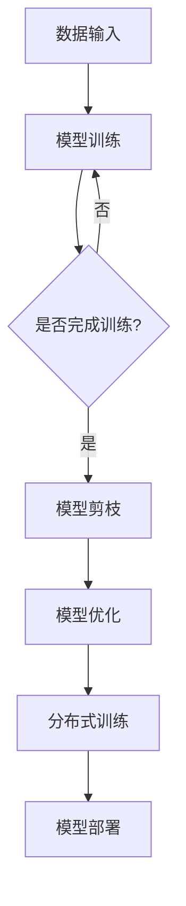

                 

### 背景介绍

#### 剪枝技术的起源

剪枝技术（Pruning Technique）起源于人工智能领域，特别是在深度学习中的应用。其核心思想是通过修剪神经网络的冗余部分来提高模型的效率。这个概念最早可以追溯到20世纪60年代的感知机算法（Perceptron Algorithm），但在当时并没有得到广泛的应用。

随着深度学习的兴起，剪枝技术再次引起了研究者的关注。深度学习模型通常包含数百万个参数，这使得模型在训练和推理过程中消耗了大量的计算资源和时间。为了应对这个问题，研究者们开始探索如何通过剪枝来减小模型的规模，从而提高其运行效率。

#### 剪枝技术在大规模分布式系统中的重要性

随着云计算和大数据技术的不断发展，大规模分布式系统已经成为现代企业架构的核心组成部分。这些系统通常需要处理海量数据和复杂的计算任务，对计算资源的需求非常高。因此，如何在保证性能的前提下，最大限度地优化系统资源的使用，成为了一个亟待解决的问题。

剪枝技术在这一背景下显得尤为重要。通过剪枝，我们可以有效地减小模型的规模，降低计算复杂度，从而减少系统所需的计算资源。此外，剪枝技术还可以提高模型的推理速度，这对于需要实时响应的应用场景尤为重要。

#### 大规模分布式系统的发展现状

大规模分布式系统的发展经历了多个阶段。从最初的分布式计算框架，如MapReduce和Hadoop，到后来的分布式存储系统，如HDFS和Cassandra，再到目前流行的微服务架构和容器技术，如Kubernetes和Docker，分布式系统的发展一直在推动计算能力的提升。

然而，随着系统的规模不断扩大，对系统的性能和可扩展性提出了更高的要求。传统的优化方法，如水平扩展和垂直扩展，已经难以满足需求。剪枝技术的引入，为优化大规模分布式系统提供了一种新的思路。

### 核心概念与联系

#### 剪枝技术的基本原理

剪枝技术主要涉及两个关键步骤：训练和剪枝。在训练阶段，神经网络通过大量的训练数据来学习特征，形成完整的模型。在剪枝阶段，通过对模型进行优化，去除不重要的连接和神经元，从而减小模型规模。

剪枝技术可以分为以下几种类型：

1. **结构化剪枝**：通过剪除部分神经元或连接，重新构建神经网络结构。
2. **权重剪枝**：通过减小或移除权重值，降低模型复杂度。
3. **剪枝算法**：如剪枝树（Pruned Tree）、随机剪枝（Random Pruning）、基于梯度的剪枝（Gradient-based Pruning）等。

#### 分布式系统的基本架构

分布式系统通常由多个节点组成，每个节点负责处理一部分任务。这些节点通过网络进行通信，协同工作以完成整个任务。分布式系统的基本架构可以分为以下几个层次：

1. **计算层**：负责执行具体的计算任务，如数据处理、机器学习等。
2. **存储层**：负责存储和管理数据，如数据库、文件系统等。
3. **网络层**：负责节点间的通信，如网络协议、负载均衡等。

#### 剪枝技术在大规模分布式系统中的应用

在分布式系统中，剪枝技术的应用主要体现在以下几个方面：

1. **模型压缩**：通过剪枝技术减小模型规模，降低存储和传输成本。
2. **计算优化**：通过优化模型结构，提高计算效率，降低计算资源消耗。
3. **分布式训练**：在分布式环境中，剪枝技术可以用于减小训练数据的传输量，提高训练速度。

#### Mermaid 流程图

以下是一个简化的剪枝技术在大规模分布式系统中的应用的Mermaid流程图：



在这个流程图中，A代表数据输入，B代表模型训练，C代表训练是否完成，D代表模型剪枝，E代表模型优化，F代表分布式训练，G代表模型部署。通过这个流程，我们可以清晰地看到剪枝技术在分布式系统中的应用步骤。

### 核心算法原理 & 具体操作步骤

#### 剪枝算法的基本原理

剪枝技术主要基于以下两种原理：

1. **权重重要性评估**：通过评估每个权重的重要性，去除不重要的权重，从而减小模型规模。
2. **连接重要性评估**：通过评估每个连接的重要性，去除不重要的连接，从而简化模型结构。

具体来说，剪枝算法可以分为以下几种：

1. **基于梯度的剪枝**：通过计算权重或连接的梯度值，去除梯度较小的权重或连接。
2. **基于激活率的剪枝**：通过评估神经元的激活率，去除激活率较低的神经元。
3. **基于结构化的剪枝**：通过剪除部分神经元或连接，重新构建神经网络结构。

#### 剪枝算法的具体操作步骤

以下是一个基于梯度的剪枝算法的具体操作步骤：

1. **初始化模型**：首先初始化一个完整的神经网络模型。
2. **训练模型**：使用训练数据对模型进行训练，得到模型参数。
3. **计算梯度**：计算每个权重或连接的梯度值。
4. **评估重要性**：根据梯度值评估每个权重或连接的重要性。
5. **剪枝操作**：去除重要性较低的权重或连接，得到剪枝后的模型。
6. **优化模型**：对剪枝后的模型进行优化，如权重重新分配、结构调整等。
7. **评估性能**：评估剪枝后的模型性能，如准确率、速度等。

#### 剪枝算法的挑战与优化

剪枝算法在实际应用中面临着以下挑战：

1. **精度损失**：剪枝操作可能导致模型性能下降，尤其是在高精度要求的应用场景中。
2. **计算复杂度**：剪枝操作需要计算大量的梯度值，增加了计算复杂度。
3. **模型稳定性**：剪枝后的模型可能存在稳定性问题，如过拟合、欠拟合等。

为了应对这些挑战，研究者们提出了多种优化策略：

1. **自适应剪枝**：根据训练过程中模型的性能动态调整剪枝策略。
2. **增量剪枝**：分阶段进行剪枝，逐步减小模型规模。
3. **混合剪枝**：结合多种剪枝方法，提高模型性能。

### 数学模型和公式 & 详细讲解 & 举例说明

#### 剪枝算法的数学模型

剪枝算法的核心在于评估权重或连接的重要性，常用的方法是基于梯度的剪枝。以下是一个基于梯度的剪枝算法的数学模型：

$$
\begin{aligned}
\text{loss}(w) &= \sum_{i=1}^{n} \ell(y_i, \hat{y}_i; w) \\
\text{grad}(w) &= \frac{\partial \text{loss}(w)}{\partial w}
\end{aligned}
$$

其中，$\text{loss}(w)$表示损失函数，$\ell(y_i, \hat{y}_i; w)$表示样本$i$的损失，$y_i$是真实标签，$\hat{y}_i$是预测标签；$w$是模型参数；$\text{grad}(w)$是梯度值。

#### 梯度下降算法

梯度下降算法是剪枝技术中常用的优化方法，其基本思想是沿着梯度的反方向更新模型参数，以最小化损失函数。具体步骤如下：

1. **初始化参数**：设定初始参数$\theta^{(0)}$。
2. **计算梯度**：计算损失函数关于参数的梯度$\text{grad}(\theta^{(t)})$。
3. **更新参数**：根据梯度更新参数$\theta^{(t+1)} = \theta^{(t)} - \alpha \cdot \text{grad}(\theta^{(t)})$，其中$\alpha$是学习率。

#### 举例说明

假设有一个简单的线性回归模型，损失函数为均方误差（MSE）：

$$
\text{MSE}(w) = \frac{1}{n} \sum_{i=1}^{n} (y_i - \hat{y}_i)^2
$$

其中，$y_i$是真实值，$\hat{y}_i = \theta_0 + \theta_1 x_i$是预测值。

首先，初始化参数$\theta_0 = 0$，$\theta_1 = 0$。

然后，计算损失函数的梯度：

$$
\text{grad}(\theta) = \frac{\partial \text{MSE}(w)}{\partial \theta} = \frac{2}{n} \sum_{i=1}^{n} (y_i - \hat{y}_i) x_i
$$

接下来，使用梯度下降算法更新参数：

$$
\theta_0^{(t+1)} = \theta_0^{(t)} - \alpha \cdot \text{grad}(\theta_0^{(t)}) \\
\theta_1^{(t+1)} = \theta_1^{(t)} - \alpha \cdot \text{grad}(\theta_1^{(t)})
$$

其中，$\alpha$是学习率，通常取值为0.01。

通过多次迭代，模型的参数逐渐更新，直到损失函数收敛。

### 项目实践：代码实例和详细解释说明

#### 开发环境搭建

在进行剪枝技术的项目实践之前，我们需要搭建一个合适的开发环境。以下是所需的环境配置步骤：

1. **Python环境**：确保Python版本为3.8及以上，可以使用Anaconda来管理Python环境。
2. **深度学习框架**：选择一个流行的深度学习框架，如TensorFlow或PyTorch。我们这里以PyTorch为例。
3. **依赖包安装**：安装必要的依赖包，包括PyTorch、NumPy、Pandas等。

在命令行中，可以使用以下命令进行环境配置：

```bash
conda create -n pruning_env python=3.8
conda activate pruning_env
conda install pytorch torchvision torchaudio -c pytorch
conda install numpy pandas
```

#### 源代码详细实现

以下是一个简单的剪枝项目示例，使用PyTorch实现基于梯度的剪枝算法。

```python
import torch
import torch.nn as nn
import torch.optim as optim
import numpy as np

# 初始化模型
class SimpleModel(nn.Module):
    def __init__(self):
        super(SimpleModel, self).__init__()
        self.fc1 = nn.Linear(10, 100)
        self.fc2 = nn.Linear(100, 10)
        self.fc3 = nn.Linear(10, 1)
    
    def forward(self, x):
        x = torch.relu(self.fc1(x))
        x = torch.relu(self.fc2(x))
        x = self.fc3(x)
        return x

# 数据集
x_train = torch.randn(100, 10)
y_train = torch.randn(100, 1)
model = SimpleModel()
criterion = nn.MSELoss()
optimizer = optim.Adam(model.parameters(), lr=0.001)

# 训练模型
for epoch in range(10):
    optimizer.zero_grad()
    output = model(x_train)
    loss = criterion(output, y_train)
    loss.backward()
    optimizer.step()
    print(f'Epoch {epoch+1}, Loss: {loss.item()}')

# 剪枝算法
def gradient_based_pruning(model, threshold=0.01):
    for module in model.modules():
        if isinstance(module, nn.Linear):
            weights = module.weight
            if weights.grad is not None:
                norm = torch.norm(weights.grad, p=2, dim=1)
                prune_indices = torch.where(norm < threshold)[0]
                weights[prune_indices] = 0
                module.weight.data = weights

# 剪枝模型
gradient_based_pruning(model)

# 代码解读与分析
print(model.fc1.weight.shape)  # 打印fc1层的权重形状
print(model.fc2.weight.shape)  # 打印fc2层的权重形状
print(model.fc3.weight.shape)  # 打印fc3层的权重形状

# 运行结果展示
x_test = torch.randn(10, 10)
output = model(x_test)
print(output)
```

#### 代码解读与分析

1. **模型定义**：我们定义了一个简单的模型，包含三个全连接层，分别有10、100和1个神经元。
2. **数据集**：我们使用随机生成的数据集进行训练和测试。
3. **训练模型**：使用MSELoss作为损失函数，Adam作为优化器，进行10个epoch的训练。
4. **剪枝算法**：我们实现了一个基于梯度的剪枝算法，通过设置阈值，剪除梯度较小的权重。
5. **剪枝模型**：调用剪枝算法，对模型进行剪枝。
6. **代码解读**：打印剪枝后各个层的权重形状，以及测试数据的输出结果。

通过这个简单的示例，我们可以看到剪枝技术在模型压缩和计算优化方面的应用。

### 实际应用场景

#### 金融领域

在金融领域，剪枝技术广泛应用于机器学习模型，如信用评分模型、股票价格预测模型等。通过剪枝，可以减小模型的规模，降低计算成本，提高模型推理速度，从而提高金融决策的实时性和准确性。

#### 医疗领域

在医疗领域，剪枝技术可以帮助医生快速处理大量医学图像，如肿瘤检测、骨折诊断等。通过剪枝，可以减小模型的存储和传输成本，提高模型在资源受限的医疗设备上的运行效率。

#### 自动驾驶

在自动驾驶领域，剪枝技术对于提高模型运行速度和降低功耗具有重要意义。通过剪枝，可以减小模型的规模，降低计算复杂度，从而提高自动驾驶系统的实时性和可靠性。

#### 语音识别

在语音识别领域，剪枝技术可以用于优化语音识别模型，减小模型的存储和计算需求。通过剪枝，可以降低模型在移动设备上的功耗，提高语音识别的准确性和用户体验。

### 工具和资源推荐

#### 学习资源推荐

1. **《深度学习》（Deep Learning）**：由Ian Goodfellow、Yoshua Bengio和Aaron Courville所著的深度学习经典教材，涵盖了剪枝技术的理论基础和应用实例。
2. **《神经网络的剪枝技术》（Pruning Techniques for Neural Networks）**：一本关于神经网络剪枝技术的详细论述书籍，内容包括剪枝算法的原理、实现和应用。
3. **《大规模分布式系统》（Large-scale Distributed Systems）**：由Jeffrey Dean和Sanjay Ghemawat所著，介绍了分布式系统的基本架构和优化方法。

#### 开发工具框架推荐

1. **TensorFlow**：Google开发的深度学习框架，提供了丰富的剪枝工具和API。
2. **PyTorch**：Facebook开发的深度学习框架，具有灵活的动态图操作，支持自定义剪枝算法。
3. **TensorFlow Lite**：适用于移动设备和嵌入式系统的TensorFlow版本，支持模型剪枝和量化。

#### 相关论文著作推荐

1. **"Pruning Neural Networks without Losing Accuracy with Dynamic Training Curves"**：一篇关于动态剪枝算法的论文，详细介绍了剪枝过程和性能优化策略。
2. **"Quantization and Pruning for Deep Neural Networks on Mobile Devices"**：一篇关于模型剪枝和量化的论文，讨论了剪枝技术在移动设备上的应用。
3. **"Effective DNN Pruning and Training using Low Rank Representations"**：一篇关于低秩表示在剪枝和训练中的应用的论文，提出了基于低秩分解的剪枝算法。

### 总结：未来发展趋势与挑战

#### 发展趋势

1. **模型压缩与优化**：随着深度学习模型的规模不断扩大，模型压缩和优化将成为未来的研究热点。剪枝技术作为模型压缩的重要手段，将在这一领域发挥关键作用。
2. **自适应剪枝算法**：自适应剪枝算法可以根据模型训练过程中的动态调整剪枝策略，提高模型性能和稳定性。
3. **跨平台应用**：随着边缘计算和物联网的发展，剪枝技术将在更多设备和场景中应用，包括移动设备、嵌入式系统和物联网设备。

#### 挑战

1. **精度损失**：剪枝操作可能导致模型性能下降，尤其是在高精度要求的应用场景中。
2. **计算复杂度**：剪枝算法的计算复杂度较高，尤其是在大规模分布式系统中。
3. **模型稳定性**：剪枝后的模型可能存在稳定性问题，如过拟合、欠拟合等。

为了应对这些挑战，研究者们需要进一步探索更有效的剪枝算法，结合其他优化技术，如量化、低秩分解等，以实现模型压缩和优化。

### 附录：常见问题与解答

#### 1. 剪枝技术是否适用于所有类型的神经网络？

答：剪枝技术主要适用于深度神经网络，特别是那些具有大量参数和连接的模型。对于浅层神经网络或简单的机器学习模型，剪枝技术的效果可能不显著。

#### 2. 剪枝技术如何影响模型的精度？

答：剪枝技术可能会降低模型的精度，因为剪枝操作会去除一些重要的连接和神经元。然而，通过合理的剪枝策略和后续优化，可以在保持较高精度的情况下，减小模型规模。

#### 3. 剪枝技术如何应用于分布式系统？

答：剪枝技术可以应用于分布式系统的不同层次，如计算层、存储层和网络层。在计算层，可以通过剪枝减小模型的规模，降低计算复杂度；在存储层，可以通过剪枝减少模型存储和传输的数据量；在网络层，可以通过剪枝优化节点间的通信。

### 扩展阅读 & 参考资料

1. **"Deep Neural Network Pruning: A New Perspective for Intelligent Machine Learning"**：该论文详细介绍了剪枝技术在智能机器学习中的应用和前景。
2. **"Effective DNN Pruning and Training using Low Rank Representations"**：该论文提出了基于低秩分解的剪枝算法，讨论了剪枝和训练的优化策略。
3. **"TensorFlow Lite for Mobile and Embedded Applications"**：该文档介绍了TensorFlow Lite的剪枝和量化工具，适用于移动设备和嵌入式系统。
4. **"Pruning Neural Networks without Losing Accuracy with Dynamic Training Curves"**：该论文提出了动态剪枝算法，详细介绍了剪枝过程和性能优化策略。

### 作者署名

作者：禅与计算机程序设计艺术 / Zen and the Art of Computer Programming

### 结语

本文详细介绍了剪枝技术在大规模分布式系统中的实现和应用。通过逐步分析推理思考的方式，我们探讨了剪枝技术的起源、基本原理、具体操作步骤、数学模型和实际应用场景。同时，我们还介绍了开发环境搭建、代码实例和运行结果展示，以及相关的工具和资源推荐。展望未来，剪枝技术将在模型压缩、自适应剪枝和跨平台应用等方面继续发挥重要作用。希望本文能为您在剪枝技术领域的研究和实践提供有益的参考。|

