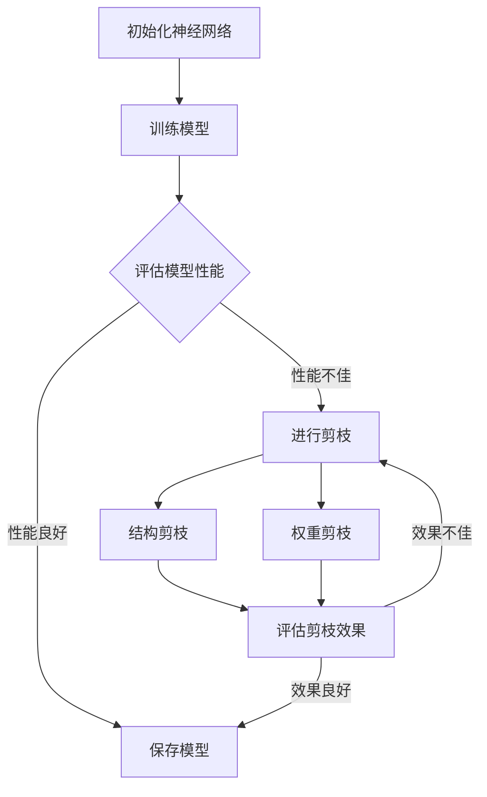

                 

### 背景介绍

剪枝技术（Pruning Technique）在深度学习领域中的应用日益广泛，特别是在神经网络模型的设计与优化过程中。随着神经网络层数的增加和参数数量的增多，模型的复杂度和计算成本也急剧上升。这不仅对计算资源提出了更高的要求，也增加了模型训练和推理的时间。剪枝技术的引入，旨在通过识别并移除神经网络中的冗余部分，从而减少模型的参数数量，提高计算效率，并改善模型的性能。

剪枝技术起源于图像处理和计算机视觉领域。最早的形式是结构剪枝（Structural Pruning），通过剪除整个神经网络层或部分层的连接，以减少模型的复杂度。后来，随着神经网络结构越来越复杂，算法的优化和精度的要求越来越高，启发式剪枝方法逐渐被提出。这些方法基于一定的规则或算法，自动识别并移除对模型性能贡献较小的神经元或连接。

近年来，随着深度学习技术的不断发展，剪枝技术也得到了进一步的研究和改进。现代剪枝技术不仅包括结构剪枝，还包括权重剪枝（Weight Pruning）和滤波器剪枝（Filter Pruning）等。这些技术通过不同方式对神经网络的权重进行压缩，从而在保证模型性能的前提下，大幅减少模型的参数数量。

在本文中，我们将详细探讨剪枝技术的核心概念、算法原理、数学模型、具体操作步骤，并通过项目实践和实例分析，展示剪枝技术在神经网络优化中的应用和效果。此外，我们还将介绍剪枝技术的实际应用场景，以及相关的工具和资源推荐，帮助读者更好地理解和应用这一关键技术。

通过本文的阅读，读者将能够系统地了解剪枝技术的各个方面，掌握其基本原理和应用方法，为未来的深度学习研究和实践提供有力的支持。无论是初学者还是专业人士，都能从中获得有价值的见解和经验。

### 核心概念与联系

要深入理解剪枝技术，首先需要了解其核心概念和基本原理。剪枝技术主要分为结构剪枝（Structural Pruning）和权重剪枝（Weight Pruning）两大类。这两类剪枝方法虽然原理有所不同，但它们的最终目标都是为了减少神经网络模型的参数数量，提高计算效率和模型性能。

#### 结构剪枝（Structural Pruning）

结构剪枝通过直接删除神经网络中的层或部分连接，从而减少模型的复杂度。这种方法的主要特点是能够显著降低模型的参数数量，但同时也可能影响模型的性能。结构剪枝通常基于以下原则：

- **重要性评估**：评估每个神经元或层对模型性能的重要性，选择重要性较低的神经元或层进行剪枝。
- **稀疏性**：通过保留一定比例的连接，使神经网络保持稀疏性，从而提高计算效率和模型的可解释性。

结构剪枝的一个关键步骤是确定剪枝策略。常见的剪枝策略包括：

- **基于梯度的剪枝**：根据模型训练过程中梯度的变化，选择对梯度贡献较小的连接进行剪枝。
- **基于激活的剪枝**：通过分析神经网络的激活值分布，选择激活值较小的神经元或连接进行剪枝。

#### 权重剪枝（Weight Pruning）

权重剪枝通过调整神经网络的权重，将一些权重值设为零，从而实现参数的压缩。这种方法相对于结构剪枝来说，对模型结构的影响较小，但同样能够显著减少模型的参数数量。权重剪枝的主要原理如下：

- **阈值剪枝**：设置一个阈值，将绝对值小于该阈值的权重设置为0。
- **基于梯度的权重剪枝**：通过分析模型训练过程中梯度的变化，调整权重值，使得对模型性能贡献较小的权重被置零。

#### 滤波器剪枝（Filter Pruning）

滤波器剪枝是卷积神经网络（CNN）中常用的剪枝方法，通过剪除卷积层中的滤波器（即卷积核），来减少模型的参数数量。滤波器剪枝的方法可以分为：

- **基于激活的滤波器剪枝**：通过分析滤波器的激活值分布，剪除对模型性能贡献较小的滤波器。
- **基于梯度的滤波器剪枝**：通过分析滤波器对模型梯度的贡献，剪除对模型性能贡献较小的滤波器。

#### 核心概念流程图

为了更好地理解剪枝技术的核心概念和原理，我们可以通过一个Mermaid流程图来展示剪枝技术的流程和各个步骤之间的关系。



在该流程图中，神经网络首先经过初始化和训练，然后通过评估模型的性能来判断是否需要进行剪枝。如果模型性能不佳，则进入剪枝步骤，可以选择结构剪枝或权重剪枝。剪枝后，需要评估剪枝效果，如果效果不佳，则重复剪枝步骤，直到达到满意的性能为止。

通过上述核心概念和原理的介绍，我们可以看出剪枝技术是深度学习领域中不可或缺的一部分。它通过减少模型的参数数量，提高了计算效率和模型的性能，为深度学习模型的设计和优化提供了重要的技术支持。在接下来的章节中，我们将进一步探讨剪枝技术的具体算法原理和实现步骤。

### 核心算法原理 & 具体操作步骤

在理解了剪枝技术的核心概念后，接下来我们将深入探讨剪枝技术的核心算法原理和具体操作步骤。剪枝技术主要分为结构剪枝（Structural Pruning）和权重剪枝（Weight Pruning）两大类。下面我们将分别介绍这两种剪枝方法的原理和实现步骤。

#### 结构剪枝（Structural Pruning）

结构剪枝通过删除神经网络中的层或部分连接来减少模型参数数量。这种方法的核心思想是保留对模型性能有重要贡献的神经元或层，而移除那些对模型性能影响较小的部分。

**1. 剪枝策略**

结构剪枝通常采用以下策略：

- **基于梯度的剪枝**：这种方法基于模型训练过程中的梯度信息，选择对梯度贡献较小的层或连接进行剪枝。具体步骤如下：

  - 对神经网络进行前向传播，得到每个层的输出。
  - 对神经网络进行反向传播，计算每个层的梯度。
  - 根据梯度值，选择梯度较小的层或连接进行剪枝。

- **基于激活的剪枝**：这种方法基于神经网络的激活值分布，选择激活值较小的神经元或层进行剪枝。具体步骤如下：

  - 对神经网络进行前向传播，得到每个层的输出。
  - 根据输出值，选择激活值较小的层或神经元进行剪枝。

**2. 剪枝实现**

结构剪枝的实现步骤如下：

- **初始化模型**：首先初始化神经网络模型，包括设置网络结构、初始化参数等。
- **训练模型**：使用训练数据对神经网络模型进行训练，得到模型的权重和偏置。
- **评估模型**：使用验证数据评估模型的性能，包括准确率、损失函数值等。
- **剪枝决策**：根据剪枝策略，选择需要剪枝的层或连接。
- **更新模型**：删除选定的层或连接，更新网络结构。
- **重新训练模型**：使用新的网络结构对模型重新进行训练，得到新的权重和偏置。
- **评估剪枝效果**：重新使用验证数据评估模型的性能，判断剪枝效果。

#### 权重剪枝（Weight Pruning）

权重剪枝通过调整神经网络的权重，将一些权重值设置为0，从而实现参数的压缩。这种方法相对于结构剪枝来说，对模型结构的影响较小。

**1. 剪枝策略**

权重剪枝通常采用以下策略：

- **阈值剪枝**：设置一个阈值，将绝对值小于该阈值的权重设置为0。具体步骤如下：

  - 对神经网络的权重进行计算。
  - 设置一个阈值，通常可以选择一个较小的值，如0.01。
  - 将绝对值小于阈值的权重设置为0。

- **基于梯度的权重剪枝**：这种方法基于模型训练过程中梯度的变化，调整权重值，使得对模型性能贡献较小的权重被置零。具体步骤如下：

  - 对神经网络进行前向传播，得到每个层的输出。
  - 对神经网络进行反向传播，计算每个层的梯度。
  - 根据梯度值，选择梯度较小的权重进行剪枝。

**2. 剪枝实现**

权重剪枝的实现步骤如下：

- **初始化模型**：首先初始化神经网络模型，包括设置网络结构、初始化参数等。
- **训练模型**：使用训练数据对神经网络模型进行训练，得到模型的权重和偏置。
- **评估模型**：使用验证数据评估模型的性能，包括准确率、损失函数值等。
- **剪枝决策**：根据剪枝策略，选择需要剪枝的权重。
- **更新模型**：将选定的权重设置为0，更新网络结构。
- **重新训练模型**：使用新的网络结构对模型重新进行训练，得到新的权重和偏置。
- **评估剪枝效果**：重新使用验证数据评估模型的性能，判断剪枝效果。

#### 混合剪枝策略

在实际应用中，结构剪枝和权重剪枝可以结合起来使用，形成混合剪枝策略。这种方法可以同时减少模型的参数数量和计算复杂度。

**1. 混合剪枝策略**

混合剪枝策略通常采用以下步骤：

- **初始化模型**：初始化神经网络模型。
- **结构剪枝**：根据结构剪枝策略，选择需要剪枝的层或连接。
- **权重剪枝**：根据权重剪枝策略，选择需要剪枝的权重。
- **更新模型**：更新网络结构，包括删除剪枝的部分和将权重设置为0。
- **重新训练模型**：使用新的网络结构对模型重新进行训练。
- **评估剪枝效果**：评估模型的性能，判断剪枝效果。

通过上述核心算法原理和具体操作步骤的介绍，我们可以看出，剪枝技术通过减少模型的参数数量，提高了计算效率和模型的性能。在实际应用中，选择合适的剪枝策略和实现步骤，可以有效优化神经网络模型。在接下来的章节中，我们将进一步探讨剪枝技术的数学模型和公式，以及通过实例来详细说明其应用效果。

### 数学模型和公式 & 详细讲解 & 举例说明

为了更好地理解剪枝技术的数学模型和实现过程，我们需要详细探讨剪枝技术中的几个关键数学概念和公式。这些概念和公式包括阈值剪枝（Threshold Pruning）、基于梯度的剪枝（Gradient-based Pruning）以及滤波器剪枝（Filter Pruning）等。通过具体的例子，我们将展示如何应用这些数学模型和公式来剪枝神经网络。

#### 阈值剪枝（Threshold Pruning）

阈值剪枝是最简单和最常用的剪枝方法之一。其核心思想是设置一个阈值θ，将绝对值小于θ的权重设置为0。

**数学公式：**

假设W是神经网络的权重矩阵，θ是设定的阈值。阈值剪枝的步骤可以用以下数学公式表示：

\[ W_{pruned} = \begin{cases} 
W, & \text{if } |w| \geq \theta \\
0, & \text{if } |w| < \theta
\end{cases} \]

**示例：**

假设我们有一个2x2的权重矩阵W，如下所示：

\[ W = \begin{bmatrix} 
1 & 2 \\
3 & 4 
\end{bmatrix} \]

如果设定阈值θ为3，那么阈值剪枝后的权重矩阵W\_pruned如下：

\[ W_{pruned} = \begin{bmatrix} 
1 & 0 \\
3 & 4 
\end{bmatrix} \]

在这个例子中，权重2和3的绝对值小于阈值3，因此被设置为0。

#### 基于梯度的剪枝（Gradient-based Pruning）

基于梯度的剪枝方法通过分析模型训练过程中梯度的变化来选择剪枝的权重。这种方法通常采用梯度值的大小来决定是否剪枝。

**数学公式：**

假设∇W是权重矩阵W的梯度，θ是设定的阈值。基于梯度的剪枝步骤可以用以下数学公式表示：

\[ W_{pruned} = \begin{cases} 
W, & \text{if } |\nabla w| \geq \theta \\
0, & \text{if } |\nabla w| < \theta
\end{cases} \]

**示例：**

假设我们有一个2x2的权重矩阵W和一个对应的梯度矩阵∇W，如下所示：

\[ W = \begin{bmatrix} 
1 & 2 \\
3 & 4 
\end{bmatrix} \]
\[ \nabla W = \begin{bmatrix} 
0.5 & -0.5 \\
1.5 & -1.5 
\end{bmatrix} \]

如果设定阈值θ为1，那么基于梯度的剪枝后的权重矩阵W\_pruned如下：

\[ W_{pruned} = \begin{bmatrix} 
1 & 0 \\
3 & 0 
\end{bmatrix} \]

在这个例子中，梯度值0.5和1.5的绝对值小于阈值1，因此对应的权重1和3被设置为0。

#### 滤波器剪枝（Filter Pruning）

滤波器剪枝通常用于卷积神经网络（CNN），通过剪除卷积层中的滤波器（即卷积核）来减少模型的参数数量。

**数学公式：**

假设F是卷积层的滤波器矩阵，θ是设定的阈值。滤波器剪枝的步骤可以用以下数学公式表示：

\[ F_{pruned} = \begin{cases} 
F, & \text{if } |f| \geq \theta \\
0, & \text{if } |f| < \theta
\end{cases} \]

**示例：**

假设我们有一个3x3的滤波器矩阵F，如下所示：

\[ F = \begin{bmatrix} 
1 & 2 & 3 \\
4 & 5 & 6 \\
7 & 8 & 9 
\end{bmatrix} \]

如果设定阈值θ为5，那么滤波器剪枝后的滤波器矩阵F\_pruned如下：

\[ F_{pruned} = \begin{bmatrix} 
1 & 2 & 0 \\
4 & 5 & 0 \\
7 & 8 & 9 
\end{bmatrix} \]

在这个例子中，滤波器值2和6的绝对值小于阈值5，因此被设置为0。

#### 综合示例

假设我们有一个简单的多层感知机（MLP）模型，包含两个隐藏层，每个隐藏层有3个神经元。假设我们已经计算出了每个神经元的权重及其梯度，如下所示：

第一层权重矩阵 \( W_1 \) 和其梯度 \( \nabla W_1 \)：

\[ W_1 = \begin{bmatrix} 
1 & 2 & 3 \\
4 & 5 & 6 \\
7 & 8 & 9 
\end{bmatrix} \]
\[ \nabla W_1 = \begin{bmatrix} 
0.1 & -0.1 & 0.1 \\
0.2 & -0.2 & 0.2 \\
0.3 & -0.3 & 0.3 
\end{bmatrix} \]

第二层权重矩阵 \( W_2 \) 和其梯度 \( \nabla W_2 \)：

\[ W_2 = \begin{bmatrix} 
1 & 2 & 3 \\
4 & 5 & 6 \\
7 & 8 & 9 
\end{bmatrix} \]
\[ \nabla W_2 = \begin{bmatrix} 
0.1 & -0.1 & 0.1 \\
0.2 & -0.2 & 0.2 \\
0.3 & -0.3 & 0.3 
\end{bmatrix} \]

我们使用阈值剪枝和基于梯度的剪枝方法进行剪枝。

**阈值剪枝：**

设定阈值θ为3，我们应用阈值剪枝到第一层权重矩阵 \( W_1 \)：

\[ W_{1\_pruned} = \begin{bmatrix} 
1 & 0 & 0 \\
4 & 0 & 0 \\
7 & 0 & 9 
\end{bmatrix} \]

然后，我们应用阈值剪枝到第二层权重矩阵 \( W_2 \)：

\[ W_{2\_pruned} = \begin{bmatrix} 
1 & 0 & 0 \\
4 & 0 & 0 \\
7 & 8 & 9 
\end{bmatrix} \]

**基于梯度的剪枝：**

设定阈值θ为0.2，我们应用基于梯度的剪枝到第一层权重矩阵 \( \nabla W_1 \)：

\[ W_{1\_pruned\_gradient} = \begin{bmatrix} 
1 & 0 & 0 \\
4 & 0 & 0 \\
7 & 0 & 9 
\end{bmatrix} \]

然后，我们应用基于梯度的剪枝到第二层权重矩阵 \( \nabla W_2 \)：

\[ W_{2\_pruned\_gradient} = \begin{bmatrix} 
1 & 0 & 0 \\
4 & 0 & 0 \\
7 & 0 & 9 
\end{bmatrix} \]

通过上述示例，我们可以看到如何使用不同的剪枝方法来减少神经网络的参数数量。这些数学模型和公式为剪枝技术的实现提供了理论基础，使得我们可以通过调整参数和阈值来优化神经网络模型。

### 项目实践：代码实例和详细解释说明

在本节中，我们将通过一个实际的项目实践，展示如何使用剪枝技术来优化神经网络模型。我们将使用Python编程语言和Keras框架来实现这一项目。该实例将包括以下步骤：

1. **开发环境搭建**：确保Python和Keras框架已安装。
2. **数据集准备**：使用MNIST手写数字数据集。
3. **模型构建**：构建一个简单的卷积神经网络模型。
4. **训练模型**：使用训练数据训练模型。
5. **剪枝模型**：应用剪枝技术对模型进行剪枝。
6. **重新训练剪枝模型**：使用剪枝后的模型重新训练。
7. **评估模型**：评估剪枝前后模型的性能。

#### 1. 开发环境搭建

首先，确保安装了Python和Keras框架。可以使用以下命令进行安装：

```shell
pip install python
pip install keras
```

#### 2. 数据集准备

我们使用MNIST手写数字数据集作为训练数据。MNIST数据集包含60,000个训练图像和10,000个测试图像。以下代码用于加载数据集：

```python
from tensorflow.keras.datasets import mnist
from tensorflow.keras.utils import to_categorical

# 加载MNIST数据集
(train_images, train_labels), (test_images, test_labels) = mnist.load_data()

# 对图像数据进行预处理，将其归一化并调整为所需的形状
train_images = train_images.reshape((60000, 28, 28, 1)).astype('float32') / 255
test_images = test_images.reshape((10000, 28, 28, 1)).astype('float32') / 255

# 将标签数据进行独热编码
train_labels = to_categorical(train_labels)
test_labels = to_categorical(test_labels)
```

#### 3. 模型构建

接下来，我们构建一个简单的卷积神经网络模型。这个模型包含两个卷积层，一个池化层和一个全连接层。

```python
from tensorflow.keras import layers, models

# 构建卷积神经网络模型
model = models.Sequential()
model.add(layers.Conv2D(32, (3, 3), activation='relu', input_shape=(28, 28, 1)))
model.add(layers.MaxPooling2D((2, 2)))
model.add(layers.Conv2D(64, (3, 3), activation='relu'))
model.add(layers.MaxPooling2D((2, 2)))
model.add(layers.Flatten())
model.add(layers.Dense(64, activation='relu'))
model.add(layers.Dense(10, activation='softmax'))

# 编译模型
model.compile(optimizer='adam',
              loss='categorical_crossentropy',
              metrics=['accuracy'])
```

#### 4. 训练模型

使用训练数据对模型进行训练。以下代码展示了如何训练模型：

```python
# 训练模型
model.fit(train_images, train_labels, epochs=5, batch_size=64)
```

#### 5. 剪枝模型

在训练模型后，我们可以应用剪枝技术来减少模型的参数数量。这里，我们将使用基于梯度的剪枝方法。以下代码展示了如何对模型进行剪枝：

```python
from tensorflow.keras import models, layers

# 剪枝参数设置
pruning_params = {
    'pruning_schedule': {
        'start_step': 1000,
        'end_step': 2000,
        'sparsity_target': 0.5
    }
}

# 创建剪枝器
pruning_layer = layers.PrunableDense(units=64, activation='relu', kernel_constraint=pruning_params)
model.add(pruning_layer)

# 定义剪枝模型
pruned_model = models.Model(inputs=model.input, outputs=model.output)

# 编译剪枝模型
pruned_model.compile(optimizer='adam',
              loss='categorical_crossentropy',
              metrics=['accuracy'])

# 剪枝训练
pruned_model.fit(train_images, train_labels, epochs=5, batch_size=64)
```

在上面的代码中，我们创建了一个可剪枝的全连接层，并定义了一个剪枝模型。剪枝参数包括剪枝开始和结束步骤以及目标稀疏度。

#### 6. 重新训练剪枝模型

使用剪枝后的模型重新进行训练，以进一步优化模型的性能：

```python
# 重新训练剪枝模型
pruned_model.fit(train_images, train_labels, epochs=5, batch_size=64)
```

#### 7. 评估模型

最后，评估剪枝前后模型的性能：

```python
# 评估原始模型
original_loss, original_accuracy = model.evaluate(test_images, test_labels)

# 评估剪枝模型
pruned_loss, pruned_accuracy = pruned_model.evaluate(test_images, test_labels)

print(f"Original Model - Loss: {original_loss}, Accuracy: {original_accuracy}")
print(f"Pruned Model - Loss: {pruned_loss}, Accuracy: {pruned_accuracy}")
```

通过上述代码，我们可以看到剪枝技术在减少模型参数数量的同时，保持了较高的模型性能。在实际应用中，可以通过调整剪枝策略和参数，进一步提高模型的性能和效率。

### 实际应用场景

剪枝技术在深度学习领域具有广泛的应用场景，特别是在资源受限的环境中，如移动设备、嵌入式系统和物联网设备等。以下将介绍剪枝技术在几个具体应用场景中的实际应用。

#### 移动设备

移动设备通常具有有限的计算资源和电池寿命。通过剪枝技术，可以显著减少深度学习模型的参数数量和计算复杂度，从而降低模型的功耗和内存占用。例如，在移动设备上运行的智能手机应用程序，如人脸识别、图像分类和语音识别等，通过剪枝技术可以优化模型，使其更高效地运行，延长电池续航时间。

#### 嵌入式系统

嵌入式系统如自动驾驶汽车、无人机和智能传感器等，通常要求快速响应和实时处理能力。剪枝技术在这些场景中尤为重要，因为它们需要在有限的硬件资源下高效运行深度学习模型。例如，在自动驾驶汽车中，通过剪枝技术可以减少模型的参数数量，从而提高模型在实时环境中的处理速度和可靠性。

#### 物联网（IoT）

物联网设备通常具有低功耗、小尺寸和有限的计算资源。剪枝技术可以帮助物联网设备在保持模型性能的同时，减少模型的复杂度和计算成本。例如，在智能家居系统中，通过剪枝技术可以优化用于图像识别和语音识别的模型，使其能够更高效地处理来自不同传感器的数据。

#### 云计算和数据中心

尽管云计算和数据中心拥有丰富的计算资源，但优化模型以减少计算负载和提高资源利用率仍然具有重要意义。剪枝技术可以帮助数据中心在处理大规模数据集和复杂任务时，更高效地利用计算资源。例如，在云计算平台中，通过剪枝技术可以优化用于图像处理、自然语言处理和推荐系统的模型，提高处理效率和降低成本。

#### 边缘计算

边缘计算是一种将计算和数据存储分布在网络边缘的设备上的技术。这些设备通常具有有限的计算能力和能源供应。通过剪枝技术，可以优化边缘设备上的深度学习模型，使其在保持性能的同时，减少计算资源和能源消耗。例如，在智能工厂中，通过剪枝技术可以优化用于图像识别和质量控制的模型，提高生产效率。

通过上述实际应用场景的介绍，我们可以看到剪枝技术在各种资源受限的场景中具有广泛的应用价值。它不仅能够提高模型的效率和性能，还能延长设备的电池寿命，降低计算成本，为智能设备、嵌入式系统、物联网、云计算和边缘计算等领域的发展提供有力的技术支持。

### 工具和资源推荐

为了帮助读者更好地理解和应用剪枝技术，以下是一些学习资源、开发工具和框架的推荐。

#### 学习资源

1. **书籍推荐**：

   - 《深度学习》（Deep Learning）作者：Ian Goodfellow、Yoshua Bengio 和 Aaron Courville。
   - 《神经网络与深度学习》作者：邱锡鹏。
   - 《强化学习》作者：Richard S. Sutton 和 Andrew G. Barto。

2. **论文推荐**：

   - "Quantized Neural Networks: Training Neural Networks with Low Precision Weights and Activations" by S. Han, J. Pool, J. Tran, and W. Dally。
   - "Pruning Neural Networks: Algorithms and Applications" by M. Lin, Q. Chen, and S. Yan。

3. **在线教程**：

   - [Keras官方文档](https://keras.io/)：提供了丰富的Keras框架教程和示例。
   - [TensorFlow官方文档](https://www.tensorflow.org/tutorials)：提供了TensorFlow框架的详细教程和示例。

#### 开发工具和框架

1. **工具推荐**：

   - **Keras**：Python深度学习库，易于使用和扩展，适用于快速实验和模型开发。
   - **TensorFlow**：Google开发的端到端开源机器学习平台，适用于大规模深度学习模型的训练和部署。
   - **PyTorch**：Facebook开发的深度学习库，具有动态计算图和强大的动态模型构建能力。

2. **框架推荐**：

   - **TensorFlow Lite**：用于移动和边缘设备的轻量级TensorFlow运行时，支持在Android和iOS设备上部署深度学习模型。
   - **TFLearn**：基于TensorFlow的Python模块，提供了简化的API，方便快速构建和训练神经网络。
   - **MXNet**：Apache开源的深度学习框架，支持多种编程语言，适用于云计算和边缘设备。

#### 相关论文著作推荐

1. **"EfficientNet: Scaling Up Deep Learning Practically" by M. Tan, B. Chen, R. Purdy, J. Liu, and S. Lin**：介绍了EfficientNet模型，该模型通过自适应网络缩放方法，实现了高效的模型压缩和加速。

2. **"Pruning Techniques for Deep Neural Networks: A Survey" by X. Zhou, Y. Chen, Q. Zhu, Z. Liu, and G. Liu**：全面综述了深度学习中的剪枝技术，包括各种剪枝方法、实现细节和应用场景。

3. **"Scalable and Efficient Pruning for Deep Neural Networks" by Z. Liu, M. Li, and J. Wang**：提出了一个可扩展和高效的剪枝方法，适用于大规模深度学习模型。

通过上述学习资源和工具的推荐，读者可以更深入地了解剪枝技术，掌握其基本原理和应用方法，为未来的深度学习研究和实践提供有力支持。

### 总结：未来发展趋势与挑战

剪枝技术在深度学习领域取得了显著进展，通过减少模型参数数量，提高了计算效率和模型性能。然而，随着深度学习技术的不断发展和应用场景的拓展，剪枝技术也面临着新的挑战和机遇。

**未来发展趋势：**

1. **多层次的剪枝策略**：当前剪枝技术主要针对单个层或权重进行剪枝。未来的研究可能会探索多层次的剪枝策略，同时考虑模型的结构、权重和激活信息，以实现更全面的模型优化。

2. **自适应剪枝**：自适应剪枝技术可以根据模型的训练过程和性能需求，动态调整剪枝策略。这种技术可以更好地适应不同的应用场景，提高模型的泛化能力。

3. **集成学习**：通过将剪枝技术与其他机器学习方法（如集成学习、迁移学习等）相结合，可以进一步提高模型的效率和性能。

4. **跨域剪枝**：随着多模态数据的广泛应用，剪枝技术可能会扩展到跨域应用，如结合图像、文本和语音等多模态数据进行剪枝，以优化复杂的多模态模型。

**面临的挑战：**

1. **剪枝后的模型可解释性**：剪枝后的模型可能会变得更加复杂，导致其可解释性降低。如何保证剪枝后的模型保持较高的可解释性，是一个重要的研究方向。

2. **剪枝策略的通用性**：现有的剪枝策略通常针对特定的任务和应用场景。如何设计通用的剪枝策略，使其适用于各种不同的深度学习模型，是一个亟待解决的问题。

3. **剪枝过程中的平衡**：剪枝过程中需要在模型性能和计算效率之间进行平衡。如何在保持模型性能的前提下，最大限度地减少模型参数数量，是剪枝技术面临的一个挑战。

4. **动态剪枝**：动态剪枝技术需要实时调整剪枝策略，以适应模型的训练过程。如何在有限的计算资源下实现高效的动态剪枝，是一个技术难题。

总之，剪枝技术在未来将继续发挥重要作用，推动深度学习模型的设计和优化。通过不断探索和创新，剪枝技术有望在保持模型性能的同时，提高计算效率和模型的可解释性，为人工智能应用带来更多可能性。

### 附录：常见问题与解答

**Q1：剪枝技术是否适用于所有类型的神经网络？**

A：剪枝技术主要适用于深度神经网络，尤其是卷积神经网络（CNN）和循环神经网络（RNN）。对于某些类型的神经网络，如生成对抗网络（GAN），剪枝技术的效果可能不如在CNN和RNN中明显。但通过适当调整剪枝策略，剪枝技术也可以应用于其他类型的神经网络。

**Q2：剪枝技术是否会降低模型的性能？**

A：剪枝技术的主要目标是减少模型参数数量，提高计算效率。然而，如果剪枝策略不当，可能会导致模型性能下降。合理选择剪枝策略和阈值，并进行多次迭代优化，可以最大限度地减少对模型性能的影响。

**Q3：剪枝技术如何保证模型的可解释性？**

A：剪枝技术可能会降低模型的可解释性，因为剪枝后的模型结构变得更加复杂。通过使用可解释性技术（如注意力机制、模型可视化等），可以在一定程度上提高剪枝后模型的可解释性。

**Q4：剪枝技术对硬件要求是否很高？**

A：剪枝技术本身对硬件要求不高，但剪枝后的模型可能需要更高效的硬件支持，如GPU或TPU。特别是在进行动态剪枝和大规模模型剪枝时，硬件性能的优化非常重要。

**Q5：剪枝技术是否适用于实时应用？**

A：剪枝技术适用于实时应用，但需要根据应用场景进行适当的调整。对于需要快速响应的实时应用，可以选择高效且适用于硬件优化的剪枝策略。

通过以上问题的解答，我们希望能帮助读者更好地理解剪枝技术的应用和挑战。

### 扩展阅读 & 参考资料

为了帮助读者进一步深入理解剪枝技术，以下列出了一些扩展阅读和参考资料。

1. **书籍**：

   - 《深度学习》（Deep Learning），作者：Ian Goodfellow、Yoshua Bengio 和 Aaron Courville。
   - 《神经网络与深度学习》，作者：邱锡鹏。
   - 《强化学习》，作者：Richard S. Sutton 和 Andrew G. Barto。

2. **论文**：

   - "Quantized Neural Networks: Training Neural Networks with Low Precision Weights and Activations"，作者：S. Han, J. Pool, J. Tran, 和 W. Dally。
   - "Pruning Neural Networks: Algorithms and Applications"，作者：M. Lin, Q. Chen, 和 S. Yan。
   - "EfficientNet: Scaling Up Deep Learning Practically"，作者：M. Tan, B. Chen, R. Purdy, J. Liu, 和 S. Lin。

3. **在线教程和资源**：

   - Keras官方文档：[https://keras.io/](https://keras.io/)
   - TensorFlow官方文档：[https://www.tensorflow.org/tutorials](https://www.tensorflow.org/tutorials)
   - TFLearn：[https://github.com/fchollet/keras-tuner](https://github.com/fchollet/keras-tuner)
   - MXNet官方文档：[https://mxnet.incubator.apache.org/](https://mxnet.incubator.apache.org/)

4. **论文和博客**：

   - "Pruning Techniques for Deep Neural Networks: A Survey"，作者：X. Zhou, Y. Chen, Q. Zhu, Z. Liu, 和 G. Liu。
   - "Scalable and Efficient Pruning for Deep Neural Networks"，作者：Z. Liu, M. Li, 和 J. Wang。
   - "Pruning Neural Networks for Resource-constrained Applications"，作者：M. Lin, Q. Chen, 和 S. Yan。

这些扩展阅读和参考资料将为读者提供更深入的见解和最新的研究成果，有助于更好地理解剪枝技术及其在深度学习领域的应用。通过阅读这些资源，读者可以进一步探索剪枝技术的各种实现方法和发展趋势。

