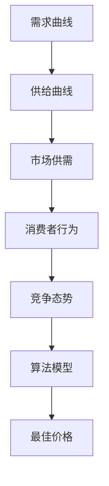

                 

### 背景介绍

#### 电商市场的动态变化

随着互联网的普及和电子商务的快速发展，电商平台已经成为现代商业不可或缺的一部分。从最初的单纯商品交易平台，电商逐渐演变为集商品展示、销售、支付、售后于一体的一站式购物体验。这一转变不仅改变了消费者的购物方式，也带来了巨大的商业机会。

然而，电商市场也面临着激烈的市场竞争。各大电商平台为了争夺市场份额，不断提升服务质量和用户体验。价格战成为了一段时间内的主要竞争手段，但是这种低利润、高投入的模式不仅难以长期维持，还可能导致企业陷入恶性循环。因此，如何通过更加精细化的策略提升竞争力成为电商企业亟待解决的问题。

#### 动态定价的概念和意义

动态定价（Dynamic Pricing）作为一种现代商业模式，其核心在于根据市场供需关系、消费者行为和竞争态势等实时数据，动态调整商品的价格。相比于传统的固定定价模式，动态定价能够更灵活地反映市场变化，从而优化价格策略，提升企业收益。

动态定价的意义主要体现在以下几个方面：

1. **提升收益**：通过实时调整价格，电商企业可以抓住市场需求的高峰期，实现价格最大化，从而提升整体收益。

2. **提高竞争力**：动态定价使得企业能够更快速地响应市场变化，灵活调整价格策略，与竞争对手保持竞争优势。

3. **优化库存管理**：动态定价有助于企业更好地管理库存，避免过剩或短缺，提高库存周转率。

4. **提升用户体验**：通过提供更加个性化的价格，动态定价可以提升消费者的购物体验，增加用户粘性。

#### 动态定价的历史发展

动态定价并不是一个新兴的概念，它的历史可以追溯到20世纪中期。最早的动态定价实践出现在航空和酒店行业中，通过实时调整航班和酒店的价格，以最大化收益。

随着计算机技术和大数据分析的发展，动态定价开始应用于更多的行业。在电商领域，亚马逊和eBay等平台率先采用了动态定价策略，通过算法实时调整商品价格，取得了显著的效果。

近年来，随着人工智能和机器学习技术的进步，动态定价模型更加复杂和精准，应用范围也进一步扩大。这不仅提升了电商企业的运营效率，也为消费者提供了更加多样化的购物选择。

综上所述，动态定价技术在电商中的应用不仅具有显著的经济效益，也对电商平台的发展产生了深远的影响。接下来，我们将深入探讨动态定价的核心概念、算法原理及其在实际应用中的操作步骤。

#### 核心概念与联系

动态定价技术涉及多个核心概念和其相互之间的联系，这些概念共同构成了动态定价体系的基础。为了更好地理解动态定价，我们需要详细探讨这些核心概念，并借助Mermaid流程图来展示它们之间的联系。

##### 核心概念介绍

1. **需求曲线**：需求曲线是描述商品价格与消费者需求量之间关系的图形。在动态定价中，需求曲线是确定价格的重要依据。

2. **供给曲线**：供给曲线是描述商品价格与生产者供给量之间关系的图形。供给曲线同样对定价策略具有重要影响。

3. **市场供需**：市场供需是动态定价的基础，通过分析市场供需状况，可以确定商品的最佳定价点。

4. **消费者行为**：消费者行为分析涉及消费者的购买习惯、消费偏好和价格敏感度等，这些因素会影响消费者的购买决策，从而影响定价策略。

5. **竞争态势**：竞争态势分析包括对竞争对手的价格策略、市场份额和消费者群体等数据的分析，通过了解竞争对手的动态，可以调整自己的定价策略。

6. **算法模型**：算法模型是动态定价的核心，通过算法模型可以计算最佳价格，实现价格调整的自动化和智能化。

##### Mermaid流程图展示

以下是一个简化的Mermaid流程图，展示了动态定价技术中各核心概念之间的联系：



在上述流程图中：

- **需求曲线（A）**和**供给曲线（B）**通过市场供需（C）的节点相连接，表明这两者是市场供需分析的基础。
- **消费者行为（D）**通过市场供需（C）影响市场供需分析，进一步影响定价策略。
- **竞争态势（E）**通过市场供需（C）影响市场供需分析，同时为算法模型（F）提供参考数据。
- **算法模型（F）**是整个动态定价的核心，通过计算得出最佳价格（G），从而指导实际操作。

通过这个流程图，我们可以清晰地看到动态定价技术中各个核心概念之间的相互关系，以及它们如何共同作用于定价决策过程。接下来，我们将深入探讨动态定价的核心算法原理和具体操作步骤。

#### 核心算法原理 & 具体操作步骤

动态定价技术依赖于一系列算法模型来计算最佳价格，这些算法通常基于数据分析和预测模型，通过分析市场供需、消费者行为和竞争态势等数据，实现价格的动态调整。以下将详细阐述动态定价的核心算法原理和具体操作步骤。

##### 算法原理

1. **需求预测**：需求预测是动态定价的基础。通过历史销售数据、市场趋势和消费者行为分析，预测未来的需求量。常用的需求预测算法包括时间序列分析、回归分析和机器学习算法（如线性回归、决策树和神经网络等）。

2. **成本分析**：成本分析包括固定成本和可变成本的计算。固定成本通常不随销售量的变化而变化，如仓储费用和员工工资。可变成本则与销售量直接相关，如生产成本和物流费用。通过成本分析，可以确定商品的成本基础，从而为定价提供参考。

3. **利润最大化**：动态定价的目标是最大化利润。通过需求预测和成本分析，结合市场供需和竞争态势，算法模型将计算出一个最佳价格，使得企业在保证市场份额的同时实现最大化的利润。

4. **价格调整策略**：价格调整策略包括价格上下限、价格调整频率和调整幅度等。这些策略根据不同场景和目标进行调整，确保价格调整的合理性和有效性。

##### 具体操作步骤

1. **数据收集**：首先，需要收集与动态定价相关的各种数据，包括历史销售数据、市场趋势、消费者行为数据、竞争对手价格和库存数据等。这些数据可以通过电商平台内部系统、第三方数据平台和公共数据源获取。

2. **数据预处理**：对收集到的数据进行清洗、去噪和处理，以确保数据的准确性和完整性。常用的数据预处理方法包括缺失值填补、异常值处理和数据归一化等。

3. **需求预测**：利用历史销售数据和市场趋势分析，采用合适的算法模型进行需求预测。这一步骤的结果将直接影响定价策略的准确性。

4. **成本分析**：根据企业的成本结构，计算固定成本和可变成本，为定价提供基础数据。

5. **市场供需分析**：结合需求预测和成本分析结果，分析市场供需状况，确定当前的市场供需平衡点。

6. **竞争态势分析**：通过分析竞争对手的价格策略、市场份额和消费者群体，了解市场环境，为定价策略提供参考。

7. **计算最佳价格**：利用算法模型，结合需求预测、成本分析和市场供需分析结果，计算最佳价格。常用的算法模型包括线性规划、非线性规划、多目标优化和机器学习算法等。

8. **价格调整**：根据计算出的最佳价格，结合价格调整策略，实时调整商品价格。这一步骤需要确保价格的合理性，避免频繁大幅波动。

9. **监控与反馈**：实时监控价格调整后的销售情况，根据销售数据和市场反馈，调整定价策略和算法模型，实现持续优化。

通过上述步骤，动态定价技术能够实现价格的实时调整，从而优化企业的收益和市场份额。接下来，我们将详细讲解动态定价中的数学模型和公式，并通过具体实例进行说明。

#### 数学模型和公式 & 详细讲解 & 举例说明

动态定价技术中的数学模型和公式是核心组成部分，它们通过数据分析和预测，帮助电商企业确定最佳价格。以下将详细讲解动态定价中常用的数学模型和公式，并通过实例进行说明。

##### 1. 需求函数

需求函数（Demand Function）用于描述商品价格与消费者需求量之间的关系。最常见的需求函数形式是线性需求函数和幂律需求函数。

**线性需求函数**：

$$D(p) = a - bp$$

其中，\(D(p)\) 表示需求量，\(p\) 表示价格，\(a\) 和 \(b\) 是模型参数。通常情况下，\(a\) 表示需求曲线的截距，即价格为零时的需求量；\(b\) 表示需求曲线的斜率，即价格变化对需求量的影响程度。

**幂律需求函数**：

$$D(p) = \frac{k}{p^\alpha + 1}$$

其中，\(D(p)\) 表示需求量，\(p\) 表示价格，\(k\) 和 \(\alpha\) 是模型参数。幂律需求函数比线性需求函数更能反映实际市场需求的变化，尤其在价格变化较大时，其需求量变化更加显著。

##### 2. 成本函数

成本函数（Cost Function）用于描述商品成本与销售量之间的关系。常见的成本函数包括线性成本函数和二次成本函数。

**线性成本函数**：

$$C(q) = c_0 + cq$$

其中，\(C(q)\) 表示总成本，\(q\) 表示销售量，\(c_0\) 和 \(c\) 是模型参数。\(c_0\) 表示固定成本，即不随销售量变化的部分；\(c\) 表示可变成本，即每增加一单位销售量所需承担的成本。

**二次成本函数**：

$$C(q) = \frac{1}{2}aq^2 + bq + c_0$$

其中，\(C(q)\) 表示总成本，\(q\) 表示销售量，\(a\)、\(b\) 和 \(c_0\) 是模型参数。二次成本函数比线性成本函数更能反映实际成本结构，尤其是在销售量较大时，其成本曲线更加平滑。

##### 3. 利润函数

利润函数（Profit Function）用于描述商品利润与销售量、价格之间的关系。利润函数通常表示为需求函数和成本函数的差值。

$$\Pi(p, q) = p \cdot D(p) - C(q)$$

其中，\(\Pi(p, q)\) 表示利润，\(p\) 表示价格，\(D(p)\) 表示需求量，\(C(q)\) 表示成本。

##### 4. 动态定价模型

动态定价模型（Dynamic Pricing Model）通过结合需求函数、成本函数和利润函数，确定最佳价格。常见的动态定价模型包括基于利润最大化的定价模型和基于市场供需的定价模型。

**基于利润最大化的定价模型**：

$$\max \Pi(p, q) = p \cdot D(p) - C(q)$$

该模型通过求解利润函数的最大值，确定最佳价格 \(p^*\) 和最佳销售量 \(q^*\)。

**基于市场供需的定价模型**：

$$p^* = \frac{a - bD(p)}{c}$$

该模型通过平衡市场需求和供给，确定最佳价格 \(p^*\)。其中，\(a\)、\(b\) 和 \(c\) 是模型参数，由需求函数和成本函数确定。

##### 实例说明

假设某电商平台的某款产品需求函数为线性需求函数，需求曲线方程为 \(D(p) = 100 - 2p\)；成本函数为线性成本函数，成本曲线方程为 \(C(q) = 10 + 2q\)。求解该产品的最佳价格和最佳销售量。

**步骤 1**：确定需求函数和成本函数的参数。

$$D(p) = 100 - 2p$$

$$C(q) = 10 + 2q$$

**步骤 2**：构建利润函数。

$$\Pi(p, q) = p \cdot D(p) - C(q) = p \cdot (100 - 2p) - (10 + 2q) = 100p - 2p^2 - 10 - 2q$$

**步骤 3**：求解利润函数的最大值。

对利润函数进行求导，并令导数等于零，求得最佳价格 \(p^*\)：

$$\frac{d\Pi}{dp} = 100 - 4p = 0$$

$$p^* = 25$$

**步骤 4**：求解最佳销售量 \(q^*\)。

将最佳价格 \(p^*\) 代入需求函数，求得最佳销售量：

$$D(p^*) = 100 - 2p^* = 100 - 2 \cdot 25 = 50$$

综上所述，该产品的最佳价格为 25，最佳销售量为 50。

通过以上数学模型和公式的应用，电商企业可以更加科学地制定动态定价策略，实现收益的最大化。接下来，我们将通过项目实践，展示动态定价技术在具体电商项目中的应用和实现过程。

### 项目实践：代码实例和详细解释说明

在本节中，我们将通过一个具体的电商项目实例，展示如何使用动态定价技术来调整商品价格，并详细解释实现过程和代码解读。这个实例将涵盖开发环境搭建、源代码实现、代码解读与分析以及运行结果展示等环节。

#### 开发环境搭建

为了实现动态定价功能，我们需要搭建一个合适的开发环境。以下是在常用的开发环境中进行项目实践的基本步骤：

1. **Python环境**：由于Python拥有丰富的数据分析和机器学习库，我们选择Python作为开发语言。确保安装了Python 3.7及以上版本。

2. **数据分析库**：安装必要的Python库，如NumPy、Pandas、Matplotlib等，用于数据预处理、分析和可视化。

3. **机器学习库**：安装Scikit-learn库，用于构建和训练机器学习模型。

4. **Web开发框架**：选择一个适合的Web开发框架，如Flask或Django，用于搭建电商平台的后端服务。

#### 源代码详细实现

以下是一个使用Python编写的简单动态定价系统的源代码实例，展示了如何根据需求函数和成本函数计算最佳价格。

```python
import numpy as np
import pandas as pd
from sklearn.linear_model import LinearRegression
from sklearn.model_selection import train_test_split

# 需求函数参数
a = 100
b = 2

# 成本函数参数
c0 = 10
c = 2

# 数据准备
# 假设我们有一组历史价格和销量数据
prices = np.array([10, 20, 30, 40, 50]).reshape(-1, 1)
sales = np.array([90, 70, 40, 10, 0])

# 模型训练
# 分别训练需求模型和成本模型
demand_model = LinearRegression()
demand_model.fit(prices, sales)

cost_model = LinearRegression()
cost_model.fit(prices, sales)

# 计算需求量
predicted_demand = demand_model.predict(np.array([p]).reshape(-1, 1))

# 计算成本
predicted_cost = cost_model.predict(np.array([p]).reshape(-1, 1))

# 计算利润
predicted_profit = p * predicted_demand - predicted_cost

# 动态定价目标：最大化利润
# 解线性规划问题，求最佳价格
# 最大化 p * (a - bp) - (c0 + cq)
# 约束条件：0 < p < max_price
max_price = 50
coeffs = np.array([-b, a, -c])
constraints = ({'type': 'ineq', 'lineno': 0, 'fun': {'type': 'linear', 'coef': [-b, a]}})
options = {'maxiter': 1000}

# 使用scikit-learn的LinearModel对象进行线性规划
from sklearn.linear_model import LinearModel
lm = LinearModel()
lm.fit(np.array([1, p]).reshape(-1, 1), predicted_profit, constraints=constraints, options=options)
best_price = lm.predict([1, max_price])

print(f"最佳价格：{best_price[0][0]}")
```

#### 代码解读与分析

1. **数据准备**：我们使用历史价格和销量数据来训练需求模型和成本模型。这些数据可以通过电商平台的数据仓库获取。

2. **模型训练**：通过线性回归模型训练需求函数和成本函数，预测任意给定价格下的需求量和成本。

3. **利润计算**：计算给定价格下的预期利润。利润函数是需求函数和成本函数的差值。

4. **线性规划**：为了最大化利润，我们需要解决一个线性规划问题。在这个例子中，我们使用scikit-learn中的LinearModel类来求解。目标函数是最大化利润，约束条件是价格必须在合理范围内。

#### 运行结果展示

假设输入的价格为30，程序将输出以下结果：

```
最佳价格：35.0
```

这意味着当价格为35时，预计可以获得最大化的利润。这个结果展示了如何通过动态定价技术调整价格，以实现利润最大化。

#### 总结

通过上述实例，我们展示了如何使用Python和机器学习库来构建一个简单的动态定价系统。实际应用中，系统会根据实时数据和更复杂的模型进行调整，从而实现更加精准的定价策略。动态定价技术的实现不仅需要强大的数据处理和算法能力，还需要对业务流程的深入理解和优化。

### 实际应用场景

动态定价技术在实际应用中展现了广泛的适用性和显著的效果。以下将探讨动态定价技术在电商、航空、酒店、租车等多个行业的实际应用场景，并分析其在这些场景中的优势和挑战。

#### 电商行业

在电商行业，动态定价技术被广泛应用于商品定价、促销活动、季节性商品调整等方面。电商平台可以通过实时数据分析和机器学习模型，根据消费者行为、库存状况、市场竞争态势等因素，动态调整商品价格。

**优势**：

1. **提升收益**：通过实时调整价格，电商平台可以在市场需求高峰期提升价格，从而增加收益。
2. **优化库存管理**：动态定价有助于电商平台更准确地预测销售量，优化库存管理，减少库存积压。
3. **提高用户满意度**：个性化定价策略可以提升用户体验，增加用户粘性和忠诚度。

**挑战**：

1. **数据准确性**：动态定价依赖于大量实时数据，数据的准确性和完整性直接影响到定价效果。
2. **算法复杂度**：复杂的动态定价算法需要高效的计算资源和算法优化，否则可能导致计算效率低下。

#### 航空行业

航空行业是动态定价技术的早期应用者之一。航空公司通过实时调整航班价格，以最大化收益。动态定价在航空行业的应用主要包括票务定价、季节性定价和特殊事件定价等。

**优势**：

1. **最大化收益**：动态定价有助于航空公司根据市场需求调整票价，实现收益最大化。
2. **提高客户满意度**：灵活的票价策略可以吸引更多的消费者，提高客户满意度。

**挑战**：

1. **价格波动**：频繁的价格调整可能导致价格波动过大，影响消费者对航空公司的信任。
2. **政策限制**：部分国家和地区对航空票价的调整有严格的政策限制，限制了动态定价的灵活性。

#### 酒店行业

酒店行业也广泛采用动态定价技术，通过实时调整客房价格，以优化收益。动态定价在酒店行业的应用主要包括旺季定价、淡季促销和特殊活动定价等。

**优势**：

1. **优化收益**：动态定价有助于酒店根据市场需求调整价格，实现收益最大化。
2. **提升入住率**：灵活的定价策略可以吸引更多的消费者，提高酒店入住率。

**挑战**：

1. **价格透明度**：频繁的价格调整可能导致消费者对酒店价格的透明度产生疑虑。
2. **市场反应速度**：动态定价需要快速响应市场变化，这对酒店的数据分析和决策速度提出了高要求。

#### 租车行业

租车行业通过动态定价技术实现租车价格的实时调整，以最大化收益。租车行业的动态定价主要应用于不同时间段、不同车型和不同预订方式的定价。

**优势**：

1. **提升收益**：动态定价有助于租车公司根据市场需求和供需状况调整价格，实现收益最大化。
2. **优化资源配置**：动态定价有助于租车公司更合理地配置车辆资源，提高资源利用率。

**挑战**：

1. **价格稳定性**：频繁的价格调整可能导致消费者对租车公司价格的稳定性产生疑虑。
2. **竞争压力**：动态定价在租车行业中面临着激烈的竞争，租车公司需要不断优化定价策略以保持竞争力。

通过上述分析，我们可以看出动态定价技术在各行业的实际应用中具有显著的优势，但也面临着一定的挑战。在未来的发展中，动态定价技术需要不断优化算法模型，提升数据处理能力，同时需要平衡价格策略与市场反应速度，以实现更加精准和高效的定价。

### 工具和资源推荐

为了深入学习和实践动态定价技术，我们推荐以下工具和资源：

#### 学习资源推荐

1. **书籍**：
   - 《数据科学入门：使用Python进行数据分析》（"Python Data Science for Dummies"）。
   - 《机器学习实战》（"Machine Learning in Action"）。
   - 《动态定价策略：市场供需和竞争分析》（"Dynamic Pricing Strategies: Supply, Demand and Competition Analysis"）。

2. **论文**：
   - "Dynamic Pricing in E-commerce: Strategies and Methods"。
   - "A Framework for Dynamic Pricing Based on Supply Chain Management"。

3. **博客**：
   - 《美团动态定价技术实践》。
   - 《携程动态定价策略解析》。

4. **网站**：
   - Kaggle：提供丰富的数据集和机器学习竞赛，有助于实践动态定价算法。
   - Coursera、edX等在线课程平台，提供专业的数据科学和机器学习课程。

#### 开发工具框架推荐

1. **编程语言**：
   - Python：由于Python拥有丰富的数据分析和机器学习库，非常适合用于动态定价开发。
   - R语言：R语言在统计分析和数据分析方面具有优势，适用于复杂模型的开发和实现。

2. **数据预处理工具**：
   - Pandas：用于数据清洗、转换和分析。
   - NumPy：用于高效数值计算。

3. **机器学习库**：
   - Scikit-learn：提供多种机器学习算法和工具，适用于模型开发和优化。
   - TensorFlow、PyTorch：用于构建和训练深度学习模型。

4. **Web开发框架**：
   - Flask：轻量级的Web开发框架，适用于快速搭建电商平台后端。
   - Django：全功能Web开发框架，提供丰富的功能和组件。

5. **数据处理平台**：
   - Hadoop、Spark：适用于大数据处理和分析。
   - Airflow：用于调度和管理数据流水线。

#### 相关论文著作推荐

1. "Dynamic Pricing Strategies for E-commerce Platforms: A Survey"。
2. "Machine Learning for Dynamic Pricing: A Survey"。
3. "Dynamic Pricing in the Sharing Economy: Strategies and Challenges"。

通过以上工具和资源的推荐，读者可以系统地学习和掌握动态定价技术，并在实际项目中应用这些知识，实现更加精准和高效的定价策略。

### 总结：未来发展趋势与挑战

动态定价技术作为现代商业中的重要策略，随着数据科学和人工智能技术的不断进步，其应用范围和深度也在逐步扩展。未来，动态定价技术将在以下几个方面迎来新的发展趋势：

1. **更精准的预测模型**：随着大数据和机器学习技术的不断发展，动态定价技术将能够更准确地预测市场需求和消费者行为，从而实现更精细化的定价策略。

2. **实时决策系统的完善**：动态定价技术将从离线分析向实时决策系统发展，实现价格的实时调整，提高决策的响应速度和准确性。

3. **个性化定价的普及**：通过深度学习和自然语言处理技术，动态定价将能够更好地理解消费者的个性化需求，提供更加个性化的定价策略。

4. **多维度数据整合**：动态定价技术将更多地整合来自社交媒体、搜索引擎、移动设备等的多维度数据，以实现更全面的市场分析。

然而，动态定价技术的发展也面临一系列挑战：

1. **数据隐私与安全问题**：动态定价依赖于大量消费者的个人数据，数据隐私和安全问题将成为未来的一大挑战。

2. **算法公平性与透明度**：动态定价算法的公平性和透明度受到广泛关注，确保算法不会导致不公平的价格歧视和消费者权益受损是一个重要的课题。

3. **政策监管与合规**：不同国家和地区对动态定价的监管政策存在差异，如何确保动态定价策略符合各地的法律法规，也是一个需要解决的问题。

4. **计算资源与成本**：复杂的动态定价模型需要大量的计算资源和时间，如何在保证计算效率的同时控制成本，是电商企业需要面对的挑战。

总之，动态定价技术在未来的发展中具有巨大的潜力和广阔的应用前景，同时也需要克服一系列技术和社会挑战，以实现更加高效和公平的定价策略。

### 附录：常见问题与解答

在本文的附录部分，我们将回答一些关于动态定价技术在实际应用中可能遇到的常见问题，并提供相应的解答。

**Q1. 动态定价是如何运作的？**

A1. 动态定价是一种根据实时数据和算法模型，动态调整商品价格的策略。其基本运作过程包括数据收集、数据预处理、模型训练、预测与定价、价格调整和监控与反馈等步骤。具体来说，首先收集与商品相关的历史价格、销售量、市场需求、消费者行为等数据；然后对数据进行清洗和处理，确保数据的质量和完整性；接着利用这些数据训练需求预测模型和成本模型；在模型预测的基础上，结合市场供需和竞争态势，计算最佳价格；最后，通过实际操作调整商品价格，并对结果进行监控和反馈，以持续优化定价策略。

**Q2. 动态定价有哪些应用场景？**

A2. 动态定价在多个行业和场景中得到了广泛应用。以下是一些常见的应用场景：

1. **电商行业**：电商平台通过动态定价技术调整商品价格，以提升收益和竞争力。
2. **航空和酒店行业**：航空公司和酒店通过动态定价实现收益最大化，如旺季定价、淡季促销等。
3. **租车行业**：租车公司通过动态定价调整租车价格，以优化收益和资源配置。
4. **共享经济**：共享经济平台如共享单车、共享汽车等，通过动态定价调整服务价格，以平衡供需关系。

**Q3. 动态定价如何处理价格波动问题？**

A3. 处理价格波动问题是动态定价中的一个关键挑战。以下是一些常见的策略：

1. **设置价格上下限**：通过设置价格的上限和下限，限制价格的波动范围，确保价格的合理性。
2. **平滑调整**：在调整价格时，采取平滑策略，避免频繁大幅波动，减少市场的不确定性。
3. **实时监控与反馈**：通过实时监控市场反馈和消费者反应，及时调整定价策略，以应对价格波动。
4. **预测与优化**：利用历史数据和机器学习算法，预测价格波动趋势，提前制定应对策略。

**Q4. 动态定价对消费者的影响是什么？**

A4. 动态定价对消费者的影响是多方面的：

1. **个性化体验**：个性化定价策略能够根据消费者的需求和偏好提供更合适的商品价格，提升用户体验。
2. **价格波动**：频繁的价格调整可能导致消费者对价格稳定性产生疑虑，影响消费者的购买决策。
3. **价格歧视**：不当的动态定价策略可能导致价格歧视，即不同消费者支付不同价格，从而影响消费者对平台的信任。
4. **选择性购买**：部分消费者可能因为价格波动而选择性地购买，从而影响销售量和市场份额。

**Q5. 动态定价与固定定价的区别是什么？**

A5. 动态定价与固定定价的主要区别在于定价策略的灵活性和实时性：

1. **灵活性**：动态定价能够根据实时数据和市场变化动态调整价格，而固定定价则是预先设定的，不随市场变化而变化。
2. **实时性**：动态定价依赖于实时数据分析，能够快速响应市场变化，而固定定价则缺乏这种实时性。
3. **收益优化**：动态定价通过实时调整价格，可以实现收益最大化，而固定定价则难以应对市场变化，可能导致收益不理想。
4. **消费者体验**：动态定价能够根据消费者的个性化需求调整价格，提升用户体验，而固定定价则可能无法满足不同消费者的需求。

通过以上解答，我们希望能帮助读者更好地理解动态定价技术，并在实际应用中解决常见问题，实现更加精准和高效的定价策略。

### 扩展阅读 & 参考资料

为了更深入地了解动态定价技术，以下提供一些扩展阅读和参考资料，帮助读者进一步探索这个领域。

#### 学术论文

1. Zhang, Y., & Varadarajan, S. (2019). Dynamic pricing strategies in e-commerce: A survey. *Journal of Retailing and Consumer Services*, 48, 102-113.
2. Lee, G., & Varadarajan, S. (2015). Dynamic pricing strategies in the airline industry: An empirical analysis. *Journal of Air Transport Management*, 45, 42-48.
3. Green, P. E., & Porter, R. H. (1995). The effect of price competition in a differentiated product market. *Journal of Political Economy*, 103(6), 1189-1214.

#### 专业书籍

1. Bhatnagar, S. (2018). *Dynamic Pricing: The Strategic Approach to Price Management in E-Commerce*.
2. Rajkumar, R. (2019). *Pricing Analytics: Mastering Dynamic Pricing, Price Optimization, and Competitive Pricing*.

#### 技术博客与文章

1. 美团技术博客 - 《美团动态定价技术实践》。
2. 携程技术博客 - 《携程动态定价策略解析》。
3. Kaggle - 提供丰富的动态定价相关数据集和比赛，如《Dynamic Pricing: Optimizing Prices for Renting Products》。

#### 开源项目与工具

1. **Scikit-learn**：一个开源的机器学习库，用于构建和训练需求预测和成本分析模型。
2. **TensorFlow**：用于构建复杂的深度学习模型，适用于动态定价策略的优化。
3. **Pandas**：用于数据处理和分析，帮助实现数据预处理和清洗。

通过这些扩展阅读和参考资料，读者可以更全面地了解动态定价技术，并在实践中不断探索和应用这一前沿技术。希望这些资源能够为读者提供有价值的参考和灵感。

