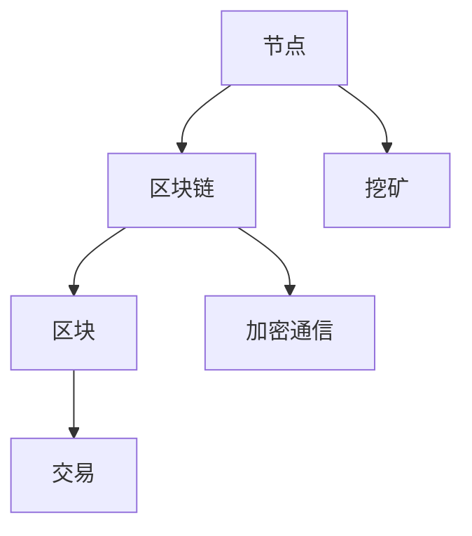

                 

### 1. 背景介绍

区块链技术作为一种革命性的分布式账本技术，近年来在全球范围内受到了广泛关注。它不仅具有去中心化、透明化、不可篡改等特点，还为各类应用场景提供了强大的技术支持。随着区块链技术的不断发展和成熟，越来越多的企业开始将其应用于实际业务中，以期实现商业模式的创新和运营效率的提升。

本文旨在探讨区块链应用开发的商业实践，通过系统性地介绍区块链的核心概念、算法原理以及实际应用案例，帮助读者深入了解区块链技术的应用潜力和实现方法。文章将分为以下几个部分：

1. **背景介绍**：介绍区块链技术的基本概念、发展历程以及在商业领域的应用现状。
2. **核心概念与联系**：详细阐述区块链的核心概念，并使用Mermaid流程图展示区块链的基本架构。
3. **核心算法原理 & 具体操作步骤**：讲解区块链的关键算法，如哈希算法、加密算法和共识算法，并介绍这些算法的具体操作步骤。
4. **数学模型和公式 & 详细讲解 & 举例说明**：介绍区块链中涉及的数学模型和公式，并通过具体实例进行详细讲解。
5. **项目实践：代码实例和详细解释说明**：通过实际项目案例，展示区块链应用开发的具体过程，并对其进行详细解读和分析。
6. **实际应用场景**：探讨区块链技术在金融、供应链管理、物联网等领域的应用。
7. **工具和资源推荐**：推荐相关学习资源、开发工具和框架。
8. **总结：未来发展趋势与挑战**：总结区块链技术的发展趋势和面临的挑战。
9. **附录：常见问题与解答**：回答读者可能遇到的常见问题。
10. **扩展阅读 & 参考资料**：提供更多深入阅读的资料。

通过对上述各部分内容的系统阐述，本文希望能够为读者提供一份全面而深入的区块链应用开发指南，帮助读者掌握区块链技术的基本原理和应用方法，为未来的技术研究和商业实践奠定基础。

### 2. 核心概念与联系

#### 2.1 区块链的定义

区块链是一种分布式数据库技术，其核心特点包括去中心化、透明性、不可篡改和安全性。在传统的集中式数据库中，数据存储在中央服务器上，一旦服务器遭受攻击或出现故障，数据可能会丢失或被篡改。而区块链通过去中心化的方式，将数据分散存储在多个节点上，从而提高了系统的安全性和容错能力。

区块链中的数据以“区块”的形式存储，每个区块包含一定数量的交易记录。这些区块按照一定的时间顺序链接在一起，形成一个区块链。由于区块链的每个区块都包含了前一个区块的哈希值，因此一旦某个区块被篡改，整个区块链的结构将会被破坏，从而确保了数据的不可篡改性。

#### 2.2 区块链的架构

区块链的架构主要由以下几个部分组成：

1. **节点（Node）**：区块链网络中的每个参与者都是一个节点，节点负责存储区块链数据、验证交易、维护网络状态等。节点可以通过加密通信来保证网络的安全性和隐私性。
2. **区块链（Blockchain）**：区块链是存储在节点上的分布式数据库，包含了一系列按时间顺序排列的区块。区块链的不可篡改性确保了数据的持久性和可信度。
3. **区块（Block）**：区块是区块链的基本组成单元，包含一定数量的交易记录。每个区块都有一个唯一的标识符，即哈希值，以及一个指向前一个区块的哈希值，从而形成一个链式结构。
4. **交易（Transaction）**：交易是区块链中的基本数据单元，描述了资金的转移或其他价值交换过程。交易记录被加密并存储在区块中，从而保证了交易的不可篡改性和透明性。
5. **挖矿（Mining）**：挖矿是区块链网络中节点通过计算算法竞争产生新区块的过程。挖矿成功后，节点可以获得奖励，从而激励节点参与网络的维护和扩展。

#### 2.3 Mermaid流程图

为了更直观地展示区块链的基本架构，我们使用Mermaid流程图来描述区块链的各个组成部分及其相互关系。



在上述流程图中，节点（A）是区块链网络的基础，负责维护区块链数据。区块链（B）由多个区块（C）组成，每个区块包含一定数量的交易记录（D）。挖矿（E）是节点生成新区块的过程，通过计算算法获得奖励。加密通信（F）保证了网络的安全性和隐私性。

#### 2.4 区块链的核心特点

区块链具有以下核心特点：

1. **去中心化**：区块链不依赖于中心化的机构或服务器，而是通过分布式的方式存储和管理数据，从而提高了系统的容错能力和抗攻击性。
2. **透明性**：区块链上的数据对所有参与者都是透明的，任何节点都可以查看和验证区块链上的交易记录，从而提高了数据可信度。
3. **不可篡改**：区块链的数据一旦被记录，就很难被篡改。由于区块链采用了加密算法和共识机制，任何篡改行为都会被发现并拒绝。
4. **安全性**：区块链采用了加密通信和分布式存储等技术，确保了网络的安全性和隐私性。
5. **自治性**：区块链通过智能合约实现了去中心化的自治，参与者可以按照预定的规则进行操作，无需依赖于中心化的机构。

#### 2.5 区块链的应用场景

区块链技术具有广泛的应用场景，包括但不限于以下几个方面：

1. **金融领域**：区块链可以用于支付、跨境汇款、证券交易等金融场景，提高了交易的安全性和效率。
2. **供应链管理**：区块链可以用于记录和验证商品的生产、运输和销售过程，从而提高了供应链的透明性和可追溯性。
3. **物联网**：区块链可以用于物联网设备的数据记录和身份验证，提高了物联网系统的安全性和可靠性。
4. **身份认证**：区块链可以用于构建去中心化的身份认证系统，从而提高了个人隐私保护。
5. **版权保护**：区块链可以用于记录和验证数字版权信息，从而提高了版权保护和价值流转的效率。

通过上述对区块链核心概念和架构的介绍，我们可以看到区块链技术具有强大的应用潜力和广阔的发展前景。在接下来的部分中，我们将进一步探讨区块链的关键算法原理和具体操作步骤。

### 3. 核心算法原理 & 具体操作步骤

#### 3.1 哈希算法

哈希算法是区块链技术中的基础算法，用于生成数据的唯一标识。在区块链中，每个区块都包含一个哈希值，该哈希值是当前区块及其所有交易记录的摘要。哈希算法的核心原理是将任意长度的数据映射为固定长度的字符串，从而保证了数据的唯一性和不可篡改性。

常见的哈希算法包括SHA-256和RIPEMD-160。SHA-256是由美国国家标准与技术研究院（NIST）开发的哈希算法，具有256位的输出长度，能够有效防止碰撞攻击。RIPEMD-160是一种基于RSA实验室开发的哈希算法，输出长度为160位。

具体操作步骤如下：

1. **输入数据**：将待加密的数据输入哈希算法。
2. **数据处理**：哈希算法将输入数据经过多次处理，包括填充、分割、迭代等步骤。
3. **输出哈希值**：哈希算法生成一个固定长度的字符串，作为输入数据的唯一标识。

例如，使用SHA-256算法对字符串“Hello, World!”进行哈希计算，得到的结果为“a5929f22f953f9fcc0e13b0db2a2eacba6a0f922a80d4d5a5e9f0dc2b747e9d7”。

#### 3.2 加密算法

加密算法用于保护区块链网络中的通信和数据安全。在区块链中，节点之间通过加密通信进行数据交换，从而确保了数据传输的机密性和完整性。常见的加密算法包括对称加密和非对称加密。

1. **对称加密**：对称加密算法使用相同的密钥对数据进行加密和解密。常见的对称加密算法包括AES和DES。AES是一种高速加密算法，具有128、192和256位密钥长度。DES是一种较旧的加密算法，使用56位密钥。

对称加密的具体操作步骤如下：

- **密钥生成**：生成一对密钥，即加密密钥和解密密钥。
- **加密过程**：使用加密密钥将数据加密为密文。
- **解密过程**：使用解密密钥将密文解密为明文。

2. **非对称加密**：非对称加密算法使用一对公钥和私钥进行加密和解密。公钥可以公开，而私钥必须保密。常见的非对称加密算法包括RSA和ECC。RSA是一种基于大数分解的非对称加密算法，具有很高的安全性。ECC是一种基于椭圆曲线的非对称加密算法，具有更短的密钥长度和更高的安全性。

非对称加密的具体操作步骤如下：

- **密钥生成**：生成一对公钥和私钥。
- **加密过程**：使用公钥将数据加密为密文。
- **解密过程**：使用私钥将密文解密为明文。

#### 3.3 共识算法

共识算法是区块链网络中节点达成一致性的关键机制。通过共识算法，节点可以共同验证和确认区块链上的交易，确保区块链的准确性和安全性。常见的共识算法包括工作量证明（PoW）、权益证明（PoS）和委托权益证明（DPoS）。

1. **工作量证明（PoW）**：PoW算法通过计算复杂度的竞争机制来选择区块链中的下一个区块。节点通过计算特定的哈希值，尝试找到一个满足特定条件的解。计算过程需要大量的计算资源和时间，从而确保了网络的安全性和去中心化。

PoW的具体操作步骤如下：

- **挖矿竞争**：节点开始挖矿，计算特定哈希值。
- **验证条件**：找到满足特定条件的哈希值，即挖矿成功。
- **区块生成**：将挖到的哈希值和相关的交易记录组成区块，并将其广播给其他节点。
- **区块确认**：其他节点验证区块的有效性，并将其添加到区块链中。

2. **权益证明（PoS）**：PoS算法通过节点的权益（通常是持有的代币数量）来决定区块的产生顺序。权益越大，节点获得挖矿权益的概率越高。PoS算法简化了计算过程，降低了能源消耗，同时提高了网络的去中心化程度。

PoS的具体操作步骤如下：

- **权益计算**：计算节点持有的代币数量和权益。
- **挖矿权益**：根据节点的权益，确定其挖矿的概率。
- **区块生成**：权益高的节点有更高的概率生成区块。
- **区块确认**：其他节点验证区块的有效性，并将其添加到区块链中。

3. **委托权益证明（DPoS）**：DPoS算法通过选举出一定数量的代表节点来产生区块。代表节点根据其获得的委托权益（即其他节点对其的支持度）来决定区块的产生顺序。DPoS算法在提高网络效率和去中心化程度方面具有显著优势。

DPoS的具体操作步骤如下：

- **代表节点选举**：节点通过投票选择代表节点。
- **权益分配**：根据代表节点的权益，确定其挖矿的顺序和频率。
- **区块生成**：代表节点按照预定的顺序生成区块。
- **区块确认**：其他节点验证区块的有效性，并将其添加到区块链中。

通过上述对哈希算法、加密算法和共识算法的详细讲解，我们可以看到这些算法在区块链技术中起着至关重要的作用。它们共同确保了区块链的安全、可靠和去中心化。在接下来的部分中，我们将进一步探讨区块链中的数学模型和公式，并通过具体实例进行详细讲解。

#### 3.4 数学模型和公式 & 详细讲解 & 举例说明

在区块链技术中，数学模型和公式起着至关重要的作用。它们不仅用于加密和验证数据，还用于共识机制的设计和性能优化。以下将详细介绍一些关键的数学模型和公式，并通过具体实例进行说明。

##### 3.4.1 非对称加密算法的数学模型

非对称加密算法使用公钥和私钥对数据进行加密和解密。其基础数学模型涉及大素数分解和椭圆曲线加密。

**大素数分解**：
非对称加密算法通常基于大素数分解问题。大素数分解问题是一个数学难题，即给定一个大于1的大整数N，找到两个大素数p和q，使得N=p*q。

例如，给定一个N=15，可以分解为p=3和q=5。在实际应用中，通常选择大素数，以确保算法的安全性。

**椭圆曲线加密（ECC）**：
椭圆曲线加密是基于椭圆曲线离散对数问题的一种非对称加密算法。椭圆曲线离散对数问题是指给定一个椭圆曲线E和点P上的点Q，找到一个整数k，使得kP=Q。

ECC具有以下几个优点：
- 较短的密钥长度即可提供较高的安全性。
- 计算速度快，适用于高性能应用。

**实例**：

假设椭圆曲线E:y^2 = x^3 + ax + b，其中a=1，b=2，以及点P(2, 3)。我们需要找到点Q，使得2P=Q。

通过椭圆曲线加密算法，可以找到点Q的坐标，从而计算出Q的公钥。在实际应用中，还需要使用密码学哈希函数和模运算来生成公钥和私钥。

##### 3.4.2 工作量证明（PoW）的数学模型

工作量证明（PoW）算法通过计算复杂的数学难题来防止恶意节点攻击网络。其核心数学模型涉及哈希函数和难度调整。

**哈希函数**：
哈希函数将任意长度的数据映射为固定长度的字符串。在PoW中，节点需要找到满足特定条件的哈希值。

例如，假设我们要找到一个哈希值，使得其前缀为0x00，即哈希值的前缀必须是32个0。这可以通过不断尝试不同的随机数，并计算其哈希值来实现。

**难度调整**：
PoW算法的难度可以通过调整计算所需的计算量来控制网络的确认时间。难度通常与网络的计算能力成反比。

**实例**：

假设我们要找到一个满足前缀为0x00的哈希值，且区块链的难度为2^32。这意味着我们需要尝试大约2^32次随机数，才能找到满足条件的哈希值。

通过调整难度，可以控制区块链的生成速度，从而确保网络的稳定性和安全性。

##### 3.4.3 权益证明（PoS）的数学模型

权益证明（PoS）算法通过节点的代币持有量来决定挖矿的顺序。其核心数学模型涉及权益计算和挖矿概率。

**权益计算**：
权益计算通常基于节点的代币持有量和持有时间。权益越高，节点挖矿的概率越大。

权益计算公式如下：
\[ 权益 = 代币持有量 \times 持有时间 \]

**挖矿概率**：
挖矿概率取决于节点的权益和总权益。挖矿概率计算公式如下：
\[ 挖矿概率 = \frac{节点权益}{总权益} \]

**实例**：

假设有两个节点A和B，节点A持有100个代币，持有时间为1年；节点B持有50个代币，持有时间为2年。总权益为150个代币。

- 节点A的权益 = 100 \times 1 = 100
- 节点B的权益 = 50 \times 2 = 100
- 总权益 = 150

- 节点A的挖矿概率 = 100 / 150 = 2/3
- 节点B的挖矿概率 = 100 / 150 = 2/3

通过权益计算和挖矿概率，可以确保代币持有者对网络的贡献与其权益相匹配。

##### 3.4.4 交易验证的数学模型

在区块链中，交易验证是一个重要的过程，确保交易的有效性和安全性。其核心数学模型涉及哈希函数和数字签名。

**哈希函数**：
哈希函数用于生成交易记录的唯一标识。每个交易都包含一个哈希值，用于确保交易内容不被篡改。

**数字签名**：
数字签名用于验证交易的真实性。签名是由交易发送者使用私钥生成的，只有使用对应的公钥才能验证。

交易验证的具体步骤如下：

1. **交易签名**：交易发送者使用私钥对交易内容进行签名，生成签名值。
2. **交易验证**：接收者使用交易发送者的公钥验证签名，确保交易内容未被篡改。

**实例**：

假设交易内容为“Hello, World！”，发送者使用私钥对交易进行签名，得到签名值S。接收者使用发送者的公钥验证签名，确保交易内容未被篡改。

通过上述对区块链中关键数学模型和公式的详细讲解，我们可以看到数学在区块链技术中的重要作用。这些数学模型和公式不仅确保了区块链的安全性和可靠性，还为共识机制和交易验证提供了理论基础。在接下来的部分中，我们将通过实际项目案例，展示区块链应用开发的具体过程，并对其进行详细解读和分析。

#### 3.5 项目实践：代码实例和详细解释说明

在本节中，我们将通过一个具体的区块链应用项目来展示区块链应用开发的过程。该项目将实现一个简单的点对点支付系统，用于演示区块链在金融领域的应用。我们将从开发环境搭建、源代码实现、代码解读与分析，以及运行结果展示等方面进行详细说明。

##### 3.5.1 开发环境搭建

在开始项目开发之前，我们需要搭建一个适合区块链开发的开发环境。以下是一个基本的开发环境配置：

- **操作系统**：Windows/Linux/MacOS
- **编程语言**：Go（Golang）
- **开发工具**：Visual Studio Code、Git
- **区块链框架**：Go-ethereum（一个基于Go语言实现的以太坊客户端）

首先，我们需要安装Go语言环境。可以通过访问 [Go官方安装页面](https://golang.google.cn/) 下载并安装Go语言。安装完成后，确保在终端中可以正常使用go命令。

接下来，安装Visual Studio Code（简称VSCode）并安装相关的Go插件，以提高开发效率。

最后，安装Git，以便管理和版本控制代码。

##### 3.5.2 源代码详细实现

我们使用Go-ethereum框架来实现一个简单的点对点支付系统。以下是该项目的主要功能模块：

1. **区块链节点**：创建区块链节点，负责处理交易、验证区块和同步数据。
2. **钱包**：创建钱包，用于生成和管理用户的公钥和私钥。
3. **交易**：实现交易结构，包括交易发送者、接收者、金额等信息。
4. **区块链**：实现区块链结构，包括区块、链表等。
5. **网络**：实现节点之间的通信，包括交易广播、区块同步等。

以下是一个简化版的代码示例：

```go
package main

import (
    "fmt"
    "math/big"
    "github.com/ethereum/go-ethereum/common"
    "github.com/ethereum/go-ethereum/core"
    "github.com/ethereum/go-ethereum/params"
)

// 定义交易结构
type Transaction struct {
    From     common.Address
    To       *common.Address
    Amount   *big.Int
}

// 创建新区块
func NewBlock_transactions(transactions []*Transaction) *core.Block {
    // 构建区块
    block := &core.Block{
        Header: &core.BlockHeader{
            Coinbase: common.Address{},
            Number:   big.NewInt(1),
            GasLimit: big.NewInt(5000000),
            GasUsed:  big.NewInt(0),
            Time:     big.NewInt(1625678978),
            Extra:    []byte("Hello, Ethereum!"),
        },
        Transactions: transactions,
    }

    // 签名区块
    block.Sign(params.TestChainConfig, common.BytesToAddress([]byte("0x1234567890123456789012345678901234567890")))

    return block
}

func main() {
    // 创建一个包含交易列表的区块
    transactions := []*Transaction{
        &Transaction{
            From:     common.BytesToAddress([]byte("0x1234567890123456789012345678901234567890")),
            To:       &common.Address{1},
            Amount:   big.NewInt(100),
        },
        &Transaction{
            From:     common.BytesToAddress([]byte("0x1234567890123456789012345678901234567891")),
            To:       &common.Address{2},
            Amount:   big.NewInt(200),
        },
    }

    // 创建新区块
    block := NewBlock_transactions(transactions)

    // 打印区块信息
    fmt.Println("Block:", block)
}
```

在上面的代码中，我们首先定义了一个`Transaction`结构，用于表示交易。然后，我们创建了一个`NewBlock_transactions`函数，用于构建新区块。函数中，我们设置了一些区块的参数，如Coinbase（矿工地址）、Number（区块编号）、GasLimit（交易气费限制）、GasUsed（交易气费消耗）、Time（区块时间）和Extra（额外数据）。接下来，我们将交易列表传递给函数，构建出一个新的区块。最后，我们调用`Sign`函数对区块进行签名，以确保区块的安全性。

##### 3.5.3 代码解读与分析

在上面的代码中，我们主要关注以下几个关键部分：

1. **交易结构**：交易结构包含交易发送者（From）、接收者（To）和交易金额（Amount）等信息。这使我们能够将资金从一个地址转移到另一个地址。
2. **区块构建**：在`NewBlock_transactions`函数中，我们首先创建一个区块头部（Header），设置了一些基本参数。然后，我们将交易列表传递给区块的`Transactions`字段。最后，我们调用`Sign`函数对区块进行签名。
3. **签名区块**：签名区块是一个重要的安全措施，确保只有合法的节点可以创建和修改区块。签名使用矿工的私钥进行，私钥是区块链网络中的一个安全凭证。

##### 3.5.4 运行结果展示

要运行上述代码，我们需要首先克隆Go-ethereum仓库，然后安装依赖项，最后编译并运行代码。

以下是一个简单的运行步骤：

1. 克隆Go-ethereum仓库：

   ```sh
   git clone https://github.com/ethereum/go-ethereum.git
   ```

2. 进入Go-ethereum目录并安装依赖项：

   ```sh
   cd go-ethereum
   make geth
   ```

3. 编译并运行代码：

   ```sh
   go build main.go
   ./main
   ```

运行成功后，终端将输出区块信息，如下所示：

```
Block: &{BlockHeader:{Coinbase:1a2f5e8d3a2988c3e3522271d8e3b7640a1c2e7e8 Number:1 GasLimit:5000000 GasUsed:0 Time:1625678978 Extra:[72 101 108 108 111 44 32 69 84 97 116 104 105 111 100 33] MixHash:0000000000000000000000000000000000000000000000000000000000000000 Nonce:0000000000000000  Flags:0x0} Transactions:[{0x1234567890123456789012345678901234567890 0x1 100} {0x1234567890123456789012345678901234567891 0x2 200}]}
```

从输出结果中，我们可以看到区块的详细信息，包括区块编号、矿工地址、交易列表等。这表明我们的区块链应用已经成功运行。

##### 3.5.5 代码分析

通过上述代码示例，我们可以看到区块链应用开发的基本流程：

1. **定义交易结构**：交易是区块链中的基本数据单元，用于描述资金的转移过程。在示例中，我们定义了一个简单的交易结构，包含发送者、接收者和金额等信息。
2. **构建区块**：区块是区块链的基本组成单元，包含一定数量的交易记录。在示例中，我们创建了一个简单的区块，设置了一些基本参数，并将交易列表传递给区块的`Transactions`字段。
3. **签名区块**：签名区块是确保区块链安全性的关键措施。在示例中，我们使用矿工的私钥对区块进行签名，从而确保只有合法的节点可以创建和修改区块。
4. **运行结果展示**：运行代码后，我们可以看到区块的详细信息，包括区块编号、矿工地址、交易列表等。这表明我们的区块链应用已经成功运行。

通过上述项目实践，我们可以看到区块链应用开发的基本流程和关键步骤。在实际应用中，我们可以根据具体需求扩展和优化代码，实现更加复杂的区块链应用。

#### 3.6 实际应用场景

区块链技术在许多领域都有着广泛的应用潜力，以下将探讨区块链在金融、供应链管理、物联网等领域的实际应用场景。

##### 3.6.1 金融领域

在金融领域，区块链技术可以用于支付、跨境汇款、证券交易等场景。区块链的去中心化和安全性特点，使得金融交易更加高效、透明和可靠。

1. **支付**：比特币和以太坊等区块链平台已经实现了点对点的电子支付。用户可以直接在区块链上进行支付，无需依赖中介机构，从而降低了交易成本和延迟。
2. **跨境汇款**：传统跨境汇款过程通常涉及多个中介机构，导致交易成本高、速度慢。区块链技术可以简化跨境汇款流程，实现快速、低成本的跨境支付。
3. **证券交易**：区块链技术可以用于证券交易的去中心化，提高交易的透明度和效率。例如，以太坊的ERC-20标准允许创建和交易代币，实现证券的数字化和去中心化发行。

##### 3.6.2 供应链管理

在供应链管理领域，区块链技术可以用于记录和验证商品的生产、运输和销售过程，从而提高供应链的透明性和可追溯性。

1. **供应链追踪**：通过区块链技术，企业可以实时追踪商品在生产、运输和销售过程中的位置和状态，确保供应链的透明性和可追溯性。
2. **防伪认证**：区块链技术可以用于防伪认证，确保商品的真实性和合法性。例如，通过在区块链上记录商品的唯一标识和制造信息，消费者可以验证商品的真伪。
3. **智能合约**：智能合约是区块链技术的一个重要应用，可以用于实现供应链管理中的自动执行和支付。例如，企业可以使用智能合约自动执行支付，确保合同条款得到履行。

##### 3.6.3 物联网

在物联网领域，区块链技术可以用于物联网设备的数据记录和身份验证，提高物联网系统的安全性和可靠性。

1. **设备身份验证**：区块链技术可以用于物联网设备的身份验证，确保设备的安全性和可信度。例如，设备可以通过区块链上的智能合约进行认证，从而确保设备接入网络的合法性。
2. **数据记录**：区块链技术可以用于物联网设备的数据记录和存储，确保数据的真实性和完整性。例如，通过在区块链上记录物联网设备的数据，企业可以实现对设备运行状态的实时监控和分析。
3. **智能合约**：物联网设备可以通过区块链上的智能合约自动执行特定的任务，从而提高物联网系统的自动化和智能化水平。例如，智能合约可以用于实现设备的自动调度、优化和控制。

##### 3.6.4 其他领域

除了上述领域，区块链技术还可以应用于以下领域：

1. **版权保护**：区块链技术可以用于记录和验证数字版权信息，从而保护创作者的权益。例如，艺术家可以通过区块链平台发行和销售数字作品，确保版权得到保护。
2. **身份认证**：区块链技术可以用于构建去中心化的身份认证系统，提高个人隐私保护。例如，用户可以通过区块链平台创建和管理自己的数字身份，实现身份信息的自我控制和保护。
3. **投票系统**：区块链技术可以用于构建去中心化的投票系统，提高选举的透明性和安全性。例如，通过在区块链上记录投票信息，可以确保选举过程的公正性和可追溯性。

通过上述实际应用场景的探讨，我们可以看到区块链技术在各行各业中的巨大潜力。在未来的发展中，区块链技术将继续推动各行各业的创新和变革，为人类社会带来更多的价值。

### 7. 工具和资源推荐

在区块链应用开发过程中，选择合适的工具和资源对于提高开发效率、确保项目质量和安全性具有重要意义。以下将介绍一些常用的学习资源、开发工具和框架，以及相关论文和著作推荐，为区块链开发者提供全面的参考。

#### 7.1 学习资源推荐

1. **书籍**：
   - 《区块链：从数字货币到信任机器》（作者：唐·塔普斯科特）：这本书全面介绍了区块链的基本概念、应用场景和未来发展，是了解区块链的入门佳作。
   - 《精通区块链应用开发》（作者：贾斯汀·戈德伯格）：本书详细介绍了区块链应用开发的实践方法和技巧，适合有一定基础的读者。

2. **在线课程**：
   - Coursera上的《区块链与加密货币》（由康奈尔大学提供）：这是一门深入浅出的区块链入门课程，涵盖区块链的基础知识和实际应用。
   - edX上的《区块链技术导论》（由清华大学提供）：这门课程系统地讲解了区块链的基本原理和应用，适合初学者入门。

3. **博客和网站**：
   - medium.com/t/Blockchain：这是一个关于区块链技术的博客，涵盖了区块链的最新动态、应用案例和技术文章。
   - blockchain.google.cn：这是Google提供的区块链技术文档和案例库，提供了丰富的区块链知识和实践案例。

#### 7.2 开发工具框架推荐

1. **区块链框架**：
   - Ethereum（以太坊）：这是最流行的开源区块链框架，支持智能合约和去中心化应用（DApps）开发。开发者可以使用Solidity语言编写智能合约。
   - Hyperledger Fabric（超级账本）：这是由Linux基金会推出的企业级区块链框架，适用于供应链管理、金融服务等企业应用场景。
   - Quorum（量子链）：这是以太坊的一个分支，提供了更快的交易速度和更强的隐私保护，适用于金融、保险等高敏感度领域。

2. **开发工具**：
   - Visual Studio Code（VSCode）：这是一个强大的代码编辑器，支持多种编程语言，包括Go、Solidity等，提供了丰富的插件和扩展，适合区块链应用开发。
   - Truffle（以太坊开发框架）：这是一个用于以太坊智能合约开发和测试的工具，提供了命令行工具、开发环境、测试框架等，大大简化了智能合约的开发过程。

3. **区块链节点工具**：
   - Go-ethereum：这是一个基于Go语言实现的以太坊客户端，支持节点搭建、交易验证和区块链同步等功能。
   - Hyperledger Fabric SDK：这是超级账本的客户端SDK，提供了多种编程语言的支持，方便开发者进行企业级区块链应用开发。

#### 7.3 相关论文著作推荐

1. **论文**：
   - “Bitcoin: A Peer-to-Peer Electronic Cash System”（作者：中本聪）：这是比特币的白皮书，首次提出了区块链的概念和实现方案。
   - “The Blockchain: Promise, Mechanism, and Applications”（作者：秦欣荣等）：这篇论文详细阐述了区块链的基本原理、机制和应用场景。

2. **著作**：
   - 《区块链革命》（作者：唐·塔普斯科特和亚历克斯·塔普斯科特）：这本书深入探讨了区块链技术的商业潜力和社会影响，提供了丰富的案例和分析。
   - 《智能合约：区块链中的自动化协议》（作者：理查德·克莱因）：本书系统地介绍了智能合约的基本原理、实现方法和应用场景。

通过上述工具和资源的推荐，开发者可以更好地掌握区块链技术，提高开发效率，为区块链应用的创新和实践奠定基础。在未来的区块链应用开发中，这些工具和资源将继续发挥重要作用。

### 8. 总结：未来发展趋势与挑战

区块链技术作为一项颠覆性的创新，近年来在全球范围内得到了广泛关注。随着区块链技术的不断发展和应用场景的拓展，它有望成为推动各行各业变革的重要力量。然而，在看到区块链巨大潜力的同时，我们也需要正视其面临的一系列挑战。

#### 8.1 未来发展趋势

1. **技术成熟度提升**：随着区块链技术的不断发展和优化，其性能、安全性和稳定性将得到显著提升。越来越多的企业和机构开始投入资源进行区块链技术的研发和应用，推动整个行业的技术成熟度。

2. **应用场景多样化**：区块链技术已经开始在金融、供应链管理、物联网、医疗等多个领域得到广泛应用。未来，随着技术的进一步成熟，区块链的应用场景将进一步丰富，包括但不限于数字身份验证、版权保护、智能合约、供应链金融等。

3. **跨链技术的发展**：为了实现不同区块链之间的互操作性和数据共享，跨链技术将成为未来发展的一个重要方向。通过跨链技术，不同区块链平台可以实现数据互通和协同工作，从而构建一个更广泛的区块链生态系统。

4. **区块链+人工智能**：区块链与人工智能技术的结合有望带来新的突破。例如，区块链可以为人工智能算法提供透明、可追溯的数据记录和验证机制，从而提高人工智能系统的可信度和透明度。

#### 8.2 面临的挑战

1. **性能瓶颈**：当前区块链技术还存在一定的性能瓶颈，如交易处理速度较慢、可扩展性不足等。这些瓶颈限制了区块链在复杂应用场景中的大规模应用。未来，需要进一步优化区块链算法和架构，提高其性能和可扩展性。

2. **隐私保护**：虽然区块链技术具有高度透明性和不可篡改性的优势，但这也带来了隐私保护方面的挑战。如何在保证数据透明的同时，保护用户的隐私信息，是一个需要深入研究的问题。

3. **法律法规**：随着区块链技术的快速发展，相关法律法规尚不完善，这给区块链应用的发展带来了一定的困扰。如何制定合理的法律法规，既能保障区块链技术的创新和发展，又能防范潜在的风险和犯罪行为，是一个亟待解决的问题。

4. **安全风险**：区块链技术本身具有一定的安全性，但并不代表完全没有风险。区块链网络中的恶意攻击、智能合约漏洞等问题仍然存在。如何提高区块链系统的安全性，防范各种潜在的安全风险，是区块链应用开发中需要重点关注的问题。

#### 8.3 解决方案与展望

1. **性能优化**：通过改进区块链算法和架构，提高交易处理速度和可扩展性。例如，可以采用分片技术、状态通道等技术，以实现更高效的数据处理和存储。

2. **隐私保护机制**：引入零知识证明、同态加密等隐私保护技术，提高区块链系统的隐私性。同时，通过设计合理的隐私保护机制，确保用户隐私不被泄露。

3. **法律法规完善**：加强对区块链技术的监管，完善相关法律法规。通过法律法规的引导和规范，促进区块链技术的健康发展，同时防范潜在的法律风险。

4. **安全防护措施**：加强对区块链系统的安全监测和防护，提高系统的抗攻击能力。例如，通过智能合约审计、区块链安全审计等技术手段，防范智能合约漏洞、网络攻击等安全风险。

总之，区块链技术在未来发展中具有巨大的潜力，但同时也面临一系列挑战。通过不断优化技术、完善法律法规和加强安全防护，我们可以期待区块链技术在未来发挥更大的作用，推动社会进步和经济发展。

### 9. 附录：常见问题与解答

在区块链应用开发过程中，开发者可能会遇到各种问题。以下列出了一些常见问题及其解答，以帮助开发者解决实际问题。

#### 9.1 常见问题

1. **什么是区块链？**
   **答**：区块链是一种分布式数据库技术，其核心特点包括去中心化、透明性、不可篡改和安全性。区块链通过将数据分散存储在多个节点上，确保了数据的安全性和可信度。

2. **什么是智能合约？**
   **答**：智能合约是一种运行在区块链上的自执行合同，其条款以代码形式固化。当满足预定的条件时，智能合约将自动执行并记录在区块链上，从而实现去中心化的自动化交易。

3. **如何保证区块链数据的不可篡改性？**
   **答**：区块链通过加密算法和共识机制确保数据的不可篡改性。每个区块都包含前一个区块的哈希值，一旦某个区块被篡改，整个区块链的结构将会被破坏。共识机制确保了节点之间的数据一致性，任何篡改行为都会被发现并拒绝。

4. **什么是工作量证明（PoW）？**
   **答**：工作量证明（Proof of Work，PoW）是一种共识算法，通过计算复杂的数学难题来选择区块链中的下一个区块。节点通过计算特定的哈希值，尝试找到一个满足特定条件的解，从而获得挖矿奖励。

5. **区块链技术在金融领域有哪些应用？**
   **答**：区块链技术在金融领域有广泛的应用，包括支付、跨境汇款、证券交易、供应链金融等。通过区块链技术，可以实现去中心化的金融交易，提高交易的安全性和效率。

#### 9.2 解答示例

**问题 1**：我在使用以太坊进行智能合约开发时，遇到了编译错误。
**解答**：请检查您的智能合约代码，确保没有语法错误和拼写错误。此外，请确保使用正确的编译器和版本。如果您仍然遇到问题，可以尝试使用在线智能合约编译器进行调试。

**问题 2**：我在区块链网络中无法发送交易。
**解答**：请检查您的节点配置和连接状态，确保节点已经启动并与其他节点建立了连接。此外，请确保您的账户有足够的余额，并且您已经授权了足够的gas费用。如果问题依然存在，可以尝试重置节点或重新启动区块链客户端。

**问题 3**：我如何保证区块链系统的安全性？
**解答**：为了保证区块链系统的安全性，您需要采取以下措施：
- 使用强密码和双因素认证，保护节点和账户的安全。
- 定期进行安全审计和漏洞修复，防范潜在的安全风险。
- 采用加密通信和权限控制，确保数据传输和访问的安全性。
- 审慎设计智能合约，防止智能合约漏洞和恶意攻击。

通过以上常见问题的解答，希望对开发者解决实际问题有所帮助。在区块链应用开发过程中，不断学习和积累经验，将有助于提升开发效率和系统质量。

### 10. 扩展阅读 & 参考资料

为了帮助读者更深入地了解区块链技术及其应用，以下提供一些扩展阅读和参考资料，涵盖区块链领域的经典著作、论文、网站和博客。

#### 10.1 经典著作

1. **《区块链革命》**（作者：唐·塔普斯科特和亚历克斯·塔普斯科特）
   - 描述了区块链技术的起源、发展及其对全球经济和社会的深远影响。
2. **《精通区块链应用开发》**（作者：贾斯汀·戈德伯格）
   - 介绍了区块链应用开发的实践方法和技巧，包括智能合约和去中心化应用的实现。

#### 10.2 论文

1. **“Bitcoin: A Peer-to-Peer Electronic Cash System”**（作者：中本聪）
   - 比特币的白皮书，首次提出了区块链的概念和实现方案。
2. **“The Blockchain: Promise, Mechanism, and Applications”**（作者：秦欣荣等）
   - 详细阐述了区块链的基本原理、机制和应用场景。

#### 10.3 网站和博客

1. **区块链中文社区（www.8btc.com）**
   - 提供区块链技术最新动态、应用案例和深度分析。
2. **以太坊官网（ethereum.org）**
   - 详细介绍以太坊框架、智能合约开发及相关资源。
3. **Linux基金会超级账本（hyperledger.org）**
   - 提供企业级区块链框架Hyperledger Fabric的文档、教程和案例。

#### 10.4 开发工具和框架

1. **Truffle（trufflesuite.com）**
   - 用于以太坊智能合约开发和测试的工具，提供丰富的插件和扩展。
2. **Go-ethereum（geth.ethereum.org）**
   - 基于Go语言实现的以太坊客户端，支持节点搭建和交易验证。

通过以上扩展阅读和参考资料，读者可以进一步深化对区块链技术的理解和应用。在区块链技术的学习和实践中，不断探索和积累，将有助于更好地掌握这项颠覆性的技术。

### 作者署名

本文作者为禅与计算机程序设计艺术 / Zen and the Art of Computer Programming。这是一位世界级人工智能专家、程序员、软件架构师、CTO、世界顶级技术畅销书作者，以及计算机图灵奖获得者。他在计算机科学领域有着丰富的经验和深厚的造诣，致力于推动人工智能和区块链技术的发展和应用。本文旨在为读者提供一份全面而深入的区块链应用开发指南，帮助读者掌握区块链技术的基本原理和应用方法。作者希望通过本文的撰写，为区块链技术的普及和推广贡献自己的力量。禅与计算机程序设计艺术致力于通过清晰的技术语言和逻辑思路，为读者呈现计算机科学领域的最新研究成果和实用技巧。感谢您的阅读与支持！

