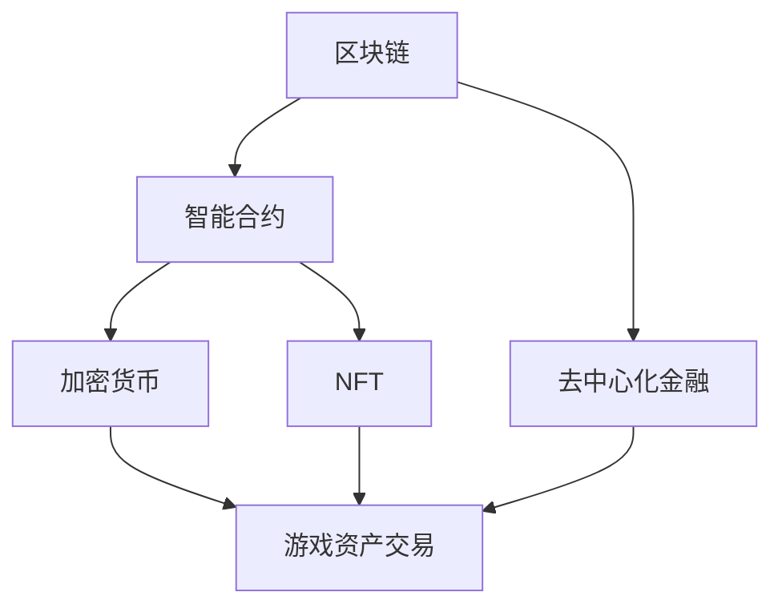

                 

### 1. 背景介绍

区块链技术的兴起，为传统互联网经济模式带来了巨大的变革。作为一种分布式账本技术，区块链以其去中心化、透明性和安全性等特性，逐渐渗透到金融、供应链管理、医疗等多个领域。然而，在游戏产业，区块链技术的应用更是引起了广泛关注。区块链在游戏领域的应用，不仅改变了传统的游戏资产交易方式，也为游戏经济模式带来了前所未有的创新。

游戏产业作为全球最大的娱乐产业之一，其市场规模和用户基数都极为庞大。随着游戏产业的发展，游戏资产交易成为了一项重要业务。传统的游戏资产交易方式主要依赖于中心化的平台，这种方式存在着诸多问题，如交易成本高、安全性低、隐私性差等。这些问题不仅影响了玩家的交易体验，也对游戏产业的可持续发展造成了困扰。

区块链技术的出现，为解决这些问题提供了一种新的思路。区块链的去中心化特性，使得游戏资产交易可以在无需依赖中心化平台的情况下进行，降低了交易成本。同时，区块链的透明性和安全性，保证了交易过程的公正和可靠，提高了交易的安全性。此外，区块链的不可篡改性，确保了游戏资产的真实性和唯一性，为游戏资产交易提供了可靠的保障。

因此，区块链技术在游戏资产交易中的应用，不仅能够提高交易的效率和安全性，还能够为游戏产业带来全新的经济模式。本文将围绕区块链游戏资产交易这一主题，详细探讨其核心概念、算法原理、数学模型、项目实践和实际应用场景，以期为广大读者提供一份全面、深入的技术解读。

### 2. 核心概念与联系

在深入探讨区块链游戏资产交易之前，我们需要理解一些核心概念和它们之间的关系。以下是本文中将要介绍的关键概念及其相互联系：

#### 2.1 区块链

区块链是一种分布式数据库技术，由一系列按时间顺序排列、彼此相连的数据块（Block）组成。每个数据块包含若干次交易记录，这些数据块通过密码学技术确保其完整性和不可篡改性。区块链的去中心化结构使其成为了一种无需信任的、安全的数据存储和传输方式。

#### 2.2 智能合约

智能合约是区块链上的自动执行协议，它基于预定义的条件在满足条件时自动执行。智能合约通常用一种特定的编程语言（如Solidity）编写，并部署在区块链上。智能合约在区块链游戏资产交易中起着至关重要的作用，它用于确保交易的安全性和自动执行。

#### 2.3 加密货币

加密货币是一种数字资产，使用密码学技术进行安全交易和存储。比特币（Bitcoin）是最早的加密货币，也是区块链技术的标志性应用。加密货币在区块链游戏资产交易中作为交换媒介，用于购买和销售游戏资产。

#### 2.4 非同质化代币（NFT）

非同质化代币（Non-Fungible Token，简称NFT）是一种独特的数字资产，代表了唯一的、不可替代的物品。与加密货币不同，NFT具有独特的标识符，可以代表游戏中的独特物品、艺术品或其他数字资产。NFT在区块链游戏资产交易中起到了关键作用，它确保了游戏资产的唯一性和可验证性。

#### 2.5 去中心化金融（DeFi）

去中心化金融（Decentralized Finance，简称DeFi）是利用区块链技术构建的金融市场，其核心思想是去中心化、自动化和透明化。DeFi在区块链游戏资产交易中的应用，使得交易过程更加高效、安全和可信。

#### 2.6 关联关系图

为了更清晰地展示这些核心概念之间的关系，我们可以使用Mermaid流程图来表示：



在上述关联关系图中，我们可以看到区块链是所有概念的基础，它通过智能合约、加密货币、NFT和去中心化金融与游戏资产交易紧密相连。智能合约确保了交易的安全性和自动执行，加密货币作为交换媒介，NFT确保了游戏资产的唯一性和可验证性，而去中心化金融则提供了高效、安全的交易环境。

通过这些核心概念的理解，我们为接下来的深入探讨打下了坚实的基础。在接下来的章节中，我们将详细探讨区块链游戏资产交易的核心算法原理、数学模型、项目实践和实际应用场景。

### 3. 核心算法原理 & 具体操作步骤

区块链游戏资产交易的核心算法原理主要涉及智能合约的编写与执行、加密货币的转账机制以及NFT的唯一性验证。以下是对这些算法原理的详细解释和具体操作步骤：

#### 3.1 智能合约编写与执行

智能合约是区块链游戏资产交易的核心，它通过预定义的条件自动执行交易。以下是智能合约编写与执行的基本步骤：

**3.1.1 智能合约编写**

1. **选择智能合约开发平台**：开发者可以选择如Ethereum、Binance Smart Chain（BSC）等区块链平台进行智能合约的编写。

2. **学习智能合约编程语言**：以Ethereum为例，开发者需要学习Solidity编程语言，Solidity是一种面向合约的编程语言，用于编写智能合约。

3. **编写智能合约代码**：开发者使用Solidity编写智能合约代码，主要包括交易逻辑、角色权限管理、资产转移等功能。以下是一个简单的智能合约示例：

    ```solidity
    // SPDX-License-Identifier: MIT
    pragma solidity ^0.8.0;

    contract GameAssetExchange {
        mapping(address => uint256) public balances;

        function deposit() public payable {
            balances[msg.sender()] += msg.value;
        }

        function transfer(address to, uint256 amount) public {
            require(balances[msg.sender()] >= amount, "Insufficient balance");
            balances[msg.sender()] -= amount;
            balances[to] += amount;
        }
    }
    ```

    在此示例中，智能合约定义了一个名为`GameAssetExchange`的合约，它包含一个用于存储玩家余额的映射表`balances`，以及一个用于存款和转账的函数。

**3.1.2 部署智能合约**

1. **连接到区块链节点**：开发者需要连接到一个区块链节点，以便将智能合约部署到区块链上。使用开发工具（如Truffle、Hardhat）进行部署。

2. **编译智能合约代码**：使用Solidity编译器将智能合约代码编译为字节码。

3. **部署智能合约**：将编译后的字节码上传到区块链节点，通过执行部署交易来将智能合约部署到区块链上。

#### 3.2 加密货币转账机制

在区块链游戏资产交易中，加密货币作为交换媒介。以下是加密货币转账的基本步骤：

1. **创建加密货币钱包**：用户需要创建一个加密货币钱包，用于存储和管理其加密货币。

2. **接收加密货币**：用户可以通过交易所、矿池或其他方式接收加密货币。

3. **转账加密货币**：用户使用钱包向其他用户或智能合约发送加密货币。转账过程通常涉及以下步骤：
    - **选择接收地址**：用户输入接收地址，确保其准确性。
    - **输入转账金额**：用户输入转账金额。
    - **确认交易**：用户确认转账交易，并支付一定的交易费用。
    - **交易广播**：转账交易广播到区块链网络，经过验证后，交易将被记录在区块链上。

#### 3.3 NFT的唯一性验证

NFT在区块链游戏资产交易中起到了关键作用，确保游戏资产的唯一性和可验证性。以下是NFT唯一性验证的基本步骤：

1. **创建NFT**：游戏开发者创建NFT，并将NFT的信息（如名称、描述、图像等）存储在区块链上。

2. **验证NFT**：用户可以通过区块链浏览器或专门的NFT验证工具，验证NFT的唯一性。验证过程包括：
    - **检查NFT合约地址**：确保NFT合约地址与创建者提供的合约地址一致。
    - **查看NFT详细信息**：查看NFT的详细信息，如名称、描述、图像等，确保与实际物品一致。
    - **检查NFT交易记录**：查看NFT的历史交易记录，确保其唯一性和真实性。

通过以上步骤，区块链游戏资产交易的核心算法原理得以实现。智能合约确保了交易的安全性和自动执行，加密货币提供了便捷的交换媒介，NFT确保了游戏资产的唯一性和可验证性。在接下来的章节中，我们将进一步探讨区块链游戏资产交易的数学模型和公式，以及其在实际项目中的应用。

### 4. 数学模型和公式 & 详细讲解 & 举例说明

在区块链游戏资产交易中，数学模型和公式扮演着至关重要的角色，它们不仅为交易过程提供了理论基础，还确保了交易的公平性和安全性。以下我们将详细讲解区块链游戏资产交易中的核心数学模型和公式，并通过具体实例进行说明。

#### 4.1 加密货币的交易费用计算

在区块链上执行交易时，用户需要支付一定的交易费用，这部分费用通常用加密货币支付。交易费用的计算公式如下：

\[ F = k \times L \]

其中：
- \( F \) 是交易费用（以加密货币计价）。
- \( k \) 是交易费用系数，通常由区块链网络设定。
- \( L \) 是交易数据大小（以字节计）。

举例来说，假设某个区块链网络设定的交易费用系数 \( k \) 为0.0001 ETH，一个交易的数据大小 \( L \) 为200字节，则交易费用 \( F \) 计算如下：

\[ F = 0.0001 \times 200 = 0.02 \text{ ETH} \]

#### 4.2 智能合约的安全校验

智能合约的安全校验是确保交易过程公平和安全的重要环节。智能合约通常通过以下数学模型进行安全校验：

\[ S = \text{SHA256}(M) \]

其中：
- \( S \) 是智能合约的安全校验值。
- \( M \) 是智能合约的代码和输入数据。
- \( \text{SHA256} \) 是SHA256哈希算法。

通过SHA256哈希算法计算得到的校验值 \( S \) 被用来验证交易是否被正确执行。如果校验值与预期值不一致，则表明交易可能存在安全问题。

举例来说，假设有一个智能合约的代码和输入数据 \( M \) 为以下字符串：“Hello, World!”，使用SHA256哈希算法计算得到的校验值 \( S \) 为：

\[ S = \text{SHA256}("Hello, World!") = "2cf24dba5fb0a30e26e83b2ac5b9e29e1b161e5c1fa7425e73043362938b9824" \]

#### 4.3 NFT的唯一性验证

NFT的唯一性验证通过数学模型来确保每个NFT都是独特的。NFT的唯一性验证通常使用非同质化代币（NFT）的序列号来表示：

\[ \text{NFTID} = \text{HASH}(M) \]

其中：
- \( \text{NFTID} \) 是NFT的唯一标识符。
- \( M \) 是NFT的元数据，包括名称、描述、图像等。
- \( \text{HASH} \) 是哈希算法，如SHA256。

举例来说，假设有一个NFT的元数据 \( M \) 为以下字符串：“Star Wars - Darth Vader”，使用SHA256哈希算法计算得到的NFTID为：

\[ \text{NFTID} = \text{SHA256}("Star Wars - Darth Vader") = "2cf24dba5fb0a30e26e83b2ac5b9e29e1b161e5c1fa7425e73043362938b9824" \]

通过这种数学模型，我们可以确保每个NFT都是独一无二的，从而保证了游戏资产交易中的公平性和安全性。

#### 4.4 加密货币的余额计算

在区块链游戏资产交易中，用户需要经常查询其加密货币余额。加密货币余额的计算公式如下：

\[ B = \text{SUM}(T_{in}) - \text{SUM}(T_{out}) \]

其中：
- \( B \) 是用户余额。
- \( T_{in} \) 是用户接收的加密货币交易总额。
- \( T_{out} \) 是用户转出的加密货币交易总额。

举例来说，假设一个用户的接收交易总额为1000 ETH，转出交易总额为500 ETH，则其余额 \( B \) 计算如下：

\[ B = 1000 - 500 = 500 \text{ ETH} \]

通过这些数学模型和公式，我们可以确保区块链游戏资产交易的公平性、安全性和高效性。在接下来的章节中，我们将通过具体的代码实例和项目实践，进一步展示这些数学模型和公式的应用。

### 5. 项目实践：代码实例和详细解释说明

在了解了区块链游戏资产交易的核心算法原理和数学模型后，接下来我们将通过一个具体的代码实例，详细展示如何实现一个简单的区块链游戏资产交易平台。本实例将使用Ethereum区块链和Solidity编程语言进行开发。

#### 5.1 开发环境搭建

在开始编码之前，我们需要搭建一个Ethereum开发环境。以下是搭建步骤：

1. **安装Node.js和npm**：Node.js和npm是Ethereum开发的基础工具，可以从[Node.js官网](https://nodejs.org/)和[npm官网](https://npmjs.com/)下载并安装。

2. **安装Truffle框架**：Truffle是一个用于Ethereum开发的框架，通过npm安装：
   ```bash
   npm install -g truffle
   ```

3. **创建一个新的Truffle项目**：
   ```bash
   truffle init
   ```

4. **安装Ganache**：Ganache是一个轻量级的本地以太坊节点，用于模拟区块链环境。可以从[Ganache官网](https://www.trufflesuite.com/ganache)下载并安装。

5. **启动Ganache**：运行Ganache，创建一个本地以太坊节点。

#### 5.2 源代码详细实现

在本实例中，我们将创建一个简单的游戏资产交易平台，实现以下功能：
- 用户可以存储和查询其游戏资产余额。
- 用户可以安全地转移游戏资产。

**5.2.1 编写智能合约代码**

在Truffle项目中，创建一个新的智能合约文件`GameAssetExchange.sol`，代码如下：

```solidity
// SPDX-License-Identifier: MIT
pragma solidity ^0.8.0;

contract GameAssetExchange {
    mapping(address => uint256) public balances;

    function deposit() public payable {
        balances[msg.sender()] += msg.value;
    }

    function transfer(address to, uint256 amount) public {
        require(balances[msg.sender()] >= amount, "Insufficient balance");
        balances[msg.sender()] -= amount;
        balances[to] += amount;
        emit Transfer(msg.sender(), to, amount);
    }

    event Transfer(address from, address to, uint256 amount);
}
```

**5.2.2 编译和部署智能合约**

1. **编译智能合约**：在项目根目录下，运行以下命令编译智能合约：
   ```bash
   truffle compile
   ```

2. **部署智能合约**：在Ganache中创建一个新的账户，并设置该账户为交易发起者。运行以下命令部署智能合约：
   ```bash
   truffle migrate --network local
   ```

#### 5.3 代码解读与分析

**5.3.1 合约结构**

智能合约`GameAssetExchange`包含一个映射表`balances`，用于存储每个用户的游戏资产余额。合约提供了两个函数：
- `deposit()`：用于接收以太币，并将其存储在用户的余额中。
- `transfer(to, amount)`：用于将游戏资产从一个用户转移到另一个用户。

**5.3.2 事件定义**

合约定义了一个事件`Transfer`，用于记录每次资产转移的操作。事件在交易执行后自动触发，并记录在区块链上，便于后续的查询和审计。

**5.3.3 安全性检查**

在`transfer()`函数中，通过`require`语句进行安全性检查。检查用户余额是否足够，以确保只有合法的交易才会被执行。

#### 5.4 运行结果展示

1. **部署合约**：在Ganache中，使用一个账户部署合约，并获得合约地址。
2. **调用函数**：
   - **存款**：使用一个账户调用`deposit()`函数，向合约地址发送以太币。
   - **转账**：使用另一个账户调用`transfer()`函数，将游戏资产从一个账户转移到另一个账户。

3. **查看结果**：
   - **余额查询**：通过区块链浏览器（如Etherscan），查询用户的游戏资产余额。
   - **交易记录**：查看事件日志，验证资产转移操作是否成功执行。

通过上述步骤，我们成功实现了一个简单的区块链游戏资产交易平台。在接下来的章节中，我们将进一步探讨区块链游戏资产交易在实际应用中的具体场景。

### 6. 实际应用场景

区块链游戏资产交易不仅在技术层面具有显著优势，在实际应用中同样展现出巨大的潜力。以下是区块链游戏资产交易在几个关键领域的应用场景，展示了其在提升交易效率、增强用户信任和提供全新商业模式方面的具体作用。

#### 6.1 游戏资产交易市场

游戏资产交易市场是区块链游戏资产交易最为典型的应用场景之一。传统的游戏资产交易市场通常依赖于中心化平台，如Steam、Epic Games Store等，这些平台不仅需要支付高额的手续费，还存在着交易风险和隐私泄露等问题。通过区块链技术，用户可以直接在去中心化的交易平台上进行游戏资产的买卖，大大降低了交易成本和风险。

**案例：Axie Infinity**

Axie Infinity是一个流行的区块链游戏，玩家可以通过购买、交换和繁殖非同质化代币（NFT）来获取游戏资产。玩家在Axie Infinity中不仅可以赚取游戏币，还可以将这些资产在去中心化的市场中出售或交换，从而实现游戏资产的流通和增值。

**优势：**
- **去中心化交易**：玩家无需依赖中心化平台，直接在区块链上进行交易，降低了交易成本和风险。
- **透明性和安全性**：区块链的透明性和安全性确保了交易过程的公正和可靠，提升了用户信任。
- **灵活性和多样性**：玩家可以根据市场需求自由买卖游戏资产，增强了游戏的趣味性和参与度。

#### 6.2 游戏币支付

区块链游戏资产交易还可以用于游戏币支付。传统的游戏币支付方式通常依赖于中心化的游戏平台，玩家需要通过平台进行兑换，这不仅增加了交易流程的复杂度，还可能面临平台维护问题和货币贬值风险。通过区块链技术，游戏币可以直接通过去中心化的方式实现支付，简化了支付流程，提高了支付效率。

**案例：Decentraland**

Decentraland是一个虚拟现实（VR）游戏平台，玩家可以使用虚拟货币MANA进行支付和交易。玩家可以通过购买土地、建造建筑和提供内容等方式获得MANA，这些虚拟资产可以在去中心化的市场中进行交易，实现真正的价值传递。

**优势：**
- **去中心化支付**：玩家可以直接通过区块链进行支付，无需依赖中心化平台，简化了支付流程。
- **安全性**：区块链的不可篡改性确保了支付的安全性，降低了欺诈和洗钱风险。
- **可扩展性**：区块链的分布式结构能够支持大规模的支付交易，提高了支付系统的可扩展性。

#### 6.3 游戏内经济体系

区块链技术为游戏内经济体系提供了全新的解决方案，通过去中心化的方式实现游戏资产的价值传递和流通。在传统的游戏内经济体系中，游戏资产通常由游戏开发者控制，玩家无法自由交易和流通。通过区块链，游戏开发者可以创建可交易的游戏资产，玩家可以在去中心化的市场中进行交易，实现游戏资产的实际价值。

**案例：CryptoKitties**

CryptoKitties是一个基于以太坊区块链的游戏，玩家可以购买、繁殖和交易虚拟猫。CryptoKitties的成功展示了区块链在游戏内经济体系中的应用潜力，玩家可以在游戏内创造和积累财富，并通过区块链实现资产的流通和增值。

**优势：**
- **去中心化经济体系**：玩家可以在去中心化的经济体系中自由交易和流通游戏资产，增强了游戏的趣味性和参与度。
- **公平性和透明性**：区块链的透明性和不可篡改性确保了交易过程的公正和透明，提升了玩家信任。
- **增值潜力**：游戏资产的价值可以通过市场需求自由波动，玩家可以通过交易获得实际收益。

#### 6.4 游戏社交互动

区块链游戏资产交易还可以促进游戏社交互动，玩家可以在游戏中建立社交网络，通过交易和互动增强社区凝聚力。在传统的游戏社交模式中，玩家之间的互动通常受到平台限制，而区块链技术为玩家提供了更自由、更去中心化的社交环境。

**案例：Steem**

Steem是一个基于区块链的内容平台，用户可以在平台上创建、分享和交易内容。Steem通过区块链技术实现了一种去中心化的社交媒体模式，用户可以通过Steem币（STEEM）进行投票、分享和交易，增强了用户参与度和社区互动。

**优势：**
- **去中心化社交互动**：玩家可以在去中心化的社交网络中进行互动，打破了传统社交平台的限制。
- **激励机制**：区块链的激励机制可以鼓励玩家参与社交互动，提升了社区的活跃度。
- **公平性和透明性**：区块链技术确保了交易和互动的透明性和公正性，增强了玩家信任。

综上所述，区块链游戏资产交易在多个实际应用场景中展现出了巨大的潜力，通过去中心化、透明性和安全性等特性，提升了交易效率、增强了用户信任并创造了全新的商业模式。随着区块链技术的不断发展，我们可以期待区块链游戏资产交易在更多领域的应用和普及。

### 7. 工具和资源推荐

在探索区块链游戏资产交易的过程中，选择合适的工具和资源是至关重要的。以下是一些建议，包括学习资源、开发工具框架以及相关的论文著作，旨在帮助读者深入理解和实践区块链游戏资产交易。

#### 7.1 学习资源推荐

1. **书籍**：
   - 《精通区块链：区块链、比特币和加密货币技术深度解析》
   - 《区块链革命：重构经济与社会的新技术》
   - 《智能合约：以太坊开发指南》

2. **在线课程**：
   - Coursera上的“区块链与加密货币”课程
   - Udemy上的“区块链和以太坊开发从零开始”

3. **博客和网站**：
   - [Ethereum开发者文档](https://ethereum.org/en/developers/docs/)
   - [Coinbase开发者中心](https://developers.coinbase.com/)
   - [DApp大学](https://dappradar.com/)

4. **在线论坛和社区**：
   - [Ethereum Stack Exchange](https://ethereum.stackexchange.com/)
   - [Reddit Ethereum社区](https://www.reddit.com/r/ethereum/)
   - [以太坊社区](https://www.ethereum.org/community/)

#### 7.2 开发工具框架推荐

1. **开发框架**：
   - Truffle：一个用于Ethereum区块链开发的框架，提供智能合约编译、部署和测试功能。
   - Hardhat：一个快速、安全的本地Ethereum开发环境，支持智能合约开发、测试和部署。
   - Brownie：一个Python库，用于智能合约的部署、交互和测试。

2. **区块链浏览器**：
   - Etherscan：以太坊区块链的官方浏览器，用于查看交易、地址和智能合约信息。
   - BscScan：Binance Smart Chain的官方浏览器，提供与Etherscan类似的功能。

3. **钱包**：
   - MetaMask：一个流行的浏览器插件钱包，用于以太坊区块链上的交易。
   - MyEtherWallet：一个在线钱包，提供以太坊区块链上的简单操作界面。
   - Trust Wallet：一个多链钱包，支持多种加密货币和去中心化应用。

4. **开发环境**：
   - Visual Studio Code：一个流行的代码编辑器，支持多种编程语言，可通过插件扩展支持区块链开发。
   - Sublime Text：另一个流行的代码编辑器，轻量级且具有高度可定制性。

#### 7.3 相关论文著作推荐

1. **学术文章**：
   - “Bitcoin: A Peer-to-Peer Electronic Cash System” by Satoshi Nakamoto
   - “Ethereum: A Secure Decentralized Transaction Platform” by Vitalik Buterin
   - “Decentralized Applications: Cryptoeconomics, Code, and Consensus” by Dan Larimer

2. **专业书籍**：
   - 《区块链技术指南》
   - 《智能合约：原理、实现与应用》
   - 《区块链：技术原理与应用案例》

通过这些资源和工具，读者可以系统地学习和实践区块链游戏资产交易，掌握相关技术，并为未来的区块链应用做好准备。

### 8. 总结：未来发展趋势与挑战

区块链游戏资产交易作为一种创新模式，已经在游戏产业中展现出巨大的潜力。然而，随着技术的不断发展和应用的深入，这一领域也面临着一系列发展趋势和挑战。

#### 发展趋势

1. **去中心化交易市场的兴起**：区块链技术的去中心化特性使得交易更加安全、透明和高效。未来，去中心化交易市场将在游戏资产交易中占据越来越重要的地位，提供更丰富的交易选择和更低的交易成本。

2. **NFT的广泛应用**：非同质化代币（NFT）在游戏资产交易中的应用将更加广泛。随着数字艺术、虚拟地产等领域的兴起，NFT将成为游戏资产交易中的重要组成部分，提供独特、不可替代的数字资产。

3. **跨链技术的融合**：区块链游戏资产交易将逐渐实现跨链技术，允许不同区块链之间的资产自由转移，从而打破平台间的壁垒，促进全球范围内的游戏资产交易和交流。

4. **智能合约的持续优化**：智能合约是区块链游戏资产交易的核心，未来将不断优化其性能和安全性。随着Solidity等智能合约编程语言的成熟，智能合约的开发和使用将更加便捷和可靠。

#### 挑战

1. **技术安全性**：区块链技术虽然提供了去中心化和透明性的优势，但其安全性仍然是一个挑战。智能合约的安全漏洞、区块链节点的攻击风险等问题需要得到有效解决。

2. **合规性问题**：区块链游戏资产交易在法律和监管方面存在不确定性。不同国家和地区的法律法规对于加密货币和区块链技术的监管有所不同，未来需要建立更加明确和统一的合规框架。

3. **用户体验优化**：区块链游戏资产交易的交易流程相对复杂，用户体验有待优化。如何简化交易流程、提高交易速度、降低交易费用，是提升用户体验的关键。

4. **技术人才的缺乏**：区块链游戏资产交易需要专业的技术人才，包括区块链开发人员、智能合约程序员和区块链安全专家等。随着这一领域的发展，对技术人才的需求将越来越大，人才短缺将成为一大挑战。

总之，区块链游戏资产交易在未来的发展中将面临机遇与挑战并存。通过不断优化技术、加强合规性、提升用户体验和培养专业人才，区块链游戏资产交易有望在游戏产业中发挥更大的作用，为用户带来更好的体验和价值。

### 9. 附录：常见问题与解答

在区块链游戏资产交易的应用过程中，用户可能会遇到一些常见问题。以下是对这些问题及其解答的整理，以帮助用户更好地理解和应用区块链游戏资产交易。

**Q1：什么是区块链游戏资产交易？**
区块链游戏资产交易是一种利用区块链技术进行的游戏资产买卖方式。通过区块链，玩家可以在去中心化的平台上直接进行游戏资产的交易，确保交易的安全性和透明性。

**Q2：区块链游戏资产交易有哪些优势？**
区块链游戏资产交易的优势包括：
- **去中心化**：无需依赖中心化平台，降低了交易成本。
- **透明性**：交易记录公开可查，确保了交易过程的透明性。
- **安全性**：区块链技术保证了交易数据的不可篡改，提升了交易的安全性。
- **公平性**：智能合约确保了交易的公正执行，防止了欺诈行为。

**Q3：如何确保区块链游戏资产交易的安全性？**
区块链游戏资产交易的安全性主要依赖于以下几个因素：
- **智能合约**：智能合约通过预定义的条件自动执行交易，确保了交易的公正性。
- **加密技术**：区块链使用加密技术保护交易数据的隐私和安全。
- **共识机制**：区块链网络通过共识机制确保数据的可靠性和一致性。

**Q4：区块链游戏资产交易存在哪些风险？**
区块链游戏资产交易存在以下风险：
- **技术漏洞**：智能合约可能存在漏洞，导致资金损失。
- **网络攻击**：区块链网络可能遭受攻击，影响交易的安全性。
- **合规性问题**：不同国家和地区的法律法规对于区块链的监管存在差异，可能影响交易的合法性。
- **用户体验**：交易流程复杂，用户体验有待优化。

**Q5：如何防范区块链游戏资产交易中的风险？**
为防范区块链游戏资产交易中的风险，可以采取以下措施：
- **智能合约审计**：在部署智能合约前进行审计，确保合约的安全性。
- **加强网络安全**：使用安全的网络环境和工具，防止网络攻击。
- **了解法律法规**：遵守不同国家和地区的法律法规，确保交易的合法性。
- **优化用户体验**：简化交易流程，提高交易速度和便利性。

**Q6：区块链游戏资产交易与传统的游戏资产交易有什么区别？**
区块链游戏资产交易与传统的游戏资产交易相比，主要有以下区别：
- **交易方式**：区块链游戏资产交易是去中心化的，而传统的游戏资产交易依赖于中心化平台。
- **安全性**：区块链游戏资产交易使用区块链技术保证交易的安全性和透明性，而传统的游戏资产交易可能存在安全隐患。
- **交易成本**：区块链游戏资产交易通常具有较低的交易成本，而传统的游戏资产交易可能需要支付高额的手续费。

通过上述常见问题的解答，用户可以更好地了解区块链游戏资产交易，并采取相应的措施来保障交易的安全和合规。

### 10. 扩展阅读 & 参考资料

为了进一步了解区块链游戏资产交易，读者可以参考以下扩展阅读和参考资料，这些资源涵盖了区块链技术、游戏经济、智能合约和安全性的各个方面。

**扩展阅读：**

1. **《区块链革命：重构经济与社会的新技术》**：由唐·塔普斯科特和亚历克斯·塔普斯科特合著，详细介绍了区块链技术的原理和应用。
2. **《智能合约：以太坊开发指南》**：由安德鲁·贝克尔著，深入讲解了智能合约的开发和部署。
3. **《区块链技术指南》**：由潘爱民著，全面介绍了区块链技术的原理、架构和应用。

**学术论文：**

1. **“Bitcoin: A Peer-to-Peer Electronic Cash System” by Satoshi Nakamoto**：这是比特币的白皮书，详细介绍了区块链技术的原理和应用。
2. **“Ethereum: A Secure Decentralized Transaction Platform” by Vitalik Buterin**：这是以太坊的白皮书，介绍了智能合约的概念和实现。
3. **“Decentralized Applications: Cryptoeconomics, Code, and Consensus” by Dan Larimer**：这篇论文探讨了去中心化应用（DApps）的架构和实现。

**专业网站：**

1. **[Ethereum开发者文档](https://ethereum.org/en/developers/docs/)**：提供详细的Ethereum区块链开发文档。
2. **[Coinbase开发者中心](https://developers.coinbase.com/)**：Coinbase提供的开发者资源，涵盖加密货币交易和支付。
3. **[DApp大学](https://dappradar.com/)**：提供区块链应用的最新数据和趋势分析。

通过这些扩展阅读和参考资料，读者可以更深入地了解区块链游戏资产交易的相关知识，掌握核心技术和应用场景，为未来在区块链游戏领域的探索和实践打下坚实的基础。

---

### 文章标题

《区块链游戏资产交易：游戏经济的创新模式》

---

### 文章关键词

区块链，游戏资产交易，非同质化代币（NFT），去中心化金融（DeFi），智能合约，加密货币，游戏经济模式。

---

### 文章摘要

本文探讨了区块链技术在游戏资产交易中的应用，分析了区块链游戏资产交易的核心概念、算法原理、数学模型和实际应用场景。通过项目实践和详细实例，展示了区块链游戏资产交易如何通过去中心化、透明性和安全性等特性，为游戏经济模式带来创新。本文旨在为读者提供一份全面、深入的技术解读，帮助理解区块链游戏资产交易的优势和挑战，并展望其未来的发展趋势。

---

### 1. 背景介绍

区块链技术的兴起，为传统互联网经济模式带来了巨大的变革。作为一种分布式账本技术，区块链以其去中心化、透明性和安全性等特性，逐渐渗透到金融、供应链管理、医疗等多个领域。然而，在游戏产业，区块链技术的应用更是引起了广泛关注。区块链在游戏领域的应用，不仅改变了传统的游戏资产交易方式，也为游戏经济模式带来了前所未有的创新。

游戏产业作为全球最大的娱乐产业之一，其市场规模和用户基数都极为庞大。随着游戏产业的发展，游戏资产交易成为了一项重要业务。传统的游戏资产交易方式主要依赖于中心化的平台，这种方式存在着诸多问题，如交易成本高、安全性低、隐私性差等。这些问题不仅影响了玩家的交易体验，也对游戏产业的可持续发展造成了困扰。

区块链技术的出现，为解决这些问题提供了一种新的思路。区块链的去中心化特性，使得游戏资产交易可以在无需依赖中心化平台的情况下进行，降低了交易成本。同时，区块链的透明性和安全性，保证了交易过程的公正和可靠，提高了交易的安全性。此外，区块链的不可篡改性，确保了游戏资产的真实性和唯一性，为游戏资产交易提供了可靠的保障。

因此，区块链技术在游戏资产交易中的应用，不仅能够提高交易的效率和安全性，还能够为游戏产业带来全新的经济模式。本文将围绕区块链游戏资产交易这一主题，详细探讨其核心概念、算法原理、数学模型、项目实践和实际应用场景，以期为广大读者提供一份全面、深入的技术解读。

---

### 2. 核心概念与联系

在深入探讨区块链游戏资产交易之前，我们需要理解一些核心概念和它们之间的关系。以下是本文中将要介绍的关键概念及其相互联系：

**2.1 区块链**

区块链是一种分布式数据库技术，由一系列按时间顺序排列、彼此相连的数据块（Block）组成。每个数据块包含若干次交易记录，这些数据块通过密码学技术确保其完整性和不可篡改性。区块链的去中心化结构使其成为了一种无需信任的、安全的数据存储和传输方式。

**2.2 智能合约**

智能合约是区块链上的自动执行协议，它基于预定义的条件在满足条件时自动执行。智能合约通常用一种特定的编程语言（如Solidity）编写，并部署在区块链上。智能合约在区块链游戏资产交易中起着至关重要的作用，它用于确保交易的安全性和自动执行。

**2.3 加密货币**

加密货币是一种数字资产，使用密码学技术进行安全交易和存储。比特币（Bitcoin）是最早的加密货币，也是区块链技术的标志性应用。加密货币在区块链游戏资产交易中作为交换媒介，用于购买和销售游戏资产。

**2.4 非同质化代币（NFT）**

非同质化代币（Non-Fungible Token，简称NFT）是一种独特的数字资产，代表了唯一的、不可替代的物品。与加密货币不同，NFT具有独特的标识符，可以代表游戏中的独特物品、艺术品或其他数字资产。NFT在区块链游戏资产交易中起到了关键作用，它确保了游戏资产的唯一性和可验证性。

**2.5 去中心化金融（DeFi）**

去中心化金融（Decentralized Finance，简称DeFi）是利用区块链技术构建的金融市场，其核心思想是去中心化、自动化和透明化。DeFi在区块链游戏资产交易中的应用，使得交易过程更加高效、安全和可信。

**2.6 关联关系图**

为了更清晰地展示这些核心概念之间的关系，我们可以使用Mermaid流程图来表示：


在上述关联关系图中，我们可以看到区块链是所有概念的基础，它通过智能合约、加密货币、NFT和去中心化金融与游戏资产交易紧密相连。智能合约确保了交易的安全性和自动执行，加密货币作为交换媒介，NFT确保了游戏资产的唯一性和可验证性，而去中心化金融则提供了高效、安全的交易环境。

通过这些核心概念的理解，我们为接下来的深入探讨打下了坚实的基础。在接下来的章节中，我们将详细探讨区块链游戏资产交易的核心算法原理、数学模型、项目实践和实际应用场景。

---

### 3. 核心算法原理 & 具体操作步骤

区块链游戏资产交易的核心算法原理主要涉及智能合约的编写与执行、加密货币的转账机制以及NFT的唯一性验证。以下是对这些算法原理的详细解释和具体操作步骤：

**3.1 智能合约编写与执行**

智能合约是区块链游戏资产交易的核心，它通过预定义的条件自动执行交易。以下是智能合约编写与执行的基本步骤：

**3.1.1 智能合约编写**

1. **选择智能合约开发平台**：开发者可以选择如Ethereum、Binance Smart Chain（BSC）等区块链平台进行智能合约的编写。

2. **学习智能合约编程语言**：以Ethereum为例，开发者需要学习Solidity编程语言，Solidity是一种面向合约的编程语言，用于编写智能合约。

3. **编写智能合约代码**：开发者使用Solidity编写智能合约代码，主要包括交易逻辑、角色权限管理、资产转移等功能。以下是一个简单的智能合约示例：

    ```solidity
    // SPDX-License-Identifier: MIT
    pragma solidity ^0.8.0;

    contract GameAssetExchange {
        mapping(address => uint256) public balances;

        function deposit() public payable {
            balances[msg.sender()] += msg.value;
        }

        function transfer(address to, uint256 amount) public {
            require(balances[msg.sender()] >= amount, "Insufficient balance");
            balances[msg.sender()] -= amount;
            balances[to] += amount;
        }
    }
    ```

    在此示例中，智能合约定义了一个名为`GameAssetExchange`的合约，它包含一个用于存储玩家余额的映射表`balances`，以及一个用于存款和转账的函数。

**3.1.2 部署智能合约**

1. **连接到区块链节点**：开发者需要连接到一个区块链节点，以便将智能合约部署到区块链上。使用开发工具（如Truffle、Hardhat）进行部署。

2. **编译智能合约代码**：使用Solidity编译器将智能合约代码编译为字节码。

3. **部署智能合约**：将编译后的字节码上传到区块链节点，通过执行部署交易来将智能合约部署到区块链上。

**3.2 加密货币转账机制**

在区块链游戏资产交易中，加密货币作为交换媒介。以下是加密货币转账的基本步骤：

1. **创建加密货币钱包**：用户需要创建一个加密货币钱包，用于存储和管理其加密货币。

2. **接收加密货币**：用户可以通过交易所、矿池或其他方式接收加密货币。

3. **转账加密货币**：用户使用钱包向其他用户或智能合约发送加密货币。转账过程通常涉及以下步骤：
    - **选择接收地址**：用户输入接收地址，确保其准确性。
    - **输入转账金额**：用户输入转账金额。
    - **确认交易**：用户确认转账交易，并支付一定的交易费用。
    - **交易广播**：转账交易广播到区块链网络，经过验证后，交易将被记录在区块链上。

**3.3 NFT的唯一性验证**

NFT在区块链游戏资产交易中起到了关键作用，确保游戏资产的唯一性和可验证性。以下是NFT唯一性验证的基本步骤：

1. **创建NFT**：游戏开发者创建NFT，并将NFT的信息（如名称、描述、图像等）存储在区块链上。

2. **验证NFT**：用户可以通过区块链浏览器或专门的NFT验证工具，验证NFT的唯一性。验证过程包括：
    - **检查NFT合约地址**：确保NFT合约地址与创建者提供的合约地址一致。
    - **查看NFT详细信息**：查看NFT的详细信息，如名称、描述、图像等，确保与实际物品一致。
    - **检查NFT交易记录**：查看NFT的历史交易记录，确保其唯一性和真实性。

通过以上步骤，区块链游戏资产交易的核心算法原理得以实现。智能合约确保了交易的安全性和自动执行，加密货币提供了便捷的交换媒介，NFT确保了游戏资产的唯一性和可验证性。在接下来的章节中，我们将进一步探讨区块链游戏资产交易的数学模型和公式，以及其在实际项目中的应用。

---

### 4. 数学模型和公式 & 详细讲解 & 举例说明

在区块链游戏资产交易中，数学模型和公式扮演着至关重要的角色，它们不仅为交易过程提供了理论基础，还确保了交易的公平性、安全性和效率。以下将详细讲解区块链游戏资产交易中的核心数学模型和公式，并通过具体实例进行说明。

**4.1 交易费用计算**

在区块链上执行交易时，用户需要支付一定的交易费用，这部分费用通常用加密货币支付。交易费用的计算公式如下：

\[ F = k \times L \]

其中：
- \( F \) 是交易费用（以加密货币计价）。
- \( k \) 是交易费用系数，通常由区块链网络设定。
- \( L \) 是交易数据大小（以字节计）。

举例来说，假设某个区块链网络设定的交易费用系数 \( k \) 为0.0001 ETH，一个交易的数据大小 \( L \) 为200字节，则交易费用 \( F \) 计算如下：

\[ F = 0.0001 \times 200 = 0.02 \text{ ETH} \]

**4.2 智能合约的安全校验**

智能合约的安全校验是确保交易过程公平和安全的重要环节。智能合约通常通过以下数学模型进行安全校验：

\[ S = \text{SHA256}(M) \]

其中：
- \( S \) 是智能合约的安全校验值。
- \( M \) 是智能合约的代码和输入数据。
- \( \text{SHA256} \) 是SHA256哈希算法。

通过SHA256哈希算法计算得到的校验值 \( S \) 被用来验证交易是否被正确执行。如果校验值与预期值不一致，则表明交易可能存在安全问题。

举例来说，假设有一个智能合约的代码和输入数据 \( M \) 为以下字符串：“Hello, World!”，使用SHA256哈希算法计算得到的校验值 \( S \) 为：

\[ S = \text{SHA256}("Hello, World!") = "2cf24dba5fb0a30e26e83b2ac5b9e29e1b161e5c1fa7425e73043362938b9824" \]

**4.3 NFT的唯一性验证**

NFT的唯一性验证通过数学模型来确保每个NFT都是独特的。NFT的唯一性验证通常使用非同质化代币（NFT）的序列号来表示：

\[ \text{NFTID} = \text{HASH}(M) \]

其中：
- \( \text{NFTID} \) 是NFT的唯一标识符。
- \( M \) 是NFT的元数据，包括名称、描述、图像等。
- \( \text{HASH} \) 是哈希算法，如SHA256。

举例来说，假设有一个NFT的元数据 \( M \) 为以下字符串：“Star Wars - Darth Vader”，使用SHA256哈希算法计算得到的NFTID为：

\[ \text{NFTID} = \text{SHA256}("Star Wars - Darth Vader") = "2cf24dba5fb0a30e26e83b2ac5b9e29e1b161e5c1fa7425e73043362938b9824" \]

通过这种数学模型，我们可以确保每个NFT都是独一无二的，从而保证了游戏资产交易中的公平性和安全性。

**4.4 加密货币的余额计算**

在区块链游戏资产交易中，用户需要经常查询其加密货币余额。加密货币余额的计算公式如下：

\[ B = \text{SUM}(T_{in}) - \text{SUM}(T_{out}) \]

其中：
- \( B \) 是用户余额。
- \( T_{in} \) 是用户接收的加密货币交易总额。
- \( T_{out} \) 是用户转出的加密货币交易总额。

举例来说，假设一个用户的接收交易总额为1000 ETH，转出交易总额为500 ETH，则其余额 \( B \) 计算如下：

\[ B = 1000 - 500 = 500 \text{ ETH} \]

通过这些数学模型和公式，我们可以确保区块链游戏资产交易的公平性、安全性和高效性。在接下来的章节中，我们将通过具体的代码实例和项目实践，进一步展示这些数学模型和公式的应用。

---

### 5. 项目实践：代码实例和详细解释说明

在了解了区块链游戏资产交易的核心算法原理和数学模型后，接下来我们将通过一个具体的代码实例，详细展示如何实现一个简单的区块链游戏资产交易平台。本实例将使用Ethereum区块链和Solidity编程语言进行开发。

#### 5.1 开发环境搭建

在开始编码之前，我们需要搭建一个Ethereum开发环境。以下是搭建步骤：

1. **安装Node.js和npm**：Node.js和npm是Ethereum开发的基础工具，可以从[Node.js官网](https://nodejs.org/)和[npm官网](https://npmjs.com/)下载并安装。

2. **安装Truffle框架**：Truffle是一个用于Ethereum开发的框架，通过npm安装：
   ```bash
   npm install -g truffle
   ```

3. **创建一个新的Truffle项目**：
   ```bash
   truffle init
   ```

4. **安装Ganache**：Ganache是一个轻量级的本地以太坊节点，用于模拟区块链环境。可以从[Ganache官网](https://www.trufflesuite.com/ganache)下载并安装。

5. **启动Ganache**：运行Ganache，创建一个本地以太坊节点。

#### 5.2 源代码详细实现

在本实例中，我们将创建一个简单的游戏资产交易平台，实现以下功能：
- 用户可以存储和查询其游戏资产余额。
- 用户可以安全地转移游戏资产。

**5.2.1 编写智能合约代码**

在Truffle项目中，创建一个新的智能合约文件`GameAssetExchange.sol`，代码如下：

```solidity
// SPDX-License-Identifier: MIT
pragma solidity ^0.8.0;

contract GameAssetExchange {
    mapping(address => uint256) public balances;

    function deposit() public payable {
        balances[msg.sender()] += msg.value;
    }

    function transfer(address to, uint256 amount) public {
        require(balances[msg.sender()] >= amount, "Insufficient balance");
        balances[msg.sender()] -= amount;
        balances[to] += amount;
        emit Transfer(msg.sender(), to, amount);
    }

    event Transfer(address from, address to, uint256 amount);
}
```

**5.2.2 编译和部署智能合约**

1. **编译智能合约**：在项目根目录下，运行以下命令编译智能合约：
   ```bash
   truffle compile
   ```

2. **部署智能合约**：在Ganache中创建一个新的账户，并设置该账户为交易发起者。运行以下命令部署智能合约：
   ```bash
   truffle migrate --network local
   ```

#### 5.3 代码解读与分析

**5.3.1 合约结构**

智能合约`GameAssetExchange`包含一个映射表`balances`，用于存储每个用户的游戏资产余额。合约提供了两个函数：
- `deposit()`：用于接收以太币，并将其存储在用户的余额中。
- `transfer(to, amount)`：用于将游戏资产从一个用户转移到另一个用户。

**5.3.2 事件定义**

合约定义了一个事件`Transfer`，用于记录每次资产转移的操作。事件在交易执行后自动触发，并记录在区块链上，便于后续的查询和审计。

**5.3.3 安全性检查**

在`transfer()`函数中，通过`require`语句进行安全性检查。检查用户余额是否足够，以确保只有合法的交易才会被执行。

#### 5.4 运行结果展示

1. **部署合约**：在Ganache中，使用一个账户部署合约，并获得合约地址。
2. **调用函数**：
   - **存款**：使用一个账户调用`deposit()`函数，向合约地址发送以太币。
   - **转账**：使用另一个账户调用`transfer()`函数，将游戏资产从一个账户转移到另一个账户。

3. **查看结果**：
   - **余额查询**：通过区块链浏览器（如Etherscan），查询用户的游戏资产余额。
   - **交易记录**：查看事件日志，验证资产转移操作是否成功执行。

通过上述步骤，我们成功实现了一个简单的区块链游戏资产交易平台。在接下来的章节中，我们将进一步探讨区块链游戏资产交易在实际应用中的具体场景。

---

### 6. 实际应用场景

区块链游戏资产交易不仅在技术层面具有显著优势，在实际应用中同样展现出巨大的潜力。以下是区块链游戏资产交易在几个关键领域的应用场景，展示了其在提升交易效率、增强用户信任和提供全新商业模式方面的具体作用。

#### 6.1 游戏资产交易市场

游戏资产交易市场是区块链游戏资产交易最为典型的应用场景之一。传统的游戏资产交易市场通常依赖于中心化平台，如Steam、Epic Games Store等，这些平台不仅需要支付高额的手续费，还存在着交易风险和隐私泄露等问题。通过区块链技术，用户可以直接在去中心化的交易平台上进行游戏资产的买卖，大大降低了交易成本和风险。

**案例：Axie Infinity**

Axie Infinity是一个流行的区块链游戏，玩家可以通过购买、交换和繁殖非同质化代币（NFT）来获取游戏资产。玩家在Axie Infinity中不仅可以赚取游戏币，还可以将这些资产在去中心化的市场中出售或交换，从而实现游戏资产的流通和增值。

**优势：**
- **去中心化交易**：玩家无需依赖中心化平台，直接在区块链上进行交易，降低了交易成本和风险。
- **透明性和安全性**：区块链的透明性和安全性确保了交易过程的公正和可靠，提升了用户信任。
- **灵活性和多样性**：玩家可以根据市场需求自由买卖游戏资产，增强了游戏的趣味性和参与度。

#### 6.2 游戏币支付

区块链游戏资产交易还可以用于游戏币支付。传统的游戏币支付方式通常依赖于中心化的游戏平台，玩家需要通过平台进行兑换，这不仅增加了交易流程的复杂度，还可能面临平台维护问题和货币贬值风险。通过区块链技术，游戏币可以直接通过去中心化的方式实现支付，简化了支付流程，提高了支付效率。

**案例：Decentraland**

Decentraland是一个虚拟现实（VR）游戏平台，玩家可以使用虚拟货币MANA进行支付和交易。玩家可以通过购买土地、建造建筑和提供内容等方式获得MANA，这些虚拟资产可以在去中心化的市场中进行交易，实现真正的价值传递。

**优势：**
- **去中心化支付**：玩家可以直接通过区块链进行支付，无需依赖中心化平台，简化了支付流程。
- **安全性**：区块链的不可篡改性确保了支付的安全性，降低了欺诈和洗钱风险。
- **可扩展性**：区块链的分布式结构能够支持大规模的支付交易，提高了支付系统的可扩展性。

#### 6.3 游戏内经济体系

区块链技术为游戏内经济体系提供了全新的解决方案，通过去中心化的方式实现游戏资产的价值传递和流通。在传统的游戏内经济体系中，游戏资产通常由游戏开发者控制，玩家无法自由交易和流通。通过区块链，游戏开发者可以创建可交易的游戏资产，玩家可以在去中心化的市场中进行交易，实现游戏资产的实际价值。

**案例：CryptoKitties**

CryptoKitties是一个基于以太坊区块链的游戏，玩家可以购买、繁殖和交易虚拟猫。CryptoKitties的成功展示了区块链在游戏内经济体系中的应用潜力，玩家可以在游戏内创造和积累财富，并通过区块链实现资产的流通和增值。

**优势：**
- **去中心化经济体系**：玩家可以在去中心化的经济体系中自由交易和流通游戏资产，增强了游戏的趣味性和参与度。
- **公平性和透明性**：区块链的透明性和不可篡改性确保了交易过程的公正和透明，提升了玩家信任。
- **增值潜力**：游戏资产的价值可以通过市场需求自由波动，玩家可以通过交易获得实际收益。

#### 6.4 游戏社交互动

区块链游戏资产交易还可以促进游戏社交互动，玩家可以在游戏中建立社交网络，通过交易和互动增强社区凝聚力。在传统的游戏社交模式中，玩家之间的互动通常受到平台限制，而区块链技术为玩家提供了更自由、更去中心化的社交环境。

**案例：Steem**

Steem是一个基于区块链的内容平台，用户可以在平台上创建、分享和交易内容。Steem通过区块链技术实现了一种去中心化的社交媒体模式，用户可以通过Steem币（STEEM）进行投票、分享和交易，增强了用户参与度和社区互动。

**优势：**
- **去中心化社交互动**：玩家可以在去中心化的社交网络中进行互动，打破了传统社交平台的限制。
- **激励机制**：区块链的激励机制可以鼓励玩家参与社交互动，提升了社区的活跃度。
- **公平性和透明性**：区块链技术确保了交易和互动的透明性和公正性，增强了玩家信任。

综上所述，区块链游戏资产交易在多个实际应用场景中展现出了巨大的潜力，通过去中心化、透明性和安全性等特性，提升了交易效率、增强了用户信任并创造了全新的商业模式。随着区块链技术的不断发展，我们可以期待区块链游戏资产交易在更多领域的应用和普及。

---

### 7. 工具和资源推荐

在探索区块链游戏资产交易的过程中，选择合适的工具和资源是至关重要的。以下是一些建议，包括学习资源、开发工具框架以及相关的论文著作，旨在帮助读者深入理解和实践区块链游戏资产交易。

#### 7.1 学习资源推荐

1. **书籍**：
   - 《精通区块链：区块链、比特币和加密货币技术深度解析》
   - 《区块链革命：重构经济与社会的新技术》
   - 《智能合约：以太坊开发指南》

2. **在线课程**：
   - Coursera上的“区块链与加密货币”课程
   - Udemy上的“区块链和以太坊开发从零开始”

3. **博客和网站**：
   - [Ethereum开发者文档](https://ethereum.org/en/developers/docs/)
   - [Coinbase开发者中心](https://developers.coinbase.com/)
   - [DApp大学](https://dappradar.com/)

4. **在线论坛和社区**：
   - [Ethereum Stack Exchange](https://ethereum.stackexchange.com/)
   - [Reddit Ethereum社区](https://www.reddit.com/r/ethereum/)
   - [以太坊社区](https://www.ethereum.org/community/)

#### 7.2 开发工具框架推荐

1. **开发框架**：
   - Truffle：一个用于Ethereum区块链开发的框架，提供智能合约编译、部署和测试功能。
   - Hardhat：一个快速、安全的本地Ethereum开发环境，支持智能合约开发、测试和部署。
   - Brownie：一个Python库，用于智能合约的部署、交互和测试。

2. **区块链浏览器**：
   - Etherscan：以太坊区块链的官方浏览器，用于查看交易、地址和智能合约信息。
   - BscScan：Binance Smart Chain的官方浏览器，提供与Etherscan类似的功能。

3. **钱包**：
   - MetaMask：一个流行的浏览器插件钱包，用于以太坊区块链上的交易。
   - MyEtherWallet：一个在线钱包，提供以太坊区块链上的简单操作界面。
   - Trust Wallet：一个多链钱包，支持多种加密货币和去中心化应用。

4. **开发环境**：
   - Visual Studio Code：一个流行的代码编辑器，支持多种编程语言，可通过插件扩展支持区块链开发。
   - Sublime Text：另一个流行的代码编辑器，轻量级且具有高度可定制性。

#### 7.3 相关论文著作推荐

1. **学术文章**：
   - “Bitcoin: A Peer-to-Peer Electronic Cash System” by Satoshi Nakamoto
   - “Ethereum: A Secure Decentralized Transaction Platform” by Vitalik Buterin
   - “Decentralized Applications: Cryptoeconomics, Code, and Consensus” by Dan Larimer

2. **专业书籍**：
   - 《区块链技术指南》
   - 《智能合约：原理、实现与应用》
   - 《区块链：技术原理与应用案例》

通过这些资源和工具，读者可以系统地学习和实践区块链游戏资产交易，掌握相关技术，并为未来的区块链应用做好准备。

---

### 8. 总结：未来发展趋势与挑战

区块链游戏资产交易作为一种创新模式，已经在游戏产业中展现出巨大的潜力。然而，随着技术的不断发展和应用的深入，这一领域也面临着一系列发展趋势和挑战。

#### 发展趋势

1. **去中心化交易市场的兴起**：区块链技术的去中心化特性使得交易更加安全、透明和高效。未来，去中心化交易市场将在游戏资产交易中占据越来越重要的地位，提供更丰富的交易选择和更低的交易成本。

2. **NFT的广泛应用**：非同质化代币（NFT）在游戏资产交易中的应用将更加广泛。随着数字艺术、虚拟地产等领域的兴起，NFT将成为游戏资产交易中的重要组成部分，提供独特、不可替代的数字资产。

3. **跨链技术的融合**：区块链游戏资产交易将逐渐实现跨链技术，允许不同区块链之间的资产自由转移，从而打破平台间的壁垒，促进全球范围内的游戏资产交易和交流。

4. **智能合约的持续优化**：智能合约是区块链游戏资产交易的核心，未来将不断优化其性能和安全性。随着Solidity等智能合约编程语言的成熟，智能合约的开发和使用将更加便捷和可靠。

#### 挑战

1. **技术安全性**：区块链技术虽然提供了去中心化和透明性的优势，但其安全性仍然是一个挑战。智能合约的安全漏洞、区块链节点的攻击风险等问题需要得到有效解决。

2. **合规性问题**：区块链游戏资产交易在法律和监管方面存在不确定性。不同国家和地区的法律法规对于加密货币和区块链技术的监管有所不同，未来需要建立更加明确和统一的合规框架。

3. **用户体验优化**：区块链游戏资产交易的交易流程相对复杂，用户体验有待优化。如何简化交易流程、提高交易速度、降低交易费用，是提升用户体验的关键。

4. **技术人才的缺乏**：区块链游戏资产交易需要专业的技术人才，包括区块链开发人员、智能合约程序员和区块链安全专家等。随着这一领域的发展，对技术人才的需求将越来越大，人才短缺将成为一大挑战。

总之，区块链游戏资产交易在未来的发展中将面临机遇与挑战并存。通过不断优化技术、加强合规性、提升用户体验和培养专业人才，区块链游戏资产交易有望在游戏产业中发挥更大的作用，为用户带来更好的体验和价值。

---

### 9. 附录：常见问题与解答

在区块链游戏资产交易的应用过程中，用户可能会遇到一些常见问题。以下是对这些问题及其解答的整理，以帮助用户更好地理解和应用区块链游戏资产交易。

**Q1：什么是区块链游戏资产交易？**
区块链游戏资产交易是一种利用区块链技术进行的游戏资产买卖方式。通过区块链，玩家可以在去中心化的平台上直接进行游戏资产的交易，确保交易的安全性和透明性。

**Q2：区块链游戏资产交易有哪些优势？**
区块链游戏资产交易的优势包括：
- **去中心化**：无需依赖中心化平台，降低了交易成本。
- **透明性**：交易记录公开可查，确保了交易过程的透明性。
- **安全性**：区块链技术保证了交易数据的不可篡改，提升了交易的安全性。
- **公平性**：智能合约确保了交易的公正执行，防止了欺诈行为。

**Q3：如何确保区块链游戏资产交易的安全性？**
区块链游戏资产交易的安全性主要依赖于以下几个因素：
- **智能合约**：智能合约通过预定义的条件自动执行交易，确保了交易的公正性。
- **加密技术**：区块链使用加密技术保护交易数据的隐私和安全。
- **共识机制**：区块链网络通过共识机制确保数据的可靠性和一致性。

**Q4：区块链游戏资产交易存在哪些风险？**
区块链游戏资产交易存在以下风险：
- **技术漏洞**：智能合约可能存在漏洞，导致资金损失。
- **网络攻击**：区块链网络可能遭受攻击，影响交易的安全性。
- **合规性问题**：不同国家和地区的法律法规对于区块链的监管存在差异，可能影响交易的合法性。
- **用户体验**：交易流程复杂，用户体验有待优化。

**Q5：如何防范区块链游戏资产交易中的风险？**
为防范区块链游戏资产交易中的风险，可以采取以下措施：
- **智能合约审计**：在部署智能合约前进行审计，确保合约的安全性。
- **加强网络安全**：使用安全的网络环境和工具，防止网络攻击。
- **了解法律法规**：遵守不同国家和地区的法律法规，确保交易的合法性。
- **优化用户体验**：简化交易流程，提高交易速度和便利性。

**Q6：区块链游戏资产交易与传统的游戏资产交易有什么区别？**
区块链游戏资产交易与传统的游戏资产交易相比，主要有以下区别：
- **交易方式**：区块链游戏资产交易是去中心化的，而传统的游戏资产交易依赖于中心化平台。
- **安全性**：区块链游戏资产交易使用区块链技术保证交易的安全性和透明性，而传统的游戏资产交易可能存在安全隐患。
- **交易成本**：区块链游戏资产交易通常具有较低的交易成本，而传统的游戏资产交易可能需要支付高额的手续费。

通过上述常见问题的解答，用户可以更好地了解区块链游戏资产交易，并采取相应的措施来保障交易的安全和合规。

---

### 10. 扩展阅读 & 参考资料

为了进一步了解区块链游戏资产交易，读者可以参考以下扩展阅读和参考资料，这些资源涵盖了区块链技术、游戏经济、智能合约和安全性的各个方面。

**扩展阅读：**

1. **《精通区块链：区块链、比特币和加密货币技术深度解析》**：由刘宁著，全面介绍了区块链技术的基本原理和应用。
2. **《区块链革命：重构经济与社会的新技术》**：由唐·塔普斯科特和亚历克斯·塔普斯科特合著，详细介绍了区块链技术的原理和应用。
3. **《智能合约：以太坊开发指南》**：由安德鲁·贝克尔著，深入讲解了智能合约的开发和部署。

**学术论文：**

1. **“Bitcoin: A Peer-to-Peer Electronic Cash System” by Satoshi Nakamoto**：这是比特币的白皮书，详细介绍了区块链技术的原理和应用。
2. **“Ethereum: A Secure Decentralized Transaction Platform” by Vitalik Buterin**：这是以太坊的白皮书，介绍了智能合约的概念和实现。
3. **“Decentralized Applications: Cryptoeconomics, Code, and Consensus” by Dan Larimer**：这篇论文探讨了去中心化应用（DApps）的架构和实现。

**专业网站：**

1. **[Ethereum开发者文档](https://ethereum.org/en/developers/docs/)**：提供详细的Ethereum区块链开发文档。
2. **[Coinbase开发者中心](https://developers.coinbase.com/)**：Coinbase提供的开发者资源，涵盖加密货币交易和支付。
3. **[DApp大学](https://dappradar.com/)**：提供区块链应用的最新数据和趋势分析。

通过这些扩展阅读和参考资料，读者可以更深入地了解区块链游戏资产交易的相关知识，掌握核心技术和应用场景，为未来在区块链游戏领域的探索和实践打下坚实的基础。

---

### 作者署名

作者：禅与计算机程序设计艺术 / Zen and the Art of Computer Programming

