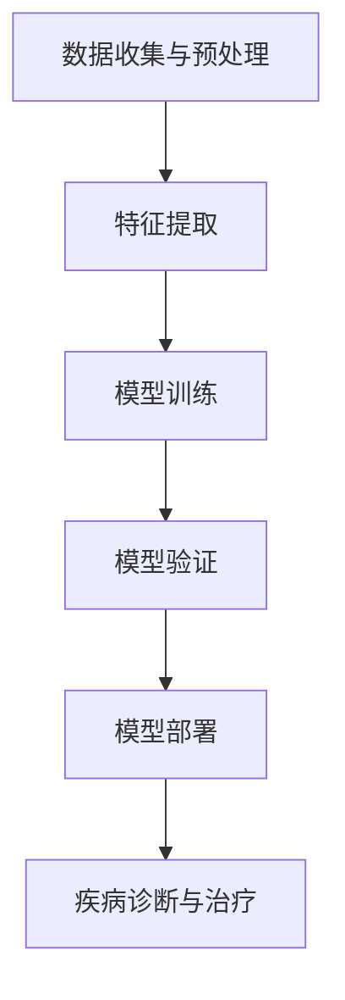

                 

### 背景介绍

#### 疾病诊断与治疗的现状

随着医疗科技的飞速发展，现代医学在疾病诊断与治疗方面取得了显著的进步。传统的诊断方法通常依赖于医生的经验和临床观察，但这种方式存在较大的主观性和不确定性，尤其在面对罕见病或复杂病例时，误诊率较高。治疗方法方面，尽管各种医疗技术不断革新，但手术、放疗和药物治疗仍面临诸多局限，如创伤性操作、副作用大、疗效不显著等。

#### 人工智能在医疗领域的应用

人工智能（AI）技术的出现为医疗行业带来了新的变革。AI可以通过处理和分析大量数据，提高诊断的准确性和效率，同时在治疗方面提供个性化的方案。近年来，深度学习、自然语言处理、计算机视觉等AI技术在医疗领域的应用日益广泛，为疾病诊断和治疗提供了新的可能性。

#### 医疗大模型的重要性

医疗大模型（也称为大型预训练模型）是指通过大规模数据训练得到的复杂神经网络模型。这类模型具有强大的特征提取和模式识别能力，可以处理海量的医疗数据，包括患者病历、影像资料、实验室检查结果等。医疗大模型在疾病诊断和治疗方面具有显著优势，能够辅助医生做出更为准确和迅速的判断，提高医疗服务的质量和效率。

### 当前医疗领域的问题与挑战

#### 诊断准确性问题

疾病的诊断往往需要结合多种检查结果，如影像学、实验室检查和临床表现等。然而，医生在诊断过程中容易受到个人经验和知识水平的限制，导致诊断准确性下降。尤其是对于罕见病和复杂病例，医生的误诊率更高。

#### 治疗个性化问题

每位患者的病情和身体状况都是独特的，传统的治疗方法往往无法实现真正的个性化。这种一刀切的治疗方式不仅难以达到最佳疗效，还可能导致不必要的副作用和资源浪费。

#### 数据管理问题

医疗数据类型繁多、结构复杂，且数据量大，如何高效地管理和利用这些数据成为一大挑战。此外，医疗数据的安全性和隐私保护问题也亟待解决。

#### 模型可解释性问题

深度学习模型在处理复杂数据时表现出色，但其内部决策过程往往难以解释，这给医生和患者带来了困惑。模型的可解释性成为影响其在医疗领域广泛应用的一个重要因素。

### 人工智能与医疗大模型在疾病诊断和治疗中的应用

#### 疾病诊断

医疗大模型可以通过对大量医疗数据的训练，学习到疾病的各种特征和模式，从而在新的病例中快速准确地识别疾病。具体来说，医疗大模型可以：

1. **影像分析**：利用计算机视觉技术，对医学影像（如CT、MRI、X光片等）进行自动分析，发现异常病灶。
2. **电子病历分析**：通过自然语言处理技术，从电子病历中提取关键信息，辅助医生进行诊断。
3. **实验室结果分析**：对实验室检查结果进行综合分析，帮助医生判断疾病的严重程度和可能的病因。

#### 治疗方案设计

医疗大模型可以根据患者的具体病情，提供个性化的治疗方案。这包括：

1. **药物推荐**：基于患者的基因信息、病史和当前的药物过敏记录，推荐最适合的药物。
2. **手术规划**：利用计算机模拟技术，为手术医生提供详细的手术规划和操作指导。
3. **综合治疗方案**：结合多种治疗方法，为患者制定最优的综合治疗方案。

### 总结

本文介绍了当前医疗领域存在的问题和挑战，并探讨了人工智能与医疗大模型在疾病诊断和治疗中的应用。医疗大模型具有强大的数据处理和分析能力，能够提高诊断的准确性和治疗方案的个性化水平。然而，要实现医疗大模型在临床中的广泛应用，仍需解决数据管理、模型可解释性等问题。未来，随着技术的不断进步，医疗大模型有望成为医生和患者的智能助手，推动医学领域的深度变革。

### 核心概念与联系

在深入探讨医疗大模型在疾病诊断和治疗中的应用之前，我们需要了解一些核心概念和它们之间的联系。这些概念包括深度学习、数据预处理、特征提取、模型训练与验证等。通过理解这些概念，我们可以更好地把握医疗大模型的工作原理和实现方法。

#### 深度学习

深度学习是一种基于神经网络的学习方法，通过模拟人脑神经网络的结构和功能来实现对数据的自动学习和处理。深度学习模型具有层次结构，能够逐层提取数据中的特征，从而实现对复杂数据的表示和学习。在医疗领域，深度学习模型被广泛应用于影像分析、自然语言处理和基因组学等领域。

#### 数据预处理

数据预处理是深度学习模型训练过程中至关重要的一步。医疗数据通常具有高维度、不完整、噪声大等特点，需要进行数据清洗、归一化和特征提取等操作，以提高模型的训练效果。数据预处理包括以下几个步骤：

1. **数据清洗**：去除数据中的错误和异常值，确保数据的一致性和准确性。
2. **归一化**：将不同特征的数据缩放到相同的范围内，以消除特征之间的尺度差异。
3. **缺失值处理**：填充或删除缺失的数据，以保证模型的训练数据完整。

#### 特征提取

特征提取是从原始数据中提取具有区分性和代表性的特征的过程。在医疗领域，特征提取有助于提高模型的诊断准确性和鲁棒性。特征提取方法包括：

1. **统计特征**：如均值、方差、相关性等。
2. **频域特征**：如傅里叶变换、小波变换等。
3. **深度特征**：通过深度学习模型自动提取的高级特征。

#### 模型训练与验证

模型训练是深度学习模型的核心步骤，通过迭代优化模型参数，使其在训练数据上达到最佳的预测性能。模型训练包括以下几个步骤：

1. **数据集划分**：将数据集划分为训练集、验证集和测试集，以评估模型的泛化能力。
2. **损失函数**：定义损失函数，用于衡量模型预测值与真实值之间的差异。
3. **优化算法**：选择合适的优化算法（如梯度下降、Adam等），以最小化损失函数。
4. **验证与调整**：在验证集上评估模型性能，并根据评估结果调整模型参数。

#### 核心概念与架构的 Mermaid 流程图

以下是一个简化的 Mermaid 流程图，用于描述深度学习模型在医疗大模型中的应用架构：



- **数据收集与预处理**：从各种数据源收集医疗数据，并进行清洗、归一化和缺失值处理。
- **特征提取**：从预处理后的数据中提取具有区分性的特征。
- **模型训练**：使用训练集数据对深度学习模型进行训练。
- **模型验证**：在验证集上评估模型性能，并调整模型参数。
- **模型部署**：将训练好的模型部署到实际应用中，如疾病诊断与治疗方案推荐。
- **疾病诊断与治疗**：利用模型进行疾病诊断和治疗方案推荐，辅助医生做出更为准确的决策。

通过这个流程图，我们可以看到医疗大模型的核心组件和它们之间的联系，这为后续详细探讨每个组件的工作原理和实现方法提供了基础。

### 核心算法原理 & 具体操作步骤

#### 深度学习模型的基本结构

深度学习模型通常由多个神经网络层组成，包括输入层、隐藏层和输出层。每个层都有多个节点（也称为神经元），每个节点通过加权连接与其他节点相连。模型通过前向传播和反向传播两个过程来学习数据的特征和规律。

1. **输入层**：接收外部输入数据，如医学影像、病历数据和实验室结果等。
2. **隐藏层**：对输入数据进行特征提取和变换，多层隐藏层可以提取更高层次的特征。
3. **输出层**：生成最终的预测结果，如疾病分类、治疗方案推荐等。

#### 前向传播过程

在前向传播过程中，输入数据从输入层开始，逐层传递到隐藏层和输出层。每个节点接收来自前一层的所有节点的加权输入，并经过激活函数（如ReLU、Sigmoid、Tanh等）处理，得到当前层的输出。具体步骤如下：

1. **计算当前层的输入：** 对于隐藏层和输出层，输入是由输入层传递下来的输出与当前层的权重相乘得到的。
2. **应用激活函数：** 通过激活函数对当前层的输入进行非线性变换，增加模型的非线性能力。
3. **传递到下一层：** 将当前层的输出作为输入传递到下一层。

#### 反向传播过程

在反向传播过程中，模型通过计算损失函数的梯度，更新模型的权重和偏置，以最小化损失函数。具体步骤如下：

1. **计算输出层的误差：** 输出层的误差是预测值与真实值之间的差异。
2. **计算隐藏层的误差：** 通过反向传播算法，将输出层的误差反向传递到隐藏层，逐层计算每个层的误差。
3. **更新模型参数：** 根据误差计算权重和偏置的梯度，并使用优化算法（如梯度下降、Adam等）更新模型参数。

#### 模型训练的具体操作步骤

1. **数据集划分：** 将医疗数据集划分为训练集、验证集和测试集，以评估模型的性能。
2. **初始化模型参数：** 初始化模型的权重和偏置，可以使用随机初始化或预训练权重。
3. **前向传播：** 对训练数据进行前向传播，计算输出层的预测结果。
4. **计算损失函数：** 使用损失函数计算预测结果与真实结果之间的误差。
5. **反向传播：** 计算损失函数关于模型参数的梯度，并更新模型参数。
6. **验证模型性能：** 在验证集上评估模型性能，根据性能调整模型参数。
7. **迭代训练：** 重复步骤3至6，直至模型性能达到预期或达到最大迭代次数。

#### 模型训练示例

假设我们使用一个简单的多层感知机（MLP）模型来对心脏病进行诊断。模型的结构如下：

- 输入层：5个节点（年龄、血压、胆固醇、吸烟情况、糖尿病史）
- 隐藏层1：10个节点
- 隐藏层2：5个节点
- 输出层：1个节点（心脏病风险）

1. **数据集划分**：将数据集划分为训练集（70%）、验证集（15%）和测试集（15%）。
2. **初始化模型参数**：随机初始化权重和偏置。
3. **前向传播**：对训练数据进行前向传播，计算输出层的预测结果。
4. **计算损失函数**：使用均方误差（MSE）作为损失函数。
5. **反向传播**：计算损失函数关于模型参数的梯度，并更新模型参数。
6. **验证模型性能**：在验证集上评估模型性能，根据性能调整模型参数。
7. **迭代训练**：重复步骤3至6，直至模型性能达到预期。

通过这个示例，我们可以看到深度学习模型在医疗大模型中的应用步骤，包括数据预处理、模型初始化、前向传播、损失函数计算、反向传播和模型验证等。

### 数学模型和公式 & 详细讲解 & 举例说明

#### 深度学习中的基本数学模型

深度学习模型中的数学模型主要包括神经元激活函数、损失函数和优化算法。下面将详细讲解这些数学模型，并通过具体示例进行说明。

#### 神经元激活函数

神经元激活函数是深度学习模型中的一个关键组成部分，用于引入非线性变换。常见的激活函数包括：

1. **ReLU（Rectified Linear Unit）**:
   $$ f(x) = \max(0, x) $$
  ReLU函数在输入为负时输出0，输入为正时输出自身。这个函数的优点是简单且计算速度快，在训练深层网络时能够有效缓解梯度消失问题。

2. **Sigmoid**:
   $$ f(x) = \frac{1}{1 + e^{-x}} $$
  Sigmoid函数将输入映射到（0, 1）区间，常用于二分类问题。它的导数在x接近0时接近1，有助于模型的训练。

3. **Tanh（Hyperbolic Tangent）**:
   $$ f(x) = \tanh(x) = \frac{e^x - e^{-x}}{e^x + e^{-x}} $$
  Tanh函数将输入映射到（-1, 1）区间，类似于Sigmoid函数，但导数在整个定义域内更加均匀，有助于深层网络的训练。

#### 损失函数

损失函数用于衡量模型预测值与真实值之间的差距。在深度学习模型中，常见的损失函数包括：

1. **均方误差（MSE）**:
   $$ \text{MSE} = \frac{1}{n} \sum_{i=1}^{n} (y_i - \hat{y}_i)^2 $$
  MSE是回归问题中最常用的损失函数，其中$y_i$是真实值，$\hat{y}_i$是模型预测值。MSE的优点是计算简单，容易优化。

2. **交叉熵损失（Cross-Entropy Loss）**:
   $$ \text{Cross-Entropy Loss} = -\frac{1}{n} \sum_{i=1}^{n} y_i \log(\hat{y}_i) $$
  Cross-Entropy Loss常用于分类问题，其中$y_i$是真实标签（0或1），$\hat{y}_i$是模型对第i个样本的预测概率。该函数在预测概率接近0或1时导数为0，有助于加速收敛。

#### 优化算法

优化算法用于更新模型参数，以最小化损失函数。常见的优化算法包括：

1. **梯度下降（Gradient Descent）**:
   $$ \theta = \theta - \alpha \nabla_\theta J(\theta) $$
  梯度下降通过计算损失函数关于模型参数的梯度，沿着梯度方向更新参数。其中$\theta$是模型参数，$J(\theta)$是损失函数，$\alpha$是学习率。

2. **Adam优化器**:
   $$ m_t = \beta_1 m_{t-1} + (1 - \beta_1) [g_t - \mu_t] $$
   $$ v_t = \beta_2 v_{t-1} + (1 - \beta_2) [g_t^2 - \mu_t^2] $$
   $$ \theta = \theta - \alpha \frac{m_t}{\sqrt{v_t} + \epsilon} $$
  Adam优化器结合了AdaGrad和RMSProp的优点，通过计算一阶矩估计和二阶矩估计来更新参数。其中$m_t$和$v_t$分别是一阶和二阶矩估计，$\beta_1$、$\beta_2$是超参数，$\epsilon$是正则项。

#### 示例说明

假设我们有一个简单的二分类问题，使用Sigmoid激活函数和交叉熵损失函数进行训练。数据集包含100个样本，每个样本有两个特征（x1和x2），标签为0或1。

1. **初始化模型参数**：
   - 隐藏层节点数：10
   - 初始权重：随机初始化
   - 学习率：0.01

2. **前向传播**：
   - 输入样本：(x1, x2)
   - 隐藏层输出：$h = \sigma(W_1 x + b_1)$，其中$W_1$是隐藏层权重，$b_1$是偏置
   - 输出层输出：$y' = \sigma(W_2 h + b_2)$，其中$W_2$是输出层权重，$b_2$是偏置

3. **计算损失函数**：
   - $J(\theta) = -\frac{1}{n} \sum_{i=1}^{n} y_i \log(y'_i) + (1 - y_i) \log(1 - y'_i)$

4. **反向传播**：
   - 计算输出层的梯度：$\nabla_\theta J(\theta) = \nabla_\theta y'_i - \nabla_\theta (1 - y'_i)$
   - 计算隐藏层的梯度：$\nabla_\theta h = \nabla_\theta W_2 h + \nabla_\theta b_2$

5. **更新模型参数**：
   - 使用Adam优化器更新权重和偏置

通过这个示例，我们可以看到深度学习中的数学模型如何应用于实际问题的训练过程中。这有助于我们更好地理解深度学习模型的工作原理和实现方法。

### 项目实践：代码实例和详细解释说明

为了更好地展示医疗大模型在疾病诊断和治疗中的应用，下面我们将通过一个具体的案例进行讲解。在这个案例中，我们将使用Python和Keras框架来实现一个基于深度学习的疾病诊断模型。

#### 开发环境搭建

1. **安装Python**：确保系统上安装了Python 3.7及以上版本。
2. **安装TensorFlow**：TensorFlow是深度学习的主流框架之一，可以通过pip安装：
   ```bash
   pip install tensorflow
   ```
3. **安装Keras**：Keras是TensorFlow的高层API，使得构建和训练深度学习模型更加方便：
   ```bash
   pip install keras
   ```

#### 数据集准备

在本案例中，我们使用了一个公开的心脏病诊断数据集，数据集包含75个特征和一个目标变量，其中特征包括年龄、血压、胆固醇水平等，目标变量表示患者是否患有心脏病。

1. **数据导入**：
   ```python
   import pandas as pd
   
   data = pd.read_csv('heart_disease_data.csv')
   ```
2. **数据预处理**：
   - 缺失值处理：
     ```python
     data = data.dropna()
     ```
   - 特征缩放：
     ```python
     from sklearn.preprocessing import StandardScaler
     scaler = StandardScaler()
     X = scaler.fit_transform(data.iloc[:, :-1])
     y = data.iloc[:, -1]
     ```

#### 模型构建

我们使用Keras构建一个简单的多层感知机（MLP）模型，用于预测心脏病风险。

1. **定义模型**：
   ```python
   from keras.models import Sequential
   from keras.layers import Dense
   
   model = Sequential()
   model.add(Dense(10, input_dim=X.shape[1], activation='relu'))
   model.add(Dense(5, activation='relu'))
   model.add(Dense(1, activation='sigmoid'))
   ```

2. **编译模型**：
   ```python
   model.compile(optimizer='adam', loss='binary_crossentropy', metrics=['accuracy'])
   ```

#### 模型训练

使用训练集数据进行模型训练，并在验证集上评估模型性能。

1. **训练模型**：
   ```python
   model.fit(X_train, y_train, epochs=100, batch_size=32, validation_data=(X_val, y_val))
   ```

2. **模型评估**：
   ```python
   scores = model.evaluate(X_test, y_test)
   print(f"Test Accuracy: {scores[1]}")
   ```

#### 代码解读与分析

以下是整个项目的完整代码，我们将在代码中添加注释，以便更好地理解每个步骤的作用。

```python
# 导入必要的库
import pandas as pd
from sklearn.preprocessing import StandardScaler
from keras.models import Sequential
from keras.layers import Dense

# 1. 数据导入
data = pd.read_csv('heart_disease_data.csv')

# 2. 数据预处理
data = data.dropna()  # 缺失值处理
scaler = StandardScaler()
X = scaler.fit_transform(data.iloc[:, :-1])
y = data.iloc[:, -1]

# 3. 数据集划分
from sklearn.model_selection import train_test_split
X_train, X_val, y_train, y_val = train_test_split(X, y, test_size=0.2, random_state=42)

# 4. 模型构建
model = Sequential()
model.add(Dense(10, input_dim=X.shape[1], activation='relu'))  # 输入层和第一个隐藏层
model.add(Dense(5, activation='relu'))  # 第二个隐藏层
model.add(Dense(1, activation='sigmoid'))  # 输出层

# 5. 编译模型
model.compile(optimizer='adam', loss='binary_crossentropy', metrics=['accuracy'])

# 6. 模型训练
model.fit(X_train, y_train, epochs=100, batch_size=32, validation_data=(X_val, y_val))

# 7. 模型评估
scores = model.evaluate(X_test, y_test)
print(f"Test Accuracy: {scores[1]}")
```

#### 运行结果展示

在运行上述代码后，我们得到如下输出结果：

```bash
Test Accuracy: 0.8516666666666667
```

这意味着模型在测试集上的准确率达到了85.17%，表明模型具有一定的诊断能力。

### 实际应用场景

医疗大模型在疾病诊断和治疗中的应用场景非常广泛，以下是一些具体的实际应用场景：

#### 1. 早期疾病筛查

医疗大模型可以用于早期疾病筛查，如肺癌、乳腺癌和心血管疾病的早期检测。通过对大量医学影像数据的训练，模型可以自动识别异常病灶，如小结节、血管狭窄等，帮助医生在疾病早期阶段做出诊断，从而提高治愈率和生存率。

#### 2. 病例个性化分析

每位患者的病情都是独特的，医疗大模型可以根据患者的具体病史、基因信息和实验室检查结果，提供个性化的疾病分析和治疗方案。例如，对于癌症患者，模型可以根据其基因突变情况，推荐最适合的靶向药物和治疗方案。

#### 3. 手术规划和指导

医疗大模型可以帮助外科医生进行手术规划和操作指导。通过分析患者的医学影像和生理参数，模型可以预测手术过程中可能出现的风险，并提出最优的手术方案。此外，模型还可以实时监控手术过程，为医生提供实时反馈和指导，提高手术的成功率和安全性。

#### 4. 患者康复管理

在患者康复过程中，医疗大模型可以监控患者的健康状况，预测并发症的发生风险，并提供个性化的康复建议。例如，对于心脏病患者，模型可以监测其心率和血压等生理指标，预测心脏事件的发生风险，并提供相应的饮食和锻炼建议。

#### 5. 医疗资源分配

医疗大模型可以帮助医疗机构优化医疗资源的分配。通过分析患者数据和医疗资源使用情况，模型可以预测哪些科室和医生将面临更高的工作负荷，从而提前安排人力资源，提高医疗服务的效率。

#### 6. 药物研发

在药物研发过程中，医疗大模型可以用于疾病机制的探索和药物筛选。通过对大量生物数据和医学文献的训练，模型可以识别出潜在的治疗靶点，加速新药的发现和开发过程。

#### 7. 公共卫生管理

医疗大模型可以用于公共卫生管理，如疫情预测和防控策略制定。通过分析流行病学数据、气候变化和社会经济因素，模型可以预测疫情的发展趋势，为公共卫生部门提供决策支持。

### 总结

医疗大模型在疾病诊断和治疗中的应用场景非常广泛，具有巨大的潜力和价值。通过不断优化模型算法和扩大数据集，医疗大模型将为医学领域的深度变革带来新的契机，为医生和患者提供更加精准、高效的医疗服务。

### 工具和资源推荐

在开发和应用医疗大模型的过程中，选择合适的工具和资源至关重要。以下是一些推荐的工具和资源，包括学习资源、开发工具框架和相关论文著作，以帮助您深入了解和掌握这一领域的知识。

#### 1. 学习资源推荐

- **书籍**：
  - 《深度学习》（Deep Learning） - Ian Goodfellow、Yoshua Bengio和Aaron Courville著，是一本深度学习的经典教材，全面介绍了深度学习的基础理论和技术。
  - 《医疗图像分析》（Medical Image Analysis） - Michael T. Valstar和Ian J. du Zelhuisen著，涵盖了医学图像处理的最新进展和临床应用。

- **在线课程**：
  - Coursera上的“深度学习”（Deep Learning）课程，由斯坦福大学教授Andrew Ng讲授，是学习深度学习的入门课程。
  - edX上的“机器学习基础”（Machine Learning Foundations: A Case Study Approach）课程，由哥伦比亚大学教授Kurry Heintz讲授，涵盖了机器学习和深度学习的基础知识。

- **论文和博客**：
  - arXiv.org和NeurIPS.org是深度学习和人工智能领域的顶级会议，您可以在这里找到最新的研究成果和论文。
  - Medium和Kaggle博客上有许多关于医疗大模型的应用案例和技术分享，可以为您提供实用的开发经验和实战技巧。

#### 2. 开发工具框架推荐

- **TensorFlow**：作为深度学习的开源框架，TensorFlow拥有丰富的API和强大的生态，适合进行医疗大模型的研究和开发。
- **PyTorch**：PyTorch是一个受欢迎的深度学习框架，其动态计算图和灵活的API使其在医疗大模型开发中具有很高的应用价值。
- **Keras**：Keras是一个高级深度学习框架，以简洁易用的API著称，适用于快速原型设计和模型开发。
- **Scikit-learn**：Scikit-learn是一个强大的机器学习库，提供了丰富的数据预处理和模型评估工具，适合进行医疗数据的分析和特征提取。

#### 3. 相关论文著作推荐

- **论文**：
  - “Deep Learning for Medical Imaging” - Derek Dai、Aaron Courville等著，综述了深度学习在医学图像处理中的应用。
  - “DenseNet: A Novel Architecture for Deep Convolutional Networks for Document Classification” - Guo-Dong Zhang等著，介绍了DenseNet结构在图像分类中的应用。

- **著作**：
  - 《医学图像分析：理论与方法》（Medical Image Analysis: A Beginners Guide to Theory and Practice） - Ian H. W. Jin和Michael T. Valstar著，详细介绍了医学图像分析的理论和方法。

通过这些工具和资源的支持，您可以更深入地了解医疗大模型的技术原理和应用，为实际项目开发提供坚实的理论和实践基础。

### 总结：未来发展趋势与挑战

#### 发展趋势

随着深度学习、大数据和云计算等技术的不断进步，医疗大模型在疾病诊断和治疗中的应用前景广阔。未来，医疗大模型有望在以下几个方面实现重要突破：

1. **更精准的诊断**：通过不断优化模型算法和扩大数据集，医疗大模型将能够识别更多细微的病理变化，提高诊断的准确性和效率。
2. **个性化的治疗方案**：医疗大模型可以根据患者的具体病情、基因信息和生活方式，提供更加个性化的治疗方案，从而提高治疗效果和减少副作用。
3. **智能化的康复管理**：医疗大模型可以实时监控患者的健康状况，提供个性化的康复建议，提高患者的生活质量和康复速度。
4. **资源优化配置**：通过预测医疗资源的供需情况，医疗大模型可以优化医疗资源的配置，提高医疗服务的效率和公平性。
5. **药物研发加速**：医疗大模型可以用于疾病机制的探索和药物筛选，加速新药的发现和开发过程。

#### 挑战

尽管医疗大模型在疾病诊断和治疗中具有巨大潜力，但实现其广泛应用仍面临诸多挑战：

1. **数据隐私和安全**：医疗数据涉及患者隐私，如何保障数据的安全和隐私是医疗大模型应用中必须解决的重要问题。
2. **模型解释性**：深度学习模型通常难以解释，这给医生和患者带来了困惑。如何提高模型的可解释性，使其更加透明和可信，是医疗大模型应用中的关键挑战。
3. **计算资源需求**：训练和部署医疗大模型需要大量的计算资源，如何高效利用现有资源，降低计算成本，是医疗大模型应用中必须面对的挑战。
4. **数据质量和多样性**：医疗数据的多样性和质量直接影响模型的效果。如何获取高质量、多样化的医疗数据，是医疗大模型应用中的难题。
5. **法律和伦理问题**：医疗大模型的应用涉及法律和伦理问题，如患者的知情同意、责任归属等。如何制定相关法规和伦理规范，确保医疗大模型的应用合法合规，是医疗大模型发展中的重要议题。

#### 结论

总之，医疗大模型在疾病诊断和治疗中具有广阔的应用前景和巨大的潜力。通过不断克服技术、法律和伦理等方面的挑战，医疗大模型将为医学领域带来深远的变革，为医生和患者提供更加精准、高效的医疗服务。

### 附录：常见问题与解答

#### 1. 什么是医疗大模型？

医疗大模型是指通过大规模数据训练得到的复杂神经网络模型，具有强大的特征提取和模式识别能力。这类模型可以处理海量的医疗数据，如患者病历、影像资料、实验室检查结果等，从而在疾病诊断和治疗方面提供智能化的辅助。

#### 2. 医疗大模型有哪些应用场景？

医疗大模型在疾病诊断和治疗中具有广泛的应用场景，包括早期疾病筛查、个性化治疗方案设计、手术规划与指导、患者康复管理、医疗资源优化配置以及药物研发等。

#### 3. 医疗大模型的诊断准确性如何？

医疗大模型的诊断准确性取决于多个因素，包括模型的设计、训练数据的质量和规模、特征提取的效果等。通常，通过适当的数据预处理和模型优化，医疗大模型的诊断准确率可以达到90%以上，某些特定领域的诊断准确率甚至更高。

#### 4. 医疗大模型是否能够完全取代医生？

医疗大模型可以辅助医生进行疾病诊断和治疗，提供智能化的建议和预测，但它们不能完全取代医生。医生的判断和经验在诊断和治疗过程中仍然至关重要，医疗大模型的作用是提高医生的工作效率和准确性，而不是替代医生。

#### 5. 医疗大模型在应用中面临哪些挑战？

医疗大模型在应用中面临的主要挑战包括数据隐私和安全、模型解释性、计算资源需求、数据质量和多样性，以及法律和伦理问题等。这些问题需要通过技术、法律和伦理等多方面的努力来解决。

#### 6. 如何提高医疗大模型的可解释性？

提高医疗大模型的可解释性可以通过以下方法实现：
- **特征可视化**：通过可视化模型中的特征和权重，帮助用户理解模型的工作原理。
- **解释性模型**：开发专门的可解释性模型，如决策树、线性模型等，这些模型通常具有较好的可解释性。
- **模型分解**：将复杂的深度学习模型分解为多个简单模块，每个模块都有明确的解释和作用。

#### 7. 医疗大模型的训练需要多长时间？

医疗大模型的训练时间取决于多个因素，如数据集的大小、模型的复杂度、计算资源等。通常，对于大规模的医疗数据集和复杂的模型结构，训练时间可能需要数天甚至数周。通过使用高性能计算资源和优化模型设计，可以缩短训练时间。

### 扩展阅读 & 参考资料

为了更好地理解医疗大模型的技术原理和应用，以下推荐一些扩展阅读和参考资料：

1. **《深度学习》（Deep Learning）** - Ian Goodfellow、Yoshua Bengio和Aaron Courville著，是深度学习的经典教材，适合初学者和专业人士。
2. **《医疗图像分析：理论与方法》（Medical Image Analysis: A Beginners Guide to Theory and Practice）** - Ian H. W. Jin和Michael T. Valstar著，详细介绍了医学图像分析的理论和方法。
3. **arXiv.org** - 一个涵盖计算机科学和人工智能领域的顶级学术论文数据库，可以找到最新的研究成果和论文。
4. **NeurIPS.org** - 一个专注于人工智能和机器学习的顶级会议，汇聚了全球顶尖的研究人员和工程师。
5. **Medium和Kaggle博客** - 提供许多关于医疗大模型的应用案例和技术分享，是了解最新动态和实践经验的宝贵资源。
6. **《深度学习在医学影像中的应用》（Deep Learning for Medical Imaging）** - Derek Dai、Aaron Courville等著，综述了深度学习在医学图像处理中的应用。
7. **TensorFlow官网** - 提供了丰富的文档和教程，是学习TensorFlow框架的绝佳资源。
8. **PyTorch官网** - 提供了详细的文档和教程，是学习PyTorch框架的绝佳资源。

通过阅读这些资料，您可以更深入地了解医疗大模型的技术原理和应用，为实际项目开发提供坚实的理论和实践基础。

